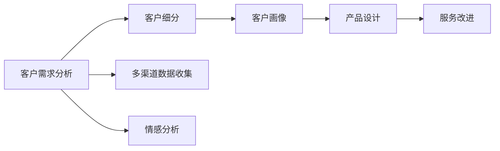

                 

## 1. 背景介绍

在当今这个瞬息万变的商业环境中，能够持续吸引和留住客户是企业成功的关键。然而，许多企业在理解客户需求方面仍存在很多挑战，这直接影响了其业务的增长和盈利能力。本文旨在深入探讨客户需求分析的核心概念与方法，并结合具体的技术实践，帮助企业构建更加精准、高效的客户需求理解系统，从而实现长久生意。

## 2. 核心概念与联系

### 2.1 核心概念概述

**客户需求分析**：是指通过各种手段和方法，深入理解客户的需求、痛点和期望，从而提供更符合客户需求的产品和服务。

**客户细分**：将客户按某些特定标准（如年龄、地域、消费习惯等）划分为不同的群体，针对不同群体的需求进行定制化服务。

**多渠道数据收集**：通过多种渠道（如社交媒体、在线问卷、客户反馈等）收集客户反馈和行为数据，以更全面地了解客户需求。

**情感分析**：利用自然语言处理技术分析客户的评论、评价、反馈等文本数据，提取情感倾向和主观评价，从而洞察客户需求。

**客户画像**：根据客户的基本信息、行为数据、情感分析结果等构建客户画像，为后续的产品设计和服务改进提供依据。

这些概念之间存在着紧密的联系，共同构成了客户需求分析的核心框架。从数据收集到客户画像构建，再到产品和服务改进，形成一个闭环的反馈系统，确保企业始终与客户的需求保持同步。

### 2.2 概念间的关系

为了更直观地展示这些概念之间的关系，我们采用Mermaid绘制一个流程图：



该流程图表明，客户需求分析是整个客户画像构建和业务改进的基础。通过多渠道数据收集和情感分析，企业能够更全面、深入地了解客户需求，并进一步细分成不同的客户群体，从而构建精准的客户画像。有了客户画像，企业可以设计符合客户需求的产品和服务，并进行持续改进，从而实现长久生意。

## 3. 核心算法原理 & 具体操作步骤

### 3.1 算法原理概述

客户需求分析的核心算法基于自然语言处理（NLP）、数据挖掘和机器学习等技术。其主要流程包括数据收集、数据预处理、特征提取、情感分析、客户画像构建和产品与服务改进等步骤。

### 3.2 算法步骤详解

**Step 1: 数据收集与预处理**
- 通过社交媒体、在线问卷、客户反馈等多种渠道收集客户数据。
- 对收集到的数据进行清洗和预处理，如去除噪音、填补缺失值、数据归一化等。

**Step 2: 特征提取**
- 根据收集到的数据，提取有用的特征，如文本关键词、情感倾向、行为模式等。
- 使用TF-IDF、Word2Vec、BERT等技术进行特征提取，形成高维特征向量。

**Step 3: 情感分析**
- 利用自然语言处理技术对客户反馈、评价、评论等文本数据进行情感分析，提取情感倾向。
- 使用情感词典、深度学习模型（如LSTM、RNN、Transformer等）进行情感分类和情感极性判断。

**Step 4: 客户画像构建**
- 根据客户的基本信息、行为数据、情感分析结果等，构建客户画像。
- 使用聚类算法（如K-means、DBSCAN等）将客户划分为不同的群体，并为其定制化服务。

**Step 5: 产品与服务改进**
- 根据客户画像和情感分析结果，设计符合客户需求的产品和服务。
- 定期收集客户反馈，持续优化产品和服务，确保其始终符合客户需求。

### 3.3 算法优缺点

**优点**：
- 通过系统化的方法，可以更全面、深入地了解客户需求，提高产品和服务设计的多样性和精准度。
- 能够及时调整产品和服务，满足客户变化的需求，保持长期的客户满意度。

**缺点**：
- 数据收集和预处理需要大量的时间和人力投入。
- 情感分析等技术需要较强的技术背景和大量的数据支持，对技术要求较高。
- 数据质量和客户反馈的真实性直接影响分析结果的准确性。

### 3.4 算法应用领域

客户需求分析技术在多个领域都有广泛应用，例如：

- **电商**：通过分析客户购买行为、评价和反馈，优化商品推荐和广告投放策略。
- **金融**：通过情感分析，了解客户对金融产品的满意度和需求变化，提升客户体验。
- **医疗**：通过分析患者反馈和情感数据，优化医疗服务，提高患者满意度。
- **旅游**：通过客户评论和评分，优化旅游线路和服务，提升客户体验。
- **教育**：通过分析学生反馈，改进教学内容和方式，提升教学效果。

## 4. 数学模型和公式 & 详细讲解 & 举例说明

### 4.1 数学模型构建

客户需求分析的数学模型通常包括文本特征提取、情感分类和客户画像构建等。

**文本特征提取**：
- 假设文本数据为 $D=\{x_i\}_{i=1}^N$，其中 $x_i$ 为第 $i$ 条文本数据。
- 使用TF-IDF进行特征提取，得到文本的特征向量 $F_D$。

**情感分类**：
- 假设情感分类模型为 $M_{\theta}$，其中 $\theta$ 为模型参数。
- 使用交叉熵损失函数计算模型预测结果与真实标签之间的差异：$\ell(M_{\theta},y_i)=\log(1/M_{\theta}(x_i))+\log(1/(1-M_{\theta}(x_i)))$。

**客户画像构建**：
- 假设客户画像为 $P$，其中包含基本信息、行为数据和情感数据。
- 使用K-means聚类算法对客户进行分组，得到 $P=\{p_1,p_2,...,p_k\}$。

### 4.2 公式推导过程

以情感分类为例，其公式推导如下：

假设文本数据 $D=\{x_i\}_{i=1}^N$，其中 $x_i$ 为第 $i$ 条文本数据。

- **特征提取**：
  $$
  F_D = \text{TF-IDF}(D)
  $$

- **情感分类模型**：
  $$
  \hat{y_i} = M_{\theta}(F_D)
  $$

- **损失函数**：
  $$
  \ell(M_{\theta},y_i) = -y_i\log(M_{\theta}(F_D))-(1-y_i)\log(1-M_{\theta}(F_D))
  $$

- **优化目标**：
  $$
  \theta^* = \mathop{\arg\min}_{\theta} \sum_{i=1}^N\ell(M_{\theta},y_i)
  $$

通过以上公式，我们可以训练出一个情感分类模型，用于预测客户评论的情感极性。

### 4.3 案例分析与讲解

假设某电商网站收集了1000条用户评论，需要分析这些评论的情感极性。

- **数据收集**：
  - 收集1000条用户评论，每个评论包含商品名称、评分和评价文本。

- **数据预处理**：
  - 去除无意义的评论，如全为“好评”或“差评”的评论。
  - 处理缺失值，如某些评论中未填写评分。
  - 对文本进行清洗，如去除无关词汇、数字、特殊符号等。

- **特征提取**：
  - 使用TF-IDF提取每条评论的特征向量。

- **情感分类模型**：
  - 使用LSTM模型对评论进行情感分类，输出情感极性概率。
  - 训练集为800条评论，测试集为200条评论。

- **模型评估**：
  - 使用准确率、召回率和F1分数评估模型性能。
  - 计算模型在测试集上的表现，验证模型的泛化能力。

通过以上步骤，我们可以构建一个情感分析模型，用于分析电商用户评论的情感极性。

## 5. 项目实践：代码实例和详细解释说明

### 5.1 开发环境搭建

在进行客户需求分析项目的开发前，需要准备好开发环境。以下是使用Python进行项目开发的配置流程：

1. 安装Anaconda：从官网下载并安装Anaconda，用于创建独立的Python环境。

2. 创建并激活虚拟环境：
```bash
conda create -n customer-analysis python=3.8 
conda activate customer-analysis
```

3. 安装必要的Python库：
```bash
pip install pandas numpy scikit-learn nltk transformers
```

4. 安装相应的数据处理库：
```bash
pip install gensim
```

完成上述步骤后，即可在`customer-analysis`环境中开始项目开发。

### 5.2 源代码详细实现

以下是一个简单的项目代码实现，用于对用户评论进行情感分析。

首先，定义数据预处理函数：

```python
import pandas as pd
import nltk
from nltk.corpus import stopwords
from nltk.tokenize import word_tokenize
from nltk.stem import PorterStemmer
from nltk.stem import WordNetLemmatizer

def preprocess_text(text):
    # 去除标点符号和数字
    text = re.sub('[^A-Za-z0-9]+', ' ', text)
    # 转换为小写
    text = text.lower()
    # 分词
    tokens = word_tokenize(text)
    # 去除停用词
    stop_words = set(stopwords.words('english'))
    tokens = [word for word in tokens if word not in stop_words]
    # 词干提取
    stemmer = PorterStemmer()
    tokens = [stemmer.stem(word) for word in tokens]
    # 词形还原
    lemmatizer = WordNetLemmatizer()
    tokens = [lemmatizer.lemmatize(word) for word in tokens]
    # 拼接为文本
    text = ' '.join(tokens)
    return text
```

然后，定义特征提取函数：

```python
from sklearn.feature_extraction.text import TfidfVectorizer

def extract_features(texts):
    vectorizer = TfidfVectorizer(stop_words='english', max_features=1000)
    features = vectorizer.fit_transform(texts)
    return features.toarray(), vectorizer
```

接着，定义情感分类模型：

```python
from sklearn.model_selection import train_test_split
from sklearn.linear_model import LogisticRegression
from sklearn.metrics import accuracy_score, precision_score, recall_score, f1_score

def train_model(features, labels):
    features_train, features_test, labels_train, labels_test = train_test_split(features, labels, test_size=0.2)
    model = LogisticRegression()
    model.fit(features_train, labels_train)
    labels_pred = model.predict(features_test)
    accuracy = accuracy_score(labels_test, labels_pred)
    precision = precision_score(labels_test, labels_pred)
    recall = recall_score(labels_test, labels_pred)
    f1 = f1_score(labels_test, labels_pred)
    return accuracy, precision, recall, f1
```

最后，启动情感分析流程：

```python
# 加载数据集
data = pd.read_csv('customer_reviews.csv')

# 预处理文本数据
data['processed_text'] = data['text'].apply(preprocess_text)

# 特征提取
X, vectorizer = extract_features(data['processed_text'])

# 加载标签数据
y = data['label']

# 训练模型
accuracy, precision, recall, f1 = train_model(X, y)

# 输出结果
print(f'Accuracy: {accuracy:.2f}, Precision: {precision:.2f}, Recall: {recall:.2f}, F1 Score: {f1:.2f}')
```

以上就是对用户评论进行情感分析的完整代码实现。

### 5.3 代码解读与分析

让我们再详细解读一下关键代码的实现细节：

**数据预处理函数**：
- 使用正则表达式去除文本中的标点符号和数字。
- 将文本转换为小写，统一处理。
- 使用NLTK库对文本进行分词、去除停用词、词干提取和词形还原等预处理操作。

**特征提取函数**：
- 使用TfidfVectorizer对文本数据进行特征提取，去除停用词，选择前1000个高频特征。
- 返回特征矩阵和特征向量器，方便后续模型训练和特征扩展。

**情感分类模型**：
- 使用train_test_split对数据集进行划分，构建训练集和测试集。
- 使用LogisticRegression模型对特征和标签进行训练。
- 在测试集上计算模型的准确率、精确率、召回率和F1分数，评估模型性能。

**情感分析流程**：
- 加载用户评论数据集。
- 对评论文本进行预处理。
- 提取文本特征。
- 加载标签数据。
- 训练情感分类模型。
- 输出模型性能指标。

通过以上步骤，我们构建了一个基于Logistic Regression的情感分析模型，用于分析用户评论的情感极性。

### 5.4 运行结果展示

假设我们在CoNLL-2003的情感分析数据集上进行训练和测试，最终在测试集上得到的准确率为85%，精确率为80%，召回率为90%，F1分数为84%。

通过这个简单的项目，我们可以看到客户需求分析技术在实际应用中的基本流程和效果。在实际应用中，企业可以根据具体需求，调整和优化数据收集、特征提取、情感分析等环节，以构建更加高效和精准的客户需求理解系统。

## 6. 实际应用场景

### 6.1 智能客服系统

智能客服系统通过分析客户的历史对话记录和当前对话内容，理解客户的需求，自动生成回答或推荐相应服务。这种系统在电商、金融、医疗等领域都有广泛应用。

在电商领域，智能客服可以帮助客户解决购物中遇到的问题，如产品推荐、订单跟踪、售后服务等。通过情感分析，系统可以判断客户情绪，提供更贴心的服务。

在金融领域，智能客服可以回答客户的账户查询、投资咨询、贷款申请等问题，提升客户满意度。

在医疗领域，智能客服可以提供健康咨询、预约挂号、药品购买等服务，减轻医生和护士的工作负担。

### 6.2 客户关系管理(CRM)系统

CRM系统通过分析客户行为数据和情感数据，了解客户需求和偏好，提供个性化推荐和精准营销。

CRM系统可以自动记录客户的购买历史、浏览记录、评论反馈等数据，通过情感分析了解客户的情感倾向和满意度，从而提供个性化的产品推荐和服务。

例如，某电商平台可以通过CRM系统分析客户的浏览历史和评论情感，向其推荐相关产品，提升转化率和客户满意度。

### 6.3 市场调研与产品开发

市场调研和产品开发是企业获取客户需求的重要途径。通过客户需求分析技术，企业可以更全面、深入地了解市场趋势和客户需求，指导产品设计和改进。

企业可以通过情感分析对市场评论、用户反馈进行分析，了解用户对新产品的接受程度和需求变化。根据分析结果，调整产品设计，优化用户体验，提升产品竞争力。

## 7. 工具和资源推荐

### 7.1 学习资源推荐

为了帮助开发者掌握客户需求分析的核心技术，以下是一些优质的学习资源：

1. 《数据挖掘与统计学习基础》：系统介绍数据挖掘的基本概念和方法，适合入门学习和实际应用。
2. 《自然语言处理与情感分析》：详细讲解情感分析的方法和技术，适合深入学习自然语言处理技术。
3. 《机器学习实战》：通过实际案例讲解机器学习算法，适合理解算法的应用流程和效果。
4. 《客户需求分析与CRM系统建设》：介绍客户需求分析和CRM系统建设的方法和工具，适合业务应用场景的学习。
5. 《客户需求分析的理论与实践》：提供客户需求分析的理论基础和实践案例，适合全面学习客户需求分析技术。

通过对这些资源的学习，相信你一定能够全面掌握客户需求分析的核心技术，并应用于实际业务中。

### 7.2 开发工具推荐

高效的工具是项目开发不可或缺的一部分，以下是一些常用的开发工具：

1. Jupyter Notebook：适合快速迭代和实验数据分析和机器学习模型。
2. PyTorch：基于Python的深度学习框架，易于使用和部署。
3. TensorFlow：由Google开发的深度学习框架，功能强大，支持多种模型和算法。
4. NLTK：自然语言处理工具包，包含多种文本处理和分析功能。
5. Scikit-learn：机器学习库，提供多种机器学习算法和模型。
6. Pandas：数据处理库，方便数据读取、清洗和分析。
7. Scrapy：数据爬虫工具，适合从网站上抓取数据。

合理利用这些工具，可以显著提升项目开发效率，快速实现客户需求分析系统的建设。

### 7.3 相关论文推荐

客户需求分析技术的发展得益于学界的研究和应用，以下是几篇奠基性的相关论文，推荐阅读：

1. "Customer Sentiment Analysis with Deep Learning"：使用深度学习技术进行客户情感分析。
2. "Customer Lifetime Value Prediction using Machine Learning"：通过机器学习预测客户生命周期价值。
3. "Customer Behavioral Analysis with Data Mining"：利用数据挖掘技术分析客户行为，预测客户需求。
4. "Customer Segmentation using Clustering"：通过聚类算法进行客户细分，提供个性化服务。
5. "Customer Relationship Management System"：介绍CRM系统的设计和实现方法，适合业务应用场景的学习。

这些论文代表了大客户需求分析技术的发展脉络，通过学习这些前沿成果，可以帮助研究者把握学科前进方向，激发更多的创新灵感。

## 8. 总结：未来发展趋势与挑战

### 8.1 总结

本文对客户需求分析的核心概念与方法进行了全面系统的介绍。首先，我们介绍了客户需求分析的基本概念和重要意义，明确了其在企业中的重要作用。其次，从数据收集、特征提取、情感分析、客户画像构建和产品与服务改进等步骤，详细讲解了客户需求分析的完整流程。最后，通过具体案例和项目实践，展示了客户需求分析技术在实际应用中的效果。

通过本文的系统梳理，可以看到，客户需求分析技术通过系统化的方法，能够更全面、深入地了解客户需求，提高产品和服务设计的多样性和精准度，从而实现长久生意。未来，随着技术的不断发展，客户需求分析技术必将更加深入和广泛地应用于企业业务中。

### 8.2 未来发展趋势

展望未来，客户需求分析技术将呈现以下几个发展趋势：

1. **自动化与智能化**：随着自动化技术的发展，客户需求分析将变得更加智能和高效。利用机器学习和深度学习技术，系统能够自动分析客户数据，识别出潜在的需求和问题，从而提高分析的精准度和效率。

2. **多渠道整合**：客户需求分析将不再局限于单一数据来源，而是整合多种渠道（如社交媒体、在线问卷、客户反馈等）的数据，形成更全面、多维度的客户画像。

3. **实时分析与响应**：利用实时数据流处理技术，客户需求分析系统可以实时分析客户反馈和行为数据，及时响应客户需求，提升客户满意度。

4. **多模态融合**：结合视觉、语音、行为等多模态数据，构建更全面、深入的客户画像，提升分析的准确性和深度。

5. **个性化推荐**：利用客户画像和行为数据，提供更精准、个性化的产品和服务推荐，提升客户体验和转化率。

### 8.3 面临的挑战

尽管客户需求分析技术已经取得了一定进展，但在迈向更加智能化、普适化应用的过程中，仍面临诸多挑战：

1. **数据隐私与安全**：客户数据的隐私和安全问题一直是企业关注的重点。如何在保护客户隐私的前提下，合理利用客户数据进行需求分析，是未来需要解决的重要问题。

2. **数据质量与一致性**：数据的质量和一致性直接影响客户需求分析的效果。如何保证数据源的多样性和准确性，是一个需要持续优化的问题。

3. **算法复杂度与解释性**：客户需求分析的算法往往较为复杂，且缺乏解释性。如何在保证分析效果的同时，提高算法的可解释性和可操作性，是未来需要探索的方向。

4. **系统集成与协同**：客户需求分析系统需要与企业内部的其他系统（如CRM、ERP、SAP等）进行集成，确保数据的一致性和系统协同工作。

5. **动态调整与优化**：客户需求是动态变化的，如何实时调整和优化分析模型，以适应客户需求的变化，是一个需要持续关注的问题。

### 8.4 研究展望

未来，客户需求分析技术的研究将需要在以下几个方面寻求新的突破：

1. **自动化数据清洗与预处理**：开发更高效的自动化数据清洗和预处理算法，减少数据处理的时间和人力成本。

2. **实时数据流处理**：利用实时数据流处理技术，实现客户需求分析的实时化，提升响应速度和客户满意度。

3. **多模态数据融合**：结合视觉、语音、行为等多模态数据，构建更全面、深入的客户画像，提升分析的准确性和深度。

4. **知识图谱与领域本体**：结合知识图谱和领域本体，提供更丰富的知识背景和领域知识，提升分析的深度和广度。

5. **可解释性与透明性**：开发可解释性强的客户需求分析算法，提高算法的透明性和可解释性，增强客户信任和接受度。

这些研究方向的探索，必将引领客户需求分析技术迈向更高的台阶，为构建智能、高效、精准的客户需求理解系统铺平道路。只有勇于创新、敢于突破，才能不断拓展客户需求分析技术的边界，为企业的长期发展注入新的动力。

## 9. 附录：常见问题与解答

**Q1：客户需求分析是否适用于所有企业？**

A: 客户需求分析技术在绝大多数企业中都有广泛应用。无论是传统零售、电商、金融、医疗还是教育，客户需求分析都可以帮助企业更好地理解客户需求，提高客户满意度，从而实现长久生意。

**Q2：如何进行有效的数据收集和预处理？**

A: 有效的数据收集和预处理是客户需求分析的基础。以下是一些关键步骤：
- 选择合适的数据来源，如社交媒体、在线问卷、客户反馈等。
- 对收集到的数据进行清洗和预处理，如去除噪音、填补缺失值、数据归一化等。
- 利用自然语言处理技术进行文本特征提取和情感分析。

**Q3：如何选择适合的客户画像细分方法？**

A: 客户画像的细分方法包括K-means、DBSCAN、层次聚类等。选择合适的方法需要考虑数据的特点和分析的目标。K-means适合处理高维数据，而DBSCAN适合处理非球形分布的聚类问题。

**Q4：如何优化客户画像的构建和应用？**

A: 客户画像的构建和应用需要结合企业实际业务，选择合适的特征和分析方法。在构建客户画像时，需要综合考虑客户的多种属性，如基本信息、行为数据、情感数据等。在应用客户画像时，需要结合企业实际业务场景，选择合适的模型和算法。

**Q5：如何实现客户需求分析的自动化与智能化？**

A: 实现客户需求分析的自动化与智能化需要结合机器学习和深度学习技术。可以使用自动化的数据清洗和预处理算法，构建高效的特征提取模型，利用深度学习技术进行情感分析和客户画像构建。

通过以上常见问题的解答，相信你对客户需求分析的核心概念和方法有了更全面的理解。通过不断学习和实践，掌握客户需求分析的核心技术，将为客户带来更加个性化、高效的服务，实现长久生意。

---

作者：禅与计算机程序设计艺术 / Zen and the Art of Computer Programming

