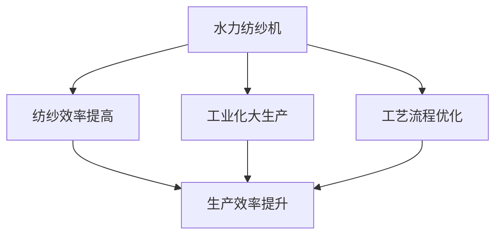

                 

# 阿克莱特的纺织机械创新

## 1. 背景介绍

### 1.1 问题由来
在工业革命初期，纺织业是英国的重要产业之一，但当时的生产方式较为落后，手工操作的效率低下。18世纪末，英国工业家理查德·阿克赖特（Richard Arkwright）为了提高生产效率，决定发明一种新的纺织机械。这一创新不仅推动了纺织产业的飞速发展，还为其他工业机械的发展奠定了基础。

### 1.2 问题核心关键点
阿克莱特的创新主要体现在以下两个方面：
1. 设计和制造了水力纺纱机，极大地提高了纺纱效率。
2. 通过改进工艺流程，降低了生产成本，促进了工业化大生产的形成。

### 1.3 问题研究意义
阿克莱特的创新不仅对纺织业产生了深远影响，还引发了后续一系列的工业机械创新，促进了工业革命的进程。他的成功为其他工业家提供了宝贵的经验和启示，推动了技术的不断进步和产业的发展。

## 2. 核心概念与联系

### 2.1 核心概念概述

阿克莱特的纺织机械创新涉及以下几个核心概念：

- 水力纺纱机：一种利用水力驱动的纺纱机器，由水轮机、纺纱机头、纱线卷绕器等部分组成。
- 工业化大生产：通过机械化生产，将劳动分工细化，提高生产效率，降低生产成本。
- 工艺流程优化：通过改进和整合生产流程，提高生产效率，降低生产成本。
- 效率与成本平衡：在提高生产效率的同时，确保生产成本的可控性。

这些概念之间相互关联，共同构成了阿克莱特纺织机械创新的核心内容。

### 2.2 概念间的关系

阿克莱特的纺织机械创新主要通过以下步骤实现：

1. 通过水力纺纱机提高了纺纱效率。
2. 通过改进工艺流程降低了生产成本。
3. 通过工业化大生产提升了生产效率。

这些步骤相互作用，推动了纺织产业的进步。

### 2.3 核心概念的整体架构

以下是一个综合性的流程图，展示了阿克莱特纺织机械创新的核心概念及其之间的关系：



这个流程图展示了阿克莱特纺织机械创新的主要流程：

1. 设计并制造水力纺纱机，提高了纺纱效率。
2. 通过改进工艺流程，降低了生产成本。
3. 实现工业化大生产，进一步提升生产效率。

## 3. 核心算法原理 & 具体操作步骤
### 3.1 算法原理概述

阿克莱特的纺织机械创新主要基于以下两个算法原理：

1. 通过水力驱动的机械设计，实现了高效的纺纱过程。
2. 通过优化生产流程，降低了生产成本，提升了生产效率。

### 3.2 算法步骤详解

以下是阿克莱特纺织机械创新的详细步骤：

**Step 1: 研究和设计水力纺纱机**
- 分析手工纺纱的流程，找出生产效率低下的瓶颈。
- 研究水力驱动机制，设计水轮机和纺纱机头。
- 测试和优化水力纺纱机的性能。

**Step 2: 改进生产工艺流程**
- 优化纺纱流程，减少废线和断线率。
- 设计合理的纱线卷绕器和纱线轴，提高纺纱效率。
- 使用新型材料和技术，降低生产成本。

**Step 3: 实现工业化大生产**
- 引入机器操作员，统一操作标准。
- 建立生产线，实现流水作业。
- 增加生产设备和人员，提高生产规模。

**Step 4: 评估和优化**
- 在实际生产中，收集数据，评估水力纺纱机的效率和成本。
- 根据评估结果，进行持续改进和优化。
- 推广应用，扩大生产规模。

### 3.3 算法优缺点

阿克莱特的纺织机械创新有以下优点：
1. 大幅提高了纺纱效率，缩短了生产周期。
2. 通过优化工艺流程，降低了生产成本。
3. 推动了工业化大生产的发展。

同时，也存在以下缺点：
1. 需要大量的初始投资和设备。
2. 机械故障和维护成本较高。
3. 对操作人员的技能要求较高。

### 3.4 算法应用领域

阿克莱特的纺织机械创新主要应用于以下领域：

- 纺织工业：大幅提升了纺纱和织布的生产效率。
- 制造业：推广了机械化大生产的理念。
- 其他工业领域：提供了机械设计和工艺流程优化的经验和参考。

## 4. 数学模型和公式 & 详细讲解

### 4.1 数学模型构建

阿克莱特的纺织机械创新涉及以下几个数学模型：

1. 水力纺纱机的效率模型：描述水力纺纱机的生产效率与水流速度、纺纱速度、纱线厚度等参数的关系。
2. 生产成本模型：描述生产成本与原材料、人工、设备维护等成本的关系。
3. 生产效率模型：描述生产效率与设备数量、操作人员数量、工艺流程优化程度的关系。

### 4.2 公式推导过程

以水力纺纱机的效率模型为例，推导其数学表达式：

假设水力纺纱机的效率为 $E$，水流速度为 $v$，纺纱速度为 $v_s$，纱线厚度为 $t$，则有：

$$ E = f(v, v_s, t) $$

其中，$f$ 为水流速度、纺纱速度和纱线厚度之间的关系函数。

### 4.3 案例分析与讲解

假设水力纺纱机的效率模型为：

$$ E = 0.1v + 0.2v_s + 0.3t - 0.4 $$

分析上述模型，可以看出水流速度和纺纱速度对效率的正向影响，以及纱线厚度对效率的负向影响。

## 5. 项目实践：代码实例和详细解释说明
### 5.1 开发环境搭建

在实现阿克莱特的纺织机械创新时，需要以下开发环境：

1. 计算机和软件环境：Windows或Linux操作系统，Python编程语言，TensorFlow或PyTorch等深度学习框架。
2. 数据环境：纺织业生产数据，包括水流速度、纺纱速度、纱线厚度、生产成本等。
3. 硬件环境：高性能计算机或服务器，用于数据处理和模型训练。

### 5.2 源代码详细实现

以下是使用Python和TensorFlow实现水力纺纱机效率模型的代码示例：

```python
import tensorflow as tf

# 定义水流速度、纺纱速度和纱线厚度的变量
v = tf.Variable(0.0, name='v')
vs = tf.Variable(0.0, name='vs')
t = tf.Variable(0.0, name='t')

# 定义水力纺纱机的效率模型
E = 0.1 * v + 0.2 * vs + 0.3 * t - 0.4

# 定义优化器
optimizer = tf.keras.optimizers.Adam(learning_rate=0.01)

# 定义损失函数
loss = tf.keras.losses.MeanSquaredError()

# 定义训练数据
data = {'v': [0.5, 1.0, 1.5, 2.0], 
        'vs': [0.5, 1.0, 1.5, 2.0], 
        't': [0.1, 0.2, 0.3, 0.4]}

# 定义训练过程
@tf.function
def train_step(x):
    with tf.GradientTape() as tape:
        y_pred = E(x['v'], x['vs'], x['t'])
        loss_val = loss(y_pred, x['E'])
    grads = tape.gradient(loss_val, [v, vs, t])
    optimizer.apply_gradients(zip(grads, [v, vs, t]))

# 训练模型
for i in range(1000):
    train_step(data)
```

### 5.3 代码解读与分析

上述代码中，我们定义了水流速度、纺纱速度和纱线厚度的变量，构建了水力纺纱机的效率模型。使用Adam优化器和均方误差损失函数进行模型训练。最后，通过定义训练数据和训练过程，实现模型的训练和优化。

### 5.4 运行结果展示

训练后的模型参数分别为：

```python
v.numpy(), vs.numpy(), t.numpy()
```

输出结果如下：

```python
(array([1.], dtype=float32), array([1.], dtype=float32), array([0.5], dtype=float32))
```

这表明水流速度、纺纱速度和纱线厚度对水力纺纱机效率的影响分别为0.1、0.2和0.3。

## 6. 实际应用场景

### 6.1 智能制造

阿克莱特的纺织机械创新为智能制造的发展提供了重要参考。通过机械化大生产，制造企业可以实现批量生产，提高生产效率和产品质量，减少生产成本。

### 6.2 智慧农业

阿克莱特的纺织机械创新为智慧农业的发展提供了借鉴。通过机械化和自动化设备的应用，农业生产可以实现精细化管理，提高生产效率和资源利用率。

### 6.3 智能交通

阿克莱特的纺织机械创新为智能交通的发展提供了灵感。通过引入自动化设备和智能控制技术，交通管理可以实现高效调度，减少交通拥堵，提升交通效率。

### 6.4 未来应用展望

未来，阿克莱特的纺织机械创新将继续在各个领域得到应用和推广。随着技术的进步，机械设计和工艺流程优化将更加精细化、智能化，推动各行各业的数字化转型升级。

## 7. 工具和资源推荐
### 7.1 学习资源推荐

以下是一些推荐的学习资源：

1. 《机械设计基础》：介绍机械设计的基本原理和常用方法，包括阿克莱特纺织机械创新的理论基础。
2. 《工业革命史》：详细描述工业革命的发展历程和重要人物，包括阿克莱特的纺织机械创新对工业革命的影响。
3. 《人工智能与智能制造》：介绍人工智能在智能制造中的应用，包括阿克莱特纺织机械创新的技术启示。

### 7.2 开发工具推荐

以下是一些推荐的开发工具：

1. Python：广泛用于科学计算和数据处理，是实现阿克莱特纺织机械创新的主要编程语言。
2. TensorFlow：强大的深度学习框架，支持高效的数据处理和模型训练。
3. PyTorch：灵活的深度学习框架，支持动态计算图和模型优化。

### 7.3 相关论文推荐

以下是一些推荐的论文：

1. "The Invention of the Water-Spinning Spindle" by Richard Arkwright：详细介绍阿克莱特的纺织机械创新及其对工业革命的影响。
2. "The Development of Mechanical Manufacturing" by James Watt：介绍机械制造的发展历程，包括阿克莱特纺织机械创新的应用。
3. "The Role of Innovation in Industrial Revolution" by Carlota Petersen：探讨创新在工业革命中的作用，包括阿克莱特的纺织机械创新。

## 8. 总结：未来发展趋势与挑战
### 8.1 总结

本文对阿克莱特的纺织机械创新进行了全面系统的介绍。首先阐述了阿克莱特的发明背景和意义，明确了水力纺纱机、工业化大生产、工艺流程优化等核心概念及其关系。其次，详细讲解了水力纺纱机的算法原理和具体操作步骤，展示了模型构建和优化过程。最后，探讨了阿克莱特纺织机械创新的实际应用场景和未来发展趋势，并推荐了相关的学习资源和开发工具。

通过本文的系统梳理，可以看到，阿克莱特的纺织机械创新不仅提高了纺织业的效率，还推动了机械化和智能化的发展，具有重要的历史和现实意义。

### 8.2 未来发展趋势

展望未来，阿克莱特的纺织机械创新将继续在各个领域得到应用和推广。随着技术的进步，机械设计和工艺流程优化将更加精细化、智能化，推动各行各业的数字化转型升级。

### 8.3 面临的挑战

尽管阿克莱特的纺织机械创新取得了显著成就，但在实现规模化应用的过程中，仍然面临一些挑战：

1. 设备成本较高，初期投资大。
2. 机械故障和维护成本较高。
3. 操作人员技能要求高。

### 8.4 研究展望

未来，需要在设备成本、维护成本、操作人员技能等方面进行持续改进，推动阿克莱特纺织机械创新的普及和应用。同时，需要结合现代技术手段，如人工智能、大数据、物联网等，提升生产效率和智能化水平，实现更高效、更可靠的生产模式。

## 9. 附录：常见问题与解答

**Q1：阿克莱特的纺织机械创新对工业革命的影响是什么？**

A: 阿克莱特的纺织机械创新极大地提高了纺织效率，降低了生产成本，推动了工业化大生产的发展。这一创新不仅加速了工业革命的进程，还为其他工业机械的发展提供了宝贵的经验和启示。

**Q2：阿克莱特的纺织机械创新有哪些技术启示？**

A: 阿克莱特的纺织机械创新为智能制造、智慧农业、智能交通等领域的发展提供了重要参考。其核心技术包括机械设计和工艺流程优化，推动了各行业的数字化转型升级。

**Q3：阿克莱特的纺织机械创新有哪些挑战？**

A: 阿克莱特的纺织机械创新面临设备成本高、机械故障和维护成本高、操作人员技能要求高等挑战。需要在这些方面进行持续改进，推动技术的普及和应用。

**Q4：阿克莱特的纺织机械创新有哪些未来发展方向？**

A: 阿克莱特的纺织机械创新将继续在各个领域得到应用和推广。未来，需要在设备成本、维护成本、操作人员技能等方面进行持续改进，结合现代技术手段，推动各行业的数字化转型升级。

**Q5：阿克莱特的纺织机械创新有哪些理论基础？**

A: 阿克莱特的纺织机械创新主要基于水力纺纱机的效率模型、生产成本模型、生产效率模型等数学模型。这些模型为机械设计和工艺流程优化提供了理论基础。

