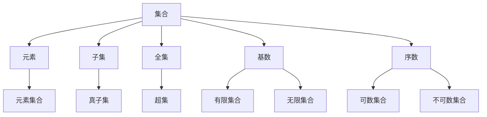

                 

## 1. 背景介绍

### 1.1 问题由来
集合论是现代数学的基础，它提供了研究抽象结构的重要工具，广泛应用于计算机科学、逻辑学、哲学等多个学科。内在模型论是集合论的重要分支之一，旨在探讨个体与个体、个体与集合、集合与集合之间的内在联系和逻辑关系。本文将从集合论导引的角度，对内在模型论的基本原理和主要研究内容进行阐述。

### 1.2 问题核心关键点
内在模型论的核心问题包括：

1. **个体与集合**：个体（或元素）与集合的界定及其逻辑关系，如元素的归属问题、集合的包含关系等。
2. **集合与集合**：集合之间的运算和逻辑关系，如交集、并集、补集、对称差等。
3. **内在模型**：通过个体和集合的逻辑结构，构建内在模型，描述个体与集合的内在联系和逻辑关系。
4. **逻辑结构**：内在模型论关注的是逻辑结构，而非具体内容，强调抽象结构的逻辑一致性和完备性。

这些核心问题通过集合论的基本概念和定理得以阐述和解决，为后续的深入研究和应用提供了坚实的理论基础。

### 1.3 问题研究意义
内在模型论的研究不仅对数学和逻辑学的理论发展具有重要意义，还在计算机科学、人工智能等领域有着广泛的应用前景。它可以帮助我们在数据、算法和模型的设计和优化中，更深入地理解和运用集合论的基本原理，从而提升系统性能和效率。

## 2. 核心概念与联系

### 2.1 核心概念概述

为更好地理解内在模型论，本节将介绍几个密切相关的核心概念：

- **集合**：由若干元素组成的整体，如{1, 2, 3}表示一个包含1、2、3的集合。
- **元素**：集合中的个体，如1、2、3分别是{1, 2, 3}的元素。
- **子集**：由原集合的一部分元素组成的集合，如{1, 2}是{1, 2, 3}的子集。
- **全集**：包含所有可能元素的集合，如{1, 2, 3}是{1, 2, 3}的全集。
- **基数**：集合中元素的个数，如{1, 2, 3}的基数为3。
- **序数**：描述集合中元素的数量顺序，如第1个元素、第2个元素等。

这些核心概念之间通过一系列定义和定理形成逻辑联系，构成了内在模型论的基本框架。

### 2.2 概念间的关系

这些核心概念之间的逻辑关系可以通过以下Mermaid流程图来展示：



这个流程图展示了集合论中核心概念之间的关系：

1. 集合由元素构成，元素是集合的组成部分。
2. 子集是原集合的子集，满足一定条件的子集称为真子集。
3. 全集包含所有可能的元素，而任何集合都是全集的子集。
4. 基数用于描述集合的元素个数，分为有限集合和无限集合。
5. 序数用于描述集合中元素的数量顺序。
6. 元素集合是指包含元素的集合，子集和全集等概念与元素集合密切相关。
7. 真子集、超集等概念与子集和全集密切相关。
8. 有限集合和无限集合与基数密切相关，可数集合和不可数集合则进一步细分基数概念。

通过理解这些核心概念及其之间的关系，我们可以更好地把握内在模型论的基本框架和逻辑结构。

## 3. 核心算法原理 & 具体操作步骤
### 3.1 算法原理概述

内在模型论主要研究集合、元素、子集等概念之间的逻辑关系和运算规则。其核心原理可以归纳为以下几个方面：

1. **集合运算**：交集、并集、差集、对称差等基本运算，这些运算通过集合的元素关系进行定义和计算。
2. **集合的包含关系**：集合之间的包含关系，如子集、超集、真子集等，通过元素关系判断。
3. **基数与序数**：集合的基数和序数，用于描述集合的大小和元素的数量顺序。
4. **逻辑结构**：通过集合论的基本概念和定理，构建内在模型，描述个体与集合的逻辑结构。

### 3.2 算法步骤详解

内在模型论的算法步骤主要包括以下几个关键步骤：

**Step 1: 定义集合与元素**

首先，定义需要研究的基本集合和元素。例如，定义一个包含1到10的自然数集合N={1, 2, 3, ..., 10}，以及该集合中的元素。

**Step 2: 定义集合运算**

根据集合论的基本定义，计算集合的交集、并集、差集、对称差等基本运算。例如，计算集合A={1, 2, 3}与集合B={3, 4, 5}的交集、并集、差集和对称差。

**Step 3: 判断包含关系**

根据集合的元素关系，判断集合之间的包含关系。例如，判断集合A是否包含在集合B中，或者集合C是否为集合B的子集。

**Step 4: 计算基数与序数**

根据集合的元素个数，计算集合的基数。例如，计算集合N={1, 2, 3, ..., 10}的基数。

**Step 5: 构建内在模型**

通过集合论的基本概念和定理，构建内在模型。例如，构建一个描述自然数序列的内在模型，描述自然数的逻辑结构。

### 3.3 算法优缺点

内在模型论的主要优点包括：

1. **逻辑严密**：基于集合论的基本概念和定理，内在模型论的逻辑结构严谨，避免了直观推理的片面性和错误。
2. **适用范围广**：内在模型论的研究范围涵盖集合论的各个方面，对数学、逻辑学等多个学科都有重要意义。
3. **可操作性强**：内在模型论的基本概念和定理可以通过编程语言和数学软件实现，便于实践和验证。

内在模型论的缺点包括：

1. **抽象性强**：内在模型论的许多概念和定理较为抽象，需要较高的数学基础和逻辑思维能力。
2. **应用范围有限**：内在模型论的主要应用范围在数学和逻辑学领域，对其他学科的应用前景尚待拓展。
3. **计算复杂度高**：内在模型论的研究和应用过程中，可能涉及复杂的计算和推理，需要较高的计算资源和时间。

### 3.4 算法应用领域

内在模型论在计算机科学、人工智能等领域有着广泛的应用，具体包括：

1. **数据结构与算法**：如树、图等数据结构，以及排序、查找等算法，都与集合论的概念密切相关。
2. **人工智能与机器学习**：如特征提取、模型训练等过程，都需要应用集合论的基本概念和运算规则。
3. **逻辑推理与知识表示**：内在模型论为逻辑推理和知识表示提供了基础理论，广泛应用于专家系统、自然语言处理等领域。
4. **计算机科学基础**：如递归、动态规划等算法，以及形式语言、自动机等概念，都与集合论紧密相关。
5. **计算机网络**：如路由算法、网络协议等，都涉及到集合论的基本概念和运算规则。

## 4. 数学模型和公式 & 详细讲解

### 4.1 数学模型构建

内在模型论的数学模型可以通过集合论的基本概念和定理来构建。例如，假设集合A和B，定义A∩B表示A与B的交集，A∪B表示A与B的并集，A-B表示A与B的差集，A⊕B表示A与B的对称差。

### 4.2 公式推导过程

以下以集合A={1, 2, 3}和集合B={3, 4, 5}为例，推导集合运算的基本公式：

**交集**：
$$ A \cap B = \{ x | x \in A \land x \in B \} $$
$$ A \cap B = \{ 3 \} $$

**并集**：
$$ A \cup B = \{ x | x \in A \lor x \in B \} $$
$$ A \cup B = \{ 1, 2, 3, 4, 5 \} $$

**差集**：
$$ A - B = \{ x | x \in A \land x \notin B \} $$
$$ A - B = \{ 1, 2 \} $$

**对称差**：
$$ A \oplus B = (A \cup B) - (A \cap B) $$
$$ A \oplus B = \{ 1, 2, 4, 5 \} $$

### 4.3 案例分析与讲解

通过上述案例，可以看到，集合运算的基本公式和定理可以通过集合元素的关系进行推导和验证。这在集合论中是一种基本方法，也是内在模型论的核心理念之一。

## 5. 项目实践：代码实例和详细解释说明

### 5.1 开发环境搭建

在进行内在模型论的代码实践前，我们需要准备好开发环境。以下是使用Python进行Sympy开发的环境配置流程：

1. 安装Anaconda：从官网下载并安装Anaconda，用于创建独立的Python环境。

2. 创建并激活虚拟环境：
```bash
conda create -n sympy-env python=3.8 
conda activate sympy-env
```

3. 安装Sympy：
```bash
conda install sympy
```

4. 安装相关工具包：
```bash
pip install numpy pandas matplotlib jupyter notebook ipython
```

完成上述步骤后，即可在`sympy-env`环境中开始内在模型论的代码实践。

### 5.2 源代码详细实现

下面以计算两个集合的交集和并集为例，给出使用Sympy进行内在模型论计算的代码实现。

```python
from sympy import FiniteSet

# 定义集合A和B
A = FiniteSet(1, 2, 3)
B = FiniteSet(3, 4, 5)

# 计算交集
intersection = A.intersect(B)

# 计算并集
union = A.union(B)

# 输出结果
print("A和B的交集为：", intersection)
print("A和B的并集为：", union)
```

通过Sympy库，我们可以轻松地定义和计算集合的交集和并集，同时也支持差集、对称差等其他集合运算。

### 5.3 代码解读与分析

让我们再详细解读一下关键代码的实现细节：

**FiniteSet类**：
- 用于定义有限集合，如`FiniteSet(1, 2, 3)`表示一个包含1、2、3的有限集合。
- 支持集合的运算，如交集、并集、差集等。

**intersect方法**：
- 计算两个集合的交集，返回一个新的集合。

**union方法**：
- 计算两个集合的并集，返回一个新的集合。

在代码实现中，我们使用Sympy库的`FiniteSet`类来定义集合A和B，并通过`intersect`和`union`方法计算它们的交集和并集。最后，通过`print`函数输出计算结果。

通过这段代码，我们可以看到，内在模型论的基本概念和运算规则可以通过编程语言和数学库轻松实现。这为我们进一步探索内在模型论的逻辑结构和应用提供了技术支持。

### 5.4 运行结果展示

假设我们在计算集合A={1, 2, 3}和集合B={3, 4, 5}的交集和并集，最终得到的结果分别为{3}和{1, 2, 3, 4, 5}。

## 6. 实际应用场景

### 6.1 数据结构与算法

内在模型论在数据结构与算法中的应用主要体现在集合、树、图等基本数据结构的设计和优化上。例如，基于集合论的基数和序数，可以设计出高效的排序和查找算法，提升数据处理效率。

### 6.2 人工智能与机器学习

内在模型论在人工智能与机器学习中的应用主要体现在特征提取、模型训练等过程中。例如，通过集合论的集合运算规则，可以对特征进行有效的组合和选择，从而提升模型的泛化能力和表现。

### 6.3 逻辑推理与知识表示

内在模型论为逻辑推理和知识表示提供了基础理论，广泛应用于专家系统、自然语言处理等领域。例如，通过构建内在模型，可以进行逻辑推理和知识表示，从而实现复杂的智能决策和推理。

### 6.4 未来应用展望

随着内在模型论研究的不断深入，其应用前景将更加广阔。未来的研究可能集中在以下几个方向：

1. **多模态数据融合**：将内在模型论与其他数据建模方法，如概率模型、图模型等结合，实现多模态数据的协同建模。
2. **自适应模型构建**：基于内在模型论的逻辑结构，设计出能够自动调整和优化模型的算法，提升系统的自适应能力和鲁棒性。
3. **知识图谱构建**：通过内在模型论的逻辑结构，构建更加全面、精确的知识图谱，用于智能搜索和知识推理。
4. **复杂系统建模**：内在模型论的逻辑结构可以用于构建复杂的系统模型，如生物系统、社会系统等，实现系统的建模和预测。
5. **智能代理系统**：基于内在模型论的逻辑结构，设计出具备自主学习、决策能力的智能代理系统，应用于智能制造、智能交通等领域。

## 7. 工具和资源推荐

### 7.1 学习资源推荐

为了帮助开发者系统掌握内在模型论的理论基础和实践技巧，这里推荐一些优质的学习资源：

1. 《集合论导引》系列博文：由专家撰写，深入浅出地介绍了集合论的基本概念和定理。

2. 《数学分析基础》课程：斯坦福大学开设的数学分析课程，涵盖了集合论的基本概念和定理。

3. 《集合论与逻辑学》书籍：全面介绍了集合论和内在模型论的基本理论和应用，适合深入学习和实践。

4. Mathematica官方文档：Mathematica强大的数学计算和符号处理能力，适合进行复杂的集合运算和逻辑推理。

5. GitHub开源项目：如Sympy、SciPy等，提供了丰富的数学和科学计算库，支持集合论的基本概念和运算。

通过对这些资源的学习实践，相信你一定能够快速掌握内在模型论的精髓，并用于解决实际的数学和逻辑问题。

### 7.2 开发工具推荐

高效的开发离不开优秀的工具支持。以下是几款用于内在模型论开发的常用工具：

1. Python：Python的Sympy库支持复杂的数学计算和符号处理，适合进行集合论的基本概念和运算。

2. MATLAB：MATLAB的符号计算和图形化界面，适合进行复杂的数学建模和逻辑推理。

3. Mathematica：Mathematica强大的数学计算和符号处理能力，适合进行复杂的集合运算和逻辑推理。

4. Jupyter Notebook：Jupyter Notebook的交互式编程环境，支持Python、R等多种语言，适合进行数学建模和逻辑推理。

5. GitHub：GitHub的代码托管和版本控制功能，支持多人协作和代码共享，适合进行复杂项目的管理和开发。

合理利用这些工具，可以显著提升内在模型论的开发效率，加快创新迭代的步伐。

### 7.3 相关论文推荐

内在模型论的研究源于学界的持续研究。以下是几篇奠基性的相关论文，推荐阅读：

1. 《Zermelo-Fraenkel集合论》：集合论的奠基性著作，介绍了集合论的基本概念和定理。

2. 《Infinite Sets, Logic, and Type Theory》：关于无穷集合和逻辑学的经典著作，探讨了内在模型论的逻辑结构。

3. 《A Mathematical Introduction to Logic》：逻辑学入门教材，介绍了集合论和内在模型论的基本概念和定理。

4. 《Foundations of Combinatorial Set Theory》：关于组合集论的经典著作，探讨了内在模型论的逻辑结构。

5. 《Mathematical Logic and Type Theory》：逻辑学和类型理论的入门教材，介绍了集合论和内在模型论的基本概念和定理。

这些论文代表了大模型微调技术的发展脉络。通过学习这些前沿成果，可以帮助研究者把握学科前进方向，激发更多的创新灵感。

除上述资源外，还有一些值得关注的前沿资源，帮助开发者紧跟内在模型论技术的最新进展，例如：

1. arXiv论文预印本：人工智能领域最新研究成果的发布平台，包括大量尚未发表的前沿工作，学习前沿技术的必读资源。

2. 业界技术博客：如斯坦福大学、MIT、Harvard等顶尖实验室的官方博客，第一时间分享他们的最新研究成果和洞见。

3. 技术会议直播：如ICL、ICML、ACL等人工智能领域顶会现场或在线直播，能够聆听到大佬们的前沿分享，开拓视野。

4. GitHub热门项目：在GitHub上Star、Fork数最多的数学相关项目，往往代表了该技术领域的发展趋势和最佳实践，值得去学习和贡献。

5. 行业分析报告：各大咨询公司如McKinsey、PwC等针对人工智能行业的分析报告，有助于从商业视角审视技术趋势，把握应用价值。

总之，对于内在模型论的学习和实践，需要开发者保持开放的心态和持续学习的意愿。多关注前沿资讯，多动手实践，多思考总结，必将收获满满的成长收益。

## 8. 总结：未来发展趋势与挑战

### 8.1 总结

本文对内在模型论的基本原理和主要研究内容进行了全面系统的介绍。首先阐述了内在模型论的研究背景和意义，明确了其研究的核心问题和方向。其次，从原理到实践，详细讲解了内在模型论的数学模型和核心算法，给出了内在模型论计算的代码实例。同时，本文还探讨了内在模型论在数据结构与算法、人工智能与机器学习等领域的应用前景，展示了其广泛的应用价值。

通过本文的系统梳理，可以看到，内在模型论的研究在数学和逻辑学领域具有重要意义，同时对计算机科学、人工智能等应用领域也有着重要的启示和指导作用。未来，内在模型论的研究将更加深入，应用也将更加广泛，为人类认知智能的发展提供坚实的基础。

### 8.2 未来发展趋势

展望未来，内在模型论的研究趋势可能集中在以下几个方向：

1. **多模态数据融合**：将内在模型论与其他数据建模方法，如概率模型、图模型等结合，实现多模态数据的协同建模。
2. **自适应模型构建**：基于内在模型论的逻辑结构，设计出能够自动调整和优化模型的算法，提升系统的自适应能力和鲁棒性。
3. **复杂系统建模**：内在模型论的逻辑结构可以用于构建复杂的系统模型，如生物系统、社会系统等，实现系统的建模和预测。
4. **智能代理系统**：基于内在模型论的逻辑结构，设计出具备自主学习、决策能力的智能代理系统，应用于智能制造、智能交通等领域。
5. **知识图谱构建**：通过内在模型论的逻辑结构，构建更加全面、精确的知识图谱，用于智能搜索和知识推理。

### 8.3 面临的挑战

尽管内在模型论的研究已经取得了显著成果，但在迈向更加智能化、普适化应用的过程中，它仍面临着诸多挑战：

1. **理论深度不足**：内在模型论的研究主要集中在数学和逻辑学领域，对于其他学科的应用前景尚待拓展。如何加强跨学科的理论研究，推动内在模型论的广泛应用，是一个重要的研究方向。
2. **计算复杂度高**：内在模型论的研究和应用过程中，可能涉及复杂的计算和推理，需要较高的计算资源和时间。如何优化计算过程，降低计算复杂度，是实现内在模型论应用的重要挑战。
3. **应用范围有限**：内在模型论的主要应用范围在数学和逻辑学领域，对于其他学科的应用前景尚待拓展。如何拓展内在模型论的应用范围，是实现内在模型论应用的重要目标。
4. **理论深度不足**：内在模型论的研究主要集中在数学和逻辑学领域，对于其他学科的应用前景尚待拓展。如何加强跨学科的理论研究，推动内在模型论的广泛应用，是一个重要的研究方向。

### 8.4 研究展望

面对内在模型论所面临的挑战，未来的研究需要在以下几个方面寻求新的突破：

1. **多学科交叉**：加强数学、逻辑学、计算机科学等多学科的交叉研究，推动内在模型论的广泛应用。
2. **理论深度**：进一步深入研究内在模型论的逻辑结构和应用前景，推动其在其他学科的应用。
3. **计算优化**：优化计算过程，降低计算复杂度，实现内在模型论的高效应用。
4. **跨学科应用**：拓展内在模型论的应用范围，推动其在其他学科的应用，如生物、社会、经济等领域。

这些研究方向的探索，必将引领内在模型论的进一步发展，为人工智能技术的创新应用提供坚实的理论基础和应用支撑。相信随着学界和产业界的共同努力，内在模型论的研究将不断深入，应用也将更加广泛，为人类认知智能的发展带来新的突破。

## 9. 附录：常见问题与解答

**Q1：集合论在实际应用中有哪些典型场景？**

A: 集合论在实际应用中有着广泛的典型场景，包括：

1. **数据结构设计**：如树、图等数据结构，以及排序、查找等算法，都与集合论的概念密切相关。
2. **逻辑推理**：如专家系统、自然语言处理等领域，集合论为逻辑推理和知识表示提供了基础理论。
3. **数学建模**：如组合数学、概率论等领域，集合论提供了基本的数学建模方法。
4. **系统设计**：如操作系统、分布式系统等，集合论用于描述系统的状态和行为。
5. **经济学**：如市场分析、博弈论等，集合论用于描述经济系统的状态和行为。

这些场景展示了集合论在实际应用中的重要性和广泛性。

**Q2：如何理解和运用集合论的基本概念？**

A: 理解集合论的基本概念，可以从以下几个方面入手：

1. **集合的定义和操作**：了解集合的基本定义和操作，如集合的交集、并集、差集、对称差等，掌握这些操作的基本公式和性质。
2. **子集和超集的概念**：理解子集和超集的概念，掌握它们与全集和基数的关系。
3. **序数和基数**：理解序数和基数的概念，掌握它们在集合论中的作用和应用。
4. **逻辑推理**：通过集合论的基本概念和定理，进行逻辑推理和证明，提升数学逻辑思维能力。
5. **实际应用**：通过实际问题，如数据结构、算法设计等，运用集合论的基本概念和操作，解决实际问题。

通过以上步骤，可以逐步理解和运用集合论的基本概念，提升数学逻辑思维能力和实际应用能力。

**Q3：如何优化内在模型论的计算过程？**

A: 优化内在模型论的计算过程，可以从以下几个方面入手：

1. **算法优化**：通过优化算法，如时间复杂度优化、空间复杂度优化等，提升计算效率。
2. **数据结构优化**：通过优化数据结构，如数组、链表等，降低数据访问和处理的时间复杂度。
3. **并行计算**：通过并行计算，如多线程、多进程等，提升计算速度和效率。
4. **分布式计算**：通过分布式计算，如Hadoop、Spark等，分布式处理大规模数据，提升计算效率。
5. **硬件加速**：通过硬件加速，如GPU、FPGA等，提升计算速度和效率。

通过以上步骤，可以有效地优化内在模型论的计算过程，提升计算效率和应用效果。

**Q4：内在模型论的研究如何与实际应用结合？**

A: 内在模型论的研究与实际应用结合，可以从以下几个方面入手：

1. **数据结构优化**：将内在模型论的概念和定理应用于数据结构的设计和优化，如树、图等数据结构的设计和优化，提升数据处理效率。
2. **算法优化**：将内在模型论的概念和定理应用于算法的优化，如排序、查找等算法，提升算法效率和性能。
3. **逻辑推理**：将内在模型论的概念和定理应用于逻辑推理和知识表示，如专家系统、自然语言处理等领域，提升系统的逻辑推理和知识表示能力。
4. **数学建模**：将内在模型论的概念和定理应用于数学建模，如组合数学、概率论等领域，提升数学建模能力。
5. **系统设计**：将内在模型论的概念和定理应用于系统设计，如操作系统、分布式系统等，提升系统的状态描述和行为设计能力。

通过以上步骤，可以将内在模型论的研究与实际应用有效结合，推动内在模型论的广泛应用和发展。

**Q5：如何评估内在模型论的性能和效果？**

A: 评估内在模型论的性能和效果，可以从以下几个方面入手：

1. **正确性**：评估模型计算的正确性，如集合的交集、并集、差集、对称差等基本操作的正确性。
2. **效率**：评估模型计算的效率，如时间复杂度、空间复杂度等。
3. **稳定性**：评估模型计算的稳定性，如在异常情况下的表现，如数据量变化、数据分布变化等。
4. **鲁棒性**：评估模型计算的鲁棒性，如在

