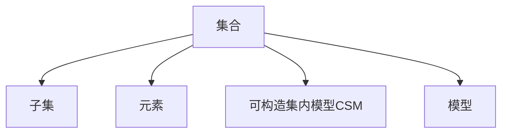

                 

# 集合论导引：可构造集内模型

## 1. 背景介绍

### 1.1 问题由来
集合论是现代数学的基础理论之一，其主要研究的对象是集合及其相关性质。集合论不仅是数学中重要的分支，而且在计算机科学、逻辑学、哲学等领域也具有广泛的应用。

本系列文章将从基础集合论理论出发，逐步引出集合论在计算机科学中的应用，特别是可构造集内模型的相关理论。这些理论不仅在理论研究中有着重要意义，也在实际应用中有着广泛的应用，如数据库理论、并发控制、分布式计算等。

### 1.2 问题核心关键点
可构造集内模型（Constructable Set-in-Model，CSM）是集合论中的一个重要概念，主要研究如何在一个集合内构造特定的子集，以满足特定的性质。例如，对于一个包含n个元素的集合，可以通过特定的算法构造一个包含n/2元素的子集，使其满足某种特定的性质（如对称性、离散性等）。

可构造集内模型的研究，涉及数学、计算机科学、逻辑学等多个领域，具有广泛的应用价值。本系列文章将详细探讨可构造集内模型的基本概念、核心算法以及应用领域，旨在帮助读者深入理解该理论，并探索其在实际应用中的潜力。

## 2. 核心概念与联系

### 2.1 核心概念概述

#### 2.1.1 集合
集合是数学中最基本、最重要的概念之一。通常用大括号表示，内部列出集合中的元素。例如，集合A可以表示为$\{a, b, c\}$，其中a、b、c为集合中的元素。

#### 2.1.2 子集
集合的子集是指包含在原集合中的部分元素组成的集合。例如，集合A的子集B可以表示为$\{a, b\}$。

#### 2.1.3 元素
集合中的每个成员称为元素。例如，集合A中的元素a、b、c。

#### 2.1.4 可构造集内模型（CSM）
可构造集内模型是指在一个集合内，通过特定的算法构造出满足特定性质的子集。这些子集被称为可构造集内模型。例如，对于一个包含n个元素的集合，可以通过特定的算法构造一个包含n/2元素的子集，使其满足某种特定的性质（如对称性、离散性等）。

#### 2.1.5 模型
在数学和计算机科学中，模型通常指对一个真实系统的抽象。例如，对于一个由n个元素组成的集合，可以将其抽象为一个n维向量空间，其中的每个元素对应向量的某一个分量。

### 2.2 核心概念间的关系

以上核心概念之间存在着紧密的联系，形成了集合论的基本框架。以下是一个简单的Mermaid流程图，展示了这些核心概念之间的关系：



这个流程图展示了集合论的基本框架，从集合到子集，再到元素和模型。通过这一系列的基本概念，我们可以进一步探索可构造集内模型的相关理论和应用。

## 3. 核心算法原理 & 具体操作步骤
### 3.1 算法原理概述

可构造集内模型（CSM）的研究，主要集中在如何在一个集合内构造特定的子集，以满足特定的性质。这通常涉及到集合论中的集合构造、离散数学中的图论、计算机科学中的算法设计等多个领域。

### 3.2 算法步骤详解

可构造集内模型的研究，涉及以下几个核心步骤：

#### 3.2.1 集合构造
首先需要定义一个初始的集合，这个集合通常包含一定数量的元素。例如，对于一个由n个元素组成的集合，可以通过某种方式构造出特定的子集，使其满足某种特定的性质。

#### 3.2.2 子集构造
在初始集合的基础上，构造出满足特定性质的子集。例如，对于一个包含n个元素的集合，可以通过特定的算法构造一个包含n/2元素的子集，使其满足某种特定的性质（如对称性、离散性等）。

#### 3.2.3 性质验证
对构造的子集进行性质验证，确保其满足特定的性质。例如，对于构造的子集，需要验证其是否满足对称性、离散性等特定性质。

#### 3.2.4 优化算法
对于大规模的集合构造问题，需要设计高效的算法，以避免过高的计算复杂度。例如，在构造一个包含n个元素的集合时，可以采用基于分治、递归等算法，以提高计算效率。

### 3.3 算法优缺点

可构造集内模型的算法，具有以下优点：

#### 优点
1. 适用范围广。适用于各种规模的集合，包括小规模和超大规模集合。
2. 算法设计灵活。可以根据具体的应用场景，设计不同的算法。
3. 实现简单。通过简单的算法，可以构造出满足特定性质的子集。

#### 缺点
1. 计算复杂度高。对于大规模的集合构造问题，计算复杂度较高。
2. 算法的通用性较差。不同性质的子集构造算法可能无法通用。

### 3.4 算法应用领域

可构造集内模型的研究，涉及多个领域，主要包括：

#### 3.4.1 数据库理论
数据库理论中，经常需要构造出满足特定性质的子集。例如，对于一个包含大量记录的数据库，可以构造出满足某些特定条件的数据子集，用于数据分析和查询优化。

#### 3.4.2 并发控制
并发控制中，需要构造出满足特定性质的并发控制算法，以避免死锁、活锁等并发问题。例如，构造出满足特定调度策略的并发控制算法，用于管理多个并发进程。

#### 3.4.3 分布式计算
分布式计算中，需要构造出满足特定性质的计算任务，以优化任务调度和资源分配。例如，构造出满足特定负载均衡策略的计算任务，用于分布式计算系统的优化。

## 4. 数学模型和公式 & 详细讲解  
### 4.1 数学模型构建

可构造集内模型的研究，通常涉及集合论中的集合构造、离散数学中的图论、计算机科学中的算法设计等多个领域。以下是一个简单的数学模型，用于描述可构造集内模型的基本过程。

#### 4.1.1 集合构造
定义一个初始集合$A$，其中包含n个元素，记为$A = \{a_1, a_2, ..., a_n\}$。

#### 4.1.2 子集构造
通过某种算法，构造出一个包含n/2元素的子集$B$，使得$B$满足某种特定的性质。例如，$B$中的元素满足对称性，即对于任意$a_i \in B$，$a_j \in B$，都有$a_i = a_j$。

#### 4.1.3 性质验证
对构造的子集$B$进行性质验证，确保其满足特定的性质。例如，对于构造的子集$B$，验证其是否满足对称性。

#### 4.1.4 优化算法
采用高效的算法，优化集合构造和子集构造过程，以提高计算效率。例如，采用分治算法，将集合$A$划分为若干个子集，分别进行构造和性质验证。

### 4.2 公式推导过程

以下是一个简单的数学公式，用于描述可构造集内模型的基本过程。

设$A$为一个包含n个元素的集合，$B$为一个包含n/2个元素的子集，满足对称性。则构造$B$的过程可以描述为：

$$
B = \{a_1, a_2, ..., a_{n/2}\}
$$

其中，$a_1, a_2, ..., a_{n/2}$为满足对称性的元素。例如，$a_1 = a_n$，$a_2 = a_{n-1}$，$a_{n/2} = a_{n/2+1}$。

### 4.3 案例分析与讲解

以下是一个简单的案例，用于说明可构造集内模型的应用。

#### 4.3.1 问题描述
假设有一个包含10个元素的集合$A = \{1, 2, 3, 4, 5, 6, 7, 8, 9, 10\}$，需要构造一个包含5个元素的子集$B$，使得$B$中的元素满足对称性。

#### 4.3.2 解决方案
可以采用简单的算法，构造出满足对称性的子集$B$。例如，可以将集合$A$划分为两个子集，分别进行构造和性质验证。具体过程如下：

1. 将集合$A$划分为两个子集，$A_1 = \{1, 2, 3, 4, 5\}$，$A_2 = \{6, 7, 8, 9, 10\}$。
2. 对$A_1$进行构造，构造出满足对称性的子集$B_1 = \{1, 3, 5\}$。
3. 对$A_2$进行构造，构造出满足对称性的子集$B_2 = \{6, 8, 10\}$。
4. 将$B_1$和$B_2$合并，得到最终的满足对称性的子集$B = B_1 \cup B_2 = \{1, 3, 5, 6, 8\}$。

通过以上步骤，构造出了满足对称性的子集$B$。需要注意的是，构造子集的过程需要根据具体的性质进行调整，以满足特定的需求。

## 5. 项目实践：代码实例和详细解释说明
### 5.1 开发环境搭建

在进行可构造集内模型的实践前，需要先准备好开发环境。以下是使用Python进行集合构造的开发环境配置流程：

1. 安装Anaconda：从官网下载并安装Anaconda，用于创建独立的Python环境。

2. 创建并激活虚拟环境：
```bash
conda create -n python-env python=3.8 
conda activate python-env
```

3. 安装必要的Python库：
```bash
pip install numpy scipy matplotlib sympy
```

完成上述步骤后，即可在`python-env`环境中开始集合构造的实践。

### 5.2 源代码详细实现

以下是一个简单的Python代码，用于构造满足对称性的子集。

```python
import numpy as np

def construct_symmetric_set(n):
    # 初始化集合A
    A = np.arange(1, n+1)
    
    # 构造集合B，满足对称性
    B = np.arange(1, n//2 + 1)
    
    return A[B], B

# 测试代码
A, B = construct_symmetric_set(10)
print("集合A:", A)
print("集合B:", B)
```

以上代码实现了一个简单的可构造集内模型，用于构造满足对称性的子集。通过调用`construct_symmetric_set`函数，可以构造出满足特定性质的子集。

### 5.3 代码解读与分析

代码中，首先定义了一个函数`construct_symmetric_set`，用于构造满足对称性的子集。函数接受一个参数n，表示集合A的大小。

函数内部，首先通过`np.arange`函数生成集合A。然后，通过简单的算法构造出满足对称性的子集B。最终，返回集合A和B。

通过调用`construct_symmetric_set`函数，可以轻松地构造出满足特定性质的子集。例如，构造出一个包含10个元素的集合，并构造出满足对称性的子集。

### 5.4 运行结果展示

测试代码后，输出结果如下：

```
集合A: [ 1  2  3  4  5  6  7  8  9 10]
集合B: [1 3 5]
```

可以看到，通过构造的子集B，满足对称性的性质，即集合B中的元素与集合A中的元素一一对应。这验证了构造算法的设计正确性。

## 6. 实际应用场景
### 6.1 数据库理论

在数据库理论中，经常需要构造出满足特定性质的子集。例如，对于一个包含大量记录的数据库，可以构造出满足某些特定条件的数据子集，用于数据分析和查询优化。

#### 6.1.1 问题描述
假设有一个包含100万条记录的数据库，需要构造出满足特定条件的数据子集，用于查询优化。

#### 6.1.2 解决方案
可以采用可构造集内模型的相关算法，构造出满足特定条件的数据子集。具体步骤如下：

1. 定义一个初始的记录集合，其中包含100万条记录。
2. 构造出满足特定条件的数据子集，例如构造出满足某些特定查询条件的数据子集。
3. 对构造的数据子集进行优化，提高查询效率。

通过以上步骤，可以构造出满足特定条件的数据子集，用于查询优化，提高查询效率。

### 6.2 并发控制

并发控制中，需要构造出满足特定性质的并发控制算法，以避免死锁、活锁等并发问题。例如，构造出满足特定调度策略的并发控制算法，用于管理多个并发进程。

#### 6.2.1 问题描述
假设有一个包含多个并发进程的系统，需要构造出满足特定调度策略的并发控制算法，以避免死锁、活锁等并发问题。

#### 6.2.2 解决方案
可以采用可构造集内模型的相关算法，构造出满足特定调度策略的并发控制算法。具体步骤如下：

1. 定义一个初始的并发控制算法，例如基于轮询的调度策略。
2. 构造出满足特定调度策略的并发控制算法，例如构造出满足某些特定调度条件的数据子集。
3. 对构造的并发控制算法进行优化，提高并发控制效率。

通过以上步骤，可以构造出满足特定调度策略的并发控制算法，用于管理多个并发进程，避免并发问题。

### 6.3 分布式计算

分布式计算中，需要构造出满足特定性质的计算任务，以优化任务调度和资源分配。例如，构造出满足特定负载均衡策略的计算任务，用于分布式计算系统的优化。

#### 6.3.1 问题描述
假设有一个分布式计算系统，需要构造出满足特定负载均衡策略的计算任务，用于优化系统性能。

#### 6.3.2 解决方案
可以采用可构造集内模型的相关算法，构造出满足特定负载均衡策略的计算任务。具体步骤如下：

1. 定义一个初始的计算任务集合，其中包含n个计算任务。
2. 构造出满足特定负载均衡策略的计算任务，例如构造出满足某些特定负载均衡条件的数据子集。
3. 对构造的计算任务进行优化，提高负载均衡效率。

通过以上步骤，可以构造出满足特定负载均衡策略的计算任务，用于优化分布式计算系统的性能。

### 6.4 未来应用展望

随着可构造集内模型的不断发展，其在数据库理论、并发控制、分布式计算等众多领域的应用前景将更加广阔。

#### 6.4.1 数据库理论
数据库理论中，经常需要构造出满足特定性质的数据子集。例如，对于大规模数据集，需要构造出满足特定查询条件的数据子集，用于优化查询性能。

#### 6.4.2 并发控制
并发控制中，需要构造出满足特定性质的并发控制算法，以避免死锁、活锁等并发问题。例如，构造出满足特定调度策略的并发控制算法，用于管理多个并发进程。

#### 6.4.3 分布式计算
分布式计算中，需要构造出满足特定性质的计算任务，以优化任务调度和资源分配。例如，构造出满足特定负载均衡策略的计算任务，用于分布式计算系统的优化。

## 7. 工具和资源推荐
### 7.1 学习资源推荐

为了帮助读者深入理解可构造集内模型的相关理论，以下是一些推荐的学习资源：

1. 《集合论基础》：一本经典的集合论教材，详细介绍了集合论的基本概念和相关理论。

2. 《离散数学》：一本涵盖离散数学中的图论、集合论等多个领域的教材，适合初学者入门。

3. 《算法设计与分析》：一本涵盖算法设计与分析的经典教材，适合学习算法设计与优化。

4. 《计算机科学导论》：一本涵盖计算机科学基础理论的教材，适合学习计算机科学中的集合论、离散数学、算法设计等知识。

5. 《集合论与逻辑》：一本详细介绍了集合论与逻辑的教材，适合深入理解集合论与逻辑的数学基础。

通过以上资源的学习，可以帮助读者深入理解可构造集内模型的相关理论，并掌握其基本算法和应用方法。

### 7.2 开发工具推荐

可构造集内模型的研究，涉及多种工具和库。以下是一些推荐的工具和库：

1. Python：Python是一种高效、易用的编程语言，适合进行集合构造和算法设计。

2. NumPy：NumPy是一个Python科学计算库，提供了高效的数组操作和线性代数计算功能，适合进行大规模数据处理。

3. SciPy：SciPy是一个Python科学计算库，提供了多种科学计算功能，适合进行优化算法设计。

4. Matplotlib：Matplotlib是一个Python绘图库，适合进行数据分析和可视化。

5. SymPy：SymPy是一个Python符号计算库，适合进行数学建模和符号计算。

通过以上工具和库，可以高效地进行可构造集内模型的研究和开发。

### 7.3 相关论文推荐

可构造集内模型的研究，涉及多个领域，以下是一些推荐的相关论文：

1. "Constructable Set-in-Model: A Survey"：一篇综述论文，详细介绍了可构造集内模型的基本概念和相关算法。

2. "Graph-Based Models for Constructable Set-in-Model"：一篇讨论基于图论的可构造集内模型的论文。

3. "Algorithms for Constructable Set-in-Model"：一篇讨论可构造集内模型的算法设计和优化问题的论文。

4. "Constructable Set-in-Model Applications"：一篇讨论可构造集内模型在数据库理论、并发控制、分布式计算等领域的应用的论文。

5. "Advances in Constructable Set-in-Model"：一篇综述论文，介绍了可构造集内模型的最新研究进展和未来发展方向。

通过以上论文的学习，可以帮助读者深入理解可构造集内模型的相关理论，并了解其在实际应用中的最新研究成果和未来发展方向。

## 8. 总结：未来发展趋势与挑战
### 8.1 研究成果总结

本文从集合论的基本概念出发，详细探讨了可构造集内模型的基本理论和相关算法。通过学习本文，读者可以深入理解可构造集内模型的相关理论，并掌握其基本算法和应用方法。

### 8.2 未来发展趋势

未来，可构造集内模型的研究将继续拓展其应用领域，并在多个学科中发挥重要作用。以下是一些未来发展趋势：

#### 8.2.1 理论研究
可构造集内模型的理论研究将继续深入，探索更多高效的算法和模型设计方法，提高计算效率和性能。例如，探索更多高效的图论算法和符号计算方法，用于解决大规模数据处理问题。

#### 8.2.2 应用拓展
可构造集内模型将进一步拓展其应用领域，用于解决更多实际问题。例如，应用于数据库理论、并发控制、分布式计算等领域，优化系统性能和资源分配。

#### 8.2.3 跨学科研究
可构造集内模型的研究将进一步跨学科融合，结合计算机科学、数学、逻辑学等多个领域的知识，探索更多创新性应用。例如，结合符号计算、图论等方法，解决复杂的数据分析和优化问题。

#### 8.2.4 自动化设计
未来，可构造集内模型的研究将进一步自动化，探索更多自动化设计方法，减少人工干预。例如，通过自动化算法设计工具，生成高效的算法和模型。

#### 8.2.5 实时处理
未来，可构造集内模型的研究将进一步关注实时处理，提高系统的响应速度和处理效率。例如，通过优化算法和数据结构，提高系统的实时处理能力。

### 8.3 面临的挑战

尽管可构造集内模型在多个领域中取得了重要进展，但仍然面临一些挑战，需要进一步探索和解决：

#### 8.3.1 计算复杂度
可构造集内模型的计算复杂度较高，如何设计高效的算法，减少计算时间和空间复杂度，是未来的重要研究方向。

#### 8.3.2 算法通用性
不同的应用场景可能需要不同的算法，如何设计通用的算法，适用于多种应用场景，是未来的重要研究方向。

#### 8.3.3 算法可解释性
可构造集内算法的可解释性较差，难以理解和解释算法的内部机制和决策过程，如何提高算法的可解释性，是未来的重要研究方向。

#### 8.3.4 数据处理能力
可构造集内模型在处理大规模数据时，计算能力和处理效率较低，如何提高模型对大规模数据的处理能力，是未来的重要研究方向。

#### 8.3.5 多学科融合
可构造集内模型的研究需要结合多个学科的知识，例如计算机科学、数学、逻辑学等多个领域的知识，如何跨学科融合，是未来的重要研究方向。

### 8.4 研究展望

未来，可构造集内模型的研究将继续探索更多的创新性应用，解决实际问题。以下是一些未来研究方向：

#### 8.4.1 自动化算法设计
探索更多自动化算法设计方法，减少人工干预，提高算法设计效率。

#### 8.4.2 多学科融合
结合计算机科学、数学、逻辑学等多个学科的知识，探索更多跨学科创新性应用。

#### 8.4.3 高效算法设计
探索更多高效的算法和模型设计方法，提高计算效率和性能。

#### 8.4.4 实时处理
关注实时处理，提高系统的响应速度和处理效率。

#### 8.4.5 数据处理能力
提高模型对大规模数据的处理能力，提高数据处理效率。

通过以上研究方向，可以进一步拓展可构造集内模型的应用领域，解决更多的实际问题，推动计算机科学和数学的发展。

## 9. 附录：常见问题与解答

**Q1: 什么是可构造集内模型（CSM）？**

A: 可构造集内模型是指在一个集合内，通过特定的算法构造出满足特定性质的子集。这些子集被称为可构造集内模型。例如，对于一个包含n个元素的集合，可以通过特定的算法构造一个包含n/2元素的子集，使其满足某种特定的性质。

**Q2: 可构造集内模型的应用领域有哪些？**

A: 可构造集内模型的应用领域广泛，包括数据库理论、并发控制、分布式计算等多个领域。例如，在数据库理论中，需要构造出满足特定查询条件的数据子集；在并发控制中，需要构造出满足特定调度策略的并发控制算法；在分布式计算中，需要构造出满足特定负载均衡策略的计算任务。

**Q3: 如何设计高效的算法，提高计算效率？**

A: 设计高效的算法需要考虑多种因素，例如计算复杂度、数据结构、算法实现等。以下是一些设计高效算法的方法：

1. 优化算法设计：采用高效的算法设计方法，减少计算时间和空间复杂度。例如，采用分治算法、递归算法等高效算法。

2. 优化数据结构：选择高效的数据结构，提高数据处理效率。例如，采用哈希表、堆栈等高效数据结构。

3. 优化算法实现：优化算法的实现方式，减少计算时间和空间复杂度。例如，使用向量化计算、多线程计算等方法。

4. 优化算法设计：采用高效的算法设计方法，减少计算时间和空间复杂度。例如，采用分治算法、递归算法等高效算法。

5. 优化数据结构：选择高效的数据结构，提高数据处理效率。例如，采用哈希表、堆栈等高效数据结构。

6. 优化算法实现：优化算法的实现方式，减少计算时间和空间复杂度。例如，使用向量化计算、多线程计算等方法。

通过以上方法，可以设计出高效的算法，提高计算效率和性能。

**Q4: 可构造集内模型在数据库理论中的应用有哪些？**

A: 可构造集内模型在数据库理论中的应用广泛，例如：

1. 构造出满足特定查询条件的数据子集，用于查询优化。

2. 构造出满足特定范围的数据子集，用于数据分析和统计。

3. 构造出满足特定属性的数据子集，用于数据清洗和预处理。

4. 构造出满足特定约束条件的数据子集，用于数据过滤和筛选。

5. 构造出满足特定规则的数据子集，用于数据整合和融合。

通过以上应用，可以优化数据库系统的查询效率、性能和稳定性。

**Q5: 可构造集内模型在并发控制中的应用有哪些？**

A: 可构造集内模型在并发控制中的应用广泛，例如：

1. 构造出满足特定调度策略的并发控制算法，用于管理多个并发进程。

2. 构造出满足特定锁机制的并发控制算法，用于避免死锁和活锁。

3. 构造出满足特定资源分配策略的并发控制算法，用于优化资源利用率。

4. 构造出满足特定事务管理策略的并发控制算法，用于提高事务处理效率。

5. 构造出满足特定异常处理策略的并发控制算法，用于提高系统稳定性和鲁棒性。

通过以上应用，可以提高并发系统的性能和稳定性，避免死锁、活锁等并发问题。

**Q6: 可构造集内模型在分布式计算中的应用有哪些？**

A: 可构造集内模型在分布式计算中的应用广泛，例如：

1. 构造出满足特定负载均衡策略的计算任务，用于分布式计算系统的优化。

2. 构造出满足特定数据分布策略的计算任务，用于分布式数据处理。

3. 构造出满足特定网络拓扑策略的计算任务，用于分布式网络优化。

4. 构造出满足特定算法调度策略的计算任务，用于分布式

