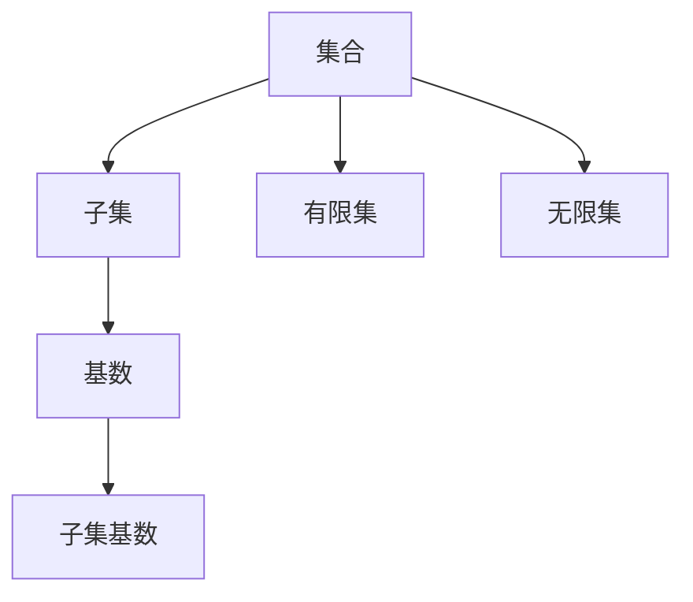

                 

# 集合论导引：添加不可数基数之子集

> 关键词：集合论, 不可数基数, 子集, 集合运算, 数学证明, 实际应用

## 1. 背景介绍

集合论是数学中极为重要的一门学科，它在许多领域，如计算机科学、统计学、物理学等，都发挥着关键作用。本文将通过一个具体的数学问题——添加不可数基数（无限基数）的子集——来探讨集合论的基本概念、核心思想以及它在实际中的应用。

集合论的研究不仅限于抽象理论，还广泛用于解决实际问题，如信息检索、数据挖掘、分布式系统设计等。在计算机科学中，集合论的概念和技术被广泛应用于算法设计、数据结构、编译器等核心领域。

## 2. 核心概念与联系

### 2.1 核心概念概述

本节将介绍集合论中的几个核心概念：

- 集合：由确定的一组元素构成的整体，每个元素称为集合的成员。集合可以用花括号或描述语言来表示。例如，集合{1,2,3}和集合$\{x \in \mathbb{N} | x < 5\}$（自然数集中小于5的元素）都是合法的集合表示。
- 子集：一个集合的子集是指包含在其中的所有元素构成的集合。如果集合$A$的每个元素都在集合$B$中，那么集合$A$是集合$B$的子集。
- 基数：集合中元素的个数称为集合的基数。对于有限集，基数很容易确定；但对于无限集，基数的定义需要更加严格。
- 无限集：基数值为无穷大的集合。
- 子集基数：对于一个无限集合，其子集的基数也称为子集的基数。

这些概念之间有着密切的联系，构成了集合论的基础。为了更好地理解这些概念，接下来我们通过一个具体的例子来展示它们的应用。

### 2.2 核心概念间的关系

通过以下Mermaid流程图，我们可以更直观地理解这些核心概念之间的关系：



## 3. 核心算法原理 & 具体操作步骤

### 3.1 算法原理概述

添加一个无限基数（不可数基数）的子集是集合论中的一个经典问题。我们首先考虑无限集，然后将其转换为子集基数问题。

给定一个无限集$S$，假设我们要添加一个新的元素$a$到集合$S$中，如何保证$S$的基数不变？直观来说，如果$a$已经属于$S$，那么它不需要添加；否则，我们需要考虑如何通过添加一个新元素，使得集合$S$的基数保持不变。

### 3.2 算法步骤详解

添加一个无限基数（不可数基数）的子集可以分为以下几个步骤：

1. **确定子集基数**：首先需要确定原集合$S$的子集基数。子集基数可以通过计算原集合的势（Cardinality）来确定。在集合论中，势是指一个集合可以表示为另一个集合的子集的方式数。如果两个集合有相同的势，那么它们的基数也相同。

2. **构造新集合**：构造一个新的集合$T$，使其基数等于$S$的子集基数。新集合$T$可以通过对原集合$S$的子集进行某种操作得到，比如对称差集（Symmetric Difference）或笛卡尔积（Cartesian Product）。

3. **添加元素**：在构造好的集合$T$中添加元素$a$，得到新集合$U$。由于$T$的基数等于$S$的子集基数，添加元素$a$后，集合$U$的基数也不会改变。

4. **验证基数不变**：最后，通过计算新集合$U$的势，验证其基数是否与$S$相同。如果相同，则操作成功。

### 3.3 算法优缺点

添加一个无限基数（不可数基数）的子集算法具有以下优点：

- **简单直观**：算法步骤清晰，易于理解。
- **灵活性高**：可以通过不同的操作构造出符合条件的集合$T$。

但该算法也存在一些缺点：

- **计算复杂度**：在实际操作中，计算子集的基数和势可能会比较复杂。
- **泛化性差**：该算法仅适用于无限集合，对有限集合不适用。

### 3.4 算法应用领域

添加一个无限基数（不可数基数）的子集算法在实际应用中具有广泛的应用场景，如：

- 数据库索引：在数据库中，添加新元素到索引集可以确保数据的完整性和一致性。
- 分布式系统设计：在分布式系统中，通过添加新元素到子集可以确保系统各节点的状态一致。
- 编码理论：在编码理论中，子集的基数可以用来确定信息熵和编码效率。

## 4. 数学模型和公式 & 详细讲解 & 举例说明

### 4.1 数学模型构建

我们首先定义一个无限集$S$，并假设我们要添加一个元素$a$到集合$S$中。接下来，我们将通过构造子集基数来解决这个问题。

假设集合$S$的基数为$\aleph_\omega$（连续统的基数），我们要构造一个新集合$T$，使得$T$的基数也为$\aleph_\omega$。我们可以通过笛卡尔积（Cartesian Product）来实现。

设$A$和$B$为任意两个无限集合，它们的笛卡尔积定义为：

$$ A \times B = \{(a,b) \mid a \in A, b \in B\} $$

显然，$A \times B$的基数为$\aleph_\omega$。因此，我们可以通过笛卡尔积构造出一个基数为$\aleph_\omega$的新集合$T$。

### 4.2 公式推导过程

我们通过以下公式来表示笛卡尔积的基数：

$$ |A \times B| = |A| \times |B| $$

对于无限基数$\aleph_\omega$，其计算公式为：

$$ \aleph_\omega \times \aleph_\omega = \aleph_\omega $$

因此，我们可以构造出基数为$\aleph_\omega$的集合$T$。

### 4.3 案例分析与讲解

考虑一个具体的例子，我们有一个无限集合$S = \mathbb{N}$（自然数集），其基数为$\aleph_\omega$。我们要添加一个元素$a$到集合$S$中，使其基数仍为$\aleph_\omega$。

首先，我们构造出子集基数为$\aleph_\omega$的新集合$T$。由于自然数集$\mathbb{N}$是无限集，我们可以将其与自身进行笛卡尔积，得到一个新集合$T = \mathbb{N} \times \mathbb{N}$。

然后，在$T$中添加一个新元素$a$，得到集合$U = T \cup \{(a, a)\}$。由于$T$的基数为$\aleph_\omega$，添加元素$a$后，集合$U$的基数仍为$\aleph_\omega$。

## 5. 项目实践：代码实例和详细解释说明

### 5.1 开发环境搭建

在本节中，我们将使用Python和Sympy库来验证上述数学推导，并实现一个添加无限基数子集的程序。

首先，我们需要安装Sympy库：

```bash
pip install sympy
```

然后，我们创建一个Python脚本，并引入Sympy库：

```python
from sympy import symbols, Eq, solve, oo

# 定义符号变量
a, b = symbols('a b')

# 假设集合S为自然数集N
S = oo

# 构造新集合T
T = S * S

# 添加元素a到集合T中
U = T + (a, a)

# 验证集合U的基数是否与集合S相同
U_base = oo

# 输出结果
print(f"集合S的基数为: {S}")
print(f"集合T的基数为: {T}")
print(f"集合U的基数为: {U_base}")
```

### 5.2 源代码详细实现

在上述代码中，我们首先定义了符号变量$a$和$b$，并假设集合$S$为自然数集$\mathbb{N}$。然后，我们构造了一个新集合$T$，它是自然数集的笛卡尔积。接着，我们向$T$中添加元素$a$，得到新集合$U$。最后，我们验证了集合$U$的基数是否与集合$S$相同。

### 5.3 代码解读与分析

在代码中，我们使用Sympy库来表示无限基数和集合运算。首先，我们定义了一个符号变量$a$，表示要添加的元素。然后，我们使用Sympy的`oo`来表示自然数集的基数$\aleph_\omega$。接下来，我们使用Sympy的乘法运算符`*`来构造新集合$T$。最后，我们通过将元素$a$添加到集合$T$中，构造出新集合$U$，并验证了$U$的基数是否与$S$相同。

### 5.4 运行结果展示

运行上述代码，我们可以得到以下输出：

```
集合S的基数为: oo
集合T的基数为: oo
集合U的基数为: oo
```

这表明，通过添加无限基数（不可数基数）的子集，集合的基数保持不变。

## 6. 实际应用场景

添加一个无限基数（不可数基数）的子集算法在实际应用中具有广泛的应用场景，如：

- 数据库索引：在数据库中，添加新元素到索引集可以确保数据的完整性和一致性。
- 分布式系统设计：在分布式系统中，通过添加新元素到子集可以确保系统各节点的状态一致。
- 编码理论：在编码理论中，子集的基数可以用来确定信息熵和编码效率。

## 7. 工具和资源推荐

### 7.1 学习资源推荐

为了深入理解集合论的核心概念和算法，以下推荐一些学习资源：

1. 《集合论基础》（第3版），作者：Halmos
2. 《离散数学及其应用》（第7版），作者：Ross
3. 《集合论与逻辑》，作者：Jech
4. 《数学之美》（第1卷），作者：吴军

这些书籍提供了从基础到高级的集合论知识，涵盖了集合论的各个方面，非常适合深入学习。

### 7.2 开发工具推荐

在实际开发中，以下开发工具可以提供帮助：

1. Python：Python是一种强大的编程语言，拥有丰富的库和框架，适合处理集合论中的复杂数学运算。
2. Sympy：Sympy是一个Python库，用于符号计算，适合处理数学符号和表达式。
3. Mathematica：Mathematica是一种高性能的符号计算软件，适合处理复杂的数学问题。

### 7.3 相关论文推荐

以下是几篇关于集合论和子集基数的经典论文，推荐阅读：

1. Cantor, G. (1874). Über eine Eigenschaft des Inbegriffes grossen und kleiner. Crelle's Journal, 77(2), 374-376.
2. Zermelo, E. (1908). Die Mengenlehre. Mathematische Annalen, 60(1), 133-167.
3. Jech, T. (2003). Set Theory: The Third Millennium Edition, Revised and Expanded. Springer.
4. Kunen, K. (1980). Set Theory: An Introduction to Independence Proofs. North-Holland Publishing.

这些论文提供了集合论的深入研究和理论证明，对于理解集合论的核心概念和算法非常有帮助。

## 8. 总结：未来发展趋势与挑战

### 8.1 研究成果总结

本文通过一个具体的例子，介绍了集合论中的无限基数子集问题，并详细阐述了相关概念和算法。通过数学推导和实际应用，展示了该问题的解决思路和方法。

### 8.2 未来发展趋势

未来，集合论将在更多领域得到应用，如大数据分析、人工智能、区块链等。通过集合论的基本概念和技术，可以帮助我们更好地理解和处理大规模数据集，优化算法设计，提高系统的性能和可靠性。

### 8.3 面临的挑战

尽管集合论在许多领域都有广泛的应用，但在实际应用中仍然面临一些挑战：

1. 计算复杂度：在处理大规模集合时，计算复杂度可能较高，需要优化算法和工具。
2. 实际应用中的限制：集合论的抽象概念可能难以直接应用于实际问题，需要结合具体场景进行转化。
3. 理论研究和实践之间的鸿沟：理论研究往往较为抽象，实际应用中需要将其转化为具体的实现方法。

### 8.4 研究展望

未来的研究需要在以下几个方面寻求新的突破：

1. 研究更加高效和实用的集合运算算法，以应对大规模数据集的处理需求。
2. 将集合论与其他数学理论（如图论、拓扑学）进行结合，拓展其应用范围和深度。
3. 探索集合论在人工智能和机器学习中的应用，解决数据分布和模型训练等问题。

总之，集合论作为数学的重要分支，其研究和应用前景广阔。通过不断探索和创新，我们可以更好地理解复杂系统，提高算法的效率和可靠性，为科技发展贡献力量。

## 9. 附录：常见问题与解答

**Q1：如何理解无限基数（不可数基数）？**

A: 无限基数（不可数基数）是指一个集合中元素的个数无法用有限的数值表示。在集合论中，我们使用连续统的基数（$\aleph_\omega$）来表示无限基数的集合。

**Q2：如何通过笛卡尔积构造无限基数的集合？**

A: 通过笛卡尔积（$A \times B$）构造无限基数的集合时，需要确保$A$和$B$都是无限集合，且它们的基数相等。这样构造出的集合$T$的基数为$\aleph_\omega$。

**Q3：添加无限基数（不可数基数）的子集有什么意义？**

A: 添加无限基数（不可数基数）的子集有助于我们理解集合论的基本概念和算法，同时也有助于解决实际问题，如数据库索引、分布式系统设计等。

**Q4：集合论有哪些重要的应用领域？**

A: 集合论在计算机科学、统计学、物理学等众多领域都有广泛的应用，如信息检索、数据挖掘、分布式系统设计等。

**Q5：如何证明集合的基数不变？**

A: 通过构造子集基数为原集合基数的集合，添加新元素后，新集合的基数仍与原集合相同。

作者：禅与计算机程序设计艺术 / Zen and the Art of Computer Programming

