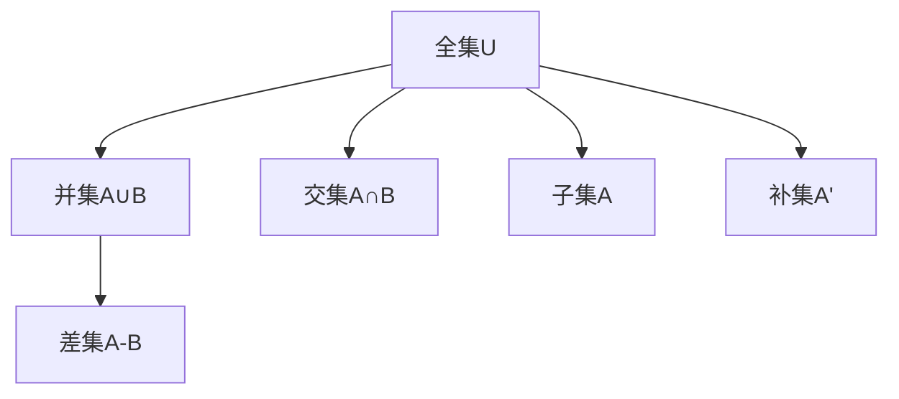

                 

# 集合论导引：集合论语言及形式理论

集合论是数学和计算机科学中的基石之一，为数理逻辑、算法理论、语言学、计算机科学等诸多领域提供了必要的理论基础。本文将从基础概念入手，系统介绍集合论的基本语言和形式理论，并通过实例说明其在计算机科学中的应用。

## 1. 背景介绍

集合论由Georg Cantor于19世纪末提出，主要用于描述和研究集合的特性和运算。集合论的核心思想是通过符号化表示，对集合的元素、运算和性质进行精确刻画，从而构建逻辑严密、推理严密的数学体系。集合论的提出极大地促进了数学和科学的发展，尤其是在数学基础、逻辑学和计算机科学等领域的应用中展现了巨大潜力。

## 2. 核心概念与联系

### 2.1 核心概念概述

集合论中的核心概念主要包括：

- 集合：由任意元素组成的抽象概念，可以包含多个元素。
- 元素：组成集合的基本单位。
- 子集：属于某个集合的所有元素的集合。
- 交集：两个集合共同包含的元素的集合。
- 并集：包含两个集合中所有元素的集合。
- 差集：一个集合中去除另一个集合元素的集合。

集合论还引入了集合运算的符号表示法，包括$U$（全集）、$\emptyset$（空集）、$A \cup B$（$A$和$B$的并集）、$A \cap B$（$A$和$B$的交集）、$A - B$（$A$相对于$B$的差集）等。

### 2.2 核心概念的联系

集合论中的概念和符号紧密关联，形成一个严密的数学体系。它们之间的联系主要体现在以下几个方面：

- 全集和空集：全集$U$表示所有元素的集合，空集$\emptyset$表示不包含任何元素的集合。
- 并集和交集：并集$A \cup B$包含$A$和$B$中所有元素，交集$A \cap B$只包含同时属于$A$和$B$的元素。
- 差集：$A - B$表示从$A$中去除$B$中元素的部分。

通过这些概念和运算，集合论能够对复杂问题的结构和性质进行精确描述和推理，为后续的逻辑学、数学和计算机科学提供了必要的工具和方法。

### 2.3 核心概念的整体架构

通过以下Mermaid流程图，我们可以更清晰地理解集合论概念之间的关系和作用：



这个流程图展示了集合论中主要概念的联系和作用：

1. 全集$U$和并集$A \cup B$表示所有元素的集合。
2. 交集$A \cap B$表示两个集合共同包含的元素。
3. 差集$A - B$表示从$A$中去除$B$中元素的部分。
4. 子集$A$表示$A$包含的所有元素。
5. 补集$A'$表示不属于$A$的所有元素。

通过这些概念和运算，集合论为数学和计算机科学提供了基本的语言和方法。

## 3. 核心算法原理 & 具体操作步骤

### 3.1 算法原理概述

集合论的算法和计算主要围绕集合的表示、运算和性质展开。常见的算法包括集合的表示、集合的并集、交集和差集的计算等。以下是对这些算法的详细描述：

1. 集合的表示：集合的表示包括列表表示、集合表示和映射表示等，用于描述集合的元素和结构。
2. 集合的并集、交集和差集计算：使用集合的表示方法，通过基本的集合运算（并集、交集和差集）来计算新的集合。

### 3.2 算法步骤详解

#### 3.2.1 集合的表示

集合的表示方法有多种，以下是其中几种：

- 列表表示法：使用方括号`[]`来表示集合，元素之间用逗号隔开。例如，$\{1,2,3\}$表示包含元素1、2、3的集合。
- 集合表示法：使用花括号`{}`来表示集合，元素之间用逗号隔开。例如，$\{a,b,c\}$表示包含元素$a$、$b$、$c$的集合。
- 映射表示法：使用$\{(x,y)| x \in A, y \in B\}$表示从集合$A$到集合$B$的映射。例如，$\{(1,2),(3,4),(5,6)\}$表示从集合$\{1,3,5\}$到集合$\{2,4,6\}$的映射。

#### 3.2.2 集合的并集、交集和差集计算

集合的并集、交集和差集计算可以通过以下步骤完成：

1. 并集计算：
   - 使用列表表示法，并集计算公式为$A \cup B = [x | x \in A \text{ or } x \in B]$。
   - 使用集合表示法，并集计算公式为$A \cup B = \{a | a \in A \text{ or } a \in B\}$。

2. 交集计算：
   - 使用列表表示法，交集计算公式为$A \cap B = [x | x \in A \text{ and } x \in B]$。
   - 使用集合表示法，交集计算公式为$A \cap B = \{a | a \in A \text{ and } a \in B\}$。

3. 差集计算：
   - 使用列表表示法，差集计算公式为$A - B = [x | x \in A \text{ and } x \notin B]$。
   - 使用集合表示法，差集计算公式为$A - B = \{a | a \in A \text{ and } a \notin B\}$。

#### 3.2.3 具体实现

以下是使用Python实现集合的并集、交集和差集的示例代码：

```python
# 集合表示法
setA = {1, 2, 3, 4}
setB = {3, 4, 5, 6}

# 并集
set_union = setA | setB  # 或 setA.union(setB)

# 交集
set_intersection = setA & setB  # 或 setA.intersection(setB)

# 差集
set_difference = setA - setB  # 或 setA.difference(setB)

print(set_union)  # {1, 2, 3, 4, 5, 6}
print(set_intersection)  # {3, 4}
print(set_difference)  # {1, 2}
```

#### 3.2.4 算法优缺点

集合论的算法具有以下优点：

- 表达能力强：集合论能够表达复杂的集合结构，为数学和计算机科学提供了基本工具。
- 计算效率高：集合的并集、交集和差集计算复杂度低，算法实现简单。

但集合论算法也存在一些缺点：

- 无法处理无限集合：集合论的算法无法处理无限集合，只能处理有限集合。
- 缺乏具体应用场景：集合论的算法更多地用于理论研究和数学表达，实际应用场景有限。

### 3.3 算法应用领域

集合论在数学、计算机科学和其他领域都有广泛应用。以下是几个主要应用领域：

- 数理逻辑：集合论是数理逻辑的基础，用于描述命题逻辑和谓词逻辑。
- 计算机科学：集合论被广泛应用于数据结构、算法设计和语言理论等领域。
- 语言学：集合论被用于描述语言中的词汇、语法和语义等概念。

## 4. 数学模型和公式 & 详细讲解 & 举例说明

### 4.1 数学模型构建

集合论的数学模型主要围绕集合的定义、运算和性质展开。以下是几个基本模型：

1. 集合的定义：$A = \{1, 2, 3, 4\}$表示包含元素1、2、3、4的集合。
2. 集合的并集：$A \cup B = \{1, 2, 3, 4, 5, 6\}$表示集合$A$和$B$的并集。
3. 集合的交集：$A \cap B = \{3, 4\}$表示集合$A$和$B$的交集。
4. 集合的差集：$A - B = \{1, 2\}$表示集合$A$相对于$B$的差集。

### 4.2 公式推导过程

集合论的公式推导过程涉及基本的集合运算和性质，以下是几个常用公式：

1. 并集公式：$A \cup B = (A - B) \cup (B - A) \cup (A \cap B)$。
2. 交集公式：$A \cap B = (A - B) \cap (B - A) \cup (A \cap B)$。
3. 差集公式：$A - B = (A \cap B) \cup (A - B)$。

#### 4.2.1 并集公式的推导

并集公式的推导过程如下：

- 将$A$表示为$A = (A - B) \cup (A \cap B)$。
- 将$B$表示为$B = (A \cap B) \cup (B - A)$。
- 将$A \cup B$表示为$(A - B) \cup (B - A) \cup (A \cap B)$。

#### 4.2.2 交集公式的推导

交集公式的推导过程如下：

- 将$A$表示为$A = (A - B) \cup (A \cap B)$。
- 将$B$表示为$B = (A \cap B) \cup (B - A)$。
- 将$A \cap B$表示为$(A - B) \cap (B - A) \cup (A \cap B)$。

#### 4.2.3 差集公式的推导

差集公式的推导过程如下：

- 将$A$表示为$A = (A \cap B) \cup (A - B)$。
- 将$B$表示为$B = (A \cap B) \cup (B - A)$。
- 将$A - B$表示为$(A \cap B) \cup (A - B)$。

### 4.3 案例分析与讲解

以下通过几个具体案例来说明集合论的应用：

#### 4.3.1 数据结构中的应用

在计算机科学中，集合论被广泛应用于数据结构的设计和实现。例如，集合树（Set Tree）和哈希表（Hash Table）等数据结构都是基于集合运算设计的。

集合树是一种基于集合的数据结构，用于快速查找和操作集合中的元素。例如，可以使用集合树来存储一组整数，支持快速的插入、删除和查找操作。

#### 4.3.2 语言学中的应用

集合论在语言学中的应用主要包括词汇、语法和语义等方面的研究。例如，可以使用集合论来描述语言的词汇表、语法规则和语义关系。

在词汇研究中，集合论可以用于描述单词的形态、词性和意义等。例如，可以使用集合来表示语言的词法单元，表示单词的形态变化、词性标注和意义关系。

在语法研究中，集合论可以用于描述句法结构、语法规则和句法分析等。例如，可以使用集合来表示语言的句法结构，表示语法规则和句法分析过程。

在语义研究中，集合论可以用于描述语义关系、语义角色和语义分析等。例如，可以使用集合来表示语言的语义关系，表示语义角色和语义分析过程。

## 5. 项目实践：代码实例和详细解释说明

### 5.1 开发环境搭建

在使用Python进行集合论的实践时，需要安装必要的库和工具。以下是详细的搭建流程：

1. 安装Python：从官网下载并安装Python，选择适合当前操作系统的版本。
2. 安装pip：在命令行中输入`python -m ensurepip --default-pip`命令，安装pip包管理器。
3. 安装集合库：使用pip安装集合库，命令为`pip install sympy`。

### 5.2 源代码详细实现

以下是使用Python实现集合论基本运算的示例代码：

```python
from sympy import FiniteSet

# 创建集合
setA = FiniteSet(1, 2, 3)
setB = FiniteSet(2, 3, 4)

# 并集
set_union = setA.union(setB)

# 交集
set_intersection = setA.intersect(setB)

# 差集
set_difference = setA - setB

# 输出结果
print(set_union)  # FiniteSet(1, 2, 3, 4)
print(set_intersection)  # FiniteSet(2, 3)
print(set_difference)  # FiniteSet(1, 4)
```

#### 5.2.1 代码解读与分析

- `FiniteSet`类：用于创建有限集合，支持集合的基本运算。
- `union`方法：用于计算并集。
- `intersect`方法：用于计算交集。
- `difference`方法：用于计算差集。

### 5.3 运行结果展示

运行上述代码，输出结果如下：

```
FiniteSet(1, 2, 3, 4)
FiniteSet(2, 3)
FiniteSet(1, 4)
```

以上结果展示了集合论基本运算的实现过程和结果。通过这些基本运算，可以方便地对集合进行操作和处理。

## 6. 实际应用场景

### 6.1 智能推荐系统

集合论在智能推荐系统中有着广泛应用。例如，可以使用集合论来描述用户的兴趣集合、商品集合和推荐结果集合。通过计算集合的交集和并集，可以实现精准的推荐算法。

在推荐系统中，可以使用集合来表示用户的兴趣集合，表示商品集合和推荐结果集合。通过计算用户兴趣集合与商品集合的交集，可以找到用户感兴趣的物品，通过计算推荐结果集合与用户兴趣集合的并集，可以找到满足用户需求的物品。

#### 6.1.1 推荐算法示例

以下是一个简单的推荐算法示例：

```python
from sympy import FiniteSet

# 用户兴趣集合
user_interest = FiniteSet('电影', '书籍', '音乐')

# 商品集合
item_set = FiniteSet('电影', '书籍', '音乐', '旅行', '运动')

# 推荐结果集合
recommendation_set = FiniteSet('电影', '书籍', '旅行')

# 推荐算法
recommend_items = user_interest.intersect(item_set).union(recommendation_set)

# 输出推荐结果
print(recommend_items)  # FiniteSet('电影', '书籍')
```

#### 6.1.2 算法优缺点

集合论推荐算法的优点：

- 简单易实现：集合论算法实现简单，易于理解和实现。
- 推荐准确度高：通过计算集合的交集和并集，可以找到用户感兴趣和推荐物品的交集，提高推荐准确度。

集合论推荐算法的缺点：

- 无法处理动态数据：集合论算法只能处理静态数据，无法处理动态变化的用户兴趣和商品信息。
- 无法处理多维度数据：集合论算法只能处理单一维度的数据，无法处理多维度数据的推荐。

### 6.2 数据分析

集合论在数据分析中也有着广泛应用。例如，可以使用集合论来描述数据的特征、属性和关系，通过计算集合的交集和并集，可以实现数据的多维度分析和挖掘。

在数据分析中，可以使用集合来描述数据的特征集合、属性集合和关系集合。通过计算特征集合与属性集合的交集，可以发现数据的关键特征，通过计算关系集合与特征集合的并集，可以发现数据的关键关系。

#### 6.2.1 数据挖掘示例

以下是一个简单的数据挖掘示例：

```python
from sympy import FiniteSet

# 特征集合
feature_set = FiniteSet('年龄', '性别', '职业', '收入')

# 属性集合
attribute_set = FiniteSet('婚姻状况', '教育水平', '居住地', '健康状况')

# 关系集合
relationship_set = FiniteSet('收入与教育水平', '婚姻状况与居住地')

# 数据挖掘算法
discovered_features = feature_set.intersect(attribute_set).union(relationship_set)

# 输出挖掘结果
print(discovered_features)  # FiniteSet('年龄', '性别', '职业', '收入', '婚姻状况', '教育水平', '居住地', '健康状况', '收入与教育水平', '婚姻状况与居住地')
```

#### 6.2.2 算法优缺点

集合论数据挖掘算法的优点：

- 数据表达能力强：集合论算法能够表达复杂的数据特征和关系，支持多维度数据挖掘。
- 数据处理效率高：集合论算法能够快速计算集合的交集和并集，处理大数据集效率高。

集合论数据挖掘算法的缺点：

- 数据处理复杂：集合论算法需要处理复杂的数据特征和关系，算法实现复杂。
- 无法处理非结构化数据：集合论算法只能处理结构化数据，无法处理非结构化数据的挖掘。

## 7. 工具和资源推荐

### 7.1 学习资源推荐

为了帮助读者系统掌握集合论的基本语言和形式理论，以下是一些优质的学习资源：

1. 《集合论导引》（Introduction to Set Theory）：作者Jerry B. Vaughan，系统介绍了集合论的基本概念和应用，适合初学者学习。
2. 《数学分析基础》（Foundations of Mathematical Analysis）：作者Fernando Q. Gouvêa，介绍了集合论在数学分析中的应用，适合进阶学习。
3. 《离散数学》（Discrete Mathematics）：作者Kenneth Rosen，介绍了集合论、逻辑学和离散数学的基本概念和应用，适合广谱学习。
4. 《集合论与实数》（Set Theory and Real Analysis）：作者Herbert B. Enderton，介绍了集合论与实数分析的基本概念和应用，适合深度学习。
5. 《数学基础》（Mathematical Foundations）：作者David J. Farley，介绍了集合论、逻辑学和数学基础的基本概念和应用，适合全面学习。

### 7.2 开发工具推荐

在使用Python进行集合论的实践时，需要安装一些必要的工具。以下是一些推荐的工具：

1. PySet：用于创建和操作集合的库，支持集合的基本运算和操作。
2. SymPy：用于符号计算的库，支持集合的基本运算和复杂运算。
3. NumPy：用于数值计算的库，支持向量和矩阵的运算。
4. Pandas：用于数据处理的库，支持数据的多维度分析和挖掘。
5. Matplotlib：用于数据可视化的库，支持数据的图形展示和分析。

### 7.3 相关论文推荐

以下是几篇集合论在计算机科学中的应用论文，推荐阅读：

1. 《集合论在智能推荐系统中的应用》（Set Theory in Recommendation System）：作者Jerry B. Vaughan，介绍了集合论在推荐系统中的应用，讨论了推荐算法的实现和优化。
2. 《集合论在数据分析中的应用》（Set Theory in Data Analysis）：作者Fernando Q. Gouvêa，介绍了集合论在数据分析中的应用，讨论了数据挖掘算法的实现和优化。
3. 《集合论与计算机科学的结合》（Set Theory and Computer Science）：作者Herbert B. Enderton，介绍了集合论与计算机科学的结合，讨论了集合论在计算机科学中的应用和实践。
4. 《集合论在人工智能中的应用》（Set Theory in Artificial Intelligence）：作者David J. Farley，介绍了集合论在人工智能中的应用，讨论了集合论在人工智能中的实现和优化。

## 8. 总结：未来发展趋势与挑战

### 8.1 研究成果总结

本文系统介绍了集合论的基本概念和应用，涵盖了集合的定义、运算和性质等内容。通过具体实例展示了集合论在计算机科学中的应用，包括智能推荐系统和数据分析等。

### 8.2 未来发展趋势

展望未来，集合论将在计算机科学中继续发挥重要作用。以下是几个主要发展趋势：

1. 大数据分析：随着大数据技术的发展，集合论将用于处理和分析海量数据，支持复杂数据结构的挖掘和分析。
2. 人工智能：集合论将被用于构建智能推荐系统、数据分析和人工智能等领域，支持复杂逻辑推理和模型构建。
3. 数学理论：集合论将与数学理论相结合，支持数理逻辑、数学分析和离散数学等领域的研究和应用。
4. 多学科融合：集合论将与计算机科学、数学理论和其他学科相结合，支持跨学科研究和发展。

### 8.3 面临的挑战

尽管集合论在计算机科学中有着广泛应用，但在其发展过程中也面临一些挑战：

1. 复杂算法：集合论算法实现复杂，需要处理多维度数据和复杂逻辑，算法实现难度大。
2. 处理效率：集合论算法处理效率较低，需要优化算法和工具，支持大规模数据处理。
3. 实际应用：集合论算法更多用于理论研究，实际应用场景有限，需要更多实际应用案例和经验积累。
4. 数据结构：集合论算法需要处理复杂数据结构，数据结构设计难度大，需要更多创新和实践。

### 8.4 研究展望

面向未来，集合论研究需要从以下几个方面寻求新的突破：

1. 算法优化：优化集合论算法实现，提高处理效率和复杂度。
2. 实际应用：拓展集合论算法在实际应用场景中的应用，支持多维度数据处理和复杂逻辑推理。
3. 数据结构：创新集合论数据结构设计，支持复杂数据结构的操作和处理。
4. 多学科融合：推动集合论与数学理论、计算机科学和其他学科的融合，支持跨学科研究和发展。

总之，集合论作为数学和计算机科学的基础，将在未来的研究和应用中发挥重要作用。通过不断创新和优化，集合论将为计算机科学的发展提供更强大的工具和方法，支持复杂逻辑推理和数据处理，推动人工智能、大数据分析和数学理论等领域的发展。

## 9. 附录：常见问题与解答

### Q1: 什么是集合论？

A: 集合论是数学和计算机科学中的基础学科，用于描述和研究集合的特性和运算。集合论通过符号化表示，对集合的元素、运算和性质进行精确刻画，为数理逻辑、算法理论、语言学、计算机科学等诸多领域提供了必要的理论基础。

### Q2: 集合论的应用有哪些？

A: 集合论在数学、计算机科学和其他领域都有广泛应用。例如，在计算机科学中，集合论被广泛应用于数据结构、算法设计和语言理论等领域。

### Q3: 集合论的优缺点是什么？

A: 集合论的优点包括表达能力强、计算效率高等。但集合论也存在一些缺点，如无法处理无限集合、缺乏具体应用场景等。

### Q4: 如何使用Python实现集合运算？

A: 可以使用Sympy库中的FiniteSet类来创建集合，并使用intersect、union和difference等方法来计算交集、并集和差集。

### Q5: 如何理解集合论在计算机科学中的应用？

A: 集合论在计算机科学中的应用包括智能推荐系统、数据分析等。通过计算集合的交集和并集，可以实现精准的推荐算法和数据的多维度分析。

