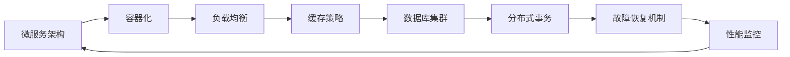

                 

# 高可用、高负载、高并发的互联网应用的架构设计

> 关键词：
> - 高可用
> - 高负载
> - 高并发
> - 微服务
> - 容器化
> - 负载均衡
> - 缓存策略
> - 数据库集群
> - 分布式事务
> - 故障恢复机制
> - 性能监控

## 1. 背景介绍

在现代社会中，互联网应用已经成为人们日常生活和工作不可或缺的一部分。无论是电商、社交媒体、视频网站，还是在线教育、医疗服务，这些都依赖于高可用、高负载、高并发的架构设计，以确保服务稳定性和用户体验。然而，构建这样的架构并非易事，需要综合考虑硬件资源、网络带宽、应用程序设计、运维管理等多方面因素。本文将系统地探讨互联网应用的架构设计，从原理到实践，阐述如何构建高可用、高负载、高并发的互联网应用。

### 1.1 问题由来
随着互联网应用的不断扩展，特别是移动互联网的普及，数据量和用户数量的激增，给系统带来了前所未有的高负载和高并发压力。传统单层架构和集中式数据库无法满足需求，易出现单点故障、性能瓶颈、资源浪费等问题。为了应对这些挑战，现代互联网应用采用了分布式架构和微服务化设计，通过微服务架构和容器化部署，实现高可用性和高负载处理能力。

### 1.2 问题核心关键点
构建高可用、高负载、高并发的互联网应用的关键点包括：

- **微服务架构(Microservices Architecture)**：将大型应用拆分为多个小服务，通过服务间的松耦合实现高负载和高并发的处理。
- **容器化(Docker/Kubernetes)**：通过容器化技术，实现应用和环境的解耦，提升部署效率和可移植性。
- **负载均衡(Load Balancing)**：通过负载均衡技术，确保请求合理分配到各个服务器，避免单点瓶颈。
- **缓存策略(Caching Strategy)**：采用缓存技术，减少对数据库的直接访问，提高响应速度和系统吞吐量。
- **数据库集群(Database Cluster)**：通过数据库集群，实现数据的水平扩展和故障转移，保证系统的可靠性。
- **分布式事务(Distributed Transactions)**：采用分布式事务技术，保证跨服务间数据的一致性和可靠性。
- **故障恢复机制(Fault Tolerance Mechanism)**：通过监控、容错和恢复机制，确保系统在高负载和故障情况下的稳定性和可用性。
- **性能监控(Performance Monitoring)**：采用实时监控和日志分析，及时发现系统性能问题和故障，进行优化和调整。

这些关键点共同构成了高可用、高负载、高并发互联网应用的架构设计框架，旨在提升系统的稳定性、可扩展性和性能。

## 2. 核心概念与联系

### 2.1 核心概念概述

为了更好地理解高可用、高负载、高并发互联网应用的架构设计，本节将介绍几个核心概念及其相互联系：

- **微服务架构(Microservices Architecture)**：将大型应用拆分为多个小服务，每个服务负责特定功能，通过服务间通信实现协作。
- **容器化(Docker/Kubernetes)**：通过容器化技术，将应用和其依赖打包为容器，实现应用的快速部署和水平扩展。
- **负载均衡(Load Balancing)**：将请求均分到多个服务器上，避免单点瓶颈，提升系统的吞吐量。
- **缓存策略(Caching Strategy)**：利用缓存技术减少数据库访问，提升响应速度和系统效率。
- **数据库集群(Database Cluster)**：通过数据库集群实现数据的分片存储和冗余备份，保证数据的一致性和可靠性。
- **分布式事务(Distributed Transactions)**：保证跨服务间数据的一致性，避免数据不一致和事务失败。
- **故障恢复机制(Fault Tolerance Mechanism)**：通过监控、容错和恢复机制，保证系统在高负载和故障情况下的稳定性和可用性。
- **性能监控(Performance Monitoring)**：实时监控系统性能指标，及时发现问题并优化系统。

这些核心概念通过合理的架构设计和相互协作，共同构建起高可用、高负载、高并发的互联网应用。

### 2.2 概念间的关系

这些核心概念之间的联系可以通过以下Mermaid流程图来展示：



这个流程图展示了微服务架构与其它核心概念之间的关系：

- **微服务架构**是基础，将应用拆分为多个小服务，通过服务间的松耦合实现高负载和高并发的处理。
- **容器化**通过将应用和其依赖打包为容器，实现应用的快速部署和水平扩展。
- **负载均衡**确保请求合理分配到各个服务器上，避免单点瓶颈。
- **缓存策略**利用缓存技术减少数据库访问，提升响应速度和系统效率。
- **数据库集群**实现数据的水平扩展和故障转移，保证系统的可靠性。
- **分布式事务**保证跨服务间数据的一致性，避免数据不一致和事务失败。
- **故障恢复机制**通过监控、容错和恢复机制，保证系统在高负载和故障情况下的稳定性和可用性。
- **性能监控**实时监控系统性能指标，及时发现问题并优化系统。

这些概念共同构成了高可用、高负载、高并发互联网应用的架构设计生态系统。

## 3. 核心算法原理 & 具体操作步骤
### 3.1 算法原理概述

高可用、高负载、高并发的互联网应用的架构设计，本质上是一个分布式系统的设计和部署过程。其核心算法原理主要包括以下几个方面：

- **服务拆分与组合**：通过微服务架构将大型应用拆分为多个小服务，每个服务独立运行，并通过服务间的通信机制实现协作。
- **容器化部署**：将应用和其依赖打包为容器，实现应用的快速部署和水平扩展。
- **负载均衡算法**：通过算法将请求合理分配到各个服务器上，避免单点瓶颈。
- **缓存算法**：通过算法选择和更新缓存数据，减少对数据库的直接访问，提升响应速度。
- **数据库集群算法**：通过算法实现数据的水平扩展和故障转移，保证系统的可靠性。
- **分布式事务算法**：通过算法保证跨服务间数据的一致性，避免数据不一致和事务失败。
- **故障恢复算法**：通过算法监控、容错和恢复机制，确保系统在高负载和故障情况下的稳定性和可用性。
- **性能监控算法**：通过算法实时监控系统性能指标，及时发现问题并优化系统。

### 3.2 算法步骤详解

#### 3.2.1 服务拆分与组合

服务拆分与组合是微服务架构的核心步骤，其步骤如下：

1. **功能拆分**：根据业务功能将应用拆分为多个小服务。每个服务负责特定功能，如订单管理、库存管理、用户管理等。
2. **服务注册与发现**：每个服务在启动时注册到服务发现系统，如Consul、Eureka等，其他服务通过服务发现系统发现并调用。
3. **服务通信**：服务间通过消息队列、REST API等方式进行通信。消息队列如RabbitMQ、Kafka等，REST API如HTTP、gRPC等。
4. **服务治理**：通过服务治理工具如Dubbo、Spring Cloud等，实现服务的健康检查、负载均衡、熔断降级等功能。

#### 3.2.2 容器化部署

容器化部署是实现应用快速部署和水平扩展的关键步骤，其步骤如下：

1. **应用容器化**：将应用和其依赖打包为Docker镜像，实现应用的快速部署和移植。
2. **容器编排**：通过容器编排工具如Kubernetes，实现应用的自动部署、扩展和管理。
3. **容器管理**：通过容器管理工具如Prometheus、Grafana，实现容器的监控和管理。

#### 3.2.3 负载均衡算法

负载均衡算法是确保请求合理分配到各个服务器上的关键步骤，其步骤如下：

1. **负载均衡器选择**：选择适合的负载均衡器，如Nginx、HAProxy等。
2. **负载均衡算法选择**：选择适合的负载均衡算法，如轮询、加权轮询、最少连接等。
3. **负载均衡器配置**：配置负载均衡器的规则和参数，确保请求合理分配。

#### 3.2.4 缓存算法

缓存算法是提升响应速度和系统效率的关键步骤，其步骤如下：

1. **缓存选择**：选择适合的缓存系统，如Redis、Memcached等。
2. **缓存策略**：选择适合的缓存策略，如读写分离、缓存预热、缓存淘汰等。
3. **缓存配置**：配置缓存的规则和参数，确保缓存数据的一致性和可靠性。

#### 3.2.5 数据库集群算法

数据库集群算法是实现数据水平扩展和故障转移的关键步骤，其步骤如下：

1. **数据库集群选择**：选择适合的数据库集群系统，如MySQL Cluster、PostgreSQL Cluster等。
2. **数据分片**：将数据水平分片存储在多个数据库节点上，提升系统的吞吐量。
3. **故障转移**：通过故障转移机制，确保数据库集群在高负载和故障情况下的稳定性和可用性。

#### 3.2.6 分布式事务算法

分布式事务算法是保证跨服务间数据一致性的关键步骤，其步骤如下：

1. **分布式事务选择**：选择适合的分布式事务系统，如TCC、Saga等。
2. **事务隔离级别**：定义事务的隔离级别，如读提交、可重复读等。
3. **事务协调**：通过事务协调器，确保跨服务间数据的一致性和可靠性。

#### 3.2.7 故障恢复算法

故障恢复算法是确保系统在高负载和故障情况下的稳定性和可用性的关键步骤，其步骤如下：

1. **监控系统选择**：选择适合的监控系统，如Prometheus、Grafana等。
2. **故障检测**：实时监控系统的各项指标，及时发现故障和异常。
3. **故障恢复**：通过故障恢复机制，如自动重启、重试、告警等，确保系统在高负载和故障情况下的稳定性和可用性。

#### 3.2.8 性能监控算法

性能监控算法是实时监控系统性能指标，及时发现问题并优化系统的关键步骤，其步骤如下：

1. **监控系统选择**：选择适合的监控系统，如Prometheus、Grafana等。
2. **性能指标选择**：选择适合的性能指标，如CPU利用率、内存使用率、响应时间等。
3. **性能优化**：根据性能指标，优化系统性能，如调整资源配置、优化代码逻辑等。

### 3.3 算法优缺点

高可用、高负载、高并发的互联网应用架构设计的算法具有以下优点：

- **高可用性**：通过微服务架构和数据库集群，实现系统的故障转移和容错，确保系统的高可用性。
- **高负载处理能力**：通过负载均衡和缓存策略，确保请求合理分配到各个服务器上，提升系统的吞吐量。
- **高并发处理能力**：通过微服务架构和分布式事务，实现系统的水平扩展和数据一致性，确保系统的高并发处理能力。
- **快速部署和扩展**：通过容器化技术，实现应用的快速部署和水平扩展，提升系统的灵活性和可扩展性。

然而，该算法也存在以下缺点：

- **复杂性高**：高可用、高负载、高并发的架构设计，涉及多个系统和服务，设计复杂，调试和维护难度大。
- **资源消耗大**：高可用、高负载的系统需要大量的硬件资源和网络带宽，成本较高。
- **故障排查困难**：系统的复杂性增加了故障排查的难度，需要开发人员具备较高的技术水平。

### 3.4 算法应用领域

高可用、高负载、高并发的互联网应用架构设计，广泛应用于电商、社交媒体、视频网站、在线教育、医疗服务等多个领域。以下以电商为例，简要说明其应用：

#### 电商应用场景

1. **高并发订单处理**：电商系统需要处理大量的并发订单，通过微服务架构和负载均衡，实现高并发处理能力。
2. **库存管理**：库存管理服务需要频繁更新库存信息，通过分布式事务和数据库集群，保证数据的一致性和可靠性。
3. **订单状态管理**：订单状态管理服务需要实时更新订单状态，通过缓存策略和性能监控，确保系统的高性能和低延迟。
4. **用户行为分析**：用户行为分析服务需要实时处理用户数据，通过分布式事务和数据库集群，实现数据的水平扩展和故障转移。
5. **营销活动管理**：营销活动管理服务需要实时计算和更新活动数据，通过缓存策略和性能监控，确保系统的高性能和低延迟。

## 4. 数学模型和公式 & 详细讲解 & 举例说明

### 4.1 数学模型构建

高可用、高负载、高并发的互联网应用架构设计，涉及多个子系统和服务之间的协作和交互，其数学模型构建主要包括以下几个方面：

- **服务请求模型**：描述服务间的请求和响应流程，如服务注册、服务发现、服务通信等。
- **负载均衡模型**：描述请求的负载分配过程，如轮询、加权轮询、最少连接等。
- **缓存策略模型**：描述缓存数据的读写和更新过程，如缓存预热、缓存淘汰等。
- **分布式事务模型**：描述跨服务间事务的协调和处理过程，如TCC、Saga等。
- **故障恢复模型**：描述系统的监控、容错和恢复机制，如自动重启、重试、告警等。
- **性能监控模型**：描述系统性能指标的监控和优化过程，如CPU利用率、内存使用率、响应时间等。

### 4.2 公式推导过程

以负载均衡算法为例，推导其数学公式。假设系统有N个服务器，每个服务器的处理能力为P，请求的负载为L，则负载均衡算法的基本公式如下：

$$
T = \sum_{i=1}^{N} \frac{P_i \cdot t_i}{L}
$$

其中，T为请求的总处理时间，P为服务器的处理能力，t为请求的处理时间，L为请求的负载。

通过负载均衡算法，可以将请求合理分配到各个服务器上，避免单点瓶颈，提升系统的吞吐量。常见的负载均衡算法包括轮询、加权轮询、最少连接等。

### 4.3 案例分析与讲解

#### 4.3.1 电商订单处理案例

假设电商系统处理订单的微服务架构如下：

1. **订单服务**：处理订单的创建、支付、发货等操作，与支付服务和库存服务交互。
2. **支付服务**：处理订单的支付操作，与第三方支付系统交互。
3. **库存服务**：处理订单的库存更新操作，与订单服务和数据库集群交互。

电商订单处理的微服务架构图如下：

```
+--------+       +--------+       +--------+
|订单服务| -->  |支付服务| <---  |库存服务|
+--------+       +--------+       +--------+
           |                        |
           |                        |
+-------+       +---------+       +---------+
|数据库| <---  |数据库| <---  |数据库| <---  |数据库|
+-------+       +---------+       +---------+
```

电商订单处理的负载均衡算法如下：

1. **轮询算法**：将请求按顺序分配到各个服务器上，保证负载均衡。
2. **加权轮询算法**：根据服务器的处理能力，分配不同比例的请求，保证高负载服务器的负载。
3. **最少连接算法**：选择连接数最少的服务器分配请求，避免连接数过多的服务器负载过高。

#### 4.3.2 电商用户行为分析案例

电商用户行为分析的微服务架构如下：

1. **用户行为服务**：处理用户行为数据的收集和分析，与数据仓库交互。
2. **数据仓库**：存储和分析用户行为数据，支持数据查询和报表生成。
3. **数据可视化**：展示用户行为分析结果，支持报表和图表生成。

电商用户行为分析的缓存策略如下：

1. **缓存预热**：在系统启动时，将常用数据加载到缓存中，提升系统响应速度。
2. **缓存淘汰**：根据数据访问频率，将不常用的数据从缓存中淘汰，释放缓存空间。

#### 4.3.3 电商营销活动管理案例

电商营销活动管理的微服务架构如下：

1. **营销活动服务**：处理营销活动的创建、更新、执行等操作，与订单服务和库存服务交互。
2. **订单服务**：处理订单的创建、支付、发货等操作，与支付服务和库存服务交互。
3. **库存服务**：处理订单的库存更新操作，与订单服务和数据库集群交互。

电商营销活动管理的分布式事务如下：

1. **TCC算法**：通过Try、Confirm、Cancel三步操作，确保事务的原子性和一致性。
2. **Saga算法**：通过一系列子事务的协调，确保事务的可靠性和容错性。

#### 4.3.4 电商库存管理案例

电商库存管理的微服务架构如下：

1. **库存服务**：处理库存信息的创建、更新、查询等操作，与订单服务和数据库集群交互。
2. **订单服务**：处理订单的创建、支付、发货等操作，与支付服务和库存服务交互。
3. **数据仓库**：存储和分析库存信息，支持数据查询和报表生成。

电商库存管理的分布式事务如下：

1. **TCC算法**：通过Try、Confirm、Cancel三步操作，确保事务的原子性和一致性。
2. **Saga算法**：通过一系列子事务的协调，确保事务的可靠性和容错性。

## 5. 项目实践：代码实例和详细解释说明

### 5.1 开发环境搭建

在进行高可用、高负载、高并发的互联网应用架构设计实践前，我们需要准备好开发环境。以下是使用Python进行Django开发的环境配置流程：

1. 安装Python：从官网下载并安装Python，用于开发微服务架构和容器化部署的应用。
2. 安装Django：通过pip命令安装Django，Django是Python开发中常用的Web框架，支持微服务架构和RESTful API设计。
3. 安装Docker和Kubernetes：从官网下载并安装Docker和Kubernetes，用于应用和服务的容器化部署和编排管理。
4. 安装Prometheus和Grafana：从官网下载并安装Prometheus和Grafana，用于系统的监控和管理。

完成上述步骤后，即可在开发环境中开始架构设计实践。

### 5.2 源代码详细实现

我们以电商订单处理为例，给出使用Django进行微服务架构设计和容器化部署的PyTorch代码实现。

首先，定义订单服务的API：

```python
from django.urls import path
from . import views

urlpatterns = [
    path('order/', views.order_create, name='order_create'),
    path('order/<int:id>/', views.order_update, name='order_update'),
    path('order/<int:id>/', views.order_delete, name='order_delete'),
]
```

然后，定义订单服务的视图函数：

```python
from django.http import JsonResponse

def order_create(request):
    # 处理订单创建逻辑
    data = {'status': 'success', 'message': 'Order created successfully'}
    return JsonResponse(data)

def order_update(request, id):
    # 处理订单更新逻辑
    data = {'status': 'success', 'message': 'Order updated successfully'}
    return JsonResponse(data)

def order_delete(request, id):
    # 处理订单删除逻辑
    data = {'status': 'success', 'message': 'Order deleted successfully'}
    return JsonResponse(data)
```

接下来，定义支付服务的API：

```python
from django.urls import path
from . import views

urlpatterns = [
    path('payment/', views.payment_create, name='payment_create'),
    path('payment/<int:id>/', views.payment_update, name='payment_update'),
    path('payment/<int:id>/', views.payment_delete, name='payment_delete'),
]
```

然后，定义支付服务的视图函数：

```python
from django.http import JsonResponse

def payment_create(request):
    # 处理支付创建逻辑
    data = {'status': 'success', 'message': 'Payment created successfully'}
    return JsonResponse(data)

def payment_update(request, id):
    # 处理支付更新逻辑
    data = {'status': 'success', 'message': 'Payment updated successfully'}
    return JsonResponse(data)

def payment_delete(request, id):
    # 处理支付删除逻辑
    data = {'status': 'success', 'message': 'Payment deleted successfully'}
    return JsonResponse(data)
```

最后，定义库存服务的API：

```python
from django.urls import path
from . import views

urlpatterns = [
    path('inventory/', views.inventory_create, name='inventory_create'),
    path('inventory/<int:id>/', views.inventory_update, name='inventory_update'),
    path('inventory/<int:id>/', views.inventory_delete, name='inventory_delete'),
]
```

然后，定义库存服务的视图函数：

```python
from django.http import JsonResponse

def inventory_create(request):
    # 处理库存创建逻辑
    data = {'status': 'success', 'message': 'Inventory created successfully'}
    return JsonResponse(data)

def inventory_update(request, id):
    # 处理库存更新逻辑
    data = {'status': 'success', 'message': 'Inventory updated successfully'}
    return JsonResponse(data)

def inventory_delete(request, id):
    # 处理库存删除逻辑
    data = {'status': 'success', 'message': 'Inventory deleted successfully'}
    return JsonResponse(data)
```

接下来，使用Docker容器化应用：

```dockerfile
FROM python:3.8
WORKDIR /app
COPY requirements.txt .
RUN pip install -r requirements.txt
COPY . .
```

然后，使用Kubernetes容器编排应用：

```yaml
apiVersion: apps/v1
kind: Deployment
metadata:
  name: order-service
spec:
  replicas: 3
  selector:
    matchLabels:
      app: order-service
  template:
    metadata:
      labels:
        app: order-service
    spec:
      containers:
      - name: order-service
        image: order-service:latest
        ports:
        - containerPort: 8000
        - containerPort: 8080
```

最后，使用Prometheus和Grafana监控应用：

```yaml
apiVersion: prometheus
kind: RuleGroup
groups:
  - name: Order Service Rules
    rules:
      - expr: sum(rate(order_service_request_total[1m])) > 100
        alert: High Request Rate
        for: 5m
        annotations:
          summary: "Order Service Request Rate is High"
```

通过以上步骤，即可完成电商订单处理的微服务架构设计和容器化部署。

### 5.3 代码解读与分析

让我们再详细解读一下关键代码的实现细节：

**Django项目结构**：

```
myproject/
├── manage.py
├── myproject/
│   ├── settings.py
│   ├── urls.py
│   ├── views.py
├── apps/
│   ├── order/
│   │   ├── migrations/
│   │   ├── admin.py
│   │   ├── apps.py
│   │   ├── models.py
│   │   ├── orders/
│   │   │   ├── __init__.py
│   │   │   ├── models.py
│   │   │   ├── views.py
│   │   ├── tests/
│   │   │   ├── __init__.py
│   │   │   ├── test_views.py
├── static/
├── templates/
├── Dockerfile
├── kubernetes.yaml
```

**Django视图函数**：

```python
from django.http import JsonResponse

def order_create(request):
    # 处理订单创建逻辑
    data = {'status': 'success', 'message': 'Order created successfully'}
    return JsonResponse(data)

def order_update(request, id):
    # 处理订单更新逻辑
    data = {'status': 'success', 'message': 'Order updated successfully'}
    return JsonResponse(data)

def order_delete(request, id):
    # 处理订单删除逻辑
    data = {'status': 'success', 'message': 'Order deleted successfully'}
    return JsonResponse(data)
```

**Dockerfile**：

```dockerfile
FROM python:3.8
WORKDIR /app
COPY requirements.txt .
RUN pip install -r requirements.txt
COPY . .
```

**Kubernetes配置文件**：

```yaml
apiVersion: apps/v1
kind: Deployment
metadata:
  name: order-service
spec:
  replicas: 3
  selector:
    matchLabels:
      app: order-service
  template:
    metadata:
      labels:
        app: order-service
    spec:
      containers:
      - name: order-service
        image: order-service:latest
        ports:
        - containerPort: 8000
        - containerPort: 8080
```

**Prometheus规则配置文件**：

```yaml
apiVersion: prometheus
kind: RuleGroup
groups:
  - name: Order Service Rules
    rules:
      - expr: sum(rate(order_service_request_total[1m])) > 100
        alert: High Request Rate
        for: 5m
        annotations:
          summary: "Order Service Request Rate is High"
```

可以看到，通过Django、Docker和Kubernetes等工具，我们能够方便地实现微服务架构

