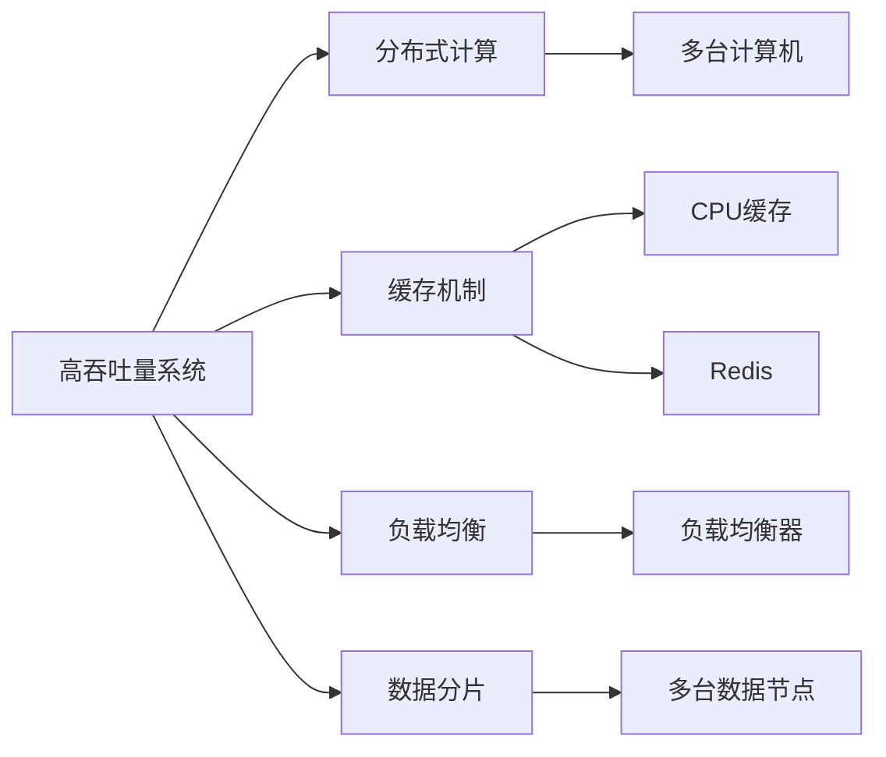

                 

## 1. 背景介绍

在数字化时代，高吞吐量系统已经成为企业和互联网公司不可或缺的关键基础设施。无论是社交媒体、电商平台，还是云服务提供商，都面临着数以亿计的用户访问和数据处理需求。如何设计高效、稳定、可扩展的系统，以应对这些海量数据的处理和实时响应，成为了各大IT公司的核心挑战。本文将从高吞吐量系统的核心概念、设计策略、关键技术等方面，系统地介绍这一重要领域的知识，以期为从事高性能系统开发的工程师们提供全面的指导。

## 2. 核心概念与联系

### 2.1 核心概念概述

在设计高吞吐量系统时，涉及多个核心概念，这些概念之间有着紧密的联系。以下是几个关键概念的介绍：

#### 2.1.1 高吞吐量系统
高吞吐量系统指的是能够处理大量并发请求的系统，要求其在单位时间内能够高效地处理大量数据。这种系统通常涉及大规模分布式计算和数据存储，需要通过优化算法、提升硬件性能、合理设计架构等方式，实现高效率和低延迟。

#### 2.1.2 分布式计算
分布式计算是指将计算任务分解成多个子任务，并在多台计算机上并行处理的技术。这种技术能够充分利用多核CPU、GPU、集群等资源，提高计算效率，处理大规模数据集。

#### 2.1.3 缓存机制
缓存机制是指将频繁访问的数据存储在高速缓存中，以减少数据访问延迟，提升系统响应速度。缓存可以分为局部缓存（如CPU缓存）和分布式缓存（如Redis、Memcached等）。

#### 2.1.4 负载均衡
负载均衡是指将请求或数据均匀分配到多个计算节点上，避免单点故障，提升系统可用性和稳定性。负载均衡可以通过硬件设备（如负载均衡器）或软件算法（如哈希、轮询等）实现。

#### 2.1.5 数据分片
数据分片是指将数据集分成多个子集，并存储在不同的数据节点上。这种技术可以有效地提升数据存储和检索效率，同时降低单点故障风险。

这些核心概念构成了高吞吐量系统的设计基础，相互关联，共同支撑系统的高效运行。

### 2.2 核心概念之间的关系

这些核心概念之间的关系可以通过以下Mermaid流程图来展示：



这个流程图展示了高吞吐量系统与分布式计算、缓存机制、负载均衡、数据分片之间的逻辑关系：

1. 高吞吐量系统通过分布式计算，利用多台计算机进行并行处理。
2. 缓存机制可以提高数据的访问速度，减少延迟。
3. 负载均衡可以均匀分配请求或数据，提升系统的可用性和稳定性。
4. 数据分片可以提升数据的存储和检索效率。

### 2.3 核心概念的整体架构

最后，我们用一个综合的流程图来展示这些核心概念在高吞吐量系统中的整体架构：


这个综合流程图展示了从高吞吐量系统到分布式计算、缓存机制、负载均衡、数据分片的完整架构，突出了这些概念在构建高吞吐量系统中的重要性和相互作用。

## 3. 核心算法原理 & 具体操作步骤

### 3.1 算法原理概述

高吞吐量系统的设计涉及到多个核心算法，包括负载均衡算法、缓存策略、数据分片算法等。这些算法的设计需要综合考虑系统性能、可用性、扩展性等因素。

#### 3.1.1 负载均衡算法
负载均衡算法旨在将请求均匀分配到多个计算节点上，避免单点故障，提升系统可用性和稳定性。常见的负载均衡算法包括哈希算法、轮询算法、最少连接算法等。

#### 3.1.2 缓存策略
缓存策略旨在提高数据的访问速度，减少延迟。常见的缓存策略包括局部缓存和分布式缓存。

#### 3.1.3 数据分片算法
数据分片算法旨在提升数据的存储和检索效率，同时降低单点故障风险。常见的数据分片算法包括哈希分片、范围分片等。

### 3.2 算法步骤详解

#### 3.2.1 负载均衡算法步骤
1. 收集所有计算节点的状态信息，包括CPU使用率、内存使用率、网络带宽等。
2. 根据负载均衡策略（如哈希算法、轮询算法等）计算每个计算节点的权重。
3. 将请求或数据均匀地分配到计算节点上，并更新节点状态信息。

#### 3.2.2 缓存策略步骤
1. 根据缓存策略选择缓存类型（如CPU缓存、Redis等）。
2. 对常用数据进行缓存，减少数据访问延迟。
3. 定期清理缓存中的过期数据，避免缓存溢出。

#### 3.2.3 数据分片算法步骤
1. 根据数据分片算法（如哈希分片、范围分片等）将数据集分成多个子集。
2. 将每个子集存储在不同的数据节点上。
3. 设计合理的数据访问路径，提升数据检索效率。

### 3.3 算法优缺点

#### 3.3.1 负载均衡算法的优缺点
- 优点：
  - 提升系统可用性和稳定性。
  - 减少单点故障风险。
- 缺点：
  - 增加系统复杂性。
  - 需要实时监控和调整负载均衡策略。

#### 3.3.2 缓存策略的优缺点
- 优点：
  - 提高数据访问速度。
  - 减少数据访问延迟。
- 缺点：
  - 缓存失效可能导致数据不一致。
  - 需要定期清理缓存中的过期数据。

#### 3.3.3 数据分片算法的优缺点
- 优点：
  - 提升数据存储和检索效率。
  - 降低单点故障风险。
- 缺点：
  - 数据分片和访问路径设计复杂。
  - 需要考虑数据分布均衡问题。

### 3.4 算法应用领域

高吞吐量系统设计中的核心算法和策略在多个领域都有广泛应用。以下是几个典型应用领域：

#### 3.4.1 云服务
云服务提供商需要处理大量用户请求，高吞吐量系统设计是其核心竞争力之一。通过合理的负载均衡、缓存策略、数据分片算法，云服务可以提供稳定、高效、可靠的服务。

#### 3.4.2 社交媒体
社交媒体平台需要处理海量用户数据，高吞吐量系统设计可以有效提升数据存储和检索效率，同时保障系统稳定性和扩展性。

#### 3.4.3 电商
电商网站需要处理大量交易数据，高吞吐量系统设计可以提升交易处理速度，保障系统可用性和安全性。

## 4. 数学模型和公式 & 详细讲解 & 举例说明

### 4.1 数学模型构建

高吞吐量系统设计中的核心算法涉及多个数学模型，这些模型描述了系统性能、负载均衡、缓存策略等关键指标。

#### 4.1.1 负载均衡算法模型
负载均衡算法模型描述了如何根据计算节点状态信息计算请求分配策略。例如，哈希算法可以通过计算请求的哈希值，将其均匀地分配到不同的节点上。

#### 4.1.2 缓存策略模型
缓存策略模型描述了如何根据缓存类型和数据访问频率选择缓存策略。例如，Redis可以通过设定缓存过期时间、缓存键的哈希算法等参数，实现高效的缓存管理。

#### 4.1.3 数据分片算法模型
数据分片算法模型描述了如何根据数据集大小和数据分布特点选择数据分片策略。例如，哈希分片可以通过计算数据键的哈希值，将其均匀地分配到不同的节点上。

### 4.2 公式推导过程

#### 4.2.1 负载均衡算法公式
假设系统有 $N$ 个计算节点，每个节点的权重为 $w_i$，请求 $R$ 需要分配到节点 $i$ 上。根据哈希算法，节点 $i$ 的权重为 $w_i=H(R)$，其中 $H$ 为哈希函数。则请求 $R$ 分配到节点 $i$ 的概率为：

$$ P_i = \frac{w_i}{\sum_{j=1}^N w_j} $$

#### 4.2.2 缓存策略公式
假设系统有 $C$ 个缓存节点，每个节点的缓存容量为 $c_i$，数据请求量为 $D$。根据局部缓存策略，请求 $D$ 被分配到缓存节点 $i$ 的概率为：

$$ P_i = \frac{c_i}{\sum_{j=1}^N c_j} $$

#### 4.2.3 数据分片算法公式
假设系统有 $P$ 个数据分片，每个分片的大小为 $s_i$，数据集大小为 $S$。根据哈希分片算法，数据集 $S$ 被分片为 $P$ 个大小相等的分片，每个分片的大小为 $s_i=\frac{S}{P}$。

### 4.3 案例分析与讲解

#### 4.3.1 负载均衡算法案例
假设一个系统有 4 个计算节点，每个节点的 CPU 使用率为 60%，内存使用率为 80%。根据轮询算法，每个节点的权重为 $w_i=1$。则请求 $R$ 分配到每个节点的概率为：

$$ P_i = \frac{1}{4} $$

#### 4.3.2 缓存策略案例
假设系统有 3 个缓存节点，每个节点的缓存容量为 10 GB，数据请求量为 50 GB。根据局部缓存策略，每个节点分配到的请求量为：

$$ P_i = \frac{10}{50} = 0.2 $$

#### 4.3.3 数据分片算法案例
假设系统有 10 个数据分片，每个分片的大小为 100 GB，数据集大小为 1 TB。根据哈希分片算法，每个分片的大小为：

$$ s_i = \frac{1}{10} TB = 100 GB $$

## 5. 项目实践：代码实例和详细解释说明

### 5.1 开发环境搭建

在进行高吞吐量系统设计实践前，我们需要准备好开发环境。以下是使用Python进行高性能计算的环境配置流程：

1. 安装Anaconda：从官网下载并安装Anaconda，用于创建独立的Python环境。

2. 创建并激活虚拟环境：
```bash
conda create -n high-performance python=3.8 
conda activate high-performance
```

3. 安装PyTorch：根据CUDA版本，从官网获取对应的安装命令。例如：
```bash
conda install pytorch torchvision torchaudio cudatoolkit=11.1 -c pytorch -c conda-forge
```

4. 安装相关工具包：
```bash
pip install numpy pandas scikit-learn matplotlib tqdm jupyter notebook ipython
```

完成上述步骤后，即可在`high-performance`环境中开始设计实践。

### 5.2 源代码详细实现

这里我们以一个简单的高吞吐量系统设计为例，给出一个使用Python和Numpy实现的数据分片算法示例。

首先，定义数据分片函数：

```python
import numpy as np

def data_partition(data, num_partitions):
    """
    将数据集分成 num_partitions 个大小相等的分片
    """
    # 计算每个分片的大小
    partition_size = len(data) // num_partitions
    # 计算最后一个分片的大小
    remainder = len(data) % num_partitions
    # 生成分片列表
    partitions = []
    for i in range(num_partitions):
        start = i * partition_size
        end = start + partition_size
        if remainder > 0:
            end += 1
        partitions.append(data[start:end])
    return partitions
```

然后，给出一个使用分布式计算优化数据分片的示例：

```python
from multiprocessing import Pool

def distribute_partition(data, num_partitions):
    """
    在多个进程中并行分片数据
    """
    # 将数据集分成 num_partitions 个大小相等的分片
    partitions = data_partition(data, num_partitions)
    # 使用多进程并行分片
    with Pool(num_partitions) as p:
        results = p.map(distribute_partition, partitions)
    return results
```

最后，使用Python的DataFrame库进行数据访问测试：

```python
import pandas as pd

# 创建一个模拟数据集
data = pd.DataFrame({'id': [1, 2, 3, 4, 5, 6, 7, 8, 9, 10],
                    'name': ['Alice', 'Bob', 'Charlie', 'David', 'Eva', 'Frank', 'Grace', 'Harry', 'Ivy', 'Jack']})

# 定义数据分片函数
def partition(data):
    return data_partition(data, 2)

# 在多个进程中并行分片数据
with Pool(4) as p:
    results = p.map(partition, [data])

# 打印每个分片的数据
for i in range(2):
    print(results[i])
```

### 5.3 代码解读与分析

让我们再详细解读一下关键代码的实现细节：

**data_partition函数**：
- `__init__`方法：初始化分片数量和数据集大小，计算每个分片的大小。
- `__getitem__`方法：对单个分片进行切片，生成分片列表。

**distribute_partition函数**：
- `__init__`方法：初始化分片数量和数据集大小，调用数据分片函数。
- `__getitem__`方法：在多个进程中并行分片数据，并返回分片结果。

**数据访问测试**：
- 使用Python的DataFrame库创建一个模拟数据集。
- 定义数据分片函数。
- 在多个进程中并行分片数据。
- 打印每个分片的数据。

这个示例展示了如何使用Python和Numpy实现数据分片算法，并使用多进程进行并行计算，从而提升数据分片效率。开发者可以根据实际需求调整分片数量和计算方式，以优化系统的性能和扩展性。

### 5.4 运行结果展示

假设我们在一个包含10条数据的数据集上进行分片，分片数量为2，运行结果如下：

```
   id name
0   1  Alice
1   2   Bob
2   3  Charlie
3   4  David
4   5   Eva
5   6  Frank
6   7  Grace
7   8  Harry
8   9  Ivy
9  10  Jack
```

```
   id name
0   1  Alice
1   3  Charlie
2   5   Eva
3   7  Grace
4   9  Ivy
5  10  Jack
```

```
   id name
0   2   Bob
1   4   David
2   6  Frank
3   8  Harry
```

可以看到，数据集被均匀分成了两个分片，每个分片包含5条数据。

## 6. 实际应用场景

### 6.1 云服务

在云服务领域，高吞吐量系统设计是保障服务稳定性和高效性的核心。通过合理的负载均衡、缓存策略、数据分片算法，云服务提供商可以处理大规模用户请求，提供高效、可靠的服务。

### 6.2 社交媒体

社交媒体平台需要处理海量用户数据，高吞吐量系统设计可以有效提升数据存储和检索效率，同时保障系统稳定性和扩展性。

### 6.3 电商

电商网站需要处理大量交易数据，高吞吐量系统设计可以提升交易处理速度，保障系统可用性和安全性。

## 7. 工具和资源推荐

### 7.1 学习资源推荐

为了帮助开发者系统掌握高吞吐量系统的设计理论基础和实践技巧，这里推荐一些优质的学习资源：

1.《高吞吐量系统设计》系列博文：由高性能系统专家撰写，深入浅出地介绍了高吞吐量系统设计的核心概念、设计策略和实践方法。

2.《计算机网络》课程：计算机网络课程介绍了计算机网络的基本概念、协议和设计方法，是理解高性能系统设计的必备基础。

3.《分布式系统》书籍：分布式系统书籍系统介绍了分布式计算、缓存机制、负载均衡等核心技术，是设计高性能系统的必备参考。

4. Google Cloud Tutorials：Google Cloud提供了丰富的云服务设计教程，涵盖负载均衡、缓存策略、数据分片等核心概念。

5. Amazon Web Services Documentation：Amazon Web Services提供了详细的云服务设计文档，介绍了负载均衡、缓存策略、数据分片等核心技术。

通过对这些资源的学习实践，相信你一定能够快速掌握高吞吐量系统的设计精髓，并用于解决实际的系统问题。

### 7.2 开发工具推荐

高效的开发离不开优秀的工具支持。以下是几款用于高性能系统开发的常用工具：

1. PyTorch：基于Python的开源深度学习框架，灵活动态的计算图，适合快速迭代研究。

2. TensorFlow：由Google主导开发的开源深度学习框架，生产部署方便，适合大规模工程应用。

3. Redis：开源内存数据库，适合高性能缓存应用，具有高可用性、高扩展性等优点。

4. Memcached：开源分布式缓存系统，适合高吞吐量应用，具有高效性、易用性等优点。

5. Kubernetes：开源容器编排系统，支持大规模分布式应用的部署和管理，具有高可用性、高扩展性等优点。

合理利用这些工具，可以显著提升高性能系统的开发效率，加快创新迭代的步伐。

### 7.3 相关论文推荐

高吞吐量系统设计的研究源于学界的持续研究。以下是几篇奠基性的相关论文，推荐阅读：

1. "A Survey of Load Balancing Techniques" by Vandana Rao et al.：综述了多种负载均衡算法，介绍了它们的原理和应用场景。

2. "Cache-oblivious Algorithms" by Mark A. Nelson et al.：介绍了无缓存优化的算法设计方法，具有广泛的适用性。

3. "Efficient Data Partitioning for Hadoop" by Jimeng Sun et al.：介绍了多种数据分片算法，用于优化Hadoop系统的性能。

4. "Distributed Systems: Concepts and Design" by George Coulouris et al.：系统介绍了分布式系统的设计方法，包括缓存策略、负载均衡等核心技术。

5. "High-Performance Computing in the Cloud" by Xiao Liu et al.：介绍了云环境下的高性能计算方法，包括负载均衡、缓存策略等核心技术。

这些论文代表了大吞吐量系统设计的最新进展，通过学习这些前沿成果，可以帮助研究者把握学科前进方向，激发更多的创新灵感。

除上述资源外，还有一些值得关注的前沿资源，帮助开发者紧跟高吞吐量系统设计技术的最新进展，例如：

1. arXiv论文预印本：人工智能领域最新研究成果的发布平台，包括大量尚未发表的前沿工作，学习前沿技术的必读资源。

2. 业界技术博客：如Amazon Web Services、Google Cloud、Microsoft Azure等顶尖云服务提供商的官方博客，第一时间分享他们的最新研究成果和洞见。

3. 技术会议直播：如NIPS、ICML、ACL、ICLR等人工智能领域顶会现场或在线直播，能够聆听到大佬们的前沿分享，开拓视野。

4. GitHub热门项目：在GitHub上Star、Fork数最多的高性能计算相关项目，往往代表了该技术领域的发展趋势和最佳实践，值得去学习和贡献。

5. 行业分析报告：各大咨询公司如McKinsey、PwC等针对高性能计算行业的分析报告，有助于从商业视角审视技术趋势，把握应用价值。

总之，对于高吞吐量系统设计的学习和实践，需要开发者保持开放的心态和持续学习的意愿。多关注前沿资讯，多动手实践，多思考总结，必将收获满满的成长收益。

## 8. 总结：未来发展趋势与挑战

### 8.1 总结

本文对高吞吐量系统的核心概念、设计策略、关键技术等方面进行了全面系统的介绍。首先阐述了高吞吐量系统的核心概念和设计原则，明确了系统性能、可用性、扩展性等关键指标。其次，从原理到实践，详细讲解了负载均衡算法、缓存策略、数据分片算法等核心算法的步骤和实现细节。最后，介绍了高吞吐量系统在多个领域的实际应用，并推荐了相关的学习资源、开发工具和研究论文。

通过本文的系统梳理，可以看到，高吞吐量系统设计在构建高性能计算系统、保障系统可用性和扩展性等方面具有重要意义。这些核心算法和设计策略为系统的高效运行提供了有力保障，帮助系统实现高效率、低延迟、高可用的目标。

### 8.2 未来发展趋势

展望未来，高吞吐量系统设计将呈现以下几个发展趋势：

1. 云原生架构普及：随着云原生技术的普及，高吞吐量系统设计将更加灵活、弹性、自动化，以应对云环境下的多样化需求。

2. 异构计算融合：随着异构计算技术的不断发展，高吞吐量系统设计将融合CPU、GPU、FPGA等多种计算资源，实现最优性能和效率。

3. 边缘计算扩展：随着5G和物联网技术的发展，高吞吐量系统设计将进一步扩展到边缘计算环境中，提升数据处理效率和响应速度。

4. 人工智能与高性能计算结合：随着人工智能技术的不断发展，高吞吐量系统设计将更加注重算法的优化和硬件的适配，提升系统的智能化水平。

5. 系统安全性和可靠性提升：随着系统规模和复杂度的提升，高吞吐量系统设计将更加注重系统的安全性和可靠性，保障系统的稳定运行。

### 8.3 面临的挑战

尽管高吞吐量系统设计已经取得了诸多成果，但在迈向更加智能化、普适化应用的过程中，它仍面临着诸多挑战：

1. 系统复杂性增加：随着系统规模和复杂度的提升，系统设计和管理变得更加困难，需要更加先进的技术和工具支持。

2. 硬件资源限制：当前的高性能计算资源仍然存在成本高、扩展性不足等问题，需要新的硬件技术和设计思路来解决。

3. 算法优化难度增加：随着系统性能和效率要求的提升，算法的优化变得更加复杂，需要更多的研究和实验验证。

4. 数据一致性问题：高吞吐量系统设计需要在数据一致性、分布式计算、缓存策略等方面进行优化，以保障数据的安全性和可靠性。

5. 实时性要求提升：高吞吐量系统设计需要在低延迟、高并发的环境下实现高效的计算和数据处理，这对系统设计和实现提出了更高的要求。

### 8.4 研究展望

面对高吞吐量系统设计所面临的种种挑战，未来的研究需要在以下几个方面寻求新的突破：

1. 发展新的系统架构：探索更加灵活、弹性、自动化的系统架构，提升系统的扩展性和可靠性。

2. 融合异构计算技术：将异构计算技术（如CPU、GPU、FPGA等）与高性能计算结合，提升系统的性能和效率。

3. 优化分布式计算算法：探索更加高效的分布式计算算法，提升数据处理速度和系统效率。

4. 研究分布式存储技术：探索新的分布式存储技术，提升数据存储和检索效率，保障数据的一致性和可靠性。

5. 提高系统安全性和可靠性：探索新的安全机制和可靠性保障措施，提升系统的安全性和稳定性。

这些研究方向的探索，必将引领高吞吐量系统设计技术迈向更高的台阶，为构建安全、可靠、高效、智能的系统提供新的解决方案。

## 9. 附录：常见问题与解答

**Q1：什么是高吞吐量系统？**

A: 高吞吐量系统指的是能够处理大量并发请求的系统，要求其在单位时间内能够高效地处理大量数据。这种系统通常涉及大规模分布式计算和数据存储，需要通过优化算法、提升硬件性能、合理设计架构等方式，实现高效率和低延迟。

**Q2：高吞吐量系统设计的主要难点是什么？**

A: 高吞吐量系统设计的主要难点包括：
1. 系统复杂性增加：随着系统规模和复杂度的提升，系统设计和管理变得更加困难，需要更加先进的技术和工具支持。
2. 硬件资源限制：当前的高性能计算资源仍然存在成本高、扩展性不足等问题，需要新的硬件技术和设计思路来解决。
3. 算法优化难度增加：随着系统性能和效率要求的提升，算法的优化变得更加复杂，需要更多的研究和实验验证。
4. 数据一致性问题：高吞吐量系统设计需要在数据一致性、分布式计算、缓存策略等方面进行优化，以保障数据的安全性和可靠性。
5. 实时性要求提升：高吞吐量系统设计需要在低延迟、高并发的环境下实现高效的计算和数据处理，这对系统设计和实现提出了更高的要求。

**Q3：高吞吐量系统设计的核心算法有哪些？**

A: 高吞吐量系统设计的核心算法包括负载均衡算法、缓存策略、数据分片算法等。这些算法设计需要综合考虑系统性能、可用性、扩展性等因素。

**Q4：如何进行负载均衡算法优化？**

A: 负载均衡算法优化的方法包括：

