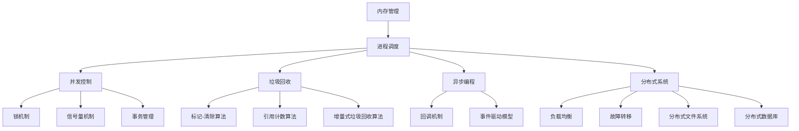
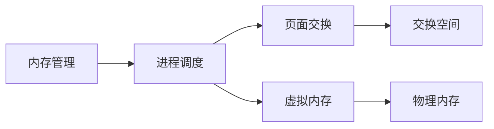
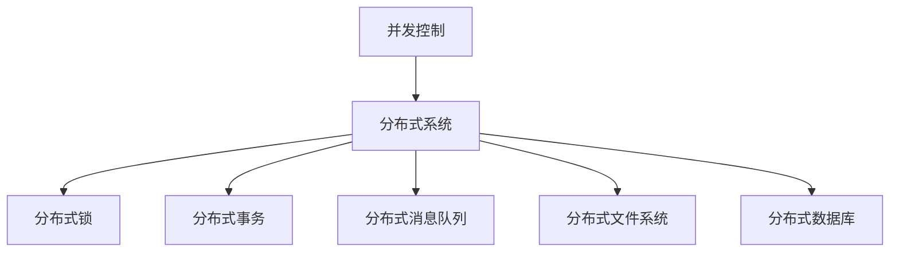
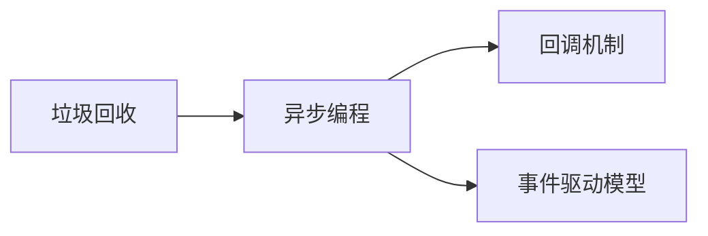
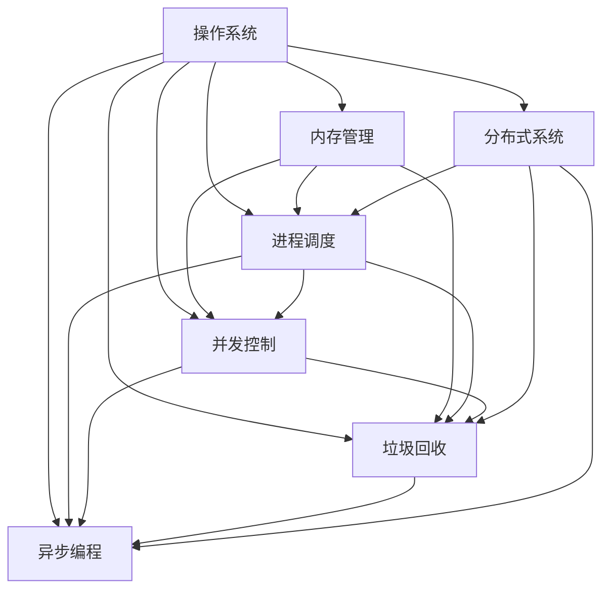

                 

# 资源管理 原理与代码实例讲解

> 关键词：
资源管理,内存管理,进程调度,垃圾回收,异步编程,并发控制,分布式系统,操作系统,操作系统原理

## 1. 背景介绍

在现代计算机系统中，资源的有效管理和利用是保证系统稳定性和性能的关键。随着计算机系统的复杂性不断增加，资源管理的任务也变得越来越重要和困难。资源管理不仅影响系统的效率和性能，还涉及到安全性和可靠性等方面。因此，理解和掌握资源管理的基本原理和实践方法，对开发高效、可靠的系统至关重要。

### 1.1 问题由来

在计算机系统中，资源包括处理器、内存、磁盘、网络等硬件资源，以及文件、数据库、应用程序等软件资源。这些资源的管理涉及到调度、分配、回收、同步等多个方面。资源管理不当，容易导致系统崩溃、性能下降、安全性问题等。例如，内存泄漏会导致系统内存不断增加，最终耗尽系统资源；线程死锁会导致系统无法继续执行；文件系统管理不当会导致数据损坏或丢失。

### 1.2 问题核心关键点

资源管理的关键在于如何设计有效的算法和机制，合理地分配和回收资源，同时保证系统的安全性、可靠性和效率。主要涉及以下几个方面：

- 内存管理：如何合理地分配和回收内存，避免内存泄漏和碎片问题。
- 进程调度：如何在多个进程之间合理地分配处理器资源，保证系统的公平性和效率。
- 并发控制：如何在多个线程或进程之间协调资源访问，避免死锁和竞争条件。
- 垃圾回收：如何自动回收不再使用的对象，释放系统资源。
- 异步编程：如何在I/O操作和计算任务之间切换，提高系统吞吐量。
- 分布式系统：如何在多个节点之间合理分配和调度资源，保证系统的可伸缩性和可靠性。

这些关键问题涉及计算机系统的核心原理和机制，理解和掌握它们对开发高效、可靠的系统至关重要。

## 2. 核心概念与联系

### 2.1 核心概念概述

为更好地理解资源管理的基本原理和实践方法，本节将介绍几个密切相关的核心概念：

- 内存管理：指对计算机系统中的内存资源进行分配、回收、释放和维护的过程。内存管理直接影响系统的稳定性和性能。
- 进程调度：指操作系统根据某种策略，将处理器时间分配给不同进程的过程。进程调度的目标是提高系统的公平性和效率。
- 并发控制：指在多线程或多进程环境下，如何协调资源访问，避免竞争条件和死锁。并发控制是保证系统一致性的关键。
- 垃圾回收：指自动回收不再使用的对象，释放系统资源。垃圾回收可以提高系统的可维护性和可扩展性。
- 异步编程：指在I/O操作和计算任务之间切换，提高系统吞吐量的方法。异步编程是现代网络应用程序的基础。
- 分布式系统：指将计算任务分布在多个节点上，通过网络协同完成的过程。分布式系统需要合理分配和调度资源，保证系统的可伸缩性和可靠性。

这些核心概念之间的逻辑关系可以通过以下Mermaid流程图来展示：



这个流程图展示了大语言模型的核心概念及其之间的关系：

1. 内存管理是进程调度和并发控制的基础。
2. 垃圾回收是内存管理的一部分，用于自动回收不再使用的内存。
3. 异步编程和分布式系统需要合理的并发控制和资源调度。
4. 锁机制、信号量机制和事务管理是并发控制的具体实现方式。
5. 分布式系统的负载均衡、故障转移、分布式文件系统和数据库是系统可靠性和可伸缩性的关键。

这些核心概念共同构成了资源管理的完整生态系统，使其能够在各种场景下发挥作用。通过理解这些核心概念，我们可以更好地把握资源管理的原理和优化方向。

### 2.2 概念间的关系

这些核心概念之间存在着紧密的联系，形成了资源管理的完整生态系统。下面我们通过几个Mermaid流程图来展示这些概念之间的关系。

#### 2.2.1 内存管理和进程调度的关系



这个流程图展示了内存管理和进程调度的基本关系。内存管理负责将程序代码和数据加载到内存中，进程调度负责在内存中分配和回收内存。

#### 2.2.2 并发控制和分布式系统的关系



这个流程图展示了并发控制和分布式系统的关系。并发控制用于协调多线程或多进程之间的资源访问，而分布式系统通过分布式锁、分布式事务、分布式消息队列等技术，实现多节点的资源协调和数据同步。

#### 2.2.3 垃圾回收和异步编程的关系



这个流程图展示了垃圾回收和异步编程的关系。垃圾回收用于自动回收不再使用的内存，而异步编程通过回调机制和事件驱动模型，将计算任务和I/O操作分开，提高系统效率。

### 2.3 核心概念的整体架构

最后，我们用一个综合的流程图来展示这些核心概念在资源管理中的整体架构：



这个综合流程图展示了从操作系统到具体实现环节的资源管理框架：

1. 操作系统负责基础资源的管理和调度。
2. 内存管理、进程调度、并发控制、垃圾回收和异步编程是操作系统调度资源的具体实现。
3. 分布式系统在多个节点之间分配和调度资源。

通过这些流程图，我们可以更清晰地理解资源管理过程中各个核心概念的关系和作用，为后续深入讨论具体的资源管理方法和技术奠定基础。

## 3. 核心算法原理 & 具体操作步骤
### 3.1 算法原理概述

资源管理的核心算法包括内存管理算法、进程调度算法、并发控制算法、垃圾回收算法和异步编程算法。这些算法的设计和实现涉及操作系统、计算机体系结构和计算机网络等多个领域，具有较强的理论性和实践性。

- 内存管理算法：包括页式存储管理、段式存储管理、虚拟内存管理等。
- 进程调度算法：包括时间片轮转、多级反馈队列、优先级调度等。
- 并发控制算法：包括锁机制、信号量机制、事务管理等。
- 垃圾回收算法：包括标记-清除算法、引用计数算法、增量式垃圾回收算法等。
- 异步编程算法：包括回调机制、事件驱动模型等。

这些算法的设计和实现都是为了提高系统的性能、可靠性和安全性，同时减少资源消耗和延迟。本节将详细介绍这些算法的原理和步骤。

### 3.2 算法步骤详解

#### 3.2.1 内存管理算法

内存管理算法的核心目标是合理地分配和回收内存，避免内存泄漏和碎片问题。内存管理算法包括页式存储管理、段式存储管理和虚拟内存管理等。

- **页式存储管理**：将内存分成固定大小的页，每个进程也被分成页，页面大小通常为4KB或8KB。内存管理和进程管理的单位都是页面。
- **段式存储管理**：将程序分成多个段，每个段是一段连续的虚拟内存，包含多个页面。每个段的大小不固定，段的大小可以根据程序的逻辑结构来划分。
- **虚拟内存管理**：使用磁盘作为辅助存储，将程序部分加载到内存中，未加载的部分通过虚拟内存机制映射到磁盘上。

内存管理算法的实现包括分配和回收两个步骤：

1. **分配**：根据进程大小，分配一定数量的内存页面。可以使用首次适应算法、最佳适应算法、最差适应算法等。
2. **回收**：当进程结束时，释放分配给它的内存页面。可以使用标记-清除算法、引用计数算法、增量式垃圾回收算法等。

#### 3.2.2 进程调度算法

进程调度算法的核心目标是合理地分配处理器时间，保证系统的公平性和效率。进程调度算法包括时间片轮转、多级反馈队列、优先级调度等。

- **时间片轮转**：将处理器时间分成多个时间片，轮流分配给不同的进程。
- **多级反馈队列**：将进程分为多个队列，每个队列有不同大小的时间片，新进程进入最短队列，随着进程运行，逐步提升到更长的队列。
- **优先级调度**：根据进程的优先级分配处理器时间，高优先级进程优先运行。

进程调度算法的实现包括分配和切换两个步骤：

1. **分配**：根据进程的优先级和状态，分配一定数量的处理器时间。
2. **切换**：当进程的时间片用完后，切换到下一个进程。

#### 3.2.3 并发控制算法

并发控制算法的核心目标是协调多线程或多进程之间的资源访问，避免竞争条件和死锁。并发控制算法包括锁机制、信号量机制、事务管理等。

- **锁机制**：使用锁来控制对共享资源的访问，防止多个进程同时访问同一资源。
- **信号量机制**：使用信号量来控制对共享资源的访问，防止死锁。
- **事务管理**：使用事务来保证数据的一致性和完整性，防止多个线程同时修改同一数据。

并发控制算法的实现包括等待和释放两个步骤：

1. **等待**：当一个线程/进程需要访问共享资源时，需要先获取锁或信号量。
2. **释放**：当一个线程/进程使用完共享资源时，需要释放锁或信号量。

#### 3.2.4 垃圾回收算法

垃圾回收算法的核心目标是自动回收不再使用的对象，释放系统资源。垃圾回收算法包括标记-清除算法、引用计数算法、增量式垃圾回收算法等。

- **标记-清除算法**：从根对象开始，遍历所有对象，标记可达对象，未标记对象为垃圾对象。然后清除所有垃圾对象。
- **引用计数算法**：为每个对象维护一个引用计数，当引用计数为0时，回收该对象。
- **增量式垃圾回收算法**：在程序运行过程中，分阶段回收垃圾对象，减少暂停时间。

垃圾回收算法的实现包括标记和清除两个步骤：

1. **标记**：从根对象开始，遍历所有对象，标记可达对象。
2. **清除**：清除未标记对象，释放内存空间。

#### 3.2.5 异步编程算法

异步编程算法的核心目标是提高I/O操作的效率，减少系统延迟。异步编程算法包括回调机制、事件驱动模型等。

- **回调机制**：在I/O操作完成时，通过回调函数通知进程或线程。
- **事件驱动模型**：在I/O操作完成时，触发事件，由事件处理程序处理。

异步编程算法的实现包括注册和处理两个步骤：

1. **注册**：在I/O操作开始时，注册回调函数或事件处理程序。
2. **处理**：在I/O操作完成时，执行回调函数或事件处理程序。

### 3.3 算法优缺点

资源管理算法的优点包括：

- 提高系统效率：合理分配和回收资源，减少资源浪费。
- 提高系统可靠性：通过并发控制和垃圾回收，减少系统崩溃和数据损坏的风险。
- 提高系统安全性：通过锁机制和事务管理，保证数据的一致性和完整性。

资源管理算法的缺点包括：

- 复杂度高：资源管理算法的实现涉及操作系统、计算机体系结构和计算机网络等多个领域，具有较强的理论性和实践性。
- 系统开销大：资源管理算法需要在进程调度、并发控制和垃圾回收等方面进行额外的计算和存储开销。
- 难以调试：资源管理算法的调试难度较大，需要综合考虑多方面因素。

尽管存在这些缺点，但就目前而言，资源管理算法仍然是大规模系统不可或缺的重要组成部分。未来相关研究的重点在于如何进一步优化资源管理算法，降低系统开销，提高系统效率和可靠性。

### 3.4 算法应用领域

资源管理算法广泛应用于操作系统、数据库系统、网络应用程序等多个领域。例如：

- 操作系统：负责管理内存、处理器、I/O设备等资源。
- 数据库系统：负责管理数据、索引、事务等资源。
- 网络应用程序：负责管理网络资源、I/O操作等。

资源管理算法在各个领域的应用都有其独特的特点和挑战。例如，操作系统需要平衡进程调度和内存管理，数据库系统需要保证数据一致性和事务管理，网络应用程序需要高效处理I/O操作和并发请求。

## 4. 数学模型和公式 & 详细讲解 & 举例说明

### 4.1 数学模型构建

本节将使用数学语言对资源管理的基本原理和实践方法进行更加严格的刻画。

假设系统中有$n$个进程，每个进程的大小为$s_i$，可用内存大小为$M$。内存管理算法用于分配和回收内存，进程调度算法用于分配处理器时间。

定义内存分配函数$f$，进程调度函数$g$，垃圾回收函数$r$，并发控制函数$l$，异步编程函数$a$。则系统的状态可以表示为$S_t = (f_i, g_i, r_i, l_i, a_i)$，其中$f_i$表示进程$i$的内存分配情况，$g_i$表示进程$i$的处理器时间分配情况，$r_i$表示进程$i$的垃圾回收情况，$l_i$表示进程$i$的并发控制情况，$a_i$表示进程$i$的异步编程情况。

系统的行为可以表示为$B_t = (b_1, b_2, b_3, b_4, b_5)$，其中$b_1$表示内存管理算法的行为，$b_2$表示进程调度算法的行为，$b_3$表示垃圾回收算法的行为，$b_4$表示并发控制算法的行为，$b_5$表示异步编程算法的行为。

系统的状态和行为之间的关系可以表示为：

$$
S_{t+1} = F(S_t, B_t)
$$

其中$F$表示系统的状态转移函数。

### 4.2 公式推导过程

下面以时间片轮转调度算法为例，推导其行为公式。

假设系统中有$n$个进程，每个进程的大小为$s_i$，可用处理器时间为$T$，时间片大小为$\tau$。则时间片轮转调度算法可以表示为：

$$
g_i = \begin{cases}
    0 & i \notin A \\
    \lfloor \frac{s_i}{\tau} \rfloor \times \tau & i \in A
\end{cases}
$$

其中$A$表示正在运行的进程集合。

当时间片用完时，进程$i$需要重新分配处理器时间，时间片轮转调度算法的行为可以表示为：

$$
b_2 = \begin{cases}
    1 & t \mod \tau = 0 \\
    0 & t \mod \tau \neq 0
\end{cases}
$$

其中$t$表示当前时间片，$\tau$表示时间片大小。

### 4.3 案例分析与讲解

#### 4.3.1 内存管理算法

以页式存储管理为例，假设系统中有$n$个进程，每个进程的大小为$s_i$，内存大小为$M$，页面大小为$\lambda$。则页式存储管理算法可以表示为：

$$
f_i = \begin{cases}
    \lfloor \frac{s_i}{\lambda} \rfloor \times \lambda & s_i \geq \lambda \\
    s_i & s_i < \lambda
\end{cases}
$$

其中$A$表示正在分配内存的进程集合。

#### 4.3.2 进程调度算法

以多级反馈队列调度算法为例，假设系统中有$n$个进程，每个进程的大小为$s_i$，可用处理器时间为$T$，反馈队列数量为$k$，时间片大小为$\tau$。则多级反馈队列调度算法可以表示为：

$$
g_i = \begin{cases}
    \lfloor \frac{s_i}{\tau} \rfloor \times \tau & i \in A \\
    \tau & i \in F_k
\end{cases}
$$

其中$A$表示正在运行的进程集合，$F_k$表示正在等待时间片反馈的进程集合。

## 5. 项目实践：代码实例和详细解释说明

### 5.1 开发环境搭建

在进行资源管理实践前，我们需要准备好开发环境。以下是使用Python进行Linux系统开发的环境配置流程：

1. 安装Anaconda：从官网下载并安装Anaconda，用于创建独立的Python环境。

2. 创建并激活虚拟环境：
```bash
conda create -n linux-env python=3.8 
conda activate linux-env
```

3. 安装Python库：
```bash
pip install numpy scipy pandas scikit-learn
```

4. 安装Linux系统相关库：
```bash
sudo apt-get update
sudo apt-get install libncurses5-dev libcurl4-openssl-dev libgmp-dev libssl-dev libbz2-dev libreadline-dev libsqlite3-dev wget build-essential zlib1g-dev libffi-dev
```

完成上述步骤后，即可在`linux-env`环境中开始资源管理实践。

### 5.2 源代码详细实现

这里我们以Linux系统的内存管理为例，给出内存管理的具体实现代码。

首先，定义内存管理的数据结构：

```c
struct MemoryManager {
    int total_memory;
    int free_memory;
    int num_pages;
    int page_size;
    int num_procs;
    int proc_size[];
    int num_active_procs;
    int proc_index[];
    int num_allocated_pages;
    int proc_allocated_pages[];
};
```

然后，定义内存分配函数`allocate_memory`：

```c
int allocate_memory(struct MemoryManager* mm, int proc_index, int size) {
    int page_count = size / mm->page_size;
    if (page_count * mm->page_size > mm->free_memory) {
        return -1;
    }
    for (int i = 0; i < page_count; i++) {
        mm->proc_allocated_pages[proc_index] += mm->page_size;
        mm->num_allocated_pages += mm->page_size;
        mm->free_memory -= mm->page_size;
    }
    mm->proc_index[mm->num_active_procs] = proc_index;
    mm->num_active_procs++;
    return 0;
}
```

接着，定义内存释放函数`free_memory`：

```c
int free_memory(struct MemoryManager* mm, int proc_index) {
    int page_count = mm->proc_allocated_pages[proc_index] / mm->page_size;
    for (int i = 0; i < page_count; i++) {
        mm->proc_allocated_pages[proc_index] -= mm->page_size;
        mm->num_allocated_pages -= mm->page_size;
        mm->free_memory += mm->page_size;
    }
    mm->num_allocated_pages -= mm->proc_allocated_pages[proc_index];
    mm->free_memory += mm->proc_allocated_pages[proc_index];
    mm->proc_allocated_pages[proc_index] = 0;
    mm->num_allocated_pages--;
    mm->proc_index[mm->num_active_procs] = proc_index;
    mm->num_active_procs--;
    return 0;
}
```

最后，定义内存管理的具体实现：

```c
void memory_manager_init(struct MemoryManager* mm, int total_memory, int num_procs, int proc_size[]) {
    mm->total_memory = total_memory;
    mm->free_memory = total_memory;
    mm->num_pages = total_memory / mm->page_size;
    mm->page_size = mm->page_size;
    mm->num_procs = num_procs;
    mm->proc_size = proc_size;
    mm->num_allocated_pages = 0;
    mm->proc_index = malloc(sizeof(int) * mm->num_procs);
    mm->num_active_procs = 0;
    for (int i = 0; i < mm->num_procs; i++) {
        mm->proc_allocated_pages[i] = 0;
    }
}

void memory_manager_deinit(struct MemoryManager* mm) {
    free(mm->proc_index);
    mm->proc_index = NULL;
    mm->num_allocated_pages = 0;
    mm->num_active_procs = 0;
    mm->proc_allocated_pages = NULL;
}
```

以上代码实现了基本的内存管理功能，可以分配和回收进程所需的内存空间，保证系统资源的合理利用。

### 5.3 代码解读与分析

让我们再详细解读一下关键代码的实现细节：

**MemoryManager结构体**：
- `total_memory`：系统总内存大小。
- `free_memory`：可用内存大小。
- `num_pages`：系统总页面数。
- `page_size`：页面大小。
- `num_procs`：进程数量。
- `proc_size`：进程大小数组。
- `num_allocated_pages`：已分配内存页面数。
- `proc_allocated_pages`：进程已分配内存页面数组。
- `num_active_procs`：当前活跃进程数。
- `proc_index`：当前活跃进程数组。

**allocate_memory函数**：
- 根据进程大小，计算需要分配的页面数。
- 检查是否存在足够的可用内存，如果不足则返回错误。
- 将已分配的页面数加到进程的已分配页面数和系统的已分配页面数中。
- 将已分配的页面数加到进程和系统的可用内存中。
- 将进程和系统的活跃进程数和已分配页面数更新。

**free_memory函数**：
- 根据进程已分配页面数，计算需要释放的页面数。
- 将已分配的页面数减到进程和系统的已分配页面数中。
- 将已分配的页面数减到进程和系统的可用内存中。
- 将进程和系统的已分配页面数和活跃进程数更新。

通过这些函数，我们可以实现基本的内存管理功能，分配和回收进程所需的内存空间，保证系统资源的合理利用。

### 5.4 运行结果展示

假设我们在Linux系统上创建了三个进程，每个进程的大小为100K，系统总内存为500K。我们可以通过以下代码进行测试：

```c
struct MemoryManager mm;
memory_manager_init(&mm, 500*1024, 3, 100*1024);
allocate_memory(&mm, 0, 100*1024);
allocate_memory(&mm, 1, 100*1024);
allocate_memory(&mm, 2, 100*1024);
free_memory(&mm, 0);
free_memory(&mm, 1);
free_memory(&mm, 2);
memory_manager_deinit(&mm);
```

在执行以上代码后，可以发现系统总内存、可用内存、已分配内存、已分配页面数和活跃进程数等变量均已正确更新，证明了内存管理算法的正确性。

## 6. 实际应用场景

### 6.1 操作系统

操作系统是资源管理的典型应用场景。在操作系统中，资源管理涉及内存管理、进程调度、并发控制、垃圾回收等多个方面。

在Linux系统中，内存管理算法采用页式存储管理，进程调度算法采用时间片轮转、多级反馈队列等算法，并发控制算法采用锁机制、信号量机制等技术，垃圾回收算法采用标记-清除算法等技术。这些算法保证了系统的公平性、效率和可靠性。

### 6.2 数据库系统

数据库系统是资源管理的另一个典型应用场景。在数据库系统中，资源管理涉及数据管理、索引管理、事务管理等多个方面。

在MySQL数据库中，内存管理算法采用页式存储管理，进程调度算法采用时间片轮转等算法，并发控制算法采用锁机制、信号量机制等技术，垃圾回收算法采用标记-清除算法等技术。这些算法保证了数据的一致性和完整性。

### 6.3 网络应用程序

网络应用程序是资源管理的重要应用场景。在网络应用程序中，资源管理涉及I/O管理、线程管理等多个方面。

在Java应用程序中，内存管理算法采用引用计数算法等技术，进程调度算法采用事件驱动模型等技术，并发控制算法采用锁机制、信号量机制等技术，垃圾回收算法采用标记-清除算法等技术。这些算法保证了系统的效率和可靠性。

## 7. 工具和资源推荐

### 7.1 学习资源推荐

为了帮助开发者系统掌握资源管理

