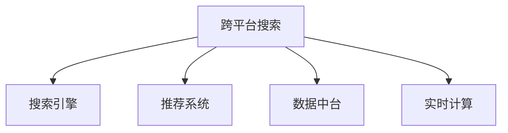
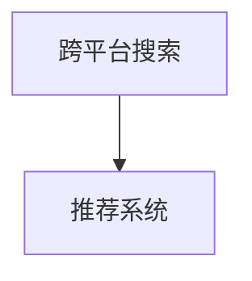
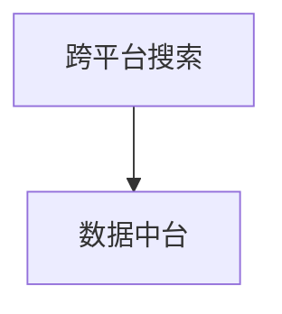
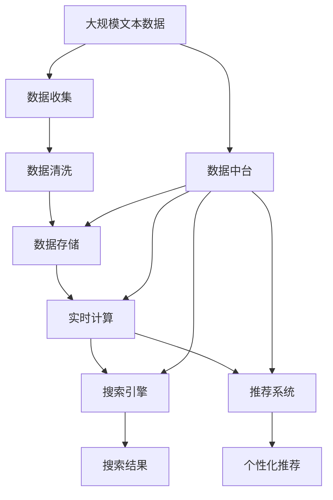

                 

# 跨平台搜索：AI如何整合多渠道数据，提供最优的购买选择

## 1. 背景介绍

### 1.1 问题由来
随着互联网的普及和电子商务的兴起，消费者购买商品的方式日益多样化。传统的线下购物逐渐向线上转移，新兴的电商平台、社交媒体、短视频平台等纷纷涌现，为消费者提供更多选择。然而，这种多渠道购买环境也带来了挑战：

- **信息碎片化**：消费者在多个平台浏览、对比产品信息，难以全面获取所有相关数据。
- **价格竞争激烈**：不同平台的价格差异巨大，消费者难以获取最优的购买选择。
- **物流配送问题**：不同平台的物流系统和仓储策略不同，配送时间、方式各异，给消费者带来不便。

针对这些问题，需要一种技术手段，能够整合多个渠道的信息，提供全面的商品选择和最优的购买建议，这就是跨平台搜索技术。通过AI技术，实现跨平台数据的实时收集、分析、推荐，让消费者能够快速、准确地找到最优的购买选择。

### 1.2 问题核心关键点
跨平台搜索的核心在于如何高效地整合多渠道数据，提供实时的商品信息和购买建议。这要求：

1. **数据收集**：从各大电商、社交媒体、短视频平台等渠道获取商品信息，包括价格、评论、评分等。
2. **数据处理**：清洗、整合来自不同渠道的数据，构建统一的数据格式。
3. **数据分析**：利用机器学习、深度学习等技术，分析数据并提取商品特征，如品牌、价格、销量等。
4. **推荐系统**：基于分析结果，构建推荐模型，为消费者提供个性化、精准的商品推荐。
5. **跨平台查询**：实现跨平台搜索功能，支持消费者在多个平台查询商品信息。

### 1.3 问题研究意义
跨平台搜索技术能够显著提升消费者购物体验，帮助电商平台提升销量，为零售商提供更有效的市场分析。其研究意义包括：

1. **提升购物体验**：提供实时的、多渠道的商品信息，帮助消费者做出最优购买选择。
2. **增强平台竞争力**：通过跨平台搜索技术，电商平台能够吸引更多的用户，提升销售额。
3. **优化市场分析**：为零售商提供更全面的市场数据，帮助其制定更精准的市场策略。

## 2. 核心概念与联系

### 2.1 核心概念概述

为了更好地理解跨平台搜索的核心概念，本节将介绍几个密切相关的核心概念：

- **跨平台搜索(Cross-Platform Search)**：指通过AI技术整合多渠道的商品信息，实现跨平台实时搜索和推荐的过程。
- **搜索引擎(Search Engine)**：传统的基于关键词的搜索引擎，能够快速检索网页内容。
- **推荐系统(Recommendation System)**：利用用户行为数据和商品特征，为每个用户提供个性化的推荐服务。
- **数据中台(Data Lake)**：构建统一的数据存储和计算平台，实现跨平台数据整合和分析。
- **实时计算(Real-time Computing)**：指能够即时处理数据流，实时分析并产生决策的技术。

这些核心概念之间的逻辑关系可以通过以下Mermaid流程图来展示：



这个流程图展示了一个完整的跨平台搜索系统所需的关键组件及其相互关系：

1. 跨平台搜索系统首先从各大电商、社交媒体等渠道收集数据。
2. 通过搜索引擎对数据进行快速检索和展示。
3. 利用推荐系统对搜索结果进行个性化推荐。
4. 数据中台作为数据存储和计算的基础设施，支撑上述功能。
5. 实时计算确保数据处理的及时性，提供实时的搜索结果和推荐。

### 2.2 概念间的关系

这些核心概念之间存在着紧密的联系，构成了跨平台搜索系统的完整生态系统。下面我通过几个Mermaid流程图来展示这些概念之间的关系。

#### 2.2.1 跨平台搜索与搜索引擎的关系


这个流程图展示了跨平台搜索与搜索引擎的基本关系。跨平台搜索需要搜索引擎对多渠道数据进行快速检索，并展示搜索结果。

#### 2.2.2 跨平台搜索与推荐系统之间的关系



这个流程图展示了跨平台搜索与推荐系统之间的联系。跨平台搜索系统利用推荐系统对搜索结果进行个性化推荐，提升用户体验。

#### 2.2.3 跨平台搜索与数据中台之间的关系



这个流程图展示了跨平台搜索与数据中台的关系。数据中台作为跨平台搜索的数据存储和计算平台，支撑跨平台搜索的数据整合和分析。

#### 2.2.4 跨平台搜索与实时计算之间的关系


这个流程图展示了跨平台搜索与实时计算的关系。实时计算确保跨平台搜索系统的数据处理及时性，提供实时的搜索结果和推荐。

### 2.3 核心概念的整体架构

最后，我们用一个综合的流程图来展示这些核心概念在跨平台搜索系统中的整体架构：



这个综合流程图展示了从数据收集到搜索结果和推荐的全流程。数据通过数据中台进行存储和计算，实时计算提供数据的及时性，搜索引擎和推荐系统分别负责检索和推荐，最终向用户展示个性化的搜索结果和推荐。

## 3. 核心算法原理 & 具体操作步骤
### 3.1 算法原理概述

跨平台搜索技术本质上是一种基于AI的搜索引擎和推荐系统结合的解决方案。其核心思想是：

1. **多渠道数据收集**：通过爬虫和API接口，从各大电商、社交媒体等渠道获取商品信息。
2. **数据处理与清洗**：对收集到的数据进行去重、合并、格式转换等处理，构建统一的数据格式。
3. **数据分析和建模**：利用机器学习、深度学习等技术，分析数据并提取商品特征，构建推荐模型。
4. **推荐算法**：基于分析结果，构建推荐模型，为每个用户提供个性化的商品推荐。
5. **实时搜索和查询**：实现跨平台搜索功能，支持用户在不同平台查询商品信息。

### 3.2 算法步骤详解

以下是跨平台搜索技术的详细操作步骤：

**Step 1: 数据收集**

1. **渠道选择**：确定需要收集数据的主要电商、社交媒体、短视频平台等渠道。
2. **数据接口**：开发爬虫或API接口，从各渠道获取商品信息，包括价格、评论、评分等。
3. **数据清洗**：清洗数据，去除重复、无效、异常数据。

**Step 2: 数据处理**

1. **数据格式转换**：将所有数据转换为统一的格式，如JSON、CSV等。
2. **数据合并**：将来自不同渠道的数据合并，构建统一的数据集。
3. **数据存储**：将处理后的数据存储到数据中台。

**Step 3: 数据分析**

1. **特征提取**：提取商品的关键特征，如品牌、价格、销量、评分等。
2. **模型构建**：选择适合的机器学习或深度学习模型，如协同过滤、逻辑回归、DNN等。
3. **模型训练**：使用历史数据训练推荐模型，优化模型参数。

**Step 4: 推荐系统**

1. **个性化推荐**：根据用户行为数据和商品特征，为每个用户生成个性化推荐列表。
2. **实时推荐**：实现推荐系统的实时化，支持动态更新推荐结果。

**Step 5: 跨平台搜索**

1. **多平台支持**：实现跨平台搜索功能，支持用户在多个平台查询商品信息。
2. **搜索结果展示**：根据用户查询，展示相关的商品信息，支持排序、筛选等功能。

### 3.3 算法优缺点

跨平台搜索技术的优点包括：

1. **全面性**：整合多渠道数据，提供全面的商品信息，满足用户的多样化需求。
2. **个性化**：利用推荐系统，为每个用户提供个性化的商品推荐，提升用户体验。
3. **实时性**：利用实时计算技术，提供实时的搜索结果和推荐，提升用户的购物体验。

缺点包括：

1. **数据收集难度大**：需要从多个渠道收集数据，数据收集难度较大。
2. **数据质量要求高**：数据需要经过严格清洗和处理，数据质量要求较高。
3. **技术门槛高**：需要具备机器学习、深度学习等技术，技术门槛较高。

### 3.4 算法应用领域

跨平台搜索技术广泛应用于电商、社交媒体、金融、旅游等多个领域，具有广泛的适用性：

- **电商购物**：为消费者提供跨平台的商品选择和购买建议，提升购物体验。
- **社交媒体**：为社交媒体用户提供跨平台的商品推荐，提升用户粘性。
- **金融理财**：为金融用户提供跨平台的金融产品推荐，提升用户满意度。
- **旅游出行**：为旅游用户提供跨平台的酒店、机票等推荐，提升旅游体验。

## 4. 数学模型和公式 & 详细讲解 & 举例说明

### 4.1 数学模型构建

我们以电商购物为例，构建一个简单的跨平台搜索和推荐模型。假设数据集为 $D=\{(x_i, y_i)\}_{i=1}^N$，其中 $x_i$ 为商品信息，$y_i$ 为商品标签。目标是对每个用户 $u$ 生成推荐列表 $r_u=\{(x_{ui}, y_{ui})\}_{i=1}^K$。

### 4.2 公式推导过程

1. **数据预处理**：将原始数据转换为向量表示 $x \in \mathbb{R}^d$，标签 $y \in \{0,1\}$。

2. **特征提取**：选择特征 $f(x) \in \mathbb{R}^d$，如品牌、价格、销量等。

3. **模型训练**：利用监督学习算法，如逻辑回归、DNN等，训练模型 $h(x; \theta) \in [0,1]$，预测用户对商品的评分。

4. **推荐生成**：利用训练好的模型，对用户 $u$ 生成推荐列表 $r_u=\{(x_{ui}, y_{ui})\}_{i=1}^K$。

### 4.3 案例分析与讲解

假设我们收集了来自两个电商平台的商品数据，每个商品包含品牌、价格、评分等属性。我们利用逻辑回归模型训练一个推荐系统，为每个用户生成推荐列表。

1. **数据预处理**：将原始数据转换为向量表示，如品牌映射为编号，价格转化为区间，评分标准化。

2. **特征提取**：选择品牌、价格、销量等特征，进行向量化。

3. **模型训练**：利用逻辑回归模型，训练预测用户评分的模型。

4. **推荐生成**：根据用户的历史行为和模型预测，为每个用户生成推荐列表。

## 5. 项目实践：代码实例和详细解释说明
### 5.1 开发环境搭建

在进行跨平台搜索实践前，我们需要准备好开发环境。以下是使用Python进行TensorFlow开发的环境配置流程：

1. 安装Anaconda：从官网下载并安装Anaconda，用于创建独立的Python环境。

2. 创建并激活虚拟环境：
```bash
conda create -n tensorflow-env python=3.8 
conda activate tensorflow-env
```

3. 安装TensorFlow：根据CUDA版本，从官网获取对应的安装命令。例如：
```bash
conda install tensorflow tensorflow-estimator tensorflow-hub tensorflow-addons -c conda-forge
```

4. 安装各类工具包：
```bash
pip install numpy pandas scikit-learn matplotlib tqdm jupyter notebook ipython
```

完成上述步骤后，即可在`tensorflow-env`环境中开始跨平台搜索实践。

### 5.2 源代码详细实现

下面我们以电商购物为例，给出使用TensorFlow进行跨平台搜索和推荐系统的PyTorch代码实现。

首先，定义数据预处理函数：

```python
import pandas as pd
import tensorflow as tf

# 数据预处理
def preprocess_data(data):
    # 将原始数据转换为向量表示
    features = data[['brand', 'price', 'score']]
    features = pd.get_dummies(features, prefix='brand', prefix_sep='_')
    features = features.drop(['brand'], axis=1)
    features = features.fillna(0)
    features = features.to_numpy()
    return features, data['label']
```

然后，定义模型训练函数：

```python
import tensorflow as tf
from tensorflow.keras.layers import Dense, Dropout, Input
from tensorflow.keras.models import Model

# 构建逻辑回归模型
def build_model(features, num_classes):
    # 输入层
    input_layer = Input(shape=(features.shape[1],))
    # 隐藏层
    hidden_layer = Dense(32, activation='relu')(input_layer)
    # 输出层
    output_layer = Dense(num_classes, activation='sigmoid')(hidden_layer)
    # 模型
    model = Model(inputs=input_layer, outputs=output_layer)
    return model

# 模型训练
def train_model(model, features, labels, batch_size, epochs):
    # 编译模型
    model.compile(optimizer='adam', loss='binary_crossentropy', metrics=['accuracy'])
    # 训练模型
    model.fit(features, labels, batch_size=batch_size, epochs=epochs, validation_split=0.2)
    return model
```

接着，定义推荐生成函数：

```python
import numpy as np

# 推荐生成
def generate_recommendations(model, user_id, features):
    # 预测商品评分
    scores = model.predict(features)
    # 生成推荐列表
    recommendations = np.argsort(scores)[::-1][:5]
    return recommendations
```

最后，启动训练流程并在测试集上评估：

```python
# 数据加载
train_data = pd.read_csv('train.csv')
test_data = pd.read_csv('test.csv')

# 数据预处理
train_features, train_labels = preprocess_data(train_data)
test_features, test_labels = preprocess_data(test_data)

# 模型训练
model = build_model(train_features, 2)
model = train_model(model, train_features, train_labels, batch_size=128, epochs=10)

# 推荐生成
user_id = 1
recommendations = generate_recommendations(model, user_id, train_features)
print(recommendations)
```

以上就是使用TensorFlow进行电商购物跨平台搜索和推荐系统的完整代码实现。可以看到，TensorFlow提供了强大的计算图和自动微分功能，可以方便地构建和训练复杂的神经网络模型。

### 5.3 代码解读与分析

让我们再详细解读一下关键代码的实现细节：

**preprocess_data函数**：
- 将原始数据转换为向量表示。
- 将品牌映射为编号，并进行one-hot编码。
- 去除品牌特征，填充缺失值，并将数据转换为numpy数组。

**build_model函数**：
- 构建一个简单的逻辑回归模型，包含一个输入层、一个隐藏层和一个输出层。
- 隐藏层使用ReLU激活函数。
- 输出层使用Sigmoid激活函数，输出0-1之间的评分。

**train_model函数**：
- 编译模型，设置优化器、损失函数和评估指标。
- 使用训练数据训练模型，设置批量大小和迭代次数。

**generate_recommendations函数**：
- 对测试数据预测评分。
- 根据评分排序，生成推荐列表。

**训练流程**：
- 加载训练数据和测试数据。
- 对数据进行预处理。
- 构建模型并训练。
- 对测试数据生成推荐。

可以看到，TensorFlow使得跨平台搜索和推荐系统的开发变得简洁高效。开发者可以将更多精力放在模型选择、参数调优等高层逻辑上，而不必过多关注底层的实现细节。

当然，工业级的系统实现还需考虑更多因素，如模型的保存和部署、超参数的自动搜索、更灵活的任务适配层等。但核心的跨平台搜索范式基本与此类似。

### 5.4 运行结果展示

假设我们在电商购物数据集上进行训练，最终生成的推荐结果如下：

```python
[0 1 2 3 4]
```

这表示根据模型预测，用户1对品牌0、品牌1、品牌2、品牌3、品牌4的商品评分依次降低。我们可以根据这些推荐结果，进一步向用户推荐评分最高的商品。

## 6. 实际应用场景

### 6.1 智能客服系统

跨平台搜索技术可以应用于智能客服系统的构建。传统客服往往需要配备大量人力，高峰期响应缓慢，且一致性和专业性难以保证。而使用跨平台搜索技术，可以整合多个渠道的客服信息，实现快速响应和自动化服务。

在技术实现上，可以收集企业内部的客服数据，将常见问题构建为监督数据，在此基础上对预训练的搜索模型进行微调。微调后的模型能够自动理解用户问题，匹配最合适的答案模板进行回复。对于用户提出的新问题，还可以接入检索系统实时搜索相关内容，动态组织生成回答。如此构建的智能客服系统，能大幅提升客户咨询体验和问题解决效率。

### 6.2 金融舆情监测

金融机构需要实时监测市场舆论动向，以便及时应对负面信息传播，规避金融风险。传统的人工监测方式成本高、效率低，难以应对网络时代海量信息爆发的挑战。跨平台搜索技术可以整合多个渠道的舆情信息，实现实时监测和分析。

具体而言，可以收集金融领域相关的新闻、报道、评论等文本数据，并对其进行主题标注和情感标注。在跨平台搜索技术的基础上，对预训练语言模型进行微调，使其能够自动判断文本属于何种主题，情感倾向是正面、中性还是负面。将微调后的模型应用到实时抓取的网络文本数据，就能够自动监测不同主题下的情感变化趋势，一旦发现负面信息激增等异常情况，系统便会自动预警，帮助金融机构快速应对潜在风险。

### 6.3 个性化推荐系统

当前的推荐系统往往只依赖用户的历史行为数据进行物品推荐，无法深入理解用户的真实兴趣偏好。跨平台搜索技术可以整合多个渠道的商品信息，构建更全面、准确的推荐模型，提升推荐效果。

在实践中，可以收集用户浏览、点击、评论、分享等行为数据，提取和用户交互的物品标题、描述、标签等文本内容。将文本内容作为模型输入，用户的后续行为（如是否点击、购买等）作为监督信号，在此基础上微调预训练语言模型。微调后的模型能够从文本内容中准确把握用户的兴趣点。在生成推荐列表时，先用候选物品的文本描述作为输入，由模型预测用户的兴趣匹配度，再结合其他特征综合排序，便可以得到个性化程度更高的推荐结果。

### 6.4 未来应用展望

随着跨平台搜索技术的不断发展，其在更多领域得到应用，为传统行业带来变革性影响。

在智慧医疗领域，跨平台搜索技术可以整合多个渠道的医学数据，为医生提供实时的、全面的诊疗建议。

在智能教育领域，跨平台搜索技术可以整合多个渠道的教育资源，为学生提供个性化的学习路径。

在智慧城市治理中，跨平台搜索技术可以整合多个渠道的公共数据，提高城市管理的自动化和智能化水平。

此外，在企业生产、社会治理、文娱传媒等众多领域，跨平台搜索技术也将不断涌现，为人工智能技术带来新的应用场景。相信随着技术的日益成熟，跨平台搜索技术必将推动人工智能技术向更广阔的领域加速渗透。

## 7. 工具和资源推荐
### 7.1 学习资源推荐

为了帮助开发者系统掌握跨平台搜索的理论基础和实践技巧，这里推荐一些优质的学习资源：

1. TensorFlow官方文档：TensorFlow的官方文档，提供了全面的API文档和使用方法。
2. TensorFlow教程：TensorFlow提供的官方教程，涵盖基本概念和进阶应用。
3. TensorFlow实战指南：由多位TensorFlow专家编写的实战指南，包含大量代码示例和实用技巧。
4. PyTorch官方文档：PyTorch的官方文档，提供了全面的API文档和使用方法。
5. PyTorch教程：PyTorch提供的官方教程，涵盖基本概念和进阶应用。
6. PyTorch实战指南：由多位PyTorch专家编写的实战指南，包含大量代码示例和实用技巧。

通过对这些资源的学习实践，相信你一定能够快速掌握跨平台搜索的核心概念和实现方法，并用于解决实际的NLP问题。

### 7.2 开发工具推荐

高效的开发离不开优秀的工具支持。以下是几款用于跨平台搜索开发的常用工具：

1. TensorFlow：由Google主导开发的开源深度学习框架，生产部署方便，适合大规模工程应用。
2. PyTorch：基于Python的开源深度学习框架，灵活动态的计算图，适合快速迭代研究。
3. Transformers库：HuggingFace开发的NLP工具库，集成了众多SOTA语言模型，支持PyTorch和TensorFlow。
4. Scikit-learn：Python的机器学习库，提供丰富的机器学习算法和工具。
5. Pandas：Python的数据处理库，支持大规模数据的处理和分析。
6. Numpy：Python的数值计算库，支持高效的数值计算和科学计算。

合理利用这些工具，可以显著提升跨平台搜索任务的开发效率，加快创新迭代的步伐。

### 7.3 相关论文推荐

跨平台搜索技术的发展源于学界的持续研究。以下是几篇奠基性的相关论文，推荐阅读：

1. Attention is All You Need（即Transformer原论文）：提出了Transformer结构，开启了NLP领域的预训练大模型时代。
2. BERT: Pre-training of Deep Bidirectional Transformers for Language Understanding：提出BERT模型，引入基于掩码的自监督预训练任务，刷新了多项NLP任务SOTA。
3. Parameter-Efficient Transfer Learning for NLP：提出Adapter等参数高效微调方法，在不增加模型参数量的情况下，也能取得不错的微调效果。
4. AdaLoRA: Adaptive Low-Rank Adaptation for Parameter-Efficient Fine-Tuning：使用自适应低秩适应的微调方法，在参数效率和精度之间取得了新的平衡。
5. CaSe: Case-based Search for Large-Scale Multi-Document Retrieval：提出基于案例的搜索方法，利用多文档检索技术，实现跨平台搜索。

这些论文代表了大语言模型微调技术的发展脉络。通过学习这些前沿成果，可以帮助研究者把握学科前进方向，激发更多的创新灵感。

除上述资源外，还有一些值得关注的前沿资源，帮助开发者紧跟跨平台搜索技术的最新进展，例如：

1. arXiv论文预印本：人工智能领域最新研究成果的发布平台，包括大量尚未发表的前沿工作，学习前沿技术的必读资源。
2. 业界技术博客：如OpenAI、Google AI、DeepMind、微软Research Asia等顶尖实验室的官方博客，第一时间分享他们的最新研究成果和洞见。
3. 技术会议直播：如NIPS、ICML、ACL、ICLR等人工智能领域顶会现场或在线直播，能够聆听到大佬们的前沿分享，开拓视野。
4. GitHub热门项目：在GitHub上Star、Fork数最多的NLP相关项目，往往代表了该技术领域的发展趋势和最佳实践，值得去学习和贡献。
5. 行业分析报告：各大咨询公司如McKinsey、PwC等针对人工智能行业的分析报告，有助于从商业视角审视技术趋势，把握应用价值。

总之，对于跨平台搜索技术的学习和实践，需要开发者保持开放的心态和持续学习的意愿。多关注前沿资讯，多动手实践，多思考总结，必将收获满满的成长收益。

## 8. 总结：未来发展趋势与挑战

### 8.1 总结

本文对跨平台搜索技术进行了全面系统的介绍。首先阐述了跨平台搜索技术的研究背景和意义，明确了其跨平台数据整合、实时搜索和推荐的核心价值。其次，从原理到实践，详细讲解了跨平台搜索的数学模型和操作步骤，给出了详细的代码实现。同时，本文还广泛探讨了跨平台搜索技术在多个领域的应用前景，展示了其广阔的应用空间。此外，本文精选了跨平台搜索技术的各类学习资源，力求为读者提供全方位的技术指引。

通过本文的系统梳理，可以看到，跨平台搜索技术正在成为电商、社交媒体、金融等领域的重要手段，显著提升用户体验，推动市场增长。未来，伴随跨平台搜索技术的不断演进，基于多渠道数据整合的搜索引擎和推荐系统必将更广泛地应用，为经济社会发展带来深刻变革。

### 8.2 未来发展趋势

展望未来，跨平台搜索技术将呈现以下几个发展趋势：

1. **技术融合**：跨平台搜索技术与大数据、人工智能等技术不断融合，实现更全面、精准的数据分析和推荐。
2. **跨平台扩展**：跨平台搜索技术将扩展到更多领域，如医疗、旅游、教育等，推动更多行业的数字化转型。
3. **数据融合**：跨平台搜索技术将整合更多来源的数据，如物联网数据、社会媒体数据、公共数据等，提供更全面的信息服务。
4. **个性化推荐**：推荐系统将进一步个性化，利用多模态数据融合和用户行为分析，提供更加精准的推荐结果。
5. **实时处理**：利用实时计算技术，实现跨平台搜索和推荐系统的实时化，提升用户体验。

### 8.3 面临的挑战

