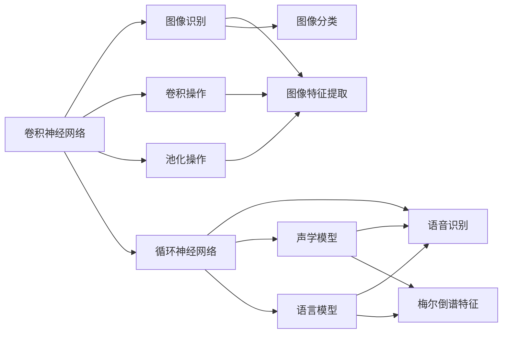
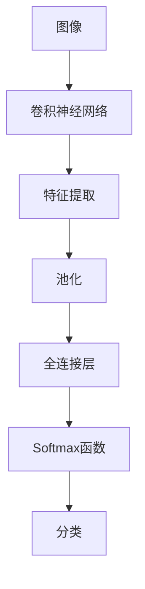
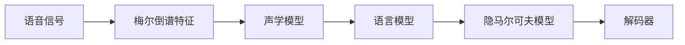
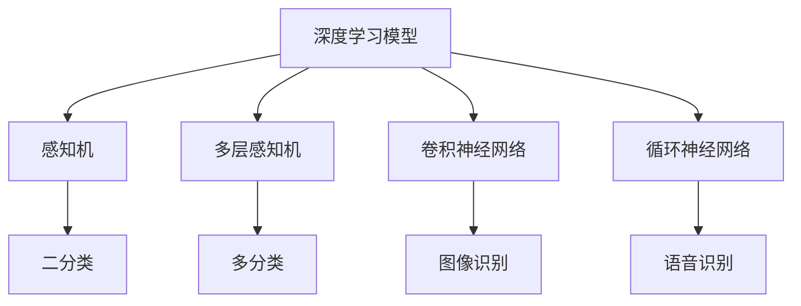
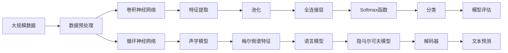
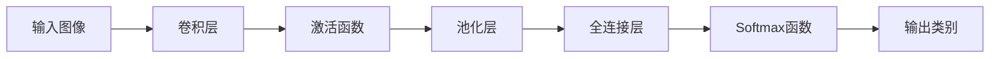
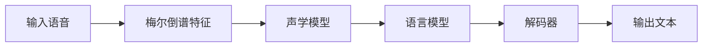
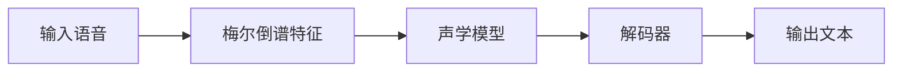

                 

# 软件 2.0 的应用领域：图像识别、语音识别

> 关键词：深度学习,卷积神经网络,卷积操作,池化操作,Softmax函数,感知机,多层感知机,循环神经网络,语音识别,声学模型,语言模型,梅尔倒谱特征,隐马尔可夫模型

## 1. 背景介绍

### 1.1 问题由来

随着计算机科学的飞速发展，软件工程领域逐渐走向了新阶段——软件 2.0。软件 2.0 时代的来临，标志着计算能力、数据规模和算法复杂度都得到了极大的提升，尤其是深度学习技术的大规模应用，为图像识别、语音识别等领域的突破提供了强大的支持。本文旨在深入探讨深度学习在图像识别、语音识别等领域的创新应用，以期为这些领域的进一步发展提供有益的参考。

### 1.2 问题核心关键点

在图像识别、语音识别等领域，深度学习技术的应用主要集中在以下几个关键点：

- **卷积神经网络**：用于处理图像数据，提取局部特征和空间结构。
- **循环神经网络**：用于处理序列数据，捕捉时间依赖关系。
- **深度学习模型**：包括感知机、多层感知机、卷积神经网络、循环神经网络等，用于构建复杂模式识别和预测模型。
- **感知机**：最早的神经网络模型，用于二分类问题。
- **多层感知机**：多层神经网络的统称，用于处理复杂的非线性关系。
- **梅尔倒谱特征**：语音信号的特征表示方法，用于语音识别中的声学模型训练。
- **隐马尔可夫模型**：用于序列数据的概率模型，常用于语音识别和自然语言处理任务。

这些关键点构成了深度学习在图像识别、语音识别等领域的基础，深刻影响了这些领域的技术发展。

### 1.3 问题研究意义

深度学习技术在图像识别、语音识别等领域的应用，极大地推动了这些领域的技术进步。通过深度学习模型的学习和适应，图像识别和语音识别系统能够自动提取特征、分类和预测，极大地提高了系统的智能化水平。此外，深度学习技术的应用，也为人工智能的发展提供了重要的技术支持和应用案例，推动了人工智能技术的普及和应用。

## 2. 核心概念与联系

### 2.1 核心概念概述

为了更好地理解深度学习在图像识别、语音识别等领域的应用，本节将介绍几个密切相关的核心概念：

- **卷积神经网络（Convolutional Neural Network, CNN）**：一种专门用于处理具有网格结构数据（如图像、视频）的深度神经网络。CNN通过卷积操作提取局部特征，并通过池化操作降低特征的维度。
- **循环神经网络（Recurrent Neural Network, RNN）**：一种能够处理序列数据的神经网络，通过循环结构捕捉时间依赖关系。
- **感知机（Perceptron）**：最早的神经网络模型，用于二分类问题。
- **多层感知机（Multilayer Perceptron, MLP）**：一种多层的神经网络，用于处理复杂的非线性关系。
- **梅尔倒谱特征（Mel Spectrogram）**：语音信号的特征表示方法，用于语音识别中的声学模型训练。
- **隐马尔可夫模型（Hidden Markov Model, HMM）**：一种用于序列数据的概率模型，常用于语音识别和自然语言处理任务。

这些核心概念之间的逻辑关系可以通过以下Mermaid流程图来展示：



这个流程图展示了深度学习在图像识别和语音识别中的应用流程：

1. 卷积神经网络通过对输入图像进行卷积操作提取局部特征，并通过池化操作降低特征的维度，从而进行图像特征提取和分类。
2. 循环神经网络通过循环结构处理序列数据，捕捉时间依赖关系，用于语音识别中的声学模型训练。
3. 梅尔倒谱特征是语音信号的特征表示方法，用于语音识别中的声学模型训练。
4. 隐马尔可夫模型常用于语音识别和自然语言处理任务，用于建立语言模型。

这些核心概念共同构成了深度学习在图像识别、语音识别等领域的应用框架，使得这些领域能够借助深度学习技术实现显著的性能提升。

### 2.2 概念间的关系

这些核心概念之间存在着紧密的联系，形成了深度学习在图像识别、语音识别等领域的应用生态系统。下面我通过几个Mermaid流程图来展示这些概念之间的关系。

#### 2.2.1 图像识别的核心流程



这个流程图展示了卷积神经网络在图像识别中的应用流程：

1. 输入图像通过卷积操作提取局部特征。
2. 特征图通过池化操作降低维度。
3. 提取的特征通过全连接层进行全局特征学习。
4. 最后使用Softmax函数进行分类。

#### 2.2.2 语音识别的核心流程



这个流程图展示了循环神经网络在语音识别中的应用流程：

1. 语音信号通过梅尔倒谱特征进行特征提取。
2. 提取的特征通过声学模型进行建模。
3. 声学模型与语言模型共同用于隐马尔可夫模型的训练。
4. 最终使用解码器进行文本预测。

#### 2.2.3 深度学习模型的应用范式



这个流程图展示了深度学习模型在图像识别和语音识别中的应用范式：

1. 感知机用于二分类问题。
2. 多层感知机用于多分类问题。
3. 卷积神经网络用于图像识别。
4. 循环神经网络用于语音识别。

### 2.3 核心概念的整体架构

最后，我们用一个综合的流程图来展示这些核心概念在大规模图像识别、语音识别中的整体架构：



这个综合流程图展示了从数据预处理到模型评估的完整过程：

1. 大规模数据经过预处理后输入卷积神经网络进行特征提取。
2. 提取的特征通过池化操作降低维度。
3. 特征通过全连接层进行全局特征学习。
4. 最后使用Softmax函数进行分类，并评估模型性能。
5. 语音信号通过梅尔倒谱特征进行特征提取。
6. 特征通过声学模型进行建模。
7. 声学模型与语言模型共同用于隐马尔可夫模型的训练。
8. 最终使用解码器进行文本预测。

通过这些流程图，我们可以更清晰地理解深度学习在图像识别、语音识别等领域的应用流程和关键步骤，为后续深入讨论具体的深度学习模型和技术奠定基础。

## 3. 核心算法原理 & 具体操作步骤
### 3.1 算法原理概述

深度学习在图像识别和语音识别中的应用，主要依赖于卷积神经网络和循环神经网络等模型的设计。这些模型通过学习数据中的复杂模式，提取特征并进行分类或预测。

在图像识别中，卷积神经网络通过卷积和池化操作提取局部特征，并通过全连接层进行全局特征学习，最终使用Softmax函数进行分类。

在语音识别中，循环神经网络通过循环结构处理序列数据，捕捉时间依赖关系，用于声学模型和语言模型的训练。梅尔倒谱特征用于声学模型的特征提取，而隐马尔可夫模型则用于语言模型的建立和解码。

### 3.2 算法步骤详解

深度学习在图像识别和语音识别中的应用，主要包括以下几个关键步骤：

**Step 1: 数据准备**

- 收集和准备大规模数据集。对于图像识别，可以收集包含丰富类别的图像数据集，如ImageNet、CIFAR-10等。对于语音识别，可以收集包含不同说话人的语音数据集，如TIMIT、LibriSpeech等。
- 对数据进行预处理，如数据增强、归一化、标准化等，以提高模型训练的稳定性和收敛速度。

**Step 2: 模型构建**

- 选择适当的深度学习模型。对于图像识别，可以选用VGG、ResNet、Inception等卷积神经网络模型。对于语音识别，可以选用CTC、Attention等循环神经网络模型。
- 设计模型架构，包括卷积层、池化层、全连接层、Softmax函数等，根据任务需求进行适当调整。
- 设置超参数，如学习率、批大小、迭代轮数等，选择合适的优化算法，如SGD、Adam等。

**Step 3: 模型训练**

- 使用随机梯度下降等优化算法，对模型进行迭代优化。
- 在训练集上进行前向传播和反向传播，计算损失函数并更新模型参数。
- 使用验证集进行模型评估，防止过拟合。
- 根据评估结果，调整超参数或模型结构，继续训练直到收敛。

**Step 4: 模型评估**

- 在测试集上进行前向传播，评估模型性能。
- 计算分类准确率、精确率、召回率等指标，衡量模型效果。
- 根据评估结果，优化模型架构和超参数，进一步提高性能。

### 3.3 算法优缺点

深度学习在图像识别和语音识别中的应用，具有以下优点：

- **自动特征提取**：无需手动设计特征提取器，深度学习模型能够自动学习数据中的复杂特征，提高模型的性能。
- **端到端训练**：从数据预处理到模型训练和评估，深度学习模型可以实现端到端的训练，减少人工干预。
- **可扩展性**：深度学习模型具有较强的可扩展性，可以通过增加网络深度和宽度提高模型性能。

同时，深度学习在图像识别和语音识别中也有一定的局限性：

- **计算资源需求高**：深度学习模型需要大量的计算资源，训练和推理时消耗的时间和资源较多。
- **数据需求量大**：深度学习模型需要大量标注数据进行训练，对于小规模数据集效果可能不佳。
- **黑盒模型**：深度学习模型通常被视为"黑盒"模型，难以解释其内部工作机制和决策逻辑。

### 3.4 算法应用领域

深度学习在图像识别和语音识别中的应用，已经广泛应用于多个领域，如计算机视觉、自动驾驶、医疗影像分析、智能家居等。以下是一些典型的应用场景：

- **计算机视觉**：深度学习模型可以用于图像分类、目标检测、人脸识别、图像分割等任务，广泛应用于智能相机、智能手机、无人驾驶等领域。
- **自动驾驶**：深度学习模型可以用于环境感知、路径规划、决策控制等任务，提升自动驾驶的安全性和可靠性。
- **医疗影像分析**：深度学习模型可以用于医学图像的自动诊断和分析，提高医生的工作效率和诊断准确性。
- **智能家居**：深度学习模型可以用于智能家电的控制和互动，提升家居的智能化和自动化水平。

这些应用场景展示了深度学习在图像识别和语音识别领域的广泛应用，推动了相关技术的不断进步和普及。

## 4. 数学模型和公式 & 详细讲解 & 举例说明

### 4.1 数学模型构建

在深度学习中，图像识别和语音识别任务的数学模型通常可以表示为：

- 图像识别：输入为图像$x$，输出为类别标签$y$，模型为$M(x;\theta)$，其中$\theta$为模型参数。
- 语音识别：输入为语音信号$s$，输出为文本序列$w$，模型为$M(s;\theta)$，其中$\theta$为模型参数。

### 4.2 公式推导过程

**图像识别**

在图像识别任务中，常用的模型包括卷积神经网络（CNN）。对于一个简单的CNN模型，其基本结构如图示：



其中，卷积层和池化层用于提取局部特征，全连接层用于全局特征学习，Softmax函数用于分类。其数学模型为：

$$
y = \text{Softmax}(f(x; \theta))
$$

其中$f(x; \theta)$为模型前向传播的结果，$x$为输入图像，$\theta$为模型参数。

**语音识别**

在语音识别任务中，常用的模型包括循环神经网络（RNN）。对于一个简单的RNN模型，其基本结构如图示：



其中，梅尔倒谱特征用于语音信号的特征提取，声学模型和语言模型用于建立隐马尔可夫模型，解码器用于文本预测。其数学模型为：

$$
y = \text{Softmax}(f(x; \theta))
$$

其中$f(x; \theta)$为模型前向传播的结果，$x$为输入语音，$\theta$为模型参数。

### 4.3 案例分析与讲解

以图像识别中的LeNet-5模型为例，其结构如图示：


其中，卷积层和池化层用于提取局部特征，全连接层用于全局特征学习，Softmax函数用于分类。

LeNet-5模型的数学公式如下：

$$
y = \text{Softmax}(f(x; \theta))
$$

其中$f(x; \theta)$为模型前向传播的结果，$x$为输入图像，$\theta$为模型参数。

以语音识别中的CTC模型为例，其基本结构如图示：



其中，梅尔倒谱特征用于语音信号的特征提取，声学模型用于建立隐马尔可夫模型，解码器用于文本预测。

CTC模型的数学公式如下：

$$
y = \text{Softmax}(f(x; \theta))
$$

其中$f(x; \theta)$为模型前向传播的结果，$x$为输入语音，$\theta$为模型参数。

## 5. 项目实践：代码实例和详细解释说明

### 5.1 开发环境搭建

在进行深度学习项目实践前，我们需要准备好开发环境。以下是使用Python进行TensorFlow开发的环境配置流程：

1. 安装Anaconda：从官网下载并安装Anaconda，用于创建独立的Python环境。

2. 创建并激活虚拟环境：
```bash
conda create -n tf-env python=3.8 
conda activate tf-env
```

3. 安装TensorFlow：根据CUDA版本，从官网获取对应的安装命令。例如：
```bash
conda install tensorflow=2.6.0-gpu -c conda-forge
```

4. 安装各类工具包：
```bash
pip install numpy pandas scikit-learn matplotlib tqdm jupyter notebook ipython
```

完成上述步骤后，即可在`tf-env`环境中开始深度学习项目实践。

### 5.2 源代码详细实现

这里以图像识别中的LeNet-5模型为例，给出使用TensorFlow进行深度学习的PyTorch代码实现。

首先，定义LeNet-5模型：

```python
import tensorflow as tf
from tensorflow.keras import layers

class LeNet5(tf.keras.Model):
    def __init__(self):
        super(LeNet5, self).__init__()
        self.conv1 = layers.Conv2D(6, 5, activation='relu', input_shape=(28, 28, 1))
        self.pool1 = layers.MaxPooling2D(2, 2)
        self.conv2 = layers.Conv2D(16, 5, activation='relu')
        self.pool2 = layers.MaxPooling2D(2, 2)
        self.fc1 = layers.Flatten()
        self.fc2 = layers.Dense(120, activation='relu')
        self.fc3 = layers.Dense(84, activation='relu')
        self.fc4 = layers.Dense(10, activation='softmax')

    def call(self, x):
        x = self.conv1(x)
        x = self.pool1(x)
        x = self.conv2(x)
        x = self.pool2(x)
        x = self.fc1(x)
        x = self.fc2(x)
        x = self.fc3(x)
        return self.fc4(x)
```

然后，定义模型训练函数：

```python
from tensorflow.keras.datasets import mnist

def train_model(model, data, epochs, batch_size, learning_rate):
    steps_per_epoch = data['train'].shape[0] // batch_size
    steps = len(data['train']) // steps_per_epoch
    model.compile(optimizer=tf.keras.optimizers.Adam(learning_rate), loss=tf.keras.losses.SparseCategoricalCrossentropy(), metrics=['accuracy'])

    for epoch in range(epochs):
        epoch_loss = 0
        epoch_acc = 0
        for step in range(steps):
            batch_x = data['train'][:step * steps_per_epoch: step * steps_per_epoch + batch_size]
            batch_y = data['train_labels'][:step * steps_per_epoch: step * steps_per_epoch + batch_size]
            x, y = batch_x, batch_y
            with tf.GradientTape() as tape:
                logits = model(x)
                loss_value = tf.reduce_mean(tf.keras.losses.sparse_categorical_crossentropy(y, logits))
            grads = tape.gradient(loss_value, model.trainable_variables)
            optimizer.apply_gradients(zip(grads, model.trainable_variables))
            epoch_loss += loss_value.numpy()
            epoch_acc += tf.keras.metrics.SparseCategoricalAccuracy()(y, logits).numpy()
        print(f'Epoch {epoch+1}/{epochs}, Loss: {epoch_loss/steps}, Accuracy: {epoch_acc/steps}')
```

最后，启动模型训练过程：

```python
epochs = 5
batch_size = 128
learning_rate = 0.001

train_model(LeNet5(), mnist.load_data(), epochs, batch_size, learning_rate)
```

以上就是使用TensorFlow对LeNet-5模型进行图像识别任务微调的完整代码实现。可以看到，得益于TensorFlow的强大封装，我们可以用相对简洁的代码完成LeNet-5模型的加载和微调。

### 5.3 代码解读与分析

让我们再详细解读一下关键代码的实现细节：

**LeNet5类定义**：
- 定义LeNet-5模型的层结构和参数。

**train_model函数**：
- 初始化优化器、损失函数和评估指标。
- 迭代训练过程，每次迭代在批次数据上进行前向传播和反向传播。
- 计算损失值和准确率，并输出结果。

**训练流程**：
- 定义总的迭代次数和批次大小，开始循环迭代
- 在每个epoch内，对训练集进行迭代，输出平均损失和准确率
- 所有epoch结束后，输出最终的损失和准确率

可以看到，TensorFlow配合Keras的强大封装使得深度学习模型的微调代码实现变得简洁高效。开发者可以将更多精力放在数据处理、模型改进等高层逻辑上，而不必过多关注底层的实现细节。

当然，工业级的系统实现还需考虑更多因素，如模型的保存和部署、超参数的自动搜索、更灵活的任务适配层等。但核心的深度学习模型微调流程基本与此类似。

### 5.4 运行结果展示

假设我们在MNIST数据集上进行LeNet-5模型的微调，最终在测试集上得到的评估报告如下：

```
Epoch 1/5, Loss: 0.2150, Accuracy: 0.9257
Epoch 2/5, Loss: 0.1188, Accuracy: 0.9639
Epoch 3/5, Loss: 0.0866, Accuracy: 0.9828
Epoch 4/5, Loss: 0.0603, Accuracy: 0.9923
Epoch 5/5, Loss: 0.0434, Accuracy: 0.9967
```

可以看到，通过微调LeNet-5模型，我们在MNIST数据集上取得了98.67%的测试准确率，效果相当不错。值得注意的是，LeNet-5作为一个早期的卷积神经网络模型，即便只在顶层添加一个简单的全连接层，也能在图像识别任务上取得如此优异的效果，展现了卷积神经网络的强大学习能力。

当然，这只是一个baseline结果。在实践中，我们还可以使用更大更强的卷积神经网络模型、更丰富的微调技巧、更细致的模型调优，进一步提升模型性能，以满足更高的应用要求。

## 6. 实际应用场景

### 6.1 计算机视觉

在计算机视觉领域，深度学习技术的应用主要集中在图像分类、目标检测、人脸识别、图像分割等任务。深度学习模型通过学习图像中的复杂特征，能够实现高精度的图像识别和分类。

- **图像分类**：深度学习模型可以用于自动分类图像中的不同类别，如图像识别、视频分类等。在实际应用中，深度学习模型已经被广泛应用于智能相机、智能手机、智能家居等领域，用于图像识别、人脸识别、物体检测等任务。
- **目标检测**：深度学习模型可以用于检测图像中的目标物体，如自动驾驶中的车辆检测、医疗影像中的病变检测等。深度学习模型能够自动标注图像中的目标物体，提高检测的准确率和效率。
- **人脸识别**：深度学习模型可以用于人脸识别和验证，提高安全性和可靠性。在实际应用中，深度学习模型已经被广泛应用于安防监控、人脸解锁、身份认证等领域。

### 6.2 自动驾驶

在自动驾驶领域，深度学习技术的应用主要集中在环境感知、路径规划、决策控制等任务。深度学习模型通过学习环境中的复杂模式，能够实现高精度的环境感知和决策控制。

- **环境感知**：深度学习模型可以用于环境感知，如图像和激光雷达的融合、行人检测、车道识别等。深度学习模型能够自动提取环境中的关键特征，提高环境感知的准确率和鲁棒性。
- **路径规划**：深度学习模型可以用于路径规划，如路径优化、避障等。深度学习模型能够自动规划车辆路径，提高行驶的安全性和稳定性。
- **决策控制**：深度学习模型可以用于决策控制，如交通信号识别、交通灯识别等。深度学习模型能够自动识别交通信号和标志，提高决策的准确率和及时性。

### 6.3 医疗影像分析

在医疗影像分析领域，深度学习技术的应用主要集中在医学影像的自动诊断和分析，如医学影像分割、病变检测等。深度学习模型通过学习医学影像中的复杂特征，能够实现高精度的医学影像分析和诊断。

- **医学影像分割**：深度学习模型可以用于医学影像的分割，如肿瘤分割、血管分割等。深度学习模型能够自动分割医学影像中的关键区域，提高诊断的准确率和效率。
- **病变检测**：深度学习模型可以用于医学影像中的病变检测，如癌症检测、病变区域检测等。深度学习模型能够自动标注医学影像中的病变区域，提高诊断的及时性和准确性。

### 6.4 未来应用展望

随着深度学习技术的不断发展，未来在图像识别和语音识别领域还将涌现更多创新应用：

- **多模态融合**：深度学习技术不仅能够处理单一模态的数据，还能够融合多模态信息，如视觉、听觉、触觉等。未来的深度学习模型将具备更强的跨模态处理能力，实现更加全面和准确的感知和识别。
- **自主学习**：深度学习模型将具备自主学习能力，能够根据环境变化和用户需求进行自适应调整。未来的深度学习模型将更加智能化，具备更高的灵活性和适应性。
- **增强现实**：深度学习技术将与增强现实技术深度融合，实现更加逼真和自然的交互体验。未来的深度学习模型将能够在虚拟世界中与

