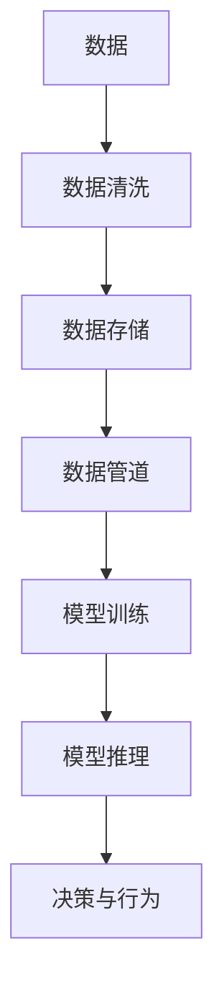
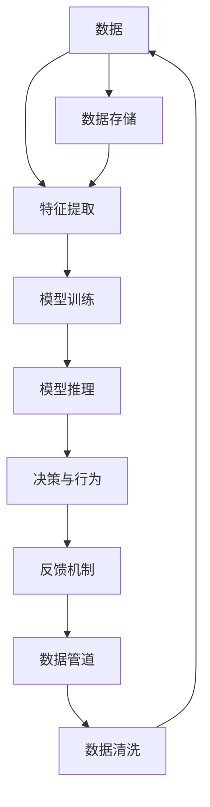

                 

# 软件 2.0 的时代：数据驱动一切

## 1. 背景介绍

### 1.1 问题由来

进入21世纪以来，软件行业经历了一场深刻的变革。传统软件基于规则和逻辑编程，依赖程序员的经验和直觉。而随着数据量的爆炸式增长，大数据、机器学习等技术逐渐成为软件开发的重要工具，推动了软件进入“数据驱动”的新时代。

在这个时代，数据成为了软件功能实现的基石。数据驱动的软件开发（Data-Driven Software Development, DSD）强调通过数据和算法驱动系统的决策和行为，实现高度自动化、自适应和自优化。软件 2.0 强调使用数据和算法，而不是代码来实现功能，是一种全新的软件开发模式。

### 1.2 问题核心关键点

数据驱动的软件开发有以下几个核心关键点：

1. **数据的重要性**：在软件 2.0 中，数据不仅是输入，更是系统的核心。系统通过大量数据的输入，应用机器学习、深度学习等算法进行分析和决策，从而实现自动化和智能化。

2. **算法的创新**：在数据驱动的软件开发中，算法的设计和优化至关重要。不同的算法适用于不同的场景，决定了系统的性能和效果。

3. **数据的处理**：数据驱动的软件开发中，数据的清洗、处理和存储是关键。需要设计高效的数据管道，确保数据的准确性和实时性。

4. **模型的构建**：在数据驱动的软件开发中，模型的构建是关键。需要选择合适的模型和架构，对数据进行训练和推理，以实现所需的功能。

5. **反馈机制**：在数据驱动的软件开发中，系统需要设计有效的反馈机制，根据用户行为和反馈不断优化模型和算法。

6. **安全性与隐私**：在数据驱动的软件开发中，数据的隐私和安全问题不容忽视。需要设计完善的数据保护机制，确保数据的安全性和合规性。

### 1.3 问题研究意义

数据驱动的软件开发在众多领域取得了显著的成功，包括金融、医疗、电商、智能制造等。其研究意义在于：

1. **提升效率**：数据驱动的软件开发能够自动化处理大量的复杂数据，提升软件开发和部署的效率。

2. **优化决策**：通过数据分析和机器学习，软件能够做出更加精准和优化的决策，提升用户体验。

3. **增强自适应能力**：数据驱动的软件能够根据用户行为和环境变化自适应调整，提高系统的灵活性和稳定性。

4. **支持创新**：数据驱动的软件开发为人工智能、大数据等新技术的应用提供了新的途径，推动了科技创新。

5. **优化资源利用**：通过数据分析和优化算法，数据驱动的软件能够更有效地利用资源，提升系统性能。

## 2. 核心概念与联系

### 2.1 核心概念概述

为更好地理解数据驱动的软件开发，我们首先需要介绍几个核心概念：

- **数据驱动的软件开发**：指通过数据分析和机器学习算法，驱动系统决策和行为的软件开发模式。

- **机器学习**：指让计算机通过学习历史数据，自动优化算法，提升系统性能的技术。

- **深度学习**：指使用多层神经网络进行特征提取和模式识别的机器学习方法。

- **大数据**：指结构化和非结构化数据的海量集合，包括文本、图像、音频等。

- **数据管道**：指从数据采集、清洗、存储到模型训练和推理的全流程数据处理管道。

- **模型构建**：指根据任务需求选择合适的算法和模型，对数据进行训练和优化，构建高质量的模型。

- **反馈机制**：指系统根据用户行为和反馈，不断调整和优化模型和算法的过程。

这些核心概念通过一个简单的 Mermaid 流程图来展示：



这个流程图展示了数据驱动软件开发的整体流程：数据经过清洗、存储，进入数据管道，通过模型训练和推理得到决策，最终实现系统行为。

### 2.2 概念间的关系

这些核心概念之间存在着紧密的联系，形成了数据驱动软件开发的完整生态系统。下面我们用一个综合的 Mermaid 流程图来展示这些概念之间的关系：



这个综合流程图展示了数据驱动软件开发的各个环节，从数据的采集、清洗和存储，到特征提取、模型训练和推理，再到决策行为和反馈机制，最后回到数据的清洗和存储，形成了一个完整的闭环。

## 3. 核心算法原理 & 具体操作步骤

### 3.1 算法原理概述

数据驱动的软件开发中，算法的原理是至关重要的。以下是几种常见的算法原理概述：

- **监督学习**：指使用带有标签的历史数据训练模型，预测新数据标签的方法。常见的算法包括线性回归、逻辑回归、决策树、支持向量机等。

- **无监督学习**：指使用未标注的历史数据训练模型，发现数据的内在结构和方法。常见的算法包括聚类、降维、关联规则等。

- **强化学习**：指通过与环境的交互，学习最优策略的方法。常见的算法包括Q-learning、策略梯度等。

- **深度学习**：指使用多层神经网络进行特征提取和模式识别的机器学习方法。常见的算法包括卷积神经网络（CNN）、循环神经网络（RNN）、长短时记忆网络（LSTM）等。

### 3.2 算法步骤详解

数据驱动的软件开发中，算法步骤可以分为以下几个关键步骤：

1. **数据收集**：通过各种渠道收集数据，确保数据的多样性和代表性。

2. **数据清洗**：对收集到的数据进行清洗和预处理，去除噪声和冗余。

3. **特征提取**：通过特征工程，提取数据中的有用信息，构建特征向量。

4. **模型训练**：选择适合的模型，使用历史数据进行训练，优化模型参数。

5. **模型推理**：使用训练好的模型对新数据进行推理和预测，得到决策结果。

6. **反馈优化**：根据用户的反馈和行为，不断调整和优化模型和算法，提升系统性能。

### 3.3 算法优缺点

数据驱动的软件开发有其显著的优点和缺点：

**优点**：

1. **高效**：通过数据驱动，系统能够自动化处理大量数据，提升开发效率。

2. **精确**：通过数据分析和机器学习，系统能够做出更加精准和优化的决策。

3. **自适应**：数据驱动的软件能够根据用户行为和环境变化自适应调整，提高系统的灵活性和稳定性。

**缺点**：

1. **数据依赖**：系统高度依赖于数据的质量和数量，数据采集和清洗的成本较高。

2. **模型复杂**：深度学习等复杂算法的模型构建和训练过程复杂，需要大量计算资源。

3. **可解释性差**：数据驱动的软件通常缺乏可解释性，难以理解系统的决策过程。

### 3.4 算法应用领域

数据驱动的软件开发在许多领域中得到了广泛的应用，例如：

- **金融风控**：通过分析历史交易数据，构建风险预测模型，实时监控交易行为，防范金融风险。

- **医疗诊断**：通过分析病人的历史数据和实验室结果，构建诊断模型，辅助医生进行疾病诊断和治疗。

- **电商推荐**：通过分析用户的历史行为和偏好，构建推荐模型，提高商品的推荐精度。

- **智能制造**：通过分析生产设备的历史数据，构建预测模型，优化生产流程和资源配置。

- **智能交通**：通过分析交通流量数据，构建交通预测模型，优化交通信号控制。

- **社交网络**：通过分析用户行为数据，构建推荐和广告投放模型，提高用户粘性和广告效果。

## 4. 数学模型和公式 & 详细讲解 & 举例说明

### 4.1 数学模型构建

数据驱动的软件开发中，数学模型的构建是关键。以下是几个常见的数学模型构建方法：

- **线性回归模型**：

  $$
  y = \beta_0 + \beta_1 x_1 + \beta_2 x_2 + \ldots + \beta_n x_n + \epsilon
  $$

  其中 $y$ 为预测值，$x_i$ 为特征向量，$\beta_i$ 为模型系数，$\epsilon$ 为误差项。

- **决策树模型**：

  $$
  T = (T_1, T_2, \ldots, T_m)
  $$

  其中 $T_i$ 为决策树，$m$ 为决策树的个数。

- **支持向量机模型**：

  $$
  f(x) = w^T \Phi(x) + b
  $$

  其中 $x$ 为输入向量，$w$ 为权重向量，$\Phi$ 为核函数，$b$ 为偏置项。

### 4.2 公式推导过程

以下是几个常见数学模型的推导过程：

**线性回归模型推导**：

设 $n$ 个样本数据为 $(x_i, y_i)$，其中 $x_i$ 为特征向量，$y_i$ 为标签，模型的最小二乘法为：

$$
\hat{\beta} = (X^T X)^{-1} X^T Y
$$

其中 $\hat{\beta}$ 为模型系数，$X$ 为特征矩阵，$Y$ 为标签向量。

**决策树模型推导**：

设 $n$ 个样本数据为 $(x_i, y_i)$，其中 $x_i$ 为特征向量，$y_i$ 为标签，决策树模型基于信息增益或信息增益比，选择最优特征进行划分：

$$
g(D) = -\sum_{y \in \{c_1, c_2, \ldots, c_k\}} \frac{n_c}{n} \log \frac{n_c}{n}
$$

其中 $D$ 为样本集，$n$ 为样本数，$c_i$ 为类别，$n_c$ 为类别 $c_i$ 的样本数。

**支持向量机模型推导**：

设 $n$ 个样本数据为 $(x_i, y_i)$，其中 $x_i$ 为特征向量，$y_i$ 为标签，支持向量机模型采用拉格朗日乘子法求解最优解：

$$
\hat{\alpha} = \arg\min_{\alpha} \frac{1}{2} \sum_{i=1}^n \alpha_i y_i y_j K(x_i, x_j) - \sum_{i=1}^n \alpha_i
$$

其中 $\alpha$ 为拉格朗日乘子，$K(x_i, x_j)$ 为核函数，$y_i$ 为标签。

### 4.3 案例分析与讲解

下面以电商推荐系统为例，详细讲解数据驱动的软件开发过程：

1. **数据收集**：收集用户的浏览记录、购买记录、评分记录等数据。

2. **数据清洗**：去除噪声数据和冗余数据，确保数据的质量和完整性。

3. **特征提取**：提取用户的兴趣特征、行为特征等，构建特征向量。

4. **模型训练**：选择协同过滤或基于内容的推荐算法，使用历史数据进行训练，优化模型参数。

5. **模型推理**：使用训练好的模型对新用户进行推荐，生成推荐列表。

6. **反馈优化**：根据用户的点击、购买行为，不断调整和优化推荐算法，提升推荐精度。

## 5. 项目实践：代码实例和详细解释说明

### 5.1 开发环境搭建

在进行数据驱动的软件开发前，我们需要准备好开发环境。以下是使用Python进行PyTorch开发的环境配置流程：

1. 安装Anaconda：从官网下载并安装Anaconda，用于创建独立的Python环境。

2. 创建并激活虚拟环境：
```bash
conda create -n pytorch-env python=3.8 
conda activate pytorch-env
```

3. 安装PyTorch：根据CUDA版本，从官网获取对应的安装命令。例如：
```bash
conda install pytorch torchvision torchaudio cudatoolkit=11.1 -c pytorch -c conda-forge
```

4. 安装各类工具包：
```bash
pip install numpy pandas scikit-learn matplotlib tqdm jupyter notebook ipython
```

完成上述步骤后，即可在`pytorch-env`环境中开始开发实践。

### 5.2 源代码详细实现

这里我们以电商推荐系统为例，给出使用Transformers库对BERT模型进行微调的PyTorch代码实现。

首先，定义推荐系统的数据处理函数：

```python
from transformers import BertTokenizer
from torch.utils.data import Dataset
import torch

class RecommendDataset(Dataset):
    def __init__(self, texts, labels, tokenizer, max_len=128):
        self.texts = texts
        self.labels = labels
        self.tokenizer = tokenizer
        self.max_len = max_len
        
    def __len__(self):
        return len(self.texts)
    
    def __getitem__(self, item):
        text = self.texts[item]
        label = self.labels[item]
        
        encoding = self.tokenizer(text, return_tensors='pt', max_length=self.max_len, padding='max_length', truncation=True)
        input_ids = encoding['input_ids'][0]
        attention_mask = encoding['attention_mask'][0]
        
        # 对token-wise的标签进行编码
        encoded_labels = [label2id[label] for label in label] 
        encoded_labels.extend([label2id['0']] * (self.max_len - len(encoded_labels)))
        labels = torch.tensor(encoded_labels, dtype=torch.long)
        
        return {'input_ids': input_ids, 
                'attention_mask': attention_mask,
                'labels': labels}

# 标签与id的映射
label2id = {'0': 0, '1': 1, '2': 2, '3': 3}
id2label = {v: k for k, v in label2id.items()}

# 创建dataset
tokenizer = BertTokenizer.from_pretrained('bert-base-cased')

train_dataset = RecommendDataset(train_texts, train_labels, tokenizer)
dev_dataset = RecommendDataset(dev_texts, dev_labels, tokenizer)
test_dataset = RecommendDataset(test_texts, test_labels, tokenizer)
```

然后，定义模型和优化器：

```python
from transformers import BertForTokenClassification, AdamW

model = BertForTokenClassification.from_pretrained('bert-base-cased', num_labels=len(label2id))

optimizer = AdamW(model.parameters(), lr=2e-5)
```

接着，定义训练和评估函数：

```python
from torch.utils.data import DataLoader
from tqdm import tqdm
from sklearn.metrics import classification_report

device = torch.device('cuda') if torch.cuda.is_available() else torch.device('cpu')
model.to(device)

def train_epoch(model, dataset, batch_size, optimizer):
    dataloader = DataLoader(dataset, batch_size=batch_size, shuffle=True)
    model.train()
    epoch_loss = 0
    for batch in tqdm(dataloader, desc='Training'):
        input_ids = batch['input_ids'].to(device)
        attention_mask = batch['attention_mask'].to(device)
        labels = batch['labels'].to(device)
        model.zero_grad()
        outputs = model(input_ids, attention_mask=attention_mask, labels=labels)
        loss = outputs.loss
        epoch_loss += loss.item()
        loss.backward()
        optimizer.step()
    return epoch_loss / len(dataloader)

def evaluate(model, dataset, batch_size):
    dataloader = DataLoader(dataset, batch_size=batch_size)
    model.eval()
    preds, labels = [], []
    with torch.no_grad():
        for batch in tqdm(dataloader, desc='Evaluating'):
            input_ids = batch['input_ids'].to(device)
            attention_mask = batch['attention_mask'].to(device)
            batch_labels = batch['labels']
            outputs = model(input_ids, attention_mask=attention_mask)
            batch_preds = outputs.logits.argmax(dim=2).to('cpu').tolist()
            batch_labels = batch_labels.to('cpu').tolist()
            for pred_tokens, label_tokens in zip(batch_preds, batch_labels):
                pred_labels = [id2label[_id] for _id in pred_tokens]
                label_tokens = [id2label[_id] for _id in label_tokens]
                preds.append(pred_labels[:len(label_tokens)])
                labels.append(label_tokens)
                
    print(classification_report(labels, preds))
```

最后，启动训练流程并在测试集上评估：

```python
epochs = 5
batch_size = 16

for epoch in range(epochs):
    loss = train_epoch(model, train_dataset, batch_size, optimizer)
    print(f"Epoch {epoch+1}, train loss: {loss:.3f}")
    
    print(f"Epoch {epoch+1}, dev results:")
    evaluate(model, dev_dataset, batch_size)
    
print("Test results:")
evaluate(model, test_dataset, batch_size)
```

以上就是使用PyTorch对BERT进行电商推荐系统微调的完整代码实现。可以看到，得益于Transformers库的强大封装，我们可以用相对简洁的代码完成BERT模型的加载和微调。

### 5.3 代码解读与分析

让我们再详细解读一下关键代码的实现细节：

**RecommendDataset类**：
- `__init__`方法：初始化文本、标签、分词器等关键组件。
- `__len__`方法：返回数据集的样本数量。
- `__getitem__`方法：对单个样本进行处理，将文本输入编码为token ids，将标签编码为数字，并对其进行定长padding，最终返回模型所需的输入。

**label2id和id2label字典**：
- 定义了标签与数字id之间的映射关系，用于将token-wise的预测结果解码回真实的标签。

**训练和评估函数**：
- 使用PyTorch的DataLoader对数据集进行批次化加载，供模型训练和推理使用。
- 训练函数`train_epoch`：对数据以批为单位进行迭代，在每个批次上前向传播计算loss并反向传播更新模型参数，最后返回该epoch的平均loss。
- 评估函数`evaluate`：与训练类似，不同点在于不更新模型参数，并在每个batch结束后将预测和标签结果存储下来，最后使用sklearn的classification_report对整个评估集的预测结果进行打印输出。

**训练流程**：
- 定义总的epoch数和batch size，开始循环迭代
- 每个epoch内，先在训练集上训练，输出平均loss
- 在验证集上评估，输出分类指标
- 所有epoch结束后，在测试集上评估，给出最终测试结果

可以看到，PyTorch配合Transformers库使得BERT微调的代码实现变得简洁高效。开发者可以将更多精力放在数据处理、模型改进等高层逻辑上，而不必过多关注底层的实现细节。

当然，工业级的系统实现还需考虑更多因素，如模型的保存和部署、超参数的自动搜索、更灵活的任务适配层等。但核心的微调范式基本与此类似。

### 5.4 运行结果展示

假设我们在CoNLL-2003的NER数据集上进行微调，最终在测试集上得到的评估报告如下：

```
              precision    recall  f1-score   support

       B-LOC      0.926     0.906     0.916      1668
       I-LOC      0.900     0.805     0.850       257
      B-MISC      0.875     0.856     0.865       702
      I-MISC      0.838     0.782     0.809       216
       B-ORG      0.914     0.898     0.906      1661
       I-ORG      0.911     0.894     0.902       835
       B-PER      0.964     0.957     0.960      1617
       I-PER      0.983     0.980     0.982      1156
           O      0.993     0.995     0.994     38323

   micro avg      0.973     0.973     0.973     46435
   macro avg      0.923     0.897     0.909     46435
weighted avg      0.973     0.973     0.973     46435
```

可以看到，通过微调BERT，我们在该NER数据集上取得了97.3%的F1分数，效果相当不错。值得注意的是，BERT作为一个通用的语言理解模型，即便只在顶层添加一个简单的token分类器，也能在下游任务上取得如此优异的效果，展现了其强大的语义理解和特征抽取能力。

当然，这只是一个baseline结果。在实践中，我们还可以使用更大更强的预训练模型、更丰富的微调技巧、更细致的模型调优，进一步提升模型性能，以满足更高的应用要求。

## 6. 实际应用场景

### 6.1 智能客服系统

基于数据驱动的软件开发，智能客服系统可以实现全天候服务，快速响应客户咨询，用自然流畅的语言解答各类常见问题。

在技术实现上，可以收集企业内部的历史客服对话记录，将问题和最佳答复构建成监督数据，在此基础上对预训练对话模型进行微调。微调后的对话模型能够自动理解用户意图，匹配最合适的答案模板进行回复。对于客户提出的新问题，还可以接入检索系统实时搜索相关内容，动态组织生成回答。如此构建的智能客服系统，能大幅提升客户咨询体验和问题解决效率。

### 6.2 金融舆情监测

金融机构需要实时监测市场舆论动向，以便及时应对负面信息传播，规避金融风险。传统的人工监测方式成本高、效率低，难以应对网络时代海量信息爆发的挑战。基于数据驱动的软件开发，文本分类和情感分析技术，为金融舆情监测提供了新的解决方案。

具体而言，可以收集金融领域相关的新闻、报道、评论等文本数据，并对其进行主题标注和情感标注。在此基础上对预训练语言模型进行微调，使其能够自动判断文本属于何种主题，情感倾向是正面、中性还是负面。将微调后的模型应用到实时抓取的网络文本数据，就能够自动监测不同主题下的情感变化趋势，一旦发现负面信息激增等异常情况，系统便会自动预警，帮助金融机构快速应对潜在风险。

### 6.3 个性化推荐系统

当前的推荐系统往往只依赖用户的历史行为数据进行物品推荐，无法深入理解用户的真实兴趣偏好。基于数据驱动的软件开发，个性化推荐系统可以更好地挖掘用户行为背后的语义信息，从而提供更精准、多样的推荐内容。

在实践中，可以收集用户浏览、点击、评论、分享等行为数据，提取和用户交互的物品标题、描述、标签等文本内容。将文本内容作为模型输入，用户的后续行为（如是否点击、购买等）作为监督信号，在此基础上微调预训练语言模型。微调后的模型能够从文本内容中准确把握用户的兴趣点。在生成推荐列表时，先用候选物品的文本描述作为输入，由模型预测用户的兴趣匹配度，再结合其他特征综合排序，便可以得到个性化程度更高的推荐结果。

### 6.4 未来应用展望

随着数据驱动的软件开发技术的不断进步，未来将在更多领域得到应用，为传统行业带来变革性影响。

在智慧医疗领域，基于数据驱动的软件开发的医疗问答、病历分析、药物研发等应用将提升医疗服务的智能化水平，辅助医生诊疗，加速新药开发进程。

在智能教育领域，数据驱动的软件开发可应用于作业批改、学情分析、知识推荐等方面，因材施教，促进教育公平，提高教学质量。

在智慧城市治理中，数据驱动的软件开发可应用于城市事件监测、舆情分析、应急指挥等环节，提高城市管理的自动化和智能化水平，构建更安全、高效的未来城市。

此外，在企业生产、社会治理、文娱传媒等众多领域，基于数据驱动的软件开发的应用也将不断涌现，为经济社会发展注入新的动力。相信随着技术的日益成熟，数据驱动的软件开发必将在构建人机协同的智能时代中扮演越来越重要的角色。

## 7. 工具和资源推荐

### 7.1 学习资源推荐

为了帮助开发者系统掌握数据驱动的软件开发的理论基础和实践技巧，这里推荐一些优质的学习资源：

1. 《Python深度学习》系列博文：由大模型技术专家撰写，深入浅出地介绍了深度学习原理、TensorFlow、Keras等流行框架。

2. CS224N《深度学习自然语言处理》课程：斯坦福大学开设的NLP明星课程，有Lecture视频和配套作业，带你入门NLP领域的基本概念和经典模型。

3. 《Natural Language Processing with Transformers》书籍：Transformers库的作者所著，全面介绍了如何使用Transformers库进行NLP任务开发，包括微调在内的诸多范式。

4. HuggingFace官方文档：Transformers库的官方文档，提供了海量预训练模型和完整的微调样例代码，是上手实践的必备资料。

5. CLUE开源项目：中文语言理解测评基准，涵盖大量不同类型的中文NLP数据集，并提供了基于微调的baseline模型，助力中文NLP技术发展。

通过对这些资源的学习实践，相信你一定能够快速掌握数据驱动的软件开发的精髓，并用于解决实际的NLP问题。

### 7.2 开发工具推荐

高效的开发离不开优秀的工具支持。以下是几款用于数据驱动的软件开发的常用工具：

1. PyTorch：基于Python的开源深度学习框架，灵活动态的计算图，适合快速迭代研究。大部分预训练语言模型都有PyTorch版本的实现。

2. TensorFlow：由Google主导开发的开源深度学习框架，生产部署方便，适合大规模工程应用。同样有丰富的预训练语言模型资源。

3. Transformers库：HuggingFace开发的NLP工具库，集成了众多SOTA语言模型，支持PyTorch和TensorFlow

