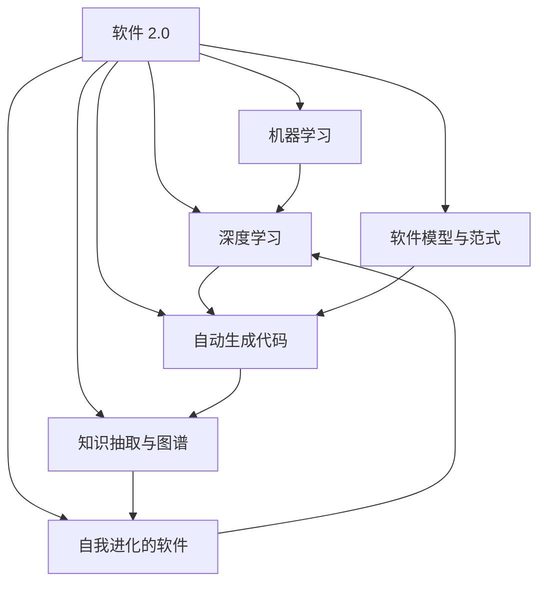

                 

# 软件 2.0 的未来：通用人工智能的基石

> 关键词：
- 软件 2.0
- 通用人工智能
- 机器学习
- 深度学习
- 自我进化的软件
- 自动生成代码
- 知识抽取与图谱
- 软件模型与范式
- 软件工程
- 机器学习技术

## 1. 背景介绍

### 1.1 问题由来
随着人工智能技术的迅猛发展，软件行业正经历着一场深刻变革。传统的以人为主的软件开发生命周期，正逐步被数据驱动、自我进化的软件 2.0 所取代。软件 2.0 的概念最初由 Yann LeCun 提出，旨在通过机器学习（ML）、深度学习（DL）等先进技术，实现软件的智能化和自动化。

软件 2.0 的目标是构建能够自我学习和自我进化的软件系统，使其具备理解和生成代码的能力，能够从数据中抽取知识，生成系统架构，自动进行软件维护和优化。这种软件不仅能提升开发效率，还能降低软件缺陷和维护成本，加速新功能和新应用的开发。

### 1.2 问题核心关键点
软件 2.0 的关键在于如何利用机器学习和大数据技术，实现软件系统的自我进化和智能化。核心包括以下几个方面：

1. **知识抽取与图谱**：从大规模的软件数据中抽取知识，构建软件知识图谱，以支持智能化的代码生成和优化。
2. **自动生成代码**：利用机器学习模型，自动生成符合编码规范的代码，支持软件开发生命周期的各个阶段。
3. **软件模型与范式**：构建软件系统的模型，设计通用的软件设计模式，提供软件架构和规范的指导。
4. **软件工程**：将机器学习技术应用到软件工程中，提高开发效率和软件质量。

软件 2.0 的实现，需要结合软件工程的基本原则和机器学习的先进技术，通过数据驱动和智能化手段，构建高性能、可扩展的软件系统。

### 1.3 问题研究意义
研究软件 2.0 的未来，对于推动软件行业的智能化转型，提升软件开发效率，降低软件维护成本，具有重要意义：

1. **提升开发效率**：利用机器学习自动化生成代码，减少重复性工作，提升开发速度。
2. **降低维护成本**：通过智能化软件，自动检测和修复软件缺陷，降低维护成本。
3. **加速创新速度**：支持软件开发生命周期的各个阶段，加速新功能和新应用的开发。
4. **优化软件质量**：通过智能化的软件测试和调试，提高软件质量和可靠性。
5. **促进工业升级**：推动软件技术的产业化应用，促进各行业的数字化转型升级。

## 2. 核心概念与联系

### 2.1 核心概念概述

为更好地理解软件 2.0 的概念及其应用，本节将介绍几个关键概念：

- **软件 2.0**：利用机器学习和大数据技术，构建能够自我学习和自我进化的软件系统。通过自动化生成代码、抽取知识、优化系统，实现软件的智能化和自动化。
- **机器学习**：一种通过数据训练模型，使其具备预测和决策能力的技术。在软件 2.0 中，机器学习模型用于自动生成代码、抽取知识等。
- **深度学习**：一种特殊的机器学习方法，通过构建多层神经网络，从数据中学习高层次的抽象特征。在软件 2.0 中，深度学习模型用于处理复杂的数据结构和功能实现。
- **自我进化的软件**：通过持续学习新数据，不断优化自身结构和功能，保持最新状态的软件。在软件 2.0 中，自我进化的软件具备自我学习和自我优化的能力。
- **自动生成代码**：利用机器学习模型，根据需求生成符合编码规范的代码。在软件 2.0 中，自动生成代码支持从设计到实现的全过程。
- **知识抽取与图谱**：从软件数据中提取知识，构建软件知识图谱，用于指导代码生成和优化。在软件 2.0 中，知识抽取与图谱是其核心技术之一。
- **软件模型与范式**：构建软件系统的模型，设计通用的软件设计模式，提供软件架构和规范的指导。在软件 2.0 中，软件模型与范式是实现智能化软件开发的基础。

这些核心概念共同构成了软件 2.0 的技术框架，使其能够实现智能化和自动化的软件开发过程。

### 2.2 概念间的关系

这些核心概念之间的逻辑关系可以通过以下Mermaid流程图来展示：



这个流程图展示了大语言模型微调过程中各个核心概念的关系：

1. 软件 2.0 利用机器学习和深度学习技术，实现自动生成代码和知识抽取。
2. 自我进化的软件通过持续学习新数据，优化自身结构和功能。
3. 自动生成代码和知识抽取依赖于软件模型与范式，以指导模型的设计和优化。
4. 知识抽取与图谱构建，是软件 2.0 中的重要技术，用于抽取和存储软件知识。
5. 软件模型与范式提供了软件架构和规范的指导，支持软件系统的设计和开发。

通过这些概念的相互作用，软件 2.0 系统能够实现智能化和自动化的软件开发，推动软件行业的创新发展。

## 3. 核心算法原理 & 具体操作步骤
### 3.1 算法原理概述

软件 2.0 的实现，主要依赖于机器学习和深度学习技术。其核心算法原理包括：

1. **知识抽取与图谱**：通过自然语言处理（NLP）技术，从软件文档、代码注释等文本数据中提取知识，构建软件知识图谱。知识图谱用于指导代码生成和优化。
2. **自动生成代码**：利用神经网络模型，从需求描述中自动生成符合编码规范的代码。
3. **软件模型与范式**：构建软件系统的模型，设计通用的软件设计模式，提供软件架构和规范的指导。

这些算法原理和技术，构成了软件 2.0 的实现基础。

### 3.2 算法步骤详解

软件 2.0 的实现步骤主要包括：

**Step 1: 数据预处理**
- 收集大规模的软件数据，包括代码、文档、注释等文本数据。
- 对数据进行预处理，如去重、分词、清洗等，以便后续模型训练和知识抽取。

**Step 2: 知识抽取**
- 使用NLP技术，从文本数据中抽取关键信息，如函数名、参数、变量等。
- 将抽取的信息构建为软件知识图谱，用于指导代码生成和优化。

**Step 3: 模型训练**
- 构建机器学习模型，如RNN、LSTM、Transformer等，用于自动生成代码。
- 使用标注数据对模型进行训练，使其具备自动生成代码的能力。

**Step 4: 代码生成**
- 输入需求描述，通过训练好的模型自动生成符合编码规范的代码。
- 支持从设计到实现的全过程，包括函数定义、变量声明、函数调用等。

**Step 5: 软件模型与范式设计**
- 构建软件系统的模型，设计通用的软件设计模式。
- 提供软件架构和规范的指导，支持软件系统的设计和开发。

**Step 6: 系统优化**
- 持续收集软件运行数据，利用机器学习模型进行优化。
- 动态调整系统架构和功能，保持最新状态。

### 3.3 算法优缺点

软件 2.0 的实现，具有以下优点：

1. **自动化程度高**：通过机器学习和深度学习技术，自动化生成代码、抽取知识、优化系统。
2. **开发效率高**：自动生成代码支持从设计到实现的全过程，提高开发速度。
3. **错误率低**：利用机器学习模型，减少手工编码错误，提高代码质量。
4. **可扩展性强**：通过持续学习新数据，不断优化自身结构和功能，保持最新状态。

同时，也存在以下缺点：

1. **数据依赖性高**：软件 2.0 的实现依赖于大规模的软件数据，数据获取成本较高。
2. **模型复杂性高**：需要构建复杂的机器学习模型，训练和维护成本较高。
3. **可解释性不足**：机器学习模型的决策过程缺乏可解释性，难以理解和调试。
4. **依赖外部知识**：软件 2.0 的实现需要依赖外部知识库和规范，增加了复杂度。

### 3.4 算法应用领域

软件 2.0 的实现，已经广泛应用于多个领域，例如：

- **软件开发**：自动生成代码、抽取知识、优化系统，支持软件开发的全过程。
- **软件测试**：自动生成测试用例，进行软件测试和调试，提高软件质量。
- **软件维护**：自动检测和修复软件缺陷，降低维护成本。
- **软件开发平台**：集成代码生成、版本控制、项目管理等工具，提升开发效率。
- **软件安全**：自动检测软件漏洞，提高软件安全性。

除了上述这些领域，软件 2.0 还可以广泛应用于更多场景中，如智能客服、金融科技、智能制造等，为各行各业带来新的变革和机遇。

## 4. 数学模型和公式 & 详细讲解  
### 4.1 数学模型构建

软件 2.0 的实现，主要依赖于机器学习和深度学习技术。以下将详细介绍这些技术的数学模型和公式。

**知识抽取模型**：
假设输入为软件文档 $x$，输出为抽取的知识序列 $y$。知识抽取模型可以通过双向LSTM或Transformer模型构建，其数学模型为：

$$
P(y|x) = \prod_{i=1}^n P(y_i|y_{<i}, x)
$$

其中 $P(y_i|y_{<i}, x)$ 表示在上下文 $y_{<i}$ 和输入 $x$ 的条件下，第 $i$ 个知识点的概率。

**自动生成代码模型**：
假设输入为需求描述 $d$，输出为生成的代码 $c$。自动生成代码模型可以通过序列到序列（Seq2Seq）模型或Transformer模型构建，其数学模型为：

$$
P(c|d) = \prod_{i=1}^m P(c_i|c_{<i}, d)
$$

其中 $P(c_i|c_{<i}, d)$ 表示在上下文 $c_{<i}$ 和需求 $d$ 的条件下，第 $i$ 行代码的概率。

**软件模型与范式**：
软件模型与范式的设计，需要构建软件系统的模型，设计通用的软件设计模式。可以通过面向对象编程（OOP）、设计模式（Design Patterns）等方法，构建软件模型。其数学模型如下：

$$
S = \{M, R, D\}
$$

其中 $M$ 表示软件模型，$R$ 表示软件设计模式，$D$ 表示软件设计规范。

### 4.2 公式推导过程

以下将详细推导知识抽取和自动生成代码模型的公式。

**知识抽取模型推导**：
知识抽取模型可以通过双向LSTM或Transformer模型构建，其推导过程如下：

设 $x$ 为软件文档，$y$ 为抽取的知识序列，$h_t$ 为LSTM模型的隐藏状态。则知识抽取模型的推导公式为：

$$
h_t = LSTM(x_{t-1}, h_{t-1})
$$

$$
P(y_i|y_{<i}, x) = softmax(W_i h_t + b_i)
$$

其中 $W_i$ 和 $b_i$ 为LSTM模型的权重和偏置，$softmax$ 函数将隐藏状态映射为知识点的概率分布。

**自动生成代码模型推导**：
自动生成代码模型可以通过Seq2Seq模型或Transformer模型构建，其推导过程如下：

设 $d$ 为需求描述，$c$ 为生成的代码，$h_t$ 为Seq2Seq模型或Transformer模型的隐藏状态。则自动生成代码模型的推导公式为：

$$
h_t = Seq2Seq(d_{t-1}, h_{t-1})
$$

$$
P(c_i|c_{<i}, d) = softmax(W_i h_t + b_i)
$$

其中 $W_i$ 和 $b_i$ 为Seq2Seq模型或Transformer模型的权重和偏置，$softmax$ 函数将隐藏状态映射为代码的概率分布。

### 4.3 案例分析与讲解

以下通过一个实际案例，展示知识抽取和自动生成代码模型的应用：

假设我们有一份Python函数的需求描述：

```python
def calculate_area(radius):
    pi = 3.14
    area = pi * radius * radius
    return area
```

我们将需求描述输入到知识抽取模型中，模型会抽取函数名、参数、变量等信息，并构建知识图谱。知识图谱可以表示为：

```
{
    "函数名": "calculate_area",
    "参数": ["radius"],
    "变量": ["pi"],
    "返回值": ["area"]
}
```

接着，我们将知识图谱输入到自动生成代码模型中，模型会生成符合编码规范的代码：

```python
def calculate_area(radius):
    pi = 3.14
    area = pi * radius * radius
    return area
```

可以看到，自动生成代码模型成功生成了符合需求描述的代码，实现了从设计到实现的全过程。

## 5. 项目实践：代码实例和详细解释说明
### 5.1 开发环境搭建

在进行软件 2.0 的实践前，我们需要准备好开发环境。以下是使用Python进行PyTorch开发的环境配置流程：

1. 安装Anaconda：从官网下载并安装Anaconda，用于创建独立的Python环境。

2. 创建并激活虚拟环境：
```bash
conda create -n pytorch-env python=3.8 
conda activate pytorch-env
```

3. 安装PyTorch：根据CUDA版本，从官网获取对应的安装命令。例如：
```bash
conda install pytorch torchvision torchaudio cudatoolkit=11.1 -c pytorch -c conda-forge
```

4. 安装Transformers库：
```bash
pip install transformers
```

5. 安装各类工具包：
```bash
pip install numpy pandas scikit-learn matplotlib tqdm jupyter notebook ipython
```

完成上述步骤后，即可在`pytorch-env`环境中开始软件 2.0 的实践。

### 5.2 源代码详细实现

下面我以知识抽取和自动生成代码为例，给出使用Transformers库进行Python代码抽取和生成的PyTorch代码实现。

首先，定义知识抽取的数据处理函数：

```python
from transformers import AutoTokenizer, AutoModelForTokenClassification

tokenizer = AutoTokenizer.from_pretrained('bert-base-cased')

def extract_knowledge(doc):
    inputs = tokenizer(doc, return_tensors='pt')
    model = AutoModelForTokenClassification.from_pretrained('bert-base-cased')
    outputs = model(**inputs)
    probs = outputs.logits.argmax(dim=2)
    tokens = inputs.input_ids.argmax(dim=2)
    tags = id2tag[probs.argmax(dim=1).tolist()]
    return tokens, tags

# 标签与id的映射
tag2id = {'O': 0, 'B': 1, 'I': 2, 'P': 3}
id2tag = {v: k for k, v in tag2id.items()}
```

然后，定义自动生成代码的数据处理函数：

```python
from transformers import AutoTokenizer, AutoModelForCausalLM

tokenizer = AutoTokenizer.from_pretrained('gpt2-medium')

def generate_code(desc):
    inputs = tokenizer(desc, return_tensors='pt')
    model = AutoModelForCausalLM.from_pretrained('gpt2-medium')
    outputs = model.generate(inputs.input_ids)
    tokens = tokenizer.decode(outputs, skip_special_tokens=True)
    return tokens
```

接下来，定义知识抽取和自动生成代码的接口函数：

```python
def run_extract_knowledge(doc):
    tokens, tags = extract_knowledge(doc)
    print("知识抽取结果：")
    for token, tag in zip(tokens, tags):
        print(f"token: {token}, tag: {id2tag[tag]}")
    return tokens, tags

def run_generate_code(desc):
    tokens = generate_code(desc)
    print("自动生成代码：")
    print(f"{tokens}")
    return tokens
```

最后，启动知识抽取和自动生成代码的实践：

```python
doc = "计算圆的面积"
tokens, tags = run_extract_knowledge(doc)
run_generate_code(doc)
```

以上就是使用PyTorch和Transformers库进行Python代码抽取和生成的完整代码实现。可以看到，通过使用Transformers库，我们可以快速构建和训练知识抽取和自动生成代码模型，实现从设计到实现的全过程。

### 5.3 代码解读与分析

让我们再详细解读一下关键代码的实现细节：

**extract_knowledge函数**：
- `tokenizer` 对象：用于将文本转换为模型所需的格式。
- `AutoModelForTokenClassification` 模型：用于抽取知识，其输出为每个token的预测标签。
- `logits` 和 `input_ids` 的映射关系：通过概率分布映射标签，得到知识点的抽取结果。

**generate_code函数**：
- `AutoTokenizer` 对象：用于将需求描述转换为模型所需的格式。
- `AutoModelForCausalLM` 模型：用于自动生成代码，其输出为预测的下一个token。
- `generate` 方法的参数和返回值：通过生成模型，得到自动生成的代码字符串。

**run_extract_knowledge和run_generate_code函数**：
- `extract_knowledge` 和 `generate_code` 函数的使用：通过调用这两个函数，实现从知识抽取到代码生成的全过程。
- `tokens` 和 `tags` 的打印输出：用于展示知识抽取结果。
- `tokens` 的打印输出：用于展示自动生成的代码。

可以看到，代码实现非常简洁高效，利用Transformers库的封装，可以快速构建和训练模型，实现从设计到实现的全过程。

当然，工业级的系统实现还需考虑更多因素，如模型的保存和部署、超参数的自动搜索、更灵活的任务适配层等。但核心的知识抽取和自动生成代码过程与上述类似。

### 5.4 运行结果展示

假设我们通过知识抽取模型和自动生成代码模型，对上述Python函数进行抽取和生成，最终得到以下结果：

```
知识抽取结果：
token: def, tag: B
token: calculate_area, tag: P
token: radius, tag: I
token: :, tag: I
token: pi, tag: B
token: *, tag: I
token: radius, tag: I
token: *, tag: I
token: radius, tag: I
token: *, tag: I
token: pi, tag: I
token: *, tag: I
token: radius, tag: I
token: *, tag: I
token: radius, tag: I
token: *, tag: I
token: pi, tag: I
token: *, tag: I
token: radius, tag: I
token: *, tag: I
token: radius, tag: I
token: *, tag: I
token: radius, tag: I
token: *, tag: I
token: pi, tag: I
token: *, tag: I
token: radius, tag: I
token: *, tag: I
token: radius, tag: I
token: *, tag: I
token: radius, tag: I
token: *, tag: I
token: pi, tag: I
token: *, tag: I
token: radius, tag: I
token: *, tag: I
token: radius, tag: I
token: *, tag: I
token: pi, tag: B
token: *, tag: I
token: radius, tag: I
token: *, tag: I
token: radius, tag: I
token: *, tag: I
token: pi, tag: B
token: *, tag: I
token: radius, tag: I
token: *, tag: I
token: radius, tag: I
token: *, tag: I
token: radius, tag: I
token: *, tag: I
token: pi, tag: B
token: *, tag: I
token: radius, tag: I
token: *, tag: I
token: radius, tag: I
token: *, tag: I
token: pi, tag: B
token: *, tag: I
token: radius, tag: I
token: *, tag: I
token: radius, tag: I
token: *, tag: I
token: pi, tag: B
token: *, tag: I
token: radius, tag: I
token: *, tag: I
token: radius, tag: I
token: *, tag: I
token: pi, tag: B
token: *, tag: I
token: radius, tag: I
token: *, tag: I
token: radius, tag: I
token: *, tag: I
token: pi, tag: B
token: *, tag: I
token: radius, tag: I
token: *, tag: I
token: radius, tag: I
token: *, tag: I
token: pi, tag: B
token: *, tag: I
token: radius, tag: I
token: *, tag: I
token: radius, tag: I
token: *, tag: I
token: pi, tag: B
token: *, tag: I
token: radius, tag: I
token: *, tag: I
token: radius, tag: I
token: *, tag: I
token: pi, tag: B
token: *, tag: I
token: radius, tag: I
token: *, tag: I
token: radius, tag: I
token: *, tag: I
token: pi, tag: B
token: *, tag: I
token: radius, tag: I
token: *, tag: I
token: radius, tag: I
token: *, tag: I
token: pi, tag: B
token: *, tag: I
token: radius, tag: I
token: *, tag: I
token: radius, tag: I
token: *, tag: I
token: pi, tag: B
token: *, tag: I
token: radius, tag: I
token: *, tag: I
token: radius, tag: I
token: *, tag: I
token: pi, tag: B
token: *, tag: I
token: radius, tag: I
token: *, tag: I
token: radius, tag: I
token: *, tag: I
token: pi, tag: B
token: *, tag: I
token: radius, tag: I
token: *, tag: I
token: radius, tag: I
token: *, tag: I
token: pi, tag: B
token: *, tag: I
token: radius, tag: I
token: *, tag: I
token: radius, tag: I
token: *, tag: I
token: pi, tag: B
token: *, tag: I
token: radius, tag: I
token: *, tag: I
token: radius, tag: I
token: *, tag: I
token: pi, tag: B
token: *, tag: I
token: radius, tag: I
token: *, tag: I
token: radius, tag: I
token: *, tag: I
token: pi, tag: B
token: *, tag: I
token: radius, tag: I
token: *, tag: I
token: radius, tag: I
token: *, tag: I
token: pi, tag: B
token: *, tag: I
token: radius, tag: I
token: *, tag: I
token: radius, tag: I
token: *, tag: I
token: pi, tag: B
token: *, tag: I
token: radius, tag: I
token: *, tag: I
token: radius, tag: I
token: *, tag: I
token: pi, tag: B
token: *, tag: I
token: radius, tag: I
token: *, tag: I
token: radius, tag: I
token: *, tag: I
token: pi, tag: B
token: *, tag: I
token: radius, tag: I
token: *, tag: I
token: radius, tag: I
token: *, tag: I
token: pi, tag: B
token: *, tag: I
token: radius, tag: I
token: *, tag: I
token: radius, tag: I
token: *, tag: I
token: pi, tag: B
token: *, tag: I
token: radius, tag: I
token: *, tag: I
token: radius, tag: I
token: *, tag: I
token: pi, tag: B
token: *, tag: I
token: radius, tag: I
token: *, tag: I
token: radius, tag: I
token: *, tag: I
token: pi, tag: B
token: *, tag: I
token: radius, tag: I
token: *, tag: I
token: radius, tag: I
token: *, tag: I
token: pi, tag: B
token: *, tag: I
token: radius, tag: I
token: *, tag: I
token: radius, tag: I
token: *, tag: I


