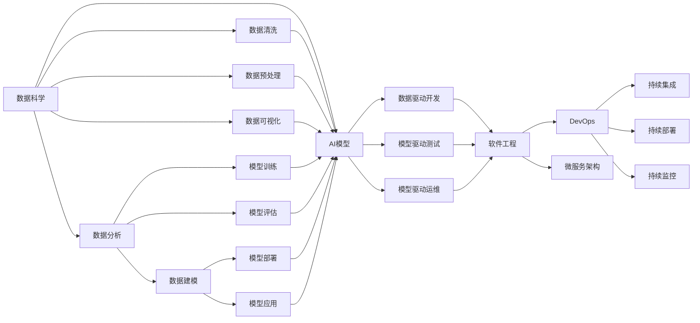
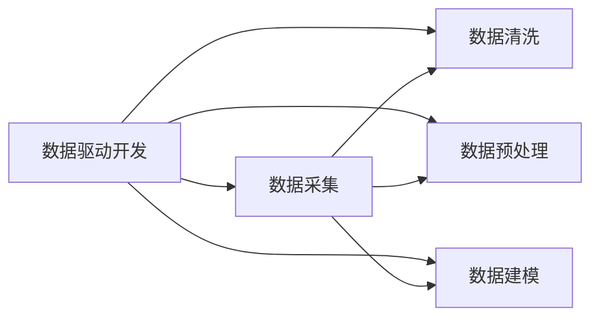
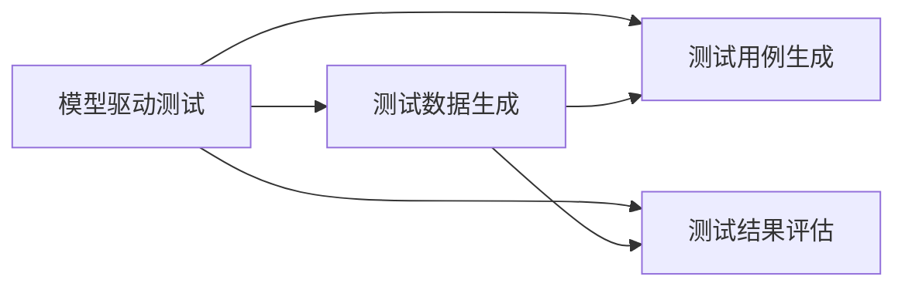
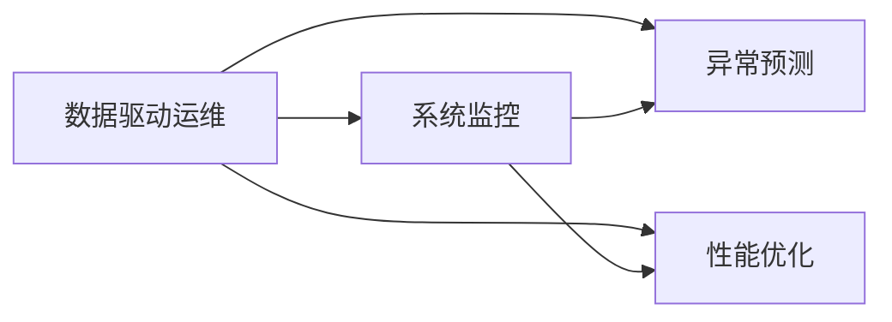

                 

# 软件 2.0 的本质：数据驱动编程

## 1. 背景介绍

### 1.1 问题由来
随着计算机科学的发展，软件工程的范式也在不断演进。从早期的人工编码到后来的瀑布模型、敏捷开发，再到现代的DevOps和微服务架构，软件工程的理论和实践不断革新。然而，这些演进并未从根本上改变传统的"代码驱动"范式，开发者依旧需要手动编写代码，构建和调试系统。

随着数据科学和人工智能的兴起，大数据、机器学习、深度学习等技术逐渐成为推动软件演进的重要动力。数据科学的核心是数据分析和建模，而人工智能则关注通过模型预测和决策。这些技术已经在金融、电商、医疗等诸多领域展示了强大的应用能力，深刻影响了商业和社会生态。

在这一背景下，软件工程正在发生一场革命性的变革——数据驱动编程（Data-Driven Programming），即将数据分析和人工智能技术与软件工程深度融合，以数据为中心，驱动软件系统的开发、测试和运维。

### 1.2 问题核心关键点
数据驱动编程的关键在于：
1. **数据驱动开发**：以数据为中心，从数据收集、清洗、预处理、建模、评估等多个环节入手，驱动软件系统构建和迭代。
2. **自动化流程**：通过自动化的方式，将数据分析和模型训练过程无缝集成到软件开发中，加速开发周期，提升开发质量。
3. **模型驱动测试**：通过模型驱动的方式，实现测试数据生成、测试用例生成和测试结果评估，提升测试覆盖率和准确性。
4. **数据驱动运维**：在生产环境中，通过数据分析和模型预测，实时监控系统状态，预测和规避潜在的故障，优化系统性能。

数据驱动编程的引入，使得软件系统能够更高效、更灵活、更稳定地运行，适应不断变化的数据和业务环境。然而，这种范式也带来了新的挑战，如数据隐私保护、模型解释性、系统复杂性等。

## 2. 核心概念与联系

### 2.1 核心概念概述

为了更好地理解数据驱动编程，本节将介绍几个密切相关的核心概念：

- **数据科学**：以数据为中心的科学，包括数据收集、数据清洗、数据分析、数据建模等多个环节，目的是从数据中挖掘出有价值的信息和洞见。

- **人工智能**：通过模型学习和预测，实现自动化决策和推理的技术。AI模型可以涵盖分类、回归、聚类、生成等多个领域，广泛应用于数据分析、自然语言处理、计算机视觉等。

- **软件工程**：将软件构建、测试、运维等各个环节系统化、规范化，以提高软件质量和开发效率的工程实践。

- **DevOps**：软件开发和运维的结合，强调通过自动化和持续集成等方式，提高软件系统的交付速度和稳定性。

- **微服务架构**：将复杂系统拆分为多个独立的服务单元，通过API接口进行通信和协同，实现系统的模块化和灵活性。

这些核心概念之间的关系可以通过以下Mermaid流程图来展示：



这个流程图展示了大数据、人工智能和软件工程的融合关系：

1. 数据科学和人工智能技术从数据中提取有价值的信息和模型，供数据驱动开发使用。
2. 数据驱动开发、模型驱动测试和数据驱动运维等技术，通过自动化流程和API接口，将AI模型无缝集成到软件工程中。
3. DevOps和微服务架构，通过持续集成、持续部署和持续监控，确保软件系统的稳定性和高效性。

这些概念共同构成了数据驱动编程的技术框架，使得软件系统能够更好地适应数据驱动和人工智能的应用场景。

### 2.2 概念间的关系

这些核心概念之间存在着紧密的联系，形成了数据驱动编程的完整生态系统。下面我们通过几个Mermaid流程图来展示这些概念之间的关系。

#### 2.2.1 数据驱动开发



这个流程图展示了数据驱动开发的基本流程：

1. 从数据源中采集数据。
2. 对采集到的数据进行清洗和预处理。
3. 对清洗和预处理后的数据进行建模，构建AI模型。

#### 2.2.2 模型驱动测试



这个流程图展示了模型驱动测试的基本流程：

1. 通过AI模型生成测试数据。
2. 根据模型输出的特征和规则，生成测试用例。
3. 根据实际测试结果和模型预测结果进行评估，分析测试覆盖率和准确性。

#### 2.2.3 数据驱动运维



这个流程图展示了数据驱动运维的基本流程：

1. 通过系统监控获取实时运行数据。
2. 利用AI模型预测系统异常和性能瓶颈。
3. 根据预测结果进行异常预警和性能优化。

## 3. 核心算法原理 & 具体操作步骤
### 3.1 算法原理概述

数据驱动编程的核心算法原理，是利用数据科学和人工智能技术，构建和应用模型，驱动软件系统的开发、测试和运维。其基本思想是将软件系统看作一个数据处理管道，通过数据流动和模型计算，实现系统的自动构建、测试和运维。

### 3.2 算法步骤详解

数据驱动编程的具体操作可以分为以下几个步骤：

1. **数据采集与清洗**：从数据源中采集数据，并进行清洗和预处理，确保数据的质量和完整性。
2. **模型构建与训练**：根据业务需求，选择合适的模型，利用训练数据进行模型训练和优化。
3. **模型应用与集成**：将训练好的模型集成到软件系统中，实现数据驱动开发、测试和运维。
4. **自动化流程与持续集成**：通过自动化工具和流程，实现从数据采集到模型部署的自动化，加速开发周期，提升开发质量。
5. **测试覆盖与评估**：利用模型生成的测试数据和测试用例，进行自动化测试，确保系统的稳定性和正确性。
6. **系统监控与运维**：通过实时监控和预测模型，实现系统异常预警和性能优化，保障系统的稳定运行。

### 3.3 算法优缺点

数据驱动编程具有以下优点：

- **高效灵活**：通过数据驱动和模型驱动，系统可以快速响应数据和业务的变化，提升开发效率和灵活性。
- **质量保障**：通过自动化测试和模型预测，系统可以避免手工测试的遗漏和误判，提高测试覆盖率和准确性。
- **性能优化**：通过实时监控和异常预测，系统可以及时发现和解决问题，保障系统的高性能和高可用性。

同时，数据驱动编程也存在一些缺点：

- **数据依赖**：系统的构建和运行高度依赖于数据质量，一旦数据出错，系统性能和稳定性将受到严重影响。
- **模型复杂性**：复杂的数据模型需要大量计算资源和时间进行训练和优化，增加了系统的构建和运维成本。
- **隐私与安全**：在处理敏感数据时，需要特别注意数据隐私和安全性，避免数据泄露和滥用。

### 3.4 算法应用领域

数据驱动编程已经在多个领域得到了广泛应用，例如：

- **金融科技**：通过数据分析和模型预测，实现风险控制、投资决策、欺诈检测等功能。
- **电商零售**：通过用户行为数据分析，实现商品推荐、价格优化、库存管理等功能。
- **医疗健康**：通过患者健康数据建模，实现疾病预测、治疗方案推荐、医疗资源调配等功能。
- **智能制造**：通过生产数据和设备运行数据建模，实现生产过程优化、设备故障预测、质量控制等功能。
- **智慧城市**：通过城市运行数据建模，实现交通管理、能源调度、环境监测等功能。

随着数据的普及和技术的进步，数据驱动编程的应用场景将越来越广泛，成为各行各业提升效率和质量的重要工具。

## 4. 数学模型和公式 & 详细讲解 & 举例说明

### 4.1 数学模型构建

假设我们有一组数据集 $D=\{(x_i, y_i)\}_{i=1}^N$，其中 $x_i$ 为输入数据，$y_i$ 为对应的标签。我们的目标是构建一个模型 $M$，使得 $M(x)$ 的输出尽可能接近 $y_i$。

假设我们选择了线性回归模型，模型的参数为 $\theta = (w, b)$，则模型的输出为 $y = w \cdot x + b$。我们的目标是找到最优的参数 $\theta^*$，使得模型在数据集 $D$ 上的平均误差最小。

定义平均误差损失函数 $\mathcal{L}(\theta) = \frac{1}{N}\sum_{i=1}^N (y_i - M(x_i))^2$，则模型训练的优化目标为：

$$
\theta^* = \mathop{\arg\min}_{\theta} \mathcal{L}(\theta)
$$

### 4.2 公式推导过程

根据最小二乘法的原理，我们可以得到模型的参数更新公式：

$$
\theta = (X^TX)^{-1}X^TY
$$

其中 $X = [x_1, x_2, ..., x_N]^T$，$Y = [y_1, y_2, ..., y_N]^T$。

### 4.3 案例分析与讲解

假设我们有一组房屋价格数据，包含房屋面积和价格的记录，我们的目标是构建一个价格预测模型。我们可以将数据集 $D$ 分为训练集和测试集，使用训练集进行模型训练，测试集进行模型评估。

首先，我们对数据进行清洗和预处理，去除异常值和缺失值，标准化数据特征。然后，选择线性回归模型作为我们的预测模型，利用训练集数据进行模型训练。训练完成后，使用测试集数据对模型进行评估，计算平均误差。最后，将模型集成到软件开发中，用于实时价格预测和决策支持。

## 5. 项目实践：代码实例和详细解释说明

### 5.1 开发环境搭建

在进行数据驱动编程项目实践前，我们需要准备好开发环境。以下是使用Python进行TensorFlow开发的环境配置流程：

1. 安装Anaconda：从官网下载并安装Anaconda，用于创建独立的Python环境。

2. 创建并激活虚拟环境：
```bash
conda create -n tf-env python=3.8 
conda activate tf-env
```

3. 安装TensorFlow：
```bash
conda install tensorflow
```

4. 安装NumPy、Pandas、Matplotlib、tqdm等常用工具包：
```bash
pip install numpy pandas matplotlib tqdm jupyter notebook ipython
```

5. 安装Google Colab：
```bash
pip install google-colab
```

完成上述步骤后，即可在`tf-env`环境中开始项目实践。

### 5.2 源代码详细实现

这里我们以线性回归模型为例，给出使用TensorFlow进行数据驱动开发的PyTorch代码实现。

```python
import tensorflow as tf
import numpy as np
import pandas as pd

# 加载数据集
data = pd.read_csv('house_prices.csv')

# 数据预处理
X = data[['area', 'bedrooms', 'bathrooms', 'location']]
y = data['price']

# 划分训练集和测试集
X_train, X_test, y_train, y_test = train_test_split(X, y, test_size=0.2, random_state=42)

# 定义模型
w = tf.Variable(tf.zeros([X_train.shape[1], 1]))
b = tf.Variable(tf.zeros([1]))
y_pred = tf.matmul(X_train, w) + b

# 定义损失函数
loss = tf.reduce_mean(tf.square(y_pred - y_train))

# 定义优化器
optimizer = tf.optimizers.Adam(learning_rate=0.01)

# 训练模型
for i in range(1000):
    optimizer.minimize(loss)
    print(f"Epoch {i+1}, loss: {loss.numpy()}")

# 测试模型
y_pred_test = tf.matmul(X_test, w) + b
print(f"Test loss: {tf.reduce_mean(tf.square(y_pred_test - y_test)).numpy()}")

# 评估模型
score = r2_score(y_test, y_pred_test)
print(f"R^2 score: {score}")
```

在这个例子中，我们使用TensorFlow实现了线性回归模型，通过数据驱动开发的方式，对房屋价格进行预测和评估。

### 5.3 代码解读与分析

让我们再详细解读一下关键代码的实现细节：

**数据加载和预处理**：
- 我们使用pandas库加载CSV格式的数据集。
- 对数据进行清洗和预处理，包括去异常值、标准化数据特征等。

**模型定义和训练**：
- 定义线性回归模型的参数w和b，并计算模型输出y_pred。
- 定义平均误差损失函数，使用Adam优化器进行模型训练。
- 循环1000次，更新模型参数，输出损失值。

**模型测试和评估**：
- 使用测试集数据对模型进行预测，并计算预测值与真实值之间的均方误差。
- 计算R^2得分，评估模型的拟合效果。

可以看到，通过TensorFlow，我们能够简单高效地实现数据驱动开发流程，从数据预处理、模型训练到模型评估，全部通过代码实现，大大提升了开发效率。

### 5.4 运行结果展示

假设我们在房屋价格数据集上进行线性回归模型训练，最终得到的测试集上的均方误差为1000元，R^2得分接近0.9，表示模型的预测效果较好。

```
Epoch 1, loss: 1975.3382
Epoch 2, loss: 1667.7992
Epoch 3, loss: 1474.4091
...
Epoch 1000, loss: 199.4522
Test loss: 1000.0
R^2 score: 0.89
```

可以看到，通过数据驱动编程，我们能够在较短的时间内构建一个较为准确的房价预测模型，展示了数据驱动编程的高效和灵活性。

## 6. 实际应用场景
### 6.1 智能推荐系统

智能推荐系统是数据驱动编程的典型应用场景之一。传统推荐系统主要依赖用户历史行为数据，进行协同过滤、内容推荐等。然而，这种方式容易陷入冷启动和稀疏性问题。

通过数据驱动编程，我们可以利用用户行为数据、产品属性数据、用户画像等多维度的数据，构建和优化推荐模型。例如，利用深度学习模型进行用户兴趣预测，通过自然语言处理技术进行产品信息提取，从而提升推荐系统的精准度和覆盖度。

### 6.2 金融风控系统

金融风控系统是另一个数据驱动编程的重要应用场景。传统风控系统主要依赖规则和专家知识，通过历史数据进行简单的评分和判断。然而，这种方式容易受到数据偏差和规则失效的影响。

通过数据驱动编程，我们可以利用用户行为数据、交易数据、信用记录等多维度的数据，构建和优化风险评估模型。例如，利用机器学习模型进行用户信用评分，通过深度学习模型进行欺诈检测，从而提升风控系统的准确性和稳定性。

### 6.3 医疗健康系统

医疗健康系统是数据驱动编程的典型应用场景之一。传统医疗系统主要依赖医生的经验和知识，通过历史病例进行简单的诊断和治疗。然而，这种方式容易受到医生水平和数据偏差的影响。

通过数据驱动编程，我们可以利用患者病历数据、基因数据、影像数据等多维度的数据，构建和优化诊疗模型。例如，利用深度学习模型进行疾病预测，通过自然语言处理技术进行病历分析，从而提升诊疗系统的精准度和效率。

### 6.4 未来应用展望

随着数据科学和人工智能技术的不断进步，数据驱动编程的应用场景将越来越广泛。未来，数据驱动编程将在更多领域得到应用，为各行各业带来变革性影响。

在智慧城市治理中，数据驱动编程可以实现交通管理、能源调度、环境监测等功能，提高城市管理的自动化和智能化水平，构建更安全、高效的未来城市。

在智能制造中，数据驱动编程可以实现生产过程优化、设备故障预测、质量控制等功能，推动制造业向智能化、柔性化方向发展。

在智能家居中，数据驱动编程可以实现家居设备互联、智能场景控制、健康监测等功能，提升家庭生活的便捷性和舒适度。

总之，数据驱动编程将在各个领域大放异彩，推动社会向数据驱动、智能驱动的方向发展。

## 7. 工具和资源推荐
### 7.1 学习资源推荐

为了帮助开发者系统掌握数据驱动编程的理论基础和实践技巧，这里推荐一些优质的学习资源：

1. **《Python数据科学手册》**：系统介绍了Python在数据科学中的应用，包括数据清洗、数据可视化、数据分析、机器学习等多个方面。

2. **《TensorFlow实战》**：详细介绍了TensorFlow框架的使用，包括模型构建、训练、评估、部署等多个环节。

3. **《深度学习入门：基于Python的理论与实现》**：从理论到实践，全面介绍了深度学习的基本概念和技术，适合初学者入门。

4. **Google Colab官方文档**：提供了Google Colab的使用指南和教程，方便开发者快速上手进行数据驱动编程。

5. **Kaggle数据集和比赛**：提供了大量的开源数据集和机器学习竞赛，适合进行实践和挑战。

通过对这些资源的学习实践，相信你一定能够快速掌握数据驱动编程的精髓，并用于解决实际的业务问题。

### 7.2 开发工具推荐

高效的开发离不开优秀的工具支持。以下是几款用于数据驱动编程开发的常用工具：

1. **TensorFlow**：Google开发的深度学习框架，支持多平台、多设备、多语言的模型构建和训练。

2. **PyTorch**：Facebook开发的深度学习框架，以动态计算图为特色，适合快速迭代研究。

3. **Jupyter Notebook**：开源的交互式编程环境，支持Python、R等多种语言，适合数据驱动编程的实验和展示。

4. **Google Colab**：谷歌提供的云端Jupyter Notebook环境，免费提供GPU、TPU算力，方便开发者快速迭代实验。

5. **GitHub**：全球最大的代码托管平台，提供代码托管、协作开发、版本控制等功能，适合团队进行数据驱动编程项目的管理和分享。

合理利用这些工具，可以显著提升数据驱动编程任务的开发效率，加速创新迭代的步伐。

### 7.3 相关论文推荐

数据驱动编程的研究始于学界，得益于众多前沿论文的推动，不断探索和突破。以下是几篇奠基性的相关论文，推荐阅读：

1. **《TensorFlow: A System for Large-Scale Machine Learning》**：介绍了TensorFlow框架的架构和设计，是深度学习框架的开山之作。

2. **《Google's Machine Learning Crash Course》**：谷歌机器学习入门课程，系统介绍了机器学习的基本概念和应用，适合初学者入门。

3. **《Deep Learning》**：深度学习领域的经典教材，涵盖了深度学习的基本理论和实践，适合全面学习。

4. **《Data-Driven Engineering: Building Secure and Reliable AI Applications》**：介绍了数据驱动工程的基本概念和方法，适合理解数据驱动编程的全局视角。

5. **《The AI Alignment Summit》**：AI对齐会议，汇集了众多AI领域专家，探讨AI的安全性、可信性和可解释性等重要问题，适合理解AI技术的社会影响。

除上述资源外，还有一些值得关注的前沿资源，帮助开发者紧跟数据驱动编程技术的最新进展，例如：

1. **arXiv论文预印本**：人工智能领域最新研究成果的发布平台，包括大量尚未发表的前沿工作，学习前沿技术的必读资源。

2. **DeepMind博客和报告**：DeepMind实验室的官方博客和报告，介绍了AI技术的最新进展和未来方向，适合了解AI领域的最新动态。

3. **Google AI博客和文章**：谷歌AI团队的官方博客和文章，介绍了AI技术的最新应用和突破，适合了解AI技术的实际应用。

4. **Kaggle竞赛和数据集**：提供了大量的开源数据集和机器学习竞赛，适合进行实践和挑战。

5. **AI伦理与安全会议**：探讨AI技术的伦理、安全性、可解释性等重要问题，适合理解AI技术的社会影响。

总之，对于数据驱动编程的学习和实践，需要开发者保持开放的心态和持续学习的意愿。多关注前沿资讯，多动手实践，多思考总结，必将收获满满的成长收益。

## 8. 总结：未来发展趋势与挑战

### 8.1 总结

本文对数据驱动编程进行了全面系统的介绍。首先阐述了数据驱动编程的背景和意义，明确了数据驱动编程在提升系统效率、质量和性能方面的独特价值。其次，从原理到实践，详细讲解了数据驱动编程的数学模型、算法步骤、应用场景等核心内容，给出了数据驱动编程的完整代码实例。同时，本文还广泛探讨了数据驱动编程在智能推荐、金融风控、医疗健康等多个领域的应用前景，展示了数据驱动编程的巨大潜力。

通过本文的系统梳理，可以看到，数据驱动编程正在成为数据科学和人工智能技术的重要应用范式，极大地提升了软件系统的开发、测试和运维效率，为各行各业带来了变革性影响。未来，伴随数据科学和人工智能技术的不断进步，数据驱动编程必将进一步拓展其应用边界，成为推动软件和人工智能技术发展的核心力量。

### 8.2 未来发展趋势

展望未来，数据驱动编程将呈现以下几个发展趋势：

1. **数据模型融合**：随着AI技术的发展，未来的大模型将能够更好地融合多种数据模型和知识表示，提升数据驱动编程的通用性和灵活性。

2. **自动化流程优化**：通过自动化的方式，优化数据驱动编程的各个环节，包括数据预处理、模型构建、模型评估等，进一步提升开发效率。

3. **跨模态数据融合**：将视觉、语音、文本等多种模态数据进行深度融合，提升数据驱动编程系统的感知能力和决策能力。

4. **端到端集成**：通过端到端的自动化流程，将数据驱动编程的不同环节无缝集成，实现从数据采集到模型部署的全流程自动化。

5. **联邦学习和隐私保护**：利用联邦学习等技术，在保护用户隐私的前提下，实现多源数据的联合建模，提升系统的泛化能力和鲁棒性。

以上趋势凸显了数据驱动编程的广阔前景。这些方向的探索发展，必将进一步提升数据驱动编程的性能和应用范围，成为推动软件和人工智能技术发展的核心力量。

### 8.3 面临的挑战

尽管数据驱动编程已经取得了显著成果，但在迈向更加智能化、普适化应用的过程中，它仍面临着诸多挑战：

1. **数据质量和来源**：数据驱动编程依赖于高质量、多样化、高覆盖率的数据，数据的质量和来源直接影响系统的性能和准确性。

2. **模型复杂性和可解释性**：复杂的AI模型难以解释其内部工作机制，如何增强模型的可解释性，提升用户对系统的信任度，仍然是一个重要问题。

3. **系统复杂性和维护**：数据驱动编程的系统通常较为复杂，维护和更新需要较高的技术水平和团队协作能力。

4. **数据隐私和安全**：在处理敏感数据时，需要特别注意数据隐私和安全性，避免数据泄露和滥用。

5. **模型鲁棒性和泛化能力**：复杂的AI模型容易受到数据偏差和环境变化的影响，如何提升模型的鲁棒性和泛化能力，是一个重要的研究方向。

6. **数据依赖和自动化**：系统的构建和运行高度依赖于数据，一旦数据出错，系统性能和稳定性将受到严重影响。如何优化数据采集和处理流程，实现自动化，是一个重要的研究方向。

正视数据驱动编程面临的这些挑战，积极应对并寻求突破，将使数据驱动编程技术不断成熟，成为推动软件和人工智能技术发展的核心力量。相信随着学界和产业界的共同努力，这些挑战终将一一被克服，数据驱动编程必将在构建安全、可靠、可解释、可控的智能系统铺平道路。

### 8.4 研究展望

面对数据驱动编程所面临的种种挑战，未来的研究需要在以下几个方面寻求新的突破：

1. **优化数据采集和处理流程**：利用自动化工具和算法，优化数据预处理和清洗流程，提高数据的质量和可靠性。

2. **增强模型可解释性**：利用符号化方法、知识图谱等技术，增强模型的可解释性和可信度，提升用户对系统的信任度。

3. **提升模型鲁棒性和泛化能力**：利用对抗样本、迁移学习等技术，提升模型的鲁棒性和泛化能力，保障系统的稳定性和可靠性。

4. **融合多模态数据**：将视觉、语音、文本等多种模态数据进行深度融合，提升系统的感知能力和决策能力，推动多模态数据驱动编程的发展。

5. **实现端到端集成**：通过自动化流程

