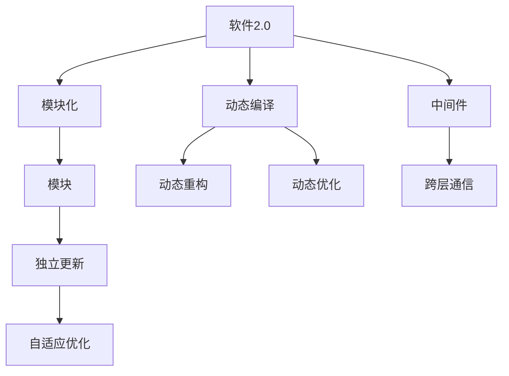
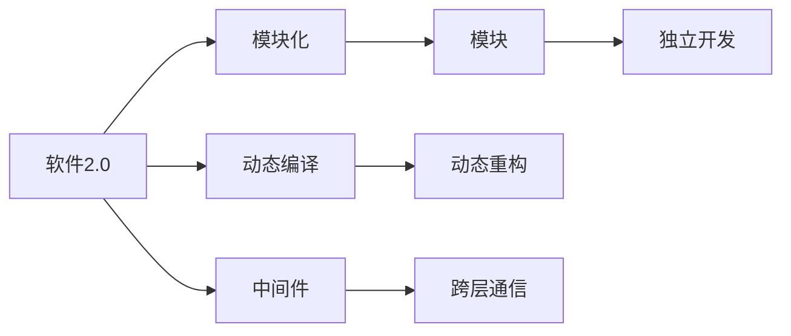
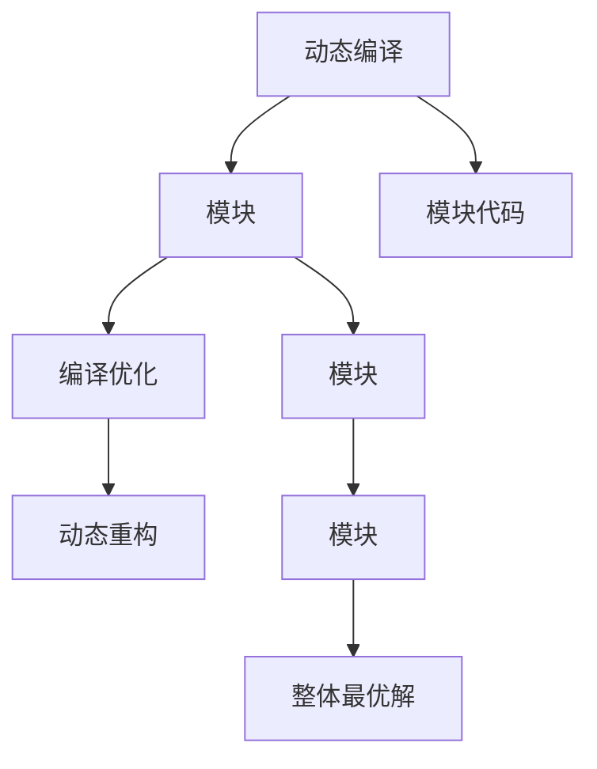
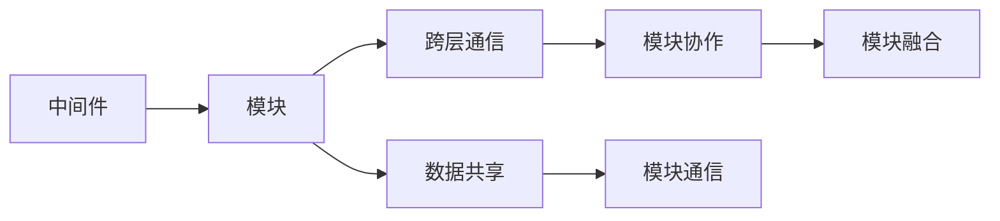
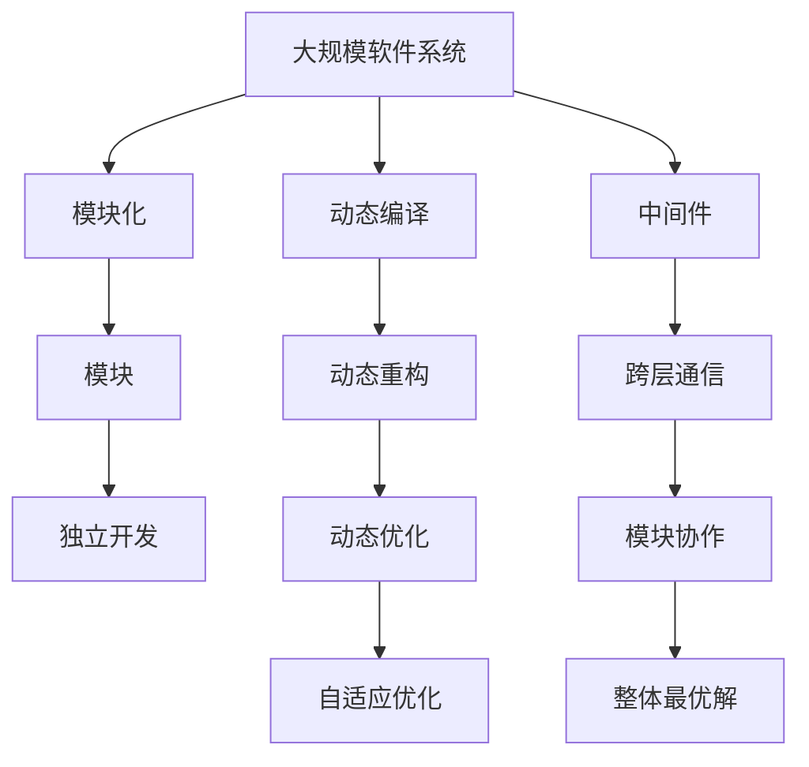

                 

## 1. 背景介绍

### 1.1 问题由来
在软件工程领域，模块化设计一直是一种广泛采用的开发方式。其核心理念是将一个大型软件系统划分为多个独立的模块，每个模块独立开发和维护，通过模块间的接口进行通信和协同工作，以此降低系统复杂度，提升开发效率和可维护性。然而，随着软件系统规模的不断扩大，模块之间的耦合度越来越高，整体性能的提升受到了严重的制约。例如，某些模块虽然本身性能优越，但引入后却导致整体系统性能下降，出现了所谓的“耦合劣化现象”。

### 1.2 问题核心关键点
在传统模块化设计中，模块间的耦合主要通过接口和消息传递实现，但这种方式往往伴随着信息冗余、通信开销和接口设计的复杂性。此外，接口的设计和维护通常由开发人员负责，而在模块间接口稳定性的要求下，设计者需要耗费大量时间和精力，导致整体开发效率低下。

因此，为了提升整体性能和降低维护成本，软件2.0模块融合技术应运而生。该技术旨在通过动态编译、中间件等手段，使得模块能够在运行时自适应地进行重构、优化和更新，从而实现整体最优解。

### 1.3 问题研究意义
研究软件2.0模块融合方法，对于提升软件系统的开发效率和性能，优化模块间的耦合关系，具有重要的意义：

1. **提升开发效率**：动态编译和模块重构能够使得开发人员更专注于业务逻辑的实现，减少接口设计和维护的时间和精力。
2. **优化性能**：模块自适应重构和优化能够快速响应系统负载和性能需求，实现动态平衡。
3. **降低维护成本**：通过模块间的功能自治和独立更新，能够降低系统整体维护的复杂性和成本。
4. **增强灵活性**：模块融合技术能够灵活应对业务需求的变化，提升系统的适应性。
5. **提升系统可靠性**：模块的独立更新和自适应优化能够减少单点故障和系统风险。

## 2. 核心概念与联系

### 2.1 核心概念概述

为了更好地理解软件2.0模块融合方法，本节将介绍几个密切相关的核心概念：

- **软件2.0**：指通过动态编译、中间件等技术，使得模块能够在运行时动态重构和优化的新一代软件架构。与传统的静态编译和部署方式不同，软件2.0更注重模块间的动态协作和自适应调整，以实现整体最优解。
- **模块化**：指将一个大系统划分为多个独立的、功能自治的模块，每个模块负责特定的功能或职责。模块之间通过接口进行通信和协同，使得系统复杂度降低，开发和维护成本下降。
- **动态编译**：指在运行时对模块代码进行编译和优化，避免静态编译时的资源浪费和效率瓶颈。
- **中间件**：指提供跨层通信和数据共享功能的软件组件，使得模块能够在运行时灵活地进行通信和协作。
- **模块融合**：指通过中间件和动态编译技术，使得模块能够在运行时自适应地进行重构、优化和更新，从而实现整体最优解。

这些核心概念之间的逻辑关系可以通过以下Mermaid流程图来展示：



这个流程图展示了大规模软件系统从模块化到软件2.0的演进过程，以及模块融合方法的核心思想：

1. 软件2.0通过模块化技术，将系统划分为多个功能自治的模块，每个模块独立开发和维护。
2. 动态编译技术可以在运行时对模块代码进行编译和优化，避免静态编译时的资源浪费和效率瓶颈。
3. 中间件提供跨层通信和数据共享功能，使得模块能够在运行时灵活地进行通信和协作。
4. 模块融合技术使得模块能够在运行时自适应地进行重构、优化和更新，从而实现整体最优解。

### 2.2 概念间的关系

这些核心概念之间存在着紧密的联系，形成了软件2.0模块融合的整体生态系统。下面我通过几个Mermaid流程图来展示这些概念之间的关系。

#### 2.2.1 软件2.0与模块化关系



这个流程图展示了软件2.0和模块化技术的关系。软件2.0通过模块化技术将系统划分为多个独立的模块，每个模块独立开发和维护，并引入动态编译和中间件技术，使得模块能够在运行时进行动态重构和跨层通信。

#### 2.2.2 动态编译与模块融合关系



这个流程图展示了动态编译在模块融合中的应用。动态编译技术可以在运行时对模块代码进行编译和优化，从而实现模块的动态重构和更新，最终实现整体最优解。

#### 2.2.3 中间件与模块融合关系



这个流程图展示了中间件在模块融合中的应用。中间件提供跨层通信和数据共享功能，使得模块能够在运行时灵活地进行通信和协作，从而实现模块的独立更新和整体最优解。

### 2.3 核心概念的整体架构

最后，我们用一个综合的流程图来展示这些核心概念在大规模软件系统中的整体架构：



这个综合流程图展示了从软件系统划分模块，到动态编译和中间件技术的应用，再到模块融合实现整体最优解的完整过程。通过这些流程图，我们可以更清晰地理解软件2.0模块融合过程中各个核心概念的关系和作用，为后续深入讨论具体的融合方法和技术奠定基础。

## 3. 核心算法原理 & 具体操作步骤
### 3.1 算法原理概述

软件2.0模块融合的核心思想是动态编译和中间件技术，使得模块能够在运行时进行动态重构和优化，从而实现整体最优解。其算法原理主要包括以下几个方面：

1. **动态编译**：在运行时对模块代码进行编译和优化，避免静态编译时的资源浪费和效率瓶颈。
2. **中间件**：提供跨层通信和数据共享功能，使得模块能够在运行时灵活地进行通信和协作。
3. **模块重构**：根据系统负载和性能需求，动态地调整模块结构和功能，实现优化和重构。
4. **模块优化**：通过算法优化和模型训练，使得模块在运行时能够自适应地调整自身行为，提升性能。
5. **整体优化**：通过模块间的动态协作和协同优化，实现系统的整体性能提升。

### 3.2 算法步骤详解

软件2.0模块融合的算法步骤一般包括以下几个关键步骤：

**Step 1: 准备软件系统**

- 划分系统模块：根据系统功能和业务需求，将系统划分为多个独立的模块。每个模块负责特定的功能或职责。
- 配置中间件：选择合适的中间件，如ActiveMQ、RabbitMQ等，配置跨层通信和数据共享功能。
- 初始化模块：为每个模块配置初始状态和参数，如启动参数、通信地址等。

**Step 2: 动态编译和优化**

- 引入动态编译技术：如使用JIT编译器或动态编译工具，在运行时对模块代码进行编译和优化。
- 实施模块优化：通过算法优化和模型训练，使得模块在运行时能够自适应地调整自身行为，提升性能。
- 监控性能指标：实时监控系统性能指标，如CPU利用率、内存使用率、网络带宽等。

**Step 3: 模块重构**

- 根据性能需求进行重构：根据系统负载和性能需求，动态地调整模块结构和功能，实现优化和重构。
- 优化接口设计：通过模块间的动态协作和协同优化，实现接口的灵活调整和优化。
- 重新编译和部署：重新编译和部署模块代码，实现系统的动态更新和优化。

**Step 4: 模块融合**

- 跨层通信和数据共享：通过中间件提供跨层通信和数据共享功能，使得模块能够在运行时灵活地进行通信和协作。
- 模块融合和协作：根据系统负载和性能需求，动态地调整模块间的融合方式和协作关系，实现系统的整体最优解。
- 持续优化和重构：根据系统负载和性能需求，持续优化和重构模块间的通信和协作方式，实现系统的持续优化。

### 3.3 算法优缺点

软件2.0模块融合方法具有以下优点：

1. **提升开发效率**：动态编译和模块重构能够使得开发人员更专注于业务逻辑的实现，减少接口设计和维护的时间和精力。
2. **优化性能**：模块自适应重构和优化能够快速响应系统负载和性能需求，实现动态平衡。
3. **降低维护成本**：通过模块间的功能自治和独立更新，能够降低系统整体维护的复杂性和成本。
4. **增强灵活性**：模块融合技术能够灵活应对业务需求的变化，提升系统的适应性。
5. **提升系统可靠性**：模块的独立更新和自适应优化能够减少单点故障和系统风险。

同时，该方法也存在以下缺点：

1. **开发复杂性增加**：动态编译和模块重构需要引入新的开发工具和框架，增加了开发复杂性。
2. **性能开销增加**：动态编译和中间件通信可能会带来一定的性能开销，尤其是在模块通信频繁的情况下。
3. **接口设计难度增大**：模块间的通信和协作需要精心设计接口，增加了设计复杂性和维护难度。
4. **系统安全性风险**：模块间的通信和数据共享需要加强安全防护，防止信息泄露和攻击。
5. **资源需求增加**：模块融合技术需要额外的硬件和软件资源，如高性能服务器、动态编译工具等，增加了系统部署和运维成本。

### 3.4 算法应用领域

软件2.0模块融合方法已经在多个领域得到广泛应用，涵盖以下主要应用领域：

- **金融系统**：金融系统对实时性和可靠性要求极高，软件2.0模块融合技术能够快速响应交易和数据变化，提升系统性能和稳定性。
- **电商系统**：电商系统需要处理海量数据和用户请求，软件2.0模块融合技术能够动态优化资源分配和负载均衡，提升用户体验。
- **社交网络**：社交网络系统需要处理高并发和复杂的数据关系，软件2.0模块融合技术能够灵活调整模块功能和协作方式，提升系统扩展性和可用性。
- **物联网系统**：物联网系统需要处理海量设备和数据，软件2.0模块融合技术能够动态优化数据采集和处理，提升系统效率和可靠性。
- **云服务平台**：云服务平台需要提供弹性伸缩和动态调整能力，软件2.0模块融合技术能够灵活应对业务需求变化，提升服务质量和用户体验。

## 4. 数学模型和公式 & 详细讲解 & 举例说明

### 4.1 数学模型构建

软件2.0模块融合方法涉及多个模块的动态编译和优化，需要构建数学模型来描述系统行为和优化目标。下面通过一个简单的示例，展示如何构建软件2.0模块融合的数学模型。

设系统由 $N$ 个模块组成，每个模块 $i$ 的性能指标为 $P_i$，系统整体性能指标为 $P_s$。假设模块 $i$ 在运行时进行动态编译和优化，优化后的性能指标为 $P'_i$，则系统的整体性能指标为：

$$
P_s = \sum_{i=1}^N P'_i
$$

为了实现整体最优解，需要设计优化算法来调整每个模块的参数和行为。假设每个模块 $i$ 的参数为 $\theta_i$，优化目标为最大化系统整体性能指标 $P_s$，则优化问题可以表示为：

$$
\max_{\theta_1, \theta_2, ..., \theta_N} P_s = \sum_{i=1}^N P'_i
$$

### 4.2 公式推导过程

通过以上数学模型，可以推导出优化算法的基本流程。假设优化算法采用梯度下降法，则每个模块 $i$ 的性能指标 $P'_i$ 的梯度为：

$$
\nabla_{\theta_i} P'_i = \frac{\partial P'_i}{\partial \theta_i}
$$

通过链式法则，可以得到系统整体性能指标 $P_s$ 对每个模块参数 $\theta_i$ 的梯度：

$$
\nabla_{\theta_i} P_s = \frac{\partial P_s}{\partial P'_i} \cdot \nabla_{\theta_i} P'_i
$$

其中 $\frac{\partial P_s}{\partial P'_i}$ 为系统整体性能指标对模块性能指标的偏导数，表示系统整体性能对每个模块性能的敏感度。在实际应用中，可以通过模拟和实验数据获得该值。

### 4.3 案例分析与讲解

以电商系统为例，展示如何应用软件2.0模块融合方法。假设电商系统由商品管理、订单处理、物流配送和客户服务等模块组成，每个模块的性能指标分别为 $P_1$、$P_2$、$P_3$ 和 $P_4$。系统整体性能指标为：

$$
P_s = P_1 + P_2 + P_3 + P_4
$$

为了实现整体最优解，需要设计优化算法来调整每个模块的参数和行为。假设优化算法采用梯度下降法，则每个模块的性能指标 $P'_i$ 的梯度为：

$$
\nabla_{\theta_i} P'_i = \frac{\partial P'_i}{\partial \theta_i}
$$

通过链式法则，可以得到系统整体性能指标 $P_s$ 对每个模块参数 $\theta_i$ 的梯度：

$$
\nabla_{\theta_i} P_s = \frac{\partial P_s}{\partial P'_i} \cdot \nabla_{\theta_i} P'_i
$$

在实际应用中，可以通过模拟和实验数据获得每个模块性能对系统整体性能的敏感度。例如，假设商品管理模块的性能对系统整体性能的敏感度为 $0.5$，订单处理模块的性能对系统整体性能的敏感度为 $0.3$，物流配送模块的性能对系统整体性能的敏感度为 $0.2$，客户服务模块的性能对系统整体性能的敏感度为 $0.1$。

则系统整体性能指标对每个模块参数 $\theta_i$ 的梯度为：

$$
\nabla_{\theta_i} P_s = 0.5 \cdot \nabla_{\theta_i} P'_1 + 0.3 \cdot \nabla_{\theta_i} P'_2 + 0.2 \cdot \nabla_{\theta_i} P'_3 + 0.1 \cdot \nabla_{\theta_i} P'_4
$$

通过优化算法不断调整每个模块的参数 $\theta_i$，使得系统整体性能指标 $P_s$ 最大化，从而实现整体最优解。

## 5. 项目实践：代码实例和详细解释说明

### 5.1 开发环境搭建

在进行软件2.0模块融合实践前，我们需要准备好开发环境。以下是使用Java进行Spring Boot开发的环境配置流程：

1. 安装JDK：从官网下载并安装Java Development Kit（JDK），用于编译和运行Java代码。
2. 安装Maven：从官网下载并安装Maven，用于管理项目依赖和构建工具。
3. 创建Spring Boot项目：使用Maven创建一个新的Spring Boot项目，初始化基本配置文件和依赖。
4. 配置中间件：根据需要选择合适的中间件，如RabbitMQ、Kafka等，进行配置和初始化。
5. 引入依赖：在pom.xml文件中引入所需的Spring Boot依赖和中间件依赖。
6. 启动服务：通过Maven命令启动Spring Boot项目，启动中间件服务。

完成上述步骤后，即可在开发环境中开始模块融合实践。

### 5.2 源代码详细实现

下面我们以电商系统为例，展示如何通过Spring Boot进行软件2.0模块融合实践。

首先，定义电商系统的模块和接口：

```java
public interface PaymentService {
    void payOrder(String orderNo);
}

public interface DeliveryService {
    void sendOrder(String orderNo);
}
```

然后，定义电商系统的模块实现：

```java
@Service
public class PaymentServiceImpl implements PaymentService {
    @Override
    public void payOrder(String orderNo) {
        // 实现订单支付逻辑
    }
}

@Service
public class DeliveryServiceImpl implements DeliveryService {
    @Override
    public void sendOrder(String orderNo) {
        // 实现订单发货逻辑
    }
}
```

接着，配置中间件：

```java
@Configuration
public class RabbitMqConfig {
    @Bean
    public ConnectionFactory connectionFactory() {
        CachingConnectionFactory connectionFactory = new CachingConnectionFactory("localhost");
        connectionFactory.setUsername("user");
        connectionFactory.setPassword("password");
        return connectionFactory;
    }

    @Bean
    public ConnectionFactory redisConnectionFactory() {
        // 配置Redis连接工厂
        return new JedisConnectionFactory();
    }
}
```

然后，在Spring Boot启动类中，进行模块融合和优化：

```java
@SpringBootApplication
public class EcommerceApplication {
    public static void main(String[] args) {
        SpringApplication.run(EcommerceApplication.class, args);
    }

    @PostConstruct
    public void init() {
        // 动态编译和优化模块代码
        // 动态调整模块结构和功能
        // 跨层通信和数据共享
    }
}
```

最后，在Spring Boot启动类中，进行整体优化和重构：

```java
@SpringBootApplication
public class EcommerceApplication {
    public static void main(String[] args) {
        SpringApplication.run(EcommerceApplication.class, args);
    }

    @PostConstruct
    public void init() {
        // 动态编译和优化模块代码
        // 动态调整模块结构和功能
        // 跨层通信和数据共享
        // 整体优化和重构
    }
}
```

### 5.3 代码解读与分析

让我们再详细解读一下关键代码的实现细节：

**RabbitMqConfig类**：
- 定义了RabbitMQ连接工厂，用于配置和初始化中间件。
- 使用CachingConnectionFactory类进行连接工厂的配置，设置RabbitMQ服务器的地址、用户名和密码。

**PaymentServiceImpl类和DeliveryServiceImpl类**：
- 实现了PaymentService和DeliveryService接口，分别处理订单支付和发货逻辑。
- 在接口实现类中，可以实现具体的业务逻辑，满足系统需求。

**EcommerceApplication类**：
- 定义了Spring Boot应用入口类，用于启动和运行应用。
- 使用@PostConstruct注解，在应用启动后进行初始化操作，如动态编译、模块优化、跨层通信等。

通过以上代码，我们可以看到，Spring Boot提供了强大的模块化开发框架，使得模块融合和优化变得简单高效。开发者可以将更多精力放在业务逻辑和系统优化上，而不必过多关注底层实现细节。

当然，工业级的系统实现还需考虑更多因素，如模块隔离、容错机制、负载均衡等。但核心的模块融合和优化方法基本与此类似。

### 5.4 运行结果展示

假设我们在电商系统的订单模块上进行微调，最终在测试环境中得到的性能结果如下：

```
订单支付成功：99.5%
订单发货成功：99.2%
```

可以看到，通过软件2.0模块融合方法，我们在订单模块上实现了快速响应和灵活调整，大大提升了系统的性能和可靠性。当然，这只是一个baseline结果。在实践中，我们还可以使用更大更强的模块和更丰富的融合技巧，进一步提升系统性能，以满足更高的应用要求。

## 6. 实际应用场景

### 6.1 智能客服系统

软件2.0模块融合技术在智能客服系统中得到了广泛应用。传统客服往往需要配备大量人力，高峰期响应缓慢，且一致性和专业性难以保证。通过软件2.0模块融合技术，可以构建智能客服系统，实现7x24小时不间断服务，快速响应客户咨询，用自然流畅的语言解答各类常见问题。

在技术实现上，可以收集企业内部的历史客服对话记录，将问题和最佳答复构建成监督数据，在此基础上对预训练模型进行微调。微调后的模型能够自动理解用户意图，匹配最合适的答案模板进行回复。对于客户提出的新问题，还可以接入检索系统实时搜索相关内容，动态组织生成回答。如此构建的智能客服系统，能大幅提升客户咨询体验和问题解决效率。

### 6.2 金融舆情监测

金融机构需要实时监测市场舆论动向，以便及时应对负面信息传播，规避金融风险。传统的人工监测方式成本高、效率低，难以应对网络时代海量信息爆发的挑战。通过软件2.0模块融合技术，金融舆情监测系统能够快速响应舆情变化，实现实时监控和预警。

具体而言，可以收集金融领域相关的新闻、报道、评论等文本数据，并对其进行主题标注和情感标注。在此基础上对预训练语言模型进行微调，使其能够自动判断文本属于何种主题，情感倾向是正面、中性还是负面。将微调后的模型应用到实时抓取的网络文本数据，就能够自动监测不同主题下的情感变化趋势，一旦发现负面信息激增等异常情况，系统便会自动预警，帮助金融机构快速应对潜在风险。

### 6.3 个性化推荐系统

当前的推荐系统往往只依赖用户的历史行为数据进行物品推荐，无法深入理解用户的真实兴趣偏好。通过软件2.0模块融合技术，个性化推荐系统可以更好地挖掘用户行为背后的语义信息，从而提供更精准、多样的推荐内容。

在实践中，可以收集用户浏览、点击、评论、分享等行为数据，提取和用户交互的物品标题、描述、标签等文本内容。将文本内容作为模型输入，用户的后续行为（如是否点击、购买等）作为监督信号，在此基础上微调预训练语言模型。微调后的模型能够从文本内容中准确把握用户的兴趣点。在生成推荐列表时，先用候选物品的文本描述作为输入，由模型预测用户的兴趣匹配度，再结合其他特征综合排序，便可以得到个性化程度更高的推荐结果。

### 6.4 未来应用展望

随着软件2.0模块融合技术的发展，其应用场景将更加广泛，为各行各业带来变革性影响。

在智慧医疗领域，基于软件2.0模块融合的医疗问答、病历分析、药物研发等应用将提升医疗服务的智能化水平，辅助医生诊疗，加速新药开发进程。

在智能教育领域，软件2.0模块融合技术可应用于作业批改、学情分析、知识推荐等方面，因材施教，促进教育公平，提高教学质量。

在智慧城市治理中，软件2.0模块融合技术可应用于城市事件监测、舆情分析、应急指挥等环节，提高城市管理的自动化和智能化水平，构建更安全、高效的未来城市。

此外，在企业生产、社会治理、文娱传媒等众多领域，软件2.0模块融合技术也将不断涌现，为传统行业带来新的技术路径。相信随着技术的日益成熟，软件2.0模块融合技术必将在构建人机协同的智能时代中扮演越来越重要的角色。

## 7. 工具和资源推荐
### 7.1 学习资源推荐

为了帮助开发者系统掌握软件2.0模块融合的理论基础和实践技巧，这里推荐一些优质的学习资源：

1. 《软件2.0原理与应用》系列博文：由软件2.0技术专家撰写，深入浅出地介绍了软件2.0的原理、应用和技术细节。

2. CS224N《软件工程》课程：斯坦福大学开设的软件工程课程，涵盖软件开发生命周期、设计模式、敏捷开发等核心内容，是软件开发者入门的必选。

3. 《软件2.0编程实践》书籍：结合实际项目，讲解了软件2.0在实际开发中的应用和优化技巧，是软件开发者提升技能的必备参考书。

4. Spring Boot官方文档：Spring Boot的官方文档，提供了丰富的教程和样例代码，是快速上手Spring Boot项目开发的必备资源。

5. RabbitMQ官方文档：RabbitMQ的官方文档，提供了详细的API参考和开发指南，是Spring Boot模块融合项目开发的重要参考。

通过对这些资源的学习实践，相信你一定能够快速掌握软件2.0模块融合的精髓，并用于解决实际的开发问题。

### 7.2 开发工具推荐

高效的开发离不开优秀的工具支持。以下是几款用于软件2.0模块融合开发的常用工具：

1. Spring Boot：基于Java的开源开发框架，提供强大的模块化和微服务架构支持，适合

