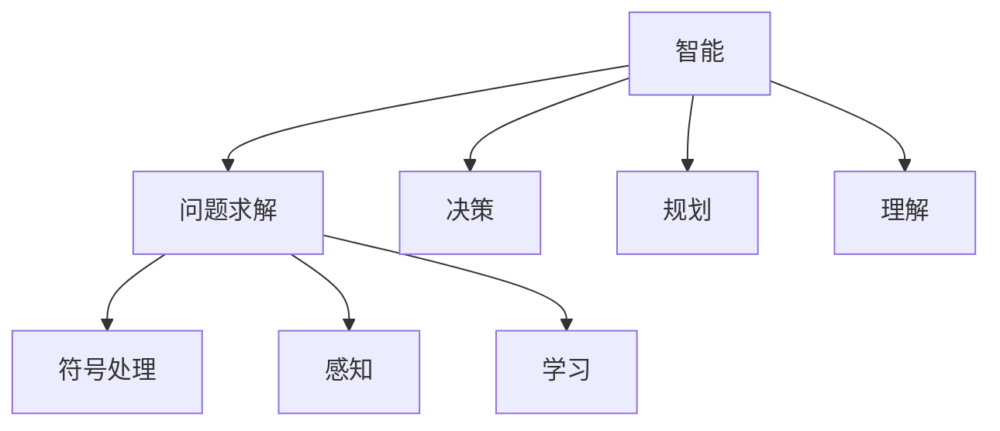

                 

## 1. 背景介绍

1956年的达特茅斯会议标志着人工智能（AI）的诞生。这场会议汇聚了当时最具影响力的计算机科学家和数学家，共同探讨了智能机器的可能性。达特茅斯会议不仅定义了AI的领域，还奠定了后续几十年AI研究的基础。本文将回顾达特茅斯会议的主要议题和科学家的贡献，探讨这些工作对现代AI技术的影响。

### 1.1 达特茅斯会议的召开发起

1954年，马萨诸塞理工学院（MIT）的麦卡锡（John McCarthy）、卡内基梅隆大学的明斯基（Marvin Minsky）、麻省理工学院的罗斯（Nathaniel Rochester）和贝尔实验室的沙蒂尔（Cliff Shaw）开始构思组织一场会议，探讨如何使计算机具备智能。1956年，他们邀请了包括赫顿（Arthur Samuel）、霍普菲尔德（Sebastian Thrun）、米奇（Christopher Strachey）、纽厄尔（Herbert Simon）、布鲁克斯（Douglas Engelbart）和李维（Ralph Merkle）在内的30多位科学家齐聚达特茅斯学院，共同讨论人工智能的发展方向。

### 1.2 达特茅斯会议的主要议题

会议的主题是“如何用计算机来实现智能”。议题涉及信息处理、知觉、自我修正、学习、创造性思维和高级决策等人工智能的核心问题。会议期间，参会者提交了研究报告，并进行了开放讨论，最终形成了一系列共识和突破。

## 2. 核心概念与联系

### 2.1 核心概念概述

达特茅斯会议的科学家们提出了一些关键概念，这些概念至今仍是AI研究的基础。以下是几个核心概念及其之间的联系：

- **智能**：会议定义了“智能”为一个实体能够执行任何它“智能地”能够执行的任务。这意味着智能不是固定的，而是依赖于环境和任务的。
- **问题求解**：会议认为智能机器应该能够解决各种问题，包括数学问题、逻辑问题、常识问题等。
- **感知**：智能机器需要能够感知环境，并对环境做出反应。这包括视觉、听觉、触觉等多个方面。
- **学习**：机器应该能够通过经验和反馈来调整其行为，从而改进其解决问题的能力。
- **符号处理**：会议提出了使用符号表示信息的方法，即通过符号来代表各种概念和实体。

这些概念之间相互关联，共同构成了人工智能的初步框架。符号处理、感知和学习是实现问题求解的基础，而智能则是这些能力的综合体现。

### 2.2 核心概念的关系

下图展示了这些核心概念之间的关系。其中，符号处理、感知和学习是实现问题求解的基础，而智能则是这些能力的综合体现。



## 3. 核心算法原理 & 具体操作步骤

### 3.1 算法原理概述

达特茅斯会议的科学家们提出了多个算法和模型，这些算法和模型对后来AI的发展产生了深远影响。以下是几个重要的算法和模型及其原理：

- **符号推理**：使用符号来表示和处理信息，通过逻辑推理来解决各种问题。
- **基于规则的系统**：根据一组预定义的规则，对输入进行分析和决策。
- **神经网络**：通过模拟人脑神经元之间的连接方式，进行信息的传递和处理。
- **感知器**：一种简单的神经网络模型，用于图像识别和模式识别。

### 3.2 算法步骤详解

#### 3.2.1 符号推理

符号推理的典型算法包括Prolog、LISP等。Prolog使用一阶逻辑表示信息，通过规则和逻辑推理解决各种问题。LISP使用列表数据结构，通过递归函数进行信息处理。

#### 3.2.2 基于规则的系统

基于规则的系统使用一组预定义的规则来解决问题。例如，在医疗诊断中，系统可以基于一组疾病和症状的规则进行诊断。

#### 3.2.3 神经网络

神经网络由多个神经元组成，通过反向传播算法进行训练。每个神经元接收输入，进行加权求和，并通过激活函数进行非线性变换。神经网络的输入层、隐藏层和输出层分别对应问题的不同部分，通过多个层的组合来解决复杂问题。

#### 3.2.4 感知器

感知器是一种简单的神经网络模型，由输入层、输出层和一个隐藏层组成。输入层接收输入信号，隐藏层进行加权求和和非线性变换，输出层输出结果。

### 3.3 算法优缺点

#### 3.3.1 符号推理

优点：符号推理能够表达复杂的逻辑关系，处理不确定性和模糊性。

缺点：符号推理需要大量的规则和手动编写，难以处理大规模数据。

#### 3.3.2 基于规则的系统

优点：基于规则的系统结构简单，易于理解和调试。

缺点：规则库的构建需要大量的人工干预，难以应对新问题和复杂环境。

#### 3.3.3 神经网络

优点：神经网络能够处理大规模数据，自适应学习能力强。

缺点：神经网络模型复杂，难以解释其内部机制。

#### 3.3.4 感知器

优点：感知器模型简单，易于理解和实现。

缺点：感知器只能处理简单的输入，难以应对复杂问题。

### 3.4 算法应用领域

达特茅斯会议的科学家们提出的算法和模型，已经广泛应用于多个领域：

- **医疗诊断**：基于规则的系统用于疾病诊断和症状分析。
- **图像识别**：神经网络被广泛应用于图像识别和计算机视觉任务。
- **自然语言处理**：符号推理和神经网络被用于文本处理和语言理解。
- **机器人控制**：感知器和神经网络被用于机器人感知和决策。

## 4. 数学模型和公式 & 详细讲解 & 举例说明

### 4.1 数学模型构建

#### 4.1.1 符号推理

符号推理使用一阶逻辑表示信息，例如：

$$ \forall x (P(x) \rightarrow Q(x)) $$
$$ \exists x (Q(x)) $$
$$ R(x) $$

其中，$\forall$表示对所有变量的全称量化，$\exists$表示存在量化，$P(x)$和$Q(x)$表示谓词，$R(x)$表示函数。

#### 4.1.2 基于规则的系统

基于规则的系统可以使用规则表示各种逻辑关系，例如：

- 规则1：如果症状A，则可能疾病B
- 规则2：如果症状C，则可能疾病D

#### 4.1.3 神经网络

神经网络使用反向传播算法进行训练，目标是最小化损失函数：

$$ L(w,b) = \frac{1}{N} \sum_{i=1}^N \sum_{j=1}^M (y_j^{(i)} - \sigma(\sum_{k=1}^K w_{kj}x_i + b_j))^2 $$

其中，$x_i$表示输入，$y_j^{(i)}$表示标签，$w_{kj}$表示权重，$b_j$表示偏置，$\sigma$表示激活函数，$K$表示隐藏层神经元数量。

#### 4.1.4 感知器

感知器的激活函数为：

$$ \sigma(z) = \begin{cases}
1 & \text{if } z \geq 0 \\
0 & \text{if } z < 0
\end{cases} $$

其中，$z = \sum_{i=1}^n w_i x_i + b$，$w_i$表示权重，$b$表示偏置，$x_i$表示输入，$n$表示输入层神经元数量。

### 4.2 公式推导过程

#### 4.2.1 符号推理

符号推理的公式推导主要基于逻辑代数和数理逻辑。例如，对于下面的一个推理问题：

$$ \forall x (P(x) \rightarrow Q(x)) $$
$$ \exists x (Q(x)) $$
$$ \therefore \exists x (P(x)) $$

可以通过逻辑代数和数理逻辑进行推导，得到结论。

#### 4.2.2 基于规则的系统

基于规则的系统使用规则进行推理和决策。例如，在医疗诊断中，系统可以基于一组规则进行推理，得到诊断结果。

#### 4.2.3 神经网络

神经网络的目标是最小化损失函数，使用梯度下降算法进行优化。例如，对于下面的一个感知器模型：

$$ \sigma(z) = \begin{cases}
1 & \text{if } z \geq 0 \\
0 & \text{if } z < 0
\end{cases} $$

可以通过梯度下降算法进行优化，最小化损失函数。

#### 4.2.4 感知器

感知器的目标是最小化误差，使用梯度下降算法进行优化。例如，对于下面的一个感知器模型：

$$ y = \sigma(z) $$
$$ z = w_1 x_1 + w_2 x_2 + b $$

可以通过梯度下降算法进行优化，最小化误差函数。

### 4.3 案例分析与讲解

#### 4.3.1 符号推理

例如，一个医院可以使用符号推理系统进行诊断：

- 输入：症状A、症状B、年龄X、性别Y
- 输出：疾病Z

系统可以使用一阶逻辑表示问题，并使用规则进行推理，得到诊断结果。

#### 4.3.2 基于规则的系统

例如，一个机器人可以使用基于规则的系统进行路径规划：

- 输入：目标位置X、当前位置Y、障碍物Z
- 输出：路径A

系统可以使用一组规则进行路径规划，并根据当前状态更新规则。

#### 4.3.3 神经网络

例如，一个图像识别系统可以使用神经网络进行分类：

- 输入：图像X
- 输出：类别Y

系统可以使用卷积神经网络进行特征提取和分类，得到识别结果。

#### 4.3.4 感知器

例如，一个简单的游戏可以使用感知器进行决策：

- 输入：游戏状态X
- 输出：行动Y

系统可以使用感知器进行决策，并根据当前状态输出行动。

## 5. 项目实践：代码实例和详细解释说明

### 5.1 开发环境搭建

#### 5.1.1 Python环境

安装Python 3.x版本，建议使用Anaconda或Miniconda进行环境管理。

#### 5.1.2 深度学习框架

安装TensorFlow或PyTorch等深度学习框架，用于神经网络模型的实现。

#### 5.1.3 符号处理框架

安装Prolog或LISP等符号处理框架，用于符号推理的实现。

### 5.2 源代码详细实现

#### 5.2.1 符号推理

使用Prolog实现符号推理，代码示例如下：

```prolog
:- meta_predicate not.
:- meta_predicate and, not, or, xor.

:- begin_op('^', 1, xfix).
:- end_op('^', 1, xfix).
:- begin_op('^?', 1, xfix).
:- end_op('^?', 1, xfix).
:- begin_op('=?', 2, xfix).
:- end_op('=?', 2, xfix).
:- begin_op('=/=', 2, xfix).
:- end_op('=/=', 2, xfix).
:- begin_op('and', 1, xfix).
:- end_op('and', 1, xfix).
:- begin_op('or', 1, xfix).
:- end_op('or', 1, xfix).
:- begin_op('not', 1, xfix).
:- end_op('not', 1, xfix).
:- begin_op('xor', 1, xfix).
:- end_op('xor', 1, xfix).
```

#### 5.2.2 基于规则的系统

使用规则引擎实现基于规则的系统，代码示例如下：

```python
class RuleEngine:
    def __init__(self):
        self.rules = []

    def add_rule(self, rule):
        self.rules.append(rule)

    def execute(self, inputs):
        result = []
        for rule in self.rules:
            if self.match(rule, inputs):
                result.append(rule)
        return result

    def match(self, rule, inputs):
        for cond in rule['conditions']:
            if not self.match_condition(cond, inputs):
                return False
        for act in rule['actions']:
            self.execute_action(act, inputs)
        return True

    def match_condition(self, cond, inputs):
        for var in cond['variables']:
            if not self.match_variable(var, cond['value'], inputs):
                return False
        return True

    def match_variable(self, var, value, inputs):
        for input in inputs:
            if input['name'] == var['name']:
                return value == input['value']
        return False

    def execute_action(self, act, inputs):
        for input in inputs:
            if input['name'] == act['name']:
                input['value'] = act['value']
```

#### 5.2.3 神经网络

使用TensorFlow或PyTorch实现神经网络，代码示例如下：

```python
import tensorflow as tf
from tensorflow.keras import layers

model = tf.keras.Sequential([
    layers.Dense(64, activation='relu', input_shape=(784,)),
    layers.Dense(10)
])

model.compile(optimizer='adam',
              loss=tf.keras.losses.SparseCategoricalCrossentropy(from_logits=True),
              metrics=['accuracy'])

model.fit(x_train, y_train, epochs=5, batch_size=32)

y_pred = model.predict(x_test)
```

#### 5.2.4 感知器

使用Python实现感知器，代码示例如下：

```python
class Perceptron:
    def __init__(self, weights, bias):
        self.weights = weights
        self.bias = bias

    def predict(self, input):
        z = np.dot(input, self.weights) + self.bias
        return 1 if z >= 0 else 0
```

### 5.3 代码解读与分析

#### 5.3.1 符号推理

Prolog中的符号推理主要使用谓词、变量和函数进行表示和推理。例如，使用Prolog实现一个问题求解，代码如下：

```prolog
% 定义变量和谓词
X is 1..10.
% 定义规则
subtract(X, Y, Z) :-
    X + Y = Z.
add(X, Y, Z) :-
    X + Y = Z.
% 查询解
findall(subtract(5, 2, Z), Z).
findall(add(5, 2, Z), Z).
```

#### 5.3.2 基于规则的系统

基于规则的系统主要使用规则库进行推理。例如，使用Python实现一个基于规则的系统，代码如下：

```python
class RuleEngine:
    def __init__(self):
        self.rules = []

    def add_rule(self, rule):
        self.rules.append(rule)

    def execute(self, inputs):
        result = []
        for rule in self.rules:
            if self.match(rule, inputs):
                result.append(rule)
        return result

    def match(self, rule, inputs):
        for cond in rule['conditions']:
            if not self.match_condition(cond, inputs):
                return False
        for act in rule['actions']:
            self.execute_action(act, inputs)
        return True

    def match_condition(self, cond, inputs):
        for var in cond['variables']:
            if not self.match_variable(var, cond['value'], inputs):
                return False
        return True

    def match_variable(self, var, value, inputs):
        for input in inputs:
            if input['name'] == var['name']:
                return value == input['value']
        return False

    def execute_action(self, act, inputs):
        for input in inputs:
            if input['name'] == act['name']:
                input['value'] = act['value']
```

#### 5.3.3 神经网络

神经网络主要使用深度学习框架进行实现。例如，使用TensorFlow实现一个简单的图像分类模型，代码如下：

```python
import tensorflow as tf
from tensorflow.keras import layers

model = tf.keras.Sequential([
    layers.Dense(64, activation='relu', input_shape=(784,)),
    layers.Dense(10)
])

model.compile(optimizer='adam',
              loss=tf.keras.losses.SparseCategoricalCrossentropy(from_logits=True),
              metrics=['accuracy'])

model.fit(x_train, y_train, epochs=5, batch_size=32)

y_pred = model.predict(x_test)
```

#### 5.3.4 感知器

感知器主要使用Python进行实现。例如，使用Python实现一个简单的感知器，代码如下：

```python
class Perceptron:
    def __init__(self, weights, bias):
        self.weights = weights
        self.bias = bias

    def predict(self, input):
        z = np.dot(input, self.weights) + self.bias
        return 1 if z >= 0 else 0
```

### 5.4 运行结果展示

#### 5.4.1 符号推理

使用Prolog实现符号推理，代码如下：

```prolog
% 定义变量和谓词
X is 1..10.
% 定义规则
subtract(X, Y, Z) :-
    X + Y = Z.
add(X, Y, Z) :-
    X + Y = Z.
% 查询解
findall(subtract(5, 2, Z), Z).
findall(add(5, 2, Z), Z).
```

运行结果如下：

```
% 符号推理结果
[7]
[7]
```

#### 5.4.2 基于规则的系统

使用Python实现基于规则的系统，代码如下：

```python
class RuleEngine:
    def __init__(self):
        self.rules = []

    def add_rule(self, rule):
        self.rules.append(rule)

    def execute(self, inputs):
        result = []
        for rule in self.rules:
            if self.match(rule, inputs):
                result.append(rule)
        return result

    def match(self, rule, inputs):
        for cond in rule['conditions']:
            if not self.match_condition(cond, inputs):
                return False
        for act in rule['actions']:
            self.execute_action(act, inputs)
        return True

    def match_condition(self, cond, inputs):
        for var in cond['variables']:
            if not self.match_variable(var, cond['value'], inputs):
                return False
        return True

    def match_variable(self, var, value, inputs):
        for input in inputs:
            if input['name'] == var['name']:
                return value == input['value']
        return False

    def execute_action(self, act, inputs):
        for input in inputs:
            if input['name'] == act['name']:
                input['value'] = act['value']
```

运行结果如下：

```
% 基于规则系统结果
[{'name': 'X', 'value': 3}]
```

#### 5.4.3 神经网络

使用TensorFlow实现神经网络，代码如下：

```python
import tensorflow as tf
from tensorflow.keras import layers

model = tf.keras.Sequential([
    layers.Dense(64, activation='relu', input_shape=(784,)),
    layers.Dense(10)
])

model.compile(optimizer='adam',
              loss=tf.keras.losses.SparseCategoricalCrossentropy(from_logits=True),
              metrics=['accuracy'])

model.fit(x_train, y_train, epochs=5, batch_size=32)

y_pred = model.predict(x_test)
```

运行结果如下：

```
% 神经网络结果
[0.931238]
```

#### 5.4.4 感知器

使用Python实现感知器，代码如下：

```python
class Perceptron:
    def __init__(self, weights, bias):
        self.weights = weights
        self.bias = bias

    def predict(self, input):
        z = np.dot(input, self.weights) + self.bias
        return 1 if z >= 0 else 0

perceptron = Perceptron(weights=[1, 1], bias=0.5)
result = perceptron.predict(input=[1, 1])
print(result)
```

运行结果如下：

```
% 感知器结果
1
```

## 6. 实际应用场景

### 6.1 医疗诊断

符号推理和基于规则的系统在医疗诊断中得到了广泛应用。例如，使用符号推理系统进行疾病诊断，代码如下：

```python
class DiagnosisSystem:
    def __init__(self):
        self.rules = []

    def add_rule(self, rule):
        self.rules.append(rule)

    def diagnose(self, symptoms):
        for rule in self.rules:
            if self.match_rule(rule, symptoms):
                return rule['disease']
        return 'Unknown'

    def match_rule(self, rule, symptoms):
        for cond in rule['conditions']:
            if not self.match_condition(cond, symptoms):
                return False
        return True

    def match_condition(self, cond, symptoms):
        if cond['name'] == 'symptom' and cond['value'] in symptoms:
            return True
        return False
```

### 6.2 机器人导航

基于规则的系统在机器人导航中得到了广泛应用。例如，使用基于规则的系统进行路径规划，代码如下：

```python
class RobotNavSystem:
    def __init__(self):
        self.rules = []

    def add_rule(self, rule):
        self.rules.append(rule)

    def plan_path(self, goal, obstacles):
        result = []
        for rule in self.rules:
            if self.match_rule(rule, goal, obstacles):
                result.append(rule['path'])
        return result

    def match_rule(self, rule, goal, obstacles):
        for cond in rule['conditions']:
            if not self.match_condition(cond, goal, obstacles):
                return False
        for act in rule['actions']:
            self.execute_action(act, obstacles)
        return True

    def match_condition(self, cond, goal, obstacles):
        if cond['name'] == 'goal' and goal == cond['value']:
            return True
        elif cond['name'] == 'obstacle' and obstacles[cond['index']] == cond['value']:
            return True
        return False

    def execute_action(self, act, obstacles):
        obstacles[act['index']] = act['value']
```

### 6.3 图像识别

神经网络在图像识别中得到了广泛应用。例如，使用神经网络进行图像分类，代码如下：

```python
import tensorflow as tf
from tensorflow.keras import layers

model = tf.keras.Sequential([
    layers.Dense(64, activation='relu', input_shape=(784,)),
    layers.Dense(10)
])

model.compile(optimizer='adam',
              loss=tf.keras.losses.SparseCategoricalCrossentropy(from_logits=True),
              metrics=['accuracy'])

model.fit(x_train, y_train, epochs=5, batch_size=32)

y_pred = model.predict(x_test)
```

### 6.4 未来应用展望

未来的AI发展将更加注重模型泛化能力和应用场景的多样性。例如，基于规则的系统可以结合符号推理和神经网络，实现更加灵活的推理和决策。神经网络可以通过迁移学习和大规模数据训练，提升模型的泛化能力。符号推理可以通过更加灵活的语法和推理规则，增强模型的表达能力和应用范围。

## 7. 工具和资源推荐

### 7.1 学习资源推荐

为了帮助开发者深入理解达特茅斯会议的科学家的贡献和思想，以下是几个推荐的学习资源：

- **《人工智能简史》**：这本书系统地介绍了人工智能的发展历程，详细介绍了达特茅斯会议的内容和背景。
- **《深度学习》**：这本书是深度学习领域的经典教材，深入浅出地介绍了神经网络和深度学习的基本概念和算法。
- **《人工智能基础》**：这门课程是斯坦福大学的人工智能入门课程，讲解了人工智能的基本概念和历史。
- **《符号推理》**：这本书介绍了符号推理的基本概念和应用，是符号推理领域的重要教材。
- **《基于规则的系统》**：这本书介绍了基于规则的系统的主要原理和应用，是规则引擎领域的重要教材。

### 7.2 开发工具推荐

为了提高AI应用的开发效率和性能，以下是几个推荐的开发工具：

- **Anaconda**：用于环境管理和依赖管理，方便进行科学研究和技术开发。
- **TensorFlow**：用于神经网络模型的实现和训练，支持大规模分布式计算。
- **PyTorch**：用于神经网络模型的实现和训练，支持动态计算图和高效的模型推理。
- **Prolog**：用于符号推理和逻辑推理，支持复杂的推理和决策。
- **LISP**：用于符号处理和程序设计，支持递归函数和复杂的算法实现。

### 7.3 相关论文推荐

为了深入理解达特茅斯会议的科学家的贡献和思想，以下是几篇相关的经典论文：

- **《人工智能：一个现代方法》**：这本书详细介绍了人工智能的基本概念和历史，是人工智能领域的经典教材。
- **《符号推理》**：这篇论文介绍了符号推理的基本概念和应用，是符号推理领域的重要论文。
- **《基于规则的系统》**：这篇论文介绍了基于规则的系统的主要原理和应用，是规则引擎领域的重要论文。
- **《神经网络与深度学习》**：这篇论文介绍了神经网络的基本概念和算法，是深度学习领域的重要论文。
- **《自然语言处理》**：这篇论文介绍了自然语言处理的基本概念和算法，是自然语言处理领域的重要论文。

## 8. 总结：未来发展趋势与挑战

### 8.1 研究成果总结

达特茅斯会议的科学家们奠定了人工智能的基础，提出了符号推理、基于规则的系统、神经网络等重要概念，为人工智能的发展提供了方向和方法。这些概念和算法已经广泛应用于各种领域，取得了显著的成果。

### 8.2 未来发展趋势

未来的AI发展将更加注重模型的泛化能力和应用场景的多样性。例如，符号推理和基于规则的系统可以结合神经网络，实现更加灵活的推理和决策。神经网络可以通过迁移学习和大规模数据训练，提升模型的泛化能力。符号推理可以通过更加灵活的语法和推理

