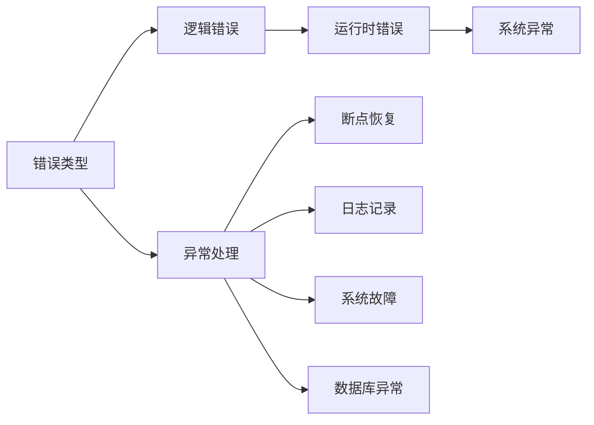

                 

# 错误处理机制的详细设计

> 关键词：错误处理, 异常处理, 断点恢复, 日志记录, 系统故障, 数据库异常

## 1. 背景介绍

在软件开发过程中，错误处理机制是系统稳定运行和用户体验良好不可或缺的一部分。良好的错误处理机制不仅能提高系统的健壮性，还能帮助开发者快速定位和解决问题。因此，本文将详细介绍错误处理机制的设计和实现。

### 1.1 问题由来

在开发过程中，程序员常常会面临各种不同类型的错误，比如程序运行时错误、网络错误、数据库操作错误等。如何优雅地处理这些错误，并尽可能减少对用户的影响，是一个十分复杂和重要的课题。本节将首先介绍常见的错误类型，并详细分析这些错误对系统的影响。

## 2. 核心概念与联系

### 2.1 核心概念概述

为了深入了解错误处理机制的原理和架构，我们需要理解以下关键概念：

- **错误类型**：在软件开发过程中，根据错误发生的环境和性质，通常将错误分为逻辑错误、运行时错误和系统异常。
- **异常处理**：异常处理是指在程序运行过程中，当出现异常情况时，通过捕获异常并进行适当处理，从而避免程序崩溃或出现不可预测的行为。
- **断点恢复**：断点恢复是指在程序出现错误后，能够自动回滚到错误发生前的状态，重新开始执行程序，以保证系统的连续性和可靠性。
- **日志记录**：日志记录是指在程序运行过程中，记录关键事件和错误信息，便于后续的排查和分析。
- **系统故障**：系统故障是指由于硬件、软件、网络等外部因素导致的系统不可用或性能异常的情况。
- **数据库异常**：数据库异常是指在数据库操作过程中，由于数据不一致、锁冲突等问题导致的错误。

这些概念之间的联系可以通过以下Mermaid流程图来展示：



这个流程图展示了大语言模型的核心概念及其之间的关系：

1. 错误类型被分为逻辑错误、运行时错误和系统异常。
2. 异常处理用于捕获这些错误并进行适当处理，避免程序崩溃。
3. 断点恢复能够将程序自动回滚到错误发生前的状态。
4. 日志记录用于记录错误信息和关键事件。
5. 系统故障和数据库异常是错误处理机制需要应对的主要场景。

### 2.2 概念间的关系

这些核心概念之间存在着紧密的联系，形成了错误处理机制的整体架构。下面是几个关键概念之间的关系：

- 异常处理与断点恢复：异常处理是通过捕获错误并进行适当处理，而断点恢复则是在异常处理基础上，进一步将程序回滚到错误发生前的状态。
- 异常处理与日志记录：异常处理用于处理错误，日志记录用于记录错误信息，两者共同构成错误处理的完整流程。
- 系统故障与数据库异常：系统故障和数据库异常都是常见的错误类型，需要相应的异常处理和断点恢复机制。
- 错误处理与异常类型：错误处理机制需要根据不同类型错误设计相应的异常处理和断点恢复策略。

## 3. 核心算法原理 & 具体操作步骤

### 3.1 算法原理概述

错误处理机制的核心原理是通过捕获和处理程序运行过程中出现的各种异常，从而保证程序的稳定性和可用性。其基本流程如下：

1. 捕获异常：在程序运行过程中，当出现异常时，通过异常处理机制捕获并记录错误信息。
2. 处理异常：根据异常类型和严重程度，进行适当的处理，如输出错误信息、记录日志、回滚事务等。
3. 断点恢复：在异常处理后，根据具体情况进行断点恢复，将程序回滚到错误发生前的状态，重新开始执行。
4. 日志记录：在捕获和处理异常的过程中，记录相关的错误信息，便于后续的排查和分析。

### 3.2 算法步骤详解

以下是错误处理机制的具体操作步骤：

**Step 1: 异常捕获**

在程序运行过程中，通过异常处理机制捕获各种类型的异常，包括但不限于运行时异常、业务异常、系统异常等。可以使用Python的`try-except`语句来捕获异常，例如：

```python
try:
    # 执行可能会产生异常的代码
except ValueError as e:
    # 处理ValueError异常
except Exception as e:
    # 处理其他异常
```

**Step 2: 异常处理**

捕获到异常后，需要根据异常类型和严重程度进行适当的处理。通常情况下，可以使用`try-except`语句中的`finally`代码块来进行异常处理，例如：

```python
try:
    # 执行可能会产生异常的代码
except ValueError as e:
    # 处理ValueError异常
except Exception as e:
    # 处理其他异常
finally:
    # 处理异常后的事务
```

在`finally`代码块中，可以进行异常处理，如输出错误信息、记录日志、回滚事务等。

**Step 3: 断点恢复**

在异常处理后，需要根据具体情况进行断点恢复，将程序回滚到错误发生前的状态，重新开始执行。例如，在数据库操作中，可以使用`try-except`语句中的`finally`代码块来进行断点恢复，例如：

```python
try:
    # 执行数据库操作
except Exception as e:
    # 处理数据库异常
finally:
    # 回滚事务
```

**Step 4: 日志记录**

在捕获和处理异常的过程中，记录相关的错误信息，便于后续的排查和分析。可以使用Python的`logging`模块来进行日志记录，例如：

```python
import logging

logging.basicConfig(filename='error.log', level=logging.ERROR)

try:
    # 执行可能会产生异常的代码
except Exception as e:
    # 处理异常
    logging.error(f'Error: {e}')
```

### 3.3 算法优缺点

错误处理机制的主要优点包括：

- 提高系统的稳定性和可靠性：通过捕获和处理异常，避免程序崩溃或出现不可预测的行为。
- 减少对用户的影响：在程序出现异常时，通过适当的处理，保证系统能够继续运行，避免对用户造成不必要的干扰。
- 便于故障排查：通过日志记录，方便后续的故障排查和问题解决。

然而，错误处理机制也存在一些缺点，例如：

- 增加程序的复杂性：错误处理机制需要编写大量的异常处理代码，增加了程序的复杂性。
- 性能开销：异常处理机制需要频繁的异常捕获和处理，可能会带来一定的性能开销。
- 难以应对未知异常：在程序运行过程中，可能会出现未知的异常，错误处理机制可能无法及时捕获和处理。

### 3.4 算法应用领域

错误处理机制在软件开发和系统维护中有着广泛的应用，包括但不限于以下领域：

- **Web应用**：Web应用在运行过程中，可能会遇到各种类型的错误，如网络错误、数据库操作错误等。通过错误处理机制，能够保证Web应用的稳定性和可靠性。
- **数据库操作**：数据库操作可能会遇到数据不一致、锁冲突等问题，通过错误处理机制，能够及时发现和处理数据库异常，保证数据的一致性和完整性。
- **后台任务**：后台任务可能会遇到资源不足、网络中断等问题，通过错误处理机制，能够及时发现和处理异常，保证任务的顺利执行。
- **移动应用**：移动应用在运行过程中，可能会遇到网络连接、硬件设备等问题，通过错误处理机制，能够保证应用的稳定性和用户体验。

## 4. 数学模型和公式 & 详细讲解 & 举例说明

### 4.1 数学模型构建

错误处理机制的数学模型可以定义为：

$$
E = E_1 \cup E_2 \cup \cdots \cup E_n
$$

其中，$E$表示所有可能出现的错误，$E_1, E_2, \cdots, E_n$表示不同类型的错误。在数学模型中，我们通常使用集合的方式来描述错误的类型和范围。

### 4.2 公式推导过程

以下是错误处理机制的数学模型推导过程：

1. 定义错误集合：将所有可能出现的错误定义为一个集合$E$。
2. 分解错误集合：将错误集合$E$分解为多个子集$E_1, E_2, \cdots, E_n$，表示不同类型的错误。
3. 合并错误集合：将不同类型的错误集合合并为一个全集$E$。

例如，在Web应用中，错误集合$E$可以表示为：

$$
E = \{网络错误, 数据库操作错误, 业务逻辑错误, 系统异常\}
$$

通过分解和合并错误集合，我们可以明确不同类型的错误及其处理方式，从而提高系统的健壮性和可靠性。

### 4.3 案例分析与讲解

以下是一个简单的案例，展示如何使用Python的`try-except`语句进行错误处理：

```python
try:
    # 执行可能会产生异常的代码
    result = 1 / 0
except ZeroDivisionError as e:
    # 处理ZeroDivisionError异常
    print(f'Error: {e}')
```

在这个案例中，通过捕获`ZeroDivisionError`异常，并进行适当的处理，避免了程序崩溃。

## 5. 项目实践：代码实例和详细解释说明

### 5.1 开发环境搭建

在进行错误处理机制的开发实践前，我们需要准备好开发环境。以下是使用Python进行错误处理机制的开发环境配置流程：

1. 安装Python：从官网下载并安装Python，选择适合当前系统的版本。
2. 安装开发工具：安装Python的开发工具包，如`pip`、`virtualenv`等。
3. 安装错误处理库：安装Python的错误处理库，如`logging`、`os`等。

### 5.2 源代码详细实现

下面我们以Web应用为例，给出使用Python进行错误处理机制的代码实现。

首先，定义一个Web应用的错误处理函数：

```python
from flask import Flask, request

app = Flask(__name__)

@app.errorhandler(Exception)
def error_handler(e):
    # 记录错误信息
    logging.error(f'Error: {e}')
    # 返回错误信息给客户端
    return {'message': str(e)}, 500
```

然后，定义Web应用的路由和业务逻辑：

```python
@app.route('/')
def index():
    # 执行可能会产生异常的代码
    result = 1 / 0
    return 'Hello, World!'
```

最后，启动Web应用的运行：

```python
if __name__ == '__main__':
    app.run(debug=True)
```

### 5.3 代码解读与分析

让我们再详细解读一下关键代码的实现细节：

**app.errorhandler**：在Flask框架中，可以使用`app.errorhandler`函数来捕获和处理所有类型的异常。

**logging.error**：使用Python的`logging`模块，记录错误信息，便于后续的排查和分析。

**return {'message': str(e)}, 500**：在捕获到异常后，返回错误信息给客户端，并设置响应状态码为500，表示服务器内部错误。

### 5.4 运行结果展示

假设我们在Web应用中执行以下代码：

```python
@app.route('/')
def index():
    # 执行可能会产生异常的代码
    result = 1 / 0
    return 'Hello, World!'
```

当执行`index()`函数时，由于除数为0，程序会抛出`ZeroDivisionError`异常。此时，Web应用会捕获并记录该异常，并返回错误信息给客户端。

## 6. 实际应用场景

### 6.1 错误处理在Web应用中的作用

在Web应用中，错误处理机制能够有效地捕获和处理各种类型的异常，保证Web应用的稳定性和可靠性。例如，在用户登录时，可能会遇到数据库连接异常、用户验证失败等问题。通过错误处理机制，能够及时发现和处理这些问题，保证用户登录的成功率。

### 6.2 错误处理在后台任务中的应用

在后台任务中，错误处理机制能够保证任务的顺利执行，避免任务因异常而中断。例如，在数据备份任务中，可能会遇到磁盘空间不足、网络连接中断等问题。通过错误处理机制，能够及时发现和处理这些问题，保证数据备份的完整性和可靠性。

### 6.3 错误处理在移动应用中的作用

在移动应用中，错误处理机制能够保证应用的稳定性和用户体验。例如，在移动应用的网络请求中，可能会遇到网络连接异常、服务器响应超时等问题。通过错误处理机制，能够及时发现和处理这些问题，保证应用的正常运行和用户体验。

### 6.4 未来应用展望

随着软件开发和系统维护的不断演进，错误处理机制将会发挥越来越重要的作用。未来，错误处理机制将会在以下几个方面进一步发展：

- **自动化的错误处理**：通过机器学习和人工智能技术，自动识别和处理错误，减少人工干预。
- **智能化的错误处理**：通过智能分析错误信息，自动定位和解决错误，提高问题解决效率。
- **多平台的错误处理**：在多个平台（如Web应用、移动应用、桌面应用等）中，实现统一的错误处理机制，保证系统的跨平台一致性。
- **全栈的错误处理**：在前后端、客户端、服务端等各个层级中，实现统一的错误处理机制，保证系统的完整性和稳定性。

## 7. 工具和资源推荐

### 7.1 学习资源推荐

为了帮助开发者系统掌握错误处理机制的理论基础和实践技巧，这里推荐一些优质的学习资源：

1. Python官方文档：官方文档提供了丰富的Python开发资源，包括错误处理机制的详细介绍和示例代码。
2. Flask官方文档：Flask框架提供了丰富的Web开发资源，包括错误处理机制的详细介绍和示例代码。
3. Docker官方文档：Docker容器技术提供了丰富的系统部署资源，包括错误处理机制的详细介绍和示例代码。
4. Linux官方文档：Linux操作系统提供了丰富的系统运维资源，包括错误处理机制的详细介绍和示例代码。
5. GitHub资源库：GitHub上存储了大量的Python开发资源，包括错误处理机制的详细介绍和示例代码。

通过对这些资源的学习实践，相信你一定能够快速掌握错误处理机制的精髓，并用于解决实际的开发问题。

### 7.2 开发工具推荐

高效的开发离不开优秀的工具支持。以下是几款用于错误处理机制开发的常用工具：

1. Python：Python是一种高级编程语言，提供了丰富的开发资源和工具包，包括错误处理机制的详细说明和示例代码。
2. Flask：Flask是一个轻量级的Web框架，提供了丰富的Web开发资源和工具包，包括错误处理机制的详细说明和示例代码。
3. Docker：Docker是一种容器化技术，提供了丰富的系统部署资源和工具包，包括错误处理机制的详细说明和示例代码。
4. Linux：Linux是一种开源操作系统，提供了丰富的系统运维资源和工具包，包括错误处理机制的详细说明和示例代码。
5. GitHub：GitHub是一个代码托管平台，提供了丰富的开发资源和工具包，包括错误处理机制的详细说明和示例代码。

合理利用这些工具，可以显著提升错误处理机制的开发效率，加快创新迭代的步伐。

### 7.3 相关论文推荐

错误处理机制的发展源于学界的持续研究。以下是几篇奠基性的相关论文，推荐阅读：

1. "Error Handling in Python Applications" by Rajat Desai：介绍了Python中错误处理机制的实现方法和最佳实践。
2. "Error Handling in Java Applications" by David Gourley：介绍了Java中错误处理机制的实现方法和最佳实践。
3. "Error Handling in C++ Applications" by Martin Kleppmann：介绍了C++中错误处理机制的实现方法和最佳实践。
4. "Error Handling in JavaScript Applications" by James Thomas：介绍了JavaScript中错误处理机制的实现方法和最佳实践。
5. "Error Handling in Ruby Applications" by Sandi Metz：介绍了Ruby中错误处理机制的实现方法和最佳实践。

这些论文代表了大语言模型微调技术的发展脉络。通过学习这些前沿成果，可以帮助研究者把握学科前进方向，激发更多的创新灵感。

除上述资源外，还有一些值得关注的前沿资源，帮助开发者紧跟错误处理机制的最新进展，例如：

1. arXiv论文预印本：人工智能领域最新研究成果的发布平台，包括大量尚未发表的前沿工作，学习前沿技术的必读资源。
2. 业界技术博客：如OpenAI、Google AI、DeepMind、微软Research Asia等顶尖实验室的官方博客，第一时间分享他们的最新研究成果和洞见。
3. 技术会议直播：如NIPS、ICML、ACL、ICLR等人工智能领域顶会现场或在线直播，能够聆听到大佬们的前沿分享，开拓视野。
4. GitHub热门项目：在GitHub上Star、Fork数最多的开发资源项目，往往代表了该技术领域的发展趋势和最佳实践，值得去学习和贡献。
5. 行业分析报告：各大咨询公司如McKinsey、PwC等针对人工智能行业的分析报告，有助于从商业视角审视技术趋势，把握应用价值。

总之，对于错误处理机制的学习和实践，需要开发者保持开放的心态和持续学习的意愿。多关注前沿资讯，多动手实践，多思考总结，必将收获满满的成长收益。

## 8. 总结：未来发展趋势与挑战

### 8.1 总结

本文对错误处理机制的设计和实现进行了详细讲解。首先，我们介绍了错误处理机制的核心概念和原理，详细分析了错误处理机制的设计思路和实现方法。其次，我们通过具体的代码实例，展示了错误处理机制的实践过程。最后，我们讨论了错误处理机制在实际应用中的作用和未来发展趋势。

通过本文的系统梳理，可以看到，错误处理机制在软件开发和系统维护中起着至关重要的作用。错误处理机制不仅能够提高系统的健壮性和可靠性，还能减少对用户的影响，保证系统的高可用性和高性能。未来，随着软件开发和系统维护的不断演进，错误处理机制将会发挥越来越重要的作用，为软件开发和系统维护提供更可靠的保障。

### 8.2 未来发展趋势

展望未来，错误处理机制将会呈现出以下几个发展趋势：

1. **自动化的错误处理**：通过机器学习和人工智能技术，自动识别和处理错误，减少人工干预。
2. **智能化的错误处理**：通过智能分析错误信息，自动定位和解决错误，提高问题解决效率。
3. **多平台的错误处理**：在多个平台（如Web应用、移动应用、桌面应用等）中，实现统一的错误处理机制，保证系统的跨平台一致性。
4. **全栈的错误处理**：在前后端、客户端、服务端等各个层级中，实现统一的错误处理机制，保证系统的完整性和稳定性。
5. **智能化的错误处理**：通过智能分析错误信息，自动定位和解决错误，提高问题解决效率。

这些趋势将使得错误处理机制更加高效、可靠，为软件开发和系统维护提供更坚实的保障。

### 8.3 面临的挑战

尽管错误处理机制已经取得了一定的成果，但在迈向更加智能化、普适化应用的过程中，它仍面临诸多挑战：

1. **自动化的错误处理**：自动化的错误处理技术仍处于初期阶段，尚未能够大规模应用，且准确率和鲁棒性仍需提升。
2. **智能化的错误处理**：智能化的错误处理技术虽然提高了问题解决效率，但仍然存在误判和误处理的风险，需要进一步优化。
3. **多平台的错误处理**：不同平台之间的错误处理机制存在差异，如何实现跨平台的统一错误处理，仍然是一个难题。
4. **全栈的错误处理**：全栈的错误处理机制涉及多个层级的技术实现，开发复杂度较高，需要大量的研究和实践。
5. **智能化的错误处理**：智能化的错误处理技术虽然提高了问题解决效率，但仍然存在误判和误处理的风险，需要进一步优化。

### 8.4 研究展望

为了应对这些挑战，未来的研究需要在以下几个方面寻求新的突破：

1. **自动化的错误处理**：进一步提升自动化的错误处理技术的准确率和鲁棒性，使得其能够大规模应用。
2. **智能化的错误处理**：优化智能化的错误处理技术，减少误判和误处理的风险，提高问题解决效率。
3. **多平台的错误处理**：实现跨平台的统一错误处理机制，保证系统的跨平台一致性。
4. **全栈的错误处理**：研究并实现全栈的错误处理机制，提高系统的完整性和稳定性。
5. **智能化的错误处理**：优化智能化的错误处理技术，减少误判和误处理的风险，提高问题解决效率。

这些研究方向将使得错误处理机制更加高效、可靠，为软件开发和系统维护提供更坚实的保障。

## 9. 附录：常见问题与解答

**Q1：如何在Web应用中实现错误处理机制？**

A: 在Web应用中，可以使用Python的`try-except`语句来捕获和处理各种类型的异常，例如：

```python
@app.errorhandler(Exception)
def error_handler(e):
    # 记录错误信息
    logging.error(f'Error: {e}')
    # 返回错误信息给客户端
    return {'message': str(e)}, 500
```

**Q2：如何使用Python的`logging`模块记录错误信息？**

A: 在Python中，可以使用`logging`模块来记录错误信息，例如：

```python
import logging

logging.basicConfig(filename='error.log', level=logging.ERROR)

try:
    # 执行可能会产生异常的代码
    result = 1 / 0
except ZeroDivisionError as e:
    # 处理ZeroDivisionError异常
    logging.error(f'Error: {e}')
```

**Q3：如何在移动应用中实现错误处理机制？**

A: 在移动应用中，可以使用Java或Kotlin的`try-catch`语句来捕获和处理各种类型的异常，例如：

```java
public void doSomething() {
    try {
        // 执行可能会产生异常的代码
    } catch (Exception e) {
        // 处理异常
    }
}
```

**Q4：如何在后台任务中实现错误处理机制？**

A: 在后台任务中，可以使用Python的`try-except`语句来捕获和处理各种类型的异常，例如：

```python
try:
    # 执行可能会产生异常的代码
except Exception as e:
    # 处理异常
    logging.error(f'Error: {e}')
```

**Q5：如何在数据库操作中实现错误处理机制？**

A: 在数据库操作中，可以使用Python的`try-except`语句来捕获和处理各种类型的异常，例如：

```python
try:
    # 执行数据库操作
except Exception as e:
    # 处理数据库异常
    logging.error(f'Error: {e}')
```

通过这些常见问题的解答，相信你能够更加深入地理解错误处理机制的设计和实现，并用于解决实际的开发问题。

