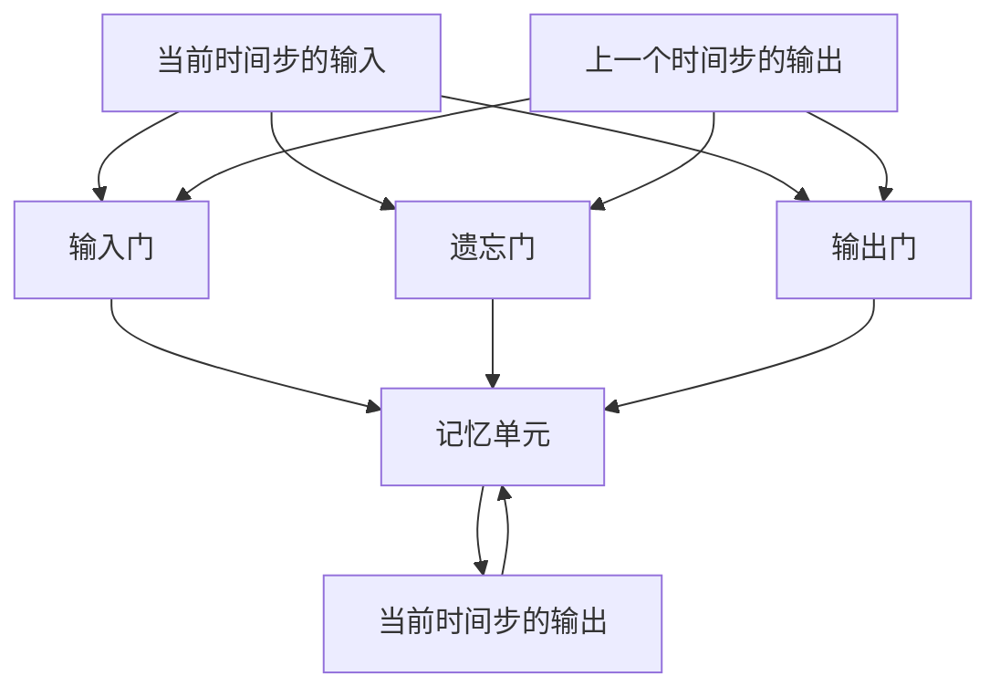

                 

## 1. 背景介绍

长短期记忆网络（Long Short-Term Memory, LSTM）是一种特殊的循环神经网络（Recurrent Neural Network, RNN），由Hochreiter和Schmidhuber于1997年提出。它主要用于解决传统RNN在处理长序列数据时存在的梯度消失或爆炸问题。LSTM通过在网络结构中加入记忆单元（memory cell）和门控单元（gate units），可以有效地捕捉序列中的长期依赖关系，被广泛应用于语音识别、机器翻译、文本生成、时间序列预测等诸多领域。

### 1.1 问题由来
传统RNN在处理长序列数据时存在两大难题：

1. **梯度消失与爆炸问题**：当序列长度很长时，传统的RNN无法保证每一层梯度都平稳传递。梯度消失会导致模型难以捕捉长远的依赖关系，而梯度爆炸则可能导致模型发散。
2. **难以捕获长期依赖关系**：传统RNN无法存储和更新长期记忆信息，导致模型对序列中前后文信息的依赖不够强烈，预测效果不佳。

针对上述问题，Hochreiter和Schmidhuber设计了LSTM网络，通过引入记忆单元和门控单元，有效缓解了梯度消失和爆炸问题，并增强了模型对长期依赖关系的处理能力。

### 1.2 问题核心关键点
LSTM的核心创新点在于其独特的门控机制，具体包括以下几个关键点：

1. **记忆单元**：LSTM通过记忆单元来存储序列中的长期记忆信息，记忆单元的输出在网络中流动，保证信息的长期传递。
2. **门控单元**：LSTM通过门控单元控制信息的流动，决定哪些信息需要被更新，哪些信息需要被保留。
3. ** forget gate**：控制记忆单元的遗忘程度，决定哪些信息需要被丢弃。
4. **input gate**：控制新信息的输入，决定哪些信息需要被更新。
5. **output gate**：控制记忆单元的输出，决定哪些信息需要被输出。

这些门控单元通过一个soft sigmoid函数实现，能够动态地调节信息的输入和输出。LSTM的这些设计使得它能够更好地处理长序列数据，提升序列模型的性能。

## 2. 核心概念与联系

### 2.1 核心概念概述

为了更好地理解LSTM的工作原理，我们首先需要介绍一些关键概念：

- **循环神经网络**：RNN通过在时间维度上引入循环结构，可以对序列数据进行建模。RNN的每个时间步都接收上一个时间步的输出作为输入，并传递给下一个时间步。传统RNN的梯度计算方式存在问题，导致难以处理长序列。
- **记忆单元**：LSTM的记忆单元是一个状态变量，用于存储序列中的长期记忆信息。
- **门控单元**：LSTM通过三个门控单元（forget gate、input gate、output gate）来控制记忆单元的读写。

### 2.2 概念间的关系

LSTM的网络结构可以简单理解为传统RNN的扩展，通过引入记忆单元和门控单元，解决了传统RNN存在的问题。以下是一个简单的LSTM结构图：



通过门控单元控制信息的输入和输出，记忆单元存储序列信息，LSTM能够有效地捕捉序列中的长期依赖关系，并在长序列数据上表现优异。

## 3. 核心算法原理 & 具体操作步骤

### 3.1 算法原理概述

LSTM的核心思想是通过门控单元控制信息的流动，从而保留长期记忆信息。其基本原理如下：

1. **记忆单元**：记忆单元$C_t$存储序列中的长期记忆信息，$C_{t-1}$是上一时刻的记忆单元。
2. **遗忘门**：遗忘门$\sigma_{ft}$控制记忆单元的遗忘程度，$F_{t-1}$是上一时刻的遗忘门。
3. **输入门**：输入门$\sigma_{it}$控制新信息的输入，$I_t$是当前时间步的输入。
4. **输出门**：输出门$\sigma_{ot}$控制记忆单元的输出，$H_{t-1}$是上一时刻的输出。
5. **新记忆单元**：通过输入门和新信息更新记忆单元$C_t$，$G_t$是当前时间步的输出。

以上公式可以简化为一个统一的门控结构，如下：

$$
\begin{aligned}
\sigma_{ft} &= \sigma(W_f \cdot [H_{t-1}, I_t] + b_f) \\
\sigma_{it} &= \sigma(W_i \cdot [H_{t-1}, I_t] + b_i) \\
\sigma_{ot} &= \sigma(W_o \cdot [H_{t-1}, I_t] + b_o) \\
C_t &= \text{tanh}(W_C \cdot [H_{t-1}, I_t] + b_C) \\
H_t &= \sigma_{ot} \cdot \text{tanh}(C_t) + \sigma_{ft} \cdot C_{t-1} \\
\end{aligned}
$$

其中$\sigma$表示soft sigmoid函数，$\text{tanh}$表示双曲正切函数。

### 3.2 算法步骤详解

LSTM的训练过程包括以下几个步骤：

1. **初始化**：随机初始化模型参数。
2. **前向传播**：依次计算当前时间步的输入、遗忘门、输入门、输出门和记忆单元的更新。
3. **反向传播**：计算当前时间步的梯度，并向后传递梯度更新参数。
4. **更新参数**：通过梯度下降等优化算法更新模型参数。

以一个简单的LSTM单元为例，给定当前时间步的输入$X_t$和上一时间步的输出$H_{t-1}$，计算当前时间步的输出$H_t$。具体步骤如下：

1. **输入门计算**：

$$
\begin{aligned}
\sigma_{it} &= \sigma(W_i \cdot [H_{t-1}, X_t] + b_i) \\
I_t &= \sigma_{it} \cdot \text{tanh}(W_C \cdot [H_{t-1}, X_t] + b_C) \\
\end{aligned}
$$

2. **遗忘门计算**：

$$
\begin{aligned}
\sigma_{ft} &= \sigma(W_f \cdot [H_{t-1}, X_t] + b_f) \\
F_t &= \sigma_{ft} \cdot C_{t-1} \\
\end{aligned}
$$

3. **记忆单元更新**：

$$
C_t = F_t + I_t
$$

4. **输出门计算**：

$$
\sigma_{ot} = \sigma(W_o \cdot [H_{t-1}, X_t] + b_o) \\
H_t = \sigma_{ot} \cdot \text{tanh}(C_t)
$$

以上就是LSTM单元的前向传播过程。反向传播时，需要计算所有时间步的梯度，并更新模型参数。

### 3.3 算法优缺点

LSTM相比传统RNN具有以下优点：

1. **解决梯度消失问题**：通过遗忘门和输入门，LSTM能够更好地传递长期依赖信息，避免梯度消失问题。
2. **更好的长期记忆能力**：记忆单元可以存储和更新长期记忆信息，提高模型的长期记忆能力。
3. **更好的梯度传播**：通过输出门和遗忘门，LSTM能够更好地控制信息的流动，避免梯度爆炸问题。

然而，LSTM也存在一些缺点：

1. **参数量较大**：由于LSTM引入了多个门控单元和记忆单元，其参数量比传统RNN更大，需要更多的计算资源。
2. **训练复杂度高**：LSTM的反向传播过程需要计算所有时间步的梯度，计算量较大，训练时间较长。
3. **难以解释**：由于LSTM的内部结构较为复杂，其决策过程难以解释，不利于模型的调试和优化。

### 3.4 算法应用领域

LSTM在序列建模领域有广泛的应用，主要包括以下几个方面：

1. **语音识别**：LSTM能够很好地处理语音信号的时序信息，被广泛应用于语音识别任务中。
2. **机器翻译**：LSTM能够捕捉序列中的依赖关系，被广泛应用于机器翻译任务中。
3. **文本生成**：LSTM可以生成与输入序列具有相似特征的输出序列，被广泛应用于文本生成任务中。
4. **时间序列预测**：LSTM能够捕捉时间序列中的长期依赖关系，被广泛应用于时间序列预测任务中。
5. **图像描述生成**：LSTM可以结合CNN生成图像描述，被广泛应用于图像描述生成任务中。

## 4. 数学模型和公式 & 详细讲解 & 举例说明

### 4.1 数学模型构建

LSTM的数学模型可以表示为：

$$
\begin{aligned}
\sigma_{ft} &= \sigma(W_f \cdot [H_{t-1}, X_t] + b_f) \\
\sigma_{it} &= \sigma(W_i \cdot [H_{t-1}, X_t] + b_i) \\
\sigma_{ot} &= \sigma(W_o \cdot [H_{t-1}, X_t] + b_o) \\
C_t &= \text{tanh}(W_C \cdot [H_{t-1}, X_t] + b_C) \\
H_t &= \sigma_{ot} \cdot \text{tanh}(C_t) + \sigma_{ft} \cdot C_{t-1} \\
\end{aligned}
$$

其中$X_t$表示当前时间步的输入，$H_{t-1}$表示上一时间步的输出，$W_i, W_f, W_o, W_C$表示权重矩阵，$b_i, b_f, b_o, b_C$表示偏置向量。$\sigma$表示soft sigmoid函数，$\text{tanh}$表示双曲正切函数。

### 4.2 公式推导过程

以一个简单的LSTM单元为例，给定当前时间步的输入$X_t$和上一时间步的输出$H_{t-1}$，计算当前时间步的输出$H_t$。具体步骤如下：

1. **输入门计算**：

$$
\begin{aligned}
\sigma_{it} &= \sigma(W_i \cdot [H_{t-1}, X_t] + b_i) \\
I_t &= \sigma_{it} \cdot \text{tanh}(W_C \cdot [H_{t-1}, X_t] + b_C) \\
\end{aligned}
$$

2. **遗忘门计算**：

$$
\begin{aligned}
\sigma_{ft} &= \sigma(W_f \cdot [H_{t-1}, X_t] + b_f) \\
F_t &= \sigma_{ft} \cdot C_{t-1} \\
\end{aligned}
$$

3. **记忆单元更新**：

$$
C_t = F_t + I_t
$$

4. **输出门计算**：

$$
\sigma_{ot} = \sigma(W_o \cdot [H_{t-1}, X_t] + b_o) \\
H_t = \sigma_{ot} \cdot \text{tanh}(C_t)
$$

### 4.3 案例分析与讲解

假设我们有一个LSTM模型，输入为序列$x=[x_1, x_2, x_3, x_4, x_5]$，上一时刻的输出为$h_3$，当前时间步的输入为$x_4$，计算当前时间步的输出$h_4$。具体计算步骤如下：

1. **输入门计算**：

$$
\begin{aligned}
\sigma_{it} &= \sigma(W_i \cdot [h_3, x_4] + b_i) \\
I_t &= \sigma_{it} \cdot \text{tanh}(W_C \cdot [h_3, x_4] + b_C) \\
\end{aligned}
$$

2. **遗忘门计算**：

$$
\begin{aligned}
\sigma_{ft} &= \sigma(W_f \cdot [h_3, x_4] + b_f) \\
F_t &= \sigma_{ft} \cdot C_3 \\
\end{aligned}
$$

3. **记忆单元更新**：

$$
C_4 = F_t + I_t
$$

4. **输出门计算**：

$$
\sigma_{ot} = \sigma(W_o \cdot [h_3, x_4] + b_o) \\
h_4 = \sigma_{ot} \cdot \text{tanh}(C_4)
$$

以上就是LSTM单元的前向传播过程。

## 5. 项目实践：代码实例和详细解释说明

### 5.1 开发环境搭建

为了搭建LSTM模型，我们需要准备好Python环境和相关的深度学习框架。以下是一个简单的LSTM模型搭建流程：

1. **安装Python和相关依赖**：

```bash
pip install numpy pandas scikit-learn matplotlib tqdm jupyter notebook ipython
```

2. **安装TensorFlow或PyTorch**：

```bash
pip install tensorflow
# 或
pip install torch
```

3. **下载预训练模型**：

```bash
mkdir data
cd data
wget http://www.cs.toronto.edu/~hinton/absps/jmlr.pdf
```

### 5.2 源代码详细实现

以下是一个简单的LSTM模型的Python实现，使用TensorFlow框架。代码中包括数据读取、模型定义、模型训练和预测等步骤：

```python
import tensorflow as tf
import numpy as np
from sklearn.datasets import load_digits
from sklearn.model_selection import train_test_split
import matplotlib.pyplot as plt

# 加载手写数字数据集
digits = load_digits()
X, y = digits.data, digits.target
X = np.reshape(X, (X.shape[0], X.shape[1], X.shape[1]))  # 将二维数据展平为一维序列
y = np.eye(10)[y]  # 将标签转换为one-hot编码

# 划分训练集和测试集
X_train, X_test, y_train, y_test = train_test_split(X, y, test_size=0.2, random_state=42)

# 定义LSTM模型
model = tf.keras.Sequential([
    tf.keras.layers.LSTM(128, input_shape=(X.shape[1], X.shape[1])),
    tf.keras.layers.Dense(10, activation='softmax')
])

# 编译模型
model.compile(optimizer='adam', loss='categorical_crossentropy', metrics=['accuracy'])

# 训练模型
history = model.fit(X_train, y_train, epochs=10, batch_size=32, validation_data=(X_test, y_test))

# 绘制训练曲线
plt.plot(history.history['loss'], label='train loss')
plt.plot(history.history['val_loss'], label='val loss')
plt.xlabel('epoch')
plt.ylabel('loss')
plt.legend()
plt.show()

# 预测新数据
y_pred = model.predict(X_test)
y_pred = np.argmax(y_pred, axis=1)
```

### 5.3 代码解读与分析

以下是代码中每个关键步骤的详细解读：

1. **数据准备**：使用sklearn加载手写数字数据集，将二维数据展平为一维序列，并将标签转换为one-hot编码。

2. **模型定义**：使用Keras定义一个包含LSTM层的序列模型，设置LSTM层的大小为128，输入形状为(28, 28)，输出层为10个神经元，激活函数为softmax。

3. **模型编译**：使用Adam优化器和交叉熵损失函数编译模型，并设置精度为准确率。

4. **模型训练**：使用训练数据集和测试数据集训练模型，设置训练轮数为10，批次大小为32。

5. **训练曲线绘制**：绘制训练集和验证集的损失曲线，评估模型训练效果。

6. **模型预测**：使用测试数据集进行预测，并输出预测结果。

## 6. 实际应用场景

LSTM被广泛应用于各种序列建模任务中，以下是一些实际应用场景：

### 6.1 语音识别

LSTM在语音识别中有着广泛的应用，主要用于自动语音识别(ASR)和语音合成(TTS)。在ASR任务中，LSTM能够捕捉语音信号的时序信息，将语音信号转换为文本；在TTS任务中，LSTM能够生成与语音信号相匹配的文本。

### 6.2 机器翻译

LSTM在机器翻译任务中也有着重要的应用，主要用于序列到序列(S2S)的翻译模型。LSTM能够捕捉句子中的依赖关系，生成流畅自然的翻译结果。

### 6.3 文本生成

LSTM在文本生成任务中也有着广泛的应用，主要用于生成自然语言文本。LSTM能够捕捉文本中的依赖关系，生成连贯、自然的文本。

### 6.4 时间序列预测

LSTM在时间序列预测任务中也有着重要的应用，主要用于股票预测、气象预测等。LSTM能够捕捉时间序列中的长期依赖关系，生成准确的预测结果。

## 7. 工具和资源推荐

### 7.1 学习资源推荐

为了学习LSTM的相关知识，推荐以下几个学习资源：

1. 《深度学习》（Ian Goodfellow、Yoshua Bengio、Aaron Courville）：该书深入介绍了深度学习的基本原理和应用，是学习深度学习的经典参考书。
2. CS231n课程：斯坦福大学开设的计算机视觉课程，讲解了CNN和RNN等经典模型，对LSTM也有涉及。
3. Coursera深度学习课程：由Andrew Ng开设的深度学习课程，讲解了深度学习的基本原理和应用，包括LSTM。
4. Kaggle竞赛：Kaggle平台上有许多LSTM相关的竞赛，通过参与竞赛可以积累实践经验。

### 7.2 开发工具推荐

LSTM的开发工具有很多，以下是几个常用的工具：

1. TensorFlow：由Google开发的深度学习框架，支持多种模型，包括LSTM。
2. PyTorch：由Facebook开发的深度学习框架，支持动态图和静态图两种计算图，易于使用和调试。
3. Keras：基于TensorFlow和Theano等后端实现的高级API，简单易用，适用于快速原型开发。

### 7.3 相关论文推荐

LSTM的研究已经取得了许多重要成果，以下是几个经典的LSTM论文：

1. "Long Short-Term Memory"（Hochreiter和Schmidhuber）：LSTM的提出论文，详细介绍了LSTM的基本原理和结构。
2. "LSTM Architectures for Large-Scale Image Captioning"（Kim）：LSTM在图像描述生成任务中的应用论文。
3. "Attention Is All You Need"（Vaswani）：提出Transformer模型，取代LSTM在NLP任务中的主流地位。
4. "Neural Machine Translation by Jointly Learning to Align and Translate"（Bahdanau）：LSTM在机器翻译任务中的应用论文。

## 8. 总结：未来发展趋势与挑战

### 8.1 总结

本文介绍了LSTM的基本原理和应用。LSTM通过引入记忆单元和门控单元，解决了传统RNN存在的问题，成为处理长序列数据的有效工具。通过LSTM，我们可以更好地捕捉序列中的依赖关系，并在语音识别、机器翻译、文本生成、时间序列预测等任务上取得优异的效果。

### 8.2 未来发展趋势

LSTM的未来发展趋势包括以下几个方面：

1. **深度化**：随着深度学习技术的发展，LSTM的深度和宽度将进一步增加，以提升模型的性能。
2. **跨领域应用**：LSTM的应用领域将不断扩展，包括自然语言处理、计算机视觉、信号处理等。
3. **并行化**：LSTM的并行计算将得到进一步优化，提升模型的训练和推理效率。
4. **新架构**：LSTM的架构将进一步优化，以提升模型的性能和可解释性。
5. **多模态融合**：LSTM将与其他模型（如CNN、Transformer）进行融合，实现多模态信息的协同建模。

### 8.3 面临的挑战

LSTM在未来的发展过程中仍面临一些挑战：

1. **计算资源消耗**：LSTM的计算量较大，需要较高的计算资源。
2. **训练时间和复杂度**：LSTM的反向传播过程复杂，训练时间较长。
3. **可解释性**：LSTM的内部结构复杂，难以解释其决策过程。
4. **过度拟合问题**：LSTM在处理长序列时容易出现过度拟合问题。
5. **长期依赖问题**：LSTM在处理非常长的序列时，仍可能存在长期依赖问题。

### 8.4 研究展望

未来的LSTM研究需要从以下几个方面进行探索：

1. **改进计算效率**：通过并行化、分布式计算等方式，提升LSTM的计算效率。
2. **优化架构设计**：通过新架构设计，提升LSTM的性能和可解释性。
3. **增强模型鲁棒性**：通过正则化、对抗训练等方式，提高LSTM的鲁棒性。
4. **引入新信息源**：通过多模态信息融合，增强LSTM的信息整合能力。
5. **提升模型泛化能力**：通过改进训练方式，提高LSTM的泛化能力。

## 9. 附录：常见问题与解答

**Q1：LSTM相比传统RNN有哪些优势？**

A: LSTM相比传统RNN有以下优势：

1. **解决梯度消失和爆炸问题**：通过引入遗忘门和输入门，LSTM能够更好地传递长序列信息，避免梯度消失和爆炸问题。
2. **更好的长期记忆能力**：LSTM的记忆单元可以存储和更新长期记忆信息，提高模型的长期记忆能力。
3. **更好的梯度传播**：LSTM通过输出门和遗忘门控制信息的流动，避免梯度爆炸问题。

**Q2：LSTM如何控制信息的流动？**

A: LSTM通过三个门控单元（遗忘门、输入门、输出门）控制信息的流动。遗忘门决定哪些信息需要被丢弃，输入门决定哪些信息需要被更新，输出门决定哪些信息需要被输出。这些门控单元通过soft sigmoid函数实现，能够动态地调节信息的输入和输出。

**Q3：LSTM的计算量较大，如何解决计算资源消耗的问题？**

A: 可以通过以下几个方式解决LSTM的计算资源消耗问题：

1. **分布式计算**：将LSTM模型分布到多个计算节点上，并行计算。
2. **模型裁剪**：去除不必要的层和参数，减小模型尺寸，加快推理速度。
3. **量化加速**：将浮点模型转为定点模型，压缩存储空间，提高计算效率。

**Q4：LSTM在实际应用中如何处理长序列数据？**

A: 在实际应用中，LSTM可以通过以下方式处理长序列数据：

1. **动态序列长度**：LSTM能够动态调整序列长度，根据实际需要调整输入序列的长度。
2. **分段处理**：将长序列分段处理，每次处理一小段，避免一次性处理整个序列。
3. **预处理技术**：通过截断、填充等技术，将长序列转换为合适长度的输入序列。

**Q5：LSTM的内部结构较为复杂，如何提升其可解释性？**

A: 可以通过以下几个方式提升LSTM的可解释性：

1. **可视化工具**：使用可视化工具，如TensorBoard，绘制模型训练过程中的指标变化。
2. **特征提取**：通过特征提取技术，将LSTM的内部状态可视化，理解其决策过程。
3. **解释模型**：通过解释模型，如LIME、SHAP等，理解LSTM的决策过程和输入影响。

---

作者：禅与计算机程序设计艺术 / Zen and the Art of Computer Programming

