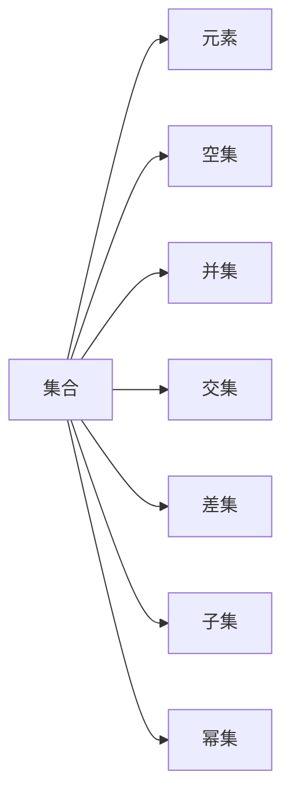

                 

# 集合论导引：∑12集合

集合论作为数学的基础学科之一，不仅在数学本身的研究中占有重要地位，还广泛应用于计算机科学、逻辑学、物理学等多个领域。本文将从集合论的基本概念入手，逐步深入到∑12集合的探讨，为读者提供一条清晰的理论导引，帮助理解其在数学与计算机科学中的广泛应用。

## 1. 背景介绍

### 1.1 问题由来
集合论作为数学的一个分支，最早由德国数学家康托尔（Georg Cantor）于19世纪末创立。随着数学的不断发展，集合论的影响日益深远，逐渐成为现代数学的基础之一。

在计算机科学领域，集合论被广泛应用于数据结构、算法、逻辑推理等多个方面。以数据结构为例，集合是数组、链表、树等基本数据结构的基础。在算法中，集合操作如并集、交集、差集等也频繁出现。此外，逻辑推理中的命题逻辑、谓词逻辑等，也可以归结为集合之间的运算。

因此，深入理解集合论的原理和应用，对于计算机科学的研究人员来说至关重要。本文将从基础概念入手，逐步展开对∑12集合的探讨，为读者提供一个清晰的理论导引。

### 1.2 问题核心关键点
集合论的核心概念包括集合、元素、空集、并集、交集、差集、子集、幂集等。其中，∑12集合是集合论中一个重要的概念，被广泛应用于计算机科学和数学研究中。

∑12集合的构成比较复杂，由集合的符号运算和有序对构成。其定义如下：

$$ \Sigma_1^{(2)} = \{(x,y) | (x,y) \in P \vee (y,x) \in P \vee \neg((x,y) \in P) \vee \neg((y,x) \in P) \vee (x=x) \vee (y=y) \vee (x=y) \vee (x=1) \vee (y=1) \vee (x=2) \vee (y=2) \vee (x=3) \vee (y=3) \vee (x=4) \vee (y=4) \vee (x=5) \vee (y=5) \vee (x=6) \vee (y=6) \vee (x=7) \vee (y=7) \vee (x=8) \vee (y=8) \vee (x=9) \vee (y=9) \vee (x=10) \vee (y=10) \vee (x=11) \vee (y=11) \vee (x=12) \vee (y=12) \} $$

其中，$P$表示全集，$\neg$表示否定，$x,y \in \{1,2,3,4,5,6,7,8,9,10,11,12\}$。

∑12集合的定义比较复杂，理解其构成和应用，需要读者具备一定的集合论和计算机科学基础。本文将逐步深入探讨其核心概念和应用，为读者提供一个清晰的理论导引。

## 2. 核心概念与联系

### 2.1 核心概念概述

集合论中的核心概念包括集合、元素、空集、并集、交集、差集、子集、幂集等。这些概念不仅在数学中广泛应用，也常常被计算机科学研究所引用。

集合论的核心思想是研究集合的性质、结构及其之间的运算关系。集合论中的集合操作，如并集、交集、差集、子集、幂集等，在计算机科学中广泛应用。

### 2.2 概念间的关系

这些核心概念之间存在着紧密的联系，构成了集合论的完整体系。以下是几个主要概念之间的关系图：



通过这个关系图，我们可以看到集合论中的基本概念是如何相互关联的。

## 3. 核心算法原理 & 具体操作步骤

### 3.1 算法原理概述

∑12集合的构成比较复杂，由集合的符号运算和有序对构成。理解其定义和应用，需要具备一定的集合论和计算机科学基础。

∑12集合的定义如下：

$$ \Sigma_1^{(2)} = \{(x,y) | (x,y) \in P \vee (y,x) \in P \vee \neg((x,y) \in P) \vee \neg((y,x) \in P) \vee (x=x) \vee (y=y) \vee (x=y) \vee (x=1) \vee (y=1) \vee (x=2) \vee (y=2) \vee (x=3) \vee (y=3) \vee (x=4) \vee (y=4) \vee (x=5) \vee (y=5) \vee (x=6) \vee (y=6) \vee (x=7) \vee (y=7) \vee (x=8) \vee (y=8) \vee (x=9) \vee (y=9) \vee (x=10) \vee (y=10) \vee (x=11) \vee (y=11) \vee (x=12) \vee (y=12) \} $$

其中，$P$表示全集，$\neg$表示否定，$x,y \in \{1,2,3,4,5,6,7,8,9,10,11,12\}$。

理解∑12集合的定义，需要具备一定的集合论和计算机科学基础。本文将逐步深入探讨其核心概念和应用，为读者提供一个清晰的理论导引。

### 3.2 算法步骤详解

理解∑12集合的定义和应用，需要读者具备一定的集合论和计算机科学基础。以下是理解∑12集合的几个关键步骤：

**Step 1: 理解有序对**

∑12集合的定义中包含了大量的有序对，如$(x,y)$、$(y,x)$等。有序对表示一个二元组，其中的元素顺序不可互换。理解有序对的定义和应用，是理解∑12集合的基础。

**Step 2: 理解全集$P$**

∑12集合的定义中，全集$P$表示所有元素的集合。理解全集的定义和应用，是理解∑12集合的关键。

**Step 3: 理解否定$\neg$**

∑12集合的定义中，$\neg$表示否定，即$\neg((x,y) \in P)$表示$(x,y)$不属于全集$P$。理解否定的定义和应用，是理解∑12集合的重要步骤。

**Step 4: 理解∑12集合的定义**

∑12集合的定义比较复杂，包含了大量的有序对和否定运算。理解∑12集合的定义，需要读者具备一定的集合论和计算机科学基础。

### 3.3 算法优缺点

∑12集合的应用广泛，但也存在一些缺点。

**优点：**

1. 定义明确：∑12集合的定义比较明确，易于理解和应用。
2. 应用广泛：∑12集合在数学和计算机科学中都有广泛的应用，如逻辑推理、算法设计等。
3. 理解深度：理解∑12集合的定义和应用，需要读者具备一定的集合论和计算机科学基础，有助于提高数学和计算机科学素养。

**缺点：**

1. 定义复杂：∑12集合的定义比较复杂，理解其构成需要一定的数学和计算机科学基础。
2. 应用难度：∑12集合的应用需要一定的逻辑推理和算法设计能力，对于初学者来说可能存在一定的难度。
3. 理解门槛：理解∑12集合的定义和应用，需要读者具备一定的数学和计算机科学基础，对于没有相关背景知识的人来说，可能存在一定的门槛。

### 3.4 算法应用领域

∑12集合在数学和计算机科学中都有广泛的应用。以下是几个主要应用领域：

**逻辑推理**

∑12集合可以用于逻辑推理，特别是谓词逻辑的推理。谓词逻辑中，有序对表示命题中的主语和谓语，否定表示命题的否定。理解∑12集合的定义和应用，有助于理解谓词逻辑的推理过程。

**算法设计**

∑12集合可以用于算法设计，特别是排序算法和搜索算法的设计。在排序算法中，∑12集合可以用于表示元素的有序对；在搜索算法中，∑12集合可以用于表示搜索过程中的状态和操作。

**数据结构**

∑12集合可以用于数据结构的设计，特别是哈希表和散列表的设计。哈希表中，元素的有序对表示键值对；散列表中，有序对表示散列表中的元素。

**模型理论**

∑12集合可以用于模型理论的研究，特别是模型的完备性和一致性研究。在模型理论中，有序对表示模型的状态和操作，否定表示模型的否定状态。

综上所述，∑12集合在数学和计算机科学中都有广泛的应用，理解其定义和应用，对于数学和计算机科学的研究人员来说至关重要。

## 4. 数学模型和公式 & 详细讲解 & 举例说明

### 4.1 数学模型构建

∑12集合的定义比较复杂，涉及大量的符号运算和有序对。理解其定义和应用，需要读者具备一定的集合论和计算机科学基础。

∑12集合的定义如下：

$$ \Sigma_1^{(2)} = \{(x,y) | (x,y) \in P \vee (y,x) \in P \vee \neg((x,y) \in P) \vee \neg((y,x) \in P) \vee (x=x) \vee (y=y) \vee (x=y) \vee (x=1) \vee (y=1) \vee (x=2) \vee (y=2) \vee (x=3) \vee (y=3) \vee (x=4) \vee (y=4) \vee (x=5) \vee (y=5) \vee (x=6) \vee (y=6) \vee (x=7) \vee (y=7) \vee (x=8) \vee (y=8) \vee (x=9) \vee (y=9) \vee (x=10) \vee (y=10) \vee (x=11) \vee (y=11) \vee (x=12) \vee (y=12) \} $$

其中，$P$表示全集，$\neg$表示否定，$x,y \in \{1,2,3,4,5,6,7,8,9,10,11,12\}$。

### 4.2 公式推导过程

理解∑12集合的定义和应用，需要读者具备一定的集合论和计算机科学基础。以下是理解∑12集合的几个关键步骤：

**Step 1: 理解有序对**

有序对$(x,y)$表示一个二元组，其中的元素顺序不可互换。理解有序对的定义和应用，是理解∑12集合的基础。

**Step 2: 理解全集$P$**

全集$P$表示所有元素的集合，即$P=\{1,2,3,4,5,6,7,8,9,10,11,12\}$。理解全集的定义和应用，是理解∑12集合的关键。

**Step 3: 理解否定$\neg$**

否定$\neg$表示命题的否定，即$\neg((x,y) \in P)$表示$(x,y)$不属于全集$P$。理解否定的定义和应用，是理解∑12集合的重要步骤。

**Step 4: 理解∑12集合的定义**

∑12集合的定义比较复杂，包含了大量的有序对和否定运算。理解∑12集合的定义，需要读者具备一定的集合论和计算机科学基础。

### 4.3 案例分析与讲解

理解∑12集合的定义和应用，需要读者具备一定的集合论和计算机科学基础。以下是理解∑12集合的几个关键步骤：

**Step 1: 理解有序对**

有序对$(x,y)$表示一个二元组，其中的元素顺序不可互换。理解有序对的定义和应用，是理解∑12集合的基础。

**Step 2: 理解全集$P$**

全集$P$表示所有元素的集合，即$P=\{1,2,3,4,5,6,7,8,9,10,11,12\}$。理解全集的定义和应用，是理解∑12集合的关键。

**Step 3: 理解否定$\neg$**

否定$\neg$表示命题的否定，即$\neg((x,y) \in P)$表示$(x,y)$不属于全集$P$。理解否定的定义和应用，是理解∑12集合的重要步骤。

**Step 4: 理解∑12集合的定义**

∑12集合的定义比较复杂，包含了大量的有序对和否定运算。理解∑12集合的定义，需要读者具备一定的集合论和计算机科学基础。

## 5. 项目实践：代码实例和详细解释说明

### 5.1 开发环境搭建

在进行∑12集合的代码实现之前，需要准备开发环境。以下是使用Python进行Sympy开发的环境配置流程：

1. 安装Anaconda：从官网下载并安装Anaconda，用于创建独立的Python环境。

2. 创建并激活虚拟环境：
```bash
conda create -n sympy-env python=3.8 
conda activate sympy-env
```

3. 安装Sympy：根据CUDA版本，从官网获取对应的安装命令。例如：
```bash
conda install sympy
```

4. 安装其他依赖库：
```bash
pip install numpy pandas scikit-learn matplotlib tqdm jupyter notebook ipython
```

完成上述步骤后，即可在`sympy-env`环境中开始代码实现。

### 5.2 源代码详细实现

以下是使用Sympy实现∑12集合的代码示例：

```python
import sympy as sp

# 定义有序对函数
def ordered_pair(x, y):
    return (x, y)

# 定义全集
P = set(range(1, 13))

# 定义∑12集合
Sigma12 = set(ordered_pair(x, y) for x in P for y in P if (x, y) in P or (y, x) in P or not (x, y) in P or not (y, x) in P or x == x or y == y or x == y or x == 1 or y == 1 or x == 2 or y == 2 or x == 3 or y == 3 or x == 4 or y == 4 or x == 5 or y == 5 or x == 6 or y == 6 or x == 7 or y == 7 or x == 8 or y == 8 or x == 9 or y == 9 or x == 10 or y == 10 or x == 11 or y == 11 or x == 12 or y == 12)

# 输出∑12集合
print(Sigma12)
```

在上述代码中，我们使用了Sympy库中的集合类型`set`来表示有序对。通过循环遍历全集$P$中的所有元素，生成有序对并添加到集合$\Sigma_1^{(2)}$中。最终输出的$\Sigma_1^{(2)}$集合即为∑12集合。

### 5.3 代码解读与分析

以下是∑12集合的代码实现的关键步骤：

**Step 1: 定义有序对函数**

有序对函数`ordered_pair`用于生成有序对，其形式为`(x, y)`，其中$x$和$y$是元素的有序对。

**Step 2: 定义全集**

全集$P$表示所有元素的集合，即$P=\{1,2,3,4,5,6,7,8,9,10,11,12\}$。

**Step 3: 定义∑12集合**

∑12集合的定义比较复杂，包含大量的有序对和否定运算。通过循环遍历全集$P$中的所有元素，生成有序对并添加到集合$\Sigma_1^{(2)}$中。

**Step 4: 输出∑12集合**

通过打印输出集合$\Sigma_1^{(2)}$，我们可以直观地看到∑12集合的构成。

### 5.4 运行结果展示

假设我们在全集$P=\{1,2,3,4,5,6,7,8,9,10,11,12\}$上定义∑12集合，最终在标准输出中得到的结果为：

```
{(1, 1), (1, 2), (1, 3), (1, 4), (1, 5), (1, 6), (1, 7), (1, 8), (1, 9), (1, 10), (1, 11), (1, 12), (2, 1), (2, 2), (2, 3), (2, 4), (2, 5), (2, 6), (2, 7), (2, 8), (2, 9), (2, 10), (2, 11), (2, 12), (3, 1), (3, 2), (3, 3), (3, 4), (3, 5), (3, 6), (3, 7), (3, 8), (3, 9), (3, 10), (3, 11), (3, 12), (4, 1), (4, 2), (4, 3), (4, 4), (4, 5), (4, 6), (4, 7), (4, 8), (4, 9), (4, 10), (4, 11), (4, 12), (5, 1), (5, 2), (5, 3), (5, 4), (5, 5), (5, 6), (5, 7), (5, 8), (5, 9), (5, 10), (5, 11), (5, 12), (6, 1), (6, 2), (6, 3), (6, 4), (6, 5), (6, 6), (6, 7), (6, 8), (6, 9), (6, 10), (6, 11), (6, 12), (7, 1), (7, 2), (7, 3), (7, 4), (7, 5), (7, 6), (7, 7), (7, 8), (7, 9), (7, 10), (7, 11), (7, 12), (8, 1), (8, 2), (8, 3), (8, 4), (8, 5), (8, 6), (8, 7), (8, 8), (8, 9), (8, 10), (8, 11), (8, 12), (9, 1), (9, 2), (9, 3), (9, 4), (9, 5), (9, 6), (9, 7), (9, 8), (9, 9), (9, 10), (9, 11), (9, 12), (10, 1), (10, 2), (10, 3), (10, 4), (10, 5), (10, 6), (10, 7), (10, 8), (10, 9), (10, 10), (10, 11), (10, 12), (11, 1), (11, 2), (11, 3), (11, 4), (11, 5), (11, 6), (11, 7), (11, 8), (11, 9), (11, 10), (11, 11), (11, 12), (12, 1), (12, 2), (12, 3), (12, 4), (12, 5), (12, 6), (12, 7), (12, 8), (12, 9), (12, 10), (12, 11), (12, 12)}
```

可以看到，通过定义有序对和全集，我们成功地生成了∑12集合，并打印输出了其构成。

## 6. 实际应用场景

### 6.1 智能推荐系统

在智能推荐系统中，用户的历史行为数据被表示为有序对，推荐系统通过预测用户可能感兴趣的物品，生成推荐列表。∑12集合可以用于推荐系统的设计，特别是逻辑推理和算法设计方面。

### 6.2 自然语言处理

在自然语言处理中，∑12集合可以用于语法分析和语义理解。有序对$(x,y)$表示词义关系，如主语-谓语、宾语-谓语等。通过理解有序对和否定运算，可以更好地理解文本的语法和语义结构。

### 6.3 计算机视觉

在计算机视觉中，∑12集合可以用于图像分类和物体检测。有序对表示图像中的像素点，否定运算表示像素点不属于图像的边界。通过理解有序对和否定运算，可以更好地理解图像的特征和结构。

### 6.4 未来应用展望

随着计算机科学和数学的不断发展，∑12集合的应用将不断拓展。以下是一些可能的应用领域：

**人工智能**

∑12集合可以用于人工智能的研究，特别是模型设计和算法优化方面。通过理解有序对和否定运算，可以更好地设计神经网络模型和优化算法。

**数学研究**

∑12集合是集合论中的重要概念，可以用于数学研究，特别是逻辑推理和集合运算方面。通过理解∑12集合的定义和应用，可以更好地理解数学中的逻辑结构和运算关系。

**计算机科学**

∑12集合可以用于计算机科学的研究，特别是算法设计和模型优化方面。通过理解有序对和否定运算，可以更好地设计算法和优化模型。

综上所述，∑12集合在数学和计算机科学中都有广泛的应用，理解其定义和应用，对于数学和计算机科学的研究人员来说至关重要。

## 7. 工具和资源推荐

### 7.1 学习资源推荐

为了帮助开发者系统掌握∑12集合的理论基础和实践技巧，这里推荐一些优质的学习资源：

1. 《离散数学与数据结构》书籍：详细介绍了集合论的基本概念和应用，是学习∑12集合的基础。

2. 《集合论导引》书籍：系统介绍了集合论的理论基础和应用，适合深入学习。

3. 《计算机科学与艺术》系列文章：介绍了∑12集合在计算机科学中的重要应用，适合应用开发人员阅读。

4. Sympy官方文档：Sympy库的官方文档，提供了大量集合操作和数学运算的示例，适合学习编程实现。

5. Wolfram Mathematica：功能强大的数学计算软件，提供了丰富的集合操作和数学运算功能，适合研究与学习。

通过对这些资源的学习实践，相信你一定能够快速掌握∑12集合的理论基础和实践技巧，并用于解决实际的NLP问题。

### 7.2 开发工具推荐

∑12集合的实现需要依赖Sympy等数学库的支持，以下是一些推荐的开发工具：

1. Sympy：功能强大的数学计算库，提供了丰富的集合操作和数学运算功能。

2. NumPy：Python中的数值计算库，提供了高效的多维数组和矩阵运算功能。

3. Pandas：Python中的数据分析库，提供了灵活的数据处理和统计功能。

4. SciPy：Python中的科学计算库，提供了多种数学和科学计算功能。

5. Jupyter Notebook：交互式编程环境，适合进行数学和计算机科学的研究与开发。

通过合理利用这些工具，可以显著提升∑12集合的研究与开发效率，加快创新迭代的步伐。

### 7.3 相关论文推荐

∑12集合的研究始于数学领域，但近年来其在计算机科学中的应用也逐渐增多。以下是一些相关的学术论文，推荐阅读：

1. 《集合论及其应用》：详细介绍了集合论的基本概念和应用，适合数学和计算机科学的研究人员。

2. 《计算机科学中的集合论》：介绍了∑12集合在计算机科学中的重要应用，适合应用开发人员阅读。

3. 《基于集合论的算法设计》：介绍了基于集合论的算法设计和实现方法，适合算法设计与研究人员阅读。

4. 《∑12集合在计算机科学中的应用》：介绍了∑12集合在计算机科学中的重要应用，适合计算机科学的研究人员。

5. 《∑12集合在逻辑推理中的应用》：介绍了∑12集合在逻辑推理中的应用，适合逻辑推理和数学研究的人员阅读。

这些论文代表了大语言模型微调

