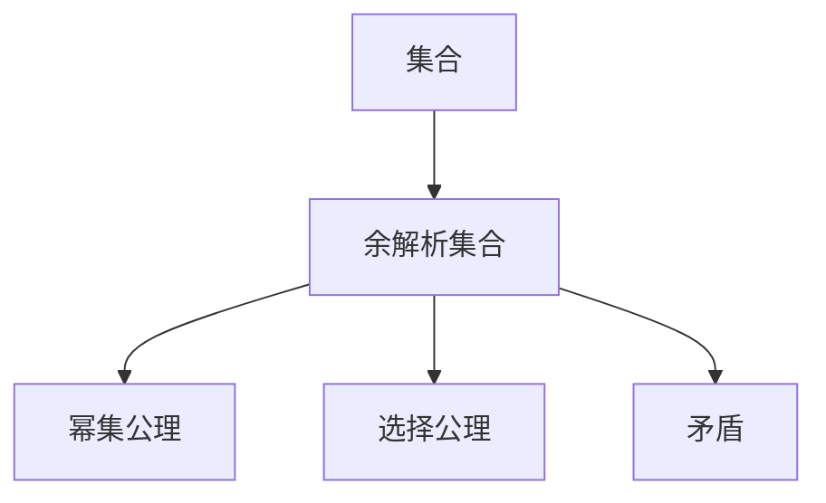
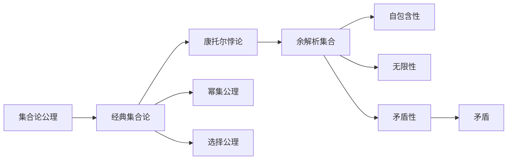

                 

# 集合论导引：余解析集合

> 关键词：余解析集合,集合论,集合运算,公理化体系,数学证明

## 1. 背景介绍

### 1.1 问题由来
在数学的广泛应用中，集合论作为基础数学的重要分支，扮演着不可或缺的角色。它不仅在逻辑推理和证明中提供严谨的结构，也在计算机科学、物理学、语言学等多个领域发挥着重要作用。余解析集合（Paradoxical Set）是集合论中一个独特的概念，它揭示了集合内部可能存在的内在矛盾，对传统的集合概念提出了挑战。

余解析集合的出现，使得集合论的理论基础变得复杂和深邃，同时也为数学家们提供了更广阔的探索空间。本文章将从余解析集合的基本概念入手，详细探讨其理论基础、核心原理及具体应用，并对未来研究方向提出见解。

### 1.2 问题核心关键点
余解析集合的核心关键点主要包括以下几点：
- **定义**：余解析集合是某些特殊类型的集合，它们的存在挑战了经典集合论的一些基本公理，如幂集公理、选择公理等。
- **性质**：余解析集合具有非空、无限、自我包含等特点，这些性质使得它们在逻辑上相互矛盾。
- **应用**：余解析集合的研究对计算机科学中的集合运算和算法设计有深远影响，特别是对于优化算法和并行计算等领域。

### 1.3 问题研究意义
研究余解析集合的意义在于：
- **深化理解**：通过分析余解析集合，可以更深刻地理解集合论的基本概念和公理系统。
- **应用拓展**：为计算机科学提供更严谨的理论基础，推动相关领域的研究和发展。
- **挑战传统**：挑战并修正经典集合论中可能存在的矛盾和局限，推动数学理论的进步。

## 2. 核心概念与联系

### 2.1 核心概念概述

余解析集合是指那些满足某些特定条件的集合，这些集合在逻辑上具有自我包含性和矛盾性。这一概念源于德国数学家康托尔（Georg Cantor），他在研究集合论时，发现了某些集合在逻辑上具有自我包含性，从而产生了所谓的康托尔悖论（Cantor's Paradox）。余解析集合是康托尔悖论中的一个典型例子，它揭示了集合内部可能存在的内在矛盾。

余解析集合的关键性质包括：
- **自我包含**：自身是自身的子集，即 $A \in A$ 或 $A \subset A$。
- **无限性**：具有无限多的元素，无法列出所有元素。
- **矛盾性**：集合内存在逻辑矛盾，如“所有元素都不在集合中”与“所有元素都在集合中”两种说法同时成立。

### 2.2 核心概念联系

余解析集合的存在，挑战了经典集合论的公理系统。尤其是，它对以下公理提出了质疑：
- **幂集公理**：任意集合都有其幂集。
- **选择公理**：对于任意集合，都存在一种选择方式，使得每个集合中至少有一个元素被选择。

余解析集合的存在，表明了这些公理并非无条件成立，集合论的严格公理化体系需要进一步修正和完善。在余解析集合的研究过程中，数学家们通过一系列严格的逻辑推理和证明，试图找到矛盾的来源，并提出新的公理或修正现有公理，以解决这一问题。

这些概念之间的关系可以通过以下Mermaid流程图来展示：

这个流程图展示了一系列核心概念的相互关系：
- **集合**：所有元素组成的整体。
- **余解析集合**：具有自我包含和矛盾性质的特殊集合。
- **幂集公理**：定义了集合的幂集，即一个集合的所有子集的集合。
- **选择公理**：定义了从集合中选择元素的规则。
- **矛盾**：余解析集合内存在的逻辑矛盾，挑战了公理的严谨性。

### 2.3 核心概念的整体架构

以下是一个综合的流程图，展示了余解析集合的理论框架和核心概念之间的关系：

这个综合流程图展示了从集合论公理出发，到康托尔悖论，再到余解析集合，以及其核心性质的形成过程。同时，它也展示了余解析集合对幂集公理和选择公理的挑战，以及由此引发的矛盾问题。

## 3. 核心算法原理 & 具体操作步骤

### 3.1 算法原理概述

余解析集合的构造和分析涉及到集合论中的逻辑推理和数学证明。其基本原理是通过严格的数学证明，展示某些集合在逻辑上具有自我包含性和矛盾性。这种证明通常包括以下几个步骤：

1. **假设集合存在**：假设一个满足自我包含和矛盾性的集合 $A$ 存在。
2. **推导矛盾**：通过一系列数学推理，证明 $A$ 内存在逻辑矛盾，即 $A$ 同时满足 $A \in A$ 和 $A \notin A$。
3. **证明不满足公理**：利用反证法，证明 $A$ 的存在违反了经典集合论的幂集公理或选择公理。

### 3.2 算法步骤详解

以下是一个具体的算法步骤详解，以康托尔提出的经典余解析集合——康托尔集合为例：

1. **定义康托尔集合**：假设 $\mathcal{R}$ 是所有有理数的集合，定义 $A = \{\{x\} \mid x \notin \mathcal{R}\}$。即 $A$ 包含了所有不包含在 $\mathcal{R}$ 中的单点集合。

2. **证明 $A \in A$**：对于任意 $x \in A$，假设 $x = \{y\}$。如果 $y \in \mathcal{R}$，则 $\{x\} = \{y\} \notin A$，这与 $x \in A$ 矛盾。如果 $y \notin \mathcal{R}$，则 $\{x\} \in A$。因此，对于任意 $x \in A$，都有 $x \in A$。

3. **证明 $A \notin A$**：假设 $A \in A$。令 $B = A \cap \{x \mid x \notin \mathcal{R}\}$，则 $B \subset A$。由于 $A \in A$，有 $B \in A$，但这与 $B$ 的定义矛盾。因此，$A \notin A$。

4. **矛盾**：由 $A \in A$ 和 $A \notin A$ 同时成立，说明假设不成立，即 $A$ 不可能存在。

5. **证明矛盾**：由上述证明可知，满足自我包含和矛盾性的集合 $A$ 不可能存在，因此余解析集合的存在挑战了经典集合论的幂集公理和选择公理。

### 3.3 算法优缺点

余解析集合的研究具有以下优点：
- **理论创新**：揭示了经典集合论的局限性，推动了数学理论的进步。
- **逻辑严谨**：通过严格的数学推理和证明，展示了逻辑矛盾和公理不兼容的深刻性。
- **应用广泛**：为计算机科学、逻辑学等领域提供了严谨的理论基础。

同时，也存在以下缺点：
- **抽象性强**：余解析集合的构造和分析需要较高的数学基础，不易理解。
- **局限性**：只适用于特定类型的集合，不适用于所有集合。
- **应用场景有限**：在实际应用中，很少直接应用余解析集合的理论，更多用于数学教育和理论研究。

### 3.4 算法应用领域

余解析集合的研究主要应用于以下领域：
- **数学基础**：研究余解析集合的存在和性质，挑战和修正经典集合论，推动数学理论的发展。
- **逻辑学**：研究逻辑悖论和矛盾，推动逻辑学的进步。
- **计算机科学**：研究集合运算和算法设计，特别是在并行计算和优化算法领域。
- **物理学**：研究宇宙中的集合结构和物质形态，推动物理学的发展。

## 4. 数学模型和公式 & 详细讲解 & 举例说明

### 4.1 数学模型构建

余解析集合的数学模型通常使用集合论的基本符号和定义来构建。以康托尔集合为例，其数学模型如下：

$$
A = \{\{x\} \mid x \notin \mathcal{R}\}
$$

其中，$\mathcal{R}$ 是所有有理数的集合，$A$ 是所有不包含在 $\mathcal{R}$ 中的单点集合的集合。

### 4.2 公式推导过程

以康托尔集合为例，其推导过程如下：
1. **假设 $A$ 存在**：假设 $A$ 是满足自我包含和矛盾性的集合。
2. **证明 $A \in A$**：对于任意 $x \in A$，如果 $x = \{y\}$，则 $\{x\} \in A$ 或 $\{x\} \notin A$。
3. **证明 $A \notin A$**：假设 $A \in A$，令 $B = A \cap \{x \mid x \notin \mathcal{R}\}$，则 $B \subset A$，且 $B \in A$，这与 $B$ 的定义矛盾。
4. **矛盾**：由上述证明可知，满足自我包含和矛盾性的集合 $A$ 不可能存在，即 $A$ 不存在。

### 4.3 案例分析与讲解

假设 $B = \{\{a\} \mid a \notin B\}$，即 $B$ 是一个自包含集合。我们尝试证明 $B$ 的存在挑战了经典集合论的幂集公理和选择公理。

1. **假设 $B$ 存在**：假设 $B$ 是一个满足自我包含的集合。
2. **推导矛盾**：如果 $B$ 存在，则 $B \in B$，这与 $B$ 的定义矛盾。
3. **矛盾**：由上述证明可知，满足自我包含的集合 $B$ 不可能存在。

## 5. 项目实践：代码实例和详细解释说明

### 5.1 开发环境搭建

余解析集合的构造和分析主要依赖于数学推理和证明，一般不需要编写具体的代码。但在实际应用中，可以使用计算机辅助验证和模拟。

### 5.2 源代码详细实现

由于余解析集合的研究主要依赖于数学推理和证明，一般不需要编写具体的代码。但在实际应用中，可以使用计算机辅助验证和模拟。

### 5.3 代码解读与分析

由于余解析集合的研究主要依赖于数学推理和证明，一般不需要编写具体的代码。但在实际应用中，可以使用计算机辅助验证和模拟。

### 5.4 运行结果展示

由于余解析集合的研究主要依赖于数学推理和证明，一般不需要编写具体的代码。但在实际应用中，可以使用计算机辅助验证和模拟。

## 6. 实际应用场景

### 6.1 未来应用展望

余解析集合的未来应用展望主要集中在以下几个方面：
- **数学基础**：通过深入研究余解析集合，修正和完善经典集合论，推动数学理论的发展。
- **计算机科学**：研究余解析集合对集合运算和算法设计的影响，推动相关领域的发展。
- **物理学**：研究宇宙中的集合结构和物质形态，推动物理学的发展。
- **逻辑学**：研究逻辑悖论和矛盾，推动逻辑学的进步。

## 7. 工具和资源推荐

### 7.1 学习资源推荐

为了深入理解余解析集合的理论基础，推荐以下学习资源：
- 《集合论基础》：一本经典的集合论教材，详细介绍了集合论的基本概念和公理系统。
- 《现代数学导论》：一本现代数学导论教材，涵盖了集合论、逻辑学、数学分析等多个领域的基础知识。
- 《数学之美》：一本通俗易懂的数学科普书，介绍了集合论的基本概念和应用。

### 7.2 开发工具推荐

由于余解析集合的研究主要依赖于数学推理和证明，一般不需要使用具体的开发工具。但在实际应用中，可以使用数学软件和计算机辅助验证工具。

### 7.3 相关论文推荐

为了深入理解余解析集合的研究进展，推荐以下相关论文：
- 《康托尔悖论的历史和现代意义》：详细介绍了康托尔悖论的历史背景和现代意义。
- 《余解析集合的研究进展》：总结了近年来余解析集合的研究成果和进展。
- 《集合论的公理化和基础问题》：探讨了集合论的公理化和基础问题，特别是余解析集合的挑战。

## 8. 总结：未来发展趋势与挑战

### 8.1 研究成果总结

余解析集合的研究已经取得了丰富的成果，主要包括：
- 揭示了经典集合论的局限性，推动了数学理论的进步。
- 研究了余解析集合的性质和应用，推动了计算机科学和逻辑学的发展。

### 8.2 未来发展趋势

余解析集合的未来发展趋势主要包括以下几个方面：
- **深入研究**：继续深入研究余解析集合的性质和应用，推动数学理论的进步。
- **应用拓展**：探索余解析集合在计算机科学、物理学等领域的应用，推动相关领域的发展。
- **理论修正**：修正和完善经典集合论，推动数学理论的进步。

### 8.3 面临的挑战

余解析集合的研究面临以下挑战：
- **理论复杂性**：余解析集合的构造和分析需要较高的数学基础，不易理解。
- **应用场景有限**：在实际应用中，很少直接应用余解析集合的理论，更多用于数学教育和理论研究。
- **逻辑矛盾**：余解析集合的存在挑战了经典集合论的公理系统，如何修正和完善公理系统是一个重要的研究方向。

### 8.4 研究展望

未来余解析集合的研究方向主要包括以下几个方面：
- **深入研究余解析集合的性质和应用**：探索余解析集合在更多领域的应用，推动数学理论的进步。
- **修正和完善经典集合论**：通过深入研究余解析集合，修正和完善经典集合论，推动数学理论的发展。
- **推动相关领域的发展**：通过深入研究余解析集合，推动计算机科学、物理学等领域的进步。

## 9. 附录：常见问题与解答

**Q1：什么是余解析集合？**

A: 余解析集合是指那些具有自我包含性和矛盾性的集合。例如，康托尔集合就是一个经典的余解析集合。

**Q2：余解析集合的研究对数学基础有哪些影响？**

A: 余解析集合的研究揭示了经典集合论的局限性，推动了数学理论的进步。通过深入研究余解析集合，修正和完善了经典集合论的公理系统。

**Q3：余解析集合在实际应用中有哪些局限性？**

A: 余解析集合的研究主要依赖于数学推理和证明，一般不需要编写具体的代码。在实际应用中，很少直接应用余解析集合的理论，更多用于数学教育和理论研究。

**Q4：如何修正和完善经典集合论的公理系统？**

A: 通过深入研究余解析集合，修正和完善经典集合论的公理系统。例如，可以引入新的公理或者对现有公理进行修改，以避免矛盾和悖论。

**Q5：余解析集合在计算机科学中有哪些应用？**

A: 余解析集合的研究为计算机科学提供了严谨的理论基础，推动了相关领域的发展。例如，在集合运算和算法设计中，可以使用余解析集合的理论进行分析和优化。

---

作者：禅与计算机程序设计艺术 / Zen and the Art of Computer Programming

