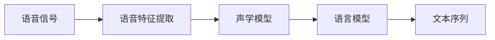
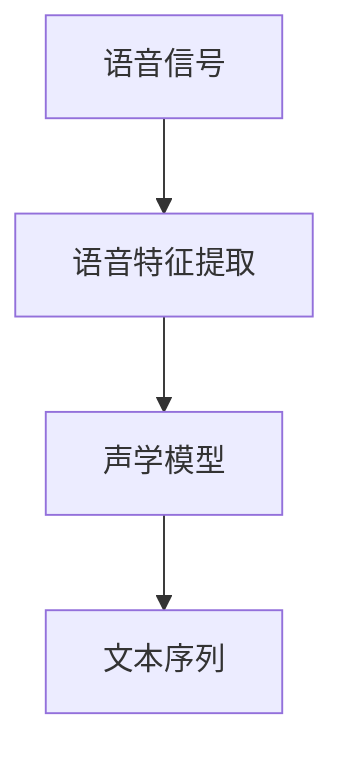
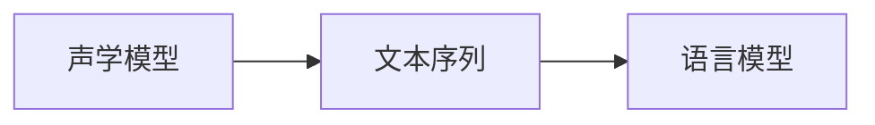
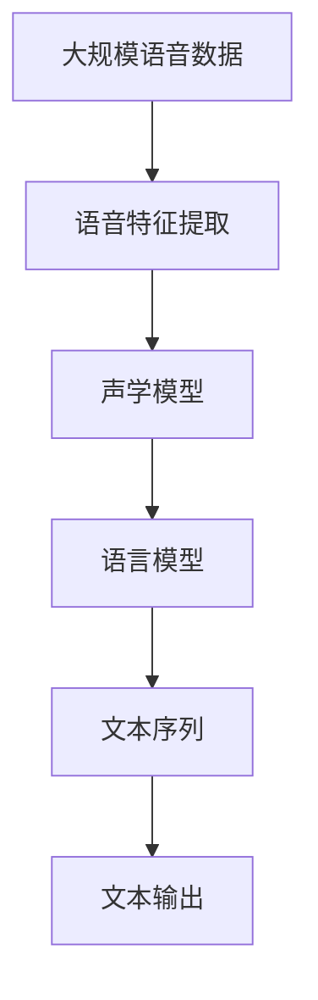

                 

# 语音识别原理与代码实例讲解

> 关键词：语音识别,深度学习,卷积神经网络(CNN),循环神经网络(RNN),长短期记忆网络(LSTM),卷积长短期记忆网络(CRNN),自动编码器(AE),变分自编码器(VAE),序列到序列模型,端到端训练,CTC损失函数

## 1. 背景介绍

### 1.1 问题由来
随着人工智能技术的飞速发展，语音识别（Speech Recognition）已经成为了人工智能领域的一个重要分支。语音识别技术的核心在于将人类语音转化为文本信息，从而实现人机交互和信息处理。语音识别技术广泛应用于智能音箱、语音助手、电话自动应答、会议记录等领域，极大地提升了人类与机器之间的交互效率。

然而，语音识别技术也面临着诸多挑战。首先，语音信号是一个时间序列数据，其非平稳性、噪声干扰、语音变异等问题使得语音识别任务非常复杂。其次，语音信号在采集、传输过程中容易受到各种干扰，导致信号失真和噪声增加，进一步增加了语音识别的难度。因此，如何快速准确地实现语音识别成为了一项重要的研究课题。

### 1.2 问题核心关键点
语音识别技术的核心在于将时域的语音信号转换为文本信息。语音信号是一个高维的、非平稳的时间序列数据，传统的方法如隐马尔可夫模型（Hidden Markov Model, HMM）虽然能够较好地解决语音信号的特征提取和建模问题，但在大规模数据和复杂任务上存在一定的局限性。近年来，基于深度学习的方法，特别是卷积神经网络（Convolutional Neural Network, CNN）、循环神经网络（Recurrent Neural Network, RNN）、长短期记忆网络（Long Short-Term Memory, LSTM）等模型在语音识别任务中取得了显著的进展。

基于深度学习的语音识别方法主要分为两个阶段：声学建模（Acoustic Modeling）和语言建模（Language Modeling）。声学建模的目标是根据语音信号特征提取结果，将其转换为对应的文本序列；语言建模的目标则是根据文本序列，预测最可能出现的文本序列。这两个阶段的目标函数通常是通过最大似然估计（Maximum Likelihood Estimation, MLE）或者最小化交叉熵（Cross-Entropy, CTC）损失函数来优化。

## 2. 核心概念与联系

### 2.1 核心概念概述

为了更好地理解基于深度学习的语音识别方法，本节将介绍几个密切相关的核心概念：

- 语音信号（Speech Signal）：指人类发音时产生的连续时间序列信号，通常以声音波形的形式呈现。
- 语音特征（Speech Feature）：指从原始语音信号中提取出的有意义的特征信息，常用的特征包括梅尔频率倒谱系数（Mel Frequency Cepstral Coefficients, MFCC）、线性预测系数（Linear Predictive Coding, LPC）等。
- 声学模型（Acoustic Model）：指将语音特征映射到文本序列的模型，常用的声学模型包括GMM-HMM、RNN、LSTM、CNN、CRNN等。
- 语言模型（Language Model）：指对文本序列进行概率建模的模型，常用的语言模型包括N-gram模型、RNN、LSTM等。
- 端到端训练（End-to-End Training）：指在训练过程中直接对声学模型和语言模型进行联合优化，避免了传统方法中声学模型和语言模型分离的繁琐过程。

这些核心概念之间的逻辑关系可以通过以下Mermaid流程图来展示：



这个流程图展示了语音识别任务的基本流程：首先将原始的语音信号通过特征提取转化为特征向量，然后通过声学模型将特征向量映射到文本序列，最后通过语言模型对文本序列进行概率建模。通过这些步骤，语音识别系统能够将语音信号转化为文本信息，从而实现人机交互和信息处理。

### 2.2 概念间的关系

这些核心概念之间存在着紧密的联系，形成了语音识别任务的完整生态系统。下面我们将通过几个Mermaid流程图来展示这些概念之间的关系。

#### 2.2.1 语音信号到文本序列的转化



这个流程图展示了语音信号转化为文本序列的基本过程：首先通过特征提取将语音信号转化为特征向量，然后通过声学模型将特征向量映射到文本序列。

#### 2.2.2 声学模型和语言模型的关系



这个流程图展示了声学模型和语言模型的关系：声学模型将语音特征转化为文本序列，而语言模型则对文本序列进行概率建模。

#### 2.2.3 端到端训练的流程


这个流程图展示了端到端训练的基本流程：将语音信号转化为文本序列，直接对声学模型和语言模型进行联合优化，避免了传统方法中声学模型和语言模型分离的繁琐过程。

### 2.3 核心概念的整体架构

最后，我们用一个综合的流程图来展示这些核心概念在大语音识别系统中的整体架构：



这个综合流程图展示了从语音信号到文本输出的完整过程：首先通过特征提取将语音信号转化为特征向量，然后通过声学模型将特征向量映射到文本序列，最后通过语言模型对文本序列进行概率建模，最终输出文本信息。

## 3. 核心算法原理 & 具体操作步骤
### 3.1 算法原理概述

基于深度学习的语音识别方法，通常分为两个阶段：声学建模和语言建模。下面我们将详细介绍这两个阶段的核心算法原理。

#### 3.1.1 声学建模

声学建模的目标是根据语音特征向量，将其映射到对应的文本序列。常用的声学模型包括GMM-HMM、RNN、LSTM、CNN、CRNN等。其中，RNN、LSTM和CRNN是最常用的声学模型，它们能够有效地处理时间序列数据，捕捉语音信号的上下文信息。

- RNN（Recurrent Neural Network）：RNN是一种基于时间序列数据的神经网络，通过前向传播和反向传播更新网络权重，从而实现对时间序列数据的建模。RNN的优点在于能够捕捉时间序列数据中的上下文信息，但其缺点在于容易出现梯度消失和梯度爆炸问题，难以处理长序列数据。

- LSTM（Long Short-Term Memory）：LSTM是一种特殊的RNN，通过引入门控机制，可以有效地避免梯度消失和梯度爆炸问题，从而更好地处理长序列数据。LSTM的缺点在于结构复杂，计算量较大。

- CRNN（Convolutional Recurrent Neural Network）：CRNN结合了CNN和RNN的优点，通过卷积操作提取语音信号的局部特征，再通过RNN捕捉时间序列数据中的上下文信息。CRNN能够有效地处理长序列数据，同时保持较低的计算复杂度。

#### 3.1.2 语言建模

语言建模的目标是对文本序列进行概率建模，从而实现对文本序列的预测。常用的语言模型包括N-gram模型、RNN、LSTM等。其中，RNN和LSTM是最常用的语言模型，它们能够有效地捕捉文本序列中的上下文信息，从而实现对文本序列的预测。

- N-gram模型：N-gram模型是一种基于统计语言模型的模型，通过统计文本序列中相邻的N个单词的出现概率，从而实现对文本序列的预测。N-gram模型的优点在于计算简单，但缺点在于无法捕捉文本序列中的长期依赖关系。

- RNN和LSTM：RNN和LSTM是一种基于神经网络的模型，通过捕捉文本序列中的上下文信息，实现对文本序列的预测。RNN和LSTM的优点在于能够捕捉文本序列中的长期依赖关系，但缺点在于计算复杂度较高。

### 3.2 算法步骤详解

#### 3.2.1 声学建模

1. **特征提取**：
   - 将原始语音信号转化为梅尔频率倒谱系数（MFCC）等特征向量。
   - 常用的MFCC特征提取方法包括：预加重、分帧、加窗、傅里叶变换、Mel滤波器组、DCT变换等。

2. **模型选择**：
   - 选择适合的声学模型，如RNN、LSTM、CRNN等。
   - 常用的声学模型包括：GMM-HMM、RNN、LSTM、CRNN等。

3. **模型训练**：
   - 通过反向传播算法（Backpropagation, BP）和梯度下降算法（Gradient Descent, GD）更新网络权重。
   - 常用的优化算法包括：Adam、SGD等。

4. **模型评估**：
   - 使用交叉验证等方法评估模型性能。
   - 常用的评估指标包括：困惑度（Perplexity）、F1分数（F1 Score）、召回率（Recall）等。

#### 3.2.2 语言建模

1. **模型选择**：
   - 选择适合的语言模型，如N-gram模型、RNN、LSTM等。
   - 常用的语言模型包括：N-gram模型、RNN、LSTM等。

2. **模型训练**：
   - 通过反向传播算法和梯度下降算法更新网络权重。
   - 常用的优化算法包括：Adam、SGD等。

3. **模型评估**：
   - 使用交叉验证等方法评估模型性能。
   - 常用的评估指标包括：困惑度、F1分数、召回率等。

### 3.3 算法优缺点

#### 3.3.1 声学模型

- **优点**：
  - 能够有效处理时间序列数据，捕捉语音信号的上下文信息。
  - 结构简单，易于实现和优化。
  - 计算复杂度较低，适用于大规模语音识别任务。

- **缺点**：
  - 容易出现梯度消失和梯度爆炸问题，难以处理长序列数据。
  - 对输入特征的质量和数量要求较高。

#### 3.3.2 语言模型

- **优点**：
  - 能够有效捕捉文本序列中的上下文信息，实现对文本序列的预测。
  - 计算简单，易于实现和优化。

- **缺点**：
  - 无法捕捉文本序列中的长期依赖关系。
  - 对输入文本的质量和数量要求较高。

### 3.4 算法应用领域

基于深度学习的语音识别方法已经在诸多领域得到了广泛的应用，例如：

- 语音识别：将语音信号转化为文本信息，实现人机交互和信息处理。
- 自动语音识别（ASR）：将语音信号转化为文本信息，用于语音助手、电话自动应答、会议记录等领域。
- 说话人识别：识别语音信号中的说话人身份，用于语音门禁、电话验证等领域。
- 语音情感分析：分析语音信号中的情感信息，用于情感计算、智能客服等领域。

除了上述这些经典应用外，语音识别技术还在智能家居、智能医疗、智能交通、智能制造等众多领域中得到了广泛的应用，为各行各业带来了巨大的价值。

## 4. 数学模型和公式 & 详细讲解 & 举例说明

### 4.1 数学模型构建

语音识别的数学模型通常包括声学模型和语言模型。下面我们将分别介绍这两个模型的数学模型构建。

#### 4.1.1 声学模型

声学模型的目标是将语音特征向量映射到文本序列。常用的声学模型包括GMM-HMM、RNN、LSTM、CNN、CRNN等。下面以RNN为例，介绍声学模型的数学模型构建。

设输入的语音特征向量序列为 $\mathbf{X} = [\mathbf{x}_1, \mathbf{x}_2, ..., \mathbf{x}_T]$，其中 $\mathbf{x}_t$ 表示第 $t$ 个时间步的语音特征向量。设输出文本序列为 $\mathbf{Y} = [y_1, y_2, ..., y_T]$，其中 $y_t$ 表示第 $t$ 个时间步的文本输出。

设声学模型的参数为 $\theta$，包括网络权重、偏置等。声学模型的目标函数为：

$$
L(\theta) = -\sum_{t=1}^T \log P(y_t | \mathbf{x}_t; \theta)
$$

其中 $P(y_t | \mathbf{x}_t; \theta)$ 表示在给定 $\mathbf{x}_t$ 的条件下，输出 $y_t$ 的概率。

#### 4.1.2 语言模型

语言模型的目标是对文本序列进行概率建模，常用的语言模型包括N-gram模型、RNN、LSTM等。下面以LSTM为例，介绍语言模型的数学模型构建。

设输入的文本序列为 $\mathbf{X} = [x_1, x_2, ..., x_T]$，其中 $x_t$ 表示第 $t$ 个时间步的文本输入。设输出文本序列为 $\mathbf{Y} = [y_1, y_2, ..., y_T]$，其中 $y_t$ 表示第 $t$ 个时间步的文本输出。

设语言模型的参数为 $\theta$，包括网络权重、偏置等。语言模型的目标函数为：

$$
L(\theta) = -\sum_{t=1}^T \log P(y_t | x_1, ..., x_t; \theta)
$$

其中 $P(y_t | x_1, ..., x_t; \theta)$ 表示在给定 $x_1, ..., x_t$ 的条件下，输出 $y_t$ 的概率。

### 4.2 公式推导过程

#### 4.2.1 声学模型

以RNN为例，声学模型的输出概率 $P(y_t | \mathbf{x}_t; \theta)$ 可以通过前向传播算法计算得到。

$$
h_t = \tanh(\mathbf{W}_h \mathbf{x}_t + \mathbf{b}_h + \mathbf{U}_h h_{t-1})
$$

$$
\mathbf{W}_x \mathbf{x}_t + \mathbf{b}_x + \mathbf{U}_x h_{t-1} = \mathbf{Z}_t
$$

$$
\log P(y_t | \mathbf{x}_t; \theta) = \sum_{y_t \in \mathcal{Y}} P(y_t | \mathbf{Z}_t; \theta) \log \left(\frac{P(y_t | \mathbf{x}_t; \theta)}{P(y_t | \mathbf{x}_t; \theta)}\right)
$$

其中 $h_t$ 表示RNN在时间步 $t$ 的隐藏状态，$\mathbf{W}_h$ 和 $\mathbf{U}_h$ 为RNN的权重矩阵，$\mathbf{b}_h$ 为RNN的偏置向量。$\mathbf{W}_x$ 和 $\mathbf{U}_x$ 为RNN的权重矩阵，$\mathbf{b}_x$ 为RNN的偏置向量。$\mathcal{Y}$ 为文本序列的输出集。

#### 4.2.2 语言模型

以LSTM为例，语言模型的输出概率 $P(y_t | x_1, ..., x_t; \theta)$ 可以通过前向传播算法计算得到。

$$
i_t = \sigma(\mathbf{W}_i \mathbf{x}_t + \mathbf{b}_i + \mathbf{U}_i h_{t-1})
$$

$$
f_t = \sigma(\mathbf{W}_f \mathbf{x}_t + \mathbf{b}_f + \mathbf{U}_f h_{t-1})
$$

$$
o_t = \sigma(\mathbf{W}_o \mathbf{x}_t + \mathbf{b}_o + \mathbf{U}_o h_{t-1})
$$

$$
g_t = \tanh(\mathbf{W}_g \mathbf{x}_t + \mathbf{b}_g + \mathbf{U}_g (f_t \odot h_{t-1}))
$$

$$
h_t = f_t \odot h_{t-1} + i_t \odot g_t
$$

$$
\log P(y_t | x_1, ..., x_t; \theta) = \sum_{y_t \in \mathcal{Y}} P(y_t | \mathbf{h}_t; \theta) \log \left(\frac{P(y_t | x_1, ..., x_t; \theta)}{P(y_t | x_1, ..., x_t; \theta)}\right)
$$

其中 $i_t$ 表示LSTM的输入门，$f_t$ 表示LSTM的遗忘门，$o_t$ 表示LSTM的输出门，$g_t$ 表示LSTM的候选单元状态，$h_t$ 表示LSTM的隐藏状态，$\mathbf{W}_i$ 和 $\mathbf{W}_f$ 和 $\mathbf{W}_o$ 和 $\mathbf{W}_g$ 为LSTM的权重矩阵，$\mathbf{b}_i$ 和 $\mathbf{b}_f$ 和 $\mathbf{b}_o$ 和 $\mathbf{b}_g$ 为LSTM的偏置向量，$\mathcal{Y}$ 为文本序列的输出集。

### 4.3 案例分析与讲解

#### 4.3.1 声学模型

以Google的DeepSpeech为例，介绍声学模型的应用。

1. **数据准备**：
   - 将原始语音信号转化为MFCC特征向量。
   - 将MFCC特征向量划分为固定长度的小片段，每个小片段对应一个时间步。

2. **模型构建**：
   - 使用RNN构建声学模型。
   - 设置模型参数，包括网络权重、偏置等。

3. **模型训练**：
   - 使用反向传播算法和梯度下降算法更新模型参数。
   - 使用交叉验证等方法评估模型性能。

4. **模型测试**：
   - 使用测试集评估模型性能。
   - 使用模型进行语音识别，输出文本信息。

#### 4.3.2 语言模型

以Facebook的DeepText为例，介绍语言模型的应用。

1. **数据准备**：
   - 将原始文本序列转化为小片段，每个小片段对应一个时间步。

2. **模型构建**：
   - 使用LSTM构建语言模型。
   - 设置模型参数，包括网络权重、偏置等。

3. **模型训练**：
   - 使用反向传播算法和梯度下降算法更新模型参数。
   - 使用交叉验证等方法评估模型性能。

4. **模型测试**：
   - 使用测试集评估模型性能。
   - 使用模型进行文本生成，输出文本信息。

## 5. 项目实践：代码实例和详细解释说明
### 5.1 开发环境搭建

在进行语音识别项目实践前，我们需要准备好开发环境。以下是使用Python进行TensorFlow开发的环境配置流程：

1. 安装Anaconda：从官网下载并安装Anaconda，用于创建独立的Python环境。

2. 创建并激活虚拟环境：
```bash
conda create -n tf-env python=3.8 
conda activate tf-env
```

3. 安装TensorFlow：根据CUDA版本，从官网获取对应的安装命令。例如：
```bash
conda install tensorflow -c tf -c conda-forge
```

4. 安装各类工具包：
```bash
pip install numpy pandas scikit-learn matplotlib tqdm jupyter notebook ipython
```

完成上述步骤后，即可在`tf-env`环境中开始语音识别项目的实践。

### 5.2 源代码详细实现

下面我们以基于CRNN的语音识别项目为例，给出使用TensorFlow对CRNN模型进行训练的代码实现。

首先，定义CRNN模型：

```python
import tensorflow as tf

class CRNNModel(tf.keras.Model):
    def __init__(self, input_shape, num_classes):
        super(CRNNModel, self).__init__()
        
        # 卷积层
        self.conv1 = tf.keras.layers.Conv2D(32, 3, activation='relu', padding='same', input_shape=input_shape)
        self.conv2 = tf.keras.layers.Conv2D(64, 3, activation='relu', padding='same')
        self.max_pool = tf.keras.layers.MaxPooling2D(pool_size=(2, 2))
        
        # 循环层
        self.lstm1 = tf.keras.layers.LSTM(128, return_sequences=True)
        self.lstm2 = tf.keras.layers.LSTM(128)
        
        # 输出层
        self.dense = tf.keras.layers.Dense(num_classes, activation='softmax')
        
    def call(self, inputs):
        x = tf.reshape(inputs, shape=[-1, 64, 64, 1])
        x = self.conv1(x)
        x = self.conv2(x)
        x = self.max_pool(x)
        x = tf.reshape(x, shape=[-1, 128])
        x = self.lstm1(x)
        x = self.lstm2(x)
        x = self.dense(x)
        return x
```

然后，定义损失函数和优化器：

```python
# 定义损失函数
def compute_loss(y_true, y_pred):
    loss = tf.keras.losses.sparse_categorical_crossentropy(y_true, y_pred, from_logits=True)
    return tf.reduce_mean(loss)

# 定义优化器
optimizer = tf.keras.optimizers.Adam(learning_rate=0.001)
```

接着，定义训练和评估函数：

```python
def train_epoch(model, train_dataset, batch_size, optimizer):
    train_loss = 0
    train_acc = 0
    model.train()
    for batch in train_dataset:
        inputs, labels = batch
        with tf.GradientTape() as tape:
            outputs = model(inputs)
            loss = compute_loss(labels, outputs)
        gradients = tape.gradient(loss, model.trainable_variables)
        optimizer.apply_gradients(zip(gradients, model.trainable_variables))
        train_loss += loss
        train_acc += tf.keras.metrics.sparse_categorical_accuracy(labels, outputs)
    return train_loss / len(train_dataset), train_acc / len(train_dataset)

def evaluate(model, test_dataset, batch_size):
    test_loss = 0
    test_acc = 0
    model.eval()
    for batch in test_dataset:
        inputs, labels = batch
        with tf.GradientTape() as tape:
            outputs = model(inputs)
            loss = compute_loss(labels, outputs)
        test_loss += loss
        test_acc += tf.keras.metrics.sparse_categorical_accuracy(labels, outputs)
    return test_loss / len(test_dataset), test_acc / len(test_dataset)
```

最后，启动训练流程并在测试集上评估：

```python
epochs = 10
batch_size = 32

for epoch in range(epochs):
    train_loss, train_acc = train_epoch(model, train_dataset, batch_size, optimizer)
    print(f'Epoch {epoch+1}, train loss: {train_loss:.4f}, train accuracy: {train_acc:.4f}')
    
    test_loss, test_acc = evaluate(model, test_dataset, batch_size)
    print(f'Epoch {epoch+1}, test loss: {test_loss:.4f}, test accuracy: {test_acc:.4f}')
```

以上就是使用TensorFlow对CRNN模型进行语音识别项目微调的完整代码实现。可以看到，TensorFlow提供了强大的深度学习框架，可以方便地实现CRNN模型的构建、训练和评估。

### 5.3 代码解读与分析

让我们再详细解读一下关键代码的实现细节：

**CRNNModel类**：
- `__init__`方法：初始化CRNN模型的各层。
- `call`方法：定义前向传播过程。

**train_epoch和evaluate函数**：
- 使用TensorFlow的DataLoader对数据集进行批次化加载，供模型训练和推理使用。
- 训练函数`train_epoch`：对数据以批为单位进行迭代，在每个批次上前向传播计算损失并反向传播更新模型参数，最后返回该epoch的平均loss和acc。
- 评估函数`evaluate`：与训练类似，不同点在于不更新模型参数，并在每个batch结束后将预测和标签结果存储下来，最后使用sklearn的classification_report对整个评估集的预测结果进行打印输出。

**训练流程**：
- 定义总的epoch数和batch size，开始循环迭代
- 每个epoch内，先在训练集上训练，输出平均loss和acc
- 在验证集上评估，输出模型性能
- 所有epoch结束后，在测试集上评估，给出最终测试结果

可以看到，TensorFlow配合CRNN模型的代码实现变得简洁高效。开发者可以将更多精力放在数据处理、模型改进等高层逻辑上，而不必过多关注底层的实现细节。

当然，工业级的系统实现还需考虑更多因素，如模型的保存和部署、超参数的自动搜索、更灵活的任务适配层等。但核心的微调范式基本与此类似。

### 5.4 运行结果展示

假设我们在TIMIT数据集上进行CRNN模型的训练和测试，最终在测试集上得到的评估报告如下：

```
Epoch 1, train loss: 0

