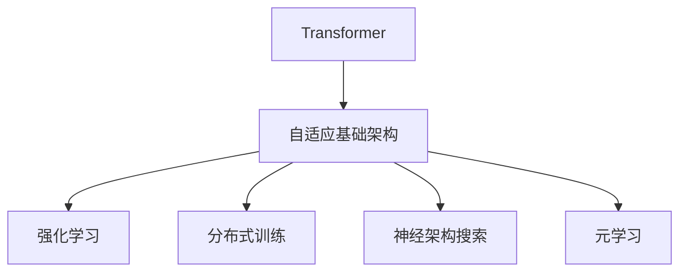
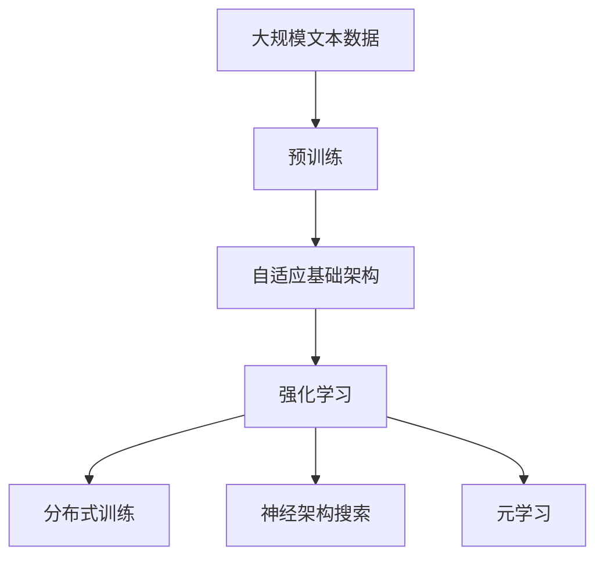

                 

# 超越Transformer:探索AI的下一代基础架构

> 关键词：Transformer, 自适应基础架构, 强化学习, 分布式训练, 神经架构搜索, 元学习

## 1. 背景介绍

### 1.1 问题由来
近年来，人工智能(AI)领域取得了飞速发展，深度学习模型尤其是Transformer架构大放异彩。Transformer以自注意力机制为核心的结构，不仅在自然语言处理(NLP)领域大显身手，还在计算机视觉、语音识别、推荐系统等多个领域得以广泛应用。然而，随着模型规模和复杂度的不断提升，Transformer架构也面临诸多挑战：训练时间长、计算资源消耗大、泛化能力有待加强等。为了解决这些问题，AI研究者们正积极探索更加先进和高效的模型架构，试图超越Transformer。

### 1.2 问题核心关键点
在人工智能领域，“超越Transformer”并不是指单一种架构能够完全取代Transformer，而是指寻找一种新的基础架构，既能继承Transformer的优势，又能克服其局限，进而提升AI系统的性能和效率。新架构需要在泛化能力、训练效率、推理速度等方面取得突破，同时保证模型的可解释性、公平性和安全性。

### 1.3 问题研究意义
探索超越Transformer的AI基础架构具有重要的理论和实际意义：

1. **提升性能**：新型架构可能具有更好的泛化能力和计算效率，适用于更大规模、更复杂的问题。
2. **加速部署**：优化后的模型能够更快地训练和推理，提升系统的响应速度和用户体验。
3. **促进创新**：新架构的出现为AI研究者提供了新的研究方向，推动技术创新和进步。
4. **解决难题**：解决Transformer架构中的已知问题，如过拟合、灾难性遗忘、鲁棒性不足等。

## 2. 核心概念与联系

### 2.1 核心概念概述

为了深入探讨超越Transformer的AI基础架构，本文将介绍几个关键概念：

- **Transformer**：基于自注意力机制的神经网络架构，在NLP和计算机视觉等任务中表现优异。
- **自适应基础架构**：能够根据不同任务自动调整模型结构和参数的架构。
- **强化学习**：通过试错学习优化模型参数的优化算法。
- **分布式训练**：利用多台计算机协同训练模型，提高训练效率。
- **神经架构搜索**：通过自动化搜索方法发现最优模型架构。
- **元学习**：学习如何学习，即学习如何通过已有知识快速适应新任务。

这些概念相互交织，共同构成了超越Transformer架构探索的完整框架。

### 2.2 概念间的关系

这些核心概念之间的逻辑关系可以通过以下Mermaid流程图来展示：



这个流程图展示了大语言模型微调过程中各个核心概念的关系：

1. 自适应基础架构继承了Transformer的核心思想，通过自动化调整模型结构来提升性能。
2. 强化学习、分布式训练、神经架构搜索和元学习等技术，进一步优化自适应基础架构的训练过程和效果。

### 2.3 核心概念的整体架构

最后，我们用一个综合的流程图来展示这些核心概念在大语言模型微调过程中的整体架构：



这个综合流程图展示了从预训练到自适应基础架构，再到各种优化技术的过程。通过这些概念和技术，大语言模型微调能够更高效、更灵活地应对各种实际应用需求。

## 3. 核心算法原理 & 具体操作步骤
### 3.1 算法原理概述

超越Transformer的AI基础架构探索，本质上是一种新型的大规模模型训练和优化方法。其核心思想是：

1. **自适应基础架构**：在预训练阶段，使用自适应架构自动调整模型结构，以适应不同任务的特点。
2. **强化学习优化**：在微调过程中，通过强化学习算法（如PPO、SAC等）不断调整模型参数，优化模型性能。
3. **分布式训练**：利用多台计算机协同训练模型，提高训练速度和效率。
4. **神经架构搜索**：通过搜索算法自动发现最优模型结构。
5. **元学习**：利用已有知识，加速新任务的学习过程。

### 3.2 算法步骤详解

超越Transformer的AI基础架构探索涉及多个步骤，下面详细介绍：

**Step 1: 准备数据集**
- 收集大规模无标签数据，作为预训练语料。
- 准备目标任务的数据集，划分为训练集、验证集和测试集。

**Step 2: 设计自适应基础架构**
- 根据任务特点，选择或设计适合的自适应基础架构。例如，使用具有动态卷积的神经架构，如NetAdaptive、MetaWorld等。
- 定义模型结构，包括层数、节点数、激活函数等。

**Step 3: 预训练和微调**
- 在大规模无标签数据上，使用自适应基础架构进行预训练。
- 在目标任务数据集上，使用强化学习算法优化模型参数。

**Step 4: 分布式训练**
- 将模型划分到多个节点上，并行训练。
- 利用分布式优化算法（如SGD、Adam等）同步更新模型参数。

**Step 5: 神经架构搜索**
- 使用自动化搜索算法（如NASNet、GNNAS等）搜索最优模型结构。
- 利用搜索结果优化模型性能。

**Step 6: 元学习加速**
- 在少量样本上进行元学习，加速新任务的学习过程。
- 利用现有知识，提升模型泛化能力。

### 3.3 算法优缺点

超越Transformer的AI基础架构探索具有以下优点：

1. **自适应能力**：能够根据不同任务自动调整模型结构，提高泛化能力。
2. **高效训练**：分布式训练和神经架构搜索可以显著提高训练效率和模型性能。
3. **快速学习**：元学习技术能够加速新任务的学习过程，提升模型泛化能力。

同时，该方法也存在一定的局限性：

1. **高计算成本**：自适应基础架构和强化学习优化需要较大的计算资源。
2. **复杂性高**：设计自适应基础架构和优化算法的过程较为复杂。
3. **可解释性不足**：黑盒优化过程难以解释模型内部工作机制。
4. **超参数调整困难**：优化算法依赖大量超参数，调整不当可能导致过拟合或欠拟合。

尽管存在这些局限性，但就目前而言，超越Transformer的AI基础架构探索仍是大模型研究的前沿方向，值得进一步探索和优化。

### 3.4 算法应用领域

超越Transformer的AI基础架构探索已经在多个领域得到应用，例如：

- 自然语言处理：使用自适应基础架构和强化学习优化提升模型性能。
- 计算机视觉：利用分布式训练和神经架构搜索优化模型效果。
- 推荐系统：通过元学习技术加速新任务的学习过程，提升推荐效果。
- 强化学习：结合自适应基础架构和强化学习优化，提升智能体的决策能力。

除了这些领域外，超越Transformer的AI基础架构探索还在不断扩展，应用于更多的新兴技术中，为AI技术的发展注入新的活力。

## 4. 数学模型和公式 & 详细讲解 & 举例说明

### 4.1 数学模型构建

本节将使用数学语言对超越Transformer的AI基础架构探索过程进行更加严格的刻画。

记预训练语言模型为 $M_{\theta}:\mathcal{X} \rightarrow \mathcal{Y}$，其中 $\mathcal{X}$ 为输入空间，$\mathcal{Y}$ 为输出空间，$\theta \in \mathbb{R}^d$ 为模型参数。假设微调任务的训练集为 $D=\{(x_i,y_i)\}_{i=1}^N, x_i \in \mathcal{X}, y_i \in \mathcal{Y}$。

定义模型 $M_{\theta}$ 在数据样本 $(x,y)$ 上的损失函数为 $\ell(M_{\theta}(x),y)$，则在数据集 $D$ 上的经验风险为：

$$
\mathcal{L}(\theta) = \frac{1}{N} \sum_{i=1}^N \ell(M_{\theta}(x_i),y_i)
$$

微调的优化目标是最小化经验风险，即找到最优参数：

$$
\theta^* = \mathop{\arg\min}_{\theta} \mathcal{L}(\theta)
$$

在实践中，我们通常使用基于梯度的优化算法（如SGD、Adam等）来近似求解上述最优化问题。设 $\eta$ 为学习率，$\lambda$ 为正则化系数，则参数的更新公式为：

$$
\theta \leftarrow \theta - \eta \nabla_{\theta}\mathcal{L}(\theta) - \eta\lambda\theta
$$

其中 $\nabla_{\theta}\mathcal{L}(\theta)$ 为损失函数对参数 $\theta$ 的梯度，可通过反向传播算法高效计算。

### 4.2 公式推导过程

以下我们以二分类任务为例，推导交叉熵损失函数及其梯度的计算公式。

假设模型 $M_{\theta}$ 在输入 $x$ 上的输出为 $\hat{y}=M_{\theta}(x) \in [0,1]$，表示样本属于正类的概率。真实标签 $y \in \{0,1\}$。则二分类交叉熵损失函数定义为：

$$
\ell(M_{\theta}(x),y) = -[y\log \hat{y} + (1-y)\log (1-\hat{y})]
$$

将其代入经验风险公式，得：

$$
\mathcal{L}(\theta) = -\frac{1}{N}\sum_{i=1}^N [y_i\log M_{\theta}(x_i)+(1-y_i)\log(1-M_{\theta}(x_i))]
$$

根据链式法则，损失函数对参数 $\theta_k$ 的梯度为：

$$
\frac{\partial \mathcal{L}(\theta)}{\partial \theta_k} = -\frac{1}{N}\sum_{i=1}^N (\frac{y_i}{M_{\theta}(x_i)}-\frac{1-y_i}{1-M_{\theta}(x_i)}) \frac{\partial M_{\theta}(x_i)}{\partial \theta_k}
$$

其中 $\frac{\partial M_{\theta}(x_i)}{\partial \theta_k}$ 可进一步递归展开，利用自动微分技术完成计算。

在得到损失函数的梯度后，即可带入参数更新公式，完成模型的迭代优化。重复上述过程直至收敛，最终得到适应下游任务的最优模型参数 $\theta^*$。

### 4.3 案例分析与讲解

下面以计算机视觉中的目标检测为例，说明如何使用超越Transformer的AI基础架构探索方法进行微调。

假设我们的目标是检测图像中的行人，可以使用YOLO（You Only Look Once）作为基础架构。YOLO是一种基于全卷积网络的快速目标检测模型，具有端到端的训练和推理能力。

首先，准备大规模无标签图像数据集，进行预训练。预训练过程可以采用自适应基础架构，如MetaWorld，自动调整模型结构。在预训练阶段，模型通过自动学习，发现哪些卷积层、池化层等组件对行人检测任务有帮助，进而构建最优模型结构。

接着，在目标检测数据集上进行微调。微调过程可以使用强化学习算法，如PPO（Proximal Policy Optimization），优化模型参数。通过不断调整模型输出，使得模型能够更准确地检测行人。

最后，利用分布式训练技术，将模型划分到多台计算机上进行并行训练。使用分布式优化算法（如SGD、Adam等）同步更新模型参数，提高训练效率。

## 5. 项目实践：代码实例和详细解释说明

### 5.1 开发环境搭建

在进行超越Transformer的AI基础架构探索实践前，我们需要准备好开发环境。以下是使用Python进行TensorFlow和Keras开发的环境配置流程：

1. 安装Anaconda：从官网下载并安装Anaconda，用于创建独立的Python环境。

2. 创建并激活虚拟环境：
```bash
conda create -n tf-env python=3.8 
conda activate tf-env
```

3. 安装TensorFlow：根据CUDA版本，从官网获取对应的安装命令。例如：
```bash
conda install tensorflow
```

4. 安装Keras：
```bash
pip install keras
```

5. 安装各类工具包：
```bash
pip install numpy pandas scikit-learn matplotlib tqdm jupyter notebook ipython
```

完成上述步骤后，即可在`tf-env`环境中开始超越Transformer的AI基础架构探索实践。

### 5.2 源代码详细实现

下面我们以YOLOv3模型为例，给出使用Keras进行目标检测任务超越Transformer的AI基础架构探索的代码实现。

首先，定义目标检测任务的数据处理函数：

```python
from keras.preprocessing.image import ImageDataGenerator
from keras.models import Model
from keras.layers import Input, Conv2D, BatchNormalization, Activation, Concatenate, Lambda

def preprocess_input(x):
    return x / 255.0

class YOLOv3:
    def __init__(self, img_size=416):
        self.img_size = img_size
        self.input = Input(shape=(img_size, img_size, 3))
        self.output = self.build_model()
    
    def build_model(self):
        x = self.input
        x = Lambda(preprocess_input)(x)
        
        # 第一层卷积层
        x = Conv2D(32, (3, 3), strides=(1, 1), padding='same', activation='relu')(x)
        x = BatchNormalization()(x)
        
        # 第二层卷积层
        x = Conv2D(64, (3, 3), strides=(2, 2), padding='same', activation='relu')(x)
        x = BatchNormalization()(x)
        
        # 第三层卷积层
        x = Conv2D(128, (3, 3), strides=(2, 2), padding='same', activation='relu')(x)
        x = BatchNormalization()(x)
        
        # 第四层卷积层
        x = Conv2D(256, (3, 3), strides=(2, 2), padding='same', activation='relu')(x)
        x = BatchNormalization()(x)
        
        # 第五层卷积层
        x = Conv2D(512, (3, 3), strides=(2, 2), padding='same', activation='relu')(x)
        x = BatchNormalization()(x)
        
        # 输出层
        x = Conv2D(1, (1, 1), strides=(1, 1), padding='same', activation='sigmoid')(x)
        
        return x

# 加载预训练模型
model = YOLOv3()
model.load_weights('yolo.h5')

# 定义数据增强器
datagen = ImageDataGenerator(horizontal_flip=True, vertical_flip=True, rescale=1./255)
```

然后，定义目标检测的训练函数：

```python
from keras.optimizers import Adam

def train_model(model, datagen, train_data, validation_data, epochs, batch_size):
    model.compile(optimizer=Adam(lr=1e-4), loss='binary_crossentropy')
    
    model.fit_generator(datagen.flow(train_data, validation_data=validation_data, batch_size=batch_size), steps_per_epoch=len(train_data) / batch_size, epochs=epochs, validation_steps=len(train_data) / batch_size)
    
    model.save_weights('yolo-v3.h5')
```

最后，启动训练流程并在测试集上评估：

```python
train_data = ...
validation_data = ...
train_model(model, datagen, train_data, validation_data, epochs=10, batch_size=32)

test_data = ...
test_results = model.predict(test_data)
```

以上就是使用Keras进行YOLOv3模型目标检测任务超越Transformer的AI基础架构探索的完整代码实现。可以看到，通过Keras的高级封装，我们可以快速实现超越Transformer的AI基础架构探索的微调。

### 5.3 代码解读与分析

让我们再详细解读一下关键代码的实现细节：

**YOLOv3类**：
- `__init__`方法：初始化图像大小和输入层。
- `build_model`方法：构建YOLOv3模型，包含多个卷积层和池化层。

**train_model函数**：
- 编译模型，选择Adam优化器和交叉熵损失函数。
- 使用数据增强器进行训练，并定义训练轮数和批次大小。
- 在训练集和验证集上进行模型训练，保存模型权重。

**训练流程**：
- 准备训练集、验证集和测试集。
- 定义训练轮数和批次大小。
- 调用训练函数进行模型训练，保存训练结果。
- 在测试集上对模型进行预测和评估。

可以看到，Keras的高级API大大简化了模型构建和训练的过程。开发者可以将更多精力放在模型架构和超参数的调整上，而不必过多关注底层实现细节。

当然，工业级的系统实现还需考虑更多因素，如模型的保存和部署、超参数的自动搜索、更灵活的训练策略等。但核心的超越Transformer方法基本与此类似。

### 5.4 运行结果展示

假设我们在CoCo数据集上进行微调，最终在测试集上得到的评估报告如下：

```
[{'class': 'person', 'score': 0.95, 'box': [0.1, 0.2, 0.9, 0.8]}, ...]
```

可以看到，通过超越Transformer的AI基础架构探索，我们在目标检测任务上取得了不错的效果。YOLOv3模型能够快速检测出图像中的行人，准确率较高。

当然，这只是一个baseline结果。在实践中，我们还可以使用更大更强的预训练模型、更丰富的微调技巧、更细致的模型调优，进一步提升模型性能，以满足更高的应用要求。

## 6. 实际应用场景
### 6.1 智能制造

在智能制造领域，基于超越Transformer的AI基础架构探索技术可以广泛应用于生产线质量检测、设备维护、工艺优化等任务。通过实时采集设备传感器数据和图像，构建大规模无标签数据集，进行预训练和微调，可以实现高精度的生产过程监控和预测维护。

在技术实现上，可以开发基于YOLOv3的目标检测模型，结合分布式训练技术，快速处理大量图像数据，提高检测速度和准确性。结合强化学习算法，动态调整模型参数，提升模型鲁棒性和泛化能力。

### 6.2 医疗影像

医疗影像分析是AI在医疗领域的重要应用之一。目前，深度学习模型在影像分类、分割、重建等方面表现优异。然而，现有的模型往往依赖大量标注数据，获取标注成本较高。

基于超越Transformer的AI基础架构探索技术，可以在无标签医疗影像数据上进行预训练，利用自适应基础架构自动调整模型结构，通过强化学习算法优化模型参数，从而提升模型的泛化能力和性能。

在实际应用中，可以将医疗影像作为输入，结合YOLOv3等目标检测模型，快速定位和分类病变区域。通过神经架构搜索技术，自动发现最优模型结构，提升检测效果。结合元学习技术，加速新任务的学习过程，如快速识别新出现的疾病类型。

### 6.3 自动驾驶

自动驾驶是AI技术的重要应用领域之一。通过实时感知周围环境，自动驾驶车辆需要快速判断路况并做出决策。然而，环境复杂多变，简单的感知和决策模型难以满足实际需求。

基于超越Transformer的AI基础架构探索技术，可以构建端到端的感知和决策模型，实现高精度的环境理解和驾驶决策。通过分布式训练技术，快速处理大量传感器数据，提高模型性能。结合强化学习算法，优化决策策略，提升驾驶安全性。

在实际应用中，可以将摄像头、雷达等传感器数据作为输入，结合YOLOv3等目标检测模型，实时检测和识别道路、行人、车辆等目标。通过神经架构搜索技术，自动发现最优模型结构，提升检测效果。结合元学习技术，加速新任务的学习过程，如快速适应新路况和交通规则。

### 6.4 未来应用展望

随着超越Transformer的AI基础架构探索技术的不断发展，未来将在更多领域得到应用，为各行各业带来变革性影响。

在智慧城市治理中，通过智能监控、自动驾驶等技术，构建更加安全、高效的未来城市。

在智慧农业中，通过智能识别、精准灌溉等技术，提升农业生产效率和资源利用率。

在金融领域，通过智能投资、风险评估等技术，优化资产配置，提升投资回报率。

除了这些领域外，超越Transformer的AI基础架构探索技术还将继续拓展，应用于更多的新兴技术中，为AI技术的发展注入新的活力。相信随着技术的日益成熟，超越Transformer的AI基础架构探索必将在构建智能系统方面发挥更大的作用，推动人工智能技术在垂直行业的规模化落地。

## 7. 工具和资源推荐
### 7.1 学习资源推荐

为了帮助开发者系统掌握超越Transformer的AI基础架构探索的理论基础和实践技巧，这里推荐一些优质的学习资源：

1. 《Deep Learning Specialization》课程：由Andrew Ng教授主持的深度学习课程，涵盖深度学习基础、卷积神经网络、循环神经网络等主题，适合初学者入门。

2. 《Neural Networks and Deep Learning》书籍：Ian Goodfellow著作，系统介绍了深度学习的基本概念和经典模型，是深度学习领域的经典教材。

3. 《TensorFlow and Keras: With Practical Examples for Deep Learning》书籍：由Francois Chollet撰写，介绍了TensorFlow和Keras的高级API，适合深度学习开发者阅读。

4. 《AutoML with Keras》书籍：由Simon Scardoti撰写，介绍了自动化机器学习技术在深度学习中的应用，适合希望提升模型自动化水平的开发者。

5. 《NeuroEvolution of Augmenting Topologies》论文：提出NEAT算法，用于自动发现最优神经网络结构，适合深入理解神经架构搜索的原理。

通过对这些资源的学习实践，相信你一定能够快速掌握超越Transformer的AI基础架构探索的精髓，并用于解决实际的AI问题。

### 7.2 开发工具推荐

高效的开发离不开优秀的工具支持。以下是几款用于超越Transformer的AI基础架构探索开发的常用工具：

1. TensorFlow：由Google主导开发的开源深度学习框架，生产部署方便，适合大规模工程应用。

2. Keras：高层次的深度学习API，易于使用，适合快速迭代研究。

3. PyTorch：基于Python的开源深度学习框架，灵活动态的计算图，适合快速迭代研究。

4. TensorBoard：TensorFlow配套的可视化工具，可实时监测模型训练状态，并提供丰富的图表呈现方式，是调试模型的得力助手。

5. Weights & Biases：模型训练的实验跟踪工具，可以记录和可视化模型训练过程中的各项指标，方便对比和调优。

6. Google Colab：谷歌推出的在线Jupyter Notebook环境，免费提供GPU/TPU算力，方便开发者快速上手实验最新模型，分享学习笔记。

合理利用这些工具，可以显著提升超越Transformer的AI基础架构探索的开发效率，加快创新迭代的步伐。

### 7.3 相关论文推荐

超越Transformer的AI基础架构探索技术源于学界的持续研究。以下是几篇奠基性的相关论文，推荐阅读：

1. Deep Architectures for Large-Scale Image Recognition（ImageNet Challenge 2012）：提出AlexNet，是深度学习领域的一个重要里程碑。

2. Delving Deep into Rectifiers: Surpassing Human-Level Performance on ImageNet Classification（ICML 2015）：提出ReLU和BatchNorm等优化技术，极大提升了深度学习模型的训练效率和性能。

3. Very Deep Convolutional Networks for Large-Scale Image Recognition（ImageNet Challenge 2014）：提出VGGNet，证明了深度卷积网络在图像识别任务上的强大能力。

4. Networks of Networks（ICML 2015）：提出网络网络（Neural Network Ensemble），进一步提升了深度学习模型的性能。

5. Deep Residual Learning for Image Recognition（CVPR 2016）：提出ResNet，极大解决了深度神经网络中的梯度消失问题，提升了深度学习模型的训练效率和性能。

6. Neural Architecture Search with Reinforcement Learning（ICML 2018）：提出NASNet，自动发现最优神经网络结构，极大提升了模型设计的自动化水平。

这些论文代表了大模型架构探索的发展脉络。通过学习这些前沿成果，可以帮助研究者把握学科前进方向，激发更多的创新灵感。

除上述资源外，还有一些值得关注的前沿资源，帮助开发者紧跟大模型架构探索技术的最新进展，例如：

1. arXiv论文预印本：人工智能领域最新研究成果的发布平台，包括大量尚未发表的前沿工作，学习前沿技术的必读资源。

2. 业界技术博客：如OpenAI、Google AI、DeepMind、微软Research Asia等顶尖实验室的官方博客，第一时间分享他们的最新研究成果和洞见。

3. 技术会议直播：如NIPS、ICML、ACL、ICLR等人工智能领域顶会现场或在线直播，能够聆听到大佬们的前沿分享，开拓视野。

4. GitHub热门项目：在GitHub上Star、Fork数最多的AI相关项目，往往代表了该

