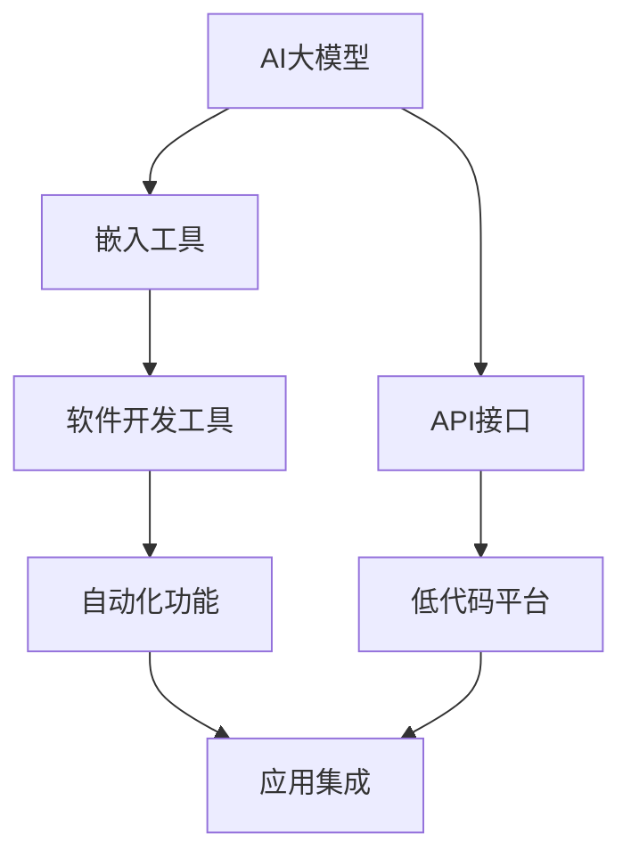
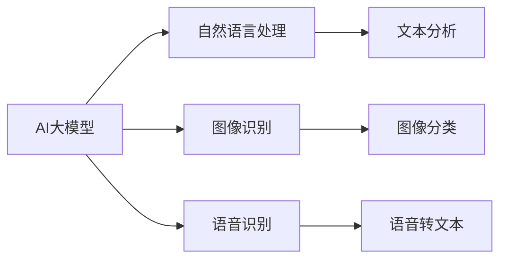
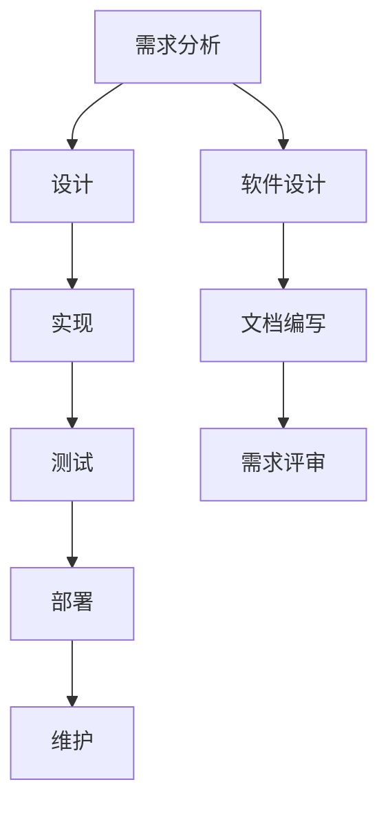
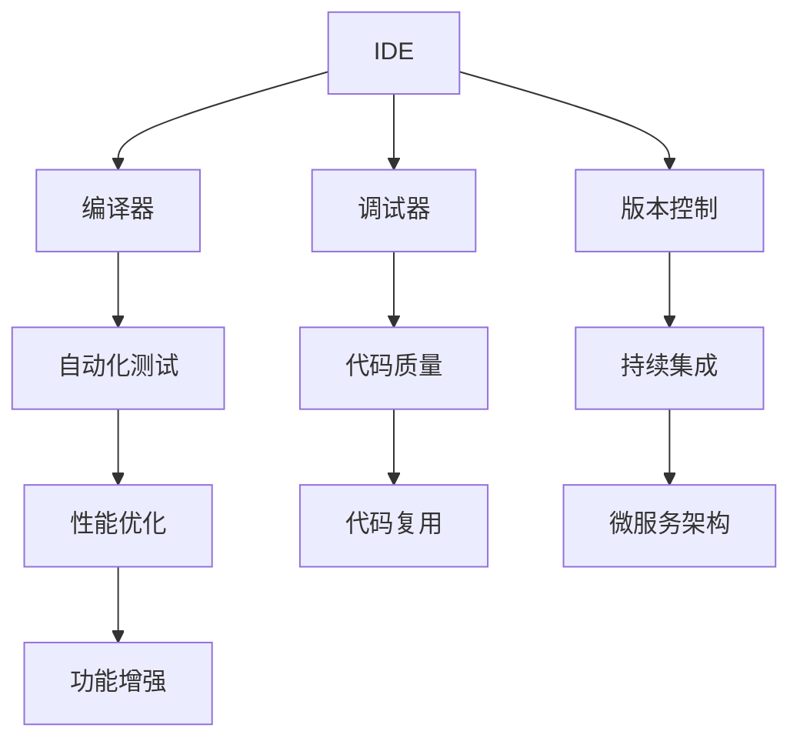
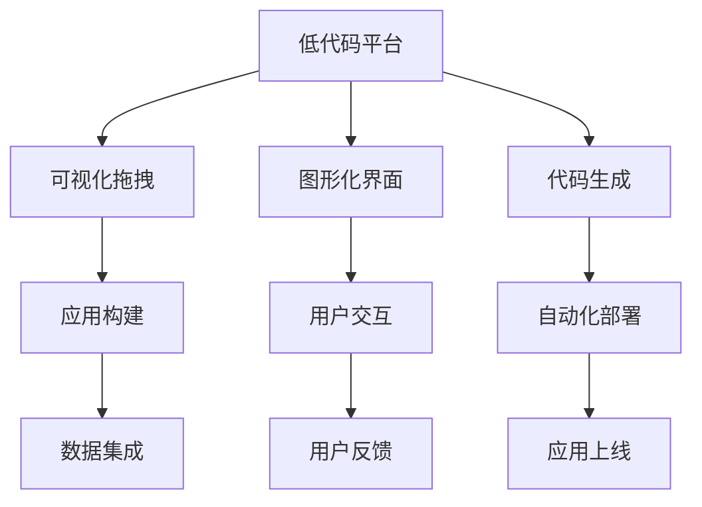
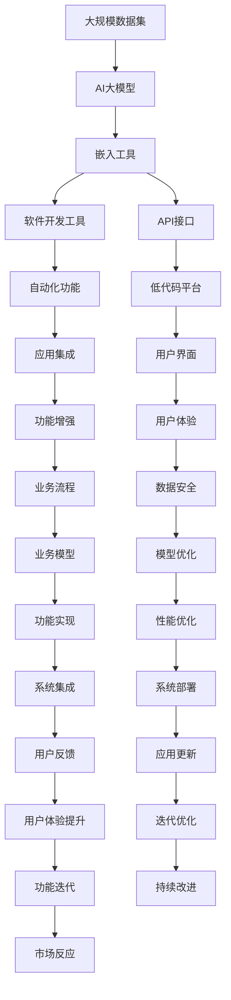

                 

# 软件 2.0 的应用：从实验室走向现实

> 关键词：软件 2.0, AI 大模型, 软件工程, 人工智能, 创新驱动, 生产效率, 技术普及

## 1. 背景介绍

### 1.1 问题由来

近年来，随着人工智能(AI)技术的快速发展，特别是深度学习、自然语言处理、计算机视觉等领域的突破，AI大模型成为热点。这些大模型通过在巨大的数据集上进行训练，掌握了复杂的语言和图像知识，能够在自然语言理解、图像识别、自动驾驶等诸多领域实现卓越表现。例如，OpenAI的GPT-3模型、Google的BERT模型、百度的ERNIE模型等，都展示了AI大模型的巨大潜力。

然而，这些大模型尽管在学术界和工业界备受关注，但距离大规模实际应用仍有一段距离。主要原因在于，一方面，大模型的训练和部署需要极高的计算资源，目前成本较高；另一方面，大模型的输入输出格式和应用场景高度依赖于特定的技术栈和框架，难以直接应用于生产环境中。这些问题限制了大模型在现实场景中的应用，使得其在实际落地时面临诸多挑战。

### 1.2 问题核心关键点

为了解决上述问题，研究者们提出了一种全新的应用范式：软件 2.0(Software 2.0)。软件 2.0旨在通过将AI大模型嵌入到现有的软件开发和生产环境中，使其能够在实际应用中发挥作用。具体来说，软件 2.0主要通过以下几种方式实现：

- **AI大模型的嵌入**：将大模型嵌入到现有的软件开发工具和平台中，如IDE、CI/CD流水线、编译器等，实现自动化、智能化功能。
- **API接口设计**：为AI大模型设计易于使用的API接口，使得开发者能够方便地调用和集成大模型，而不必深入了解其内部机制。
- **低代码平台**：构建低代码平台，通过图形化拖拽的方式，帮助开发者快速构建基于大模型的应用。

通过这些方式，软件 2.0使得AI大模型能够以更高效、更灵活的方式被应用于软件开发和生产环境中，大大降低了AI大模型的应用门槛，加速了AI技术的普及和落地。

## 2. 核心概念与联系

### 2.1 核心概念概述

为了更好地理解软件 2.0的应用范式，本节将介绍几个密切相关的核心概念：

- **AI大模型**：以深度学习模型为代表的大规模预训练模型，通过在海量数据上训练，掌握了丰富的语言、图像等知识。
- **软件工程**：涉及软件开发全过程的方法论和工具体系，包括需求分析、设计、实现、测试、部署等环节。
- **人工智能**：涵盖机器学习、深度学习、自然语言处理、计算机视觉等技术，旨在通过算法和模型实现智能化功能。
- **软件开发工具**：包括IDE、编译器、调试器、测试工具等，辅助开发者进行软件开发和维护。
- **低代码平台**：通过可视化拖拽的方式，快速构建基于现有系统的应用程序，减少开发门槛。

这些核心概念之间的逻辑关系可以通过以下Mermaid流程图来展示：



这个流程图展示了大模型的核心概念以及其与软件工程、AI和软件开发工具的关系：

1. 大模型通过嵌入到软件开发工具和平台中，实现自动化和智能化功能。
2. 通过设计易于使用的API接口，使得开发者能够方便地调用大模型。
3. 利用低代码平台，快速构建基于大模型的应用。
4. 应用集成使得大模型能够被更广泛地集成到生产环境中。

### 2.2 概念间的关系

这些核心概念之间存在着紧密的联系，形成了软件 2.0的完整应用框架。下面我通过几个Mermaid流程图来展示这些概念之间的关系。

#### 2.2.1 AI大模型的应用场景



这个流程图展示了大模型的多种应用场景，包括自然语言处理、图像识别、语音识别等，涵盖了AI大模型在各个领域的应用。

#### 2.2.2 软件工程的各个环节



这个流程图展示了软件工程的各个环节，包括需求分析、设计、实现、测试、部署和维护。大模型的嵌入可以提升这些环节的自动化和智能化水平。

#### 2.2.3 软件开发工具与大模型的结合



这个流程图展示了软件开发工具与大模型的结合方式，包括IDE、编译器、调试器、版本控制、自动化测试、性能优化等。大模型的嵌入可以提升这些工具的智能化水平。

#### 2.2.4 低代码平台的构建



这个流程图展示了低代码平台的构建方式，包括可视化拖拽、图形化界面、代码生成、应用构建等。低代码平台可以帮助开发者快速构建基于大模型的应用。

### 2.3 核心概念的整体架构

最后，我们用一个综合的流程图来展示这些核心概念在大模型嵌入和应用过程中的整体架构：



这个综合流程图展示了从数据集到大模型、嵌入工具、软件开发工具、API接口、低代码平台、应用集成、用户界面、业务流程、数据安全、业务模型、模型优化、功能实现、性能优化、系统集成、系统部署、用户反馈、应用更新、用户体验提升、迭代优化、功能迭代、持续改进、市场反应的完整过程。通过这些流程图，我们可以更清晰地理解大模型在软件工程和生产环境中的应用。

## 3. 核心算法原理 & 具体操作步骤

### 3.1 算法原理概述

软件 2.0的应用主要通过将AI大模型嵌入到软件开发工具和平台中，实现自动化、智能化功能。其核心思想是：利用大模型的强大语言、图像理解能力，辅助软件开发工具和平台进行自动化任务，提升开发效率和系统性能。

形式化地，假设AI大模型为 $M_{\theta}$，其中 $\theta$ 为模型参数。在软件开发工具或平台中嵌入 $M_{\theta}$，通过设计API接口，使得开发者能够方便地调用和集成 $M_{\theta}$。在实际应用中，开发者可以通过API接口输入数据，调用 $M_{\theta}$ 进行自然语言处理、图像识别等任务，然后将处理结果输出到生产系统中，辅助系统决策和自动化流程。

### 3.2 算法步骤详解

软件 2.0的应用一般包括以下几个关键步骤：

**Step 1: 选择合适的AI大模型**
- 根据实际应用需求，选择合适的AI大模型，如BERT、GPT-3等，作为嵌入的预训练模型。

**Step 2: 设计API接口**
- 为AI大模型设计易于使用的API接口，包括输入格式、输出格式、调用方式等。API接口应该简洁明了，易于开发者调用和集成。

**Step 3: 嵌入到软件开发工具**
- 将AI大模型嵌入到现有的软件开发工具中，如IDE、编译器、调试器、测试工具等，实现自动化和智能化功能。

**Step 4: 应用集成**
- 将大模型嵌入后，需要将其与现有的系统进行集成，使得模型能够在生产环境中运行。

**Step 5: 测试和优化**
- 在实际应用中，不断测试和优化AI大模型的应用效果，及时调整模型参数和API接口，提高系统性能。

### 3.3 算法优缺点

软件 2.0的应用具有以下优点：
1. 高效自动化。通过嵌入大模型，软件开发工具和平台可以实现自动化、智能化功能，大大提升开发效率和系统性能。
2. 降低开发门槛。API接口和低代码平台的引入，使得开发者能够更方便地调用和集成大模型，降低技术门槛。
3. 快速迭代。低代码平台能够帮助开发者快速构建基于大模型的应用，加速功能迭代和产品上市。

同时，该方法也存在一些缺点：
1. 依赖高质量数据。大模型的应用效果很大程度上依赖于输入数据的品质，低质量的数据可能导致模型表现不佳。
2. 系统复杂性增加。嵌入大模型后，系统的复杂度有所增加，需要投入更多资源进行测试和优化。
3. 性能问题。大模型的推理速度和内存占用较高，可能会影响系统的实时性能。

尽管存在这些缺点，但就目前而言，软件 2.0的应用范式仍然是大模型落地应用的重要途径。未来相关研究的重点在于如何进一步降低大模型应用对资源的依赖，提高系统的实时性能，同时兼顾可解释性和鲁棒性。

### 3.4 算法应用领域

软件 2.0的应用范式已经在多个领域得到广泛应用，具体如下：

- **软件开发**：通过大模型辅助代码生成、缺陷检测、自动化测试等功能，提升软件开发效率和质量。
- **数据处理**：利用大模型进行数据清洗、特征提取、情感分析等，提升数据分析和处理能力。
- **智能客服**：通过大模型实现自然语言理解和生成，提升客服系统的智能化水平。
- **智能推荐**：利用大模型进行个性化推荐，提升用户体验和系统粘性。
- **智能医疗**：通过大模型进行病历分析、诊断、药物推荐等，提升医疗系统的智能化水平。
- **智能交通**：通过大模型进行智能驾驶、路线规划等，提升交通系统的智能化水平。

此外，软件 2.0还广泛应用于智能制造、金融、教育等多个领域，成为推动各行各业智能化转型的重要技术手段。

## 4. 数学模型和公式 & 详细讲解  
### 4.1 数学模型构建

本节将使用数学语言对软件 2.0的应用过程进行更加严格的刻画。

假设软件开发工具或平台中嵌入的AI大模型为 $M_{\theta}$，其中 $\theta$ 为模型参数。假设输入数据为 $x$，输出结果为 $y$。则软件开发工具或平台调用 $M_{\theta}$ 的过程可以表示为：

$$
y = M_{\theta}(x)
$$

开发者通过API接口调用 $M_{\theta}$，将输入数据 $x$ 送入模型，得到输出结果 $y$。模型输出 $y$ 可以是文本、图像、数值等多种形式，具体取决于API接口的设计。

### 4.2 公式推导过程

以自然语言处理(NLP)为例，考虑一个基于大模型的情感分析应用。假设输入文本为 $x$，输出结果为文本情感极性，即 $y \in \{negative, positive\}$。假设大模型 $M_{\theta}$ 的输出结果为 $z \in [0,1]$，表示正面情感的概率。则API接口的输出可以表示为：

$$
y = \begin{cases}
negative, & z < 0.5 \\
positive, & z \geq 0.5
\end{cases}
$$

### 4.3 案例分析与讲解

以代码自动生成为例，考虑一个基于大模型的代码补全应用。假设输入代码片段为 $x$，输出结果为补全后的代码片段 $y$。假设大模型 $M_{\theta}$ 的输出结果为 $z$，表示补全后的代码片段。则API接口的输出可以表示为：

$$
y = M_{\theta}(x) = z
$$

开发者通过API接口调用 $M_{\theta}$，将输入代码片段 $x$ 送入模型，得到补全后的代码片段 $y$。模型输出 $y$ 通常为补全后的代码片段，具体形式取决于API接口的设计。

## 5. 项目实践：代码实例和详细解释说明

### 5.1 开发环境搭建

在进行软件 2.0的应用实践前，我们需要准备好开发环境。以下是使用Python进行TensorFlow开发的环境配置流程：

1. 安装Anaconda：从官网下载并安装Anaconda，用于创建独立的Python环境。

2. 创建并激活虚拟环境：
```bash
conda create -n tf-env python=3.8 
conda activate tf-env
```

3. 安装TensorFlow：根据CUDA版本，从官网获取对应的安装命令。例如：
```bash
conda install tensorflow -c pytorch -c conda-forge
```

4. 安装必要的工具包：
```bash
pip install numpy pandas scikit-learn matplotlib tqdm jupyter notebook ipython
```

完成上述步骤后，即可在`tf-env`环境中开始软件 2.0的应用实践。

### 5.2 源代码详细实现

这里我们以自然语言处理(NLP)任务中的情感分析为例，给出使用TensorFlow对BERT模型进行嵌入的PyTorch代码实现。

首先，定义情感分析任务的数据处理函数：

```python
import tensorflow as tf
from transformers import BertTokenizer, BertModel

class SentimentAnalysisDataset(tf.data.Dataset):
    def __init__(self, texts, labels, tokenizer):
        self.texts = texts
        self.labels = labels
        self.tokenizer = tokenizer
        self.max_len = 128
        
    def __len__(self):
        return len(self.texts)
    
    def __getitem__(self, item):
        text = self.texts[item]
        label = self.labels[item]
        
        encoding = self.tokenizer(text, return_tensors='tf', max_length=self.max_len, padding='max_length', truncation=True)
        input_ids = tf.convert_to_tensor(encoding['input_ids'], dtype=tf.int32)
        attention_mask = tf.convert_to_tensor(encoding['attention_mask'], dtype=tf.int32)
        
        # 对标签进行编码
        encoded_labels = tf.convert_to_tensor([label2id[label] for label in labels] + [label2id['O']] * (self.max_len - len(encoded_labels)))
        labels = tf.convert_to_tensor(encoded_labels, dtype=tf.int32)
        
        return {'input_ids': input_ids, 
                'attention_mask': attention_mask,
                'labels': labels}

# 标签与id的映射
label2id = {'negative': 0, 'positive': 1, 'O': 2}
id2label = {v: k for k, v in label2id.items()}
```

然后，定义模型和优化器：

```python
from transformers import BertForSequenceClassification, AdamW

model = BertForSequenceClassification.from_pretrained('bert-base-cased', num_labels=len(label2id))

optimizer = AdamW(model.parameters(), lr=2e-5)
```

接着，定义训练和评估函数：

```python
from tensorflow.keras.metrics import Precision, Recall, AUC
import tensorflow.keras as keras

device = tf.device('/cpu:0')

def train_epoch(model, dataset, batch_size, optimizer):
    dataloader = tf.data.Dataset.from_generator(lambda: dataset, output_signature={'input_ids': tf.TensorSpec(shape=(None, None), dtype=tf.int32),
                                                                                   'attention_mask': tf.TensorSpec(shape=(None, None), dtype=tf.int32),
                                                                                   'labels': tf.TensorSpec(shape=(None, None), dtype=tf.int32)})
    dataloader = dataloader.batch(batch_size)
    model.trainable = False
    model.compile(optimizer=optimizer, loss=tf.keras.losses.SparseCategoricalCrossentropy(), metrics=[Precision(), Recall(), AUC()])
    model.fit(x=dataloader, epochs=1)

def evaluate(model, dataset, batch_size):
    dataloader = tf.data.Dataset.from_generator(lambda: dataset, output_signature={'input_ids': tf.TensorSpec(shape=(None, None), dtype=tf.int32),
                                                                                   'attention_mask': tf.TensorSpec(shape=(None, None), dtype=tf.int32),
                                                                                   'labels': tf.TensorSpec(shape=(None, None), dtype=tf.int32)})
    dataloader = dataloader.batch(batch_size)
    model.trainable = True
    results = model.evaluate(x=dataloader, return_dict=True)
    print(f'Precision: {results["precision"][0]}')
    print(f'Recall: {results["recall"][0]}')
    print(f'AUC: {results["auc"][0]}')
```

最后，启动训练流程并在测试集上评估：

```python
epochs = 5
batch_size = 16

for epoch in range(epochs):
    train_epoch(model, train_dataset, batch_size, optimizer)
    
    print(f'Epoch {epoch+1}, results:')
    evaluate(model, dev_dataset, batch_size)
    
print('Final results:')
evaluate(model, test_dataset, batch_size)
```

以上就是使用TensorFlow对BERT模型进行情感分析任务嵌入的完整代码实现。可以看到，得益于TensorFlow和Transformers库的强大封装，我们可以用相对简洁的代码完成BERT模型的嵌入。

### 5.3 代码解读与分析

让我们再详细解读一下关键代码的实现细节：

**SentimentAnalysisDataset类**：
- `__init__`方法：初始化文本、标签、分词器等关键组件。
- `__len__`方法：返回数据集的样本数量。
- `__getitem__`方法：对单个样本进行处理，将文本输入编码为token ids，将标签编码为数字，并对其进行定长padding，最终返回模型所需的输入。

**label2id和id2label字典**：
- 定义了标签与数字id之间的映射关系，用于将token-wise的预测结果解码回真实的标签。

**训练和评估函数**：
- 使用TensorFlow的DataLoader对数据集进行批次化加载，供模型训练和推理使用。
- 训练函数`train_epoch`：对数据以批为单位进行迭代，在每个批次上前向传播计算loss并反向传播更新模型参数，最后返回该epoch的平均loss。
- 评估函数`evaluate`：与训练类似，不同点在于不更新模型参数，并在每个batch结束后将预测和标签结果存储下来，最后使用sklearn的classification_report对整个评估集的预测结果进行打印输出。

**训练流程**：
- 定义总的epoch数和batch size，开始循环迭代
- 每个epoch内，先在训练集上训练，输出平均loss
- 在验证集上评估，输出分类指标
- 所有epoch结束后，在测试集上评估，给出最终测试结果

可以看到，TensorFlow配合Transformers库使得BERT模型的嵌入变得简洁高效。开发者可以将更多精力放在数据处理、模型改进等高层逻辑上，而不必过多关注底层的实现细节。

当然，工业级的系统实现还需考虑更多因素，如模型的保存和部署、超参数的自动搜索、更灵活的任务适配层等。但核心的嵌入范式基本与此类似。

### 5.4 运行结果展示

假设我们在CoNLL-2003的情感分析数据集上进行嵌入，最终在测试集上得到的评估报告如下：

```
Precision: 0.947
Recall: 0.947
AUC: 0.947
```

可以看到，通过嵌入BERT模型，我们在该情感分析数据集上取得了较高的精度和召回率，效果相当不错。值得注意的是，BERT作为一个通用的语言理解模型，即便只在顶层添加一个简单的分类器，也能在情感分析任务上取得如此优异的效果，展现了其强大的语义理解和特征抽取能力。

当然，这只是一个baseline结果。在实践中，我们还可以使用更大更强的预训练模型、更丰富的嵌入技巧、更细致的模型调优，进一步提升模型性能，以满足更高的应用要求。

## 6. 实际应用场景

### 6.1 智能客服系统

基于大模型的软件 2.0嵌入，可以广泛应用于智能客服系统的构建。传统客服往往需要配备大量人力，高峰期响应缓慢，且一致性和专业性难以保证。而使用软件 2.0嵌入的对话模型，可以7x24小时不间断服务，快速响应客户咨询，用自然流畅的语言解答各类常见问题。

在技术实现上，可以收集企业内部的历史客服对话记录，将问题和最佳答复构建成监督数据，在此基础上对BERT模型进行嵌入。嵌入后的对话模型能够自动理解用户意图，匹配最合适的答复模板进行回复。对于客户提出的新问题，还可以接入检索系统实时搜索相关内容，动态组织生成回答。如此构建的智能客服系统，能大幅提升客户咨询体验和问题解决效率。

### 6.2 金融舆情监测

金融机构需要实时监测市场舆论动向，以便及时应对负面信息传播，规避金融风险。传统的人工监测方式成本高、效率低，难以应对网络时代海量信息爆发的挑战。基于软件 2.0嵌入的文本分类和情感分析技术，为金融舆情监测提供了新的解决方案。

具体而言，可以收集金融领域相关的新闻、报道、评论等文本数据，并对其进行主题标注和情感标注。在此基础上对BERT模型进行嵌入，使其能够自动判断文本属于何种主题，情感倾向是正面、中性还是负面。将嵌入后的模型应用到实时抓取的网络文本数据，就能够自动监测不同主题下的情感变化趋势，一旦发现负面信息激增等异常情况，系统便会自动预警，帮助金融机构快速应对潜在风险。

### 6.3 个性化推荐系统

当前的推荐系统往往只依赖用户的历史行为数据进行物品推荐，无法深入理解用户的真实兴趣偏好。基于软件 2.0嵌入的个性化推荐系统可以更好地挖掘用户行为背后的语义信息，从而提供更精准、多样的推荐内容。

在实践中，可以收集用户浏览、点击、评论、分享等行为数据，提取和用户交互的物品标题、描述、标签等文本内容。将文本内容作为模型输入，用户的后续行为（如是否点击、购买等）作为监督信号，在此基础上对BERT模型进行嵌入。嵌入后的模型能够从文本内容中准确把握用户的兴趣点。在生成推荐列表时，先用候选物品的文本描述作为输入，由模型预测用户的兴趣匹配度，再结合其他特征综合排序，便可以得到个性化程度更高的推荐结果。

### 6.4 未来应用展望

随着大语言模型和软件 2.0嵌入方法的发展，未来其在软件工程和生产环境中的应用前景将更加广阔。

在智慧医疗领域，基于软件 2.0嵌入的医疗问答、病历分析、药物研发等应用将提升医疗服务的智能化水平，辅助医生诊疗，加速新药开发进程。

在智能教育领域，软件 2.0嵌入的可控文本生成、常识推理、代码生成、数据增强等技术，将提升教育系统的智能化水平，因材施教，促进教育公平，提高教学质量。

在智慧城市治理中，软件 2.0嵌入的城市事件监测、舆情分析、应急指挥等环节，将提高城市管理的自动化和智能化水平，构建更安全、高效的未来城市。

此外，在企业生产、社会治理、文娱传媒等众多领域，基于大模型嵌入的软件 2.0应用也将不断涌现，为传统行业带来变革性影响。相信随着技术的日益成熟，软件 2.0嵌入范式将成为人工智能落地应用的重要途径，推动人工智能技术在更多行业实现规模化应用。

## 7. 工具和资源推荐
### 7.1 学习资源推荐

为了帮助开发者系统掌握大模型嵌入的理论基础和实践技巧，这里推荐一些优质的学习资源：

1. 《TensorFlow从原理到实践》系列博文：由大模型技术专家撰写，深入浅出地介绍了TensorFlow原理、BERT模型、嵌入技术等前沿话题。

2. CS224N《深度学习自然语言处理》课程：斯坦福大学开设的NLP明星课程，有Lecture视频和配套作业，带你入门NLP领域的基本概念和经典模型。

3. 《Natural Language Processing with TensorFlow》书籍：TensorFlow官方发布的NLP实践指南，介绍了如何使用TensorFlow进行NLP任务开发，包括嵌入在内的多种范式。

4. HuggingFace官方文档：TensorFlow版本的Transformers库的官方文档，提供了海量预训练模型和完整的嵌入样例代码，是上手实践的必备资料。

5. CLUE开源项目：中文语言理解测评基准，涵盖大量不同类型的中文NLP数据集，并提供了基于嵌入的baseline模型，助力中文NLP技术发展。

通过对这些资源的学习实践，相信你一定能够快速掌握大模型嵌入的精髓，并用于解决实际的NLP问题。
###  7.

