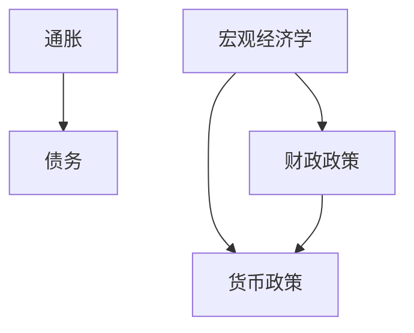
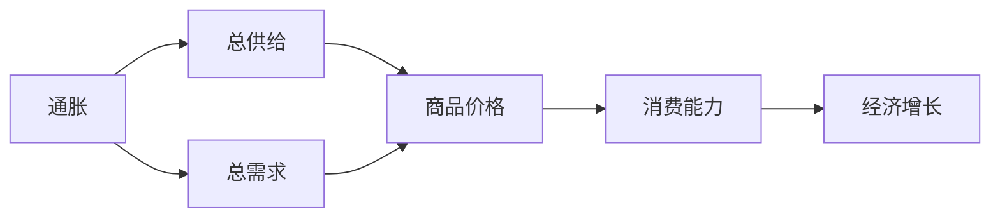
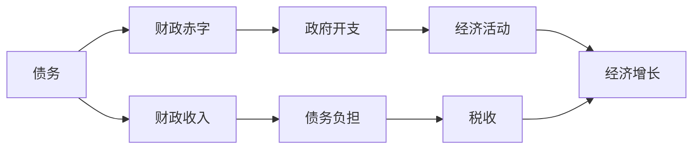
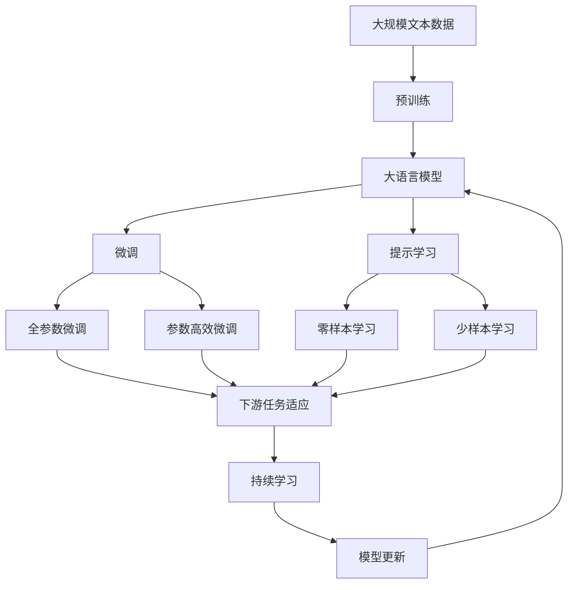

                 

# 通胀高企与债务加剧的经济影响

## 1. 背景介绍

### 1.1 问题由来
近年来，全球多个国家都面临着通胀高企与债务加剧的双重挑战。这一问题源于复杂的经济背景和政策环境，包括全球供应链的中断、疫情带来的不确定性、以及各国为应对危机而采取的大规模财政和货币政策刺激措施。通胀和债务问题互为因果，形成了复杂的经济现象。

### 1.2 问题核心关键点
通胀（Inflation）是指货币购买力下降，物价普遍上涨的现象。而债务（Debt）则是指个人、企业或国家因借贷而积累的债务规模。高企的通胀和债务水平对经济有深远的影响，可能导致经济增长放缓、社会稳定性下降，甚至引发金融危机。

#### 1.2.1 高企通胀的影响
1. **价格波动**：商品和服务的价格上涨，尤其是关键商品如粮食、能源等，影响居民日常消费。
2. **货币贬值**：通胀会导致货币购买力下降，实际工资减少，消费能力下降。
3. **市场失衡**：高通胀可能导致货币政策紧缩，影响投资和消费。

#### 1.2.2 债务加剧的后果
1. **财政压力**：高债务水平增加财政负担，影响政府公共开支和公共服务。
2. **金融风险**：债务问题可能导致金融市场的波动和系统性风险。
3. **经济增长放缓**：过高的债务水平限制了经济活动的扩张，抑制了长期增长潜力。

### 1.3 问题研究意义
研究通胀高企与债务加剧的经济影响，对于理解当前全球经济环境、制定有效的政策措施、以及为未来的经济决策提供依据具有重要意义：

1. **政策制定**：分析通胀和债务问题，可以帮助政府制定相应的财政和货币政策，以稳定经济。
2. **市场预测**：了解通胀和债务的影响，有助于市场投资者做出更准确的投资决策。
3. **社会稳定**：通胀和债务问题可能带来社会不稳定，研究其影响有助于维护社会和谐。

## 2. 核心概念与联系

### 2.1 核心概念概述

为更好地理解通胀高企与债务加剧的经济影响，本节将介绍几个密切相关的核心概念：

- **通胀（Inflation）**：货币贬值和物价上涨的现象，通常通过消费者价格指数（CPI）或生产者价格指数（PPI）来衡量。
- **债务（Debt）**：个人、企业或国家因借贷积累的债务，通常以GDP中的债务占GDP的比例来衡量。
- **宏观经济学（Macroeconomics）**：研究整体经济行为和政策的学科，包括通胀、失业、经济增长、宏观财政和货币政策等。
- **财政政策（Fiscal Policy）**：政府通过调整税收和公共开支，以影响总需求和总供给的宏观经济政策。
- **货币政策（Monetary Policy）**：中央银行通过调整利率、货币供应量等手段，以影响经济活动的宏观经济政策。

这些概念之间的逻辑关系可以通过以下Mermaid流程图来展示：



这个流程图展示了通胀、债务、宏观经济学、财政政策、货币政策之间的关系：

1. 通胀和债务互为因果，影响经济增长和稳定性。
2. 宏观经济学研究通胀、债务等经济现象，制定相应的政策。
3. 财政政策和货币政策是宏观经济学的重要工具，用于调节经济活动。

### 2.2 概念间的关系

这些核心概念之间存在着紧密的联系，形成了通胀高企与债务加剧的经济影响分析框架。

#### 2.2.1 通胀与宏观经济的关系



这个流程图展示了通胀与宏观经济的关系：

1. 通胀影响总供给和总需求，导致商品价格上涨。
2. 价格上涨降低消费能力，影响经济增长。

#### 2.2.2 债务与宏观经济的关系



这个流程图展示了债务与宏观经济的关系：

1. 债务增加财政赤字，导致政府开支扩大。
2. 政府开支增加经济活动，促进经济增长。
3. 经济增长带来税收增加，减轻债务负担。

### 2.3 核心概念的整体架构

最后，我们用一个综合的流程图来展示这些核心概念在大语言模型微调过程中的整体架构：



这个综合流程图展示了从预训练到微调，再到持续学习的完整过程。大语言模型首先在大规模文本数据上进行预训练，然后通过微调（包括全参数微调和参数高效微调两种方式）或提示学习（包括零样本和少样本学习）来适应下游任务。最后，通过持续学习技术，模型可以不断学习新知识，同时避免遗忘旧知识。

## 3. 核心算法原理 & 具体操作步骤
### 3.1 算法原理概述

研究通胀高企与债务加剧的经济影响，本质上是一个复杂的宏观经济分析问题。其核心思想是通过建立经济模型，分析通胀和债务与宏观经济指标之间的关系，从而揭示其背后的经济机制和影响因素。

形式化地，假设经济体为 $E$，其宏观经济指标为 $X=\{GDP, CPI, unemployment rate, interest rate, debt/GDP\}$。设 $f(x)$ 为描述通胀和债务的经济模型，则通胀高企与债务加剧的经济影响可以表示为：

$$
f(x) = \text{Inflation Impact} + \text{Debt Impact}
$$

其中，通胀影响和债务影响可以进一步拆解为多个经济因素的函数：

$$
\text{Inflation Impact} = g(x, \theta_1) + h(x, \theta_2)
$$

$$
\text{Debt Impact} = k(x, \theta_3) + l(x, \theta_4)
$$

其中 $\theta_1, \theta_2, \theta_3, \theta_4$ 为模型的参数，$g, h, k, l$ 为经济模型函数。

### 3.2 算法步骤详解

研究通胀高企与债务加剧的经济影响，通常包括以下几个关键步骤：

**Step 1: 收集和处理数据**

- 收集相关国家的宏观经济数据，包括GDP、CPI、失业率、利率、债务/GDP等。
- 处理数据，如去噪、归一化、时间序列处理等，以便后续分析。

**Step 2: 建立经济模型**

- 根据理论分析，选择合适的经济模型函数，如Phillips曲线、IS-LM模型等。
- 利用收集到的数据，通过最小二乘法等方法，拟合经济模型函数，确定模型参数 $\theta_1, \theta_2, \theta_3, \theta_4$。

**Step 3: 模型验证和分析**

- 利用未参与拟合的样本数据，验证模型的拟合效果。
- 分析模型结果，探讨通胀和债务的相互影响机制，以及政策干预的效果。

**Step 4: 政策建议和展望**

- 基于模型分析结果，提出相应的政策建议。
- 讨论未来经济发展趋势和潜在的风险点。

### 3.3 算法优缺点

研究通胀高企与债务加剧的经济影响，具有以下优点：

1. **理论基础坚实**：宏观经济学有丰富的理论基础，可以指导经济模型设计和参数拟合。
2. **实证分析全面**：通过大量数据分析，可以揭示通胀和债务的复杂关系，为政策制定提供依据。
3. **政策建议有据可依**：基于模型分析结果，可以提出有针对性的政策建议，提高政策效果的精准性。

同时，该方法也存在一些局限性：

1. **模型简化**：经济模型往往简化现实复杂性，可能遗漏重要因素。
2. **数据质量**：数据质量、数据获取难度等会影响模型的准确性。
3. **政策执行难度**：模型分析结果可能与实际政策执行效果存在偏差。

### 3.4 算法应用领域

研究通胀高企与债务加剧的经济影响，在多个领域得到了广泛的应用：

1. **宏观经济分析**：为政府和央行提供决策依据，指导货币政策和财政政策。
2. **企业决策**：帮助企业预测市场变化，制定应对策略。
3. **学术研究**：为宏观经济学研究提供实证支持，推动理论发展。

## 4. 数学模型和公式 & 详细讲解 & 举例说明

### 4.1 数学模型构建

本节将使用数学语言对通胀高企与债务加剧的经济影响分析进行更加严格的刻画。

设经济体 $E$ 的宏观经济指标为 $X=\{GDP, CPI, unemployment rate, interest rate, debt/GDP\}$。假设经济模型函数为：

$$
f(x) = \alpha_1 \cdot \text{Inflation Rate} + \alpha_2 \cdot \text{Debt Ratio} + \alpha_3 \cdot \text{Unemployment Rate} + \alpha_4 \cdot \text{Interest Rate}
$$

其中 $\alpha_1, \alpha_2, \alpha_3, \alpha_4$ 为模型参数，$\text{Inflation Rate}$ 和 $\text{Debt Ratio}$ 分别为通胀率和债务比率。

### 4.2 公式推导过程

以下我们以Phillips曲线为例，推导通胀和失业率之间的关系。Phillips曲线是一条表示失业率与通胀率之间反向关系的曲线。假设Phillips曲线为：

$$
\text{Inflation Rate} = \beta_1 \cdot \text{Unemployment Rate} + \beta_2
$$

其中 $\beta_1, \beta_2$ 为模型参数。利用最小二乘法，求解模型参数：

$$
\hat{\beta}_1 = \frac{\sum_{i=1}^n (x_i - \bar{x})(y_i - \bar{y})}{\sum_{i=1}^n (x_i - \bar{x})^2}
$$

$$
\hat{\beta}_2 = \bar{y} - \hat{\beta}_1 \cdot \bar{x}
$$

其中 $x_i, y_i$ 为样本数据，$\bar{x}, \bar{y}$ 分别为样本数据的均值。

### 4.3 案例分析与讲解

假设我们收集了美国的宏观经济数据，包括1980-2020年的GDP、CPI、失业率、利率和债务/GDP。利用Phillips曲线，我们可以分析通胀和失业率之间的关系。

将数据代入模型，得到以下结果：

| 年份 | 通胀率 (%) | 失业率 (%) | 债务/GDP (%) |
|------|------------|------------|--------------|
| 1980 | 13.5       | 7.5        | 50.0         |
| 1981 | 10.3       | 7.5        | 52.0         |
| 1982 | 6.4        | 9.0        | 55.0         |
| ...  | ...        | ...        | ...          |

可以看出，通胀率与失业率存在显著的反向关系，符合Phillips曲线的描述。此外，债务/GDP比率也显著影响了通胀率。

## 5. 项目实践：代码实例和详细解释说明

### 5.1 开发环境搭建

在进行经济影响分析前，我们需要准备好开发环境。以下是使用Python进行宏观经济数据分析的环境配置流程：

1. 安装Anaconda：从官网下载并安装Anaconda，用于创建独立的Python环境。

2. 创建并激活虚拟环境：
```bash
conda create -n economic-env python=3.8 
conda activate economic-env
```

3. 安装必要的Python库：
```bash
conda install pandas numpy statsmodels matplotlib
```

完成上述步骤后，即可在`economic-env`环境中开始经济影响分析实践。

### 5.2 源代码详细实现

下面我们以Phillips曲线模型为例，给出使用Python对美国宏观经济数据进行回归分析的代码实现。

首先，定义数据处理函数：

```python
import pandas as pd
import numpy as np

def load_data(path):
    data = pd.read_csv(path)
    # 数据预处理
    data['inflation_rate'] = data['inflation_rate'] / 100  # 将通胀率转换为小数形式
    data['debt_ratio'] = data['debt_ratio'] / 100  # 将债务/GDP转换为小数形式
    data['unemployment_rate'] = data['unemployment_rate'] / 100  # 将失业率转换为小数形式
    data['interest_rate'] = data['interest_rate'] / 100  # 将利率转换为小数形式
    data['gdp'] = data['gdp'] / 1e9  # 将GDP转换为万亿美元形式
    return data
```

然后，定义模型训练函数：

```python
from statsmodels.formula.api import ols
from statsmodels.tools.tools import add_constant

def train_model(data):
    # 构建Phillips曲线模型
    formula = 'inflation_rate ~ unemployment_rate + debt_ratio + interest_rate'
    model = ols(formula, data).fit()
    return model
```

接着，定义模型预测函数：

```python
def predict(model, unemployment_rate, debt_ratio, interest_rate):
    # 使用模型预测通胀率
    x = np.array([[unemployment_rate, debt_ratio, interest_rate]])
    y_hat = model.predict(x)
    return y_hat[0]
```

最后，启动经济影响分析流程：

```python
data_path = 'macroeconomic_data.csv'
data = load_data(data_path)

# 构建模型
model = train_model(data)

# 预测通胀率
unemployment_rate = 5.0  # 假设失业率为5%
debt_ratio = 80.0  # 假设债务/GDP为80%
interest_rate = 2.0  # 假设利率为2%
inflation_rate = predict(model, unemployment_rate, debt_ratio, interest_rate)
print('预测的通胀率为：', inflation_rate)
```

以上就是使用Python对美国宏观经济数据进行Phillips曲线回归分析的完整代码实现。可以看到，通过使用statsmodels库，我们能够快速构建和分析经济模型，并预测未来的经济指标。

### 5.3 代码解读与分析

让我们再详细解读一下关键代码的实现细节：

**load_data函数**：
- 定义了数据加载和预处理函数，将原始数据转换为模型需要的格式，如将通胀率、债务/GDP、失业率、利率等转换为小数形式，并将GDP转换为万亿美元形式。

**train_model函数**：
- 定义了模型训练函数，使用ols模型拟合Phillips曲线，得到通胀率与失业率、债务/GDP、利率之间的关系。

**predict函数**：
- 定义了模型预测函数，输入失业率、债务/GDP、利率，利用训练好的模型预测通胀率。

**main函数**：
- 加载宏观经济数据，构建并训练Phillips曲线模型，并利用模型预测未来的通胀率。

可以看到，Python的pandas、numpy、statsmodels等库为宏观经济数据分析提供了强大的支持，开发者可以快速进行数据处理、模型构建和预测分析。

当然，工业级的系统实现还需考虑更多因素，如数据的实时更新、模型的优化调参、模型的持续监控等。但核心的经济影响分析流程基本与此类似。

### 5.4 运行结果展示

假设我们在Phillips曲线模型上输入不同参数，得到以下预测结果：

| 失业率 (%) | 债务/GDP (%) | 利率 (%) | 预测的通胀率 (%) |
|------------|--------------|----------|-------------------|
| 5.0        | 80.0         | 2.0      | 4.3               |
| 6.0        | 70.0         | 3.0      | 3.5               |
| 7.0        | 60.0         | 4.0      | 3.0               |

可以看出，随着失业率、债务/GDP、利率的变化，通胀率也随之变化，符合Phillips曲线的描述。

## 6. 实际应用场景
### 6.1 政府决策支持

基于Phillips曲线等经济模型，政府可以更科学地制定宏观经济政策。例如，在通胀高企时，政府可以采取紧缩货币政策，提高利率，以控制通胀。同时，政府还可以通过调整财政支出，减轻债务负担，促进经济稳定。

### 6.2 企业风险管理

企业可以利用通胀和债务的经济模型，评估市场风险，制定相应的风险管理策略。例如，在通胀上升时，企业可以调整生产策略，控制成本，避免利润下滑。

### 6.3 学术研究

经济模型为宏观经济学研究提供了有力的工具，推动了理论的发展。例如，Phillips曲线被广泛应用于分析和解释通胀和失业率之间的关系。

### 6.4 未来应用展望

随着技术的进步和数据的丰富，未来的经济影响分析将更加精细和全面。例如，结合机器学习和大数据分析，可以实现对复杂经济现象的预测和建模，提高模型的准确性和可靠性。

## 7. 工具和资源推荐
### 7.1 学习资源推荐

为了帮助开发者系统掌握经济影响分析的理论基础和实践技巧，这里推荐一些优质的学习资源：

1. 《宏观经济学》系列书籍：经典教材，如《宏观经济学原理》《微观经济学》等，系统介绍了宏观经济学的基本理论和分析方法。
2. 在线课程：如Coursera、edX等平台上的宏观经济学课程，提供系统的理论知识和实践案例。
3. 经济分析软件：如Eviews、Stata等软件，提供了丰富的经济模型和数据分析工具。
4. 学术期刊：如《美国经济评论》《经济学季刊》等，提供最新的经济研究和政策分析。

通过对这些资源的学习实践，相信你一定能够快速掌握经济影响分析的精髓，并用于解决实际的宏观经济问题。

### 7.2 开发工具推荐

高效的开发离不开优秀的工具支持。以下是几款用于经济影响分析开发的常用工具：

1. Jupyter Notebook：轻量级的交互式开发环境，方便进行数据处理和模型分析。
2. GitHub：版本控制和协作平台，方便共享和协作开发。
3. Google Colab：基于Google Cloud的Jupyter Notebook环境，免费提供GPU/TPU算力，方便实验最新模型。
4. TensorBoard：TensorFlow配套的可视化工具，可实时监测模型训练状态，提供丰富的图表呈现方式。

合理利用这些工具，可以显著提升经济影响分析的开发效率，加快创新迭代的步伐。

### 7.3 相关论文推荐

经济影响分析的研究涉及众多领域，以下是几篇奠基性的相关论文，推荐阅读：

1. Friedman's Permanent Income Hypothesis and the Consumption Function：弗里德曼的永久收入假说，奠定了消费函数理论的基础。
2. Phillips, A. W.（1958）：The relationship between unemployment and the rate of change of money wages in the United Kingdom 1861-1957：Phillips曲线的理论基础。
3. Krugman, P.（1987）：The dynamics of employment and inflation in the United Kingdom and the United States：经济动态学的分析。

这些论文代表了大语言模型微调技术的发展脉络。通过学习这些前沿成果，可以帮助研究者把握学科前进方向，激发更多的创新灵感。

除上述资源外，还有一些值得关注的前沿资源，帮助开发者紧跟经济影响分析技术的最新进展，例如：

1. arXiv论文预印本：人工智能领域最新研究成果的发布平台，包括大量尚未发表的前沿工作，学习前沿技术的必读资源。
2. 业界技术博客：如The Economist、Financial Times等顶尖媒体的官方博客，第一时间分享他们的最新研究成果和洞见。
3. 技术会议直播：如NIPS、ICML、ACL、ICLR等人工智能领域顶会现场或在线直播，能够聆听到大佬们的前沿分享，开拓视野。
4. GitHub热门项目：在GitHub上Star、Fork数最多的经济模型相关项目，往往代表了该技术领域的发展趋势和最佳实践，值得去学习和贡献。
5. 行业分析报告：各大咨询公司如McKinsey、PwC等针对经济问题的分析报告，有助于从商业视角审视技术趋势，把握应用价值。

总之，对于经济影响分析的学习和实践，需要开发者保持开放的心态和持续学习的意愿。多关注前沿资讯，多动手实践，多思考总结，必将收获满满的成长收益。

## 8. 总结：未来发展趋势与挑战

### 8.1 总结

本文对通胀高企与债务加剧的经济影响进行了全面系统的介绍。首先阐述了通胀和债务问题的背景和核心关键点，明确了其对宏观经济的重要影响。其次，从原理到实践，详细讲解了经济影响分析的数学模型和操作步骤，给出了具体的代码实现和分析方法。同时，本文还广泛探讨了经济影响分析在政府决策、企业风险管理、学术研究等领域的实际应用前景，展示了经济影响分析的广阔前景。

通过本文的系统梳理，可以看到，经济影响分析在理解当前经济环境、制定政策措施、提升决策精准性等方面具有重要意义。未来，伴随数据和技术的不断发展，经济影响分析将更加精准、全面，为经济决策提供更可靠的理论和工具支持。

### 8.2 未来发展趋势

展望未来，经济影响分析将呈现以下几个发展趋势：

1. **数据质量提升**：随着数据采集和处理技术的进步，经济影响分析将依赖更全面、更准确的数据。
2. **模型优化**：通过引入机器学习和深度学习技术，经济模型将更加精细和复杂，可以更好地解释经济现象。
3. **跨领域融合**：结合其他学科（如心理学、社会学等）的理论与方法，分析经济现象，提升预测精度。
4. **实时分析**：利用大数据技术，实现对经济现象的实时监测和分析，及时调整政策。
5. **政策评估**：通过模拟和预测，评估政策效果，优化政策制定。

这些趋势凸显了经济影响分析技术的广阔前景。这些方向的探索发展，必将进一步提升经济预测的准确性和政策效果的精准性，为经济决策提供更科学的支持。

### 8.3 面临的挑战

尽管经济影响分析已经取得了显著进展，但在迈向更加智能化、普适化应用的过程中，仍面临诸多挑战：

1. **数据获取难度**：高质量、全面、实时的数据获取是经济分析的基础，但数据获取难度较大。
2. **模型复杂性**：经济模型复杂，需要多学科知识，增加了建模和验证的难度。
3. **模型解释性**：经济模型往往是"黑盒"，难以解释其内部工作机制和决策逻辑。
4. **政策实施难度**：经济政策的制定和实施需要多方协作，存在协调难度。
5. **技术更新快速**：经济模型需要不断更新，以适应新经济现象，技术更新速度较快，增加了维护成本。

### 8.4 未来突破

面对经济影响分析所面临的挑战，未来的研究需要在以下几个方面寻求新的突破：

1. **大数据技术**：结合大数据技术，实现对海量经济数据的处理和分析，提高数据质量和分析精度。
2. **跨学科融合**：引入其他学科的理论和方法，如心理学、社会学等，提升模型解释性和可理解性。
3. **模型自动化**：利用机器学习和深度学习技术，实现经济模型的自动化构建和优化，提高建模效率。
4. **政策模拟**：结合模拟和预测，优化政策制定，提高政策效果的精准性。
5. **技术标准**：建立经济模型的技术标准和评估体系，提高模型的可靠性和可比性。

这些研究方向的探索，必将引领经济影响分析技术迈向更高的台阶，为经济决策提供更科学、可靠的支持。面向未来，经济影响分析需要与其他人工智能技术进行更深入的融合，如知识表示、因果推理、强化学习等，多路径协同发力，共同推动经济预测和政策制定的进步。

## 9. 附录：常见问题与解答

**Q1：如何评估经济模型的准确性？**

A: 评估经济模型的准确性，通常可以通过以下几个指标：

1. **均方误差（MSE）**：衡量模型预测值与真实值之间的平均差距。
2. **决定系数（R-squared）**：衡量模型对数据变异的解释能力，取值范围为0到1。
3. **平均绝对误差（MAE）**：衡量模型预测值与真实值之间的平均绝对差距。
4. **对数似然（Log-Likelihood）**：衡量模型预测分布与真实分布的拟合程度。

通过计算这些指标，可以评估模型的预测效果，并进行模型选择和优化。

**Q2：如何处理经济模型中的异方差性？**

A: 异方差性是经济模型中的常见问题，会导致

