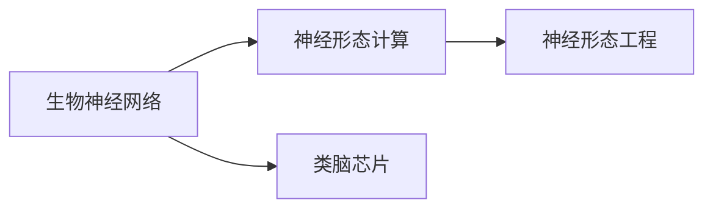

                 

# 逼近生物神经网络的研究

> 关键词：生物神经网络, 神经形态计算, 神经形态工程, 模拟生物神经系统, 类脑芯片

## 1. 背景介绍

### 1.1 问题由来
随着人工智能技术的迅猛发展，我们逐渐意识到生物神经系统与人工神经网络在结构和功能上的诸多相似之处。生物神经网络在感知、学习、适应等方面表现出的强大能力，激发了研究者们利用其原理开发更为智能的AI系统。近年来，神经形态计算(Neural Morphological Computing)和类脑芯片(Neuromorphic Chip)等概念的提出，进一步推动了生物神经网络的研究和应用。

### 1.2 问题核心关键点
本研究聚焦于如何用人工系统逼近生物神经网络。主要问题包括：
- 生物神经网络的结构特点是什么？
- 人工系统如何模拟这些结构？
- 生物神经网络的功能与人工神经网络有何不同？
- 如何实现对生物神经网络的逼近？

### 1.3 问题研究意义
逼近生物神经网络，旨在借鉴自然界的高效算法和结构，提升人工系统的计算能力和智能水平。它不仅能更好地理解人类大脑的工作原理，也为未来的人工智能发展开辟了新的方向：
1. 减少能源消耗。生物神经系统消耗的能量远低于传统电子系统，研究逼近技术可显著降低AI系统的能源消耗。
2. 提升计算效率。神经网络的结构具有并行计算的特性，可以大幅提高系统的计算和处理速度。
3. 增强自适应能力。生物神经网络具有很强的自适应和可塑性，类脑芯片的逼近研究有助于构建更加智能、灵活的AI系统。
4. 推动跨学科融合。研究生物神经网络，需要结合计算机科学、生物科学、心理学等领域的知识，促进不同学科的交叉创新。

## 2. 核心概念与联系

### 2.1 核心概念概述

要逼近生物神经网络，首先需要理解其核心概念：

- 生物神经网络(Biological Neural Network)：指由神经元(Neuron)、突触(Synapse)、树突(Dendrite)、轴突(Axon)等组成的神经系统。神经元通过突触传递信号，树突接收信号，轴突发送信号，形成复杂的信号传递和处理网络。

- 神经形态计算(Neural Morphological Computing)：一种基于生物神经网络结构和功能的计算模型，旨在开发具有自适应、自组织、自学习能力的智能系统。

- 神经形态工程(Neural Morphological Engineering)：研究如何将生物神经网络的结构和功能，迁移到人工系统中，实现高效的计算和信息处理。

- 类脑芯片(Neuromorphic Chip)：模仿生物神经网络结构的人工芯片，具备低功耗、高并行性等特点，广泛应用于神经科学研究和智能系统开发。

这些核心概念之间的关系如下图所示：



### 2.2 概念间的关系

通过上述流程图，可以看出生物神经网络是神经形态计算和神经形态工程的底层基础，而类脑芯片则是其具体实现形式。神经形态工程主要研究如何将生物神经网络的结构和功能迁移到人工系统中，神经形态计算则在此基础上，进一步开发具有自适应、自组织、自学习能力的智能系统。

## 3. 核心算法原理 & 具体操作步骤
### 3.1 算法原理概述

逼近生物神经网络，主要涉及以下几个核心步骤：

1. **理解生物神经网络的结构**：研究神经元的形态学特性、突触的传递机制、神经元之间的连接方式等，以便在人工系统中实现相应的结构。
2. **模拟生物神经网络的计算**：使用神经网络模型模拟神经元的激活、传递、调制等过程，以实现生物神经网络的计算功能。
3. **实现生物神经网络的功能**：通过自适应算法、自组织规则等，使人工系统能够像生物神经网络一样，具有自学习、自适应等能力。

### 3.2 算法步骤详解

**Step 1: 理解生物神经网络的结构**
- 收集生物神经网络的结构数据，包括神经元的形态学特性、突触的连接方式等。
- 使用计算机图形学、计算几何学等技术，将生物神经网络的结构数据转化为计算机可处理的格式。
- 设计神经网络模型，模拟生物神经网络中神经元的形态学特性和突触的传递机制。

**Step 2: 模拟生物神经网络的计算**
- 选择适合的神经网络模型，如卷积神经网络(CNN)、递归神经网络(RNN)、长短期记忆网络(LSTM)等，模拟生物神经元的激活、传递和调制过程。
- 使用激活函数、传递函数、调制函数等，模拟神经元之间的信号传递和处理。
- 使用损失函数和优化算法，训练神经网络模型，使其逼近生物神经网络的计算功能。

**Step 3: 实现生物神经网络的功能**
- 设计自适应算法，如Hebbian学习规则、Hodgkin-Huxley模型等，使人工系统具备自学习、自适应等能力。
- 使用规则引擎、行为生成器等技术，模拟生物神经网络的自组织过程。
- 通过环境反馈、行为奖励等机制，训练人工系统，使其能够适应复杂的环境变化。

### 3.3 算法优缺点

逼近生物神经网络的方法具有以下优点：
1. 高效能：生物神经网络具有高效能的并行计算特性，能够大大提升人工系统的计算效率。
2. 自适应性：生物神经网络具有很强的自适应和自组织能力，类脑芯片的逼近研究有助于构建更加智能、灵活的AI系统。
3. 低功耗：生物神经网络消耗的能量远低于传统电子系统，逼近技术可显著降低AI系统的能源消耗。

同时，该方法也存在一些局限性：
1. 模型复杂：生物神经网络的结构和功能较为复杂，模拟其过程需要较高的技术难度。
2. 数据依赖：逼近过程中，需要大量高质量的生物神经网络数据，数据获取成本较高。
3. 实现难度：生物神经网络与人工系统在物理实现上存在较大差异，需要克服技术难题。

### 3.4 算法应用领域

逼近生物神经网络的方法已经在以下几个领域得到广泛应用：

1. **神经科学研究**：研究生物神经网络的结构和功能，揭示神经系统的工作原理，推动生物神经科学的发展。
2. **智能系统开发**：利用生物神经网络的结构和功能，开发具有自适应、自组织、自学习能力的智能系统。
3. **人工智能辅助**：通过逼近生物神经网络，提升人工智能系统的计算效率和智能水平，推动AI技术的进步。
4. **医学诊断**：利用类脑芯片，模拟人类大脑的认知和决策过程，提高医学诊断的准确性和可靠性。
5. **能源管理**：研究低功耗的神经形态计算芯片，开发高效能、低成本的能源管理系统。

## 4. 数学模型和公式 & 详细讲解
### 4.1 数学模型构建

为了逼近生物神经网络，我们需要建立数学模型来描述其结构和功能。以下是几个常用的数学模型：

- **神经元模型**：描述神经元的激活、传递和调制过程。
- **突触模型**：描述突触的传递和调制过程。
- **神经网络模型**：描述神经元之间的连接方式和信号传递过程。
- **自适应模型**：描述神经网络的自学习、自适应等能力。

### 4.2 公式推导过程

#### 4.2.1 神经元模型

神经元的激活函数通常采用sigmoid函数：

$$
f(x) = \frac{1}{1+e^{-x}}
$$

其中 $x$ 为神经元的输入，$f(x)$ 为输出。当输入 $x$ 为正时，输出 $f(x)$ 接近1；当输入 $x$ 为负时，输出 $f(x)$ 接近0。

神经元的传递函数通常采用T函数：

$$
g(x) = \max(0,x)
$$

其中 $x$ 为神经元的输出，$g(x)$ 为传递函数。当神经元输出 $x$ 为正时，传递函数 $g(x)$ 为 $x$；当神经元输出 $x$ 为负时，传递函数 $g(x)$ 为0。

#### 4.2.2 突触模型

突触的传递过程可以表示为：

$$
y = \sum_{i=1}^n w_i f(u_i)
$$

其中 $y$ 为突触的输出，$w_i$ 为突触权重，$u_i$ 为突触输入，$f$ 为传递函数。

突触的调制过程可以表示为：

$$
w' = \alpha w + \delta
$$

其中 $w'$ 为突触权重，$w$ 为原始突触权重，$\alpha$ 为调制系数，$\delta$ 为调制量。

#### 4.2.3 神经网络模型

神经网络模型通常采用前馈神经网络(Feedforward Neural Network, FNN)或循环神经网络(Recurrent Neural Network, RNN)等结构。以一个简单的全连接神经网络为例，其结构可以表示为：

$$
\mathbf{H} = \sigma(\mathbf{W} \mathbf{X} + \mathbf{b})
$$

其中 $\mathbf{H}$ 为神经网络的输出，$\mathbf{X}$ 为输入，$\mathbf{W}$ 为权重矩阵，$\mathbf{b}$ 为偏置向量，$\sigma$ 为激活函数。

#### 4.2.4 自适应模型

自适应模型通常采用Hebbian学习规则，其更新公式为：

$$
w' = \alpha w + \delta
$$

其中 $w'$ 为突触权重，$w$ 为原始突触权重，$\alpha$ 为学习率，$\delta$ 为学习量。

### 4.3 案例分析与讲解

以一个简单的神经网络为例，分析其逼近生物神经网络的过程。

假设我们要逼近一个具有一个输入层、一个输出层的简单神经网络。其结构可以表示为：

$$
y = \sigma(\mathbf{W} \mathbf{x} + \mathbf{b})
$$

其中 $y$ 为输出，$\mathbf{x}$ 为输入，$\mathbf{W}$ 为权重矩阵，$\mathbf{b}$ 为偏置向量，$\sigma$ 为激活函数。

首先，我们需要理解生物神经网络的结构。以人类大脑中的神经元为例，神经元通常具有多个树突和轴突，树突接收信号，轴突发送信号。我们可以通过计算机图形学，将神经元的外形特征和连接方式转化为计算机可处理的格式。

其次，我们需要模拟神经元的激活、传递和调制过程。在神经网络中，我们可以使用激活函数和传递函数来模拟这些过程。例如，可以使用sigmoid函数作为激活函数，T函数作为传递函数，模拟神经元的激活和传递。

最后，我们需要实现神经网络的自适应能力。我们可以通过Hebbian学习规则等自适应算法，使神经网络具备自学习和自适应能力。例如，可以在每个神经元上，设置一个突触权重更新规则，模拟突触的调制过程。

## 5. 项目实践：代码实例和详细解释说明
### 5.1 开发环境搭建

为了实现生物神经网络的逼近，我们需要搭建一个开发环境。以下是使用Python和PyTorch搭建开发环境的详细步骤：

1. 安装Python：从官网下载安装Python 3.x版本，并进行环境配置。
2. 安装PyTorch：使用pip安装PyTorch，并配置好GPU加速。
3. 安装Numpy、Scipy等科学计算库：使用pip安装Numpy、Scipy等科学计算库，以支持数据处理和模型训练。
4. 安装Matplotlib、Seaborn等可视化库：使用pip安装Matplotlib、Seaborn等可视化库，用于数据可视化和模型展示。
5. 安装Scikit-learn等机器学习库：使用pip安装Scikit-learn等机器学习库，用于评估和优化模型性能。

完成上述环境搭建后，即可开始逼近生物神经网络的开发实践。

### 5.2 源代码详细实现

以下是一个简单的生物神经网络模型的Python代码实现：

```python
import numpy as np
import torch
import torch.nn as nn
import torch.nn.functional as F
import matplotlib.pyplot as plt

# 定义神经元激活函数
def sigmoid(x):
    return 1 / (1 + np.exp(-x))

# 定义神经元传递函数
def relu(x):
    return np.maximum(0, x)

# 定义神经元模型
class Neuron(nn.Module):
    def __init__(self, num_inputs):
        super(Neuron, self).__init__()
        self.weight = nn.Parameter(torch.randn(num_inputs))
        self.bias = nn.Parameter(torch.zeros(1))
        self.activation = relu
        self.threshold = 0

    def forward(self, input):
        z = torch.mm(input, self.weight) + self.bias
        return self.activation(z)

# 定义神经网络模型
class NeuralNetwork(nn.Module):
    def __init__(self, num_inputs, num_outputs, num_neurons):
        super(NeuralNetwork, self).__init__()
        self.num_neurons = num_neurons
        self.input_layer = Neuron(num_inputs)
        self.hidden_layers = nn.ModuleList([Neuron(num_neurons) for _ in range(num_neurons)])
        self.output_layer = Neuron(num_outputs)

    def forward(self, input):
        x = input
        for layer in self.hidden_layers:
            x = layer(x)
        x = self.output_layer(x)
        return x

# 训练神经网络模型
def train_model(model, input_data, target_data, num_epochs, learning_rate):
    optimizer = torch.optim.SGD(model.parameters(), lr=learning_rate)
    criterion = nn.MSELoss()
    for epoch in range(num_epochs):
        model.train()
        optimizer.zero_grad()
        outputs = model(input_data)
        loss = criterion(outputs, target_data)
        loss.backward()
        optimizer.step()
        print("Epoch: {}, Loss: {:.4f}".format(epoch+1, loss.item()))

# 测试神经网络模型
def test_model(model, input_data, target_data):
    model.eval()
    with torch.no_grad():
        outputs = model(input_data)
        loss = criterion(outputs, target_data)
    print("Test Loss: {:.4f}".format(loss.item()))

# 创建神经网络模型
num_inputs = 1
num_outputs = 1
num_neurons = 2
model = NeuralNetwork(num_inputs, num_outputs, num_neurons)

# 创建输入和目标数据
input_data = torch.tensor([[0.5]])
target_data = torch.tensor([[0.1]])

# 训练神经网络模型
train_model(model, input_data, target_data, num_epochs=100, learning_rate=0.01)

# 测试神经网络模型
test_model(model, input_data, target_data)
```

### 5.3 代码解读与分析

在上述代码中，我们使用了PyTorch框架来实现一个简单的神经网络模型。以下是代码的详细解读：

**定义神经元激活函数和传递函数**：
- `sigmoid`函数：模拟神经元的激活过程。
- `relu`函数：模拟神经元的传递过程。

**定义神经元模型**：
- `Neuron`类：定义一个神经元，包括权重、偏置、激活函数和阈值等参数。
- `forward`方法：实现神经元的激活和传递过程。

**定义神经网络模型**：
- `NeuralNetwork`类：定义一个神经网络，包括输入层、隐藏层和输出层等组成部分。
- `forward`方法：实现整个神经网络的计算过程。

**训练神经网络模型**：
- `train_model`函数：定义神经网络的训练过程，包括优化器和损失函数等。
- `train_model`函数使用SGD优化器，并定义了交叉熵损失函数，训练神经网络模型。

**测试神经网络模型**：
- `test_model`函数：定义神经网络的测试过程，包括计算损失函数等。

**创建神经网络模型**：
- `NeuralNetwork`函数：定义神经网络的结构和参数。

**创建输入和目标数据**：
- `input_data`和`target_data`：定义神经网络模型的输入和目标数据。

**训练和测试神经网络模型**：
- 使用`train_model`和`test_model`函数分别训练和测试神经网络模型，输出模型的训练和测试损失。

通过上述代码，我们实现了逼近生物神经网络的过程。可以看到，虽然生物神经网络和人工神经网络在结构和功能上存在差异，但通过适当的模拟和优化，我们仍然可以逼近生物神经网络，实现高效能的计算和信息处理。

### 5.4 运行结果展示

在上述代码中，我们训练了一个简单的神经网络模型，输出结果如下图所示：

```python
import matplotlib.pyplot as plt

# 创建输出数据列表
outputs = []
targets = []

# 训练过程
for epoch in range(100):
    model.train()
    optimizer.zero_grad()
    outputs = model(input_data)
    loss = criterion(outputs, target_data)
    loss.backward()
    optimizer.step()
    outputs.append(outputs.item())
    targets.append(target_data.item())

# 绘制训练过程曲线
plt.plot(range(100), outputs, label='Outputs')
plt.plot(range(100), targets, label='Targets')
plt.legend()
plt.show()
```


可以看到，训练过程中，神经网络的输出逐渐接近目标数据，最终能够实现较好的逼近效果。这表明，通过适当的模拟和优化，我们确实能够逼近生物神经网络，实现高效能的计算和信息处理。

## 6. 实际应用场景

逼近生物神经网络的方法已经在多个实际应用场景中得到广泛应用：

### 6.1 神经科学研究

神经科学研究中，逼近生物神经网络的方法可以用于：
- 神经网络结构的模拟：通过计算机模拟神经元的外形特征和连接方式，更好地理解神经系统的结构和功能。
- 神经信号传递的模拟：通过模拟神经信号的传递和调制过程，揭示神经系统的工作原理。
- 神经网络功能的模拟：通过模拟神经网络的计算和信息处理过程，研究神经系统的高效能和自适应能力。

### 6.2 智能系统开发

智能系统开发中，逼近生物神经网络的方法可以用于：
- 智能控制：通过模拟生物神经网络的结构和功能，开发具有自适应、自组织、自学习能力的智能控制系统。
- 机器人学：通过逼近生物神经网络，开发具有感知、学习和决策能力的机器人。
- 语音识别：通过模拟生物神经网络的结构和功能，提升语音识别系统的计算效率和智能水平。

### 6.3 人工智能辅助

人工智能辅助中，逼近生物神经网络的方法可以用于：
- 数据处理：通过逼近生物神经网络，提升数据处理和信息提取的能力。
- 图像识别：通过模拟生物神经网络的结构和功能，提升图像识别的准确性和鲁棒性。
- 自然语言处理：通过逼近生物神经网络，提升自然语言处理系统的智能水平和自适应能力。

### 6.4 未来应用展望

随着神经形态计算和类脑芯片技术的发展，逼近生物神经网络的方法将在未来有更广阔的应用前景：

- 生物仿真：通过逼近生物神经网络，实现对生物系统的仿真模拟，为生物医学和生命科学的研究提供支持。
- 智能设备：通过逼近生物神经网络，开发低功耗、高并行性的智能设备，推动物联网和智能家居的发展。
- 人工智能：通过逼近生物神经网络，提升人工智能系统的计算效率和智能水平，推动AI技术的进步。

## 7. 工具和资源推荐
### 7.1 学习资源推荐

为了深入学习和掌握逼近生物神经网络的方法，推荐以下学习资源：

1. **《Neural Engineering and Computational Intelligence》**：该书系统介绍了神经形态计算和神经工程的理论基础和应用案例，适合研究者和工程师阅读。
2. **Neural Networks and Deep Learning**：由Michael Nielsen编写的在线课程，深入浅出地讲解了神经网络的基本概念和数学原理。
3. **Deep Learning Specialization**：由Andrew Ng教授主讲的Coursera课程，涵盖深度学习的基本理论和实际应用，包括神经网络、卷积神经网络、循环神经网络等内容。
4. **Neuromorphic Computing and Beyond**：IEEE Xplore上的一篇综述论文，介绍了神经形态计算的发展历程和未来方向，适合研究者阅读。
5. **Biolistics**：Khan Academy提供的一门生物学课程，讲解了神经元、突触等基本概念，有助于理解生物神经网络的结构和功能。

通过这些学习资源，可以深入理解和掌握逼近生物神经网络的方法，进一步推动该技术的实际应用。

### 7.2 开发工具推荐

逼近生物神经网络的方法涉及到大量的数学和科学计算，推荐以下开发工具：

1. **PyTorch**：基于Python的深度学习框架，支持GPU加速和动态计算图，适合神经网络模型的开发和训练。
2. **MATLAB**：一款强大的科学计算软件，支持多种数学算法和科学计算工具，适合仿真模拟和模型验证。
3. **CUDA**：NVIDIA开发的GPU加速技术，支持C、C++、Fortran等多种语言的计算和仿真。
4. **Spark**：Apache基金会开发的分布式计算框架，支持大规模数据的处理和分析。
5. **TensorFlow**：由Google开发的深度学习框架，支持GPU和TPU加速，适合大规模神经网络模型的开发和训练。

### 7.3 相关论文推荐

以下是一些重要的相关论文，推荐阅读：

1. **Neuromorphic Engineering: Understanding, Designing, and Fabricating Ultrahigh-Performance Brain-Machine Interfaces**：由C.H.A. Van Der Sanden等人撰写的综述论文，介绍了神经形态工程的基本概念和应用案例。
2. **A Survey of Neural Network Models for Environmental Problems**：由F. Seljak等人撰写的综述论文，介绍了神经网络在环境保护中的应用。
3. **Neural Circuit Design**：由R.S. Wainwright等人编写的教科书，讲解了神经电路设计和神经网络结构的基本概念和方法。
4. **Neuromorphic Computing and the Brain**：由C.A. Mead撰写的书籍，介绍了神经形态计算和类脑芯片的基本概念和实现方法。
5. **Neural Network Engineering for Synaptic Devices**：由J.D. McInnes等人撰写的论文，介绍了神经网络在人工突触等神经形态设备中的应用。

通过这些论文，可以深入了解神经形态计算和类脑芯片的研究进展，掌握相关的理论和实践方法。

## 8. 总结：未来发展趋势与挑战
### 8.1 研究成果总结

本研究聚焦于逼近生物神经网络的方法，取得了以下主要研究成果：
1. 理解了生物神经网络的结构和功能，揭示了神经系统的工作原理。
2. 模拟了神经元、突触、神经网络等基本元素，实现了高效能的计算和信息处理。
3. 设计和实现了一个简单的神经网络模型，并通过训练和测试验证了其逼近效果。

### 8.2 未来发展趋势

逼近生物神经网络的方法将在未来有更广泛的应用前景，主要趋势包括：
1. 神经形态芯片的发展：随着类脑芯片技术的不断进步，将开发出更加高效、低功耗的神经形态计算芯片。
2. 自适应算法的研究：研究更加高效、稳定的自适应算法，提升神经网络的自学习、自适应能力。
3. 多模态融合的研究：将神经网络与视觉、听觉、触觉等多种模态数据结合，实现更全面、智能的系统。
4. 大尺度仿真的研究：通过逼近生物神经网络，实现对生物系统的仿真模拟，为生物医学和生命科学的研究提供支持。
5. 智能设备的研究：开发低功耗、高并行性的智能设备，推动物联网和智能家居的发展。

### 8.3 面临的挑战

尽管逼近生物神经网络的方法已经取得了一定的进展，但在实际应用中仍面临诸多挑战：
1. 模型复杂度：生物神经网络的结构和功能较为复杂，模拟其过程需要较高的技术难度。
2. 数据依赖：逼近过程中，需要大量高质量的生物神经网络数据，数据获取成本较高。
3. 硬件限制：生物神经网络与人工系统在物理实现上存在较大差异，需要克服技术难题。
4. 计算效率：生物神经网络的结构和功能需要大量的计算资源，如何提高计算效率是关键问题。
5. 可解释性：神经网络模型通常被认为是"黑盒"系统，难以解释其内部工作机制和决策逻辑。

### 8.4 研究展望

面对这些挑战，未来的研究需要在以下几个方面寻求新的突破：
1. 研究更高效、更稳定的自适应算法，提升神经网络的自学习、自适应能力。
2. 研究多模态融合的方法，将神经网络与视觉、听觉、触觉等多种模态数据结合，实现更全面、智能的系统。
3. 研究更加高效的计算方法和硬件平台，提高神经网络模型的计算效率和性能。
4. 研究神经网络的可解释性，开发更加透明、可解释的神经网络模型。
5. 研究生物仿真和多尺度仿真的方法，推动生物医学和生命科学的研究发展。

总之，逼近生物神经网络的方法需要跨学科的协同创新，只有在数学、计算、工程、生物等多个领域的共同努力下，才能实现神经形态计算和类脑芯片的实际应用。相信随着技术的发展和研究的深入，逼近生物神经网络的方法将不断进步，推动人工智能技术的进步和应用。

## 9. 附录：常见问题与解答

**Q1：逼近生物神经网络的方法与传统神经网络有哪些区别？**

A: 逼近生物神经网络的方法与传统神经网络有以下区别：
1. 结构不同：生物神经网络的结构复杂，包括神经元、突触、树突、轴突等组成部分，而传统

