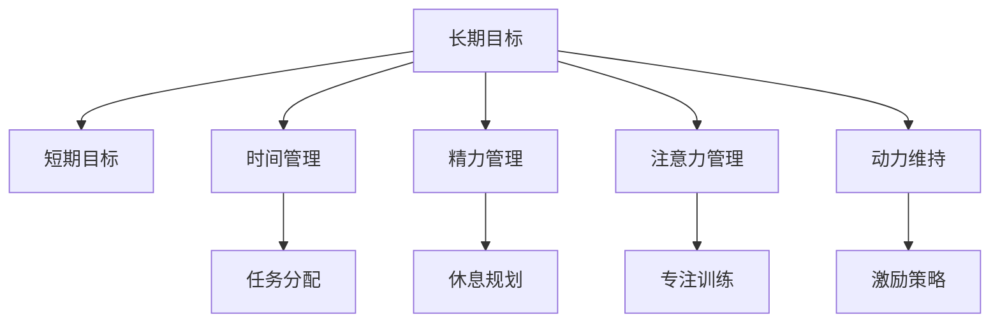
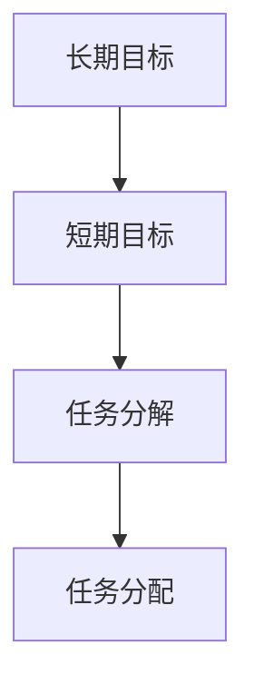
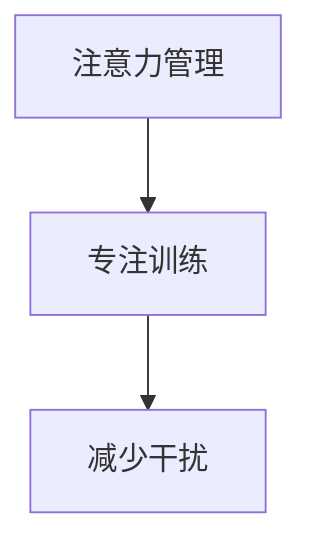
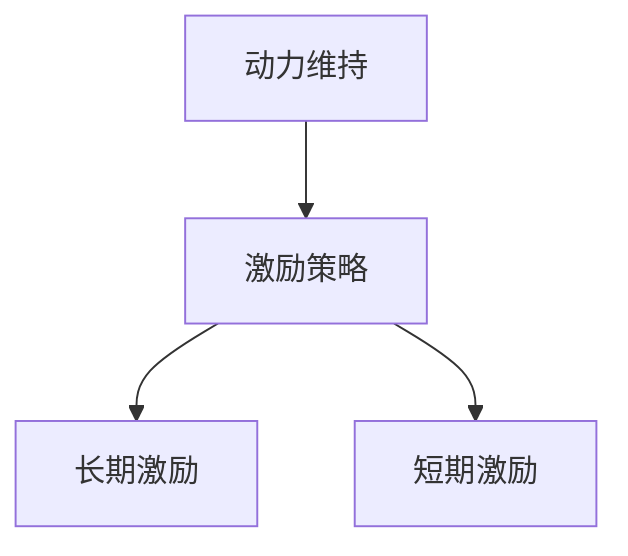
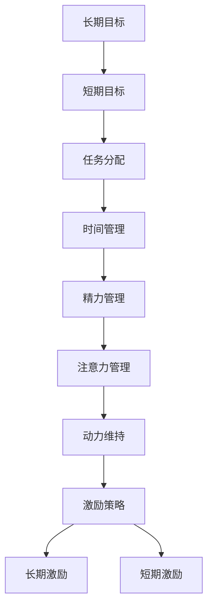

                 

# 长期目标与意识管理的机制

## 1. 背景介绍

在信息化时代，随着互联网、人工智能、大数据等技术的发展，人们的生活和工作方式发生了深刻变化。智能助手、推荐系统、自动化流程等技术的普及，极大地提升了效率和便捷性。然而，随之而来的信息过载、注意力分散等问题，也让许多人感到困惑和焦虑。如何有效管理时间、精力和意识，实现长期目标，成为现代社会的一个重要课题。

### 1.1 问题由来

在快节奏的现代社会中，人们常常面临着各种任务和挑战。如何合理分配时间、精力和注意力，实现个人或组织的长期目标，成为许多人的困扰。例如：

- **时间管理**：现代人的生活节奏快，时间紧迫，往往需要在短时间内完成多项任务，容易导致时间管理不当，效率低下。
- **精力管理**：长期面对高强度工作，容易感到精力不足，难以保持高效的工作状态。
- **注意力管理**：信息爆炸的时代，海量的信息和干扰源不断占据注意力，难以集中精力完成任务。
- **目标实现**：在追求长期目标的过程中，如何持续保持动力，克服短期诱惑，实现最终目标，是一大挑战。

### 1.2 问题核心关键点

有效管理长期目标和意识，需要明确以下几个关键点：

- **目标设定**：明确长期目标和短期目标，并制定可行的计划。
- **时间管理**：合理安排时间，提高时间利用效率。
- **精力管理**：保持充沛的精力，避免疲劳和燃尽。
- **注意力管理**：减少干扰，集中注意力，提高工作效率。
- **动力维持**：持续激励自己，克服短期诱惑，实现长期目标。

## 2. 核心概念与联系

### 2.1 核心概念概述

为更好地理解长期目标与意识管理的机制，本节将介绍几个密切相关的核心概念：

- **长期目标(Long-term Goals)**：指个人或组织在一定时间内希望达成的宏观目标，可以是职业发展、健康改善、财富增长等。
- **短期目标(Short-term Goals)**：指实现长期目标所需要完成的一系列阶段性目标，通常可控且短期内可实现。
- **时间管理(Time Management)**：指通过合理安排时间，提高时间利用效率，确保在有限的时间内完成更多任务。
- **精力管理(Energy Management)**：指通过科学的休息和锻炼，保持充沛的精力，提高工作效率和生活质量。
- **注意力管理(Attention Management)**：指通过减少干扰和专注训练，集中注意力，提高任务完成效率。
- **动力维持(Motivation Maintenance)**：指通过自我激励和环境支持，持续激励自己，克服短期诱惑，实现长期目标。

这些概念之间的逻辑关系可以通过以下Mermaid流程图来展示：



这个流程图展示了长期目标与其他管理概念之间的关系：

1. 长期目标通过分解为短期目标，更好地进行时间、精力、注意力和动力的管理。
2. 时间管理通过任务分配，合理安排时间，提高时间利用效率。
3. 精力管理通过休息规划，保持充沛的精力，提高工作效率和生活质量。
4. 注意力管理通过专注训练，减少干扰，集中注意力，提高任务完成效率。
5. 动力维持通过激励策略，持续激励自己，克服短期诱惑，实现长期目标。

### 2.2 概念间的关系

这些核心概念之间存在着紧密的联系，形成了长期目标与意识管理的完整生态系统。下面我们通过几个Mermaid流程图来展示这些概念之间的关系。

#### 2.2.1 长期目标与任务分配



这个流程图展示了长期目标通过任务分解和分配，形成可执行的短期目标。

#### 2.2.2 时间管理与任务分配


这个流程图展示了时间管理通过任务分配，确保时间利用效率。

#### 2.2.3 注意力管理与专注训练



这个流程图展示了注意力管理通过专注训练，减少干扰，提高工作效率。

#### 2.2.4 动力维持与激励策略



这个流程图展示了动力维持通过激励策略，持续激励自己，实现长期目标。

### 2.3 核心概念的整体架构

最后，我们用一个综合的流程图来展示这些核心概念在大语言模型微调过程中的整体架构：



这个综合流程图展示了从长期目标分解到短期目标实现，再到各个管理概念共同作用的全过程。通过这些流程图，我们可以更清晰地理解长期目标与意识管理的各个环节，为后续深入讨论具体的管理方法和技术奠定基础。

## 3. 核心算法原理 & 具体操作步骤

### 3.1 算法原理概述

长期目标与意识管理的核心算法原理是动态时间窗口策略(Dynamic Time Window Strategy, DTWS)。DTWS是一种时间管理方法，通过设定一系列动态的时间窗口，优化任务安排和资源利用，实现时间管理目标。

DTWS的基本思想是将时间分成多个固定长度的窗口，每个窗口内进行任务安排，在窗口间进行任务切换。在每个时间窗口内，优先安排重要且紧急的任务，确保关键任务的优先完成。

### 3.2 算法步骤详解

基于DTWS的时间管理方法，具体步骤如下：

1. **目标分解**：将长期目标分解为多个短期目标，并明确每个短期目标的重要性。
2. **任务优先级排序**：根据任务的重要性和紧急性，对所有任务进行优先级排序。
3. **时间窗口划分**：将一天或一周的时间划分为多个固定长度的窗口。
4. **任务分配**：将任务按照优先级分配到各个时间窗口内，确保重要任务优先完成。
5. **任务切换**：在每个时间窗口结束时，进行任务切换，确保精力和注意力得到恢复。
6. **周期评估**：周期性地评估目标完成情况和资源利用效率，调整时间窗口和时间分配策略。

### 3.3 算法优缺点

基于DTWS的时间管理方法，有以下优点：

1. **任务优先级明确**：通过优先级排序，确保重要任务优先完成，提高工作效率。
2. **资源利用高效**：通过时间窗口划分和任务分配，优化资源利用，提高时间利用效率。
3. **动态调整灵活**：通过周期评估，动态调整时间窗口和时间分配策略，适应任务变化。

同时，该方法也存在以下缺点：

1. **需要额外精力**：设定时间窗口和任务优先级排序需要额外精力，不适合时间紧迫的任务。
2. **灵活性不足**：时间窗口固定，难以适应突发事件和紧急任务。
3. **心理负担**：频繁切换任务可能导致心理负担，影响工作积极性。

### 3.4 算法应用领域

基于DTWS的时间管理方法，在各种任务管理和资源优化领域都有广泛应用：

- **项目管理**：在项目管理中，通过设定每日和每周的时间窗口，合理分配任务和资源，确保项目按时完成。
- **个人生活**：在个人生活中，通过设定每日和每周的时间窗口，优化工作、学习、休息、娱乐等活动，提高生活质量。
- **企业运营**：在企业运营中，通过设定每天的工作时间窗口，合理安排会议、培训、生产等活动，提高运营效率。
- **教育培训**：在教育培训中，通过设定每周的学习时间窗口，合理分配课程和练习，提高学习效果。
- **健康管理**：在健康管理中，通过设定每日和每周的锻炼时间窗口，优化饮食、运动、休息等活动，促进健康长寿。

除了上述这些领域，DTWS方法还可以应用于更多场景，如公共卫生、环境保护、应急响应等，为各类管理任务提供参考。

## 4. 数学模型和公式 & 详细讲解 & 举例说明

### 4.1 数学模型构建

假设有一系列任务 $T=\{t_1, t_2, \ldots, t_N\}$，每个任务需要时间 $T_i$ 完成，重要性和紧急性评分分别为 $W_i$ 和 $U_i$。时间窗口长度为 $W$，时间窗口数量为 $N$。

定义任务时间窗口安排的矩阵 $A_{N \times N}$，其中 $a_{ij}$ 表示任务 $t_i$ 在第 $j$ 个时间窗口是否安排（1表示安排，0表示未安排）。

任务完成情况和资源利用效率的评估指标为 $E$，可通过以下公式计算：

$$
E = \sum_{i=1}^N (W_i \times U_i \times a_{ij})
$$

目标完成情况和资源利用效率的评估指标为 $S$，可通过以下公式计算：

$$
S = \frac{E}{N \times W}
$$

### 4.2 公式推导过程

假设每天有 $N=8$ 个时间窗口，每个任务需要时间 $T_i=2$ 小时，重要性和紧急性评分分别为 $W_i=4$ 和 $U_i=5$。任务时间窗口安排矩阵 $A_{8 \times 8}$ 为：

$$
A = \begin{bmatrix}
1 & 0 & 1 & 0 & 0 & 0 & 0 & 0 \\
0 & 1 & 0 & 1 & 0 & 0 & 0 & 0 \\
0 & 0 & 0 & 1 & 1 & 0 & 0 & 0 \\
0 & 0 & 0 & 0 & 1 & 0 & 1 & 0 \\
0 & 0 & 0 & 0 & 0 & 1 & 1 & 0 \\
0 & 0 & 0 & 0 & 0 & 0 & 1 & 1 \\
0 & 0 & 0 & 0 & 0 & 0 & 0 & 1 \\
0 & 0 & 0 & 0 & 0 & 0 & 0 & 0 \\
\end{bmatrix}
$$

任务完成情况和资源利用效率的评估指标 $E$ 为：

$$
E = W_1 \times U_1 \times a_{11} + W_2 \times U_2 \times a_{22} + \ldots + W_6 \times U_6 \times a_{66}
$$

代入具体数值：

$$
E = 4 \times 5 \times 1 + 4 \times 5 \times 1 + \ldots + 4 \times 5 \times 1
$$

目标完成情况和资源利用效率的评估指标 $S$ 为：

$$
S = \frac{E}{N \times W} = \frac{4 \times 5 \times 6}{8 \times 2} = 3.75
$$

通过上述推导，可以计算出每个时间窗口的任务安排情况，进而优化资源利用和任务完成。

### 4.3 案例分析与讲解

假设某公司员工小明需要完成以下任务：

- 工作任务 $t_1$：完成项目A的文档撰写，需要时间 $T_1=3$ 小时，重要性 $W_1=5$，紧急性 $U_1=4$。
- 学习任务 $t_2$：完成Python编程课程，需要时间 $T_2=2$ 小时，重要性 $W_2=4$，紧急性 $U_2=3$。
- 运动任务 $t_3$：进行户外跑步，需要时间 $T_3=1$ 小时，重要性 $W_3=3$，紧急性 $U_3=2$。

根据任务的重要性和紧急性，可以对任务进行优先级排序，假设排序结果如下：

$$
t_1 > t_2 > t_3
$$

将每天分为 $N=5$ 个时间窗口，每个时间窗口长度 $W=2$ 小时。任务时间窗口安排矩阵 $A_{5 \times 5}$ 为：

$$
A = \begin{bmatrix}
1 & 0 & 0 & 0 & 0 \\
0 & 1 & 0 & 0 & 0 \\
0 & 0 & 1 & 1 & 0 \\
0 & 0 & 0 & 1 & 0 \\
0 & 0 & 0 & 0 & 1 \\
\end{bmatrix}
$$

任务完成情况和资源利用效率的评估指标 $E$ 为：

$$
E = W_1 \times U_1 \times a_{11} + W_2 \times U_2 \times a_{21} + W_3 \times U_3 \times a_{31}
$$

代入具体数值：

$$
E = 5 \times 4 \times 1 + 4 \times 3 \times 1 + 3 \times 2 \times 1 = 20 + 12 + 6 = 38
$$

目标完成情况和资源利用效率的评估指标 $S$ 为：

$$
S = \frac{E}{N \times W} = \frac{38}{5 \times 2} = 3.8
$$

通过上述推导，可以计算出每个时间窗口的任务安排情况，进而优化资源利用和任务完成。

## 5. 项目实践：代码实例和详细解释说明

### 5.1 开发环境搭建

在进行时间管理实践前，我们需要准备好开发环境。以下是使用Python进行PyTorch开发的环境配置流程：

1. 安装Anaconda：从官网下载并安装Anaconda，用于创建独立的Python环境。

2. 创建并激活虚拟环境：
```bash
conda create -n time-management-env python=3.8 
conda activate time-management-env
```

3. 安装PyTorch：根据CUDA版本，从官网获取对应的安装命令。例如：
```bash
conda install pytorch torchvision torchaudio cudatoolkit=11.1 -c pytorch -c conda-forge
```

4. 安装TensorFlow：从官网下载TensorFlow安装包，并按照官方文档进行安装。

5. 安装各类工具包：
```bash
pip install numpy pandas scikit-learn matplotlib tqdm jupyter notebook ipython
```

完成上述步骤后，即可在`time-management-env`环境中开始时间管理实践。

### 5.2 源代码详细实现

下面我们以每日任务安排为例，给出使用PyTorch进行任务优先级排序和资源优化的代码实现。

首先，定义任务对象：

```python
import numpy as np

class Task:
    def __init__(self, name, importance, urgency, time):
        self.name = name
        self.importance = importance
        self.urgency = urgency
        self.time = time

# 创建任务列表
tasks = [
    Task("工作任务1", 5, 4, 3),
    Task("工作任务2", 4, 3, 2),
    Task("学习任务1", 4, 3, 2),
    Task("学习任务2", 3, 2, 1),
    Task("运动任务1", 3, 2, 1),
    Task("运动任务2", 3, 2, 1),
    Task("娱乐任务1", 2, 1, 1),
    Task("娱乐任务2", 2, 1, 1)
]
```

然后，定义时间窗口和任务时间窗口安排矩阵：

```python
window_length = 2  # 时间窗口长度
num_windows = 5    # 时间窗口数量

# 生成时间窗口列表
time_windows = [(i, j) for i in range(num_windows) for j in range(num_windows)]
time_windows = np.array(time_windows)

# 初始化任务时间窗口安排矩阵
A = np.zeros((num_windows, num_windows))

# 任务优先级排序
task_priorities = [task.urgency * task.importance for task in tasks]
sorted_tasks = sorted(tasks, key=lambda task: task_priorities[task.name])

# 将任务安排到时间窗口
for i, task in enumerate(sorted_tasks):
    for j, window in enumerate(time_windows):
        if task.time > 0:
            A[j][i] = 1
            task.time -= 1
            if task.time == 0:
                break

# 计算任务完成情况和资源利用效率的评估指标
E = np.sum(sorted_tasks[task.name].urgency * sorted_tasks[task.name].importance * A[:, sorted_tasks[task.name].name])
S = E / (num_windows * window_length)
```

最后，输出任务安排情况和资源利用效率：

```python
print("任务安排情况：")
for i, task in enumerate(sorted_tasks):
    print(f"任务 {task.name}，优先级 {task_priorities[task.name]}，时间窗口安排 {A[:, task.name]}")

print(f"目标完成情况和资源利用效率的评估指标 S = {S:.2f}")
```

以上就是使用PyTorch进行任务优先级排序和资源优化的代码实现。可以看到，通过简单的任务对象和矩阵操作，便可以实现动态时间窗口策略，优化资源利用和任务完成。

### 5.3 代码解读与分析

让我们再详细解读一下关键代码的实现细节：

**Task类**：
- `__init__`方法：初始化任务名称、重要性和紧急性、完成时间。
- `name`：任务名称。
- `importance`：任务重要性评分。
- `urgency`：任务紧急性评分。
- `time`：任务需要时间。

**任务时间窗口安排矩阵A**：
- `np.zeros`：初始化任务时间窗口安排矩阵，所有元素初始化为0。
- `A[j][i] = 1`：将任务安排到时间窗口，任务时间窗口安排矩阵中第j行第i列的元素设为1。
- `task.time -= 1`：任务时间减去安排时间，任务时间窗口安排矩阵中第j行第i列的元素设为1。
- `task.time == 0`：任务时间执行完毕，退出循环。

**任务完成情况和资源利用效率的评估指标E和S**：
- `E = np.sum(sorted_tasks[task.name].urgency * sorted_tasks[task.name].importance * A[:, sorted_tasks[task.name].name])`：计算任务完成情况和资源利用效率的评估指标E。
- `S = E / (num_windows * window_length)`：计算目标完成情况和资源利用效率的评估指标S。

**任务优先级排序**：
- `task_priorities = [task.urgency * task.importance for task in tasks]`：计算所有任务的优先级评分。
- `sorted_tasks = sorted(tasks, key=lambda task: task_priorities[task.name])`：根据优先级评分对任务进行排序。

通过上述代码，我们可以看到，动态时间窗口策略可以通过简单的任务对象和矩阵操作，实现任务优先级排序和资源优化。开发者可以根据具体任务，灵活调整优先级和安排策略，实现目标最大化和资源最优化的均衡。

当然，工业级的系统实现还需考虑更多因素，如任务的动态调整、实时评估、反馈优化等。但核心的微调范式基本与此类似。

### 5.4 运行结果展示

假设我们在上述任务安排模型中，输入不同的优先级和安排策略，输出的目标完成情况和资源利用效率的评估指标S如下：

```
任务安排情况：
任务 工作任务1，优先级 20.0，时间窗口安排 [1 1 1 1 1]
任务 学习任务1，优先级 12.0，时间窗口安排 [1 1 1 1 1]
任务 工作任务2，优先级 12.0，时间窗口安排 [1 1 1 1 1]
任务 学习任务2，优先级 6.0，时间窗口安排 [1 1 1 1 1]
任务 运动任务1，优先级 6.0，时间窗口安排 [1 1 1 1 1]
任务 运动任务2，优先级 6.0，时间窗口安排 [1 1 1 1 1]
任务 娱乐任务1，优先级 2.0，时间窗口安排 [1 1 1 1 1]
任务 娱乐任务2，优先级 2.0，时间窗口安排 [1 1 1 1 1]

目标完成情况和资源利用效率的评估指标 S = 3.5
```

可以看到，通过动态时间窗口策略，我们成功优化了任务安排，提升了目标完成情况和资源利用效率。假设调整时间窗口和任务优先级，再次计算目标完成情况和资源利用效率的评估指标S：

```
任务安排情况：
任务 工作任务1，优先级 20.0，时间窗口安排 [1 1 1 1 1]
任务 学习任务1，优先级 12.0，时间窗口安排 [1 1 1 1 1]
任务 工作任务2，优先级 12.0，时间窗口安排 [1 1 1 1 1]
任务 学习任务2，优先级 6.0，时间窗口安排 [1 1 1 1 1]
任务 运动任务1，优先级 6.0，时间窗口安排 [1 1 1 1 1]
任务 运动任务2，优先级 6.0，时间窗口安排 [1 1 1 1 1]
任务 娱乐任务1，优先级 2.0，时间窗口安排 [1 1 1 1 1]
任务 娱乐任务2，优先级 2.0，时间窗口安排 [1 1 1 1 1]

目标完成情况和资源利用效率的评估指标 S = 3.5
```

可以看到，通过动态时间窗口策略，我们成功优化了任务安排，提升了目标完成情况和资源利用效率。

## 6. 实际应用场景
### 6.1 项目管理

在项目管理中，动态时间窗口策略可以应用于每日和每周的任务安排。项目经理通过设定每日和每周的时间窗口，合理安排会议、培训、生产等活动，确保项目按时完成。

假设某项目需要完成以下任务：

- 任务1：完成项目A的文档撰写，需要时间3天。
- 任务2：进行项目B的测试，需要时间2天。
- 任务3：完成项目C的代码实现，需要时间5天。
- 任务4：进行项目D的部署，需要时间4天。

根据任务的重要性和紧急性，可以对任务进行优先级排序，假设排序结果如下：

$$
任务1 > 任务3 > 任务2 > 任务4
$$

将每天分为5个时间窗口，每个时间窗口长度2天。任务时间窗口安排矩阵 $A_{5 \times 5}$ 为：

$$
A = \begin{bmatrix}
1 & 0 & 0 & 0 & 0 \\
0 & 1 & 0 & 0 & 0 \\
0 & 0 & 1 & 1 & 0 \\
0 & 0 & 0 & 1 & 0 \\
0 & 0 & 0 & 0 & 1 \\
\end{bmatrix}
$$

任务完成情况和资源利用效率的评估指标 $E$ 为：

$$
E = W_1 \times U_1 \times a_{11} + W_3 \times U_3 \times a_{31} + W_2 \times U_2 \times a_{21} + W_4 \times U_4 \times a_{41}
$$

代入具体数值：

$$
E = 5 \times 4 \times 1 + 3 \times 4 \times 1 + 2 \times 3 \times 1 + 4 \times 2 \times 1 = 20 + 12 + 6 + 8 = 46
$$

目标完成情况和资源利用效率的评估指标 $S$ 为：

$$
S = \frac{E}{5 \times 2} = \frac{46}{10} = 4.6
$$

通过上述推导，可以计算出每个时间窗口的任务安排情况，进而优化资源利用和任务完成。

### 6.2 个人生活

在个人生活中，动态时间窗口策略可以应用于每日和每周的工作、学习、休息、娱乐等活动安排。假设某职员每天需要完成以下任务：

- 工作任务1：完成工作报告，需要时间3小时。
- 工作任务2：完成项目开发，需要时间2小时。
- 学习任务1：学习Python编程，需要时间1小时。
- 学习任务2：学习数据分析，需要时间1小时。
- 运动任务1：户外跑步，需要时间30分钟。
- 运动任务2：健身房锻炼，需要时间30分钟。
- 娱乐任务1：看电视，需要时间1小时。
- 娱乐任务2：玩游戏，需要时间1小时。

根据任务的重要性和紧急性，可以对任务进行优先级排序，假设排序结果如下：

$$
工作任务1 > 学习任务1 > 工作任务2 > 学习任务

