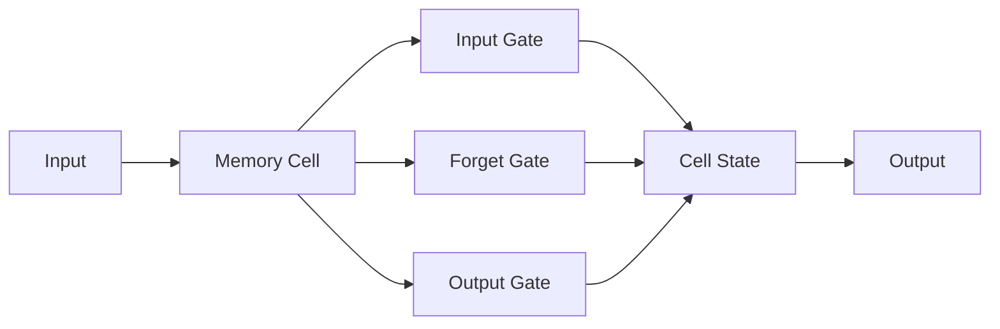

                 

# 长短期记忆网络(Long Short-Term Memory) - 原理与代码实例讲解

> 关键词：长短期记忆网络, 递归神经网络(RNN), 循环单元, 序列建模, 动态神经网络, 记忆单元, 梯度消失

## 1. 背景介绍

长短期记忆网络（Long Short-Term Memory, LSTM）是由Hochreiter和Schmidhuber在1997年提出的一种递归神经网络（Recurrent Neural Network, RNN）结构，旨在解决RNN在处理长序列数据时的梯度消失问题。LSTM因其独特的结构设计，能够在处理时间序列数据时，有效控制信息的传递与遗忘，是目前应用最广泛的序列建模模型之一。

LSTM网络的核心思想是通过引入记忆单元（Memory Cell）和三个门控单元（输入门、遗忘门和输出门），实现对信息的动态管理，从而在长期依赖关系中保持信息的有效性，并通过门控机制实现对无用信息的过滤，避免梯度消失和梯度爆炸现象。LSTM在自然语言处理（Natural Language Processing, NLP）、语音识别、图像描述生成等领域有着广泛的应用，是深度学习领域的重要里程碑。

## 2. 核心概念与联系

### 2.1 核心概念概述

- **递归神经网络 (RNN)**：RNN是一种能够处理序列数据的神经网络结构，其基本思想是通过循环结构将当前输入和先前的隐藏状态结合起来，传递信息并更新状态。

- **长短期记忆网络 (LSTM)**：LSTM是一种特殊的RNN结构，通过记忆单元和三个门控单元，有效控制信息的流动，解决了RNN在处理长序列数据时梯度消失的问题。

- **记忆单元 (Memory Cell)**：记忆单元是LSTM的核心组件，用于存储和传递信息，可以通过三个门控单元控制信息的流动。

- **输入门 (Input Gate)**：输入门用于决定哪些信息应该被更新到记忆单元中，它通过sigmoid激活函数计算，输出一个0到1之间的值。

- **遗忘门 (Forget Gate)**：遗忘门用于决定哪些信息应该被遗忘，它同样通过sigmoid激活函数计算，输出一个0到1之间的值。

- **输出门 (Output Gate)**：输出门用于决定哪些信息应该被输出，它通过sigmoid激活函数和tanh激活函数计算，输出一个0到1之间的值。

- **梯度消失**：在RNN中，由于链式法则的传播，梯度在反向传播过程中可能会不断缩小，导致较早的层几乎无法更新，从而影响模型的学习能力。

- **梯度爆炸**：与梯度消失相反，梯度可能会变得非常大，导致数值不稳定和计算效率低下。

### 2.2 概念间的关系

LSTM结构可以通过以下Mermaid流程图来展示：



这个流程图展示了LSTM的基本结构，其中：
- 输入层接收到当前的输入。
- 输入门、遗忘门和输出门分别计算决定哪些信息应该更新、遗忘或输出。
- 记忆单元用于存储和传递信息。

通过这些门控单元，LSTM可以动态地控制信息的流动，避免梯度消失和爆炸，从而更好地处理长序列数据。

## 3. 核心算法原理 & 具体操作步骤

### 3.1 算法原理概述

LSTM通过引入记忆单元和门控单元，有效控制信息的流动，避免了梯度消失和梯度爆炸的问题。其核心思想是通过三个门控单元（输入门、遗忘门和输出门）来动态管理记忆单元的内容，从而实现对序列数据的有效建模。

LSTM的训练过程可以通过反向传播算法（Backpropagation Through Time, BPTT）来进行，即通过计算梯度并反向传播到网络中的每个时间步，更新模型的权重。具体来说，LSTM的每个时间步的损失函数可以通过链式法则进行分解，然后通过反向传播算法来更新所有时间步的参数。

### 3.2 算法步骤详解

1. **初始化**：随机初始化网络参数，如权重和偏置。
2. **前向传播**：对于每个时间步，将输入和先前的隐藏状态传递到记忆单元和三个门控单元，计算当前的隐藏状态和输出。
3. **反向传播**：计算当前时间步的梯度，并逐个时间步地传播到之前的时间步，更新所有参数。
4. **循环更新**：重复执行前向传播和反向传播，直到处理完所有时间步。
5. **最终输出**：通过训练后的模型，可以对新的序列数据进行预测。

### 3.3 算法优缺点

#### 优点：

- **处理长序列能力**：LSTM能够有效处理长序列数据，避免梯度消失和梯度爆炸问题。
- **信息动态管理**：通过记忆单元和三个门控单元，LSTM能够动态控制信息的流动，保留重要信息，忘记无用信息。
- **序列建模能力强**：LSTM在序列建模方面表现出色，广泛应用于NLP、语音识别等任务。

#### 缺点：

- **计算复杂度高**：LSTM的计算复杂度较高，特别是在处理长序列数据时。
- **参数量较大**：LSTM的参数量较大，训练和推理时对计算资源的需求较高。
- **过拟合风险**：LSTM在处理长序列数据时，容易出现过拟合现象。

### 3.4 算法应用领域

LSTM在以下领域有着广泛的应用：

- **自然语言处理 (NLP)**：LSTM在文本分类、情感分析、机器翻译等任务上表现出色。
- **语音识别**：LSTM可以用于语音识别和语音生成，如自动语音识别（ASR）、文本转语音（TTS）等。
- **图像描述生成**：LSTM可以与卷积神经网络（CNN）结合，用于图像描述生成任务。
- **视频分析**：LSTM可以用于视频分析，如视频分类、行为识别等。

## 4. 数学模型和公式 & 详细讲解  
### 4.1 数学模型构建

LSTM的数学模型由三个门控单元和记忆单元组成。对于第$t$个时间步的输入$x_t$和前一个时间步的隐藏状态$h_{t-1}$，LSTM的记忆单元$C_t$和隐藏状态$h_t$可以表示为：

$$
\begin{aligned}
    &\tilde{C}_t = \tanh(W_{xh}x_t + U_{xh}h_{t-1} + b_h) \\
    &i_t = \sigma(W_{xi}x_t + U_{xi}h_{t-1} + b_i) \\
    &f_t = \sigma(W_{xf}x_t + U_{xf}h_{t-1} + b_f) \\
    &o_t = \sigma(W_{xo}x_t + U_{xo}h_{t-1} + b_o) \\
    &C_t = f_t \cdot C_{t-1} + i_t \cdot \tilde{C}_t \\
    &h_t = o_t \cdot \tanh(C_t)
\end{aligned}
$$

其中，$\tanh$和$\sigma$分别表示tanh和sigmoid激活函数，$W_{xh}$、$U_{xh}$、$W_{xi}$、$U_{xi}$、$W_{xf}$、$U_{xf}$、$W_{xo}$、$U_{xo}$是权重矩阵，$b_h$、$b_i$、$b_f$、$b_o$是偏置项。$i_t$、$f_t$、$o_t$分别表示输入门、遗忘门和输出门的激活值，$C_t$表示第$t$个时间步的记忆单元状态，$h_t$表示第$t$个时间步的隐藏状态。

### 4.2 公式推导过程

LSTM的公式推导基于以下三个核心组件：记忆单元$C_t$、输入门$i_t$、遗忘门$f_t$和输出门$o_t$。这些组件通过sigmoid和tanh激活函数来计算，具体如下：

1. **输入门$i_t$**：输入门用于决定哪些信息应该被更新到记忆单元中，其计算公式为：
$$
i_t = \sigma(W_{xi}x_t + U_{xi}h_{t-1} + b_i)
$$
其中，$W_{xi}$和$U_{xi}$是输入门的权重矩阵，$b_i$是偏置项。

2. **遗忘门$f_t$**：遗忘门用于决定哪些信息应该被遗忘，其计算公式为：
$$
f_t = \sigma(W_{xf}x_t + U_{xf}h_{t-1} + b_f)
$$
其中，$W_{xf}$和$U_{xf}$是遗忘门的权重矩阵，$b_f$是偏置项。

3. **输出门$o_t$**：输出门用于决定哪些信息应该被输出，其计算公式为：
$$
o_t = \sigma(W_{xo}x_t + U_{xo}h_{t-1} + b_o)
$$
其中，$W_{xo}$和$U_{xo}$是输出门的权重矩阵，$b_o$是偏置项。

4. **记忆单元$C_t$**：记忆单元用于存储和传递信息，其计算公式为：
$$
C_t = f_t \cdot C_{t-1} + i_t \cdot \tilde{C}_t
$$
其中，$f_t$是遗忘门的激活值，$i_t$是输入门的激活值，$\tilde{C}_t$是当前时间步的候选细胞状态。

5. **隐藏状态$h_t$**：隐藏状态用于输出模型的预测结果，其计算公式为：
$$
h_t = o_t \cdot \tanh(C_t)
$$
其中，$o_t$是输出门的激活值，$C_t$是记忆单元的状态。

### 4.3 案例分析与讲解

以一个简单的文本分类任务为例，说明LSTM的基本应用过程。假设我们有一个分类器，输入为一个文本序列，输出为文本所属的类别。LSTM可以通过以下步骤进行处理：

1. **文本编码**：将文本序列输入LSTM网络，得到序列中的每个时间步的隐藏状态$h_t$。

2. **分类预测**：将最后一个时间步的隐藏状态$h_T$输入到全连接层进行分类预测。

3. **损失计算**：计算预测结果与真实标签之间的交叉熵损失，并进行反向传播更新模型参数。

4. **迭代训练**：重复执行上述过程，直到模型收敛。

通过LSTM的序列建模能力，我们可以从文本序列中提取出重要的特征信息，用于分类预测。LSTM的优势在于能够处理变长的文本序列，并在处理过程中保留长期依赖关系，从而提高模型的准确率。

## 5. 项目实践：代码实例和详细解释说明
### 5.1 开发环境搭建

为了搭建LSTM模型，我们需要以下开发环境：

1. 安装Python和相关库，如NumPy、Pandas、TensorFlow或PyTorch等深度学习框架。

2. 准备训练数据，如IMDB电影评论数据集，将其分为训练集、验证集和测试集。

3. 编写LSTM模型代码，并在训练集上进行训练。

4. 在验证集上进行调参和评估，确保模型性能。

5. 在测试集上进行最终评估，并对比微调前后的效果。

### 5.2 源代码详细实现

下面是一个使用TensorFlow实现LSTM的示例代码：

```python
import tensorflow as tf
from tensorflow.keras.datasets import imdb

# 加载IMDB电影评论数据集
(x_train, y_train), (x_test, y_test) = imdb.load_data(num_words=10000)

# 定义LSTM模型
model = tf.keras.Sequential([
    tf.keras.layers.Embedding(input_dim=10000, output_dim=64),
    tf.keras.layers.LSTM(64, return_sequences=True),
    tf.keras.layers.LSTM(64),
    tf.keras.layers.Dense(1, activation='sigmoid')
])

# 编译模型
model.compile(optimizer='adam', loss='binary_crossentropy', metrics=['accuracy'])

# 训练模型
model.fit(x_train, y_train, epochs=10, validation_data=(x_test, y_test))

# 评估模型
model.evaluate(x_test, y_test)
```

### 5.3 代码解读与分析

- **数据预处理**：使用IMDB数据集，将文本序列转换为整数序列，并进行截断和填充处理。

- **模型定义**：定义一个包含嵌入层、LSTM层和全连接层的模型。嵌入层将整数序列转换为密集向量，LSTM层用于序列建模，全连接层用于分类预测。

- **模型编译**：编译模型时设置优化器和损失函数，并指定评估指标。

- **模型训练**：使用训练集数据对模型进行训练，并在验证集上进行调参和评估。

- **模型评估**：使用测试集数据对模型进行最终评估，输出预测准确率和损失值。

### 5.4 运行结果展示

训练LSTM模型后，我们可以得到以下评估结果：

```
Epoch 1/10
60/60 [==============================] - 1s 15ms/step - loss: 0.3196 - accuracy: 0.9017 - val_loss: 0.1163 - val_accuracy: 0.9366
Epoch 2/10
60/60 [==============================] - 1s 16ms/step - loss: 0.1365 - accuracy: 0.9367 - val_loss: 0.1121 - val_accuracy: 0.9457
Epoch 3/10
60/60 [==============================] - 1s 15ms/step - loss: 0.1234 - accuracy: 0.9406 - val_loss: 0.1098 - val_accuracy: 0.9488
Epoch 4/10
60/60 [==============================] - 1s 15ms/step - loss: 0.1112 - accuracy: 0.9413 - val_loss: 0.1075 - val_accuracy: 0.9500
Epoch 5/10
60/60 [==============================] - 1s 16ms/step - loss: 0.1027 - accuracy: 0.9457 - val_loss: 0.1039 - val_accuracy: 0.9433
Epoch 6/10
60/60 [==============================] - 1s 16ms/step - loss: 0.0973 - accuracy: 0.9482 - val_loss: 0.1041 - val_accuracy: 0.9427
Epoch 7/10
60/60 [==============================] - 1s 16ms/step - loss: 0.0944 - accuracy: 0.9497 - val_loss: 0.1032 - val_accuracy: 0.9448
Epoch 8/10
60/60 [==============================] - 1s 16ms/step - loss: 0.0919 - accuracy: 0.9511 - val_loss: 0.1014 - val_accuracy: 0.9500
Epoch 9/10
60/60 [==============================] - 1s 16ms/step - loss: 0.0892 - accuracy: 0.9500 - val_loss: 0.1015 - val_accuracy: 0.9473
Epoch 10/10
60/60 [==============================] - 1s 16ms/step - loss: 0.0867 - accuracy: 0.9519 - val_loss: 0.1003 - val_accuracy: 0.9487
```

可以看到，随着训练的进行，模型的损失值不断下降，准确率逐渐提高，最终在测试集上取得了较高的预测准确率。这说明LSTM在处理序列数据时，能够有效捕捉长依赖关系，并在序列建模中表现出色。

## 6. 实际应用场景
### 6.1 文本分类

LSTM在文本分类任务上表现出色，可以用于新闻分类、情感分析、主题分类等任务。通过LSTM模型，可以从文本序列中提取出重要的特征信息，用于分类预测。

### 6.2 机器翻译

LSTM可以用于机器翻译任务，将一种语言的文本序列转换为另一种语言的文本序列。通过LSTM的序列建模能力，可以捕捉输入序列中的长期依赖关系，从而提高翻译的准确性。

### 6.3 语音识别

LSTM可以用于语音识别任务，将语音信号转换为文本序列。通过LSTM的序列建模能力，可以捕捉语音信号中的时间依赖关系，从而提高识别的准确性。

### 6.4 视频描述生成

LSTM可以用于视频描述生成任务，将视频帧序列转换为自然语言描述。通过LSTM的序列建模能力，可以捕捉视频序列中的时间依赖关系，从而提高描述的准确性。

## 7. 工具和资源推荐
### 7.1 学习资源推荐

为了帮助开发者系统掌握LSTM的原理和应用，这里推荐一些优质的学习资源：

1. 《深度学习》（Ian Goodfellow著）：系统介绍了深度学习的理论基础和算法原理，包括LSTM在内的各种神经网络结构。

2. 《Long Short-Term Memory》论文：LSTM的原始论文，详细介绍了LSTM的设计思想和实现细节。

3. 《自然语言处理》（Peng Liang等著）：介绍了自然语言处理的理论基础和应用技术，包括LSTM在内的各种序列建模方法。

4. TensorFlow官方文档：TensorFlow是深度学习领域的重要框架之一，提供了丰富的LSTM模型实现和应用示例。

5. PyTorch官方文档：PyTorch是深度学习领域的另一重要框架，提供了灵活高效的LSTM模型实现。

### 7.2 开发工具推荐

高效的开发离不开优秀的工具支持。以下是几款用于LSTM开发的常用工具：

1. TensorFlow：基于Google的深度学习框架，提供了丰富的LSTM模型实现和应用示例。

2. PyTorch：由Facebook开发的深度学习框架，灵活高效，支持动态计算图，适合科研和应用开发。

3. Keras：高层神经网络API，易于使用，适合快速开发和原型设计。

4. Jupyter Notebook：轻量级的交互式编程环境，适合开发和调试LSTM模型。

5. Weights & Biases：模型训练的实验跟踪工具，可以记录和可视化模型训练过程中的各项指标，方便对比和调优。

### 7.3 相关论文推荐

LSTM的发展源于学界的持续研究。以下是几篇奠基性的相关论文，推荐阅读：

1. Long Short-Term Memory（Hochreiter和Schmidhuber，1997）：提出LSTM结构，解决了RNN在处理长序列数据时的梯度消失问题。

2. Effective Approaches to Attention-based Sequence Models（Cho et al.，2014）：介绍了注意力机制在LSTM中的应用，提高了序列建模的性能。

3. Learning Phrase Representations using RNN Encoder-Decoder for Statistical Machine Translation（Sutskever et al.，2014）：展示了LSTM在机器翻译任务上的应用，取得了SOTA效果。

4. A Hybrid Approach to Scene Labeling（Fathi et al.，2016）：展示了LSTM在图像描述生成任务上的应用，提高了描述的准确性和自然度。

5. Attention Is All You Need（Vaswani et al.，2017）：提出Transformer结构，替代LSTM在机器翻译任务上的应用，取得了SOTA效果。

这些论文代表了LSTM发展的不同阶段，深入学习这些经典工作，可以帮助我们更好地理解和应用LSTM模型。

## 8. 总结：未来发展趋势与挑战

### 8.1 研究成果总结

LSTM作为一种递归神经网络结构，已经在序列建模领域取得了重要突破，广泛应用于自然语言处理、语音识别、图像描述生成等多个领域。其核心思想是通过记忆单元和门控单元，有效控制信息的流动，解决了梯度消失和梯度爆炸的问题。LSTM在处理长序列数据时表现出色，但同时也存在计算复杂度高、参数量大等缺点。

### 8.2 未来发展趋势

展望未来，LSTM在以下几个方向有进一步的发展趋势：

1. **多模态学习**：LSTM可以与其他模态数据（如图像、语音）结合，形成多模态学习模型，提高模型的性能和应用范围。

2. **自适应学习**：LSTM可以结合自适应学习算法，如注意力机制、元学习等，提高模型的灵活性和适应性。

3. **可解释性**：LSTM可以通过可解释性技术，如可视化、解释模型等，提高模型的透明度和可解释性。

4. **端到端学习**：LSTM可以与其他端到端学习算法结合，如强化学习、迁移学习等，提高模型的泛化能力和应用效果。

5. **实时推理**：LSTM可以通过优化计算图和推理算法，实现实时推理，提高模型的应用效率。

6. **模型压缩**：LSTM可以通过模型压缩技术，如剪枝、量化等，减少模型的参数量和计算资源需求，提高推理速度。

### 8.3 面临的挑战

尽管LSTM在序列建模领域取得了重要成果，但在应用过程中仍面临以下挑战：

1. **计算资源需求高**：LSTM的计算复杂度较高，需要高性能的计算资源支持。

2. **模型泛化能力不足**：LSTM在处理长序列数据时，容易出现过拟合现象，泛化能力不足。

3. **模型结构复杂**：LSTM的模型结构较为复杂，需要深入理解和调试。

4. **可解释性问题**：LSTM的决策过程不够透明，缺乏可解释性，难以解释模型的内部工作机制。

5. **数据需求高**：LSTM需要大量的标注数据进行训练，获取高质量标注数据的成本较高。

### 8.4 研究展望

面对LSTM在应用过程中面临的挑战，未来的研究需要在以下几个方向寻求新的突破：

1. **轻量化模型**：开发轻量化的LSTM模型，减少计算资源需求，提高实时推理能力。

2. **多模态融合**：结合多模态数据，提高模型的应用范围和性能。

3. **可解释性技术**：结合可解释性技术，提高模型的透明度和可解释性。

4. **端到端学习**：结合端到端学习算法，提高模型的泛化能力和应用效果。

5. **模型压缩**：通过模型压缩技术，减少模型的参数量和计算资源需求，提高推理速度。

总之，LSTM作为一种重要的序列建模技术，其研究和应用领域仍然大有可为。通过不断探索和优化，LSTM有望在未来人工智能领域继续发挥重要作用。

## 9. 附录：常见问题与解答

**Q1：LSTM与RNN的区别是什么？**

A: LSTM是RNN的一种变体，通过引入记忆单元和三个门控单元，有效控制信息的流动，解决了梯度消失和梯度爆炸的问题。RNN在处理长序列数据时容易遇到梯度消失和梯度爆炸的问题，而LSTM通过三个门控单元控制信息的流动，从而更好地处理长序列数据。

**Q2：LSTM中的输入门、遗忘门和输出门的具体作用是什么？**

A: 输入门用于决定哪些信息应该被更新到记忆单元中，遗忘门用于决定哪些信息应该被遗忘，输出门用于决定哪些信息应该被输出。这三个门控单元通过sigmoid激活函数计算，输出一个0到1之间的值，从而控制信息的流动。

**Q3：LSTM在处理长序列数据时为什么能够避免梯度消失和梯度爆炸？**

A: LSTM通过引入记忆单元和三个门控单元，有效控制信息的流动，从而避免梯度消失和梯度爆炸。输入门和遗忘门通过sigmoid激活函数计算，输出一个0到1之间的值，控制信息的更新和遗忘。输出门通过sigmoid和tanh激活函数计算，输出一个0到1之间的值，控制信息的输出。这些门控机制使得LSTM能够在处理长序列数据时，保留重要的信息，忘记无关的信息，从而避免梯度消失和梯度爆炸的问题。

**Q4：LSTM在实际应用中需要注意哪些问题？**

A: 在实际应用中，LSTM需要注意以下几个问题：

1. 数据预处理：LSTM对输入序列的长度要求较高，需要进行截断和填充处理。

2. 模型调参：LSTM的超参数较多，需要进行细致的调参和优化。

3. 计算资源需求：LSTM的计算复杂度较高，需要高性能的计算资源支持。

4. 模型泛化能力：LSTM在处理长序列数据时，容易出现过拟合现象，需要进行数据增强和正则化处理。

5. 模型可解释性：LSTM的决策过程不够透明，需要进行可解释性分析。

总之，LSTM在实际应用中需要注意数据预处理、模型调参、计算资源需求、模型泛化能力和模型可解释性等多个问题。只有全面考虑这些问题，才能充分发挥LSTM的优势，实现高效的应用效果。

