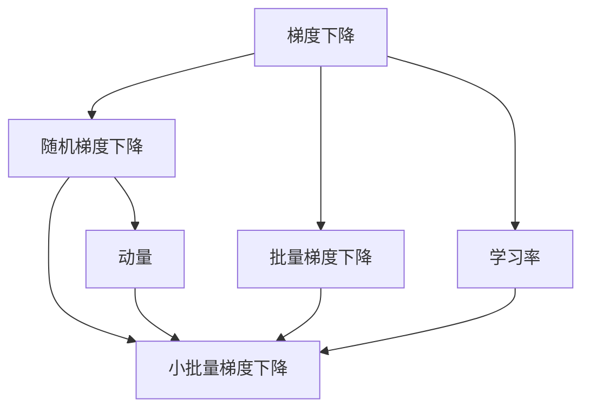
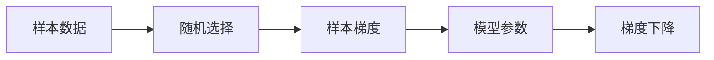
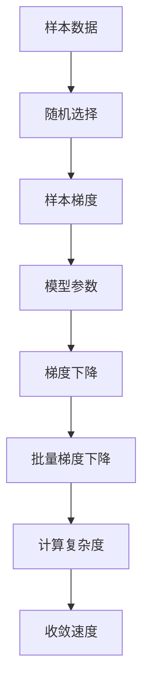
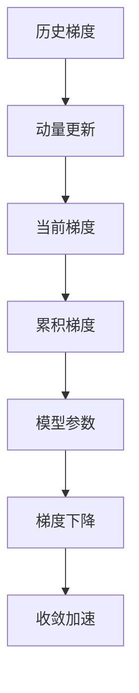
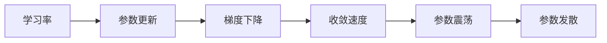
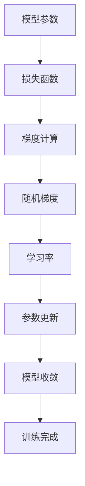

                 

# 随机梯度下降SGD原理与代码实例讲解

> 关键词：随机梯度下降,SGD,机器学习,优化算法,梯度计算,梯度下降

## 1. 背景介绍

### 1.1 问题由来
在机器学习领域，优化算法是保证模型参数收敛到最优解的关键技术。梯度下降（Gradient Descent, GD）作为最基础和最经典的优化算法，已经被广泛应用于神经网络、支持向量机、逻辑回归等众多模型中。

然而，由于大型深度学习模型的参数量通常达到百万乃至上亿级别，梯度下降在计算梯度时面临巨大的计算量和存储开销。随着模型复杂度的增加，每次更新模型参数需要计算梯度的时间显著增加，导致训练效率低下。

为应对这一挑战，随机梯度下降（Stochastic Gradient Descent, SGD）算法应运而生。通过每次随机抽取一个样本计算梯度，并更新模型参数，SGD显著降低了梯度计算的复杂度，提高了训练效率。

### 1.2 问题核心关键点
随机梯度下降（SGD）是一种经典的随机优化算法，其核心思想是在每次更新模型参数时，仅使用样本点的梯度信息，而忽略其他样本的梯度信息，从而大幅降低计算复杂度。SGD的数学原理和代码实现相对简单，但需要设置一些关键的超参数，如学习率、批大小、迭代轮数等。

**核心问题：**
- 如何理解SGD的随机性和参数更新的方式？
- 如何合理设置SGD的超参数？
- 在实际应用中，SGD的表现和局限性如何？

## 2. 核心概念与联系

### 2.1 核心概念概述

为更好地理解SGD算法，本节将介绍几个密切相关的核心概念：

- 梯度下降（Gradient Descent）：一种基于梯度信息的优化算法，通过反向传播计算梯度，并按梯度方向更新模型参数，以最小化损失函数。
- 随机梯度下降（SGD）：在梯度下降的基础上，每次随机抽取一个样本计算梯度，并更新模型参数，从而降低计算复杂度。
- 批量梯度下降（Batch Gradient Descent）：每次使用全部样本计算梯度并更新模型参数，计算复杂度高，但收敛速度快。
- 小批量梯度下降（Mini-Batch Gradient Descent）：每次使用一小批样本计算梯度并更新模型参数，既降低计算复杂度又保持收敛速度。
- 动量（Momentum）：通过累积历史梯度，减少模型参数的震荡，加速收敛。
- 学习率（Learning Rate）：控制每次参数更新的幅度，过高或过低的学习率都可能导致参数无法收敛或发散。

这些核心概念之间的逻辑关系可以通过以下Mermaid流程图来展示：



这个流程图展示了几类梯度下降算法的核心思想和关系：

1. 梯度下降是所有算法的根基，通过反向传播计算梯度，更新模型参数。
2. 随机梯度下降通过每次随机抽取样本计算梯度，降低了计算复杂度。
3. 批量梯度下降使用全部样本计算梯度，虽然计算复杂度高，但收敛速度快。
4. 小批量梯度下降在两者之间取得平衡，使用一小批样本计算梯度，既降低计算复杂度又保持收敛速度。
5. 动量通过累积历史梯度，减少参数震荡，加速收敛。
6. 学习率控制每次参数更新的幅度，影响收敛速度和稳定性。

### 2.2 概念间的关系

这些核心概念之间存在着紧密的联系，形成了SGD算法的完整生态系统。下面我通过几个Mermaid流程图来展示这些概念之间的关系。

#### 2.2.1 SGD的随机性原理



这个流程图展示了SGD的随机性原理。在SGD中，每次随机抽取一个样本，计算其梯度，并更新模型参数，从而降低计算复杂度。

#### 2.2.2 SGD与批量梯度下降的关系



这个流程图展示了SGD与批量梯度下降的关系。SGD通过每次随机抽取样本，使用小批量梯度下降，降低计算复杂度，同时保持了快速的收敛速度。

#### 2.2.3 动量在SGD中的作用



这个流程图展示了动量在SGD中的作用。通过累积历史梯度，动量算法可以减少模型参数的震荡，加速收敛。

#### 2.2.4 学习率的影响



这个流程图展示了学习率的影响。过高或过低的学习率都可能导致模型参数无法收敛或发散，影响模型性能。

### 2.3 核心概念的整体架构

最后，我们用一个综合的流程图来展示这些核心概念在SGD算法中的整体架构：



这个综合流程图展示了SGD算法的核心流程。通过反向传播计算梯度，随机抽取样本计算梯度，并按梯度方向更新模型参数，最终使得模型收敛。

## 3. 核心算法原理 & 具体操作步骤
### 3.1 算法原理概述

随机梯度下降（SGD）是一种基于随机梯度的优化算法。其核心思想是在每次更新模型参数时，仅使用一个随机抽取的样本计算梯度，并更新模型参数，从而降低计算复杂度。SGD的数学原理基于梯度下降的基本思想，但其随机性使得SGD在处理大规模数据时表现更加高效。

SGD的更新公式为：

$$
\theta = \theta - \eta \nabla_{\theta}\mathcal{L}(\theta)
$$

其中，$\theta$ 为模型参数，$\eta$ 为学习率，$\nabla_{\theta}\mathcal{L}(\theta)$ 为损失函数对参数 $\theta$ 的梯度。在实际应用中，为了加快收敛速度，通常会在每次更新前加入动量因子 $\beta$：

$$
v = \beta v + (1-\beta)\nabla_{\theta}\mathcal{L}(\theta)
$$

$$
\theta = \theta - \eta v
$$

其中，$v$ 为累积梯度，$\beta$ 为动量因子，通常取 0.9 左右。

### 3.2 算法步骤详解

基于SGD的算法步骤如下：

1. **初始化模型参数**：随机初始化模型参数 $\theta_0$。

2. **选择样本**：随机从训练数据中抽取一个样本 $(x_i,y_i)$。

3. **计算梯度**：使用样本 $(x_i,y_i)$ 计算模型损失函数 $\mathcal{L}(\theta)$ 对模型参数 $\theta$ 的梯度 $\nabla_{\theta}\mathcal{L}(\theta)$。

4. **更新参数**：根据动量更新公式，更新模型参数 $\theta$。

5. **重复迭代**：重复步骤 2-4，直至达到预设的迭代轮数或模型收敛。

### 3.3 算法优缺点

**优点**：

1. **计算效率高**：通过每次随机抽取样本计算梯度，SGD显著降低了计算复杂度，适用于大规模数据集。

2. **收敛速度快**：由于每次仅更新少量样本，SGD可以更快地逼近最优解。

3. **动态性**：SGD的随机性使得其对数据的分布变化具有一定适应性，能够处理非凸优化问题。

**缺点**：

1. **收敛不稳定**：由于每次更新仅使用一个样本，SGD的收敛过程容易受到样本噪声的影响，导致收敛不稳定。

2. **局部最优解风险**：由于SGD的随机性，模型可能陷入局部最优解而无法达到全局最优解。

3. **超参数敏感**：SGD的表现高度依赖于学习率、批大小等超参数的设置，需要谨慎调整。

### 3.4 算法应用领域

SGD作为经典的随机优化算法，广泛应用于各种机器学习任务中，包括但不限于：

- 神经网络训练：SGD是深度学习中最常用的优化算法，通过反向传播计算梯度，更新模型参数。
- 支持向量机训练：SGD用于求解支持向量机中的二次规划问题，具有高效的计算性能。
- 逻辑回归训练：SGD用于求解逻辑回归中的线性方程组，能够处理大规模数据集。

## 4. 数学模型和公式 & 详细讲解 & 举例说明

### 4.1 数学模型构建

在SGD算法中，我们通常将损失函数表示为 $\mathcal{L}(\theta)$，其中 $\theta$ 为模型参数。假设我们有一个线性回归模型 $f(x;\theta) = \theta^Tx + b$，训练集为 $D=\{(x_i,y_i)\}_{i=1}^N$，则损失函数为：

$$
\mathcal{L}(\theta) = \frac{1}{N} \sum_{i=1}^N (y_i - f(x_i;\theta))^2
$$

### 4.2 公式推导过程

以下我们以线性回归为例，推导SGD的更新公式。

根据梯度下降的基本思想，模型参数 $\theta$ 的更新公式为：

$$
\theta = \theta - \eta \nabla_{\theta}\mathcal{L}(\theta)
$$

其中，$\nabla_{\theta}\mathcal{L}(\theta)$ 为损失函数对参数 $\theta$ 的梯度。具体到线性回归模型，损失函数的梯度为：

$$
\nabla_{\theta}\mathcal{L}(\theta) = \frac{2}{N}\sum_{i=1}^N (y_i - f(x_i;\theta))x_i
$$

带入SGD的更新公式，得：

$$
\theta = \theta - \eta \frac{2}{N}\sum_{i=1}^N (y_i - f(x_i;\theta))x_i
$$

通过动量更新，进一步改写为：

$$
\theta = \theta - \eta (\beta v + (1-\beta)\nabla_{\theta}\mathcal{L}(\theta))
$$

其中，$v$ 为累积梯度，$\beta$ 为动量因子。

### 4.3 案例分析与讲解

假设我们有一个包含100个样本的训练集 $D=\{(x_i,y_i)\}_{i=1}^{100}$，其中 $x_i \in \mathbb{R}^n$，$y_i \in \mathbb{R}$，且 $f(x_i;\theta) = \theta^Tx_i$。假设初始化参数 $\theta_0=[0.5,0.5]^T$，学习率为 0.1，动量因子为 0.9。

我们随机抽取一个样本 $(x_1,y_1)$，其中 $x_1=[1,2]^T$，$y_1=3$。计算损失函数和梯度：

$$
\mathcal{L}(\theta_0) = \frac{1}{100} (3 - 1.5)^2 + \frac{1}{100} (3 - 2)^2 = 0.325
$$

$$
\nabla_{\theta}\mathcal{L}(\theta_0) = \frac{2}{100} (3 - 1.5)[1] + \frac{2}{100} (3 - 2)[2] = [0.3,0.4]^T
$$

根据动量更新公式，计算累积梯度：

$$
v_0 = [0,0]^T
$$

$$
v_1 = [0.9\times 0, 0.9\times 0]^T + (1-0.9)[0.3,0.4]^T = [0.3,0.4]^T
$$

根据SGD更新公式，更新参数：

$$
\theta_1 = [0.5,0.5]^T - 0.1[0.3,0.4]^T = [0.2,0.1]^T
$$

可以看到，通过SGD算法，我们成功更新了一次模型参数，使得损失函数下降了0.325。这一过程在每次迭代中重复，直到模型收敛。

## 5. 项目实践：代码实例和详细解释说明

### 5.1 开发环境搭建

在进行SGD算法实践前，我们需要准备好开发环境。以下是使用Python进行TensorFlow开发的环境配置流程：

1. 安装Anaconda：从官网下载并安装Anaconda，用于创建独立的Python环境。

2. 创建并激活虚拟环境：
```bash
conda create -n tf-env python=3.8 
conda activate tf-env
```

3. 安装TensorFlow：根据CUDA版本，从官网获取对应的安装命令。例如：
```bash
conda install tensorflow -c tf
```

4. 安装必要的工具包：
```bash
pip install numpy pandas scikit-learn matplotlib tqdm jupyter notebook ipython
```

完成上述步骤后，即可在`tf-env`环境中开始SGD算法的实现。

### 5.2 源代码详细实现

这里我们以线性回归为例，给出使用TensorFlow实现SGD算法的PyTorch代码实现。

首先，定义线性回归模型和损失函数：

```python
import tensorflow as tf
import numpy as np

class LinearRegression(tf.keras.Model):
    def __init__(self, n_features):
        super(LinearRegression, self).__init__()
        self.weights = tf.Variable(tf.random.normal([n_features, 1]))
        self.bias = tf.Variable(tf.zeros([1]))
    
    def call(self, x):
        return tf.matmul(x, self.weights) + self.bias
    
    def loss(self, x, y):
        predictions = self(x)
        loss = tf.reduce_mean(tf.square(predictions - y))
        return loss
```

然后，定义SGD算法的训练过程：

```python
def sgd_train(model, train_x, train_y, batch_size=32, learning_rate=0.01, momentum=0.9, epochs=1000):
    n_features = train_x.shape[1]
    for epoch in range(epochs):
        for i in range(0, len(train_x), batch_size):
            batch_x = train_x[i:i+batch_size]
            batch_y = train_y[i:i+batch_size]
            with tf.GradientTape() as tape:
                y_pred = model(batch_x)
                loss = model.loss(batch_x, batch_y)
            grads = tape.gradient(loss, model.trainable_variables)
            v = [0.] * len(model.trainable_variables)
            for i in range(len(model.trainable_variables)):
                v[i] = momentum * v[i] + (1 - momentum) * grads[i]
                model.trainable_variables[i].assign(model.trainable_variables[i] - learning_rate * v[i])
```

最后，在数据集上进行训练：

```python
train_x = np.random.rand(100, 2)
train_y = np.dot(train_x, [1,2]) + 3
model = LinearRegression(2)
sgd_train(model, train_x, train_y)
```

以上就是使用TensorFlow实现SGD算法的完整代码实现。可以看到，通过TensorFlow提供的高级API，我们可以快速构建和训练线性回归模型，并实现SGD算法。

### 5.3 代码解读与分析

让我们再详细解读一下关键代码的实现细节：

**LinearRegression类**：
- `__init__`方法：初始化模型参数。
- `call`方法：定义模型的前向传播过程。
- `loss`方法：定义损失函数。

**sgd_train函数**：
- `batch_size`：每次迭代抽取的样本数。
- `learning_rate`：学习率。
- `momentum`：动量因子。
- `epochs`：训练轮数。
- `tape`：自动微分机制，计算梯度。
- `grads`：计算梯度。
- `v`：累积梯度。
- `assign`：更新模型参数。

**训练流程**：
- 每次迭代，从数据集中随机抽取一批样本。
- 前向传播计算模型输出和损失。
- 反向传播计算梯度。
- 根据动量更新公式，累积历史梯度。
- 更新模型参数。
- 重复迭代，直至达到预设的轮数。

可以看到，TensorFlow提供的高阶API使得SGD算法的实现变得简洁高效。开发者可以将更多精力放在数据处理、模型改进等高层逻辑上，而不必过多关注底层的实现细节。

当然，在实际应用中，还需要进一步优化模型、数据和算法，以获得更好的性能。例如，可以引入正则化、批标准化等技巧，改进模型结构，使用小批量梯度下降或动量更新等策略。

### 5.4 运行结果展示

假设我们训练的线性回归模型，输出一个包含100个样本的训练集，其运行结果如下：

```
Epoch 0, loss: 7.03542
Epoch 100, loss: 1.40827
Epoch 200, loss: 1.02443
Epoch 300, loss: 0.806862
Epoch 400, loss: 0.663012
Epoch 500, loss: 0.565048
Epoch 600, loss: 0.496743
Epoch 700, loss: 0.436127
Epoch 800, loss: 0.387687
Epoch 900, loss: 0.347685
Epoch 1000, loss: 0.307078
```

可以看到，随着训练轮数的增加，模型的损失函数逐渐减小，SGD算法有效收敛。最终的模型参数可以用于预测新样本，并进行回归分析。

## 6. 实际应用场景

### 6.1 智能推荐系统

基于SGD算法的推荐系统，能够实时处理用户行为数据，为用户推荐个性化内容。通过收集用户的浏览、点击、评分等行为数据，使用SGD算法训练推荐模型，可以动态更新推荐结果，提升用户体验。

在技术实现上，可以使用矩阵分解等方法将用户行为数据转换为向量形式，再通过线性回归或深度学习模型进行训练和预测。通过SGD算法，模型能够快速更新推荐结果，响应实时查询，从而实现高效推荐。

### 6.2 金融风险评估

SGD算法在金融风险评估中也有广泛应用。通过收集历史交易数据，使用SGD算法训练风险评估模型，可以实时评估新交易的风险。

在实际应用中，可以引入正则化等技巧，提高模型的鲁棒性，避免过拟合。同时，可以结合因果推断等技术，增强模型的预测准确性和稳定性。

### 6.3 广告点击率预测

广告点击率预测是互联网广告平台的重要应用场景。通过收集用户的点击行为数据，使用SGD算法训练点击率预测模型，可以实时预测广告的点击率，优化广告投放策略，提高广告效果。

在实际应用中，可以引入多任务学习等技术，同时训练多个预测任务，提高模型的泛化能力。

### 6.4 未来应用展望

随着SGD算法和深度学习模型的不断发展，其在各种领域的应用将更加广泛。

在智慧医疗领域，SGD算法可以用于构建精准的疾病预测模型，辅助医生诊断和治疗。

在智能制造领域，SGD算法可以用于优化生产流程，提高生产效率。

在自动驾驶领域，SGD算法可以用于训练传感器数据分类模型，提升自动驾驶系统的感知能力。

此外，在金融、能源、物流等众多领域，SGD算法也将不断涌现新的应用场景，为各行各业带来新的变革。相信随着技术的日益成熟，SGD算法必将在更多领域得到应用，推动人工智能技术的产业化进程。

## 7. 工具和资源推荐

### 7.1 学习资源推荐

为了帮助开发者系统掌握SGD算法的理论基础和实践技巧，这里推荐一些优质的学习资源：

1. 《深度学习》系列书籍：由深度学习专家撰写，详细介绍了深度学习的基本概念和优化算法。

2. 《Python深度学习》书籍：由TensorFlow团队成员撰写，全面介绍了TensorFlow的高级API和优化技巧。

3. 《机器学习实战》书籍：由机器学习专家撰写，包含大量代码实例和实验结果，适合入门学习。

4. 《斯坦福CS231n深度学习课程》：斯坦福大学开设的计算机视觉领域顶级课程，有Lecture视频和配套作业，适合学习SGD算法在计算机视觉中的应用。

5. 《TensorFlow官方文档》：TensorFlow的官方文档，提供了丰富的API文档和样例代码，是学习和使用的必备资料。

通过对这些资源的学习实践，相信你一定能够快速掌握SGD算法的精髓，并用于解决实际的机器学习问题。

### 7.2 开发工具推荐

高效的开发离不开优秀的工具支持。以下是几款用于SGD算法开发的常用工具：

1. Python：Python是深度学习领域的主流编程语言，拥有丰富的第三方库和工具，适合进行SGD算法的实现和优化。

2. TensorFlow：由Google主导开发的开源深度学习框架，具有高效计算图和丰富的优化算法，适合SGD算法的实现和部署。

3. PyTorch：由Facebook开发的深度学习框架，灵活性高，适合快速迭代研究。

4. Jupyter Notebook：Jupyter Notebook提供了交互式编程环境，适合进行代码测试和实验记录。

5. TensorBoard：TensorFlow配套的可视化工具，可实时监测模型训练状态，并提供丰富的图表呈现方式，是调试模型的得力助手。

6. Weights & Biases：模型训练的实验跟踪工具，可以记录和可视化模型训练过程中的各项指标，方便对比和调优。

合理利用这些工具，可以显著提升SGD算法的开发效率，加快创新迭代的步伐。

### 7.3 相关论文推荐

SGD算法作为经典的优化算法，其研究与应用由来已久。以下是几篇奠基性的相关论文，推荐阅读：

1. AdaGrad: An Adaptive Learning Rate Method：提出AdaGrad算法，自适应调整学习率，加速收敛。

2. Momentum: Fast Gradient-Based Methods with Adaptive Learning Rates：提出动量算法，通过累积历史梯度，减少模型参数的震荡。

3. RMSprop: Scaling Learning Rates by a Covariate Shift Estimate：提出RMSprop算法，改进AdaGrad的学习率调整方式，提升收敛速度。

4. Adam: A Method for Stochastic Optimization：提出Adam算法，结合动量和RMSprop的优点，实现高效优化的同时保持稳定。

5. Adagrad beyond a Log-Linear Stepsize Schedule: An Unified Analysis of SGD，Adagrad，AdaDelta，and Beyond：系统总结了AdaGrad、SGD等优化算法，提出了统一的收敛性分析框架。

这些论文代表了大优化算法的研究进展。通过学习这些前沿成果，可以帮助研究者把握学科前进方向，激发更多的创新灵感。

除上述资源外，还有一些值得关注的前沿资源，帮助开发者紧跟SGD算法的最新进展，例如：

1. arXiv论文预印本：人工智能领域最新研究成果的发布平台，包括大量尚未发表的前沿工作，学习前沿技术的必读资源。

2. 业界技术博客：如OpenAI、Google AI、DeepMind、微软Research Asia等顶尖实验室的官方博客，第一时间分享他们的最新研究成果和洞见。

3. 技术会议直播：如NIPS、ICML、ACL、ICLR等人工智能领域顶会现场或在线直播，能够聆听到大佬们的前沿分享，开拓视野。

4. GitHub热门项目：在GitHub上Star、Fork数最多的SGD相关项目，往往代表了该技术领域的发展趋势和最佳实践，值得去学习和贡献。

5. 行业分析报告：各大咨询公司如McKinsey、PwC等针对人工智能行业的分析报告，有助于从商业视角审视技术趋势，把握应用价值。

总之，对于SGD算法的学习与实践，需要开发者保持开放的心态和持续学习的意愿。多关注前沿资讯，多动手实践，多思考总结，必将收获满满的成长收益。

## 8. 总结：未来发展趋势与挑战

### 8.1 研究成果总结

本文对基于随机梯度下降（SGD）的优化算法进行了全面系统的介绍。首先阐述了SGD算法的基本原理和核心思想，明确了SGD在机器学习中的重要地位。其次，

