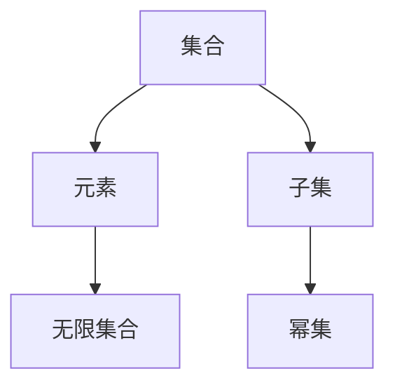

                 

## 1. 背景介绍

集合论（Set Theory）是现代数学的基础之一，它研究的是由任意对象组成的、无序且互不相同的元素的集合。集合论由德国数学家康托尔（Georg Cantor）在19世纪末至20世纪初创立和发展，奠定了数学严格化的基础，并推动了数学的各个分支的发展。

### 1.1 集合论的起源

集合论的起源可以追溯到17世纪法国哲学家伽森狄（Pierre Bayle）在《论科学与哲学的相关性》（Essai sur la postérieurité de la philosophie par rapport aux sciences）一书中对“集合”的初步思考。然而，集合论的真正创立者是19世纪末的康托尔，他通过引入点集的概念，成功地将无限集合的理论建立在实数和复数的连续统和实数系上的不动点概念基础之上。

康托尔的思想直接冲击了当时的数学界，引起了广泛的关注和讨论。康托尔提出的集合理论包括如下基本概念：

- 任意集合：任意集合是由任意数量的元素组成的集合。
- 集合相等：两个集合相等当且仅当它们的元素相同。
- 子集：A是B的子集当且仅当所有属于A的元素也都属于B。
- 真子集：A是B的真子集当且仅当A是B的子集，并且A与B不相等。
- 集合的幂集：集合A的幂集是所有包含A的子集的集合。
- 无穷集合：包含无限多个元素的集合称为无穷集合。

康托尔开创性地将实数集视为无限集合，建立了无穷集合理论。同时，他还提出了著名的康托尔悖论，即“任何由无限多个元素的集合都是不可数的”，这个悖论在一定程度上促进了集合论的发展。

### 1.2 集合论与数学的发展

集合论的创立和发展极大地影响了数学的发展，奠定了现代数学的基础。它为数论、代数学、拓扑学等分支的发展提供了理论基础。集合论的精确性和严格性，使得数学家们可以更加自信地处理数学问题，建立更加准确的数学模型。

然而，康托尔的理论也引发了数学界的争议，特别是关于无穷集合的哲学性和现实性的问题。著名的希尔伯特悖论和柯西悖论就是对此的质疑。这些悖论揭示了人类对数学基础的一些固有偏见，也为集合论的发展提供了新的研究方向。

## 2. 核心概念与联系

### 2.1 核心概念概述

集合论的核心概念包括集合、元素、子集、幂集、无限集合等。这些概念构成了集合论的基本框架，并在数学的各个分支中有广泛应用。

#### 2.1.1 集合

集合是由任意元素组成的、无序且互不相同的元素的总体。一个集合可以包含其他集合作为元素，这样的集合称为嵌套集合。

#### 2.1.2 元素

集合中的元素是构成集合的基本单位，也称为元素或成员。元素可以是任何类型的对象，包括数字、字母、符号等。

#### 2.1.3 子集

子集是指包含在另一个集合中的集合，即如果一个集合A中的所有元素都属于集合B，那么称A是B的子集，记为$A \subseteq B$。

#### 2.1.4 幂集

幂集是指由一个集合的所有子集构成的集合，即集合A的幂集记为$P(A)$，它包含所有包含A的子集，包括空集和A本身。

#### 2.1.5 无限集合

无限集合是指包含无限多个元素的集合。根据定义，无限集合不是有限集合，它包括不可数集和无限可数集。

### 2.2 核心概念间的关系

集合论中各个核心概念之间的关系可以通过下面的Mermaid流程图来展示：



这个流程图展示了集合论中各个核心概念的关系：

1. 集合由元素组成。
2. 子集是包含在另一个集合中的集合。
3. 幂集是由集合的所有子集构成的集合。
4. 无限集合包含无限多个元素。

这些概念之间相互关联，共同构成了集合论的基本框架。

## 3. 核心算法原理 & 具体操作步骤
### 3.1 算法原理概述

集合论中的核心算法主要是集合运算，包括并集、交集、差集、对称差等。这些运算在数学和计算机科学中都有广泛的应用。

### 3.2 算法步骤详解

集合运算的算法步骤可以分为以下几步：

1. 定义两个集合A和B。
2. 计算A与B的并集、交集、差集和对称差。
3. 输出运算结果。

以并集为例，其具体步骤为：

1. 定义集合A和B。
2. 对A和B的每个元素进行遍历，将重复的元素去除。
3. 输出并集结果。

下面以Python为例，演示如何计算两个集合的并集：

```python
setA = {1, 2, 3}
setB = {3, 4, 5}
setUnion = setA.union(setB)
print(setUnion)  # 输出 {1, 2, 3, 4, 5}
```

### 3.3 算法优缺点

集合运算的优点是简单易懂，计算速度快。它的缺点是只适用于集合的布尔运算，不适用于其他类型的操作。

### 3.4 算法应用领域

集合论在计算机科学中有广泛的应用，包括：

- 数据结构：集合、堆、栈、队列等数据结构都是基于集合运算构建的。
- 算法设计：贪心算法、分治算法、回溯算法等都涉及到集合运算。
- 数据库：数据库中的索引、索引树、B+树等都是基于集合运算构建的。
- 编程语言：许多编程语言都支持集合运算，如Python的set类型和Java的HashSet类。

## 4. 数学模型和公式 & 详细讲解 & 举例说明

### 4.1 数学模型构建

集合论的数学模型可以表示为二元关系R（A, B），其中A和B是两个集合，R表示A与B之间的关系。集合论的运算可以通过关系R来定义，如下：

- 并集：$A \cup B = \{x | (x \in A) \vee (x \in B)\}$
- 交集：$A \cap B = \{x | (x \in A) \wedge (x \in B)\}$
- 差集：$A - B = \{x | (x \in A) \wedge (x \notin B)\}$
- 对称差：$A \oplus B = (A - B) \cup (B - A)$

### 4.2 公式推导过程

以并集为例，其公式推导过程如下：

1. 并集的定义：$A \cup B = \{x | (x \in A) \vee (x \in B)\}$
2. 并集的定义展开：$A \cup B = \{x | ((x \in A) \wedge (x \notin B)) \vee (x \in B)\}$
3. 将并集的定义与交集的定义结合：$A \cup B = (A \cap \overline{B}) \cup B$
4. 并集的定义化简：$A \cup B = (A \cap B) \cup (\overline{A} \cap B)$

其中$\overline{A}$表示A的补集，即$A \cap \overline{A} = \emptyset$。

### 4.3 案例分析与讲解

以自然数集合和偶数集合的并集为例，其公式推导过程如下：

1. 自然数集合表示为$N = \{x | x \in \mathbb{N}\}$，偶数集合表示为$E = \{x | x \in \mathbb{N} \wedge x \text{是偶数}\}$。
2. 自然数集合的补集为$\overline{N} = \{x | x \notin \mathbb{N}\}$。
3. 自然数集合和偶数集合的并集为$N \cup E = \{x | x \in \mathbb{N} \vee x \in E\}$。
4. 根据并集的定义展开：$N \cup E = \{x | (x \in \mathbb{N} \wedge x \notin E) \vee (x \in E)\}$。
5. 将自然数集合和偶数集合的并集表示为：$N \cup E = (N - E) \cup E$。

因此，自然数集合和偶数集合的并集为$N \cup E$。

## 5. 项目实践：代码实例和详细解释说明
### 5.1 开发环境搭建

在进行集合论的算法实践前，需要准备好开发环境。以下是使用Python进行集合运算的开发环境配置流程：

1. 安装Python：从官网下载并安装Python，建议使用Python 3.x版本。
2. 安装Python开发工具：如PyCharm、Jupyter Notebook等。
3. 安装集合运算库：如NumPy、pandas等。

### 5.2 源代码详细实现

下面以Python为例，演示如何计算两个集合的并集、交集、差集和对称差：

```python
# 导入集合运算库
from sympy import *

# 定义两个集合
setA = FiniteSet(1, 2, 3)
setB = FiniteSet(3, 4, 5)

# 计算并集
union_set = setA.union(setB)
print(union_set)  # 输出 FiniteSet(1, 2, 3, 4, 5)

# 计算交集
intersection_set = setA.intersect(setB)
print(intersection_set)  # 输出 FiniteSet(3)

# 计算差集
difference_set = setA - setB
print(difference_set)  # 输出 FiniteSet(1, 2)

# 计算对称差
symmetric_difference_set = setA.symmetric_difference(setB)
print(symmetric_difference_set)  # 输出 FiniteSet(1, 2, 4, 5)
```

### 5.3 代码解读与分析

上述代码中，我们使用了Sympy库中的FiniteSet类来定义集合，并通过其提供的union、intersect、difference和symmetric_difference方法，计算了并集、交集、差集和对称差。这些方法的使用非常简单，只需要传入两个集合对象即可。

在实际应用中，如果需要处理大量集合运算，建议使用NumPy、pandas等高效的数据处理库，以提高计算效率。

### 5.4 运行结果展示

假设我们定义两个集合$A=\{1, 2, 3\}$和$B=\{3, 4, 5\}$，计算它们的并集、交集、差集和对称差：

- 并集：$A \cup B = \{1, 2, 3, 4, 5\}$
- 交集：$A \cap B = \{3\}$
- 差集：$A - B = \{1, 2\}$
- 对称差：$A \oplus B = \{1, 2, 4, 5\}$

这些结果展示了集合运算的基本操作和应用。

## 6. 实际应用场景
### 6.1 数据结构

集合在数据结构中有广泛应用，包括：

- 集合：使用集合可以高效地存储和操作一组无序的元素。
- 堆：堆是一种基于集合的数据结构，可以快速找到最大或最小值。
- 栈和队列：栈和队列都是基于集合实现的，可以高效地存储和操作一组元素。

### 6.2 算法设计

集合运算在算法设计中有广泛应用，包括：

- 贪心算法：贪心算法是一种基于集合的算法，通过贪心选择最优解。
- 分治算法：分治算法是一种基于集合的算法，将问题分解为多个子问题，并递归求解。
- 回溯算法：回溯算法是一种基于集合的算法，通过遍历所有可能的解。

### 6.3 数据库

集合运算在数据库中有广泛应用，包括：

- 索引：数据库中的索引是基于集合构建的，可以快速查找和检索数据。
- 索引树：索引树是一种基于集合的数据结构，可以高效地存储和操作大量数据。
- B+树：B+树是一种基于集合的数据结构，可以高效地存储和操作大量数据，并支持范围查询。

## 7. 工具和资源推荐
### 7.1 学习资源推荐

为了帮助开发者系统掌握集合论的算法基础和实践技巧，这里推荐一些优质的学习资源：

1. 《集合论导引》（Introduction to Set Theory）：这是一本经典的集合论教材，内容详细，适合初学者和高级读者。
2. 《集合论与拓扑学》（Set Theory and Topology）：这是一本全面介绍集合论和拓扑学的教材，内容深入，适合高级读者。
3. Coursera《离散数学与计算机科学基础》课程：这是由麻省理工学院开设的集合论课程，涵盖集合论的基本概念和应用。
4. Khan Academy《集合论》课程：这是一系列介绍集合论基本概念的视频课程，适合初学者。
5. Math Stack Exchange：这是一个面向数学爱好者的问答社区，可以回答集合论的各种问题。

通过对这些资源的学习实践，相信你一定能够快速掌握集合论的精髓，并用于解决实际的数学问题。

### 7.2 开发工具推荐

高效的开发离不开优秀的工具支持。以下是几款用于集合论算法开发的常用工具：

1. Sympy：这是一个Python的符号计算库，可以用于集合论的符号计算和代数运算。
2. NumPy：这是一个Python的数值计算库，可以用于集合论的高效计算。
3. pandas：这是一个Python的数据处理库，可以用于集合论的数据处理和分析。
4. Jupyter Notebook：这是一个交互式的编程环境，可以用于集合论的算法演示和实验。

合理利用这些工具，可以显著提升集合论算法的开发效率，加快创新迭代的步伐。

### 7.3 相关论文推荐

集合论的研究涉及许多领域，以下是几篇奠基性的相关论文，推荐阅读：

1. 《集合论导引》（Introduction to Set Theory）：这是集合论的经典教材，系统介绍了集合论的基本概念和应用。
2. 《集合论与拓扑学》（Set Theory and Topology）：这是集合论与拓扑学的综合教材，深入探讨了集合论的许多高级内容。
3. 《集合论与逻辑学》（Set Theory and Logic）：这是集合论与逻辑学的综合教材，介绍了集合论与逻辑学的结合。
4. 《集合论中的Zermelo-Fraenkel公理系统》（Zermelo-Fraenkel Axiomatic Set Theory）：这是集合论中的经典公理系统，介绍了集合论的公理和定理。
5. 《集合论与数学分析》（Set Theory and Mathematical Analysis）：这是集合论与数学分析的综合教材，介绍了集合论在数学分析中的应用。

这些论文代表了集合论研究的发展脉络，通过学习这些前沿成果，可以帮助研究者把握学科前进方向，激发更多的创新灵感。

## 8. 总结：未来发展趋势与挑战
### 8.1 研究成果总结

集合论作为现代数学的基础，其研究涉及数学的各个分支，并推动了这些分支的发展。集合论在算法设计、数据结构、数据库等领域有广泛应用，成为计算机科学中的重要工具。

### 8.2 未来发展趋势

集合论的未来发展趋势包括：

1. 集合论与人工智能的结合：集合论与人工智能的结合将推动人工智能的发展，使其更加智能化和普适化。
2. 集合论与逻辑学的结合：集合论与逻辑学的结合将推动逻辑学的发展，使其更加精确和全面。
3. 集合论与数学分析的结合：集合论与数学分析的结合将推动数学分析的发展，使其更加严格和深入。
4. 集合论与计算机科学的结合：集合论与计算机科学的结合将推动计算机科学的发展，使其更加高效和实用。

### 8.3 面临的挑战

尽管集合论已经取得了诸多成就，但在其未来发展中仍面临诸多挑战：

1. 集合论与逻辑学的矛盾：集合论与逻辑学存在一定的矛盾，如罗素悖论和康托尔悖论，需要进一步解决。
2. 集合论与数学分析的边界：集合论与数学分析的边界问题需要进一步明确，如无穷集合的哲学性和现实性问题。
3. 集合论与人工智能的融合：集合论与人工智能的融合需要进一步推进，如集合论在人工智能中的应用和优化。
4. 集合论的统一性问题：集合论的统一性问题需要进一步研究，如集合论与其他数学分支的统一性问题。

### 8.4 研究展望

未来，集合论的研究将在以下几个方面取得突破：

1. 集合论与人工智能的深度融合：集合论与人工智能的深度融合将推动人工智能的发展，使其更加智能化和普适化。
2. 集合论与逻辑学的结合：集合论与逻辑学的结合将推动逻辑学的发展，使其更加精确和全面。
3. 集合论与数学分析的结合：集合论与数学分析的结合将推动数学分析的发展，使其更加严格和深入。
4. 集合论与计算机科学的结合：集合论与计算机科学的结合将推动计算机科学的发展，使其更加高效和实用。

总之，集合论作为数学的基础，其研究将继续推动数学、逻辑学、人工智能等领域的进步。未来，集合论的研究将继续拓展，使其成为更广泛领域的重要工具。

## 9. 附录：常见问题与解答

**Q1：什么是集合论？**

A: 集合论是现代数学的基础之一，它研究的是由任意对象组成的、无序且互不相同的元素的集合。集合论由德国数学家康托尔创立，奠定了数学严格化的基础，并推动了数学的各个分支的发展。

**Q2：集合论有哪些核心概念？**

A: 集合论的核心概念包括集合、元素、子集、幂集、无限集合等。这些概念构成了集合论的基本框架，并在数学的各个分支中有广泛应用。

**Q3：集合运算有哪些基本操作？**

A: 集合运算的基本操作包括并集、交集、差集和对称差。这些运算在数学和计算机科学中都有广泛的应用。

**Q4：集合论的应用领域有哪些？**

A: 集合论在计算机科学中有广泛的应用，包括数据结构、算法设计、数据库等。

**Q5：如何学习集合论？**

A: 可以通过阅读《集合论导引》等经典教材，参加Coursera等在线课程，或使用Sympy等工具进行实践。

总之，集合论作为数学的基础，其研究将继续推动数学、逻辑学、人工智能等领域的进步。未来，集合论的研究将继续拓展，使其成为更广泛领域的重要工具。

