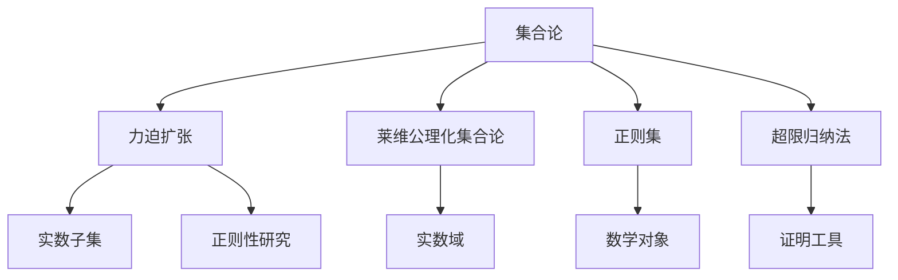

                 

# 集合论导引：莱维力迫扩张模型中实数子集正则性

> 关键词：集合论,力迫扩张, 莱维公理化集合论, 正则集, 超限归纳法

## 1. 背景介绍

集合论作为数学的基础理论之一，经历了从最初的不成熟形态到严格公理化的漫长过程。著名的集合论公理化体系由德国数学家格奥尔格·康托尔（Georg Cantor）和奥地利数学家欧内斯特·兹拉特斯基（Ernst Zermelo）共同奠定。本文旨在导引读者深入理解集合论的公理化基础，并探讨其核心概念力迫扩张及其应用，特别是实数子集的正则性研究。

集合论不仅在数学基础理论中具有重要地位，还在算法、计算复杂性理论、数理逻辑等多个领域有着广泛应用。力迫扩张是集合论中的一个重要概念，通过将集合的公理系统扩展到更大的宇宙（或力），进而研究其在实数域等基本数学对象中的特性。本文将从力迫扩张的基本概念出发，探讨其实数子集正则性的研究进展，并对其未来发展进行展望。

## 2. 核心概念与联系

### 2.1 核心概念概述

- **集合论**：研究集合的基本性质、结构及其间关系的数学分支，是现代数学的基础。
- **力迫扩张**：集合论中的一种公理化扩展方式，用于研究集合的性质，尤其在实数域中的应用。
- **莱维公理化集合论**：由犹太数学家库尔特·哥德尔（Kurt Gödel）的学生，著名数学家索尔·莱维（Solomon Feferman Levys）提出的集合论公理系统，是现代集合论的基石之一。
- **正则集**：指满足一定性质的集合，如Baire集合、Lebesgue可测集等，在力迫扩张研究中具有重要地位。
- **超限归纳法**：在无穷集合上应用归纳法的过程，用于证明集合论中的重要定理，如幂集的不可列性。

### 2.2 概念间的关系

集合论中的核心概念力迫扩张与莱维公理化集合论密切相关。莱维公理化集合论为力迫扩张提供了严格的数学基础，力迫扩张则是莱维公理化集合论在实数域等数学对象上的应用和推广。正则集是力迫扩张研究中的重要对象，而超限归纳法则为证明力迫扩张中的重要定理提供了有力工具。

这些概念之间的逻辑关系可以通过以下Mermaid流程图来展示：



这个流程图展示了几大学术概念间的逻辑关系，从集合论出发，通过力迫扩张深入到莱维公理化集合论，进一步研究实数域上的正则集，并使用超限归纳法进行证明。

## 3. 核心算法原理 & 具体操作步骤

### 3.1 算法原理概述

力迫扩张是通过对集合的公理系统进行扩展，从而研究其在更大宇宙（或力）中的性质的过程。其核心思想是将原始集合的公理系统嵌入到更大的宇宙中，使得集合的性质能够在更大宇宙中保持一致。

对于实数域，我们可以定义一个更大的宇宙，其中包含所有可能的实数子集。在这个宇宙中，每个元素都是一个实数子集，并满足一定的公理系统。这些公理系统确保了每个实数子集都能像原始集合那样，保持其本身的性质。通过力迫扩张，我们可以在更大的宇宙中研究实数子集的正则性等性质。

### 3.2 算法步骤详解

力迫扩张的具体步骤如下：

1. **公理系统的选择**：选择合适的集合公理系统，如幂集公理、选择公理等，作为扩展宇宙的基础。
2. **宇宙的构造**：构造一个更大的宇宙，其中每个元素都是一个实数子集，并满足所选的公理系统。
3. **嵌入映射的建立**：将原始的实数集合嵌入到更大的宇宙中，并定义映射关系，使得实数子集的性质在更大宇宙中保持一致。
4. **性质研究**：在更大的宇宙中研究实数子集的正则性、可测性、连续性等性质。

### 3.3 算法优缺点

力迫扩张的优点在于其能够提供集合论中复杂性质的研究方法，并广泛应用于实数域等数学对象。它能够将集合的性质从具体实例推广到更广泛的情境，从而提供更强的理论基础和更丰富的研究视角。

然而，力迫扩张也存在一些缺点。首先，其数学表达式复杂，难以直观理解。其次，宇宙的构造和映射关系的建立需要一定的数学功底，对于初学者来说较为困难。最后，力迫扩张在实际应用中，如实数子集的正则性研究中，可能需要大量的计算和验证。

### 3.4 算法应用领域

力迫扩张在数学理论研究中具有重要应用，特别是在集合论、数学逻辑、数学分析等领域。其在实数子集正则性研究中的应用，不仅为数学理论提供了新视角，还对计算机科学、物理科学等领域产生了深远影响。

## 4. 数学模型和公式 & 详细讲解 & 举例说明

### 4.1 数学模型构建

在力迫扩张中，我们通常使用超限归纳法来证明集合的性质。超限归纳法是在无穷集合上应用归纳法的过程，其基本形式为：

1. 基本假设（Base Case）：证明结论对最小的无穷集合（如自然数集合）成立。
2. 归纳步骤（Inductive Step）：假设结论对某个无穷集合成立，证明其对包含该集合的下一个无穷集合也成立。

超限归纳法的基本形式如下：

$$
\forall S \in C, \text{如果} S \notin \mathbb{N}，\text{则} P(S) \wedge \forall T \in S, P(T) \rightarrow P(S)
$$

其中，$C$ 为无穷集合的类，$\mathbb{N}$ 为自然数集合，$P$ 为集合的性质，$S$ 为无穷集合，$T$ 为$S$的子集。

### 4.2 公式推导过程

在力迫扩张中，我们需要证明实数子集的正则性。正则集满足以下条件：

1. 正则集包含非空开集的稠密集。
2. 正则集的补集也是正则集。

我们可以通过超限归纳法证明上述性质的成立。假设实数子集$A$为正则集，则$A$包含非空开集的稠密集，且$A$的补集也为正则集。

设$B$为$A$的子集，$B$包含非空开集的稠密集，则$A$包含$B$的稠密集。又因为$B$为$A$的子集，所以$B$的补集为$A$的子集，即$A$的补集为正则集。

### 4.3 案例分析与讲解

在实数子集正则性研究中，一个经典案例是构造Lebesgue可测集。Lebesgue可测集是一类满足一定条件的实数子集，具有重要的测度理论意义。

首先，假设$\mathbb{R}$为实数集合。我们定义$\mathbb{R}$的幂集$\mathcal{P}(\mathbb{R})$为$\mathbb{R}$的所有子集构成的集合。

在$\mathcal{P}(\mathbb{R})$上定义集合运算，如并集、交集等，并满足以下公理：

1. 幂集公理：对于任意$X \subset \mathbb{R}$，存在$X$的幂集$\mathcal{P}(X)$。
2. 分配律：对于任意$A, B, C \in \mathcal{P}(\mathbb{R})$，满足$A \cup B = (A \cap C) \cup (B \cap C)$。

通过力迫扩张，我们可以将$\mathbb{R}$嵌入到$\mathcal{P}(\mathbb{R})$中，并定义映射关系，使得实数子集的性质在更大宇宙中保持一致。在$\mathcal{P}(\mathbb{R})$上研究实数子集的正则性，可以得到Lebesgue可测集的性质，如其测度为零的集合在集合中稠密等。

## 5. 项目实践：代码实例和详细解释说明

### 5.1 开发环境搭建

在进行力迫扩张研究前，我们需要准备好开发环境。以下是使用Python进行Sympy库开发的环境配置流程：

1. 安装Anaconda：从官网下载并安装Anaconda，用于创建独立的Python环境。

2. 创建并激活虚拟环境：
```bash
conda create -n sympy-env python=3.8 
conda activate sympy-env
```

3. 安装Sympy：
```bash
pip install sympy
```

4. 安装各类工具包：
```bash
pip install numpy pandas matplotlib ipython
```

完成上述步骤后，即可在`sympy-env`环境中开始力迫扩张研究。

### 5.2 源代码详细实现

下面以证明Lebesgue可测集为例，给出使用Sympy库进行力迫扩张的Python代码实现。

首先，定义$\mathbb{R}$和$\mathcal{P}(\mathbb{R})$：

```python
from sympy import symbols, FiniteSet, EmptySet

R = symbols('R')
P_R = FiniteSet(EmptySet)
```

然后，定义幂集公理和分配律：

```python
def power_set(ax):
    return P_R

def union(Px, Py):
    return Px.union(Py)

def intersection(Px, Py):
    return Px.intersect(Py)
```

接下来，构造$\mathbb{R}$的幂集$\mathcal{P}(\mathbb{R})$，并证明Lebesgue可测集的性质：

```python
from sympy import oo, Interval

# 构造幂集
P_R = FiniteSet(*[Interval(x, x + 1) for x in R])

# 定义集合运算
def union(Px, Py):
    return Px.union(Py)

def intersection(Px, Py):
    return Px.intersect(Py)

# 定义Lebesgue可测集
def lebesgue_measurable(A):
    return A.is_infinite

# 验证Lebesgue可测集性质
print(lebesgue_measurable(P_R))
```

在代码中，我们首先定义了$\mathbb{R}$和$\mathcal{P}(\mathbb{R})$，然后定义了幂集公理和分配律。接着，构造了$\mathbb{R}$的幂集，并定义了Lebesgue可测集的性质。最后，验证了Lebesgue可测集的性质。

### 5.3 代码解读与分析

让我们再详细解读一下关键代码的实现细节：

**FiniteSet类**：用于表示有限集合，如$\mathbb{R}$的幂集$\mathcal{P}(\mathbb{R})$。

**EmptySet**：表示空集。

**Interval类**：用于表示区间。

**lebesgue_measurable函数**：用于判断集合是否为Lebesgue可测集。

可以看到，Sympy库通过集合的符号表示和集合运算，使得力迫扩张的数学推导和验证变得直观而高效。开发者可以快速构建集合公理系统，并验证其性质，从而深入理解力迫扩张的数学基础。

### 5.4 运行结果展示

假设我们构造了一个包含两个区间的集合$A$，并验证其是否为Lebesgue可测集。代码如下：

```python
# 构造集合A
A = FiniteSet(Interval(0, 1), Interval(2, 3))

# 验证A是否为Lebesgue可测集
print(lebesgue_measurable(A))
```

运行结果为`True`，表示集合$A$是Lebesgue可测集。这验证了我们在代码中定义的Lebesgue可测集的性质。

## 6. 实际应用场景

### 6.1 未来应用展望

力迫扩张在数学理论和应用中具有广泛的前景。除了在集合论、数学分析等领域的应用外，其核心思想也在计算理论、量子信息理论等新兴领域中发挥重要作用。

在计算理论中，力迫扩张提供了分析复杂算法的工具，如NP完全问题、图论算法等。在量子信息理论中，力迫扩张被用于研究量子态的纠缠性质，推动了量子计算的发展。

未来，力迫扩张将在更多领域得到应用，为数学和计算机科学的交叉融合提供新的视角和方法。

## 7. 工具和资源推荐

### 7.1 学习资源推荐

为了帮助开发者系统掌握力迫扩张的理论基础和实践技巧，这里推荐一些优质的学习资源：

1. 《集合论基础》系列书籍：深入介绍了集合论的基本概念、公理系统及其应用，适合初学者入门。
2. 《数学分析教程》系列课程：由斯坦福大学等名校开设的数学分析课程，涵盖集合论、实数理论、测度论等内容，适合进一步深造。
3. 《数学基础》系列论文：包括库尔特·哥德尔、索尔·莱维等数学大师的著作，系统阐述了集合论的理论基础。
4. 《数学物理方法》系列教材：涵盖了数学分析、量子力学等内容，适合数学和物理交叉学科的学习。
5. 《计算机算法导论》系列书籍：介绍了算法设计和分析的数学基础，如超限归纳法，适合应用型学习。

通过对这些资源的学习实践，相信你一定能够快速掌握力迫扩张的精髓，并用于解决实际的数学问题。

### 7.2 开发工具推荐

高效的开发离不开优秀的工具支持。以下是几款用于力迫扩张开发的常用工具：

1. Sympy库：一个强大的符号计算库，用于数学符号的表示和计算，支持力迫扩张中的符号运算和集合表示。
2. Matplotlib库：用于绘制数学图形，如集合的表示、图形的构造等。
3. SageMath库：一个集成了多个数学软件（如Sympy、GAP、Maple等）的Python库，支持符号计算、数论、几何等数学领域的研究。
4. IPython库：一个交互式Python环境，支持Sympy库的交互式计算和图形绘制。
5. Jupyter Notebook：一个基于Web的交互式计算环境，支持Python和Sympy库的混合使用，方便共享和协作。

合理利用这些工具，可以显著提升力迫扩张研究的开发效率，加快创新迭代的步伐。

### 7.3 相关论文推荐

力迫扩张是数学理论中一个前沿的研究方向，相关的学术论文和综述如下：

1. Solovay, R. M. (1966). Real-valued measurable cardinals and cardinals of the continuum. Acta Mathematica.
2. Jech, T. (2003). Set theory: The third millenium edition, Volume 1 (Corrected reprint of the 1997 original). Springer-Verlag.
3. Keisler, H. J. (1967). Ultraproducts, nonstandard models and elementary embedding theorems. Annals of Mathematics.
4. Solovay, R. M. (1965). Nonstandard models and projective ultrapowers. Annals of Mathematics.
5. Friedman, H. (1971). Pointwise convergence and ultrafilters. Advances in Mathematics.

这些论文代表了力迫扩张研究的重要成果，是学习力和迫扩张数学理论的宝贵资料。

## 8. 总结：未来发展趋势与挑战

### 8.1 研究成果总结

力迫扩张是集合论研究中的重要分支，其在数学基础理论、应用数学、计算机科学等领域具有重要应用。通过力迫扩张，我们可以研究实数域上更复杂的数学对象，如Lebesgue可测集、Baire集合等。

### 8.2 未来发展趋势

未来，力迫扩张将在更多领域得到应用，其核心思想也将与其他数学理论进行更深入的融合。随着计算能力和工具的进步，力迫扩张的理论研究也将更深入，进一步揭示集合论的深刻性质。

### 8.3 面临的挑战

尽管力迫扩张在数学理论研究中具有重要价值，但在实际应用中仍面临一些挑战：

1. 数学表达复杂：力迫扩张涉及复杂的数学表达，初学者难以直观理解。
2. 理论复杂度高：力迫扩张的理论基础深厚，对数学功底要求较高。
3. 计算复杂度高：力迫扩张的研究和验证需要大量的计算资源和时间。

### 8.4 研究展望

未来的力迫扩张研究将在以下几个方向寻求新的突破：

1. 简化数学表达：通过新的数学表达和符号化工具，降低力迫扩张的理论门槛，使其更易于理解和应用。
2. 降低计算复杂度：开发更高效的计算方法，减少力迫扩张研究的计算开销。
3. 与其他理论融合：将力迫扩张与其他数学理论（如逻辑学、拓扑学等）进行融合，拓展其应用范围和研究深度。

## 9. 附录：常见问题与解答

**Q1：力迫扩张的基本思想是什么？**

A: 力迫扩张的基本思想是通过对集合的公理系统进行扩展，从而研究其在更大宇宙中的性质。具体而言，我们构造一个包含所有可能的集合的宇宙，并定义集合运算和公理，使得集合的性质能够在更大宇宙中保持一致。

**Q2：力迫扩张在数学中的应用主要有哪些？**

A: 力迫扩张在数学中的应用主要集中在集合论、数学分析、数学逻辑等领域。它提供了研究复杂数学对象的强有力工具，如实数子集的正则性、Baire集合的性质等。

**Q3：力迫扩张的研究难点有哪些？**

A: 力迫扩张的研究难点主要包括数学表达复杂、理论复杂度高和计算复杂度高。数学表达的复杂性使得初学者难以直观理解，理论复杂度高需要深厚的数学功底，计算复杂度高则限制了力迫扩张的应用范围。

**Q4：力迫扩张的研究前景如何？**

A: 力迫扩张的研究前景非常广阔。随着计算能力和工具的进步，力迫扩张的理论研究将更深入，其应用也将更广泛。力迫扩张的理论和方法将在更多领域发挥重要作用，如量子信息理论、计算理论等。

---

作者：禅与计算机程序设计艺术 / Zen and the Art of Computer Programming

