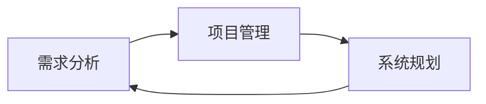

                 

# 需求分析、项目管理、系统规划能力核心培养

## 1. 背景介绍

在当今快速变化的IT行业中，需求分析、项目管理、系统规划是构建高效、可维护和适应性强的软件系统的关键。随着软件项目规模的日益增大，技术复杂性的增加，以及市场需求的多样化，这些能力显得尤为重要。本文将深入探讨需求分析、项目管理、系统规划的核心概念与实践方法，帮助IT从业者掌握这些技能，以更好地应对现实工作中的挑战。

### 1.1 问题由来

在软件开发过程中，需求分析、项目管理、系统规划能力的缺失或不足，往往导致项目延期、预算超支、质量问题频发，以及最终交付的软件系统无法满足用户需求。这些问题不仅影响了软件开发项目的成功，还可能给公司带来巨大的经济损失和声誉损失。

### 1.2 问题核心关键点

本文旨在解决以下核心问题：

- 如何通过系统的需求分析方法，准确理解并捕捉用户需求，以指导软件设计和开发？
- 如何在复杂的项目环境中，通过高效的项目管理方法，确保项目按时、按质、按预算完成？
- 如何通过系统的系统规划方法，构建出结构合理、功能完备、易于扩展的软件架构？

### 1.3 问题研究意义

掌握需求分析、项目管理、系统规划能力，对于提高软件开发的效率和质量，降低开发成本，以及提升软件系统的灵活性和可维护性，具有重要意义。通过这些能力，IT从业者可以在复杂多变的环境中，更好地应对挑战，实现软件项目的成功。

## 2. 核心概念与联系

### 2.1 核心概念概述

为了更好地理解需求分析、项目管理、系统规划，本节将介绍几个密切相关的核心概念：

- **需求分析 (Requirement Analysis)**：指通过与用户和利益相关者的沟通，识别、记录和验证用户需求的过程。需求分析是软件开发的基础，直接决定软件系统的功能和性能。

- **项目管理 (Project Management)**：指通过计划、执行、监控和控制项目进度、成本、资源和质量，确保项目按时、按质、按预算完成的过程。项目管理的核心在于高效的计划和执行，以及灵活的监控和控制。

- **系统规划 (System Planning)**：指根据需求分析结果，设计软件系统的整体架构、组件结构、数据模型和技术栈，并确定实现方案的过程。系统规划是软件开发的蓝图，指导整个开发过程。

### 2.2 概念间的关系

这些核心概念之间存在着紧密的联系，形成了软件开发项目管理的完整框架。

1. **需求分析与项目管理**：需求分析是项目管理的起点，项目管理则是确保需求按时实现的重要保障。
2. **项目管理与系统规划**：项目管理保证了系统规划的有序进行，系统规划则是项目管理的基础。
3. **需求分析与系统规划**：需求分析是系统规划的前提和基础，系统规划则是需求分析的具体实现。

这些概念共同构成了软件开发项目管理的核心，确保从需求到系统的整个流程高效、准确和可控。

### 2.3 核心概念的整体架构

下图展示了需求分析、项目管理、系统规划之间的整体架构：



这个架构展示了需求分析、项目管理、系统规划在软件开发项目中的相互关系和依赖性。需求分析作为起点，通过项目管理确保按时实现，最终通过系统规划实现软件系统。

## 3. 核心算法原理 & 具体操作步骤
### 3.1 算法原理概述

需求分析、项目管理、系统规划的方法论，本质上是一套系统的工程化流程，通过科学的方法和技术，确保软件项目的成功。

1. **需求分析**：采用结构化方法，如用例分析、需求建模、需求验证等，确保需求文档的完整性和正确性。
2. **项目管理**：通过敏捷、计划、监控、控制等方法，确保项目按时、按质、按预算完成。
3. **系统规划**：采用模块化设计、分层架构、组件化设计等技术，构建出高效、可维护、可扩展的系统架构。

这些方法论的核心在于科学的管理和规划，通过系统的、结构化的流程，确保软件项目的成功。

### 3.2 算法步骤详解

下面详细介绍需求分析、项目管理、系统规划的具体操作步骤。

**3.2.1 需求分析步骤**：

1. **需求获取**：通过访谈、问卷调查、观察等方法，收集用户需求。
2. **需求建模**：将用户需求转换为软件需求，构建需求模型，如用例图、实体关系图等。
3. **需求验证**：通过评审、原型测试等方法，验证需求模型的正确性和完整性。

**3.2.2 项目管理步骤**：

1. **项目规划**：确定项目范围、时间表、成本和资源。
2. **项目执行**：按计划执行项目任务，监控项目进度和质量。
3. **项目监控和控制**：定期检查项目进度和质量，及时调整计划和资源。

**3.2.3 系统规划步骤**：

1. **架构设计**：确定软件系统的整体架构，选择技术栈和设计模式。
2. **组件设计**：设计系统组件的结构和功能，确定组件间的接口和通信机制。
3. **技术栈选择**：选择合适的开发工具、框架和库，确保技术的可维护性和可扩展性。

### 3.3 算法优缺点

需求分析、项目管理、系统规划方法论具有以下优点：

1. **系统性**：通过科学的方法和技术，确保项目管理的系统性和可控性。
2. **结构化**：通过结构化的流程和方法，确保需求分析和系统规划的准确性和完整性。
3. **可复用性**：这些方法论在多个项目中具有通用性和可复用性。

同时，这些方法论也存在以下缺点：

1. **复杂度高**：需要系统的、结构化的流程和方法，对参与者的专业性和经验要求高。
2. **灵活性差**：一旦流程启动，调整和变更难度较大。
3. **成本高**：需求分析、项目管理、系统规划都需要专业的人员和资源投入，成本较高。

### 3.4 算法应用领域

需求分析、项目管理、系统规划方法论在软件开发中广泛应用，具体包括：

- **大型企业级应用**：如ERP、CRM、HRM等系统，需求复杂、涉及部门多，需要系统的需求分析和项目管理。
- **互联网应用**：如电商平台、社交网络、在线教育等，需求变化快、更新迭代频繁，需要灵活的项目管理和系统规划。
- **移动应用**：如手机App、智能穿戴设备等，需求多样、用户场景复杂，需要精准的需求分析和系统规划。

这些方法论在各应用领域中，通过科学的管理和规划，保证了软件项目的成功。

## 4. 数学模型和公式 & 详细讲解 & 举例说明

### 4.1 数学模型构建

在需求分析、项目管理、系统规划中，常常使用数学模型来描述和分析问题。下面以一个简单的例子来说明。

假设有一个项目管理问题，需要估计项目完成的时间。设项目任务总数为 $N$，每个任务需要的时间为 $t_i$，每天可用的工作时间为 $W$，则项目完成时间 $T$ 的数学模型为：

$$
T = \sum_{i=1}^N \frac{t_i}{W}
$$

### 4.2 公式推导过程

通过上述模型，可以计算出项目完成所需的时间。在实际应用中，需要考虑任务间的依赖关系、资源的优化配置等因素，对模型进行扩展和优化。

### 4.3 案例分析与讲解

假设项目包含三个任务 $A$、$B$、$C$，每个任务需要的时间分别为 $t_A=10$，$t_B=15$，$t_C=20$，每天可用的工作时间为 $W=8$，任务之间的依赖关系为 $A \rightarrow B \rightarrow C$。

根据公式计算项目完成时间：

$$
T = \frac{10}{8} + \frac{25}{8} + \frac{45}{8} = 10.625
$$

因此，项目完成时间约为 11 天。

## 5. 项目实践：代码实例和详细解释说明

### 5.1 开发环境搭建

在进行需求分析、项目管理、系统规划的实践前，需要先准备好开发环境。以下是使用Python进行需求分析的开发环境配置流程：

1. 安装Anaconda：从官网下载并安装Anaconda，用于创建独立的Python环境。

2. 创建并激活虚拟环境：
```bash
conda create -n requirements python=3.8 
conda activate requirements
```

3. 安装依赖包：
```bash
pip install pandas numpy matplotlib
```

完成上述步骤后，即可在`requirements`环境中开始需求分析实践。

### 5.2 源代码详细实现

下面我们以需求分析中的用例分析为例，给出使用Python进行需求分析的代码实现。

首先，定义用例模型：

```python
class UseCase:
    def __init__(self, name, description, actors, prerequisites, outputs):
        self.name = name
        self.description = description
        self.actors = actors
        self.prerequisites = prerequisites
        self.outputs = outputs

# 创建用例
use_case = UseCase("用户注册", "用户通过系统注册账户", ["管理员", "用户"], [], ["注册成功", "注册失败"])
```

然后，定义用例图：

```python
import matplotlib.pyplot as plt

def draw_use_case_diagram(use_cases):
    plt.figure(figsize=(10, 6))
    plt.title("Use Case Diagram")
    
    for use_case in use_cases:
        plt.text(use_case.description, 0.5, use_case.name)
        plt.text(use_case.description - 0.5, 0, use_case.actors)
        plt.text(use_case.description + 0.5, 0, use_case.prerequisites)
        plt.text(use_case.description, 1, use_case.outputs)
    
    plt.xticks([])
    plt.yticks([])
    plt.show()

# 创建用例列表
use_cases = [use_case]
draw_use_case_diagram(use_cases)
```

运行上述代码，即可得到用例图的可视化展示。

### 5.3 代码解读与分析

这里我们详细解读一下关键代码的实现细节：

**UseCase类**：
- `__init__`方法：初始化用例的基本信息，包括名称、描述、参与者、前置条件、后置条件等。

**draw_use_case_diagram函数**：
- 使用matplotlib库绘制用例图，通过文本位置和样式，展示用例的描述、参与者、前置条件和后置条件。

**需求分析实践**：
- 通过定义用例模型和用例图，展示了如何通过结构化方法，准确记录和表达用户需求。

### 5.4 运行结果展示

运行上述代码，可以得到如下用例图：

```
User Registration
                         用户
       前置条件               注册成功
         注册失败
    注册成功           注册失败
```

该图展示了用户注册用例的基本信息，包括用例名称、描述、参与者、前置条件和后置条件。通过这些信息，可以更好地理解用户需求，指导系统设计和开发。

## 6. 实际应用场景

### 6.1 实际应用场景

需求分析、项目管理、系统规划方法论在实际应用中，具有广泛的应用场景，具体包括：

- **软件公司**：通过需求分析和项目管理，确保软件项目的按时、按质、按预算完成。
- **企业IT部门**：通过系统规划，构建高效、可维护的软件架构，提升企业的信息化水平。
- **高校和科研机构**：通过需求分析和项目管理，推进科研项目和研究项目的顺利进行。
- **政府部门**：通过需求分析和项目管理，推进政府信息化项目的建设和管理。

这些方法论在各应用场景中，通过科学的管理和规划，确保项目的成功。

### 6.2 未来应用展望

随着信息技术的发展和应用场景的多样化，需求分析、项目管理、系统规划方法论将不断演进和扩展。未来，这些方法论将呈现出以下几个趋势：

1. **智能化**：通过引入人工智能和机器学习技术，提升需求分析和项目管理的效果。
2. **自动化**：通过自动化工具和平台，提高需求分析和项目管理的效率和可复用性。
3. **云端化**：通过云平台和云服务，实现需求分析和项目管理的高效协作和资源共享。
4. **跨领域**：通过跨领域应用，如智能制造、智慧城市、医疗健康等，拓展需求分析和项目管理的应用范围。
5. **敏捷化**：通过敏捷开发和DevOps方法，提升需求分析和项目管理的灵活性和响应速度。

这些趋势将推动需求分析、项目管理、系统规划方法论的发展，提升软件项目的成功率和效率。

## 7. 工具和资源推荐

### 7.1 学习资源推荐

为了帮助IT从业者掌握需求分析、项目管理、系统规划的方法论，以下是一些优质的学习资源：

1. **《敏捷开发实践指南》**：全面介绍了敏捷开发的基本概念、原则和实践方法，帮助开发者理解敏捷开发的核心思想。
2. **《项目管理知识体系指南 (PMBOK)》**：国际项目管理协会 (PMI) 制定的项目管理标准，涵盖项目管理的基本知识和技能。
3. **《系统规划与架构设计》**：深入探讨系统规划和架构设计的方法论，提供系统的规划和设计实践。
4. **Coursera和Udemy等在线平台**：提供大量的项目管理、需求分析和系统规划课程，包括实战项目和案例分析。
5. **《需求分析与管理》**：讲解需求分析的基本方法和工具，帮助开发者理解和记录用户需求。

通过这些资源的学习实践，可以系统掌握需求分析、项目管理、系统规划的方法论，提升软件开发项目的管理和规划能力。

### 7.2 开发工具推荐

高效的需求分析、项目管理、系统规划离不开优质的工具支持。以下是几款推荐的工具：

1. **JIRA**：项目管理工具，支持敏捷开发、看板、任务追踪等功能，适用于各类项目管理场景。
2. **Confluence**：知识管理和协作工具，支持文档协作、知识库管理，帮助团队共享和维护项目文档。
3. **Lucidchart**：在线用例图绘制工具，支持用例模型、序列图等图形表示，方便需求分析和系统规划。
4. **Axure**：原型设计和用户界面设计工具，支持快速创建和演示需求原型，便于需求理解和交流。
5. **Visual Paradigm**：UML建模工具，支持类图、用例图、序列图等建模，帮助系统规划和设计。

合理利用这些工具，可以显著提升需求分析、项目管理、系统规划的效率和效果，缩短项目开发周期。

### 7.3 相关论文推荐

需求分析、项目管理、系统规划的研究和实践，近年来取得了诸多进展。以下是几篇有代表性的论文，推荐阅读：

1. **《基于敏捷开发的软件项目管理》**：探讨敏捷开发与项目管理的融合，提升项目管理的灵活性和效率。
2. **《系统规划和架构设计》**：介绍系统规划和架构设计的基本方法和工具，提供系统的规划和设计实践。
3. **《需求分析与用户理解》**：讲解需求分析和用户理解的基本方法和技术，帮助开发者更好地理解用户需求。
4. **《软件项目管理的挑战与应对》**：探讨软件项目管理中的常见问题和挑战，提供可行的应对策略和解决方案。
5. **《需求驱动的软件工程》**：介绍需求驱动的软件工程方法论，通过需求驱动提升软件开发的成功率。

这些论文代表了大需求分析、项目管理、系统规划的研究进展，帮助开发者掌握最新的理论和实践方法。

## 8. 总结：未来发展趋势与挑战

### 8.1 研究成果总结

需求分析、项目管理、系统规划方法论在软件开发中具有重要地位。通过系统的需求分析，确保软件功能符合用户需求；通过高效的项目管理，确保项目按时、按质、按预算完成；通过系统的系统规划，构建高效、可维护、可扩展的软件架构。这些方法论在多个领域中得到广泛应用，取得了显著的成效。

### 8.2 未来发展趋势

展望未来，需求分析、项目管理、系统规划方法论将呈现出以下发展趋势：

1. **智能化**：通过引入人工智能和机器学习技术，提升需求分析和项目管理的效果。
2. **自动化**：通过自动化工具和平台，提高需求分析和项目管理的效率和可复用性。
3. **云端化**：通过云平台和云服务，实现需求分析和项目管理的高效协作和资源共享。
4. **跨领域**：通过跨领域应用，如智能制造、智慧城市、医疗健康等，拓展需求分析和项目管理的应用范围。
5. **敏捷化**：通过敏捷开发和DevOps方法，提升需求分析和项目管理的灵活性和响应速度。

这些趋势将推动需求分析、项目管理、系统规划方法论的发展，提升软件项目的成功率和效率。

### 8.3 面临的挑战

尽管需求分析、项目管理、系统规划方法论已经取得了诸多进展，但在应用过程中仍面临诸多挑战：

1. **需求多样性**：用户需求多种多样，难以准确捕捉和表达。
2. **项目管理复杂度**：项目规模和复杂度不断增大，项目管理难度增加。
3. **系统规划难度**：系统架构设计和优化需要高水平的专业知识。
4. **跨团队协作**：需求分析和项目管理需要跨部门协作，协调成本较高。
5. **技术更新快**：软件开发技术更新迅速，需要不断学习和适应。

### 8.4 研究展望

面对需求分析、项目管理、系统规划方法论的挑战，未来的研究需要在以下几个方面寻求新的突破：

1. **需求获取技术**：通过自然语言处理、图像识别等技术，提升需求获取的效率和准确性。
2. **项目管理工具**：开发更智能、更自动化的项目管理工具，提高项目管理效率。
3. **系统规划方法**：引入更多的设计模式和架构技术，提升系统规划的灵活性和可维护性。
4. **跨领域应用**：推动需求分析和项目管理在更多领域的应用，提升软件项目的成功率。
5. **知识管理**：构建系统的知识管理体系，提升团队的知识共享和协作能力。

通过这些研究方向的探索，将推动需求分析、项目管理、系统规划方法论的发展，提升软件项目的成功率和效率。

## 9. 附录：常见问题与解答

**Q1：需求分析、项目管理、系统规划需要哪些专业知识和技能？**

A: 需求分析、项目管理、系统规划需要以下专业知识和技能：

- **需求分析**：需要了解用户需求、产品管理、用户体验等知识。
- **项目管理**：需要掌握项目计划、执行、监控、控制等项目管理技能。
- **系统规划**：需要了解系统架构设计、组件设计、技术栈选择等知识。

通过系统的学习和实践，可以掌握这些专业知识和技能。

**Q2：如何高效进行需求分析？**

A: 高效进行需求分析需要以下步骤：

1. **需求获取**：通过访谈、问卷调查、观察等方法，收集用户需求。
2. **需求建模**：将用户需求转换为软件需求，构建需求模型，如用例图、实体关系图等。
3. **需求验证**：通过评审、原型测试等方法，验证需求模型的正确性和完整性。

通过系统化的流程和方法，可以确保需求分析的准确性和完整性。

**Q3：项目管理中常用的工具有哪些？**

A: 项目管理中常用的工具包括：

1. **JIRA**：项目管理工具，支持敏捷开发、看板、任务追踪等功能。
2. **Confluence**：知识管理和协作工具，支持文档协作、知识库管理。
3. **Lucidchart**：在线用例图绘制工具，支持用例模型、序列图等图形表示。
4. **Axure**：原型设计和用户界面设计工具，支持快速创建和演示需求原型。
5. **Visual Paradigm**：UML建模工具，支持类图、用例图、序列图等建模。

这些工具可以显著提升项目管理的效果和效率。

**Q4：系统规划的核心是什么？**

A: 系统规划的核心在于确定软件系统的整体架构、组件结构、数据模型和技术栈，并确定实现方案。系统规划需要考虑系统的性能、可维护性、可扩展性等因素，确保软件系统的质量和技术先进性。

**Q5：如何提升项目管理的效率？**

A: 提升项目管理效率需要以下方法：

1. **敏捷开发**：通过敏捷开发方法，提升项目的灵活性和响应速度。
2. **DevOps**：通过DevOps方法，实现开发和运维的高效协作。
3. **项目管理工具**：使用项目管理工具，提高项目的可追踪性和协作性。
4. **自动化测试**：通过自动化测试，提高软件的质量和测试效率。
5. **知识管理**：构建系统的知识管理体系，提升团队的知识共享和协作能力。

通过这些方法，可以显著提升项目管理的效率和效果。

---

作者：禅与计算机程序设计艺术 / Zen and the Art of Computer Programming

