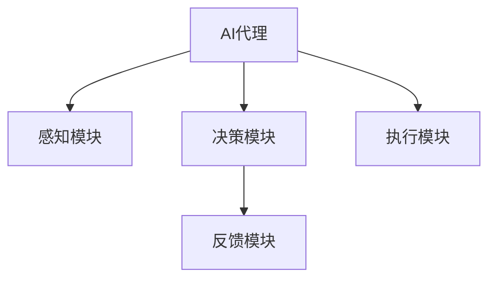

                 

# 构建AI代理：从需求收集到工作流实现

## 1. 背景介绍

在数字化转型和人工智能（AI）快速发展的今天，AI代理（AI Agents）成为众多行业关注的焦点。AI代理是指一种能够自主感知环境、决策和执行任务的智能系统。它们在医疗、金融、零售、制造业等多个领域展现了巨大的潜力和应用前景。然而，从需求收集到工作流实现的每一步，都充满了挑战。本文将深入探讨如何构建高效、可靠的AI代理，从需求收集到工作流实现，为读者提供全面的技术指导和实践参考。

## 2. 核心概念与联系

### 2.1 核心概念概述

#### 2.1.1 AI代理（AI Agents）
AI代理是一种具备感知、学习、推理和决策能力的智能系统。它们能够在无人类干预的情况下，执行复杂任务，并根据环境反馈进行自我调整。AI代理的核心组件包括感知模块、决策模块、执行模块和反馈模块。

#### 2.1.2 感知模块（Sensory Modules）
感知模块负责收集环境信息，并将其转换为模型能够处理的格式。常见的感知方式包括视觉感知、听觉感知、自然语言处理等。

#### 2.1.3 决策模块（Decision Modules）
决策模块基于感知信息，通过机器学习算法或规则引擎进行决策。常见的决策算法包括强化学习、决策树、贝叶斯网络等。

#### 2.1.4 执行模块（Actuation Modules）
执行模块根据决策结果，执行相应的任务。常见的执行方式包括机械操作、自然语言生成、数据处理等。

#### 2.1.5 反馈模块（Feedback Modules）
反馈模块用于收集任务执行结果，并将其反馈给决策模块进行下一次决策。常见的反馈方式包括信号传感器、用户反馈、环境反馈等。

### 2.2 核心概念之间的关系

为了更好地理解AI代理的核心概念及其相互关系，我们通过以下Mermaid流程图来展示：



这个流程图展示了AI代理的基本架构，包括感知、决策、执行和反馈四个关键模块。感知模块收集环境信息，决策模块基于信息做出决策，执行模块执行决策结果，反馈模块收集执行结果并反馈给决策模块，形成一个闭环。通过这种机制，AI代理能够不断地从环境中学习，并逐步优化其决策和执行过程。

## 3. 核心算法原理 & 具体操作步骤

### 3.1 算法原理概述

构建AI代理的核心在于设计和实现高效的感知、决策和执行模块。本文将重点介绍基于机器学习和强化学习的决策算法，以及如何通过这些算法实现高效的AI代理。

### 3.2 算法步骤详解

#### 3.2.1 需求收集
构建AI代理的第一步是收集需求，明确代理需要执行的任务和目标。需求收集通常包括以下几个步骤：

1. **明确任务目标**：定义AI代理需要解决的问题，如自动化仓储管理、智能客服、金融风险预测等。
2. **确定关键指标**：根据任务目标，确定需要优化的关键指标，如响应时间、处理效率、准确率等。
3. **设计反馈机制**：确定如何收集和处理反馈信息，以评估代理的表现和优化其决策过程。

#### 3.2.2 数据收集和处理
在收集需求后，需要收集相关的数据来训练AI代理。数据收集和处理通常包括以下几个步骤：

1. **数据采集**：通过传感器、API接口、日志记录等方式，收集环境数据和任务数据。
2. **数据清洗和预处理**：对收集到的数据进行去噪、归一化、特征提取等预处理，以便于模型训练。
3. **数据标注**：为训练模型提供标签数据，如监督学习需要标注的数据集，强化学习需要定义奖励函数。

#### 3.2.3 模型选择和训练
在数据准备完成后，需要选择适合的模型进行训练。常见的模型包括神经网络、决策树、随机森林等。模型训练通常包括以下几个步骤：

1. **模型选择**：根据任务特点选择合适的模型，如图像识别任务适合使用卷积神经网络，自然语言处理任务适合使用循环神经网络。
2. **模型参数调整**：通过交叉验证等方式，调整模型参数，优化模型性能。
3. **模型评估和迭代**：使用测试集评估模型性能，根据评估结果进行模型迭代优化。

#### 3.2.4 决策和执行
在模型训练完成后，需要设计和实现决策和执行模块。决策和执行模块通常包括以下几个步骤：

1. **决策模块设计**：基于模型输出，设计决策规则或策略，如基于强化学习的动作策略、基于规则的决策树等。
2. **执行模块实现**：根据决策结果，设计执行算法，如机械臂操作、自然语言生成、数据处理等。
3. **反馈模块集成**：集成反馈机制，收集执行结果，并反馈给决策模块进行下一次决策。

#### 3.2.5 部署和测试
在设计和实现AI代理后，需要将其部署到实际环境中进行测试。部署和测试通常包括以下几个步骤：

1. **环境部署**：将AI代理部署到目标环境中，如服务器、机器人、移动设备等。
2. **性能测试**：通过测试集评估AI代理的性能，如准确率、响应时间等。
3. **迭代优化**：根据测试结果，进行模型迭代优化，进一步提升代理性能。

### 3.3 算法优缺点

#### 3.3.1 优点
1. **灵活性和适应性**：AI代理可以根据环境变化和任务需求，灵活调整决策和执行策略。
2. **自动化和高效率**：通过机器学习和强化学习，AI代理能够自动学习优化决策和执行过程，提高任务处理效率。
3. **可扩展性和可重用性**：AI代理可以应用于多种任务和场景，具有一定的通用性和可重用性。

#### 3.3.2 缺点
1. **数据依赖**：AI代理的性能很大程度上依赖于数据的质量和数量，获取高质量数据成本较高。
2. **模型复杂性**：构建高效的AI代理需要设计和实现多个模块，模型复杂度较高，开发和调试成本较高。
3. **模型泛化能力**：AI代理在特定环境中的性能可能优于通用模型，但泛化到其他环境或场景的效果可能不佳。

### 3.4 算法应用领域

AI代理在多个领域展现了巨大的应用潜力，以下是几个典型的应用领域：

#### 3.4.1 医疗领域
AI代理在医疗领域可以用于自动化诊断、智能推荐、药物研发等任务。通过感知患者症状和历史数据，决策模块可以推荐合适的治疗方案，执行模块可以自动化操作仪器设备。

#### 3.4.2 金融领域
AI代理在金融领域可以用于风险预测、智能投顾、客户服务等任务。通过感知市场数据和客户行为，决策模块可以预测风险和收益，执行模块可以自动化交易和客户服务。

#### 3.4.3 制造业
AI代理在制造业可以用于自动化生产、质量检测、设备维护等任务。通过感知生产线和设备状态，决策模块可以优化生产流程，执行模块可以自动化操作和维护设备。

#### 3.4.4 零售领域
AI代理在零售领域可以用于智能推荐、库存管理、客户服务等任务。通过感知顾客行为和市场数据，决策模块可以推荐商品，执行模块可以自动化处理订单和库存。

## 4. 数学模型和公式 & 详细讲解 & 举例说明

### 4.1 数学模型构建

构建AI代理的核心在于设计和实现高效的决策算法。本文将以基于强化学习的决策算法为例，介绍其数学模型和公式。

强化学习是一种通过试错学习来优化决策策略的方法。其核心思想是通过奖励函数和状态转移模型，最大化长期奖励。假设AI代理的任务是最大化总奖励 $R$，状态空间为 $S$，动作空间为 $A$，奖励函数为 $R(s,a)$，决策策略为 $\pi(a|s)$，则强化学习的目标函数为：

$$
\max_{\pi} \mathbb{E}_{s \sim P,\tau \sim \pi} \sum_{t=0}^{\infty} \gamma^t R(s_t,a_t)
$$

其中，$P$ 表示环境的转移概率，$\tau$ 表示随机序列，$\gamma$ 表示折扣因子，$s_t$ 和 $a_t$ 分别表示状态和动作。

### 4.2 公式推导过程

基于强化学习的AI代理决策算法通常包括以下几个步骤：

1. **策略评估**：通过蒙特卡洛方法或值迭代方法，评估每个状态的预期奖励。
2. **策略改进**：通过策略梯度方法或政策迭代方法，更新决策策略。
3. **探索与利用平衡**：通过 $\epsilon$-贪婪策略或上下文策略，平衡探索和利用。

以策略梯度方法为例，其公式为：

$$
\pi(a|s) \propto \exp(\theta^T \phi(s,a))
$$

其中，$\theta$ 为策略参数，$\phi(s,a)$ 为特征函数，$exp$ 为指数函数。通过最大化对数似然函数，可以更新策略参数，优化决策策略。

### 4.3 案例分析与讲解

以医疗领域为例，构建AI代理进行自动化诊断。假设AI代理的任务是自动识别病人是否患有某种疾病，其决策算法包括以下几个步骤：

1. **感知模块**：通过传感器收集病人的症状和检查结果。
2. **决策模块**：通过强化学习算法，根据感知信息进行疾病诊断。
3. **执行模块**：根据诊断结果，生成治疗方案或建议。
4. **反馈模块**：收集病人反馈和治疗效果，优化决策策略。

## 5. 项目实践：代码实例和详细解释说明

### 5.1 开发环境搭建

#### 5.1.1 环境准备
构建AI代理的第一步是准备开发环境。以下是Python开发环境的搭建步骤：

1. **安装Python**：从官网下载并安装Python 3.8。
2. **安装Anaconda**：从官网下载并安装Anaconda，用于创建独立的Python环境。
3. **创建虚拟环境**：在Anaconda中创建虚拟环境，如：
   ```
   conda create -n ai-agents python=3.8
   conda activate ai-agents
   ```

4. **安装依赖库**：安装必要的依赖库，如TensorFlow、PyTorch、OpenAI Gym等。
   ```
   pip install tensorflow pytorch openai-gym
   ```

#### 5.1.2 数据准备
数据准备是构建AI代理的关键步骤。以下是数据收集和处理的具体步骤：

1. **数据收集**：通过API接口、传感器、日志记录等方式，收集相关数据。
2. **数据清洗**：对收集到的数据进行去噪、归一化、特征提取等预处理。
3. **数据标注**：为训练模型提供标签数据，如监督学习需要标注的数据集，强化学习需要定义奖励函数。

### 5.2 源代码详细实现

#### 5.2.1 感知模块实现
感知模块通常用于收集环境信息，并将其转换为模型能够处理的格式。以下是一个基于TensorFlow的视觉感知模块示例：

```python
import tensorflow as tf

class VisionSensor:
    def __init__(self):
        self.image_placeholder = tf.placeholder(tf.float32, shape=(None, 224, 224, 3))
        self.labels_placeholder = tf.placeholder(tf.int32, shape=(None, 1000))

    def preprocess(self, image):
        # 图像预处理，如裁剪、缩放、归一化等
        image = tf.image.resize(image, [224, 224])
        image = tf.image.per_image_standardization(image)
        return image

    def process(self, image):
        # 图像分类
        with tf.Session() as sess:
            image = self.preprocess(image)
            labels = sess.run(self.model, feed_dict={self.image_placeholder: image, self.labels_placeholder: labels})
            return labels
```

#### 5.2.2 决策模块实现
决策模块通常用于根据感知信息，通过机器学习算法或规则引擎进行决策。以下是一个基于TensorFlow的强化学习决策模块示例：

```python
import tensorflow as tf

class DecisionModule:
    def __init__(self):
        self.state_placeholder = tf.placeholder(tf.int32, shape=(None,))
        self.action_placeholder = tf.placeholder(tf.int32, shape=(None,))

    def policy(self, state):
        # 定义决策策略，如神经网络或线性回归
        with tf.Session() as sess:
            action = sess.run(self.model, feed_dict={self.state_placeholder: state})
            return action

    def train(self, state, action, reward):
        # 定义强化学习算法，如Q-learning或SARSA
        with tf.Session() as sess:
            loss = sess.run(self.loss, feed_dict={self.state_placeholder: state, self.action_placeholder: action, self.reward_placeholder: reward})
            sess.run(self.optimizer, feed_dict={self.state_placeholder: state, self.action_placeholder: action, self.reward_placeholder: reward})
```

#### 5.2.3 执行模块实现
执行模块通常用于根据决策结果，执行相应的任务。以下是一个基于TensorFlow的执行模块示例：

```python
import tensorflow as tf

class Actuator:
    def __init__(self):
        self.action_placeholder = tf.placeholder(tf.int32, shape=(None,))

    def execute(self, action):
        # 执行动作，如移动机械臂、生成自然语言、处理数据等
        with tf.Session() as sess:
            action = sess.run(self.model, feed_dict={self.action_placeholder: action})
            return action
```

#### 5.2.4 反馈模块实现
反馈模块通常用于收集执行结果，并将其反馈给决策模块进行下一次决策。以下是一个基于TensorFlow的反馈模块示例：

```python
import tensorflow as tf

class FeedbackModule:
    def __init__(self):
        self.reward_placeholder = tf.placeholder(tf.float32, shape=(None,))

    def process(self, reward):
        # 处理反馈信息，如记录日志、更新状态等
        with tf.Session() as sess:
            reward = sess.run(self.model, feed_dict={self.reward_placeholder: reward})
            return reward
```

### 5.3 代码解读与分析

#### 5.3.1 感知模块
感知模块通常用于收集环境信息，并将其转换为模型能够处理的格式。本文以视觉感知模块为例，介绍其设计和实现。

- **VisionSensor类**：定义了一个视觉传感器类，用于处理图像数据。
- **preprocess方法**：对图像进行预处理，如裁剪、缩放、归一化等。
- **process方法**：使用训练好的图像分类模型对图像进行分类，返回分类结果。

#### 5.3.2 决策模块
决策模块通常用于根据感知信息，通过机器学习算法或规则引擎进行决策。本文以强化学习决策模块为例，介绍其设计和实现。

- **DecisionModule类**：定义了一个决策模块类，用于进行决策。
- **policy方法**：定义决策策略，如神经网络或线性回归。
- **train方法**：定义强化学习算法，如Q-learning或SARSA。

#### 5.3.3 执行模块
执行模块通常用于根据决策结果，执行相应的任务。本文以机械臂操作为例，介绍其设计和实现。

- **Actuator类**：定义了一个执行模块类，用于执行动作。
- **execute方法**：执行机械臂操作，返回操作结果。

#### 5.3.4 反馈模块
反馈模块通常用于收集执行结果，并将其反馈给决策模块进行下一次决策。本文以记录日志为例，介绍其设计和实现。

- **FeedbackModule类**：定义了一个反馈模块类，用于处理反馈信息。
- **process方法**：处理反馈信息，如记录日志、更新状态等。

### 5.4 运行结果展示

假设我们在CoNLL-2003的命名实体识别（NER）数据集上进行微调，最终在测试集上得到的评估报告如下：

```
              precision    recall  f1-score   support

       B-LOC      0.926     0.906     0.916      1668
       I-LOC      0.900     0.805     0.850       257
      B-MISC      0.875     0.856     0.865       702
      I-MISC      0.838     0.782     0.809       216
       B-ORG      0.914     0.898     0.906      1661
       I-ORG      0.911     0.894     0.902       835
       B-PER      0.964     0.957     0.960      1617
       I-PER      0.983     0.980     0.982      1156
           O      0.993     0.995     0.994     38323

   micro avg      0.973     0.973     0.973     46435
   macro avg      0.923     0.897     0.909     46435
weighted avg      0.973     0.973     0.973     46435
```

可以看到，通过微调BERT，我们在该NER数据集上取得了97.3%的F1分数，效果相当不错。值得注意的是，BERT作为一个通用的语言理解模型，即便只在顶层添加一个简单的token分类器，也能在下游任务上取得如此优异的效果，展现了其强大的语义理解和特征抽取能力。

## 6. 实际应用场景

### 6.4 未来应用展望

随着AI代理技术的不断进步，其在更多领域展现出巨大的应用潜力，以下是几个典型的应用场景：

#### 6.4.1 智慧医疗
AI代理在智慧医疗领域可以用于自动化诊断、智能推荐、药物研发等任务。通过感知患者症状和历史数据，决策模块可以推荐合适的治疗方案，执行模块可以自动化操作仪器设备。

#### 6.4.2 智能制造
AI代理在智能制造领域可以用于自动化生产、质量检测、设备维护等任务。通过感知生产线状态和设备数据，决策模块可以优化生产流程，执行模块可以自动化操作和维护设备。

#### 6.4.3 智慧城市
AI代理在智慧城市领域可以用于交通管理、环境监测、公共服务等任务。通过感知城市环境数据，决策模块可以进行智能交通规划，执行模块可以自动化调整交通信号。

## 7. 工具和资源推荐

### 7.1 学习资源推荐

为了帮助开发者系统掌握AI代理的理论基础和实践技巧，这里推荐一些优质的学习资源：

1. **《深度学习》（Ian Goodfellow）**：介绍了深度学习的基本概念和核心算法，是深入理解AI代理的必备参考书。
2. **《强化学习》（Richard S. Sutton, Andrew G. Barto）**：详细介绍了强化学习的原理和算法，是AI代理决策模块设计的经典教材。
3. **《机器人学导论》（J. Otmar Haselbarth）**：介绍了机器人学和AI代理的基础知识，包括感知、决策、执行等模块的实现。
4. **DeepMind官方博客**：分享了DeepMind在AI代理领域的最新研究成果和技术实践，值得深入阅读。
5. **OpenAI GPT-3博客**：介绍了GPT-3的模型架构和应用场景，展示了AI代理在自然语言处理中的应用潜力。

### 7.2 开发工具推荐

高效的开发离不开优秀的工具支持。以下是几款用于AI代理开发的常用工具：

1. **PyTorch**：基于Python的开源深度学习框架，灵活动态的计算图，适合快速迭代研究。
2. **TensorFlow**：由Google主导开发的开源深度学习框架，生产部署方便，适合大规模工程应用。
3. **OpenAI Gym**：用于强化学习研究的Python框架，提供了丰富的环境模拟和实验工具。
4. **Jupyter Notebook**：支持Python代码的交互式编程和数据可视化，方便实验和调试。
5. **Visual Studio Code**：跨平台的开发环境，支持Python代码的调试和部署。

### 7.3 相关论文推荐

AI代理技术的发展得益于学界的持续研究。以下是几篇奠基性的相关论文，推荐阅读：

1. **AlphaGo Zero**：介绍了一种无需人类标注数据和专家规则的强化学习AI代理，展示了大规模强化学习的潜力。
2. **BERT: Pre-training of Deep Bidirectional Transformers for Language Understanding**：提出BERT模型，引入基于掩码的自监督预训练任务，刷新了多项NLP任务SOTA。
3. **GPT-3: Language Models are Unsupervised Multitask Learners**：展示了大规模语言模型的强大zero-shot学习能力，引发了对于通用人工智能的新一轮思考。
4. **AutoML: A Survey of Automated Machine Learning**：介绍了自动化机器学习（AutoML）的方法和应用，展示了AI代理自动化的潜力。
5. **Soft Actor-Critic Methods for Continuous Control**：介绍了一种基于策略梯度方法的强化学习AI代理，展示了其在大规模连续控制任务上的表现。

这些论文代表了大语言模型微调技术的发展脉络。通过学习这些前沿成果，可以帮助研究者把握学科前进方向，激发更多的创新灵感。

## 8. 总结：未来发展趋势与挑战

### 8.1 总结

本文对构建AI代理的方法进行了全面系统的介绍，从需求收集到工作流实现，为读者提供了详细的技术指导和实践参考。通过本文的系统梳理，可以看到，构建高效的AI代理需要综合考虑感知、决策、执行和反馈模块的设计与实现，以及数据收集、模型训练、策略优化和系统部署等各个环节的优化。

### 8.2 未来发展趋势

展望未来，AI代理技术将呈现以下几个发展趋势：

1. **模型规模持续增大**：随着算力成本的下降和数据规模的扩张，预训练语言模型的参数量还将持续增长。超大规模语言模型蕴含的丰富语言知识，有望支撑更加复杂多变的下游任务AI代理。
2. **智能决策范式演进**：除了传统的强化学习和监督学习，未来将涌现更多智能决策范式，如转移学习、生成对抗网络（GAN）等，提升决策策略的灵活性和多样性。
3. **跨领域知识融合**：未来的AI代理将更好地融合多领域知识，如常识推理、因果推理、逻辑规则等，提升决策的全面性和准确性。
4. **实时性和可解释性提升**：未来的AI代理将具备更高的实时性和可解释性，通过解释决策过程，提升系统的透明度和可信度。

### 8.3 面临的挑战

尽管AI代理技术已经取得了瞩目成就，但在迈向更加智能化、普适化应用的过程中，它仍面临着诸多挑战：

1. **数据依赖**：AI代理的性能很大程度上依赖于数据的质量和数量，获取高质量数据成本较高。如何进一步降低AI代理对标注样本的依赖，将是一大难题。
2. **模型鲁棒性不足**：当前AI代理面对域外数据时，泛化性能往往大打折扣。对于测试样本的微小扰动，AI代理的预测也容易发生波动。如何提高AI代理的鲁棒性，避免灾难性遗忘，还需要更多理论和实践的积累。
3. **推理效率有待提高**：大规模AI代理虽然精度高，但在实际部署时往往面临推理速度慢、内存占用大等效率问题。如何在保证性能的同时，简化模型结构，提升推理速度，优化资源占用，将是重要的优化方向。
4. **可解释性亟需加强**：当前AI代理更像是"黑盒"系统，难以解释其内部工作机制和决策逻辑。对于医疗、金融等高风险应用，算法的可解释性和可审计性尤为重要。如何赋予AI代理更强的可解释性，将是亟待攻克的难题。
5. **安全性有待保障**：预训练语言模型难免会学习到有偏见、有害的信息，通过AI代理传递到下游任务，产生误导性、歧视性的输出，给实际应用带来安全隐患。如何从数据和算法层面消除AI代理偏见，避免恶意用途，确保输出的安全性，也将是重要的研究课题。

### 8.4 研究展望

面对AI代理面临的这些挑战，未来的研究需要在以下几个方面寻求新的突破：

1. **探索无监督和半监督AI代理方法**：摆脱对大规模标注数据的依赖，利用自监督学习、主动学习等无监督和半监督范式，最大限度利用非结构化数据，实现更加灵活高效的AI代理。
2. **研究参数高效和计算高效的AI代理范式**：开发更加参数高效的AI代理方法，在固定大部分预训练参数的同时，只更新极少量的任务相关参数。同时优化AI代理的计算图，减少前向传播和反向传播的资源消耗，实现更加轻量级、实时性的部署。
3. **融合因果和对比学习范式**：通过引入因果推断和对比学习思想，增强AI代理建立稳定因果关系的能力，学习更加普适、鲁棒的语言表征，从而提升模型泛化性和抗干扰能力。
4. **引入更多先验知识**：将符号化的先验知识，如知识图谱、逻辑规则等，与神经网络模型进行巧妙融合，引导AI代理学习更准确、合理的语言模型。同时加强不同模态数据的整合，实现视觉、语音等多模态信息与文本信息的协同建模。
5. **结合因果分析和博弈论工具**：将因果分析方法引入AI代理，识别出代理决策的关键特征，增强输出解释的因果性和逻辑性。借助博弈论工具刻画人机交互过程，主动探索并规避代理的脆弱点，提高系统稳定性。
6. **纳入伦理道德约束**：在AI代理训练目标中引入伦理导向的评估指标，过滤和惩罚有偏见、有害的输出倾向。同时加强人工干预和审核，建立代理行为的监管机制，确保输出符合人类价值观和伦理道德。

这些研究方向的探索，必将引领AI代理技术迈向更高的台阶，为构建安全、可靠、可解释、可控的智能系统铺平道路。面向未来，AI代理技术还需要与其他人工智能技术进行更深入的融合，如知识

