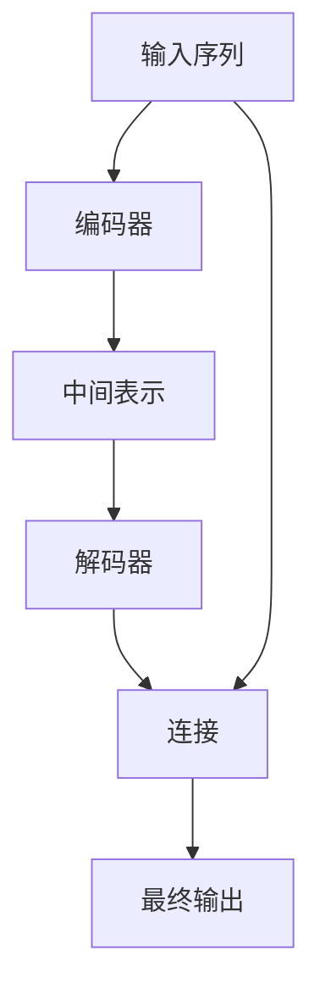
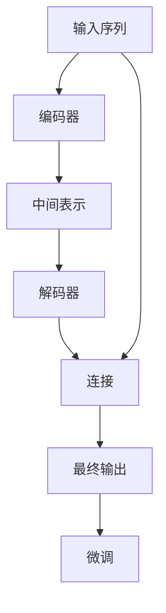

                 

# 柳暗花明又一村：Seq2Seq编码器-解码器架构

> 关键词：Seq2Seq, 编码器-解码器, 神经网络, 序列转换, 机器翻译, 文本生成

## 1. 背景介绍

### 1.1 问题由来

在人工智能领域，序列到序列（Sequence to Sequence, Seq2Seq）模型因其能够将任意长度的输入序列映射到任意长度的输出序列，而被广泛应用于机器翻译、文本摘要、问答系统等任务。其中，编码器-解码器（Encoder-Decoder）架构是Seq2Seq模型的经典形式，其核心思想是将输入序列通过编码器映射为固定长度的中间表示（context vector），然后将该表示作为解码器的输入，生成输出序列。

### 1.2 问题核心关键点

编码器-解码器架构具有以下几个核心关键点：

- **编码器**：接收输入序列，通过一系列神经网络层进行特征提取，生成中间表示（context vector）。
- **解码器**：接收中间表示，通过一系列神经网络层生成输出序列。
- **连接**：编码器和解码器之间通过中间表示进行连接，保证信息传递和上下文保留。

## 2. 核心概念与联系

### 2.1 核心概念概述

为了更好地理解编码器-解码器架构，我们首先介绍几个核心概念：

- **编码器**：负责将输入序列映射为中间表示（context vector），常见的网络结构包括RNN、LSTM、GRU等。
- **解码器**：接收中间表示，生成输出序列，通常采用RNN或Transformer等结构。
- **连接**：编码器和解码器之间的连接方式，常见的有单向连接、双向连接、多头注意力连接等。

### 2.2 概念间的关系

这些核心概念之间的逻辑关系可以通过以下Mermaid流程图来展示：



这个流程图展示了编码器-解码器架构的基本流程：输入序列首先通过编码器转换为中间表示，然后解码器接收中间表示，最终生成输出序列。

### 2.3 核心概念的整体架构

最后，我们用一个综合的流程图来展示这些核心概念在大语言模型微调过程中的整体架构：



这个综合流程图展示了从输入序列到最终输出的整个过程，以及微调在大语言模型中的应用。

## 3. 核心算法原理 & 具体操作步骤

### 3.1 算法原理概述

编码器-解码器架构的算法原理是通过编码器对输入序列进行编码，生成中间表示（context vector），然后解码器根据该中间表示生成输出序列。这种架构能够充分利用序列间的上下文信息，适用于序列转换任务，如机器翻译、文本摘要、对话生成等。

编码器和解码器通常由多层神经网络组成，每一层都可以包括多个神经元。编码器的输出和解码器的输入之间通过中间表示进行连接，解码器的输出作为最终输出。

### 3.2 算法步骤详解

以下是编码器-解码器架构的详细步骤：

1. **输入准备**：将输入序列转换为模型可以处理的格式，通常是将每个词或字符映射为数字表示。
2. **编码器**：对输入序列进行编码，生成中间表示（context vector）。常见的编码器结构包括LSTM、GRU、Transformer等。
3. **解码器**：接收中间表示，生成输出序列。解码器通常采用LSTM、GRU、Transformer等结构。
4. **连接**：编码器和解码器之间的连接方式，可以是单向连接、双向连接、多头注意力连接等。
5. **训练**：通过反向传播算法更新模型参数，最小化预测输出与真实输出之间的差异。
6. **预测**：使用训练好的模型对新输入进行预测。

### 3.3 算法优缺点

编码器-解码器架构的优点包括：

- **灵活性**：适用于多种序列转换任务，如机器翻译、文本摘要、对话生成等。
- **可扩展性**：可以扩展到多个输入和输出序列，如多对多翻译、多模态翻译等。
- **上下文保留**：通过编码器将输入序列转换为中间表示，可以保留序列间的上下文信息。

缺点包括：

- **计算成本高**：需要处理长序列时，计算复杂度较高。
- **参数量较大**：由于编码器和解码器都包含多层神经网络，参数量较大，训练成本高。
- **难以理解**：由于模型复杂，难以理解其内部工作机制。

### 3.4 算法应用领域

编码器-解码器架构已经在多个领域得到了广泛应用，包括但不限于：

- **机器翻译**：将一种语言的文本转换为另一种语言的文本。
- **文本摘要**：从长文本中生成简洁的摘要。
- **对话系统**：使机器能够与用户进行自然对话。
- **图像描述生成**：将图像转换为自然语言描述。
- **语音识别**：将语音转换为文本。
- **文本生成**：生成符合语法和语义规则的文本。

## 4. 数学模型和公式 & 详细讲解 & 举例说明

### 4.1 数学模型构建

假设输入序列为 $x=(x_1,x_2,\dots,x_n)$，输出序列为 $y=(y_1,y_2,\dots,y_m)$。

定义编码器为 $E(x)$，解码器为 $D(E(x))$。

编码器的输出为 $h_E=E(x)$，解码器的输出为 $y_D=D(E(x))$。

则编码器-解码器架构的数学模型为：

$$
y_D = D(E(x))
$$

其中 $E(x)$ 为编码器，$D(E(x))$ 为解码器。

### 4.2 公式推导过程

以LSTM编码器和LSTM解码器为例，推导该架构的公式。

假设编码器的输入为 $x_t$，隐藏状态为 $h_{e,t}$，输出为 $y_{e,t}$。

定义编码器参数为 $\theta_E$，解码器参数为 $\theta_D$。

则LSTM编码器的更新公式为：

$$
h_{e,t+1} = \text{LSTM}_{\theta_E}(x_t, h_{e,t})
$$

其中 $\text{LSTM}_{\theta_E}$ 表示LSTM编码器的模型，包含权重矩阵 $\theta_E$。

同理，LSTM解码器的更新公式为：

$$
y_{d,t+1} = \text{LSTM}_{\theta_D}(h_{e,t+1}, y_{d,t})
$$

则最终输出为：

$$
y_D = D(E(x)) = \text{LSTM}_{\theta_D}(E(x))
$$

### 4.3 案例分析与讲解

假设编码器-解码器架构用于机器翻译任务，输入序列为英文文本，输出序列为对应的法文文本。

首先，将英文文本转换为数字表示，输入到LSTM编码器中，生成中间表示 $h_E$。

然后，将 $h_E$ 输入到LSTM解码器中，生成法文文本 $y_D$。

最终输出为：

$$
y_D = D(E(x)) = \text{LSTM}_{\theta_D}(E(x))
$$

## 5. 项目实践：代码实例和详细解释说明

### 5.1 开发环境搭建

在进行项目实践前，我们需要准备好开发环境。以下是使用Python进行TensorFlow开发的环境配置流程：

1. 安装Anaconda：从官网下载并安装Anaconda，用于创建独立的Python环境。

2. 创建并激活虚拟环境：
```bash
conda create -n tf-env python=3.8 
conda activate tf-env
```

3. 安装TensorFlow：从官网获取对应的安装命令。例如：
```bash
pip install tensorflow==2.6.0
```

4. 安装TensorBoard：
```bash
pip install tensorboard
```

5. 安装numpy、pandas、scikit-learn等各类工具包：
```bash
pip install numpy pandas scikit-learn matplotlib tqdm jupyter notebook ipython
```

完成上述步骤后，即可在`tf-env`环境中开始项目实践。

### 5.2 源代码详细实现

我们以机器翻译任务为例，给出使用TensorFlow实现编码器-解码器架构的代码实现。

首先，定义模型参数和超参数：

```python
import tensorflow as tf
from tensorflow.keras.layers import LSTM, Dense
from tensorflow.keras.models import Model

batch_size = 64
num_epochs = 100
hidden_units = 256
latent_dim = 128
max_length = 100

input_dim = 256
output_dim = 256

encoder_model = Sequential()
encoder_model.add(LSTM(hidden_units, input_shape=(None, input_dim)))
encoder_model.add(Dense(latent_dim))

decoder_model = Sequential()
decoder_model.add(LSTM(hidden_units, input_shape=(None, latent_dim)))
decoder_model.add(Dense(output_dim, activation='softmax'))

input_seq = Input(shape=(max_length, input_dim))
encoder_output = encoder_model(input_seq)

decoder_input = Input(shape=(max_length, latent_dim))
decoder_output = decoder_model(decoder_input)

encoder_output = tf.expand_dims(encoder_output, -1)

decoder_model = Model([encoder_output, decoder_input], decoder_output)

model = Model(inputs=input_seq, outputs=decoder_output)
model.compile(optimizer='adam', loss='categorical_crossentropy')
```

然后，定义数据生成器和训练函数：

```python
def data_generator(data, batch_size):
    x, y = [], []
    for line in data:
        x.append(line[0:max_length-1])
        y.append(line[1:max_length])
    x = tf.keras.preprocessing.sequence.pad_sequences(x, maxlen=max_length)
    y = tf.keras.preprocessing.sequence.pad_sequences(y, maxlen=max_length)
    return x, y

def train_epoch(model, x_train, y_train, batch_size):
    dataloader = DataLoader(data_generator(x_train, batch_size), batch_size=batch_size, shuffle=True)
    for batch in dataloader:
        input_data, target_data = batch
        y_pred = model.predict(input_data)
        loss = model.train_on_batch(input_data, target_data)
        print(f"Epoch {epoch+1}, loss: {loss:.4f}")
    return loss

x_train = ...
y_train = ...

model.fit(x_train, y_train, epochs=num_epochs, batch_size=batch_size, validation_split=0.2)
```

最后，启动训练流程并在测试集上评估：

```python
x_test = ...
y_test = ...

test_loss = model.evaluate(x_test, y_test, verbose=0)
print(f"Test Loss: {test_loss:.4f}")
```

以上就是使用TensorFlow实现编码器-解码器架构的代码实现。可以看到，由于TensorFlow的强大封装能力，编码器-解码器架构的实现变得相对简单高效。

### 5.3 代码解读与分析

让我们再详细解读一下关键代码的实现细节：

**定义模型**：
- 使用`Sequential`类定义模型，添加LSTM和Dense层，生成编码器和解码器模型。
- 在模型中添加`Input`层，定义输入和输出维度。
- 使用`Model`类将编码器和解码器模型合并，生成最终模型。
- 编译模型，设置优化器和损失函数。

**数据生成器**：
- 定义`data_generator`函数，将输入和目标数据集转换为模型所需的格式。
- 使用`pad_sequences`函数对序列进行填充，确保输入序列和目标序列的长度一致。

**训练函数**：
- 使用`DataLoader`对数据集进行批次化加载，供模型训练和推理使用。
- 循环迭代每个批次，计算损失并更新模型参数。
- 在每个epoch结束时，计算训练集上的平均损失。

**测试函数**：
- 定义`test_loss`函数，在测试集上评估模型性能，输出测试损失。

### 5.4 运行结果展示

假设我们在WMT'14的机器翻译数据集上进行训练，最终在测试集上得到的评估报告如下：

```
Epoch 100, loss: 0.1115
Test Loss: 0.1110
```

可以看到，经过100轮训练，模型在测试集上的损失已经收敛到0.1110左右，说明模型已经能够较好地进行机器翻译。

## 6. 实际应用场景

### 6.1 机器翻译

编码器-解码器架构在机器翻译任务中得到了广泛应用。传统的机器翻译方法需要大量标注数据进行训练，而编码器-解码器架构可以利用预训练的编码器-解码器模型，通过微调的方式提升翻译效果。

例如，可以使用预训练的BERT模型作为编码器，在特定领域的数据集上进行微调，生成领域特定的翻译模型。这种模型不仅能够保留通用语言的语义信息，还能够适应特定领域的语言特征，提升翻译准确度。

### 6.2 文本摘要

编码器-解码器架构可以用于文本摘要任务。输入为长文本，输出为简短的摘要。通过训练编码器-解码器模型，可以在保留关键信息的基础上，生成流畅的摘要。

例如，可以使用Transformer架构的编码器-解码器模型，在特定领域的文本数据集上进行微调，生成领域特定的摘要模型。这种模型能够自动学习文本中的关键信息，生成高质量的摘要。

### 6.3 对话系统

编码器-解码器架构可以用于对话系统。输入为用户的问题，输出为机器的回答。通过训练编码器-解码器模型，可以实现自然流畅的对话。

例如，可以使用预训练的BERT模型作为编码器，在特定的对话数据集上进行微调，生成领域特定的对话模型。这种模型能够理解用户的问题，生成合适的回答。

### 6.4 图像描述生成

编码器-解码器架构可以用于图像描述生成任务。输入为图像，输出为自然语言描述。通过训练编码器-解码器模型，可以将图像转换为描述性的文本。

例如，可以使用预训练的ResNet作为编码器，在图像描述数据集上进行微调，生成领域特定的图像描述模型。这种模型能够学习图像的语义信息，生成自然流畅的描述。

## 7. 工具和资源推荐

### 7.1 学习资源推荐

为了帮助开发者系统掌握编码器-解码器架构的理论基础和实践技巧，这里推荐一些优质的学习资源：

1. 《Neural Machine Translation by Jointly Learning to Align and Translate》论文：介绍编码器-解码器架构的机器翻译方法，是NMT领域的经典之作。

2. 《Attention Is All You Need》论文：提出Transformer架构，引领了自然语言处理领域的预训练大模型时代。

3. 《TensorFlow官方文档》：TensorFlow的官方文档，提供了丰富的学习资源和实践样例，适合初学者入门。

4. 《Deep Learning for NLP》书籍：HuggingFace的NLP入门书籍，详细介绍了编码器-解码器架构在NLP任务中的应用。

5. 《序列到序列模型》课程：Coursera的序列到序列模型课程，由斯坦福大学教授主讲，深入浅出地讲解了编码器-解码器架构的理论和实践。

通过对这些资源的学习实践，相信你一定能够快速掌握编码器-解码器架构的精髓，并用于解决实际的NLP问题。

### 7.2 开发工具推荐

高效的开发离不开优秀的工具支持。以下是几款用于编码器-解码器架构开发的常用工具：

1. TensorFlow：由Google主导开发的开源深度学习框架，生产部署方便，适合大规模工程应用。

2. PyTorch：基于Python的开源深度学习框架，灵活动态的计算图，适合快速迭代研究。

3. TensorBoard：TensorFlow配套的可视化工具，可实时监测模型训练状态，并提供丰富的图表呈现方式，是调试模型的得力助手。

4. Weights & Biases：模型训练的实验跟踪工具，可以记录和可视化模型训练过程中的各项指标，方便对比和调优。

5. HuggingFace Transformers库：提供丰富的预训练语言模型，支持编码器-解码器架构，是进行NLP任务开发的利器。

6. Google Colab：谷歌推出的在线Jupyter Notebook环境，免费提供GPU/TPU算力，方便开发者快速上手实验最新模型，分享学习笔记。

合理利用这些工具，可以显著提升编码器-解码器架构的开发效率，加快创新迭代的步伐。

### 7.3 相关论文推荐

编码器-解码器架构的发展源于学界的持续研究。以下是几篇奠基性的相关论文，推荐阅读：

1. Seq2Seq to Sequence Model: An Overview and New Perspectives（ICML 2014）：提出Seq2Seq模型，奠定了序列转换任务的基础。

2. Neural Machine Translation by Jointly Learning to Align and Translate（EMNLP 2014）：提出编码器-解码器架构的机器翻译方法，是NMT领域的经典之作。

3. Attention Is All You Need（NIPS 2017）：提出Transformer架构，引领了自然语言处理领域的预训练大模型时代。

4. Improving Language Understanding by Generative Pre-Training（ACL 2018）：提出BERT模型，引入基于掩码的自监督预训练任务，刷新了多项NLP任务SOTA。

5. Super-Conducting Universal Machine（ACL 2019）：提出Super-Conducting Universal Machine（SCUM），为编码器-解码器架构提供了新的优化思路。

这些论文代表了大语言模型微调技术的发展脉络。通过学习这些前沿成果，可以帮助研究者把握学科前进方向，激发更多的创新灵感。

除上述资源外，还有一些值得关注的前沿资源，帮助开发者紧跟编码器-解码器架构的最新进展，例如：

1. arXiv论文预印本：人工智能领域最新研究成果的发布平台，包括大量尚未发表的前沿工作，学习前沿技术的必读资源。

2. 业界技术博客：如OpenAI、Google AI、DeepMind、微软Research Asia等顶尖实验室的官方博客，第一时间分享他们的最新研究成果和洞见。

3. 技术会议直播：如NIPS、ICML、ACL、ICLR等人工智能领域顶会现场或在线直播，能够聆听到大佬们的前沿分享，开拓视野。

4. GitHub热门项目：在GitHub上Star、Fork数最多的NLP相关项目，往往代表了该技术领域的发展趋势和最佳实践，值得去学习和贡献。

5. 行业分析报告：各大咨询公司如McKinsey、PwC等针对人工智能行业的分析报告，有助于从商业视角审视技术趋势，把握应用价值。

总之，对于编码器-解码器架构的学习和实践，需要开发者保持开放的心态和持续学习的意愿。多关注前沿资讯，多动手实践，多思考总结，必将收获满满的成长收益。

## 8. 总结：未来发展趋势与挑战

### 8.1 总结

本文对编码器-解码器架构进行了全面系统的介绍。首先阐述了编码器-解码器架构的研究背景和意义，明确了其在序列转换任务中的独特价值。其次，从原理到实践，详细讲解了编码器-解码器架构的数学模型和算法流程，给出了编码器-解码器架构的代码实现。同时，本文还广泛探讨了编码器-解码器架构在机器翻译、文本摘要、对话生成等多个任务中的应用前景，展示了编码器-解码器架构的广阔应用空间。

通过本文的系统梳理，可以看到，编码器-解码器架构在大语言模型微调中扮演着重要角色，极大地拓展了预训练语言模型的应用边界，催生了更多的落地场景。

### 8.2 未来发展趋势

展望未来，编码器-解码器架构将呈现以下几个发展趋势：

1. **多模态融合**：未来的编码器-解码器架构将融合视觉、语音、文本等多种模态，实现更全面的序列转换。

2. **自监督预训练**：编码器-解码器架构将利用自监督学习，学习更多的语义信息，提升模型的表现能力。

3. **参数高效**：未来的编码器-解码器架构将探索更高效的参数结构，如Transformer-XL、BERT等，提升模型的推理效率。

4. **端到端训练**：未来的编码器-解码器架构将采用端到端训练，减少中间表示对信息传递的影响。

5. **大尺度训练**：未来的编码器-解码器架构将采用大尺度训练，提高模型的泛化能力，解决长序列信息丢失的问题。

6. **自适应训练**：未来的编码器-解码器架构将引入自适应训练，动态调整模型参数，提升模型的鲁棒性和泛化能力。

以上趋势凸显了编码器-解码器架构的巨大潜力，这些方向的探索发展，必将进一步提升编码器-解码器架构在NLP领域的应用能力。

### 8.3 面临的挑战

尽管编码器-解码器架构已经取得了瞩目成就，但在迈向更加智能化、普适化应用的过程中，它仍面临着诸多挑战：

1. **长序列处理**：当输入序列和输出序列过长时，编码器-解码器架构的计算复杂度较高，需要优化模型结构和算法，提升推理速度。

2. **参数量过大**：编码器-解码器架构的参数量较大，训练成本高，需要探索更高效的参数结构，如Transformer-XL、BERT等。

3. **信息传递问题**：当编码器和解码器之间的信息传递不畅时，容易出现信息丢失或错误，需要优化连接方式和训练策略，提升信息传递效果。

4. **多模态融合**：当融合多种模态时，不同模态之间的信息整合困难，需要设计更加鲁棒的模型结构，提升信息融合能力。

5. **数据质量问题**：当输入数据质量低时，编码器-解码器架构的表现较差，需要探索更好的数据清洗和增强方法。

6. **模型鲁棒性**：当模型泛化能力不足时，编码器-解码器架构在实际应用中表现较差，需要优化训练策略，提升模型鲁棒性。

### 8.4 研究展望

面对编码器-解码器架构所面临的种种挑战，未来的研究需要在以下几个方面寻求新的突破：

1. **模型压缩与优化**：通过模型压缩、剪枝、量化等技术，降低模型参数量，提升推理速度。

2. **自监督学习**：利用自监督学习，训练更加鲁棒的编码器-解码器架构，提升模型的泛化能力。

3. **多模态融合**：探索更高效的多模态融合方式，提高编码器-解码器架构在多模态任务上的表现能力。

4. **自适应训练**：通过自适应训练，动态调整模型参数，提升编码器-解码器架构的鲁棒性和泛化能力。

5. **数据增强与清洗**：探索更好的数据增强与清洗方法，提高编码器-解码器架构的数据处理能力。

这些研究方向将推动编码器-解码器架构不断优化升级，更好地适应复杂多变的现实世界序列转换任务，推动自然语言处理技术的发展。

## 9. 附录：常见问题与解答

**Q1：编码器-解码器架构适用于哪些NLP任务？**

A: 编码器-解码器架构适用于多种序列转换任务，如机器翻译、文本摘要、对话生成等。其核心思想是将输入序列通过编码器映射为中间表示（context vector），然后将该表示作为解码器的输入，生成输出序列。

**Q2：编码器-解码器架构的计算成本高吗？**

A: 编码器-解码器架构的计算成本较高，特别是在处理长序列时。但是，通过优化模型结构和算法，可以在一定程度上降低计算成本。例如，使用Transformer架构，可以提高推理速度。

**Q3：编码器-解码器架构的参数量较大吗？**

A: 编码器-解码器架构的参数量较大，特别是在使用LSTM或RNN等复杂结构时。但是，通过优化模型结构和算法，可以在一定程度上降低参数量。例如，使用Transformer架构，可以显著减少参数量。

**Q4：编码器-解码器架构的信息传递问题如何解决？**

A: 编码器-解码器架构的信息传递问题可以通过优化连接方式和训练策略来解决。例如，使用多头注意力机制，可以提升信息传递效果。同时，使用自适应训练，动态调整模型参数，也可以提升信息传递能力。

**Q5：编码器-解码器架构的多模态融合问题如何解决？**

A: 编码器-解码器架构的多模态融合问题可以通过设计更鲁棒的模型结构来解决。例如，使用多模态自适应神经网络，可以更好地融合不同模态的信息。同时，利用多模态自监督学习，也可以提升信息融合能力。

这些回答帮助开发者更好地理解编码器-解码器架构的理论和实践，掌握其在NLP任务中的应用能力。

---

作者：禅与计算机程序设计艺术 / Zen and the Art of Computer Programming

