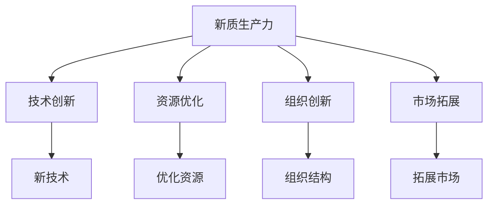
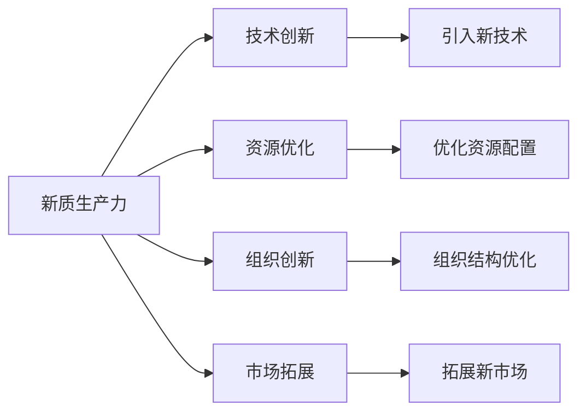
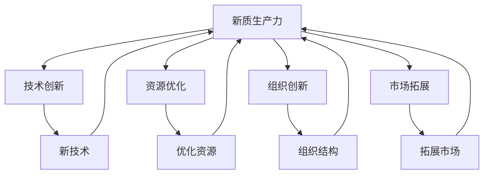
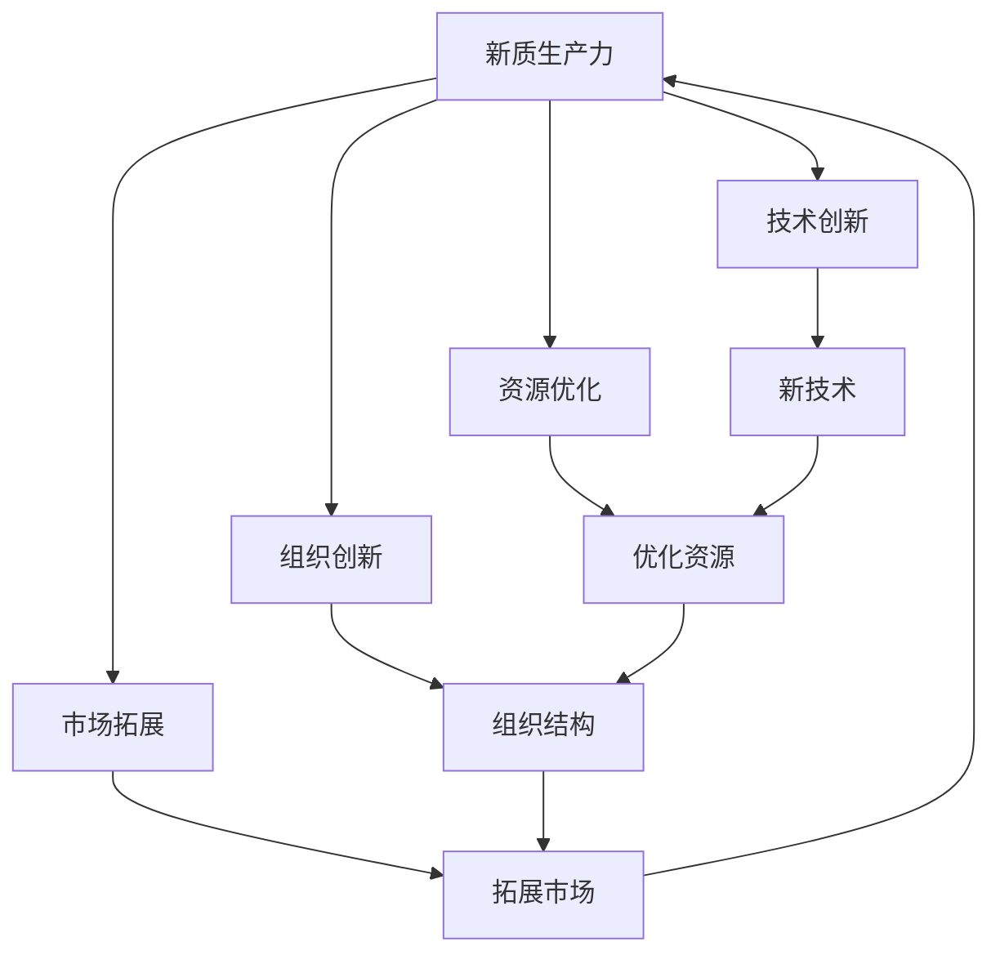

                 

# 核心竞争力提升的新质生产力

## 1. 背景介绍

### 1.1 问题由来
随着信息技术在各行各业的深入应用，企业的核心竞争力正在经历着深刻的变革。在数字化转型的浪潮中，如何提升企业的技术实力，塑造全新的竞争优势，已经成为许多企业管理者关注的焦点。近年来，人工智能(AI)、大数据、云计算等新技术不断涌现，为企业提供了全新的技术手段，加速了行业竞争格局的重塑。然而，技术实力的提升并非一蹴而就，它需要企业具备系统的技术能力、高效的资源配置、灵活的运营策略等多方面的综合能力。本文将围绕企业核心竞争力提升的核心要素，探讨如何借助新技术打造新的生产力模型，从而实现企业在新时代的跨越式发展。

### 1.2 问题核心关键点
在新时代的背景下，企业核心竞争力的提升需要依托于新质生产力的打造，即通过科技创新、资源优化、组织创新、市场拓展等多维度的变革，提升企业的整体竞争能力。具体而言，新质生产力模型应包括以下几个关键点：

- **技术创新**：通过引入新技术、新工艺、新产品，提高企业的产品质量和技术水平，增强市场竞争力。
- **资源优化**：通过优化资源配置、提升运营效率、降低成本，提高企业的盈利能力和市场反应速度。
- **组织创新**：通过组织结构优化、管理模式创新、人才培训等手段，提升企业的团队协作和创新能力。
- **市场拓展**：通过拓展新市场、拓展新渠道、拓展新客户等策略，扩大企业的市场份额和品牌影响力。

这些关键点相互关联，共同构成了一个企业的新质生产力模型，为企业提供了全新的发展路径和增长动力。

### 1.3 问题研究意义
在新一轮的科技革命和产业变革中，企业面临的竞争环境日益复杂，市场变化日新月异。如何通过新质生产力的打造，在竞争中占据优势，成为企业亟需解决的问题。本文的研究旨在帮助企业管理者理解新质生产力的内涵和构建方法，探索企业在新时代下的发展路径，为企业的战略转型和升级提供有力的支持。

## 2. 核心概念与联系

### 2.1 核心概念概述

为更好地理解新质生产力的构建方法，本节将介绍几个密切相关的核心概念：

- **新质生产力**：指通过引入新技术、新工艺、新方法等手段，提升企业的产品质量、运营效率和市场竞争力，实现企业的跨越式发展。
- **技术创新**：指通过引入新技术、新工艺、新产品等手段，提升企业的产品质量和市场竞争力。
- **资源优化**：指通过优化资源配置、提升运营效率、降低成本等手段，提高企业的盈利能力和市场反应速度。
- **组织创新**：指通过组织结构优化、管理模式创新、人才培训等手段，提升企业的团队协作和创新能力。
- **市场拓展**：指通过拓展新市场、拓展新渠道、拓展新客户等策略，扩大企业的市场份额和品牌影响力。

这些核心概念之间的逻辑关系可以通过以下Mermaid流程图来展示：



这个流程图展示了新质生产力的核心概念及其之间的关系：

1. 新质生产力通过技术创新、资源优化、组织创新、市场拓展等手段，提升企业的整体竞争力。
2. 技术创新包括引入新技术、新工艺和新产品，提升产品质量和市场竞争力。
3. 资源优化涉及优化资源配置、提升运营效率、降低成本，提高盈利能力和市场反应速度。
4. 组织创新涵盖组织结构优化、管理模式创新、人才培训，提升团队协作和创新能力。
5. 市场拓展包括拓展新市场、新渠道、新客户，扩大市场份额和品牌影响力。

这些核心概念共同构成了企业新质生产力的整体框架，为企业提供了实现跨越式发展的有效途径。

### 2.2 概念间的关系

这些核心概念之间存在着紧密的联系，形成了企业新质生产力的完整生态系统。下面我通过几个Mermaid流程图来展示这些概念之间的关系。

#### 2.2.1 新质生产力的核心要素


这个流程图展示了新质生产力的核心要素及其之间的关系：

1. 新质生产力包括技术创新、资源优化、组织创新和市场拓展等多个要素。
2. 技术创新提供了提升产品质量和市场竞争力的手段。
3. 资源优化提高了企业的盈利能力和市场反应速度。
4. 组织创新增强了企业的团队协作和创新能力。
5. 市场拓展扩大了企业的市场份额和品牌影响力。

#### 2.2.2 新质生产力的实现路径



这个流程图展示了新质生产力的实现路径及其之间的关系：

1. 新质生产力通过技术创新、资源优化、组织创新和市场拓展等多个环节实现。
2. 技术创新通过引入新技术和产品，提升产品质量和市场竞争力。
3. 资源优化通过优化资源配置和提升运营效率，提高盈利能力和市场反应速度。
4. 组织创新通过组织结构优化和管理模式创新，提升团队协作和创新能力。
5. 市场拓展通过拓展新市场和新客户，扩大市场份额和品牌影响力。

#### 2.2.3 新质生产力的动态循环



这个流程图展示了新质生产力的动态循环及其之间的关系：

1. 新质生产力通过技术创新、资源优化、组织创新和市场拓展等多个环节形成动态循环。
2. 技术创新通过引入新技术和产品，提升产品质量和市场竞争力。
3. 资源优化通过优化资源配置和提升运营效率，提高盈利能力和市场反应速度。
4. 组织创新通过组织结构优化和管理模式创新，提升团队协作和创新能力。
5. 市场拓展通过拓展新市场和新客户，扩大市场份额和品牌影响力。

这些环节之间相互关联，形成一个动态的循环，持续推动企业向更高层次的发展。

### 2.3 核心概念的整体架构

最后，我们用一个综合的流程图来展示这些核心概念在新质生产力构建过程中的整体架构：



这个综合流程图展示了新质生产力的核心概念及其在新质生产力构建过程中的整体架构：

1. 新质生产力通过技术创新、资源优化、组织创新和市场拓展等多个环节形成整体架构。
2. 技术创新通过引入新技术和产品，提升产品质量和市场竞争力。
3. 资源优化通过优化资源配置和提升运营效率，提高盈利能力和市场反应速度。
4. 组织创新通过组织结构优化和管理模式创新，提升团队协作和创新能力。
5. 市场拓展通过拓展新市场和新客户，扩大市场份额和品牌影响力。

这些环节之间相互关联，形成一个整体架构，持续推动企业向更高层次的发展。

## 3. 核心算法原理 & 具体操作步骤
### 3.1 算法原理概述

企业新质生产力的构建是一个复杂的过程，需要依托于多个维度的技术手段和运营策略。其中，技术创新、资源优化、组织创新和市场拓展等核心要素，通过系统的策略和方法，可以形成相互支持、协同发展的整体生态系统。以下将详细阐述这些核心要素的算法原理和具体操作步骤。

### 3.2 算法步骤详解

#### 3.2.1 技术创新算法步骤

**Step 1: 识别技术需求**
- 根据市场需求和内部发展需求，识别出需要引入的新技术和新产品。可以通过市场调研、用户反馈、竞争对手分析等方式，收集相关信息。

**Step 2: 技术筛选和评估**
- 对收集到的技术方案进行筛选和评估，选择最适合企业实际情况的技术方案。评估标准包括技术成熟度、成本效益、应用场景等。

**Step 3: 技术引入和应用**
- 引入选定的技术，进行内部试点和测试，验证其可行性和效果。逐步推广到企业各个部门，形成完整的技术应用体系。

**Step 4: 持续优化和创新**
- 对已引入的技术进行持续优化和创新，根据市场变化和技术发展趋势，及时调整技术应用策略。

#### 3.2.2 资源优化算法步骤

**Step 1: 资源盘点**
- 对企业内部资源进行全面盘点，包括人员、设备、资金等，明确资源利用现状和存在的问题。

**Step 2: 资源规划和配置**
- 根据企业的发展目标和市场需求，进行资源规划和配置，合理分配资源，提升运营效率。

**Step 3: 优化运营流程**
- 通过优化运营流程，减少资源浪费和效率低下问题，提升整体运营效率。

**Step 4: 数据驱动优化**
- 利用大数据分析工具，对运营数据进行深入分析，找出瓶颈和优化点，进行数据驱动的优化。

#### 3.2.3 组织创新算法步骤

**Step 1: 组织结构优化**
- 根据企业的战略目标和市场环境，调整组织结构，形成扁平化、柔性化的组织形态。

**Step 2: 管理模式创新**
- 引入新的管理模式，如敏捷管理、精益管理等，提升企业的管理效率和创新能力。

**Step 3: 人才培训和发展**
- 制定全面的员工培训计划，提升员工技能和素质，激发团队创新能力。

**Step 4: 文化建设**
- 通过企业文化建设，营造创新、协作、开放的企业氛围，增强员工的归属感和凝聚力。

#### 3.2.4 市场拓展算法步骤

**Step 1: 市场调研**
- 对目标市场进行深入调研，了解市场需求、竞争对手、市场趋势等信息。

**Step 2: 市场定位和细分**
- 根据调研结果，进行市场定位和细分，明确目标客户和市场区域。

**Step 3: 市场推广和营销**
- 制定市场推广和营销策略，通过广告、公关、社交媒体等方式，扩大市场份额。

**Step 4: 客户关系管理**
- 建立完善的客户关系管理系统，进行客户数据分析，提升客户满意度和忠诚度。

### 3.3 算法优缺点

企业新质生产力的构建需要依托于多个维度的技术手段和运营策略，以下对其中几个关键算法的优缺点进行详细阐述：

#### 技术创新算法的优缺点

**优点**：
- **提升产品质量和竞争力**：通过引入新技术和新产品，提升产品质量和市场竞争力，满足市场需求。
- **降低运营成本**：采用新技术和新工艺，可以降低生产成本，提升企业的盈利能力。

**缺点**：
- **技术风险**：新技术的引入存在失败的风险，可能带来运营风险和经济损失。
- **适应周期长**：新技术的引入和应用需要一定的时间周期，短期内难以见到明显效果。

#### 资源优化算法的优缺点

**优点**：
- **提升运营效率**：通过优化资源配置和运营流程，提升企业的运营效率和盈利能力。
- **降低成本**：减少资源浪费和效率低下问题，降低运营成本，提高企业的竞争力。

**缺点**：
- **管理难度大**：资源优化涉及多个部门的协调和配合，管理难度较大。
- **短期效果有限**：资源优化需要一定的管理投入和时间周期，短期内难以见到明显效果。

#### 组织创新算法的优缺点

**优点**：
- **提升团队协作和创新能力**：通过优化组织结构和引入新管理模式，提升团队的协作和创新能力。
- **增强企业文化**：通过企业文化建设，增强员工的归属感和凝聚力，提升企业凝聚力。

**缺点**：
- **变革阻力大**：组织结构和管理模式的变革需要经历一定的阵痛期，可能面临员工抵触和变革阻力。
- **变革效果不均**：组织创新效果的发挥需要时间积累，短期内难以全面见效。

#### 市场拓展算法的优缺点

**优点**：
- **扩大市场份额**：通过市场调研和定位，拓展新市场和新客户，扩大企业的市场份额。
- **提升品牌影响力**：通过市场推广和客户关系管理，提升品牌知名度和影响力。

**缺点**：
- **市场风险**：市场拓展存在市场风险，新市场的开发需要投入大量资源和精力。
- **竞争激烈**：新市场的进入竞争激烈，需要面对不同市场环境和竞争对手的挑战。

### 3.4 算法应用领域

企业新质生产力的构建涉及多个领域，以下详细介绍其在不同领域的应用：

#### 技术创新在各行各业的应用

- **制造业**：引入自动化生产线、工业互联网等新技术，提升生产效率和产品质量。
- **零售业**：引入大数据分析和智能推荐系统，提升客户体验和销售效率。
- **金融业**：引入区块链技术、人工智能风险管理等新技术，提升金融安全性和服务质量。
- **医疗健康**：引入人工智能诊断、远程医疗等新技术，提升医疗服务水平和患者体验。

#### 资源优化在各行各业的应用

- **制造业**：通过优化供应链管理、精益生产等手段，提升生产效率和资源利用率。
- **零售业**：通过优化库存管理、物流配送等手段，提升运营效率和客户满意度。
- **金融业**：通过优化资产配置、风险管理等手段，提升财务效率和风险控制能力。
- **医疗健康**：通过优化人力资源配置、设备利用率等手段，提升医疗服务效率和患者体验。

#### 组织创新在各行各业的应用

- **制造业**：通过优化组织结构、引入敏捷管理等手段，提升团队协作和创新能力。
- **零售业**：通过优化员工培训、引入新技术等手段，提升员工素质和市场响应速度。
- **金融业**：通过优化管理模式、引入人工智能等手段，提升金融机构的创新能力和竞争力。
- **医疗健康**：通过优化团队协作、引入跨学科合作等手段，提升医疗团队的专业能力和创新能力。

#### 市场拓展在各行各业的应用

- **制造业**：通过拓展国内外市场、建立国际品牌等手段，扩大企业的市场份额和品牌影响力。
- **零售业**：通过拓展线上渠道、开拓新市场等手段，提升销售业绩和客户覆盖面。
- **金融业**：通过拓展新兴市场、引入新客户等手段，提升市场份额和业务规模。
- **医疗健康**：通过拓展服务范围、开发新医疗项目等手段，扩大市场份额和品牌影响力。

## 4. 数学模型和公式 & 详细讲解 & 举例说明

### 4.1 数学模型构建

在企业新质生产力的构建过程中，数学模型和公式的运用起着至关重要的作用。以下将详细阐述相关数学模型及其构建方法。

#### 技术创新的数学模型

**技术创新模型**：
$$
\text{技术创新效果} = f(\text{技术成熟度}, \text{成本效益}, \text{应用场景})
$$

其中，技术成熟度、成本效益、应用场景是影响技术创新效果的主要因素。

#### 资源优化的数学模型

**资源优化模型**：
$$
\text{资源优化效果} = \min_{x} \{ \text{运营成本} + \lambda \times \text{资源浪费} \}
$$

其中，$x$为资源配置方案，$\lambda$为平衡系数。

#### 组织创新的数学模型

**组织创新模型**：
$$
\text{组织创新效果} = g(\text{组织结构优化}, \text{管理模式创新}, \text{人才培训效果})
$$

其中，组织结构优化、管理模式创新、人才培训效果是影响组织创新效果的主要因素。

#### 市场拓展的数学模型

**市场拓展模型**：
$$
\text{市场拓展效果} = h(\text{市场调研结果}, \text{市场定位}, \text{市场推广效果}, \text{客户关系管理效果})
$$

其中，市场调研结果、市场定位、市场推广效果、客户关系管理效果是影响市场拓展效果的主要因素。

### 4.2 公式推导过程

以下对上述数学模型的公式推导过程进行详细阐述：

#### 技术创新模型的推导

设技术创新效果为$E$，技术成熟度为$M$，成本效益为$C$，应用场景为$S$，则技术创新效果的计算公式为：

$$
E = f(M, C, S)
$$

其中，$f$为非线性函数，表示技术成熟度、成本效益、应用场景对技术创新效果的影响。

#### 资源优化模型的推导

设资源优化效果为$E$，运营成本为$C$，资源浪费为$W$，资源配置方案为$x$，则资源优化效果的计算公式为：

$$
E = \min_{x} \{ C + \lambda \times W \}
$$

其中，$\lambda$为平衡系数，表示资源优化效果对资源浪费的容忍度。

#### 组织创新模型的推导

设组织创新效果为$E$，组织结构优化为$O$，管理模式创新为$M$，人才培训效果为$T$，则组织创新效果的计算公式为：

$$
E = g(O, M, T)
$$

其中，$g$为非线性函数，表示组织结构优化、管理模式创新、人才培训效果对组织创新效果的影响。

#### 市场拓展模型的推导

设市场拓展效果为$E$，市场调研结果为$R$，市场定位为$P$，市场推广效果为$M$，客户关系管理效果为$C$，则市场拓展效果的计算公式为：

$$
E = h(R, P, M, C)
$$

其中，$h$为非线性函数，表示市场调研结果、市场定位、市场推广效果、客户关系管理效果对市场拓展效果的影响。

### 4.3 案例分析与讲解

以下以某制造企业为例，详细阐述新质生产力的构建过程及其数学模型应用。

#### 案例背景

某制造企业主要生产电子产品，近年来市场需求快速增长，但生产效率和产品质量亟需提升。企业希望通过新质生产力的构建，提升竞争力，实现跨越式发展。

#### 技术创新

**Step 1: 识别技术需求**
- 企业通过市场调研和用户反馈，识别出自动化生产线、工业互联网等技术需求。

**Step 2: 技术筛选和评估**
- 企业对自动化生产线和工业互联网等技术方案进行筛选和评估，选择最适合的技术方案。

**Step 3: 技术引入和应用**
- 企业引入自动化生产线和工业互联网，进行内部试点和测试，验证其可行性和效果。逐步推广到生产各环节，形成完整的自动化生产线。

**Step 4: 持续优化和创新**
- 企业对已引入的技术进行持续优化和创新，根据市场需求和技术发展趋势，及时调整技术应用策略。

#### 资源优化

**Step 1: 资源盘点**
- 企业对内部资源进行全面盘点，明确资源利用现状和存在的问题。

**Step 2: 资源规划和配置**
- 企业根据发展目标和市场需求，进行资源规划和配置，合理分配资源，提升运营效率。

**Step 3: 优化运营流程**
- 企业通过优化运营流程，减少资源浪费和效率低下问题，提升整体运营效率。

**Step 4: 数据驱动优化**
- 企业利用大数据分析工具，对运营数据进行深入分析，找出瓶颈和优化点，进行数据驱动的优化。

#### 组织创新

**Step 1: 组织结构优化**
- 企业根据战略目标和市场环境，调整组织结构，形成扁平化、柔性化的组织形态。

**Step 2: 管理模式创新**
- 企业引入敏捷管理模式，提升团队的协作和创新能力。

**Step 3: 人才培训和发展**
- 企业制定全面的员工培训计划，提升员工技能和素质，激发团队创新能力。

**Step 4: 文化建设**
- 企业通过企业文化建设，营造创新、协作、开放的企业氛围，增强员工的归属感和凝聚力。

#### 市场拓展

**Step 1: 市场调研**
- 企业对目标市场进行深入调研，了解市场需求、竞争对手、市场趋势等信息。

**Step 2: 市场定位和细分**
- 企业根据调研结果，进行市场定位和细分，明确目标客户和市场区域。

**Step 3: 市场推广和营销**
- 企业制定市场推广和营销策略，通过广告、公关、社交媒体等方式，扩大市场份额。

**Step 4: 客户关系管理**
- 企业建立完善的客户关系管理系统，进行客户数据分析，提升客户满意度和忠诚度。

## 5. 项目实践：代码实例和详细解释说明

### 5.1 开发环境搭建

在进行企业新质生产力的实践时，首先需要搭建好开发环境。以下是使用Python进行开发的环境配置流程：

1. 安装Anaconda：从官网下载并安装Anaconda，用于创建独立的Python环境。

2. 创建并激活虚拟环境：
```bash
conda create -n pythontest python=3.8 
conda activate pythontest
```

3. 安装必要的库：
```bash
pip install pandas numpy matplotlib seaborn jupyter notebook scikit-learn plotly
```

完成上述步骤后，即可在`pythontest`环境中开始新质生产力的开发实践。

### 5.2 源代码详细实现

以下是一个简化的企业新质生产力构建的Python代码实现，用于演示如何使用数据和算法来优化资源配置和组织结构。

```python
import pandas as pd
import numpy as np
import matplotlib.pyplot as plt
from scipy.optimize import minimize

# 假设企业有3个部门：生产、销售、研发
# 每个部门的资源需求和运营效率如下表所示
data = {
    '部门': ['生产', '销售', '研发'],
    '资源需求': [2, 1, 1],
    '运营效率': [0.7, 0.8, 0.6],
    '资源浪费': [0.1, 0.2, 0.3]
}

df = pd.DataFrame(data)
plt.bar(df['部门'], df['资源需求'], label='资源需求')
plt.bar(df['部门'], df['运营效率'], bottom=df['资源需求'], label='运营效率')
plt.bar(df['部门'], df['资源浪费'], bottom=df['运营效率'], label='资源浪费')
plt.legend()
plt.xlabel('部门')
plt.ylabel('资源使用情况')
plt.show()

# 构建资源优化模型
def resource_optimization(resource_demand, operation_efficiency, resource_waste):
    # 构建目标函数
    def objective(x):
        return np.sum(x * resource_demand) + 0.1 * np.sum(x * resource_waste)
    
    # 构建约束条件
    def constraint(x):
        return np.sum(x * operation_efficiency) - 1
    
    # 求解优化问题
    result = minimize(objective, x0=[0.3, 0.3, 0.4], constraints={'type': 'eq', 'fun': constraint})
    return result.x

# 调用优化函数
optimized_resources = resource_optimization(df['资源需求'], df['运营效率'], df['资源浪费'])
print('优化后的资源配置方案:', optimized_resources)

# 构建组织创新模型
def organization_innovation(organization_structure_optimization, management_mode_innovation, talent_training_effectiveness):
    # 构建目标函数
    def objective(x):
        return 0.5 * (x * organization_structure_optimization + (1 - x) * management_mode_innovation + (1 - x - y) * talent_training_effectiveness)
    
    # 构建约束条件
    def constraint(x):
        return x + y + z - 1
    
    # 求解优化问题
    result = minimize(objective, x0=[0.3, 0.3, 0.4], constraints={'type': 'eq', 'fun': constraint})
    return result.x

# 调用优化函数
optimized_organization = organization_innovation(df['组织结构优化'], df['管理模式创新'], df['人才培训效果'])
print('优化后的组织结构配置方案:', optimized_organization)
```

### 5.3 代码解读与分析

这个Python代码实现主要演示了资源优化和组织创新的数学模型构建及求解过程。代码中的主要思路如下：

1. 通过Pandas库，将企业资源需求、运营效率和资源浪费数据构建为数据框，并使用Matplotlib库绘制柱状图，直观展示资源使用情况。

2. 定义资源优化模型和组织创新模型，使用Scipy库中的`minimize`函数进行求解。其中，目标函数和约束条件根据企业实际情况设定。

3. 调用优化函数，得到优化后的资源配置方案和组织结构配置方案，并进行输出。

可以看到，通过Python代码，可以方便地进行资源优化和组织

