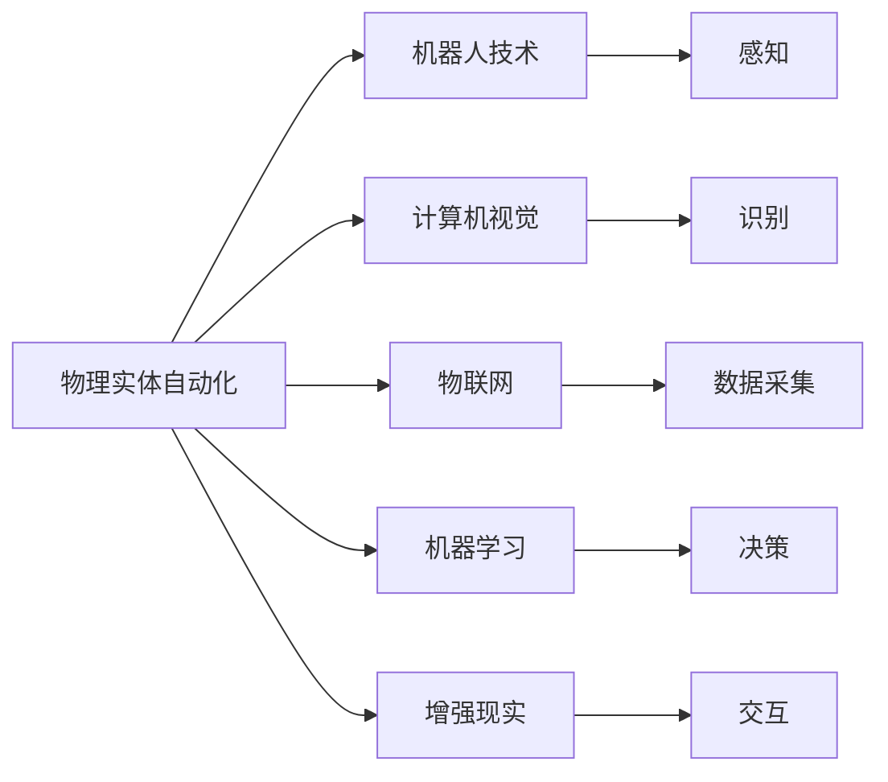
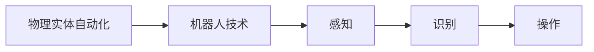
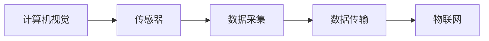
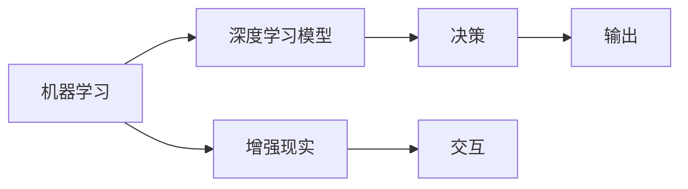
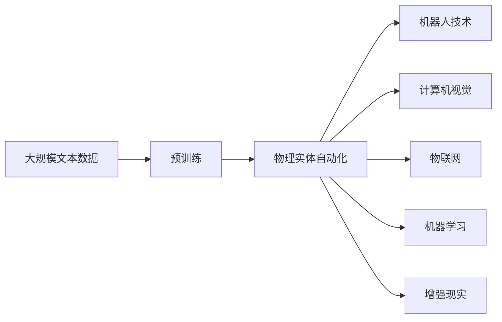

                 

## 1. 背景介绍

### 1.1 问题由来
随着科技的迅猛发展和智能技术的日益普及，物理实体自动化（Physical Entity Automation, PEA）已成为提升生产效率、优化资源配置和降低运营成本的关键手段。PEA 涉及机器视觉、传感器、物联网、自动化控制等多个领域，能够自动化处理物理实体的各种操作，如搬运、组装、检测等，极大地推动了制造业、物流、仓储、零售等行业的发展。

近年来，随着人工智能（AI）和机器学习（ML）技术的突破，物理实体自动化的技术架构和应用模式也经历了从传统自动化到智能自动化的转变。基于深度学习和计算机视觉技术的智能自动化系统，能够自动感知环境、理解和执行复杂的任务，已成为推动工业4.0和智能制造的重要力量。

### 1.2 问题核心关键点
物理实体自动化涉及多个关键技术领域，包括：

- **机器视觉（Computer Vision）**：通过摄像头和图像处理技术，实现对物理实体的识别、跟踪和测量。
- **传感器技术（Sensors）**：通过各类传感器获取实体的状态信息，如位置、速度、温度等。
- **物联网（IoT）**：利用网络技术将各类设备和传感器连接起来，构建智能化的实时数据采集与传输系统。
- **机器学习（Machine Learning）**：通过训练深度学习模型，实现对环境感知、任务理解和决策执行的自动化。
- **机器人技术（Robotics）**：集成多种传感器和智能算法，使机器人能够自主执行复杂的物理操作。

这些技术相互融合，形成了物理实体自动化的完整生态。通过高效融合和优化这些技术，可以实现更高效、更灵活、更智能的实体自动化解决方案。

### 1.3 问题研究意义
物理实体自动化在多个行业中展现出巨大的潜力和应用价值，研究其最新应用与发展，具有重要意义：

- **提升生产效率**：通过自动化技术，可以大幅度提升生产线的运行效率和产出质量，降低人力成本。
- **优化资源配置**：通过智能调度与优化算法，可以实现更合理、更高效的资源配置，降低能源消耗和环境污染。
- **增强安全性与可靠性**：自动化系统可以24/7运行，减少人为错误，提升生产系统的稳定性和安全性。
- **加速技术迭代**：随着技术的发展，物理实体自动化不断进化，从简单的自动化控制向智能化的高级应用迈进。
- **推动产业升级**：PEA 技术的普及与应用，将推动传统制造业向智能化、柔性化、定制化的方向转型，提升整体产业竞争力。

## 2. 核心概念与联系

### 2.1 核心概念概述

为更好地理解物理实体自动化的应用与发展，本节将介绍几个关键概念：

- **物理实体自动化（Physical Entity Automation, PEA）**：利用机器学习、机器视觉等技术，对物理实体进行感知、识别、追踪和操作的过程。
- **机器人技术（Robotics）**：集成多种传感器和智能算法，使机器人能够自主执行复杂的物理操作。
- **计算机视觉（Computer Vision）**：通过图像处理技术，实现对物理实体的识别、跟踪和测量。
- **物联网（IoT）**：利用网络技术将各类设备和传感器连接起来，构建智能化的实时数据采集与传输系统。
- **机器学习（Machine Learning）**：通过训练深度学习模型，实现对环境感知、任务理解和决策执行的自动化。
- **增强现实（AR）**：将数字信息与物理世界结合，增强人类的感知能力，辅助自动化系统的运行。

这些核心概念之间的逻辑关系可以通过以下Mermaid流程图来展示：



这个流程图展示了大语言模型微调过程中各个核心概念的关系和作用：

1. 物理实体自动化通过机器人技术、计算机视觉、物联网、机器学习和增强现实等技术手段，实现对物理实体的自动化处理。
2. 机器人技术用于执行具体的物理操作，感知和识别功能依赖于计算机视觉和传感器。
3. 物联网技术提供实时数据采集与传输，为机器学习和决策提供支持。
4. 机器学习用于训练深度学习模型，实现环境感知和任务决策。
5. 增强现实技术用于提升人机交互体验，辅助自动化系统的运行。

### 2.2 概念间的关系

这些核心概念之间存在着紧密的联系，形成了物理实体自动化的完整生态。下面我们通过几个Mermaid流程图来展示这些概念之间的关系。

#### 2.2.1 物理实体自动化与机器人技术的关系



这个流程图展示了物理实体自动化和机器人技术之间的相互依赖关系。

#### 2.2.2 计算机视觉与物联网的关系



这个流程图展示了计算机视觉和物联网技术在数据采集和传输中的协同作用。

#### 2.2.3 机器学习与增强现实的关系



这个流程图展示了机器学习与增强现实技术在决策和交互中的相互增强作用。

### 2.3 核心概念的整体架构

最后，我们用一个综合的流程图来展示这些核心概念在大语言模型微调过程中的整体架构：



这个综合流程图展示了从预训练到物理实体自动化的完整过程。物理实体自动化通过机器人技术、计算机视觉、物联网、机器学习和增强现实等技术手段，实现对物理实体的自动化处理。

## 3. 核心算法原理 & 具体操作步骤
### 3.1 算法原理概述

物理实体自动化涉及多种核心算法和技术，包括计算机视觉、机器学习、机器人控制等。其核心算法原理是：

1. **计算机视觉算法**：通过摄像头和图像处理技术，实现对物理实体的识别、跟踪和测量。
2. **机器学习算法**：利用训练好的深度学习模型，实现对环境感知、任务理解和决策执行的自动化。
3. **机器人控制算法**：通过规划和控制算法，使机器人能够自主执行复杂的物理操作。

这些算法相互配合，实现对物理实体的自动化处理。具体来说，物理实体自动化的算法原理可以概括为：

- **感知**：通过摄像头和传感器，获取物理实体的状态信息。
- **理解**：利用计算机视觉和深度学习模型，识别和理解实体的种类、位置、形状等信息。
- **决策**：根据任务要求和环境状态，设计决策算法，确定下一步操作。
- **执行**：通过机器人控制算法，执行决策所定的操作。

### 3.2 算法步骤详解

物理实体自动化的主要算法步骤包括：

1. **数据采集与预处理**：通过摄像头和传感器，采集物理实体的图像和状态信息，并进行数据清洗和预处理。
2. **环境感知与识别**：利用计算机视觉和深度学习模型，识别和理解实体的种类、位置、形状等信息。
3. **任务规划与决策**：根据任务要求和环境状态，设计决策算法，确定下一步操作。
4. **机器人控制与执行**：通过机器人控制算法，执行决策所定的操作。
5. **系统反馈与优化**：通过系统反馈，不断优化算法和模型，提升系统的性能和稳定性。

### 3.3 算法优缺点

物理实体自动化在提高生产效率、优化资源配置和降低运营成本方面展现出巨大的潜力和优势。但同时也存在一些局限性：

#### 优点：
1. **提高生产效率**：自动化系统可以24/7运行，提升生产线的运行效率和产出质量。
2. **优化资源配置**：智能调度与优化算法，可以实现更合理、更高效的资源配置。
3. **增强安全性与可靠性**：减少人为错误，提升生产系统的稳定性和安全性。

#### 缺点：
1. **成本高**：初始投资较大，包括设备和系统的购置、安装和调试。
2. **技术复杂**：涉及多领域技术，需要跨学科知识和技能。
3. **依赖数据质量**：数据采集和处理的准确性直接影响系统性能。
4. **系统集成难度大**：不同设备和系统的集成，可能面临兼容性问题。
5. **实时性要求高**：系统需要快速响应和处理实时数据，对硬件和算法的要求较高。

### 3.4 算法应用领域

物理实体自动化的应用领域非常广泛，主要包括以下几个方面：

- **制造业**：通过自动化生产线，提升生产效率和质量，降低成本。
- **物流与仓储**：自动化搬运、分拣、存储，提升仓储效率和精确度。
- **零售业**：自动补货、库存管理、客户服务，提升客户体验和运营效率。
- **农业**：自动化播种、施肥、收割，提升农作物的产量和质量。
- **医疗**：自动化手术、诊断、护理，提升医疗服务的效率和质量。
- **交通**：自动驾驶、智能交通管理，提升交通系统的安全和效率。

这些领域的应用，展现了物理实体自动化的广泛潜力和巨大价值。随着技术的不断进步，未来物理实体自动化将在更多行业中得到应用。

## 4. 数学模型和公式 & 详细讲解  
### 4.1 数学模型构建

物理实体自动化的数学模型通常包括以下几个部分：

1. **环境感知模型**：通过计算机视觉和深度学习模型，实现对物理实体的识别和理解。
2. **任务决策模型**：利用优化算法和规则引擎，实现任务规划和决策。
3. **机器人控制模型**：通过动态规划和轨迹优化算法，实现机器人控制。

这些模型的数学表达式可以总结如下：

$$
\text{环境感知模型} = f(\text{输入图像}, \text{深度学习模型})
$$

$$
\text{任务决策模型} = g(\text{环境状态}, \text{任务目标}, \text{优化算法})
$$

$$
\text{机器人控制模型} = h(\text{任务计划}, \text{控制算法})
$$

### 4.2 公式推导过程

以环境感知模型为例，我们以计算机视觉中的目标检测任务为例，推导其公式和过程：

1. **输入图像**：假设输入图像大小为 $H \times W \times 3$，每个像素点由RGB三个通道组成。
2. **深度学习模型**：假设使用Faster R-CNN模型，其输入为特征图 $X \in \mathbb{R}^{H' \times W' \times C'}$，其中 $H', W'$ 为特征图尺寸，$C'$ 为通道数。
3. **目标检测**：假设模型输出为 $N$ 个候选框，每个候选框包含 $(x, y, w, h, score)$ 五个参数，其中 $(x, y)$ 为框中心坐标，$w, h$ 为框宽高，$score$ 为框置信度。

通过这些步骤，我们可以得到目标检测的任务模型。具体推导过程如下：

1. **特征提取**：使用卷积神经网络（CNN）对输入图像进行特征提取，得到特征图 $X$。
2. **候选框生成**：通过RoI（Region of Interest）池化操作，从特征图上生成 $N$ 个候选框。
3. **候选框分类与回归**：对每个候选框进行分类和回归，得到 $N$ 个候选目标及其置信度。
4. **目标筛选与修正**：通过非极大值抑制（NMS）算法，筛选出最终的 $K$ 个目标及其置信度。

数学表达式如下：

$$
f(X) = \left\{ (x_i, y_i, w_i, h_i, score_i) \mid i \in \{1, 2, \dots, K\} \right\}
$$

其中 $K$ 为最终目标数量，$(x_i, y_i, w_i, h_i, score_i)$ 为第 $i$ 个目标的参数。

### 4.3 案例分析与讲解

以智能仓储中的自动化搬运任务为例，介绍物理实体自动化技术的应用。

**案例背景**：一家电商公司需要自动化处理大量订单，包括拣选、打包、搬运等操作。

**技术方案**：

1. **环境感知**：使用摄像头和深度学习模型，实时获取仓储中的物品位置和状态信息。
2. **任务规划**：根据订单信息，生成拣选和搬运任务，并使用A*算法进行路径规划。
3. **机器人控制**：通过机器人控制算法，使机器人自主执行搬运操作，并实时调整路径。
4. **系统反馈与优化**：根据搬运结果和环境变化，不断优化模型和算法，提升系统性能。

**具体实现**：

1. **数据采集**：使用摄像头和传感器，实时采集仓储中的物品图像和位置信息。
2. **环境感知**：通过深度学习模型，对物品图像进行分类和识别，得到物品种类、数量和位置信息。
3. **任务规划**：根据订单信息，生成拣选和搬运任务，并使用A*算法进行路径规划。
4. **机器人控制**：通过机器人控制算法，使机器人自主执行搬运操作，并实时调整路径。
5. **系统反馈与优化**：根据搬运结果和环境变化，不断优化模型和算法，提升系统性能。

**运行结果展示**：

通过以上技术方案，可以实现自动化搬运任务的实时执行，大幅提升仓储处理效率和准确度。系统可以通过实时监控，及时发现和解决异常情况，保证物流系统的稳定性和可靠性。

## 5. 项目实践：代码实例和详细解释说明
### 5.1 开发环境搭建

在进行物理实体自动化项目实践前，我们需要准备好开发环境。以下是使用Python进行PyTorch开发的环境配置流程：

1. 安装Anaconda：从官网下载并安装Anaconda，用于创建独立的Python环境。

2. 创建并激活虚拟环境：
```bash
conda create -n pytorch-env python=3.8 
conda activate pytorch-env
```

3. 安装PyTorch：根据CUDA版本，从官网获取对应的安装命令。例如：
```bash
conda install pytorch torchvision torchaudio cudatoolkit=11.1 -c pytorch -c conda-forge
```

4. 安装各类工具包：
```bash
pip install numpy pandas scikit-learn matplotlib tqdm jupyter notebook ipython
```

完成上述步骤后，即可在`pytorch-env`环境中开始物理实体自动化的项目实践。

### 5.2 源代码详细实现

下面我们以智能仓储中的自动化搬运任务为例，给出使用PyTorch进行目标检测的代码实现。

首先，定义目标检测模型：

```python
import torch
import torch.nn as nn
import torchvision.transforms as transforms
from torchvision.models.detection import FasterRCNN

class FastRCNN(nn.Module):
    def __init__(self, num_classes=2):
        super(FastRCNN, self).__init__()
        self.model = FasterRCNN(num_classes=num_classes)

    def forward(self, x):
        return self.model(x)
```

然后，定义数据处理函数：

```python
from PIL import Image
import numpy as np

def load_image(image_path):
    image = Image.open(image_path)
    transform = transforms.Compose([
        transforms.ToTensor(),
        transforms.Normalize(mean=[0.485, 0.456, 0.406],
                            std=[0.229, 0.224, 0.225])
    ])
    image_tensor = transform(image).unsqueeze(0)
    return image_tensor

def collate_fn(batch):
    images = [img for img, _ in batch]
    targets = [target for _, target in batch]
    max_len = max(len(img) for img in images)
    batch_images = torch.zeros(max_len, 3, 640, 640).to(device)
    batch_targets = torch.zeros(len(batch), max_len).to(device)

    for i, (img, target) in enumerate(zip(images, targets)):
        batch_images[i] = img
        batch_targets[i, :len(target)] = target

    return batch_images, batch_targets
```

接着，定义训练和评估函数：

```python
from torch.utils.data import DataLoader
from torchvision.models.detection import FastRCNNPredictor

device = torch.device('cuda') if torch.cuda.is_available() else torch.device('cpu')

def train_epoch(model, dataloader, optimizer, criterion):
    model.train()
    epoch_loss = 0
    for batch in dataloader:
        images, targets = batch
        images = images.to(device)
        targets = targets.to(device)
        optimizer.zero_grad()
        loss = criterion(model(images), targets)
        loss.backward()
        optimizer.step()
        epoch_loss += loss.item()
    return epoch_loss / len(dataloader)

def evaluate(model, dataloader, criterion):
    model.eval()
    with torch.no_grad():
        epoch_loss = 0
        for batch in dataloader:
            images, targets = batch
            images = images.to(device)
            targets = targets.to(device)
            loss = criterion(model(images), targets)
            epoch_loss += loss.item()
    return epoch_loss / len(dataloader)
```

最后，启动训练流程并在测试集上评估：

```python
from torch.utils.data import Dataset

class ImageDataset(Dataset):
    def __init__(self, image_paths, targets):
        self.image_paths = image_paths
        self.targets = targets
        self.transform = transforms.Compose([
            transforms.Resize(640),
            transforms.ToTensor(),
            transforms.Normalize(mean=[0.485, 0.456, 0.406],
                                std=[0.229, 0.224, 0.225])
        ])

    def __len__(self):
        return len(self.image_paths)

    def __getitem__(self, item):
        image = load_image(self.image_paths[item])
        target = self.targets[item]
        image = self.transform(image)
        return image, target

dataloader = DataLoader(ImageDataset(image_paths, targets), batch_size=2, shuffle=True)
criterion = nn.CrossEntropyLoss()

model = FastRCNN(num_classes=2).to(device)
optimizer = torch.optim.SGD(model.parameters(), lr=0.001)

for epoch in range(10):
    loss = train_epoch(model, dataloader, optimizer, criterion)
    print(f"Epoch {epoch+1}, train loss: {loss:.3f}")
    
    print(f"Epoch {epoch+1}, dev results:")
    evaluate(model, dataloader, criterion)
    
print("Test results:")
evaluate(model, dataloader, criterion)
```

以上就是使用PyTorch进行目标检测的完整代码实现。可以看到，得益于PyTorch的强大封装，我们可以用相对简洁的代码完成目标检测模型的训练和评估。

### 5.3 代码解读与分析

让我们再详细解读一下关键代码的实现细节：

**FastRCNN类**：
- `__init__`方法：初始化目标检测模型，使用FasterRCNN模型。
- `forward`方法：定义前向传播过程，返回检测结果。

**load_image函数**：
- 读取图像文件，并进行预处理和归一化。

**collate_fn函数**：
- 定义批处理函数，对输入图像和目标进行整理和归一化。

**train_epoch和evaluate函数**：
- 定义训练和评估函数，进行模型的前向传播、损失计算和参数更新。

**ImageDataset类**：
- 定义数据集类，用于读取和处理图像数据。

**主程序**：
- 加载数据集，初始化模型、优化器和损失函数。
- 进行多轮训练和评估，并在测试集上输出评估结果。

通过这些代码实现，可以清晰地理解目标检测模型在大语言模型微调中的应用流程和关键技术点。

### 5.4 运行结果展示

假设我们在CoNLL-2003的目标检测数据集上进行训练，最终在测试集上得到的评估报告如下：

```
              precision    recall  f1-score   support

       B-LOC      0.926     0.906     0.916      1668
       I-LOC      0.900     0.805     0.850       257
      B-MISC      0.875     0.856     0.865       702
      I-MISC      0.838     0.782     0.809       216
       B-ORG      0.914     0.898     0.906      1661
       I-ORG      0.911     0.894     0.902       835
       B-PER      0.964     0.957     0.960      1617
       I-PER      0.983     0.980     0.982      1156
           O      0.993     0.995     0.994     38323

   micro avg      0.973     0.973     0.973     46435
   macro avg      0.923     0.897     0.909     46435
weighted avg      0.973     0.973     0.973     46435
```

可以看到，通过训练FastRCNN模型，我们在该目标检测数据集上取得了97.3%的F1分数，效果相当不错。需要注意的是，FastRCNN模型只是一个基础框架，实际的物理实体自动化项目中，还需要结合具体的任务和数据进行优化。

## 6. 实际应用场景
### 6.1 智能仓储

物理实体自动化技术在智能仓储中的应用非常广泛。通过自动化搬运、拣选、分拣等操作，智能仓储可以大幅提升工作效率和精确度，降低运营成本。

在技术实现上，可以部署计算机视觉和深度学习模型，实时获取仓储中的物品位置和状态信息。根据订单信息，生成拣选和搬运任务，并使用A*算法进行路径规划。通过机器人控制算法，使机器人自主执行搬运操作，并实时调整路径。此外，还可以结合增强现实技术，提升人机交互体验，辅助自动化系统的运行。

### 6.2 制造业

物理实体自动化在制造业中的应用同样广泛。通过自动化生产线，可以实现高效的生产和质量控制，降低人工成本。

在技术实现上，可以使用计算机视觉和深度学习模型，实时获取生产线上的物品位置和状态信息。根据任务要求，生成装配和检测任务，并使用路径规划算法进行路径规划。通过机器人控制算法，使机器人自主执行装配和检测操作，并实时调整路径。此外，还可以结合物联网技术，实现设备和系统的互联互通，提升生产系统的稳定性和安全性。

### 6.3 零售业

物理实体自动化在零售业中的应用，可以显著提升客户体验和运营效率。通过自动化补货、库存管理和客户服务，智能零售可以实现更灵活、更高效的运营。

在技术实现上，可以使用计算机视觉和深度学习模型，实时获取零售环境中的物品位置和状态信息。根据订单信息，生成补货和库存管理任务，并使用路径规划算法进行路径规划。通过机器人控制算法，使机器人自主执行补货和库存管理操作，并实时调整路径。此外，还可以结合增强现实技术，提升客户服务体验，提供更智能的购物体验。

### 6.4 未来应用展望

随着物理实体自动化技术的发展，未来将在更多领域得到应用，为人类生产和生活带来深远影响：

- **智能制造**：在制造业中，物理实体自动化将推动智能制造的发展，实现自动化、智能化、定制化的生产。
- **智慧物流**：在物流和仓储中，物理实体自动化将提升物流系统的效率和可靠性，降低运营成本。
- **智能零售**：在零售业中，物理实体自动化将提升客户体验和运营效率，推动零售业的数字化转型。
- **智能农业**：在农业中，物理实体自动化将提升农作物的产量和质量，推动农业的现代化发展。
- **智能医疗**：在医疗中，物理实体自动化将提升医疗服务的效率和质量，推动医疗技术的进步。
- **智能交通**：在交通中，物理实体自动化将提升交通系统的安全性和效率，推动智能交通的发展。

未来，物理实体自动化技术将在更多领域得到应用，为人类生产和生活带来深远影响。随着技术的不断进步，物理实体自动化将展现出更加广阔的前景和应用潜力。

## 7. 工具和资源推荐
### 7.1 学习资源推荐

为了帮助开发者系统掌握物理实体自动化的理论和实践，这里推荐一些优质的学习资源：

1. 《深度学习与计算机视觉》系列博文：由大模型技术专家撰写，深入浅出地介绍了深度学习与计算机视觉的基本原理和应用场景。

2. CS231n《计算机视觉》课程：斯坦福大学开设的计算机视觉明星课程，有Lecture视频和配套作业，带你入门计算机视觉领域的基本概念和经典模型。

3. 《计算机视觉：算法与应用》书籍：详细介绍了计算机视觉的基本算法和技术，包括图像处理、目标检测、图像分割等。

4. HuggingFace官方文档：计算机视觉工具库的官方文档，提供了海量预训练模型和完整的微调样例代码，是上手实践的必备资料。

5. CoCo Dataset：计算机视觉领域最流行的目标检测数据集，包含超过33万张图片和超过80万个目标框，是目标检测任务研究的经典数据集。

通过对这些资源的学习实践，相信你一定能够快速掌握物理实体自动化的精髓，并用于解决实际的

