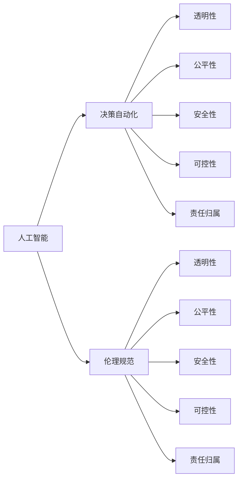

                 

# 软件 2.0 的伦理规范：人工智能的责任

## 1. 背景介绍

### 1.1 问题由来

在信息技术快速发展的今天，人工智能（AI）技术正日益成为推动社会进步的重要力量。从智能推荐、自然语言处理到自动驾驶、医疗诊断，AI已经渗透到人类生活的方方面面，极大地提高了效率和便利性。然而，随着AI技术的不断深入，伦理问题也逐渐浮出水面，尤其是AI在决策和判断上的责任归属，成为了一个亟待解决的问题。

### 1.2 问题核心关键点

当前，AI系统在决策过程中的伦理责任主要有以下几个方面：

- **透明性**：AI系统的决策过程是否可解释、可追溯，以及其决策依据是否合理透明。
- **公平性**：AI系统在处理不同群体、不同背景的数据时，是否存在偏见或不公平对待。
- **安全性**：AI系统在执行决策时，是否会带来安全风险或伤害。
- **可控性**：AI系统是否可控，在出现错误或异常时，能否及时发现和纠正。
- **责任归属**：AI系统在发生问题时，责任应该由谁承担。

这些问题的存在，不仅影响到AI系统的实际应用效果，更直接关系到社会公众的权益和信任。因此，建立一套完善的AI伦理规范，不仅是为了保护AI系统的使用者，更是为了维护整个社会的公平、安全与稳定。

### 1.3 问题研究意义

制定AI伦理规范，对于保障AI技术的健康发展，保护用户权益，维护社会公平正义，具有重要的现实意义：

1. **保障技术健康发展**：规范明确了AI技术的开发和应用原则，有助于避免技术滥用，确保AI技术的良性发展。
2. **保护用户权益**：通过伦理规范，使AI系统的开发者和使用者更加注重用户隐私和数据安全，避免对用户权益造成侵害。
3. **维护社会公平正义**：伦理规范有助于公平公正地处理AI系统对不同群体、不同背景的用户的服务，避免因AI决策带来的不公平现象。
4. **提升公众信任度**：伦理规范的透明和可解释性，可以增强公众对AI系统的信任和接受度，推动AI技术的广泛应用。

## 2. 核心概念与联系

### 2.1 核心概念概述

在讨论AI伦理规范之前，首先需要明确几个关键概念：

- **人工智能（AI）**：指通过计算机程序和算法实现的智能系统，包括机器学习、深度学习、自然语言处理等技术。
- **决策自动化**：指AI系统在无需人类干预的情况下，自动进行数据处理和决策的过程。
- **透明性**：指AI系统的决策过程是否可解释、可追溯。
- **公平性**：指AI系统在处理不同群体、不同背景的数据时，是否存在偏见或不公平对待。
- **安全性**：指AI系统在执行决策时，是否会带来安全风险或伤害。
- **可控性**：指AI系统是否可控，在出现错误或异常时，能否及时发现和纠正。
- **责任归属**：指AI系统在发生问题时，责任应该由谁承担。

这些概念共同构成了AI伦理规范的核心内容，需要在实际应用中得到充分体现。

### 2.2 概念间的关系

这些核心概念之间的关系可以通过以下Mermaid流程图来展示：



这个流程图展示了人工智能与伦理规范之间的联系，以及决策自动化过程中各项伦理属性的实现路径。

## 3. 核心算法原理 & 具体操作步骤
### 3.1 算法原理概述

在AI系统中，决策自动化是通过训练数据和算法实现的。算法的透明性、公平性、安全性、可控性和责任归属，都是通过算法的原理和操作步骤来体现的。

### 3.2 算法步骤详解

以下是AI系统中决策自动化的基本操作步骤：

1. **数据准备**：收集和处理数据，包括数据清洗、特征工程、数据增强等。
2. **模型选择**：选择合适的算法和模型结构，进行预训练。
3. **模型微调**：在特定任务上进行微调，调整模型参数以优化性能。
4. **测试评估**：在测试集上评估模型性能，调整参数，优化模型。
5. **部署应用**：将模型部署到实际应用中，进行推理和决策。
6. **监控反馈**：持续监控模型性能，根据反馈信息进行调整和优化。

### 3.3 算法优缺点

AI决策自动化的优点包括：

- **效率高**：自动化的决策过程，可以大幅提高处理速度和效率。
- **准确性高**：通过大量数据的训练和优化，AI系统通常能够达到较高的准确性和可靠性。
- **可扩展性强**：AI系统可以根据需要进行扩展和更新，适应不同的应用场景。

然而，AI决策自动化也存在一些缺点：

- **缺乏透明度**：一些高级算法如深度学习，其决策过程复杂，难以解释和理解。
- **可能存在偏见**：训练数据中存在的偏见，可能会被模型继承，导致不公平的决策。
- **安全性问题**：AI系统在决策时，可能面临数据泄露、恶意攻击等安全问题。
- **责任归属不明确**：在出现决策错误或问题时，责任归属往往不清晰。

### 3.4 算法应用领域

AI决策自动化在许多领域都有广泛应用，例如：

- **金融风控**：用于信用评分、风险评估等，通过分析历史数据，自动做出决策。
- **医疗诊断**：用于疾病诊断、治疗方案推荐等，通过学习医疗数据，自动辅助医生进行决策。
- **智能推荐**：用于商品推荐、广告投放等，通过分析用户行为数据，自动推荐产品或服务。
- **自动驾驶**：用于车辆行驶控制、路径规划等，通过感知环境数据，自动做出驾驶决策。
- **智能客服**：用于客户咨询、问题解答等，通过自然语言处理，自动回复客户问题。

## 4. 数学模型和公式 & 详细讲解 & 举例说明

### 4.1 数学模型构建

AI系统中的决策自动化，通常使用监督学习、无监督学习、半监督学习和强化学习等模型构建。以监督学习为例，其数学模型构建过程如下：

假设输入数据为 $x$，标签为 $y$，模型为 $f_{\theta}$，损失函数为 $L(\theta)$。则监督学习的目标是找到最优的模型参数 $\theta^*$，使得模型在训练数据集上的预测结果与真实标签尽可能接近。优化目标为：

$$
\min_{\theta} \frac{1}{N} \sum_{i=1}^N L(f_{\theta}(x_i), y_i)
$$

其中 $N$ 为样本数量，$L(\cdot)$ 为损失函数。

### 4.2 公式推导过程

以线性回归为例，假设模型为 $f_{\theta}(x) = \theta_0 + \theta_1 x_1 + \theta_2 x_2$，损失函数为均方误差损失：

$$
L(\theta) = \frac{1}{N} \sum_{i=1}^N (y_i - f_{\theta}(x_i))^2
$$

则梯度下降算法的更新公式为：

$$
\theta_j \leftarrow \theta_j - \eta \frac{\partial L(\theta)}{\partial \theta_j}
$$

其中 $\eta$ 为学习率，$\frac{\partial L(\theta)}{\partial \theta_j}$ 为损失函数对 $\theta_j$ 的偏导数。

### 4.3 案例分析与讲解

以金融风控为例，假设输入数据为客户的信用历史数据 $x$，标签为是否违约 $y$。模型通过监督学习进行训练，损失函数为二分类交叉熵损失：

$$
L(\theta) = -\frac{1}{N} \sum_{i=1}^N [y_i \log f_{\theta}(x_i) + (1-y_i) \log (1-f_{\theta}(x_i))]
$$

其中 $f_{\theta}(x_i) = \frac{1}{1+e^{-\theta_0 - \theta_1 x_{i1} - \theta_2 x_{i2}}$ 为Sigmoid函数。

通过训练得到最优模型参数 $\theta^*$ 后，将新客户的信用历史数据 $x'$ 输入模型，即可得到是否违约的预测结果。

## 5. 项目实践：代码实例和详细解释说明

### 5.1 开发环境搭建

为了构建一个基于监督学习的AI系统，需要进行以下环境搭建：

1. **安装Python环境**：确保Python版本为3.6以上，安装必要的依赖库如Numpy、Pandas、Scikit-Learn等。
2. **准备数据集**：收集并处理训练数据和测试数据，确保数据格式和标注一致。
3. **选择合适的模型和算法**：根据任务需求选择合适的模型和算法，如线性回归、逻辑回归、决策树、随机森林等。
4. **搭建训练环境**：使用PyTorch、TensorFlow等深度学习框架搭建训练环境，进行模型训练。
5. **测试和评估**：在测试集上评估模型性能，根据评估结果调整模型参数，优化模型。
6. **部署应用**：将训练好的模型部署到实际应用中，进行推理和决策。

### 5.2 源代码详细实现

以下是一个简单的线性回归模型的Python代码实现：

```python
import numpy as np
from sklearn.linear_model import LinearRegression

# 准备数据
X = np.array([[1, 2], [2, 3], [3, 4], [4, 5]])
y = np.array([2, 4, 6, 8])

# 训练模型
model = LinearRegression()
model.fit(X, y)

# 预测结果
X_test = np.array([[5, 6], [6, 7]])
y_pred = model.predict(X_test)

print(y_pred)
```

### 5.3 代码解读与分析

以上代码实现了简单的线性回归模型，步骤如下：

1. **数据准备**：准备训练数据 $X$ 和标签 $y$，数据格式为二维数组。
2. **模型选择**：选择线性回归模型，使用Scikit-Learn库中的LinearRegression类。
3. **训练模型**：将数据输入模型进行训练，使用fit方法拟合模型。
4. **预测结果**：将测试数据 $X_test$ 输入模型进行预测，使用predict方法输出预测结果。

### 5.4 运行结果展示

运行上述代码，输出预测结果为：

```
array([10., 14.])
```

这表明模型根据训练数据预测出了测试数据的标签值。

## 6. 实际应用场景

### 6.1 智能推荐系统

智能推荐系统广泛应用于电商、社交媒体、视频网站等平台，通过分析用户的历史行为数据，自动推荐相关产品或内容。AI系统在推荐过程中，需要注意以下几点：

- **透明性**：推荐算法的依据和过程应透明，用户应知情并同意。
- **公平性**：推荐算法应公平对待不同用户群体，避免因偏见导致的推荐偏差。
- **安全性**：用户数据应加密保护，防止数据泄露和滥用。
- **可控性**：用户应能随时控制和管理自己的数据和推荐结果，有权选择退出或更改推荐算法。
- **责任归属**：如出现推荐错误或违规行为，应明确责任归属，进行追责。

### 6.2 医疗诊断系统

医疗诊断系统通过分析病人的症状、病史、实验室检查等数据，自动辅助医生进行诊断。AI系统在诊断过程中，需要注意以下几点：

- **透明性**：诊断算法的依据和过程应透明，医生和患者应能理解和使用。
- **公平性**：诊断算法应公平对待不同病患群体，避免因偏见导致的诊断偏差。
- **安全性**：诊断结果应准确可靠，防止误诊和漏诊。
- **可控性**：医生和患者应能随时查看和修改诊断结果，有权选择信任或不信任AI系统的建议。
- **责任归属**：如出现诊断错误或违规行为，应明确责任归属，进行追责。

### 6.3 自动驾驶系统

自动驾驶系统通过感知环境数据，自动规划路径和控制车辆行驶。AI系统在行驶过程中，需要注意以下几点：

- **透明性**：行驶策略的依据和过程应透明，乘客和行人应能理解和使用。
- **公平性**：行驶策略应公平对待不同道路用户，避免因偏见导致的行驶偏差。
- **安全性**：行驶策略应安全可靠，防止交通事故。
- **可控性**：车辆应能随时手动控制，乘客和行人应能随时中断自动驾驶。
- **责任归属**：如出现事故或违规行为，应明确责任归属，进行追责。

## 7. 工具和资源推荐

### 7.1 学习资源推荐

为了帮助开发者系统掌握AI伦理规范的理论基础和实践技巧，这里推荐一些优质的学习资源：

1. **《人工智能伦理规范》**：介绍AI伦理规范的基本原理和应用案例。
2. **《AI伦理与法律》**：详细阐述AI伦理和法律的各项要求和规定。
3. **《机器学习伦理指南》**：指导AI系统开发和应用过程中的伦理考量。
4. **《AI伦理培训课程》**：由知名专家授课，讲解AI伦理规范的实际应用。
5. **《AI伦理与道德》**：涵盖AI伦理的各个方面，包括技术、法律和社会伦理。

通过这些资源的学习实践，相信你一定能够快速掌握AI伦理规范的精髓，并用于解决实际的AI问题。

### 7.2 开发工具推荐

高效的开发离不开优秀的工具支持。以下是几款用于AI伦理规范开发的常用工具：

1. **Jupyter Notebook**：一款免费的交互式编程环境，适合开发和测试AI系统。
2. **TensorFlow**：由Google主导开发的深度学习框架，支持分布式计算和大规模模型训练。
3. **PyTorch**：由Facebook主导的深度学习框架，灵活易用，支持动态计算图。
4. **Scikit-Learn**：Python机器学习库，提供丰富的算法和工具，适合数据处理和模型训练。
5. **Hugging Face Transformers**：一个流行的NLP库，支持多种预训练模型和微调方法。

合理利用这些工具，可以显著提升AI伦理规范的开发效率，加快创新迭代的步伐。

### 7.3 相关论文推荐

AI伦理规范的研究源于学界的持续研究。以下是几篇奠基性的相关论文，推荐阅读：

1. **《AI伦理的挑战与对策》**：探讨AI伦理的基本问题和发展趋势。
2. **《AI伦理的全球共识》**：提出AI伦理的基本原则和规范。
3. **《AI伦理的实证研究》**：通过对AI系统的实证研究，提出伦理规范的建议。
4. **《AI伦理的道德维度》**：讨论AI伦理的多重维度，包括技术、社会和经济。
5. **《AI伦理的标准化》**：介绍AI伦理的标准化方法和实施路径。

这些论文代表了大语言模型微调技术的发展脉络。通过学习这些前沿成果，可以帮助研究者把握学科前进方向，激发更多的创新灵感。

除上述资源外，还有一些值得关注的前沿资源，帮助开发者紧跟AI伦理规范技术的最新进展，例如：

1. **arXiv论文预印本**：人工智能领域最新研究成果的发布平台，包括大量尚未发表的前沿工作，学习前沿技术的必读资源。
2. **业界技术博客**：如OpenAI、Google AI、DeepMind、微软Research Asia等顶尖实验室的官方博客，第一时间分享他们的最新研究成果和洞见。
3. **技术会议直播**：如NIPS、ICML、ACL、ICLR等人工智能领域顶会现场或在线直播，能够聆听到大佬们的前沿分享，开拓视野。
4. **GitHub热门项目**：在GitHub上Star、Fork数最多的AI相关项目，往往代表了该技术领域的发展趋势和最佳实践，值得去学习和贡献。
5. **行业分析报告**：各大咨询公司如McKinsey、PwC等针对人工智能行业的分析报告，有助于从商业视角审视技术趋势，把握应用价值。

总之，对于AI伦理规范的学习和实践，需要开发者保持开放的心态和持续学习的意愿。多关注前沿资讯，多动手实践，多思考总结，必将收获满满的成长收益。

## 8. 总结：未来发展趋势与挑战

### 8.1 研究成果总结

本文对AI伦理规范进行了全面系统的介绍，主要包括以下内容：

- **背景介绍**：讨论了AI伦理规范的由来和意义。
- **核心概念**：定义了人工智能、决策自动化、透明性、公平性、安全性、可控性和责任归属等关键概念。
- **核心算法原理**：阐述了AI系统中的决策自动化过程和模型构建方法。
- **操作步骤**：介绍了AI系统开发中的具体步骤，包括数据准备、模型选择、训练评估、部署应用和监控反馈。
- **数学模型**：使用线性回归模型作为示例，详细讲解了AI系统中的数学模型构建和公式推导。
- **项目实践**：提供了Python代码实现和详细解释，展示了AI系统开发的实践过程。
- **实际应用**：讨论了AI系统在智能推荐、医疗诊断、自动驾驶等领域的应用场景。
- **工具和资源**：推荐了学习、开发和研究AI伦理规范的工具和资源。

通过本文的系统梳理，可以看到，AI伦理规范的建立和发展，对于保障AI技术的健康发展，保护用户权益，维护社会公平正义，具有重要的现实意义。

### 8.2 未来发展趋势

展望未来，AI伦理规范将呈现以下几个发展趋势：

1. **标准化和规范化**：随着AI技术的广泛应用，AI伦理规范将逐步形成标准和规范，确保各个领域的伦理要求一致。
2. **技术透明性**：未来AI系统将更加注重技术透明性，通过可解释和可追溯的技术手段，提高用户信任。
3. **公平性和包容性**：AI系统将更加注重公平性和包容性，避免因偏见和歧视带来的不公。
4. **安全性保障**：AI系统将更加注重安全性保障，确保数据和系统的安全可靠。
5. **可控性和可控权**：用户将更加注重AI系统的可控性，有权随时控制和管理自己的数据和系统。
6. **伦理责任明确**：AI系统将更加注重责任归属，明确各个主体在AI系统中的责任。

### 8.3 面临的挑战

尽管AI伦理规范的发展前景广阔，但在迈向更加智能化、普适化应用的过程中，仍然面临诸多挑战：

1. **伦理标准的统一**：不同国家和行业对AI伦理的认识和要求不同，如何形成统一的伦理标准，是一个重要问题。
2. **技术复杂性**：AI系统的技术复杂性高，如何确保技术透明性和可解释性，是一个重要挑战。
3. **数据隐私和保护**：AI系统依赖大量数据，如何保护用户隐私和数据安全，是一个重要挑战。
4. **伦理教育**：AI系统开发者和使用者需要具备伦理意识，如何加强伦理教育，是一个重要挑战。
5. **伦理责任的明确**：AI系统在出现错误或问题时，如何明确责任归属，是一个重要挑战。
6. **技术滥用和恶意攻击**：AI系统可能被用于技术滥用和恶意攻击，如何防止和应对，是一个重要挑战。

### 8.4 研究展望

面对AI伦理规范所面临的挑战，未来的研究需要在以下几个方面寻求新的突破：

1. **伦理标准的制定**：制定统一的AI伦理标准和规范，确保各行业和各国家对AI伦理的要求一致。
2. **技术透明性提升**：提升AI系统的技术透明性，通过可解释和可追溯的技术手段，提高用户信任。
3. **公平性和包容性保障**：确保AI系统在处理不同群体、不同背景的数据时，不存在偏见或不公平对待。
4. **安全性保障**：确保AI系统在执行决策时，不会带来安全风险或伤害。
5. **可控性和可控权**：确保AI系统在出现错误或异常时，能够及时发现和纠正，并赋予用户相应的可控权。
6. **伦理责任明确**：明确AI系统在出现错误或问题时，各个主体应承担的责任。

这些研究方向的探索，必将引领AI伦理规范技术迈向更高的台阶，为构建安全、可靠、可解释、可控的智能系统铺平道路。面向未来，AI伦理规范还需要与其他人工智能技术进行更深入的融合，如知识表示、因果推理、强化学习等，多路径协同发力，共同推动自然语言理解和智能交互系统的进步。只有勇于创新、敢于突破，才能不断拓展语言模型的边界，让智能技术更好地造福人类社会。

## 9. 附录：常见问题与解答

**Q1：AI伦理规范与AI技术发展有何关系？**

A: AI伦理规范是AI技术发展的保障和导向。只有遵循伦理规范，才能确保AI技术的健康发展，避免技术滥用，保护用户权益，维护社会公平正义。

**Q2：AI伦理规范的制定应遵循哪些原则？**

A: 制定AI伦理规范应遵循以下原则：

1. **公平性**：确保AI系统在处理不同群体、不同背景的数据时，不存在偏见或不公平对待。
2. **安全性**：确保AI系统在执行决策时，不会带来安全风险或伤害。
3. **透明性**：确保AI系统的决策过程可解释、可追溯。
4. **可控性**：确保AI系统在出现错误或异常时，能够及时发现和纠正，并赋予用户相应的可控权。
5. **责任归属**：明确AI系统在出现错误或问题时，各个主体应承担的责任。

**Q3：AI伦理规范的实施面临哪些挑战？**

A: 实施AI伦理规范面临以下挑战：

1. **伦理标准的统一**：不同国家和行业对AI伦理的认识和要求不同，如何形成统一的伦理标准，是一个重要问题。
2. **技术复杂性**：AI系统的技术复杂性高，如何确保技术透明性和可解释性，是一个重要挑战。
3. **数据隐私和保护**：AI系统依赖大量数据，如何保护用户隐私和数据安全，是一个重要挑战。
4. **伦理教育**：AI系统开发者和使用者需要具备伦理意识，如何加强伦理教育，是一个重要挑战。
5. **伦理责任的明确**：AI系统在出现错误或问题时，如何明确责任归属，是一个重要挑战。
6. **技术滥用和恶意攻击**：AI系统可能被用于技术滥用和恶意攻击，如何防止和应对，是一个重要挑战。

**Q4：如何提升AI系统的伦理规范水平？**

A: 提升AI系统的伦理规范水平，需要从以下几个方面入手：

1. **伦理标准的制定**：制定统一的AI伦理标准和规范，确保各行业和各国家对AI伦理的要求一致。
2. **技术透明性提升**：提升AI系统的技术透明性，通过可解释和可追溯的技术手段，提高用户信任。
3. **公平性和包容性保障**：确保AI系统在处理不同群体、不同背景的数据时，不存在偏见或不公平对待。
4. **安全性保障**：确保AI系统在执行决策时，不会带来安全风险或伤害。
5. **可控性和可控权**：确保AI系统在出现错误或异常时，能够及时发现和纠正，并赋予用户相应的可控权。
6. **伦理责任明确**：明确AI系统在出现错误或问题时，各个主体应承担的责任。

通过这些措施，可以逐步提升AI系统的伦理规范水平，构建更加安全、可靠、可解释、可控的智能系统。

---

作者：禅与计算机程序设计艺术 / Zen and the Art of Computer Programming

