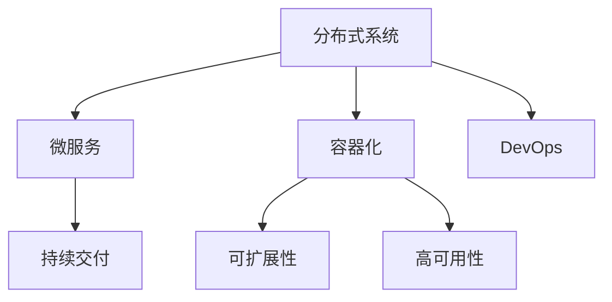
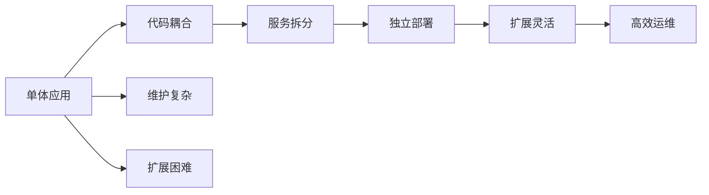
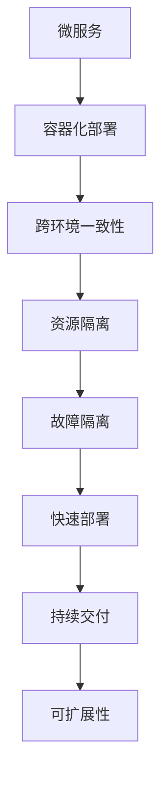
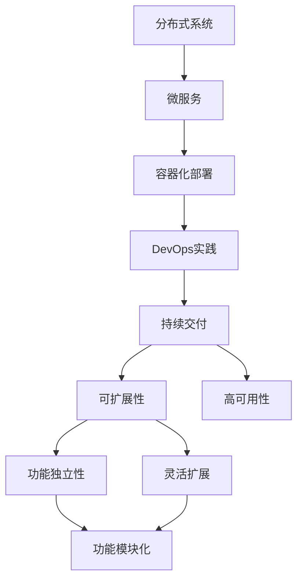

                 

# 软件2.0的分布式系统设计

> 关键词：软件2.0,分布式系统,微服务,容器化,DevOps,持续交付,可扩展性,高可用性

## 1. 背景介绍

在过去的两到三十年里，软件开发领域经历了翻天覆地的变化。从单体应用到微服务，从面向过程到面向对象，再到函数式编程和数据驱动，软件开发范式不断演变。如今，软件开发已经迈入了软件2.0的新时代。

软件2.0的核心在于将软件视为数据产品，而非代码产品。这代表了一种从过程到数据、从代码到模型的根本性转变。在软件2.0中，代码不再是唯一的核心，而是被视为产生数据价值的工具。这一转变催生了新的设计理念和工程实践，使得软件开发更加注重系统性、可扩展性和数据驱动的智能性。

分布式系统作为软件2.0的重要组成部分，已经成为现代软件开发的基础设施。分布式系统的设计，不仅决定了系统的可扩展性、高可用性和性能，还影响着系统的整体质量和生命周期。

## 2. 核心概念与联系

### 2.1 核心概念概述

为更好地理解软件2.0的分布式系统设计，本节将介绍几个密切相关的核心概念：

- 分布式系统：由多个独立的、自治的计算节点组成，通过网络通信实现协同工作的系统。典型的分布式系统包括云计算、微服务架构等。
- 微服务：将大型应用拆分为一组小型的、松耦合的服务单元，每个服务负责特定业务功能，通过网络通信实现交互。
- 容器化：将应用程序和依赖打包到容器中，确保其在不同环境中能够一致运行。
- DevOps：将软件开发和运维工作紧密结合，通过持续交付和持续集成等实践，提升软件交付效率和系统稳定性。
- 持续交付：通过自动化工具链，将软件制品持续不断地交付到生产环境，快速响应市场变化。
- 可扩展性：系统能够在满足性能要求的前提下，动态地调整资源规模，以适应不断增长的业务需求。
- 高可用性：系统能够在出现故障时，通过冗余和备份机制，保证服务的连续性。

这些核心概念之间的逻辑关系可以通过以下Mermaid流程图来展示：



这个流程图展示了大规模分布式系统的各个组成部分及其相互关系：

1. 分布式系统是整体架构的基础，通过微服务进行功能拆分。
2. 容器化技术支持微服务的部署和管理。
3. DevOps实践保障了持续交付和高效运维。
4. 持续交付使得系统能够快速适应变化，提升可扩展性。
5. 可扩展性和高可用性是分布式系统的核心目标，确保系统能够在多种负载下稳定运行。

### 2.2 概念间的关系

这些核心概念之间存在着紧密的联系，形成了软件2.0分布式系统的完整生态系统。下面我们通过几个Mermaid流程图来展示这些概念之间的关系。

#### 2.2.1 分布式系统的构建


这个流程图展示了分布式系统构建的主要步骤：

1. 首先对应用功能进行微服务拆分，使得每个服务都能够独立运行。
2. 将微服务打包到容器中，实现跨环境的部署和一致性。
3. DevOps实践保障了持续交付和高效运维。
4. 通过持续交付机制，快速响应市场变化，提升系统的可扩展性和高可用性。

#### 2.2.2 微服务的优势



这个流程图展示了微服务相对于单体应用的优势：

1. 单体应用存在代码耦合，维护复杂。
2. 微服务通过拆分功能，使得每个服务独立部署和扩展。
3. 独立部署和扩展使得系统更加灵活和可维护。
4. 高效运维和持续交付保障了系统的高可用性和稳定性。

#### 2.2.3 容器化技术的作用



这个流程图展示了容器化技术对微服务的作用：

1. 容器化实现了跨环境的一致性部署。
2. 容器提供了资源隔离和故障隔离，保证了系统的稳定性和可靠性。
3. 快速部署和持续交付提升了系统的灵活性和适应性。
4. 可扩展性使得系统能够动态调整资源规模，适应业务需求的变化。

### 2.3 核心概念的整体架构

最后，我们用一个综合的流程图来展示这些核心概念在大规模分布式系统中的整体架构：



这个综合流程图展示了从分布式系统到微服务、容器化、DevOps、持续交付的完整流程：

1. 分布式系统通过微服务拆分实现功能独立性和灵活扩展。
2. 容器化技术保障了跨环境的一致性部署和资源隔离。
3. DevOps实践支持了持续交付和高效运维。
4. 持续交付提升了系统的灵活性和快速响应能力。
5. 可扩展性和高可用性确保了系统的稳定性和可靠性。

这些概念共同构成了软件2.0分布式系统的设计和实现框架，使得系统能够在多种负载和变化下保持高效和稳定。

## 3. 核心算法原理 & 具体操作步骤
### 3.1 算法原理概述

软件2.0的分布式系统设计，主要是基于微服务架构和容器化技术，通过DevOps实践和持续交付机制，实现系统的可扩展性和高可用性。其中，微服务和容器化是基础，DevOps和持续交付是保障，可扩展性和高可用性是目标。

### 3.2 算法步骤详解

软件2.0的分布式系统设计，主要包括以下几个关键步骤：

**Step 1: 功能拆分与微服务设计**

- 根据应用功能，对单体应用进行功能拆分，设计出独立的微服务单元。每个微服务负责特定的业务功能，如订单管理、库存管理、支付处理等。
- 使用领域驱动设计(Domain-Driven Design, DDD)等方法，确保微服务的边界清晰、接口简单。
- 使用服务网格(Servicemesh)等技术，实现微服务间的通信和负载均衡。

**Step 2: 容器化与跨环境部署**

- 将微服务打包到容器中，如Docker容器，并使用容器编排工具如Kubernetes进行部署和管理。
- 使用容器镜像仓库，如Docker Hub，实现容器跨环境的一致性部署。
- 设计合理的容器配置，如CPU、内存、磁盘等资源限制，保障系统稳定性和可靠性。

**Step 3: DevOps实践与持续交付**

- 引入持续集成(Continuous Integration, CI)工具，如Jenkins、GitLab CI等，自动化构建和测试微服务。
- 使用容器镜像仓库和持续交付工具，实现微服务的快速部署和回滚。
- 引入自动化监控和告警工具，如Prometheus、Grafana等，实时监测系统性能和健康状况。
- 引入自动化测试工具，如Junit、Selenium等，确保微服务的质量和可靠性。

**Step 4: 功能扩展与高可用性**

- 根据业务需求和负载情况，动态调整容器数量，实现系统的水平扩展。
- 设计冗余机制和故障转移策略，如主备架构、负载均衡等，保障系统的高可用性。
- 引入分布式一致性协议，如Paxos、Raft等，确保数据的一致性和可靠性。

### 3.3 算法优缺点

软件2.0的分布式系统设计，具有以下优点：

1. 功能独立和灵活扩展。微服务拆分使得系统能够动态调整功能模块，灵活应对业务变化。
2. 跨环境一致性部署。容器化技术确保了在不同环境中，微服务的功能和行为一致。
3. 高效运维和持续交付。DevOps实践提升了系统部署和运维的效率，减少了人为错误。
4. 可扩展性和高可用性。通过水平扩展和冗余设计，保障了系统的稳定性和可靠性。

同时，该设计也存在以下缺点：

1. 通信复杂。微服务间的通信增加了系统的复杂度，需要额外的通信协议和服务治理。
2. 一致性维护困难。分布式系统的一致性协议和数据同步机制，增加了设计和实现的复杂度。
3. 运维成本高。容器化和DevOps实践需要投入更多的运维资源和技术栈。
4. 部署和管理复杂。微服务的分布式系统，增加了系统部署和管理的复杂性。

### 3.4 算法应用领域

软件2.0的分布式系统设计，已经在多个领域得到了广泛应用，包括但不限于：

- 金融服务：通过微服务架构和容器化技术，实现金融系统的快速部署和高效运维。
- 电子商务：通过微服务拆分和DevOps实践，提升电商平台的稳定性和用户体验。
- 医疗健康：通过分布式系统和容器化技术，支持医疗数据的实时处理和分析。
- 智能制造：通过微服务设计和容器化部署，实现智能制造系统的灵活扩展和高效协同。
- 政府服务：通过分布式系统和高可用性设计，提升政府服务的稳定性和可靠性。
- 物联网：通过微服务和DevOps实践，实现物联网设备的灵活管理和服务部署。

这些领域的应用，充分展示了软件2.0分布式系统设计的强大能力和广泛适用性。

## 4. 数学模型和公式 & 详细讲解 & 举例说明
### 4.1 数学模型构建

在软件2.0的分布式系统设计中，数学模型主要涉及系统的性能分析和资源优化。以下以系统负载均衡为例，构建数学模型：

假设系统中有$N$个微服务，每个微服务的负载为$W_i$，负载均衡策略为随机选择微服务。系统总负载为$W$。

系统在$T$时间内的响应时间$R$由以下公式给出：

$$
R = \frac{T}{N} \sum_{i=1}^N \frac{W_i}{W}
$$

其中，$\frac{W_i}{W}$表示负载均衡策略下的微服务响应比例。

### 4.2 公式推导过程

由上述公式可知，响应时间$R$与微服务的平均负载$W$成反比，与微服务数量$N$成正比。因此，增加微服务数量，可以有效提升系统的响应时间和稳定性。

### 4.3 案例分析与讲解

考虑一个电商平台的订单处理系统，假设系统中有5个微服务，每个微服务的负载分别为10、20、30、40、50。若采用随机负载均衡策略，系统总负载为$W=10+20+30+40+50=150$。

此时，系统的响应时间$R$为：

$$
R = \frac{T}{5} \times (10/150 + 20/150 + 30/150 + 40/150 + 50/150) = \frac{T}{5} \times 2 = \frac{2T}{5}
$$

若增加微服务数量到10个，每个微服务的负载分别为10、10、20、20、30、30、40、40、50、50，此时系统总负载仍为$W=10+10+20+20+30+30+40+40+50+50=300$。

此时，系统的响应时间$R$为：

$$
R = \frac{T}{10} \times (10/300 + 10/300 + 20/300 + 20/300 + 30/300 + 30/300 + 40/300 + 40/300 + 50/300 + 50/300) = \frac{T}{10} \times 1 = \frac{T}{10}
$$

从以上计算可知，通过增加微服务数量，可以显著提升系统的响应时间和稳定性。

## 5. 项目实践：代码实例和详细解释说明
### 5.1 开发环境搭建

在进行软件2.0的分布式系统设计实践前，我们需要准备好开发环境。以下是使用Python进行Kubernetes的开发环境配置流程：

1. 安装Docker：从官网下载并安装Docker，用于容器化应用。
2. 安装Kubernetes：根据操作系统版本，从官网下载并安装Kubernetes集群，包括Master和Node节点。
3. 安装Minikube：从官网下载并安装Minikube，用于在本地搭建Kubernetes集群。
4. 安装Helm：从官网下载并安装Helm，用于包管理和部署应用。
5. 安装Kubernetes扩展工具：如Ingress、ResourceQuota等，用于增强集群功能。

完成上述步骤后，即可在Minikube环境中开始实践。

### 5.2 源代码详细实现

这里我们以微服务应用为例，给出使用Kubernetes进行微服务设计的PyTorch代码实现。

首先，定义微服务模块：

```python
from flask import Flask
from flask_restful import Resource, Api

app = Flask(__name__)
api = Api(app)

class HelloWorld(Resource):
    def get(self):
        return {'message': 'Hello, World!'}
        
api.add_resource(HelloWorld, '/')
```

然后，定义Dockerfile文件：

```dockerfile
FROM python:3.8-slim
WORKDIR /app
COPY . .
RUN pip install flask
CMD ["flask", "run", "--host=0.0.0.0", "--port=5000"]
```

接着，在Docker Hub上注册账号并创建镜像：

```bash
docker build -t <your_username>/<your_image_name> .
docker push <your_username>/<your_image_name>
```

最后，定义Kubernetes Deployment和Service配置：

```yaml
apiVersion: v1
kind: Deployment
metadata:
  name: hello-world
spec:
  replicas: 3
  selector:
    matchLabels:
      hello-world: hello-world
  template:
    metadata:
      labels:
        hello-world: hello-world
    spec:
      containers:
      - name: hello-world
        image: <your_username>/<your_image_name>
        ports:
        - containerPort: 5000

apiVersion: v1
kind: Service
metadata:
  name: hello-world-service
spec:
  selector:
    hello-world: hello-world
  ports:
    - protocol: TCP
      port: 80
      targetPort: 5000
  type: LoadBalancer
```

将上述配置保存为hello-world.yaml文件，并使用kubectl命令行创建和部署：

```bash
kubectl apply -f hello-world.yaml
```

完成上述步骤后，即可在Minikube集群上启动微服务应用。

### 5.3 代码解读与分析

让我们再详细解读一下关键代码的实现细节：

**微服务模块**：
- 使用Flask框架构建RESTful服务，实现简单的GET请求。

**Dockerfile**：
- 使用Python 3.8作为基础镜像，安装必要的依赖。
- 将项目代码复制到容器中，并使用pip安装Flask。
- 启动Flask应用，使其监听5000端口。

**Kubernetes配置**：
- 定义Deployment和Service对象，配置微服务的数量和负载均衡策略。
- Deployment对象指定了容器镜像和端口映射，确保服务能够正确运行。
- Service对象定义了负载均衡策略，将流量转发到微服务容器上。

**部署过程**：
- 通过kubectl命令行将YAML配置文件应用到Minikube集群上。
- Kubernetes会自动创建和部署Pod和Service对象，确保微服务正常运行。

**运行结果展示**：

在Kubernetes集群中，启动微服务应用后，可以通过以下方式访问：

```bash
kubectl get pods
kubectl get svc
kubectl port-forward svc/hello-world-service 8080
curl http://127.0.0.1:8080
```

可以看到，通过Kubernetes，我们可以方便地实现微服务的容器化部署和负载均衡，从而提升系统的可扩展性和高可用性。

## 6. 实际应用场景
### 6.1 智能客服系统

基于软件2.0的分布式系统设计，智能客服系统可以实现7x24小时不间断服务，快速响应客户咨询，用自然流畅的语言解答各类常见问题。

在技术实现上，可以收集企业内部的历史客服对话记录，将问题和最佳答复构建成监督数据，在此基础上对微服务进行微调。微调后的微服务能够自动理解用户意图，匹配最合适的答案模板进行回复。对于客户提出的新问题，还可以接入检索系统实时搜索相关内容，动态组织生成回答。如此构建的智能客服系统，能大幅提升客户咨询体验和问题解决效率。

### 6.2 金融舆情监测

金融机构需要实时监测市场舆论动向，以便及时应对负面信息传播，规避金融风险。传统的人工监测方式成本高、效率低，难以应对网络时代海量信息爆发的挑战。基于软件2.0的分布式系统设计，金融舆情监测系统可以实时抓取网络文本数据，快速分析舆情变化趋势，一旦发现负面信息激增等异常情况，系统便会自动预警，帮助金融机构快速应对潜在风险。

### 6.3 个性化推荐系统

当前的推荐系统往往只依赖用户的历史行为数据进行物品推荐，无法深入理解用户的真实兴趣偏好。基于软件2.0的分布式系统设计，个性化推荐系统可以更好地挖掘用户行为背后的语义信息，从而提供更精准、多样的推荐内容。

在实践中，可以收集用户浏览、点击、评论、分享等行为数据，提取和用户交互的物品标题、描述、标签等文本内容。将文本内容作为模型输入，用户的后续行为（如是否点击、购买等）作为监督信号，在此基础上微调预训练语言模型。微调后的模型能够从文本内容中准确把握用户的兴趣点。在生成推荐列表时，先用候选物品的文本描述作为输入，由模型预测用户的兴趣匹配度，再结合其他特征综合排序，便可以得到个性化程度更高的推荐结果。

### 6.4 未来应用展望

随着软件2.0的分布式系统设计技术的不断演进，未来将在更多领域得到应用，为传统行业带来变革性影响。

在智慧医疗领域，基于软件2.0的分布式系统设计，医疗问答、病历分析、药物研发等应用将提升医疗服务的智能化水平，辅助医生诊疗，加速新药开发进程。

在智能教育领域，微服务设计和DevOps实践将应用于作业批改、学情分析、知识推荐等方面，因材施教，促进教育公平，提高教学质量。

在智慧城市治理中，软件2.0的分布式系统设计将应用于城市事件监测、舆情分析、应急指挥等环节，提高城市管理的自动化和智能化水平，构建更安全、高效的未来城市。

此外，在企业生产、社会治理、文娱传媒等众多领域，基于软件2.0的分布式系统设计的应用也将不断涌现，为经济社会发展注入新的动力。相信随着技术的日益成熟，软件2.0分布式系统设计必将在构建人机协同的智能时代中扮演越来越重要的角色。

## 7. 工具和资源推荐
### 7.1 学习资源推荐

为了帮助开发者系统掌握软件2.0的分布式系统设计理论基础和实践技巧，这里推荐一些优质的学习资源：

1. 《分布式系统原理与设计》：深入浅出地介绍了分布式系统的基本原理和设计方法，是理解分布式系统设计的经典入门书籍。
2. 《微服务架构模式》：讲解了微服务架构的核心思想和设计模式，帮助开发者构建高效可扩展的微服务系统。
3. 《Kubernetes实战》：详细介绍了Kubernetes集群搭建和应用部署的实践经验，是使用Kubernetes进行分布式系统设计的必备资料。
4. 《DevOps实践指南》：介绍了DevOps实践的核心理念和工具链，帮助开发者提升软件开发和运维效率。
5. 《云计算基础》：讲解了云计算平台的基本概念和核心技术，帮助开发者理解分布式系统的基础设施。

通过对这些资源的学习实践，相信你一定能够快速掌握软件2.0分布式系统设计的精髓，并用于解决实际的NLP问题。

### 7.2 开发工具推荐

高效的开发离不开优秀的工具支持。以下是几款用于软件2.0分布式系统设计的常用工具：

1. Docker：轻量级的容器化技术，使得应用在不同环境中能够一致运行。
2. Kubernetes：强大的容器编排工具，支持大规模分布式系统的高效运维和管理。
3. Helm：包管理和应用部署的工具，简化Kubernetes的部署流程。
4. Jenkins：持续集成工具，自动化构建和测试应用。
5. GitLab CI：基于GitLab的持续集成和部署工具，支持CI/CD流水线。
6. Prometheus：开源监控系统，实时监测系统性能和健康状况。
7. Grafana：开源可视化工具，展示监控数据和系统运行状态。

合理利用这些工具，可以显著提升软件2.0分布式系统设计的开发效率，加快创新迭代的步伐。

### 7.3 相关论文推荐

软件2.0的分布式系统设计领域的研究方向多样，以下是几篇奠基性的相关论文，推荐阅读：

1. "Google Borg: An Elastic Cloud Computing Cluster Management System"：介绍了Google Borg系统的设计和实现，展示了分布式系统的高可扩展性。
2. "Microservices: A Personal Perspective"：阐述了微服务架构的核心思想和设计原则，强调了功能拆分和灵活扩展的重要性。
3. "Containers: A Platform for Heterogeneous Compute"：讲解了容器的基本概念和设计原理，展示了容器化技术的优势和应用场景。
4. "Building a Simple Yet Powerful Model for Distributed Deep Learning"：介绍了TensorFlow等分布式深度学习框架的设计思想和实践经验。
5. "Consensus in the Presence of Faults"：研究了分布式系统中的共识算法，为高可用性设计提供了理论基础。

这些论文代表了软件2.0分布式系统设计的理论前沿，通过学习这些前沿成果，可以帮助研究者把握学科前进方向，激发更多的创新灵感。

除上述资源外，还有一些值得关注的前沿资源，帮助开发者紧跟软件2.0分布式系统设计的最新进展，例如：

1. arXiv论文预印本：人工智能领域最新研究成果的发布平台，包括大量尚未发表的前沿工作，学习前沿技术的必读资源。
2. 业界技术博客：如Google Cloud、AWS等云计算平台官方博客，第一时间分享他们的最新研究成果和洞见。
3. 技术会议直播：如O'Reilly、ACM等计算机学术会议现场或在线直播，能够聆听到大佬们的前沿分享，开拓视野。
4. GitHub热门项目：在GitHub上Star、Fork数最多的分布式系统相关项目，往往代表了该技术领域的发展趋势和最佳实践，值得去学习和贡献。
5. 行业分析报告：各大咨询公司如McKinsey、PwC等针对云计算和分布式系统领域的分析报告，有助于从商业视角审视技术趋势，把握应用价值。

总之，对于软件2.0的分布式系统设计学习，需要开发者保持开放的心态和持续学习的意愿。多关注前沿资讯，多动手实践，多思考总结，必将收获满满的成长收益。

## 8. 总结：未来发展趋势与挑战
### 8.1 总结

本文对软件2.0的分布式系统设计进行了全面系统的介绍。首先阐述了软件2.0的核心思想和分布式系统设计的基本原理，明确了微服务、容器化、DevOps等关键技术的作用。其次，从原理到实践，详细讲解了分布式系统的设计流程，包括功能拆分、容器化部署、DevOps实践等步骤。最后，本文还探讨了软件2.0分布式系统设计的实际应用场景和未来发展趋势，展示了其广泛的应用前景和巨大潜力。

通过本文的系统梳理，可以看到，软件2.0分布式系统设计正在成为现代软件开发的基础设施，其重要性不容忽视。微服务拆分、容器化部署、DevOps实践等关键技术，已经成为分布式系统设计的标配。未来，随着技术的进一步发展，软件2.0分布式系统设计必将在更多领域得到应用，推动软件开发实践迈向更高的层次。

### 8.2 未来发展趋势

展望未来，软件2.0的分布式系统设计将呈现以下几个发展趋势：

1. 分布式AI和深度学习：AI和深度学习技术将进一步融入分布式系统设计中，提升系统的智能性和自动化水平。
2. 边缘计算和IoT应用：边缘计算和物联网技术将推动分布式系统的部署和运维更加灵活、高效。
3. 区块链和加密技术：区块链和加密技术将增强分布式系统的安全性，保障数据隐私和完整性。
4. 微服务生态系统的完善：微服务架构的不断演进，将带来更多的框架和工具，支持更复杂、更灵活的系统设计。
5. 持续学习和自适应系统：引入机器学习等技术，使系统能够根据环境变化自适应调整，提升系统鲁棒性和韧性。
6. 跨平台

