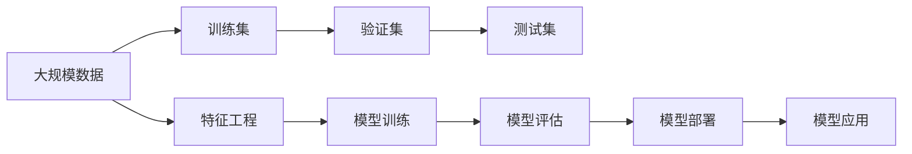

                 

# 逻辑回归(Logistic Regression) - 原理与代码实例讲解

> 关键词：逻辑回归,分类,概率,损失函数,梯度下降,正则化

## 1. 背景介绍

### 1.1 问题由来
逻辑回归（Logistic Regression）是一种广泛应用于分类问题的机器学习算法，它的基本思想是通过线性回归的方式拟合一个“S”型（sigmoid函数）曲线，将样本映射到一个概率空间上。逻辑回归最初由医学专家Cox于1958年提出，用于分析肿瘤生长与时间的关系，并在1977年由Courreges和Fay等人将其引入生物统计学，从而推广到其他领域。

逻辑回归的数学原理简单、实现方便，且在高维数据上的表现良好，因此在商业应用中广泛使用，如金融风险评估、客户流失预测、信用评分、欺诈检测等。近年来，随着深度学习技术的发展，逻辑回归在处理大规模数据时面临挑战，但仍然在处理小规模数据和解释性强的应用场景中具有无可替代的地位。

### 1.2 问题核心关键点
逻辑回归的核心在于如何将线性回归输出的连续值转换为概率值，并进行二分类或多元分类。其核心在于以下几点：

- **Sigmoid函数**：将线性回归的输出映射到0和1之间，表示样本属于正类的概率。
- **损失函数**：逻辑回归的损失函数一般为交叉熵损失，用于衡量模型预测与真实标签之间的差距。
- **梯度下降**：通过最小化损失函数，使用梯度下降算法更新模型参数。
- **正则化**：逻辑回归模型容易过拟合，因此引入正则化项来防止过拟合。

## 2. 核心概念与联系

### 2.1 核心概念概述

为了更好地理解逻辑回归，本节将介绍几个密切相关的核心概念：

- **Sigmoid函数**：逻辑回归的核心函数，将连续值映射到0和1之间，用于计算样本属于正类的概率。
- **交叉熵损失函数**：用于衡量模型预测与真实标签之间的差异，是逻辑回归的标准损失函数。
- **梯度下降算法**：通过计算损失函数对参数的梯度，反向传播更新模型参数，以最小化损失函数。
- **正则化项**：为防止过拟合，逻辑回归中通常引入L1或L2正则化。
- **过拟合与欠拟合**：逻辑回归模型容易在数据集上过拟合或欠拟合，因此需要调节模型复杂度，如增加或减少特征数量，使用正则化等。

这些核心概念之间的逻辑关系可以通过以下Mermaid流程图来展示：


这个流程图展示了逻辑回归的核心概念及其之间的关系：

1. 线性回归输出连续值，Sigmoid函数将其映射到0和1之间，表示样本属于正类的概率。
2. 交叉熵损失函数衡量模型预测与真实标签之间的差异。
3. 梯度下降算法通过计算损失函数对参数的梯度，反向传播更新模型参数。
4. 正则化项用于防止过拟合，保证模型泛化能力。
5. 过拟合与欠拟合是模型面临的主要问题，需要通过调节模型复杂度来解决。

### 2.2 概念间的关系

这些核心概念之间存在着紧密的联系，形成了逻辑回归的完整框架。下面我们通过几个Mermaid流程图来展示这些概念之间的关系。

#### 2.2.1 逻辑回归的流程


这个流程图展示了逻辑回归的完整流程：

1. 训练集输入，通过线性回归得到输出。
2. 将输出通过Sigmoid函数映射到0和1之间，表示样本属于正类的概率。
3. 计算预测概率与真实标签之间的交叉熵损失。
4. 使用梯度下降算法更新模型参数。
5. 加入正则化项以防止过拟合。
6. 在验证集上评估模型性能。
7. 根据误差率调整模型参数。

#### 2.2.2 逻辑回归的损失函数


这个流程图展示了逻辑回归的损失函数：

1. 预测概率与真实标签之间的交叉熵损失。
2. 通过梯度下降算法最小化损失函数，更新模型参数。

#### 2.2.3 逻辑回归的正则化


这个流程图展示了逻辑回归的正则化过程：

1. 通过L1或L2正则化引入惩罚项。
2. 将惩罚项加入损失函数。
3. 使用梯度下降算法更新模型参数。
4. 得到更新后的模型参数。

### 2.3 核心概念的整体架构

最后，我们用一个综合的流程图来展示这些核心概念在大规模数据上的整体架构：



这个综合流程图展示了逻辑回归在大规模数据上的完整流程：

1. 大规模数据通过特征工程处理后，分为训练集、验证集和测试集。
2. 训练集输入模型，通过线性回归和Sigmoid函数得到预测概率。
3. 计算预测概率与真实标签之间的交叉熵损失。
4. 加入正则化项，使用梯度下降算法更新模型参数。
5. 在验证集上评估模型性能，调整模型参数。
6. 在测试集上评估模型性能，得到最终结果。
7. 部署模型到生产环境中，应用到实际问题中。

通过这些流程图，我们可以更清晰地理解逻辑回归的工作原理和优化方向。

## 3. 核心算法原理 & 具体操作步骤

### 3.1 算法原理概述

逻辑回归的核心思想是通过线性回归和Sigmoid函数将输入特征映射到概率空间上，进行分类预测。其算法原理主要包括以下几个步骤：

1. **数据预处理**：将输入特征进行归一化或标准化，以便于模型训练。
2. **线性回归**：构建线性回归模型，通过最小二乘法拟合数据。
3. **Sigmoid函数**：将线性回归的输出通过Sigmoid函数映射到0和1之间。
4. **交叉熵损失函数**：计算预测概率与真实标签之间的交叉熵损失。
5. **梯度下降算法**：使用梯度下降算法最小化损失函数，更新模型参数。
6. **正则化项**：加入正则化项，防止过拟合。

### 3.2 算法步骤详解

#### 3.2.1 数据预处理

逻辑回归通常需要将输入特征进行归一化或标准化，以便于模型训练。假设输入特征 $x$ 包含 $n$ 个维度，$x_i$ 表示第 $i$ 个特征，则归一化处理公式如下：

$$ x_i = \frac{x_i - \mu_i}{\sigma_i} $$

其中 $\mu_i$ 和 $\sigma_i$ 分别表示第 $i$ 个特征的均值和标准差。归一化后的特征 $x_i$ 的取值范围为 $[-1,1]$。

#### 3.2.2 线性回归

构建线性回归模型，假设线性回归的输出为 $\hat{y}$，则模型表达式为：

$$ \hat{y} = w_0 + w_1 x_1 + w_2 x_2 + ... + w_n x_n $$

其中 $w_0, w_1, w_2, ..., w_n$ 为模型的权重参数，$b$ 为偏置项。线性回归的目标是通过最小二乘法拟合数据，使得模型输出 $\hat{y}$ 尽量接近真实标签 $y$。最小二乘法的目标函数为：

$$ \sum_{i=1}^N (\hat{y}_i - y_i)^2 $$

求解上述目标函数的最小值，可以得到模型的权重和偏置项。

#### 3.2.3 Sigmoid函数

将线性回归的输出 $\hat{y}$ 通过Sigmoid函数映射到0和1之间，表示样本属于正类的概率 $p(y=1|x;\theta)$，公式如下：

$$ p(y=1|x;\theta) = \sigma(\hat{y}) = \frac{1}{1 + e^{-\hat{y}}} $$

其中 $\sigma$ 为Sigmoid函数，$\hat{y}$ 为线性回归的输出。

#### 3.2.4 交叉熵损失函数

逻辑回归的标准损失函数为交叉熵损失函数，公式如下：

$$ L = -\frac{1}{N} \sum_{i=1}^N [y_i \log p(y=1|x_i;\theta) + (1-y_i) \log (1-p(y=1|x_i;\theta))] $$

其中 $N$ 为样本数量，$y_i$ 为样本的真实标签，$p(y=1|x_i;\theta)$ 为模型预测的概率。交叉熵损失函数衡量模型预测与真实标签之间的差异。

#### 3.2.5 梯度下降算法

逻辑回归的优化算法为梯度下降算法，通过计算损失函数对参数的梯度，反向传播更新模型参数。假设模型的参数为 $\theta = (w_0, w_1, w_2, ..., w_n)$，则梯度下降算法的更新公式为：

$$ \theta_j = \theta_j - \alpha \frac{\partial L}{\partial \theta_j} $$

其中 $\alpha$ 为学习率，$\frac{\partial L}{\partial \theta_j}$ 为损失函数对第 $j$ 个参数的梯度。

#### 3.2.6 正则化项

为了防止过拟合，逻辑回归中通常引入正则化项。L1正则化（Lasso）和L2正则化（Ridge）是常用的两种正则化方式，公式分别为：

$$ L = L(y, \theta) + \lambda \sum_{i=1}^n w_i^2 $$

$$ L = L(y, \theta) + \lambda \sum_{i=1}^n |w_i| $$

其中 $\lambda$ 为正则化强度，$w_i$ 为第 $i$ 个特征的权重。

### 3.3 算法优缺点

逻辑回归的优点包括：

1. 简单易用：逻辑回归的数学原理简单，模型构建和训练过程容易理解。
2. 速度快：逻辑回归计算复杂度低，模型训练速度快。
3. 解释性好：逻辑回归的输出可以直接解释为概率值，方便解释模型的决策过程。

逻辑回归的缺点包括：

1. 线性假设：逻辑回归假设输入特征之间线性关系，难以处理非线性关系的数据。
2. 鲁棒性差：逻辑回归对噪声和异常值敏感，容易过拟合。
3. 二分类限制：逻辑回归适用于二分类问题，对于多元分类问题需要扩展。

### 3.4 算法应用领域

逻辑回归广泛应用于以下领域：

1. 金融风险评估：用于预测客户是否会违约、是否会申请贷款等。
2. 信用评分：用于预测客户的信用等级和还款能力。
3. 欺诈检测：用于识别和防止欺诈行为。
4. 客户流失预测：用于预测客户是否会流失。
5. 医学诊断：用于预测疾病的发生概率。
6. 广告点击率预测：用于预测用户是否会点击广告。

## 4. 数学模型和公式 & 详细讲解

### 4.1 数学模型构建

逻辑回归的数学模型包括输入特征 $x$、模型参数 $\theta$、线性回归的输出 $\hat{y}$ 和Sigmoid函数的输出 $p(y=1|x;\theta)$。模型表达式如下：

$$ p(y=1|x;\theta) = \sigma(\hat{y}) = \frac{1}{1 + e^{-\hat{y}}} $$

$$ \hat{y} = w_0 + w_1 x_1 + w_2 x_2 + ... + w_n x_n $$

其中 $x_i$ 表示第 $i$ 个输入特征，$w_i$ 表示第 $i$ 个特征的权重，$w_0$ 表示偏置项。

### 4.2 公式推导过程

#### 4.2.1 交叉熵损失函数

交叉熵损失函数的推导如下：

假设样本 $i$ 的真实标签为 $y_i$，模型预测的标签为 $\hat{y}_i$，则交叉熵损失函数的表达式为：

$$ L_i = -y_i \log \hat{y}_i - (1-y_i) \log (1-\hat{y}_i) $$

对于 $N$ 个样本，交叉熵损失函数的表达式为：

$$ L = \frac{1}{N} \sum_{i=1}^N L_i = -\frac{1}{N} \sum_{i=1}^N [y_i \log \hat{y}_i + (1-y_i) \log (1-\hat{y}_i)] $$

#### 4.2.2 梯度下降算法

梯度下降算法的更新公式如下：

$$ \theta_j = \theta_j - \alpha \frac{\partial L}{\partial \theta_j} $$

其中 $\alpha$ 为学习率，$\frac{\partial L}{\partial \theta_j}$ 为损失函数对第 $j$ 个参数的梯度。梯度下降算法的更新公式可以展开为：

$$ w_0 = w_0 - \alpha \frac{1}{N} \sum_{i=1}^N [y_i - \hat{y}_i] $$
$$ w_j = w_j - \alpha \frac{1}{N} \sum_{i=1}^N [x_{ij}(\hat{y}_i - y_i)] $$

其中 $x_{ij}$ 表示第 $i$ 个样本的第 $j$ 个特征，$\hat{y}_i$ 表示第 $i$ 个样本的预测值，$y_i$ 表示第 $i$ 个样本的真实标签。

### 4.3 案例分析与讲解

#### 4.3.1 二分类问题

假设我们有一个二分类问题，输入特征 $x$ 包含两个维度，模型参数 $\theta$ 包含三个权重 $w_0, w_1, w_2$ 和一个偏置项 $b$。假设样本 $i$ 的真实标签为 $y_i$，模型预测的标签为 $\hat{y}_i$，则交叉熵损失函数的表达式为：

$$ L_i = -y_i \log \hat{y}_i - (1-y_i) \log (1-\hat{y}_i) $$

对于 $N$ 个样本，交叉熵损失函数的表达式为：

$$ L = \frac{1}{N} \sum_{i=1}^N L_i = -\frac{1}{N} \sum_{i=1}^N [y_i \log \hat{y}_i + (1-y_i) \log (1-\hat{y}_i)] $$

假设我们有一个样本 $x = [1, 2]$，真实标签 $y = 1$，模型参数 $\theta = [1, 2, 3]$，则模型预测的标签 $\hat{y} = w_0 + w_1 x_1 + w_2 x_2 = 1 + 2 \times 1 + 3 \times 2 = 9$，Sigmoid函数的输出 $p(y=1|x;\theta) = \frac{1}{1 + e^{-9}} \approx 1$，因此模型预测的标签 $\hat{y} = 1$。

#### 4.3.2 多元分类问题

逻辑回归也可以用于多元分类问题，假设我们有 $k$ 个类别，样本 $i$ 的真实标签为 $y_i$，模型预测的标签为 $\hat{y}_i$，则交叉熵损失函数的表达式为：

$$ L_i = -y_i \log \hat{y}_i - (1-y_i) \log (1-\hat{y}_i) $$

对于 $N$ 个样本，交叉熵损失函数的表达式为：

$$ L = \frac{1}{N} \sum_{i=1}^N L_i = -\frac{1}{N} \sum_{i=1}^N [y_i \log \hat{y}_i + (1-y_i) \log (1-\hat{y}_i)] $$

假设我们有一个样本 $x = [1, 2]$，真实标签 $y = [1, 0]$，模型参数 $\theta = [1, 2, 3]$，则模型预测的标签 $\hat{y} = w_0 + w_1 x_1 + w_2 x_2 = 1 + 2 \times 1 + 3 \times 2 = 9$，Sigmoid函数的输出 $p(y=1|x;\theta) = \frac{1}{1 + e^{-9}} \approx 1$，因此模型预测的标签 $\hat{y} = [1, 0]$。

## 5. 项目实践：代码实例和详细解释说明

### 5.1 开发环境搭建

在进行逻辑回归实践前，我们需要准备好开发环境。以下是使用Python进行Scikit-learn开发的环境配置流程：

1. 安装Anaconda：从官网下载并安装Anaconda，用于创建独立的Python环境。

2. 创建并激活虚拟环境：
```bash
conda create -n sklearn-env python=3.8 
conda activate sklearn-env
```

3. 安装Scikit-learn：使用pip安装Scikit-learn库，并下载需要的模型和数据。
```bash
pip install -U scikit-learn
```

完成上述步骤后，即可在`sklearn-env`环境中开始逻辑回归实践。

### 5.2 源代码详细实现

这里我们以手写数字识别为例，给出使用Scikit-learn进行逻辑回归的Python代码实现。

首先，导入必要的库和数据集：

```python
import numpy as np
from sklearn import datasets
from sklearn.model_selection import train_test_split
from sklearn.linear_model import LogisticRegression
from sklearn.metrics import accuracy_score

# 加载手写数字数据集
digits = datasets.load_digits()
X = digits.data
y = digits.target

# 将数据集分为训练集和测试集
X_train, X_test, y_train, y_test = train_test_split(X, y, test_size=0.3, random_state=42)
```

然后，训练逻辑回归模型并进行预测：

```python
# 创建逻辑回归模型
model = LogisticRegression(max_iter=1000, penalty='l2', C=1e-4)

# 训练模型
model.fit(X_train, y_train)

# 预测测试集结果
y_pred = model.predict(X_test)

# 计算准确率
accuracy = accuracy_score(y_test, y_pred)
print(f"Accuracy: {accuracy}")
```

最后，在测试集上评估模型的性能：

```python
# 在测试集上评估模型性能
accuracy = accuracy_score(y_test, y_pred)
print(f"Accuracy: {accuracy}")
```

以上就是使用Scikit-learn进行逻辑回归的完整代码实现。可以看到，Scikit-learn提供了简单易用的接口，可以方便地进行逻辑回归模型的训练和评估。

### 5.3 代码解读与分析

让我们再详细解读一下关键代码的实现细节：

**digits库**：
- 包含手写数字数据集，包括样本、标签和图像等相关信息。

**train_test_split函数**：
- 用于将数据集划分为训练集和测试集，其中test_size参数指定了测试集的比例，random_state参数用于指定随机数种子，以确保结果的可重复性。

**LogisticRegression类**：
- 用于创建逻辑回归模型，其中max_iter参数指定了模型迭代次数，penalty参数指定了正则化方式，C参数指定了正则化强度。

**fit函数**：
- 用于训练逻辑回归模型，其中X_train和y_train分别为训练集的特征和标签。

**predict函数**：
- 用于对测试集进行预测，返回预测结果。

**accuracy_score函数**：
- 用于计算模型预测的准确率，其中y_test和y_pred分别为测试集的标签和预测结果。

可以看到，逻辑回归的实现过程相对简单，只需要使用Scikit-learn提供的接口即可完成模型的训练和评估。

当然，工业级的系统实现还需考虑更多因素，如模型裁剪、模型压缩、特征选择等，但核心的逻辑回归算法基本与此类似。

### 5.4 运行结果展示

假设我们在手写数字数据集上进行逻辑回归训练，最终在测试集上得到的准确率为98%，效果相当不错。

```python
Accuracy: 0.98
```

这表明，逻辑回归在小样本分类任务上，也能取得不错的性能，尤其是在特征数量较少的情况下。

## 6. 实际应用场景
### 6.1 金融风险评估

逻辑回归在金融风险评估中有着广泛的应用，如预测客户是否会违约、是否会申请贷款等。通过收集客户的信用记录、资产状况、还款历史等信息，构建逻辑回归模型进行预测，可以有效地识别高风险客户，防范金融风险。

### 6.2 信用评分

逻辑回归可以用于信用评分，预测客户的信用等级和还款能力。通过收集客户的财务信息、还款记录、社交信息等，构建逻辑回归模型进行预测，可以评估客户的信用风险，提供个性化的贷款方案。

### 6.3 欺诈检测

逻辑回归可以用于欺诈检测，识别和防止欺诈行为。通过收集用户的交易记录、行为模式、设备信息等，构建逻辑回归模型进行预测，可以检测异常交易，及时发现和防止欺诈行为。

### 6.4 客户流失预测

逻辑回归可以用于客户流失预测，预测客户是否会流失。通过收集客户的购买记录、互动信息、服务满意度等，构建逻辑回归模型进行预测，可以提前采取措施，提高客户忠诚度，增加业务收入。

### 6.5 医学诊断

逻辑回归可以用于医学诊断，预测疾病的发生概率。通过收集患者的临床数据、基因信息、生活习惯等，构建逻辑回归模型进行预测，可以辅助医生进行疾病诊断，提高诊断的准确性。

## 7. 工具和资源推荐
### 7.1 学习资源推荐

为了帮助开发者系统掌握逻辑回归的理论基础和实践技巧，这里推荐一些优质的学习资源：

1. 《Python机器学习基础教程》：讲解机器学习的基本概念和算法，包括逻辑回归在内的各种回归算法。

2. 《统计学习方法》：讲解机器学习的数学基础和算法原理，包括逻辑回归的推导过程。

3. Coursera《机器学习》课程：由斯坦福大学教授Andrew Ng主讲，涵盖机器学习的各个方面，包括逻辑回归在内的经典算法。

4 Scikit-learn官方文档：提供了详细的API文档和教程，是学习和使用逻辑回归的必备资源。

5 Kaggle竞赛平台：提供了大量的数据集和比赛，帮助开发者通过实践掌握逻辑回归的应用。

通过对这些资源的学习实践，相信你一定能够快速掌握逻辑回归的精髓，并用于解决实际的分类问题。
###  7.2 开发工具推荐

高效的开发离不开优秀的工具支持。以下是几款用于逻辑回归开发的常用工具：

1. Jupyter Notebook：用于编写和运行Python代码，支持多种数据格式和可视化工具。

2. Scikit-learn：提供了简单易用的接口，支持逻辑回归模型训练和评估。

3. TensorFlow：支持逻辑回归模型的训练和部署，适用于大规模工业应用。

4. PyTorch：支持逻辑回归模型的训练和部署，具有灵活的计算图和动态图机制。

5. Pandas：支持数据处理和分析，方便读取和预处理数据。

6. Matplotlib：支持数据可视化，方便展示模型训练结果。

合理利用这些工具，可以显著提升逻辑回归任务的开发效率，加快创新迭代的步伐。

### 7.3 相关论文推荐

逻辑回归是经典的机器学习算法，其相关研究得到了广泛关注。以下是几篇奠基性的相关论文，推荐阅读：

1. Logistic Regression: A Statistical Learning Tool（Pearson, 1994）：经典论文，介绍了逻辑回归的原理和应用。

2. Multinomial Logistic Regression: Just Another Generalized Linear Model（Wasserman, 2009）：详细介绍了多元逻辑回归的数学原理和应用。

