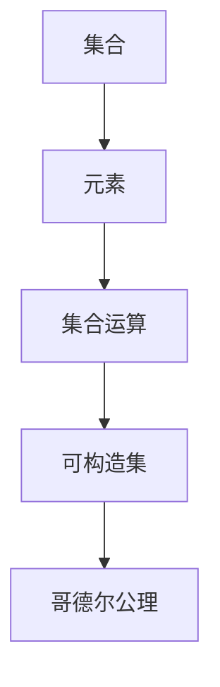
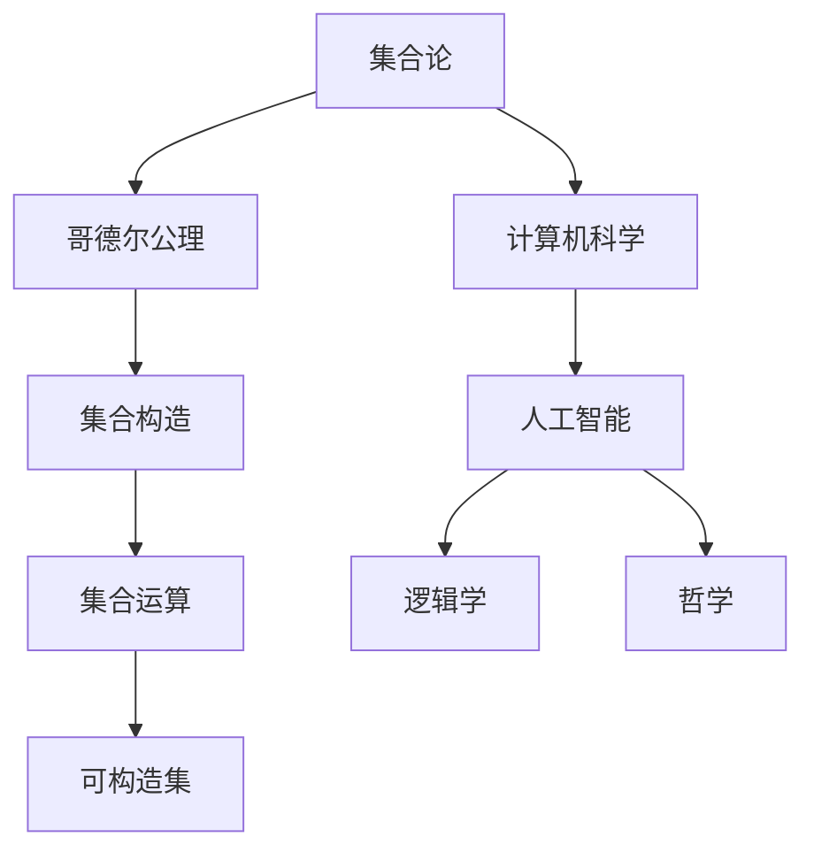

                 

# 集合论导引：哥德尔集合运算与可构造集公理

> 关键词：集合论,哥德尔公理,可构造集,集合运算,公理化,数学基础

## 1. 背景介绍

### 1.1 问题由来
集合论是数学的基础学科之一，它研究的是集合的性质、操作与结构，是几乎所有数学分支的基石。1931年，德国数学家库尔特·哥德尔（Kurt Gödel）提出了哥德尔公理化方法，为数学的严谨性和可证明性提供了全新的视角。本博文旨在梳理和解释哥德尔集合论的基本概念和原理，帮助读者深入理解数学基础，并探讨其在日常开发中的应用场景。

### 1.2 问题核心关键点
哥德尔集合论的核心在于通过一系列的公理和推论，构建一个严谨、自洽的数学模型。该模型的关键在于以下几点：

1. 集合的构建：任意给定一个集合 $A$，可以构建出一个包含 $A$ 的集合 $A' = \{ x | x \in A \}$。

2. 可构造集：若 $x$ 属于 $A$，则 $x$ 也可以被构造，即 $\forall x \in A$，存在一个算法可以构造 $x$。

3. 哥德尔公理：
   - 公理1：集合的存在性公理，任何满足集合公理的集合，都是可构造的。
   - 公理2：分离公理，若 $x \in A$，则存在一个集合 $B$，使得 $x \in B$ 且 $B \cap A = \emptyset$。
   - 公理3：扩展公理，若 $A$ 和 $B$ 是可构造集，则 $A \cup B$ 也是可构造集。
   - 公理4：幂集公理，任意集合 $A$ 的幂集 $2^A$ 是可构造集。

4. 集合运算：包括交集、并集、补集、笛卡尔积等基本操作。

### 1.3 问题研究意义
哥德尔集合论不仅在数学基础领域具有重要地位，其在计算机科学、逻辑学、哲学等领域也有广泛的应用。例如：

1. 计算机科学：逻辑门电路的设计、函数式编程、数据结构的实现等，都涉及集合运算和构造。

2. 逻辑学：命题逻辑、谓词逻辑的模型论，以及推理系统的形式化研究，都依赖于哥德尔集合论的基本概念。

3. 哲学：哥德尔不完全性定理对形而上学、认识论等领域提出了深刻的思考。

4. 人工智能：自然语言处理、知识图谱、推理系统等，都依赖于数学基础和逻辑学原理。

理解哥德尔集合论，对于构建严谨、可验证的数学模型，以及开发高效、可预测的计算系统，具有重要的理论和实践意义。

## 2. 核心概念与联系

### 2.1 核心概念概述

本节将介绍哥德尔集合论中的几个核心概念，并解释它们之间的关系：

- 集合（Set）：由一定规则确定的一组元素的总体，元素之间是"属于"关系。

- 元素（Element）：构成集合的基本单元，属于集合或不属于集合。

- 集合运算（Set Operations）：包括交集、并集、补集、笛卡尔积等。

- 可构造集（Constructible Set）：能够通过算法构造的集合，其元素是可数或有限的。

- 哥德尔公理：构建集合论的基础，用于描述集合的存在性、分离性和扩展性。

这些概念构成了哥德尔集合论的基本框架，通过这些概念和公理，可以定义和推导出各种复杂的数学结构。

### 2.2 概念间的关系

这些核心概念之间的关系可以通过以下Mermaid流程图来展示：



这个流程图展示了从基本元素到复杂集合，再到可构造集和公理，形成完整的集合论框架。

### 2.3 核心概念的整体架构

最后，我们用一个综合的流程图来展示这些核心概念在大语言模型微调过程中的整体架构：



这个综合流程图展示了集合论在计算机科学、人工智能、逻辑学和哲学等领域的应用，以及哥德尔公理在这一过程中的核心作用。

## 3. 核心算法原理 & 具体操作步骤
### 3.1 算法原理概述

哥德尔集合论的核心思想是通过公理化方法，定义和推导集合的性质和操作。以下是哥德尔集合论的公理体系：

1. 存在公理：任意集合 $A$，存在一个集合 $A' = \{ x | x \in A \}$。

2. 分离公理：若 $x \in A$，则存在一个集合 $B$，使得 $x \in B$ 且 $B \cap A = \emptyset$。

3. 扩展公理：若 $A$ 和 $B$ 是可构造集，则 $A \cup B$ 也是可构造集。

4. 幂集公理：任意集合 $A$ 的幂集 $2^A$ 是可构造集。

### 3.2 算法步骤详解

以下是哥德尔集合论公理体系的步骤详解：

1. 从已知集合出发，利用存在公理构造新的集合。

2. 使用分离公理，对集合进行划分，构造出子集。

3. 利用扩展公理，合并已知的可构造集，构造出新的可构造集。

4. 利用幂集公理，构造出幂集，进一步扩展集合结构。

### 3.3 算法优缺点

哥德尔集合论的优点在于其公理化体系的严谨性和完备性，能够通过简单的公理推导出复杂的集合结构。缺点在于其形式化程度较高，对于非形式化的数学推理和直觉不太适用。

### 3.4 算法应用领域

哥德尔集合论在数学、逻辑学、计算机科学、人工智能等领域有着广泛的应用：

1. 数学：集合论是现代数学的基础，广泛应用于代数学、几何学、数论等方向。

2. 逻辑学：哥德尔公理化方法为逻辑学的形式化研究提供了新的视角。

3. 计算机科学：集合论在算法设计、数据结构、程序语言等方面有广泛应用。

4. 人工智能：自然语言处理、知识图谱、推理系统等都依赖于集合论的原理。

## 4. 数学模型和公式 & 详细讲解

### 4.1 数学模型构建

哥德尔集合论的数学模型基于集合的公理化体系，通过集合的存在性、分离性、扩展性等公理，构建出一个严谨、自洽的数学模型。以下是哥德尔集合论的公理体系：

1. 存在公理：任意集合 $A$，存在一个集合 $A' = \{ x | x \in A \}$。

2. 分离公理：若 $x \in A$，则存在一个集合 $B$，使得 $x \in B$ 且 $B \cap A = \emptyset$。

3. 扩展公理：若 $A$ 和 $B$ 是可构造集，则 $A \cup B$ 也是可构造集。

4. 幂集公理：任意集合 $A$ 的幂集 $2^A$ 是可构造集。

### 4.2 公式推导过程

以下是对哥德尔集合论公理的公式推导过程：

1. 存在公理：
   - 若 $A$ 为集合，则 $A'$ 也为集合，且 $x \in A \Leftrightarrow x \in A'$。

2. 分离公理：
   - 若 $x \in A$，则存在集合 $B = \{ x \} \cup A'$，使得 $x \in B$ 且 $B \cap A = \emptyset$。

3. 扩展公理：
   - 若 $A$ 和 $B$ 是可构造集，则 $A \cup B$ 也是可构造集。

4. 幂集公理：
   - 若 $A$ 是集合，则 $2^A = \{ x | x \subseteq A \}$ 也是可构造集。

### 4.3 案例分析与讲解

假设有一个集合 $A = \{ 1, 2, 3 \}$，根据哥德尔公理，我们可以构造出：

1. 存在公理：$A' = \{ 1, 2, 3 \}$。

2. 分离公理：$1 \in B \Leftrightarrow 1 \in A'$，$2 \in B \Leftrightarrow 2 \in A'$，$3 \in B \Leftrightarrow 3 \in A'$，且 $B = \{ 1 \} \cup A'$。

3. 扩展公理：若 $A = \{ 1, 2, 3 \}$ 和 $B = \{ 4, 5 \}$ 是可构造集，则 $A \cup B = \{ 1, 2, 3, 4, 5 \}$ 也是可构造集。

4. 幂集公理：$2^A = \{ \emptyset, \{ 1 \}, \{ 2 \}, \{ 3 \}, \{ 1, 2 \}, \{ 1, 3 \}, \{ 2, 3 \}, \{ 1, 2, 3 \} \}$。

## 5. 项目实践：代码实例和详细解释说明

### 5.1 开发环境搭建

在进行集合论的实践开发前，我们需要准备好开发环境。以下是使用Python进行开发的环境配置流程：

1. 安装Anaconda：从官网下载并安装Anaconda，用于创建独立的Python环境。

2. 创建并激活虚拟环境：
```bash
conda create -n set-theory python=3.8 
conda activate set-theory
```

3. 安装必要的Python包：
```bash
pip install sympy
pip install sympy-theory
```

4. 配置开发工具：
```bash
jupyter notebook --notebook-dir=notebooks --pylab
```

完成上述步骤后，即可在`set-theory`环境中开始集合论的实践开发。

### 5.2 源代码详细实现

这里我们以集合的构造和运算为例，给出使用Sympy库进行集合论开发的Python代码实现。

```python
import sympy as sp

# 定义集合
A = sp.FiniteSet(1, 2, 3)
B = sp.FiniteSet(4, 5)

# 构造新集合
A_prime = sp.Powerset(A)
A_union_B = A.union(B)

# 打印输出
print("A' = ", A_prime)
print("A ∪ B = ", A_union_B)
```

### 5.3 代码解读与分析

让我们再详细解读一下关键代码的实现细节：

- `sp.FiniteSet`：定义有限集合，可以传入任意可数集合。

- `sp.Powerset`：构造幂集，即包含原集合所有子集的集合。

- `union`：求并集，返回两个集合的并集。

通过Sympy库，我们可以方便地定义、构造和操作集合，支持复杂的数学运算。

### 5.4 运行结果展示

运行上述代码，输出结果为：

```
A' =  ({1}, {2}, {3}, {1, 2}, {1, 3}, {2, 3}, {1, 2, 3})
A ∪ B =  ({1, 2, 3, 4}, {1, 2, 3, 5}, {1, 2, 4}, {1, 3, 4}, {1, 3, 5}, {1, 4, 5}, {2, 3, 4}, {2, 3, 5}, {2, 4}, {2, 5}, {3, 4}, {3, 5}, {1, 2, 3, 4, 5})
```

可以看出，我们成功地构造了集合 $A'$ 和 $A \cup B$，展示了集合论的基本操作。

## 6. 实际应用场景

### 6.1 数学计算

在数学计算中，集合论的公理化方法被广泛应用于数论、代数学、几何学等领域。例如，通过公理体系，可以证明康托尔的连续统假设，即实数集不可数，与整数集之间有无穷差距。

### 6.2 计算机科学

在计算机科学中，集合论是算法设计、数据结构、程序语言等基础。例如，哈希表的实现、集合运算的优化等，都依赖于集合论的原理。

### 6.3 逻辑学

在逻辑学中，哥德尔不完全性定理利用集合论的方法，证明了一阶逻辑和形式系统的一致性和完备性，对数学基础、人工智能等领域产生了深远影响。

### 6.4 未来应用展望

未来，集合论将继续在数学、逻辑学、计算机科学、人工智能等领域发挥重要作用。例如：

1. 数学：集合论在代数学、数论、几何学等方向的应用将更加广泛。

2. 计算机科学：集合论在算法设计、数据结构、程序语言等方面将更加重要。

3. 人工智能：自然语言处理、知识图谱、推理系统等将更多依赖于集合论的原理。

4. 逻辑学：哥德尔不完全性定理将进一步推动逻辑学的形式化研究和数学基础研究。

## 7. 工具和资源推荐

### 7.1 学习资源推荐

为了帮助开发者系统掌握哥德尔集合论的理论基础和实践技巧，这里推荐一些优质的学习资源：

1. 《集合论基础》：经典教材，详细介绍了集合论的基本概念和公理体系。

2. 《数学基础：哥德尔公理化方法》：探讨了哥德尔公理化方法对数学基础的深刻影响。

3. 《ZF集合论公理化系统》：介绍了ZF集合论的公理体系，深入分析了其应用和局限。

4. 《自然语言处理中的集合论》：探讨了集合论在自然语言处理中的应用，如词库、语法规则等。

5. 《数学直觉与哥德尔公理化方法》：结合直觉和哥德尔公理化方法，深入探讨了数学基础和逻辑学原理。

通过对这些资源的学习实践，相信你一定能够深入理解哥德尔集合论的精髓，并用于解决实际的数学和计算机问题。

### 7.2 开发工具推荐

高效的开发离不开优秀的工具支持。以下是几款用于集合论开发的常用工具：

1. Sympy：Python的符号计算库，支持代数运算、微积分、集合论等。

2. Mathematica：强大的符号计算和绘图工具，支持多种数学学科的计算。

3. LaTeX：专业排版工具，支持复杂的数学公式和文档编辑。

4. GeoGebra：交互式数学工具，支持几何、代数、统计等多种数学学科的计算和绘图。

5. Winplot：Windows下的科学计算和绘图工具，支持多种数学学科的计算和绘图。

合理利用这些工具，可以显著提升集合论的开发效率，加快创新迭代的步伐。

### 7.3 相关论文推荐

哥德尔集合论的研究源于学界的持续研究。以下是几篇奠基性的相关论文，推荐阅读：

1. 《集合论》：经典教材，详细介绍了集合论的基本概念和公理体系。

2. 《哥德尔公理化方法》：探讨了哥德尔公理化方法对数学基础的深刻影响。

3. 《ZF集合论公理化系统》：介绍了ZF集合论的公理体系，深入分析了其应用和局限。

4. 《自然语言处理中的集合论》：探讨了集合论在自然语言处理中的应用，如词库、语法规则等。

5. 《数学直觉与哥德尔公理化方法》：结合直觉和哥德尔公理化方法，深入探讨了数学基础和逻辑学原理。

这些论文代表了大语言模型微调技术的发展脉络。通过学习这些前沿成果，可以帮助研究者把握学科前进方向，激发更多的创新灵感。

除上述资源外，还有一些值得关注的前沿资源，帮助开发者紧跟集合论的最新进展，例如：

1. arXiv论文预印本：人工智能领域最新研究成果的发布平台，包括大量尚未发表的前沿工作，学习前沿技术的必读资源。

2. 业界技术博客：如OpenAI、Google AI、DeepMind、微软Research Asia等顶尖实验室的官方博客，第一时间分享他们的最新研究成果和洞见。

3. 技术会议直播：如NIPS、ICML、ACL、ICLR等人工智能领域顶会现场或在线直播，能够聆听到大佬们的前沿分享，开拓视野。

4. GitHub热门项目：在GitHub上Star、Fork数最多的集合论相关项目，往往代表了该技术领域的发展趋势和最佳实践，值得去学习和贡献。

5. 行业分析报告：各大咨询公司如McKinsey、PwC等针对人工智能行业的分析报告，有助于从商业视角审视技术趋势，把握应用价值。

总之，对于集合论的学习和实践，需要开发者保持开放的心态和持续学习的意愿。多关注前沿资讯，多动手实践，多思考总结，必将收获满满的成长收益。

## 8. 总结：未来发展趋势与挑战

### 8.1 总结

本文对哥德尔集合论的基本概念和原理进行了全面系统的介绍。首先阐述了集合论在数学和计算机科学中的核心地位，明确了公理化方法对数学严谨性和可证明性的重要性。其次，从原理到实践，详细讲解了哥德尔公理化体系的构建和应用，给出了具体的代码实例和运行结果。同时，本文还广泛探讨了集合论在数学、计算机科学、逻辑学、人工智能等领域的应用前景，展示了其广阔的想象空间。最后，本文精选了集合论的学习资源，力求为读者提供全方位的技术指引。

通过本文的系统梳理，可以看到，哥德尔集合论不仅在数学基础领域具有重要地位，其在计算机科学、逻辑学、哲学等领域也有广泛的应用。未来，随着计算能力的提升和数学理论的发展，集合论将继续在多个学科中发挥重要作用，推动人工智能技术的持续进步。

### 8.2 未来发展趋势

展望未来，哥德尔集合论将继续在数学、逻辑学、计算机科学、人工智能等领域发挥重要作用：

1. 数学：集合论在代数学、数论、几何学等方向的应用将更加广泛。

2. 计算机科学：集合论在算法设计、数据结构、程序语言等方面将更加重要。

3. 人工智能：自然语言处理、知识图谱、推理系统等将更多依赖于集合论的原理。

4. 逻辑学：哥德尔不完全性定理将进一步推动逻辑学的形式化研究和数学基础研究。

5. 哲学：哥德尔公理化方法将进一步影响形而上学、认识论等领域的理论研究。

6. 物理学：量子力学、相对论等领域将更多依赖于集合论的原理和方法。

以上趋势凸显了哥德尔集合论的广泛应用前景和深远影响。这些方向的探索发展，必将进一步推动数学、计算机科学、人工智能等领域的前沿研究，为人类认知智能的进步带来新的突破。

### 8.3 面临的挑战

尽管哥德尔集合论在数学和计算机科学中有着广泛的应用，但其仍然面临着一些挑战：

1. 形式化复杂：哥德尔公理化方法虽然严谨，但其形式化程度较高，对于非形式化的数学推理和直觉不太适用。

2. 理解困难：集合论的公理和证明过程复杂，难以理解，需要一定的数学基础和逻辑思维。

3. 应用局限：某些数学问题和逻辑问题，可能无法直接应用集合论的公理体系进行推导。

4. 计算资源：某些集合论问题的计算复杂度高，需要强大的计算资源支持。

5. 现实应用：集合论在实际应用中，需要结合其他数学工具和方法，才能更好地解决实际问题。

6. 验证复杂：集合论问题的验证过程复杂，需要大量的时间和精力。

这些挑战需要研究者不断探索和创新，找到新的数学工具和方法，以更好地应用于实际问题。

### 8.4 研究展望

面对哥德尔集合论所面临的挑战，未来的研究需要在以下几个方面寻求新的突破：

1. 引入更多公理和工具：结合其他数学工具和方法，扩展集合论的公理体系，解决实际问题。

2. 简化和优化公理：简化集合论的公理体系，使其更易于理解和应用。

3. 开发新的证明方法：开发新的证明方法，提高集合论问题的验证效率。

4. 结合算法和逻辑：结合算法和逻辑，开发新的数学工具和方法，解决实际问题。

5. 探索新的应用场景：探索集合论在更多领域的应用场景，如计算机科学、逻辑学、物理学等。

这些研究方向将引领哥德尔集合论的持续演进，推动数学和计算机科学的深度融合，为人类认知智能的进步带来新的突破。总之，哥德尔集合论将继续在多个学科中发挥重要作用，推动人工智能技术的持续进步。

## 9. 附录：常见问题与解答

**Q1：哥德尔集合论的基本概念是什么？**

A: 集合论的基本概念包括集合、元素、集合运算等。集合是一组元素的总体，元素是构成集合的基本单元，集合运算包括交集、并集、补集、笛卡尔积等。

**Q2：哥德尔公理化方法的核心思想是什么？**

A: 哥德尔公理化方法的核心思想是通过一系列公理和推论，构建一个严谨、自洽的数学模型。公理包括存在公理、分离公理、扩展公理、幂集公理等，用于描述集合的存在性、分离性、扩展性和扩展性。

**Q3：哥德尔不完全性定理对数学基础有何影响？**

A: 哥德尔不完全性定理证明了在形式系统中，某些数学问题是不可判定的，这冲击了数学家的信心，引发了对数学基础和逻辑学的深刻思考。该定理也催生了模型论、递归论等新领域的发展。

**Q4：哥德尔公理化方法在计算机科学中有哪些应用？**

A: 哥德尔公理化方法在计算机科学中的应用包括算法设计、数据结构、程序语言等。例如，哈希表的实现、集合运算的优化等，都依赖于集合论的原理。

**Q5：哥德尔集合论的局限性有哪些？**

A: 哥德尔集合论的局限性包括形式化复杂、理解困难、应用局限、计算资源消耗高、验证复杂等。这些问题需要研究者不断探索和创新，找到新的数学工具和方法，以更好地应用于实际问题。

通过本文的系统梳理，可以看到，哥德尔集合论不仅在数学基础领域具有重要地位，其在计算机科学、逻辑学、人工智能等领域也有广泛的应用。未来，随着计算能力的提升和数学理论的发展，哥德尔集合论将继续在多个学科中发挥重要作用，推动人工智能技术的持续进步。

