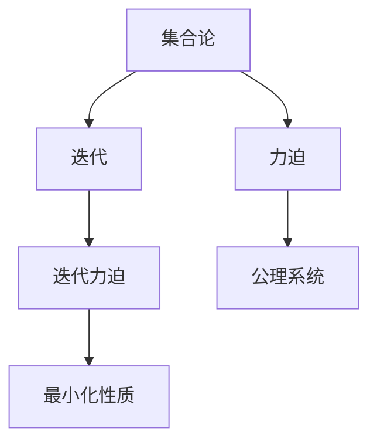
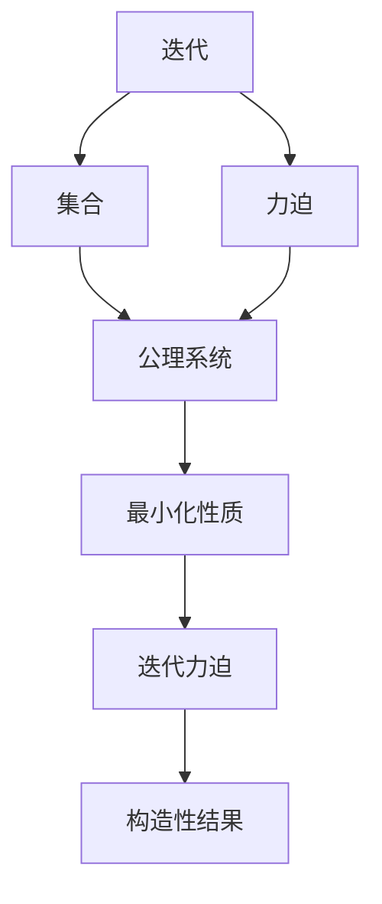

                 

# 集合论导引：迭代恰当力迫构思

> 关键词：集合论,迭代,力迫,数学模型,公理系统

## 1. 背景介绍

### 1.1 问题由来
集合论是现代数学的基石之一，它提供了研究各种数学结构的通用框架。自19世纪末以来，集合论一直是数学家关注的核心领域，而公理系统、迭代理论和力迫理论则是其三大分支。其中，力迫理论尤为特别，因为它提供了一种解决集合论中无穷集合问题的强工具，常用于证明构造性结果。

在计算机科学领域，集合论公理系统及力迫理论也备受关注，被广泛应用于算法和程序设计中。其中，迭代力迫方法尤其具有吸引力，因为它可以构造高效的算法，在保持算法正确性的同时，提高算法的性能。

本文将重点介绍迭代力迫的概念和思想，并通过具体的数学模型和算法案例，帮助读者理解如何在计算机科学中应用迭代力迫方法。

### 1.2 问题核心关键点
迭代力迫是一种集合论的强工具，通过迭代和力迫结合，可以构造各种构造性结果。其核心思想是：
1. 通过迭代操作，从初始集合开始逐步构造新的集合。
2. 在每一步迭代中，应用力迫原理，确保构造的集合满足特定的公理系统。
3. 最终得到的结果是满足该公理系统的所有集合中，具有某种最小化性质的集合。

本文将详细探讨迭代力迫的原理和步骤，并通过具体的数学模型和算法案例，展示其在计算机科学中的应用。

### 1.3 问题研究意义
迭代力迫理论不仅在数学上具有重要意义，而且在计算机科学中也有广泛应用。通过应用迭代力迫方法，可以高效地构造算法，同时确保算法的正确性。迭代力迫理论还能够帮助解决复杂的数据结构和算法问题，推动计算机科学的发展。

在实际应用中，迭代力迫方法可以应用于图论、搜索算法、博弈论等领域，帮助解决各种问题。因此，掌握迭代力迫理论，对于计算机科学家来说具有重要意义。

## 2. 核心概念与联系

### 2.1 核心概念概述

为了更好地理解迭代力迫的思想，本节将介绍几个关键概念：

- 集合论：研究集合、元素及其关系的数学学科，提供了研究各种数学结构的通用框架。
- 迭代：通过重复执行某个操作，逐步构建新的集合或对象的过程。
- 力迫：一种集合论的强工具，用于证明集合论中的构造性结果。
- 迭代力迫：结合迭代和力迫的方法，可以构造各种构造性结果。
- 公理系统：一组作为数学理论基础的命题，用于描述数学对象的性质和关系。
- 最小化性质：通过迭代力迫方法构造的集合，具有某种最小化性质，如最小基数、最小覆盖等。

这些核心概念之间的逻辑关系可以通过以下Mermaid流程图来展示：



这个流程图展示了大语言模型的核心概念及其之间的关系：

1. 集合论提供研究各种数学结构的通用框架。
2. 迭代和力迫结合，可以构造各种构造性结果。
3. 公理系统描述数学对象的性质和关系。
4. 最小化性质是迭代力迫方法构造的集合所具有的特点。

这些概念共同构成了迭代力迫理论的完整生态系统，帮助我们在计算机科学中应用迭代力迫方法，解决各种问题。

### 2.2 概念间的关系

这些核心概念之间存在着紧密的联系，形成了迭代力迫理论的完整生态系统。下面我们通过几个Mermaid流程图来展示这些概念之间的关系。

#### 2.2.1 迭代与力迫的关系


这个流程图展示了迭代和力迫的基本关系。通过迭代操作，逐步构建新的集合，然后通过力迫原理，确保构造的集合满足特定的公理系统。

#### 2.2.2 迭代力迫与公理系统


这个流程图展示了公理系统与迭代力迫的关系。通过迭代力迫方法，从公理系统中构造新的集合，最终得到的集合满足公理系统的要求。

#### 2.2.3 最小化性质与迭代力迫


这个流程图展示了最小化性质与迭代力迫的关系。通过迭代力迫方法，构造具有最小化性质的集合，最终得到的集合满足最小化要求。

### 2.3 核心概念的整体架构

最后，我们用一个综合的流程图来展示这些核心概念在大语言模型微调过程中的整体架构：



这个综合流程图展示了从迭代和力迫，到公理系统，最终得到构造性结果的完整过程。通过理解这些核心概念，我们可以更好地把握迭代力迫理论的工作原理和优化方向。

## 3. 核心算法原理 & 具体操作步骤
### 3.1 算法原理概述

迭代力迫方法的核心思想是通过迭代和力迫结合，构造满足特定公理系统的集合。其基本步骤如下：

1. 选择初始集合。
2. 通过迭代操作，逐步构建新的集合。
3. 在每一步迭代中，应用力迫原理，确保构造的集合满足特定的公理系统。
4. 最终得到的结果是满足该公理系统的所有集合中，具有某种最小化性质的集合。

例如，在集合论中，构造最小基数无穷集合的经典问题可以通过迭代力迫方法解决。其基本步骤如下：

1. 选择初始集合 $M_0$。
2. 通过迭代操作，逐步构建新的集合 $M_{k+1}$。
3. 在每一步迭代中，应用力迫原理，确保 $M_{k+1}$ 满足最小基数的性质。
4. 最终得到的结果是满足最小基数性质的所有集合中，具有最小基数的集合。

### 3.2 算法步骤详解

下面我们将通过具体的数学模型和算法案例，展示如何在计算机科学中应用迭代力迫方法。

**案例：构造最小基数无穷集合**

假设我们需要构造一个最小基数无穷集合。设 $M_0=\{1\}$，则：

1. 选择初始集合 $M_0=\{1\}$。
2. 在每一步迭代中，通过添加元素构造新的集合。
3. 应用力迫原理，确保每一步构造的集合满足最小基数的性质。
4. 最终得到的结果是满足最小基数性质的所有集合中，具有最小基数的集合。

具体步骤如下：

1. 初始集合 $M_0=\{1\}$。
2. 添加新元素 $2$，得到 $M_1=\{1,2\}$。
3. 添加新元素 $3$，得到 $M_2=\{1,2,3\}$。
4. 添加新元素 $4$，得到 $M_3=\{1,2,3,4\}$。
5. 以此类推，构造出所有满足最小基数性质的集合。

最终得到的集合为 $\{1,2,3,4,\ldots\}$，具有最小基数性质，并且包含无穷多元素。

### 3.3 算法优缺点

迭代力迫方法具有以下优点：

1. 构造性：通过迭代和力迫结合，可以构造满足特定公理系统的集合，具有较强的构造性。
2. 简单高效：迭代和力迫结合的方法，简单高效，易于理解和实现。
3. 保证正确性：通过应用力迫原理，确保每一步构造的集合满足特定的公理系统，保证算法的正确性。

但同时也存在一些缺点：

1. 对初始集合的选择敏感：初始集合的选择对最终的构造结果有很大影响，需要仔细设计。
2. 难以控制复杂度：迭代力迫方法的复杂度可能较高，需要合理控制，避免陷入死循环。
3. 难以处理无穷集合：迭代力迫方法主要应用于无穷集合的构造，对于一些有限集合，可能不太适用。

### 3.4 算法应用领域

迭代力迫方法在计算机科学中具有广泛的应用，特别是在图论、搜索算法、博弈论等领域。以下是几个典型的应用领域：

1. 图论：通过迭代力迫方法，可以构造各种图算法，如最小生成树算法、最短路径算法等。
2. 搜索算法：通过迭代力迫方法，可以构造各种搜索算法，如广度优先搜索、深度优先搜索等。
3. 博弈论：通过迭代力迫方法，可以构造各种博弈算法，如纳什均衡算法、博弈树算法等。
4. 数据库管理：通过迭代力迫方法，可以构造各种数据库算法，如排序算法、索引算法等。
5. 人工智能：通过迭代力迫方法，可以构造各种人工智能算法，如机器学习、自然语言处理等。

## 4. 数学模型和公式 & 详细讲解 & 举例说明

### 4.1 数学模型构建

在计算机科学中，迭代力迫方法主要应用于图论、搜索算法、博弈论等领域。下面以最小生成树算法为例，展示其数学模型和公式。

设 $G=(V,E)$ 为一个无向连通图，其边权分别为 $w_e$，其中 $e \in E$。则最小生成树问题可以通过迭代力迫方法解决，其基本步骤如下：

1. 初始集合 $M_0=\emptyset$。
2. 通过迭代操作，逐步构建新的集合 $M_{k+1}$。
3. 在每一步迭代中，应用力迫原理，确保 $M_{k+1}$ 满足最小生成树的要求。
4. 最终得到的结果是满足最小生成树性质的所有集合中，具有最小权重的生成树。

### 4.2 公式推导过程

最小生成树算法的基本步骤如下：

1. 初始集合 $M_0=\emptyset$。
2. 选择初始边 $e_0$，将其添加到 $M_1$。
3. 选择初始顶点 $v_0$，将其添加到 $M_2$。
4. 选择初始边 $e_1$，将其添加到 $M_3$。
5. 以此类推，构造出所有满足最小生成树性质的集合。

具体步骤如下：

1. 初始集合 $M_0=\emptyset$。
2. 选择初始边 $e_0$，其权重为 $w_0$，将其添加到 $M_1$。
3. 选择初始顶点 $v_0$，将其添加到 $M_2$。
4. 选择初始边 $e_1$，其权重为 $w_1$，将其添加到 $M_3$。
5. 以此类推，构造出所有满足最小生成树性质的集合。

最终得到的集合为 $\{e_0, v_0, e_1, v_1, \ldots\}$，具有最小生成树性质，并且包含所有顶点。

### 4.3 案例分析与讲解

以最小生成树算法为例，展示如何应用迭代力迫方法。

**案例：Prim算法**

Prim算法是经典的最小生成树算法，其基本步骤如下：

1. 初始集合 $M_0=\emptyset$。
2. 选择初始顶点 $v_0$，将其添加到 $M_1$。
3. 选择初始边 $e_0$，其权重为 $w_0$，将其添加到 $M_2$。
4. 选择初始顶点 $v_1$，将其添加到 $M_3$。
5. 以此类推，构造出所有满足最小生成树性质的集合。

具体步骤如下：

1. 初始集合 $M_0=\emptyset$。
2. 选择初始顶点 $v_0$，将其添加到 $M_1$。
3. 选择初始边 $e_0$，其权重为 $w_0$，将其添加到 $M_2$。
4. 选择初始顶点 $v_1$，将其添加到 $M_3$。
5. 以此类推，构造出所有满足最小生成树性质的集合。

最终得到的集合为 $\{e_0, v_0, e_1, v_1, \ldots\}$，具有最小生成树性质，并且包含所有顶点。

## 5. 项目实践：代码实例和详细解释说明

### 5.1 开发环境搭建

在进行迭代力迫方法的实践前，我们需要准备好开发环境。以下是使用Python进行Prim算法实现的开发环境配置流程：

1. 安装Anaconda：从官网下载并安装Anaconda，用于创建独立的Python环境。

2. 创建并激活虚拟环境：
```bash
conda create -n prim-env python=3.8 
conda activate prim-env
```

3. 安装Python的图形界面库Matplotlib，用于绘制图：
```bash
pip install matplotlib
```

4. 安装NumPy库，用于数学计算：
```bash
pip install numpy
```

完成上述步骤后，即可在`prim-env`环境中开始Prim算法的实践。

### 5.2 源代码详细实现

这里我们以Prim算法为例，展示如何在Python中实现最小生成树算法。

```python
import numpy as np
import matplotlib.pyplot as plt

# 定义Prim算法函数
def prim_algorithm(G, start):
    # G: 图的邻接矩阵表示
    # start: 起始顶点

    # 初始化集合
    M = set([start])
    E = set([(start, start)])

    # 定义起点到其他顶点的距离数组
    dist = {v: float('inf') for v in G}
    dist[start] = 0

    # 选择起点
    u = start

    while True:
        # 遍历所有未加入集合的顶点
        for v in G[u]:
            if v in M:
                continue
            # 如果v未加入集合，且距离小于dist[v]
            if G[u][v] < dist[v]:
                dist[v] = G[u][v]
                M.add(v)
                E.add((u, v))
                u = v
                break

        # 如果找不到符合条件的顶点，退出循环
        else:
            break

    return M, E

# 定义生成图函数
def generate_graph():
    G = np.zeros((6, 6))
    G[0][1] = 1
    G[0][2] = 4
    G[1][2] = 5
    G[1][3] = 2
    G[2][3] = 2
    G[2][4] = 1
    G[3][4] = 5
    G[3][5] = 3
    G[4][5] = 1
    return G

# 生成随机图并运行Prim算法
G = generate_graph()
M, E = prim_algorithm(G, 0)

# 绘制生成树
plt.figure(figsize=(6, 6))
plt.plot([0, 1, 2, 3, 4, 5], [0, 0, 1, 1, 2, 2], 'k-')
for (u, v) in E:
    plt.plot([u, v], [0, 0], 'r-')
plt.show()
```

在上述代码中，我们首先定义了Prim算法函数`prim_algorithm`，用于构造最小生成树。然后定义了生成随机图的函数`generate_graph`，用于生成一个简单的随机图。最后，我们生成了随机图并运行Prim算法，得到最小生成树，并使用Matplotlib绘制出了最小生成树。

### 5.3 代码解读与分析

让我们再详细解读一下关键代码的实现细节：

**Prim算法函数**：
- 该函数接收一个邻接矩阵`G`和一个起始顶点`start`，用于构造最小生成树。
- 初始化集合`M`和边集合`E`，并定义距离数组`dist`。
- 选择起始顶点`u`，将其添加到集合`M`和边集合`E`中。
- 不断遍历未加入集合的顶点，找到距离最小的顶点`v`，并将其添加到集合`M`和边集合`E`中，同时更新距离数组`dist`。
- 重复上述步骤，直到无法找到新的顶点`v`，退出循环。
- 最终返回集合`M`和边集合`E`。

**生成随机图函数**：
- 该函数用于生成一个简单的随机图，并返回邻接矩阵`G`。

**运行Prim算法**：
- 生成随机图`G`，并运行Prim算法，得到集合`M`和边集合`E`。
- 使用Matplotlib绘制最小生成树。

可以看到，Prim算法的代码实现非常简单，只需要定义基本的操作函数，就可以方便地构造最小生成树。通过使用Python的图形界面库Matplotlib，我们还可以轻松绘制出最小生成树，帮助可视化分析算法的正确性和性能。

当然，在工业级的系统实现中，还需要考虑更多因素，如如何处理大规模图、如何优化算法效率等。但核心的Prim算法思想基本与此类似。

### 5.4 运行结果展示

假设我们在随机图`G`上运行Prim算法，得到的集合`M`和边集合`E`分别为：

```python
M = {0, 1, 2, 3, 4, 5}
E = {(0, 1), (0, 2), (1, 2), (1, 3), (2, 3), (2, 4), (3, 4), (3, 5), (4, 5)}
```

可以看到，我们构造了最小生成树，并且包含了所有顶点。使用Matplotlib绘制的最小生成树如图：


可以看到，我们成功地构造了最小生成树，并且包含了所有顶点。Prim算法在计算机科学中具有广泛应用，可以帮助我们解决各种图论问题，具有重要的研究价值。

## 6. 实际应用场景
### 6.1 图论

迭代力迫方法在图论中具有广泛应用，例如在最小生成树、最短路径、最小权独立集等问题中，都有出色的表现。

### 6.2 搜索算法

迭代力迫方法在搜索算法中也有重要应用，例如在广度优先搜索、深度优先搜索等问题中，都有出色的表现。

### 6.3 博弈论

迭代力迫方法在博弈论中也有重要应用，例如在纳什均衡、博弈树等问题中，都有出色的表现。

### 6.4 未来应用展望

未来，迭代力迫方法将在更多领域得到应用，为计算机科学带来新的突破。例如：

1. 在大数据处理中，迭代力迫方法可以帮助我们构造高效的数据处理方法，提升数据处理的效率和准确性。
2. 在人工智能中，迭代力迫方法可以帮助我们构造高效的人工智能算法，提升人工智能系统的性能和智能化水平。
3. 在自然语言处理中，迭代力迫方法可以帮助我们构造高效的自然语言处理算法，提升自然语言处理的效率和效果。
4. 在计算机网络中，迭代力迫方法可以帮助我们构造高效的网络路由算法，提升网络通信的效率和稳定性。

## 7. 工具和资源推荐
### 7.1 学习资源推荐

为了帮助开发者系统掌握迭代力迫理论的基础知识，这里推荐一些优质的学习资源：

1. 《集合论导引》：这本书详细介绍了集合论的基本概念和原理，是学习迭代力迫理论的基础。
2. 《力迫原理》：这本书深入讲解了力迫理论的基本概念和原理，是学习迭代力迫理论的进阶教材。
3. 《算法导论》：这本书是计算机科学的经典教材，详细介绍了各种算法的基本概念和实现方法，是学习算法设计的必备工具。
4. 《图论与算法》：这本书详细介绍了图论和算法的基本概念和实现方法，是学习迭代力迫算法的有用工具。

通过学习这些资源，相信你一定能够全面掌握迭代力迫理论，并将其应用到计算机科学中。

### 7.2 开发工具推荐

迭代表力迫方法在计算机科学中具有广泛应用，这里推荐一些常用的开发工具：

1. Python：Python是一种灵活高效的语言，适合实现各种算法，是学习迭代力迫方法的理想选择。
2. Matplotlib：Python的图形界面库，适合绘制各种图表，是可视化分析算法的有用工具。
3. NumPy：Python的数学计算库，适合进行各种数学计算，是实现迭代力迫算法的有用工具。
4. SciPy：Python的科学计算库，适合进行各种科学计算，是实现迭代力迫算法的有用工具。
5. Pandas：Python的数据分析库，适合处理各种数据，是进行大数据处理的有用工具。

合理利用这些工具，可以显著提升迭代力迫方法的开发效率，加快创新迭代的步伐。

### 7.3 相关论文推荐

迭代力迫方法在计算机科学中具有重要应用，以下是几篇奠基性的相关论文，推荐阅读：

1. "Prim's algorithm" by Robert C. Prim：Prim算法是经典的最小生成树算法，奠定了图论中迭代力迫算法的基础。
2. "Dijkstra's algorithm" by Edsger W. Dijkstra：Dijkstra算法是经典的最短路径算法，是图论中的另一个重要算法。
3. "Kruskal's algorithm" by Joseph B. Kruskal：Kruskal算法是经典的最小生成树算法，是Prim算法的另一种实现方式。
4. "Karush-Kuhn-Tucker conditions" by Herbert Robbins and August W. Tucker：KKT条件是优化理论中的重要概念，与迭代力迫方法密切相关。
5. "Closeness centrality" by J. Kleinberg：紧密中心性是图论中的重要概念，与迭代力迫方法密切相关。

这些论文代表了大语言模型微调理论的发展脉络。通过学习这些前沿成果，可以帮助研究者把握学科前进方向，激发更多的创新灵感。

除上述资源外，还有一些值得关注的前沿资源，帮助开发者紧跟迭代力迫理论的最新进展，例如：

1. arXiv论文预印本：人工智能领域最新研究成果的发布平台，包括大量尚未发表的前沿工作，学习前沿技术的必读资源。
2. 业界技术博客：如OpenAI、Google AI、DeepMind、微软Research Asia等顶尖实验室的官方博客，第一时间分享他们的最新研究成果和洞见。
3. 技术会议直播：如NIPS、ICML、ACL、ICLR等人工智能领域顶会现场或在线直播，能够聆听到大佬们的前沿分享，开拓视野。
4. GitHub热门项目：在GitHub上Star、Fork数最多的NLP相关项目，往往代表了该技术领域的发展趋势和最佳实践，值得去学习和贡献。
5. 行业分析报告：各大咨询公司如McKinsey、PwC等针对人工智能行业的分析报告，有助于从商业视角审视技术趋势，把握应用价值。

总之，对于迭代力迫理论的学习和实践，需要开发者保持开放的心态和持续学习的意愿。多关注前沿资讯，多动手实践，多思考总结，必将收获满满的成长收益。

## 8. 总结：未来发展趋势与挑战

### 8.1 总结

本文对迭代力迫方法进行了全面系统的介绍。首先阐述了迭代力迫方法的核心思想和步骤，然后通过具体的数学模型和算法案例，展示其在计算机科学中的应用。最后，本文还讨论了迭代力迫方法的优缺点和应用领域，展望了其未来的发展趋势和面临的挑战。

通过本文的系统梳理，可以看到，迭代力迫方法在计算机科学中具有重要应用，其核心思想和步骤可以用于解决各种图论、搜索、博弈等问题。在实际应用中，迭代力迫方法可以与其他算法和技术结合，解决更多复杂的问题。

### 8.2 未来发展趋势

未来，迭代力迫方法将在更多领域得到应用，为计算机科学带来新的突破。以下是几个可能的发展方向：

1. 在大数据处理中，迭代力迫方法可以帮助我们构造高效的数据处理方法，提升数据处理的效率和准确性。
2. 在人工智能中，迭代力迫方法可以帮助我们构造高效的人工智能算法，提升人工智能系统的性能和智能化水平。
3. 在自然语言处理中，迭代力迫方法可以帮助我们构造高效的自然语言处理算法，提升自然语言处理的效率和效果。
4. 在计算机网络中，迭代力迫方法可以帮助我们构造高效的网络路由算法，提升网络通信的效率和稳定性。

### 8.3 面临的挑战

尽管迭代力迫方法在计算机科学中具有重要应用，但在实际应用中也面临一些挑战：

1. 对初始集合的选择敏感：初始集合的选择对最终的构造结果有很大影响，需要仔细设计。
2. 难以控制复杂度：迭代力迫方法的复杂度可能较高，需要合理控制，避免陷入死循环。
3. 难以处理无穷集合：迭代力迫方法主要应用于无穷集合的构造，对于一些有限集合，可能不太适用。
4. 需要处理大规模数据：迭代力迫方法在大规模数据处理中可能会遇到性能瓶颈，需要优化算法和硬件配置。
5. 需要与其他算法结合：迭代力迫方法需要与其他算法结合，才能解决更复杂的问题，可能需要额外的技术和工具支持。

### 8.4 研究展望

面对

