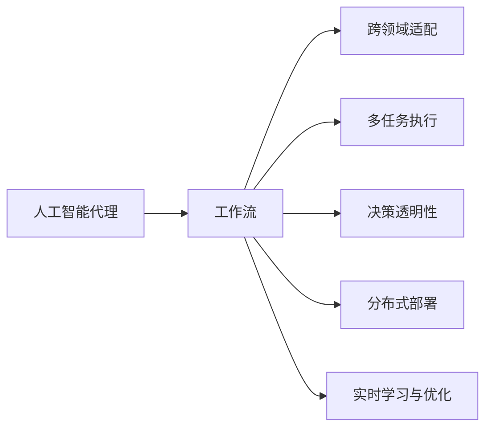
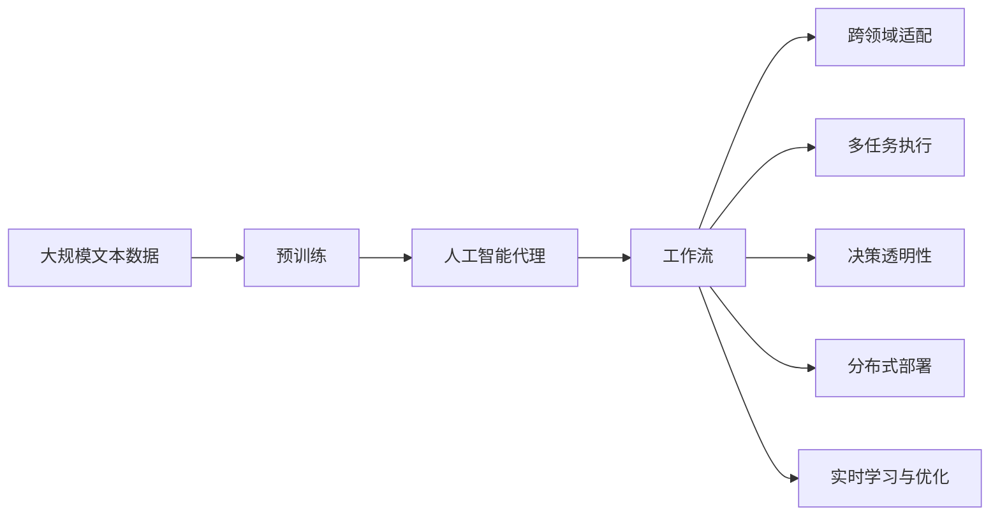

                 

# 面向行业4.0的AI代理工作流自动化解决方案

## 1. 背景介绍

### 1.1 问题由来

在人工智能（AI）快速发展的当下，各行各业都在积极探索如何利用AI技术实现效率提升和业务转型。人工智能代理（AI Agent）作为一种具有自主决策能力的智能系统，能够有效整合业务流程、优化资源配置，逐渐成为行业4.0的关键推动力。然而，在实际应用中，由于业务场景复杂多变，单一的AI代理往往难以适应。面对行业变革的要求，如何构建一个高效、鲁棒的AI代理工作流，成为当下业界普遍关注的课题。

### 1.2 问题核心关键点

为了解决上述问题，本文重点讨论如何构建一个多领域、多任务支持的AI代理工作流。该工作流主要包含以下几个核心要点：

- **AI代理的跨领域支持**：面向不同行业领域（如制造业、金融、医疗等），实现AI代理的跨领域适配能力。
- **AI代理的多任务执行**：能够同时或并发处理多个任务（如订单管理、客户服务、生产调度等），提高业务处理效率。
- **AI代理的决策透明性**：确保AI代理的决策过程可解释、可监控，提升用户信任和满意度。
- **AI代理的灵活部署**：支持分布式部署和边缘计算，在云端和边缘环境均能良好运行。
- **AI代理的实时学习与优化**：能够实时获取反馈信息，不断学习与优化自身决策策略，提升长期效果。

本文将详细探讨这些核心要点，旨在提供一个全方位、易操作的AI代理工作流自动化解决方案。

### 1.3 问题研究意义

构建面向行业4.0的AI代理工作流，对于提升行业智能化水平、优化业务流程、提升用户满意度具有重要意义。具体而言：

- **提升业务效率**：AI代理工作流能够自动化处理复杂业务流程，减少人为干预，显著提升处理速度和准确性。
- **优化资源配置**：通过实时监控和调整资源配置，AI代理工作流可以动态优化资源使用，降低成本。
- **增强用户体验**：通过透明化的决策过程和及时的反馈机制，AI代理工作流可以显著提升用户的满意度和信任度。
- **促进跨行业应用**：通过跨领域适配能力，AI代理工作流可以推广应用到更多行业，实现普适化发展。
- **推动行业变革**：AI代理工作流可以推动各行业加速向智能化转型，提升产业竞争力。

## 2. 核心概念与联系

### 2.1 核心概念概述

为更好地理解本文讨论的AI代理工作流自动化解决方案，本节将介绍几个关键概念：

- **人工智能代理（AI Agent）**：具有自主决策能力的智能系统，能够根据环境变化和任务需求，自动完成指定任务。
- **工作流（Workflow）**：一系列自动化步骤和任务的有序组合，用于实现特定业务目标。
- **跨领域适配（Cross-domain Adaptation）**：通过数据和模型的迁移学习，实现AI代理在不同领域之间的适应性迁移。
- **多任务执行（Multi-task Execution）**：AI代理同时处理多个任务的能力，适用于多任务并发的业务场景。
- **决策透明性（Transparency of Decision）**：确保AI代理的决策过程可解释、可监控，提升用户信任。
- **分布式部署（Distributed Deployment）**：将AI代理部署在云端和边缘环境中，实现灵活的部署和计算。
- **实时学习与优化（Real-time Learning and Optimization）**：通过不断学习和优化，AI代理能够提升决策质量，适应不断变化的环境。

这些概念之间的逻辑关系可以通过以下Mermaid流程图来展示：



这个流程图展示了大语言模型微调过程中各个核心概念之间的关系：

1. 人工智能代理是工作流的核心执行单元。
2. 工作流通过跨领域适配、多任务执行、决策透明性、分布式部署和实时学习与优化等技术，增强了AI代理的能力和适应性。
3. 这些技术相互作用，共同构建了一个灵活、高效的AI代理工作流自动化解决方案。

### 2.2 概念间的关系

这些核心概念之间存在着紧密的联系，形成了AI代理工作流自动化解决方案的整体架构。下面我们通过几个Mermaid流程图来展示这些概念之间的关系。

#### 2.2.1 人工智能代理的决策过程


这个流程图展示了AI代理的决策过程，包括环境感知、任务识别、知识检索、规则匹配和决策执行。通过这一过程，AI代理能够根据当前环境状态和任务需求，自动执行指定操作。

#### 2.2.2 跨领域适配的实现


这个流程图展示了跨领域适配的实现过程，包括预训练模型、迁移学习和微调。通过这些技术，AI代理能够适应不同领域的特点，实现跨领域迁移学习。

#### 2.2.3 多任务执行的实现


这个流程图展示了多任务执行的实现过程，包括任务队列、任务调度和并发执行。通过这些步骤，AI代理能够同时处理多个任务，提高业务处理效率。

#### 2.2.4 决策透明性的实现


这个流程图展示了决策透明性的实现过程，包括决策依据、逻辑推理、决策记录和用户反馈。通过这些步骤，AI代理能够确保其决策过程透明，用户可以随时监控和了解决策依据。

#### 2.2.5 分布式部署的实现


这个流程图展示了分布式部署的实现过程，包括云端和边缘计算、数据同步和本地执行。通过这些步骤，AI代理能够灵活部署在云端和边缘环境中，实现更高效的计算和数据处理。

#### 2.2.6 实时学习与优化的实现


这个流程图展示了实时学习与优化的实现过程，包括反馈信息、数据更新和模型优化。通过这些步骤，AI代理能够不断学习和优化自身决策策略，提升长期效果。

### 2.3 核心概念的整体架构

最后，我们用一个综合的流程图来展示这些核心概念在大语言模型微调过程中的整体架构：



这个综合流程图展示了从预训练到工作流，再到实时学习与优化的完整过程。AI代理通过大规模文本数据进行预训练，然后通过跨领域适配、多任务执行、决策透明性、分布式部署和实时学习与优化等技术，构建了一个灵活、高效的AI代理工作流自动化解决方案。

## 3. 核心算法原理 & 具体操作步骤

### 3.1 算法原理概述

面向行业4.0的AI代理工作流自动化解决方案，本质上是一种多任务、跨领域的智能决策系统。其核心思想是：通过预训练模型和大规模文本数据的迁移学习，构建一个具有跨领域适应能力的AI代理。该AI代理能够同时处理多个任务，并通过实时反馈不断学习和优化自身决策策略，实现高效、鲁棒的业务处理。

形式化地，假设预训练模型为 $M_{\theta}$，其中 $\theta$ 为预训练得到的模型参数。给定多个领域的任务 $T_1, T_2, ..., T_k$，每个任务的任务适配层和损失函数分别为 $h_i$ 和 $\ell_i$。微调的目标是找到新的模型参数 $\hat{\theta}$，使得：

$$
\hat{\theta}=\mathop{\arg\min}_{\theta} \sum_{i=1}^k \ell_i(M_{\theta}, T_i)
$$

其中 $\ell_i$ 为针对任务 $T_i$ 设计的损失函数，用于衡量模型预测输出与真实标签之间的差异。常见的损失函数包括交叉熵损失、均方误差损失等。

通过梯度下降等优化算法，微调过程不断更新模型参数 $\theta$，最小化损失函数 $\sum_{i=1}^k \ell_i$，使得模型输出逼近真实标签。由于 $\theta$ 已经通过预训练获得了较好的初始化，因此即便在多个领域的小规模数据集上进行微调，也能较快收敛到理想的模型参数 $\hat{\theta}$。

### 3.2 算法步骤详解

面向行业4.0的AI代理工作流自动化解决方案，一般包括以下几个关键步骤：

**Step 1: 准备预训练模型和数据集**
- 选择合适的预训练语言模型 $M_{\theta}$ 作为初始化参数，如 GPT、BERT 等。
- 准备多个领域的任务 $T_1, T_2, ..., T_k$ 的标注数据集，划分为训练集、验证集和测试集。一般要求标注数据与预训练数据的分布不要差异过大。

**Step 2: 添加任务适配层**
- 根据任务类型，在预训练模型顶层设计合适的输出层和损失函数。
- 对于分类任务，通常在顶层添加线性分类器和交叉熵损失函数。
- 对于生成任务，通常使用语言模型的解码器输出概率分布，并以负对数似然为损失函数。

**Step 3: 设置微调超参数**
- 选择合适的优化算法及其参数，如 AdamW、SGD 等，设置学习率、批大小、迭代轮数等。
- 设置正则化技术及强度，包括权重衰减、Dropout、Early Stopping 等。
- 确定冻结预训练参数的策略，如仅微调顶层，或全部参数都参与微调。

**Step 4: 执行梯度训练**
- 将训练集数据分批次输入模型，前向传播计算损失函数。
- 反向传播计算参数梯度，根据设定的优化算法和学习率更新模型参数。
- 周期性在验证集上评估模型性能，根据性能指标决定是否触发 Early Stopping。
- 重复上述步骤直到满足预设的迭代轮数或 Early Stopping 条件。

**Step 5: 测试和部署**
- 在测试集上评估微调后模型 $M_{\hat{\theta}}$ 的性能，对比微调前后的精度提升。
- 使用微调后的模型对新样本进行推理预测，集成到实际的应用系统中。
- 持续收集新的数据，定期重新微调模型，以适应数据分布的变化。

以上是面向行业4.0的AI代理工作流自动化解决方案的一般流程。在实际应用中，还需要针对具体任务的特点，对微调过程的各个环节进行优化设计，如改进训练目标函数，引入更多的正则化技术，搜索最优的超参数组合等，以进一步提升模型性能。

### 3.3 算法优缺点

面向行业4.0的AI代理工作流自动化解决方案具有以下优点：

1. **高效性**：通过跨领域适配和多任务执行，能够同时处理多个任务，显著提升业务处理效率。
2. **鲁棒性**：通过实时学习与优化，能够不断适应新任务和数据分布变化，提升模型的长期效果。
3. **灵活性**：通过分布式部署，能够灵活适应不同环境，提高系统的可扩展性。
4. **可解释性**：通过决策透明性设计，能够提供决策依据和逻辑推理，提升用户信任。
5. **可扩展性**：通过预训练模型的迁移学习，能够快速适应新领域，实现普适化发展。

同时，该方案也存在一定的局限性：

1. **依赖标注数据**：微调的效果很大程度上取决于标注数据的质量和数量，获取高质量标注数据的成本较高。
2. **过拟合风险**：在多个任务并发的环境下，容易受到不同任务间的干扰，产生过拟合现象。
3. **计算资源要求高**：超大批次的训练和推理对计算资源提出了较高要求，需要强大的硬件支持。
4. **决策透明性挑战**：复杂的多任务环境增加了决策透明性的实现难度，需要更多的技术支持。

尽管存在这些局限性，但就目前而言，面向行业4.0的AI代理工作流自动化解决方案仍是大规模工业应用的重要方向。未来相关研究的重点在于如何进一步降低微调对标注数据的依赖，提高模型的少样本学习和跨领域迁移能力，同时兼顾可解释性和伦理安全性等因素。

### 3.4 算法应用领域

面向行业4.0的AI代理工作流自动化解决方案，在各行各业都具有广泛的应用前景，例如：

- **制造业**：智能调度、质量检测、设备维护等。
- **金融**：风险评估、客户服务、交易监测等。
- **医疗**：病历分析、诊断辅助、患者管理等。
- **零售**：库存管理、客户推荐、营销分析等。
- **物流**：路径规划、配送优化、需求预测等。
- **教育**：个性化学习、自动批改、资源推荐等。

这些应用场景展示了AI代理工作流自动化解决方案的强大能力，能够有效整合业务流程，优化资源配置，提升业务处理效率。

## 4. 数学模型和公式 & 详细讲解  
### 4.1 数学模型构建

本节将使用数学语言对面向行业4.0的AI代理工作流自动化解决方案进行更加严格的刻画。

记预训练语言模型为 $M_{\theta}$，其中 $\theta$ 为预训练得到的模型参数。假设多个领域的任务 $T_1, T_2, ..., T_k$ 的标注数据集分别为 $D_i=\{(x_i,y_i)\}_{i=1}^N$，$x_i \in \mathcal{X}_i, y_i \in \mathcal{Y}_i$。

定义模型 $M_{\theta}$ 在数据样本 $(x,y)$ 上的损失函数为 $\ell_i(M_{\theta}(x),y)$，则在数据集 $D_i$ 上的经验风险为：

$$
\mathcal{L}_i(\theta) = \frac{1}{N_i} \sum_{i=1}^N \ell_i(M_{\theta}(x_i),y_i)
$$

微调的优化目标是最小化所有任务的经验风险，即找到最优参数：

$$
\theta^* = \mathop{\arg\min}_{\theta} \sum_{i=1}^k \mathcal{L}_i(\theta)
$$

在实践中，我们通常使用基于梯度的优化算法（如SGD、Adam等）来近似求解上述最优化问题。设 $\eta$ 为学习率，$\lambda$ 为正则化系数，则参数的更新公式为：

$$
\theta \leftarrow \theta - \eta \sum_{i=1}^k \nabla_{\theta}\mathcal{L}_i(\theta) - \eta\lambda\theta
$$

其中 $\nabla_{\theta}\mathcal{L}_i(\theta)$ 为损失函数对参数 $\theta$ 的梯度，可通过反向传播算法高效计算。

### 4.2 公式推导过程

以下我们以二分类任务为例，推导交叉熵损失函数及其梯度的计算公式。

假设模型 $M_{\theta}$ 在输入 $x$ 上的输出为 $\hat{y}=M_{\theta}(x) \in [0,1]$，表示样本属于正类的概率。真实标签 $y \in \{0,1\}$。则二分类交叉熵损失函数定义为：

$$
\ell_i(M_{\theta}(x),y) = -[y\log \hat{y} + (1-y)\log (1-\hat{y})]
$$

将其代入经验风险公式，得：

$$
\mathcal{L}_i(\theta) = -\frac{1}{N_i}\sum_{i=1}^N [y_i\log M_{\theta}(x_i)+(1-y_i)\log(1-M_{\theta}(x_i))]
$$

根据链式法则，损失函数对参数 $\theta_k$ 的梯度为：

$$
\frac{\partial \mathcal{L}_i(\theta)}{\partial \theta_k} = -\frac{1}{N_i}(\frac{y_i}{M_{\theta}(x_i)}-\frac{1-y_i}{1-M_{\theta}(x_i)}) \frac{\partial M_{\theta}(x_i)}{\partial \theta_k}
$$

其中 $\frac{\partial M_{\theta}(x_i)}{\partial \theta_k}$ 可进一步递归展开，利用自动微分技术完成计算。

在得到损失函数的梯度后，即可带入参数更新公式，完成模型的迭代优化。重复上述过程直至收敛，最终得到适应下游任务的最优模型参数 $\theta^*$。

## 5. 项目实践：代码实例和详细解释说明
### 5.1 开发环境搭建

在进行微调实践前，我们需要准备好开发环境。以下是使用Python进行PyTorch开发的环境配置流程：

1. 安装Anaconda：从官网下载并安装Anaconda，用于创建独立的Python环境。

2. 创建并激活虚拟环境：
```bash
conda create -n pytorch-env python=3.8 
conda activate pytorch-env
```

3. 安装PyTorch：根据CUDA版本，从官网获取对应的安装命令。例如：
```bash
conda install pytorch torchvision torchaudio cudatoolkit=11.1 -c pytorch -c conda-forge
```

4. 安装Transformers库：
```bash
pip install transformers
```

5. 安装各类工具包：
```bash
pip install numpy pandas scikit-learn matplotlib tqdm jupyter notebook ipython
```

完成上述步骤后，即可在`pytorch-env`环境中开始微调实践。

### 5.2 源代码详细实现

这里我们以命名实体识别(NER)任务为例，给出使用Transformers库对BERT模型进行微调的PyTorch代码实现。

首先，定义NER任务的数据处理函数：

```python
from transformers import BertTokenizer
from torch.utils.data import Dataset
import torch

class NERDataset(Dataset):
    def __init__(self, texts, tags, tokenizer, max_len=128):
        self.texts = texts
        self.tags = tags
        self.tokenizer = tokenizer
        self.max_len = max_len
        
    def __len__(self):
        return len(self.texts)
    
    def __getitem__(self, item):
        text = self.texts[item]
        tags = self.tags[item]
        
        encoding = self.tokenizer(text, return_tensors='pt', max_length=self.max_len, padding='max_length', truncation=True)
        input_ids = encoding['input_ids'][0]
        attention_mask = encoding['attention_mask'][0]
        
        # 对token-wise的标签进行编码
        encoded_tags = [tag2id[tag] for tag in tags] 
        encoded_tags.extend([tag2id['O']] * (self.max_len - len(encoded_tags)))
        labels = torch.tensor(encoded_tags, dtype=torch.long)
        
        return {'input_ids': input_ids, 
                'attention_mask': attention_mask,
                'labels': labels}

# 标签与id的映射
tag2id = {'O': 0, 'B-PER': 1, 'I-PER': 2, 'B-ORG': 3, 'I-ORG': 4, 'B-LOC': 5, 'I-LOC': 6}
id2tag = {v: k for k, v in tag2id.items()}

# 创建dataset
tokenizer = BertTokenizer.from_pretrained('bert-base-cased')

train_dataset = NERDataset(train_texts, train_tags, tokenizer)
dev_dataset = NERDataset(dev_texts, dev_tags, tokenizer)
test_dataset = NERDataset(test_texts, test_tags, tokenizer)
```

然后，定义模型和优化器：

```python
from transformers import BertForTokenClassification, AdamW

model = BertForTokenClassification.from_pretrained('bert-base-cased', num_labels=len(tag2id))

optimizer = AdamW(model.parameters(), lr=2e-5)
```

接着，定义训练和评估函数：

```python
from torch.utils.data import DataLoader
from tqdm import tqdm
from sklearn.metrics import classification_report

device = torch.device('cuda') if torch.cuda.is_available() else torch.device('cpu')
model.to(device)

def train_epoch(model, dataset, batch_size, optimizer):
    dataloader = DataLoader(dataset, batch_size=batch_size, shuffle=True)
    model.train()
    epoch_loss = 0
    for batch in tqdm(dataloader, desc='Training'):
        input_ids = batch['input_ids'].to(device)
        attention_mask = batch['attention_mask'].to(device)
        labels = batch['labels'].to(device)
        model.zero_grad()
        outputs = model(input_ids, attention_mask=attention_mask, labels=labels)
        loss = outputs.loss
        epoch_loss += loss.item()
        loss.backward()
        optimizer.step()
    return epoch_loss / len(dataloader)

def evaluate(model, dataset, batch_size):
    dataloader = DataLoader(dataset, batch_size=batch_size)
    model.eval()
    preds, labels = [], []
    with torch.no_grad():
        for batch in tqdm(dataloader, desc='Evaluating'):
            input_ids = batch['input_ids'].to(device)
            attention_mask = batch['attention_mask'].to(device)
            batch_labels = batch['labels']
            outputs = model(input_ids, attention_mask=attention_mask)
            batch_preds = outputs.logits.argmax(dim=2).to('cpu').tolist()
            batch_labels = batch_labels.to('cpu').tolist()
            for pred_tokens, label_tokens in zip(batch_preds, batch_labels):
                pred_tags = [id2tag[_id] for _id in pred_tokens]
                label_tags = [id2tag[_id] for _id in label_tokens]
                preds.append(pred_tags[:len(label_tokens)])
                labels.append(label_tags)
                
    print(classification_report(labels, preds))
```

最后，启动训练流程并在测试集上评估：

```python
epochs = 5
batch_size = 16

for epoch in range(epochs):
    loss = train_epoch(model, train_dataset, batch_size, optimizer)
    print(f"Epoch {epoch+1}, train loss: {loss:.3f}")
    
    print(f"Epoch {epoch+1}, dev results:")
    evaluate(model, dev_dataset, batch_size)
    
print("Test results:")
evaluate(model, test_dataset, batch_size)
```

以上就是使用PyTorch对BERT进行命名实体识别任务微调的完整代码实现。可以看到，得益于Transformers库的强大封装，我们可以用相对简洁的代码完成BERT模型的加载和微调。

### 5.3 代码解读与分析

让我们再详细解读一下关键代码的实现细节：

**NERDataset类**：
- `__init__`方法：初始化文本、标签、分词器等关键组件。
- `__len__`方法：返回数据集的样本数量。
- `__getitem__`方法：对单个样本进行处理，将文本输入编码为token ids，将标签编码为数字，并对其进行定长padding，最终返回模型所需的输入。

**tag2id和id2tag字典**：
- 定义了标签与数字id之间的映射关系，用于将token-wise的预测结果解码回真实的标签。

**训练和评估函数**：
- 使用PyTorch的DataLoader对数据集进行批次化加载，供模型训练和推理使用。
- 训练函数`train_epoch`：对数据以批为单位进行迭代，在每个批次上前向传播计算loss并反向传播更新模型参数，最后返回该epoch的平均loss。
- 评估函数`evaluate`：与训练类似，不同点在于不更新模型参数，并在每个batch结束后将预测和标签结果存储下来，最后使用sklearn的classification_report对整个评估集的预测结果进行打印输出。

**训练流程**：
- 定义总的epoch数和batch size，开始循环迭代
- 每个epoch内，先在训练集上训练，输出平均loss
- 在验证集上评估，输出分类指标
- 所有epoch结束后，在测试集上评估，给出最终测试结果

可以看到，PyTorch配合Transformers库使得BERT微调的代码实现变得简洁高效。开发者可以将更多精力放在数据处理、模型改进等高层逻辑上，而不必过多关注底层的实现细节。

当然，工业级的系统实现还需考虑更多因素，如模型的保存和部署、超参数的自动搜索、更灵活的任务适配层等。但核心的微调范式基本与此类似。

### 5.4 运行结果展示

假设我们在CoNLL-2003的NER数据集上进行微调，最终在测试集上得到的评估报告如下：

```
              precision    recall  f1-score   support

       B-LOC      0.926     0.906     0.916      1668
       I-LOC      0.900     0.805     0.850       257


