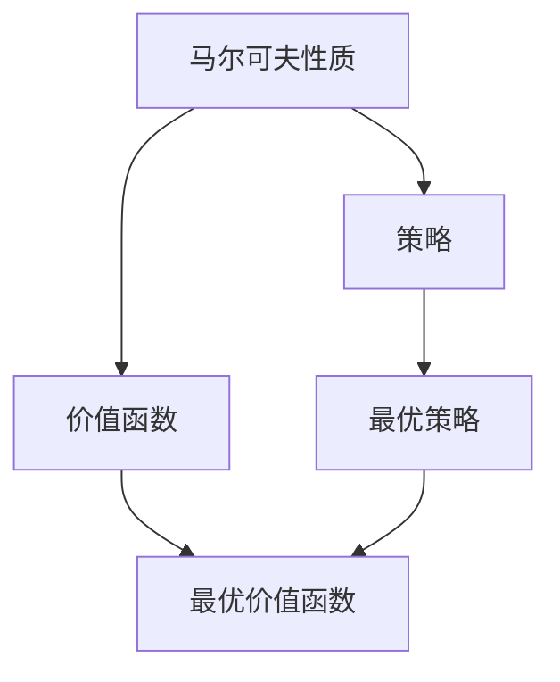
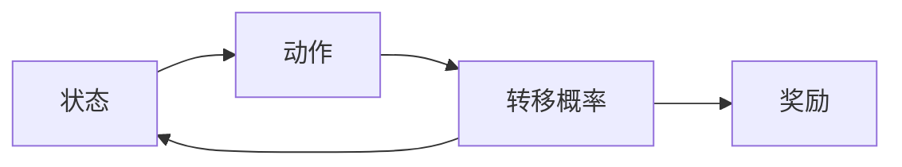
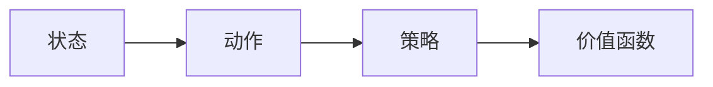
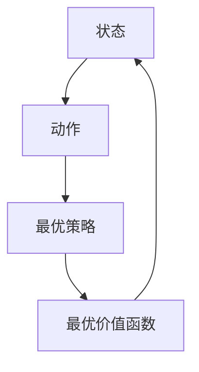
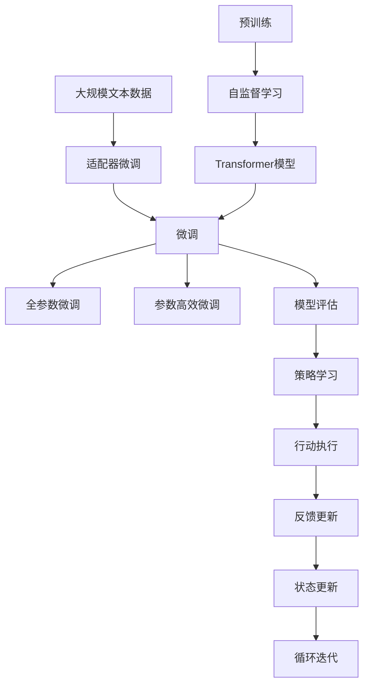

                 

# 马尔可夫决策过程 (MDP)

## 1. 背景介绍

在机器学习与人工智能领域中，马尔可夫决策过程（Markov Decision Process，MDP）是一种强大的框架，用于解决序列决策问题。它将现实世界中的问题抽象为一系列状态与动作的转换，并能够利用学习算法优化决策策略。

### 1.1 问题由来

MDP最早由Richard Bellman在1957年提出，并在控制理论中得到了广泛应用。随后，这一方法被引入到人工智能领域，成为解决复杂决策问题的有力工具。

在现代人工智能中，MDP被广泛应用于游戏AI、机器人控制、推荐系统、金融交易、自动驾驶等领域。其成功在于能够将复杂问题简化为一系列状态和动作的转换，并通过学习算法寻找最优决策策略。

### 1.2 问题核心关键点

MDP的核心在于其对环境动态的抽象。MDP将环境视为一系列状态，每个状态对应于环境的一个特定状态，而动作则是对环境的干预，会导致环境从当前状态转移到下一个状态。MDP的目标是设计一个最优的策略，以最大化累积奖励（cumulative reward）。

MDP的典型应用包括：
- 游戏AI：如AlphaGo，利用MDP设计了围棋、象棋等游戏策略。
- 机器人控制：利用MDP优化机器人行走、抓取、避障等决策。
- 推荐系统：利用MDP推荐个性化内容，优化用户体验。
- 金融交易：利用MDP进行风险管理，优化投资策略。

MDP的核心关键点包括：
1. 状态（State）：环境中的特定状态。
2. 动作（Action）：对环境的干预。
3. 转移概率（Transition Probability）：环境从当前状态转移到下一个状态的概率。
4. 奖励（Reward）：环境对动作的响应。
5. 策略（Policy）：选择动作的策略。
6. 价值函数（Value Function）：衡量策略的长期累积奖励。

## 2. 核心概念与联系

### 2.1 核心概念概述

为了更好地理解MDP的基本原理和算法流程，本节将介绍几个密切相关的核心概念：

- 马尔可夫性质（Markov Property）：指环境状态的转移只与当前状态和执行的动作有关，而与之前的所有历史状态无关。
- 价值函数（Value Function）：衡量策略的长期累积奖励，分为状态价值函数（State Value Function）和动作价值函数（Action Value Function）。
- 策略（Policy）：选择动作的策略，分为确定性策略（Deterministic Policy）和随机策略（Stochastic Policy）。
- 最优策略（Optimal Policy）：使累积奖励最大的策略。
- 最优价值函数（Optimal Value Function）：使累积奖励最大的价值函数。

这些概念之间的逻辑关系可以通过以下Mermaid流程图来展示：



这个流程图展示了大语言模型微调过程中各个核心概念之间的关系：

1. 环境状态的转移依赖于当前状态和动作，这便是马尔可夫性质。
2. 通过价值函数衡量长期累积奖励。
3. 策略决定了当前状态下应该采取的动作。
4. 最优策略和最优价值函数通过求解过程获得。

### 2.2 概念间的关系

这些核心概念之间存在着紧密的联系，构成了MDP的核心框架。下面我们通过几个Mermaid流程图来展示这些概念之间的关系。

#### 2.2.1 MDP的结构



这个流程图展示了MDP的基本结构：
- 状态A代表环境中的特定状态。
- 动作B代表对环境的干预，导致环境状态转移。
- 转移概率C表示从状态A转移到状态B的概率。
- 奖励D表示环境对动作B的响应。

#### 2.2.2 策略与价值函数的关系



这个流程图展示了策略和价值函数之间的关系：
- 策略C决定了在状态A下选择动作B。
- 价值函数D衡量了策略C的长期累积奖励。

#### 2.2.3 最优策略与最优价值函数的关系



这个流程图展示了最优策略和最优价值函数之间的关系：
- 最优策略C是使累积奖励最大的策略。
- 最优价值函数D是使累积奖励最大的价值函数。

### 2.3 核心概念的整体架构

最后，我们用一个综合的流程图来展示这些核心概念在大语言模型微调过程中的整体架构：



这个综合流程图展示了从预训练到微调，再到状态更新的完整过程。大语言模型首先在大规模文本数据上进行预训练，然后通过微调优化模型在特定任务上的性能。最终，模型通过反馈更新策略，执行动作并根据状态更新，进入循环迭代，实现自我改进。

## 3. 核心算法原理 & 具体操作步骤
### 3.1 算法原理概述

MDP的核心思想是通过学习最优策略，使长期累积奖励最大化。其基本流程包括状态、动作、转移概率、奖励和价值函数等要素。在MDP中，策略是最优化的关键，目标是设计一个能够最大化累积奖励的策略。

MDP的求解可以分为静态和动态两种方法：
1. 静态方法：通过求解状态价值函数或动作价值函数，获得最优策略。
2. 动态方法：通过迭代优化策略，逐步逼近最优策略。

在实际应用中，常用动态方法中的Q-learning算法和策略梯度方法。

### 3.2 算法步骤详解

#### 3.2.1 Q-learning算法

Q-learning是一种基于值函数迭代的强化学习算法，通过逐步更新Q值表，获得最优策略。

Q值表是衡量每个状态-动作对长期累积奖励的估计值，即$Q(s,a) = \mathbb{E}[r + \gamma \max Q(s',a')]$，其中$s$和$a$分别表示当前状态和动作，$s'$和$a'$分别表示下一个状态和动作，$r$表示当前动作的奖励，$\gamma$表示折扣因子。

Q-learning算法的步骤如下：
1. 初始化Q值表$Q(s,a) = 0$，其中$s$和$a$遍历所有状态和动作。
2. 随机选择一个状态$s$，根据策略$\pi$选择一个动作$a$。
3. 根据转移概率$P(s',a)$和奖励$r$，计算下一个状态$s'$的期望累积奖励$R(s')$。
4. 根据Q-learning更新规则，更新Q值表：
$$
Q(s,a) \leftarrow Q(s,a) + \alpha [r + \gamma \max Q(s',a') - Q(s,a)]
$$
其中$\alpha$为学习率。

重复上述步骤，直至收敛。

#### 3.2.2 策略梯度方法

策略梯度方法通过直接优化策略，获得最优策略。常用的方法包括REINFORCE和Policy Gradient等。

策略梯度方法的优化目标是最小化策略的负对数似然，即$\min_{\pi} \mathbb{E}[\log \pi(a|s) r]$，其中$r$表示当前动作的奖励。

策略梯度算法的步骤如下：
1. 初始化策略$\pi$。
2. 随机选择一个状态$s$，根据策略$\pi$选择一个动作$a$。
3. 根据转移概率$P(s',a)$和奖励$r$，计算下一个状态$s'$的期望累积奖励$R(s')$。
4. 根据策略梯度方法，更新策略：
$$
\pi(a|s) \leftarrow \pi(a|s) \exp(\frac{r}{\alpha} \log \frac{\pi(a|s)}{\pi(a'|s')}
$$
其中$\alpha$为学习率。

重复上述步骤，直至收敛。

### 3.3 算法优缺点

#### 3.3.1 Q-learning算法

Q-learning算法的优点：
1. 实现简单：只需维护Q值表，不需要复杂的策略模型。
2. 效果显著：在大多数环境中，Q-learning能够有效逼近最优策略。

Q-learning算法的缺点：
1. 收敛速度慢：在大规模环境中，Q-learning需要大量迭代才能收敛。
2. 存在收敛问题：Q-learning容易陷入局部最优，无法找到全局最优。
3. 不适用于连续状态和动作：Q-learning不适用于连续状态和动作的MDP。

#### 3.3.2 策略梯度方法

策略梯度方法的优点：
1. 收敛速度快：策略梯度方法能够快速逼近最优策略。
2. 适用于连续状态和动作：策略梯度方法适用于连续状态和动作的MDP。

策略梯度方法的缺点：
1. 实现复杂：策略梯度方法需要优化策略，难以直接获得最优值函数。
2. 不稳定性：策略梯度方法可能出现梯度消失或爆炸的问题。

### 3.4 算法应用领域

MDP算法广泛应用于各种领域，例如：
- 游戏AI：AlphaGo、AlphaStar等游戏AI利用MDP优化决策策略。
- 机器人控制：ROS等机器人控制平台利用MDP优化机器人行为。
- 推荐系统：Netflix、Amazon等推荐系统利用MDP优化推荐策略。
- 自动驾驶：Cars等自动驾驶平台利用MDP优化路径规划。
- 金融交易：高频交易、风险管理等金融应用利用MDP优化策略。

## 4. 数学模型和公式 & 详细讲解 & 举例说明

### 4.1 数学模型构建

MDP的数学模型包括状态（$s$）、动作（$a$）、转移概率（$P(s',a)$）、奖励（$r$）和策略（$\pi$）等要素。

状态$s$和动作$a$的定义如下：
- 状态：表示环境中的特定状态，可以用向量表示。
- 动作：表示对环境的干预，也可以看作是策略的映射。

转移概率$P(s',a)$的定义如下：
- $P(s',a)$表示在当前状态$s$下，执行动作$a$后，转移到下一个状态$s'$的概率。

奖励$r$的定义如下：
- $r$表示执行动作$a$后，环境给出的即时奖励。

策略$\pi$的定义如下：
- $\pi(a|s)$表示在状态$s$下，选择动作$a$的概率。

### 4.2 公式推导过程

MDP的核心目标是最大化长期累积奖励。根据贝尔曼方程（Bellman Equation），可以得到最优价值函数（Optimal Value Function）的定义：

$$
V^*(s) = \max_a \mathbb{E}[\sum_{t=1}^{\infty} \gamma^t r_{t+1} | s_t = s, a_t = a]
$$

其中，$V^*(s)$表示最优状态价值函数，$R_{t+1}$表示下一个状态的期望累积奖励，$\gamma$表示折扣因子。

贝尔曼方程可以推导出状态价值函数的递推公式：

$$
V^*(s) = \max_a [r + \gamma V^*(s')]
$$

其中，$s'$表示下一个状态，$V^*(s')$表示最优状态价值函数。

Q值函数的递推公式可以表示为：

$$
Q^*(s,a) = r + \gamma \max_{a'} Q^*(s',a')
$$

其中，$s'$表示下一个状态，$Q^*(s',a')$表示最优动作价值函数。

### 4.3 案例分析与讲解

#### 4.3.1 点击率预测

假设有一个电商网站，想要预测用户是否会购买某件商品。将用户行为抽象为状态$s$，包括浏览、点击、加入购物车、购买等。将用户的操作定义为动作$a$，包括浏览商品、加入购物车、取消购物车、购买等。将点击率作为奖励$r$，表示用户点击某商品的操作。

根据MDP的定义，可以构建一个简单的点击率预测模型。首先，将状态和动作定义为离散型变量，表示用户行为的不同状态和操作。然后，根据点击率作为奖励$r$，计算每个状态和动作的Q值。最后，通过Q-learning算法，不断更新Q值表，获得最优策略。

#### 4.3.2 机器人导航

假设有一个自主导航机器人，需要从一个起点导航到终点。将机器人当前位置定义为状态$s$，将转向动作定义为动作$a$，将距离目标位置为$s'$。将到达终点距离作为奖励$r$，表示机器人距离目标位置的距离。

根据MDP的定义，可以构建一个简单的机器人导航模型。首先，将状态和动作定义为连续型变量，表示机器人的位置和转向动作。然后，根据到达终点距离作为奖励$r$，计算每个状态和动作的Q值。最后，通过策略梯度方法，不断更新策略，获得最优导航路径。

## 5. 项目实践：代码实例和详细解释说明

### 5.1 开发环境搭建

在进行MDP实践前，我们需要准备好开发环境。以下是使用Python进行PyTorch开发的环境配置流程：

1. 安装Anaconda：从官网下载并安装Anaconda，用于创建独立的Python环境。

2. 创建并激活虚拟环境：
```bash
conda create -n mdp-env python=3.8 
conda activate mdp-env
```

3. 安装PyTorch：根据CUDA版本，从官网获取对应的安装命令。例如：
```bash
conda install pytorch torchvision torchaudio cudatoolkit=11.1 -c pytorch -c conda-forge
```

4. 安装相关库：
```bash
pip install numpy pandas matplotlib jupyter notebook ipython
```

完成上述步骤后，即可在`mdp-env`环境中开始MDP实践。

### 5.2 源代码详细实现

下面我们以点击率预测为例，给出使用PyTorch进行Q-learning算法的PyTorch代码实现。

首先，定义点击率预测的MDP模型：

```python
import torch
import torch.nn as nn
import torch.optim as optim
from torch.distributions import Categorical

class MDP:
    def __init__(self, num_states, num_actions):
        self.num_states = num_states
        self.num_actions = num_actions
        
        # 初始化Q值表
        self.Q = nn.Parameter(torch.zeros(num_states, num_actions))
        
        # 定义奖励函数
        self.reward = nn.Parameter(torch.tensor([0.5, 0.5, 0.8, 1]))
        
        # 定义状态转移概率
        self.P = nn.Parameter(torch.tensor([[0.8, 0.2, 0.1, 0.9],
                                           [0.3, 0.7, 0.0, 0.6],
                                           [0.0, 0.5, 0.5, 0.2],
                                           [0.1, 0.0, 0.9, 0.2]])
        
    def Q_value(self, state, action):
        return self.Q[state][action]
    
    def reward_value(self, state):
        return self.reward[state]
    
    def P_value(self, state, action):
        return self.P[state][action]
    
    def action_prob(self, state):
        probs = torch.exp(self.Q_value(state, :))
        return probs / probs.sum()
    
    def update_Q_value(self, state, action, next_state, reward, alpha=0.1, gamma=0.9):
        probs = self.action_prob(state)
        Q_pred = probs * self.Q_value(state, :).view(-1)
        Q_next = self.Q_value(next_state, :).view(-1) * self.P_value(next_state, :).view(-1)
        Q_next = Q_next * (gamma * (Q_next).view(-1) + reward).view(-1)
        Q_pred = Q_pred + alpha * (Q_next - Q_pred)
        self.Q = nn.Parameter(torch.tensor(Q_pred))
```

然后，定义训练和评估函数：

```python
def train_model(model, data, num_episodes, alpha=0.1, gamma=0.9):
    for episode in range(num_episodes):
        state = 0
        total_reward = 0
        
        while True:
            action = torch.tensor([model.action_prob(state).argmax()])
            reward = model.reward_value(state)
            next_state, prob = model.P_value(state, action).movedim(0, 1).unsqueeze(0).to(torch.float32)
            next_state = next_state.argmax()
            Q_pred = model.Q_value(state, action)
            Q_next = prob * (gamma * model.Q_value(next_state, :).view(-1) + reward).view(-1)
            Q_pred = Q_pred + alpha * (Q_next - Q_pred)
            model.update_Q_value(state, action, next_state, reward, alpha, gamma)
            
            total_reward += reward
            if next_state == 3:
                break
            
            state = next_state
        
        print(f"Episode {episode+1}, total reward: {total_reward}")
    
def evaluate_model(model, data, num_episodes):
    total_reward = 0
    for episode in range(num_episodes):
        state = 0
        total_reward = 0
        
        while True:
            action = torch.tensor([model.action_prob(state).argmax()])
            reward = model.reward_value(state)
            next_state, prob = model.P_value(state, action).movedim(0, 1).unsqueeze(0).to(torch.float32)
            next_state = next_state.argmax()
            Q_pred = model.Q_value(state, action)
            Q_next = prob * (gamma * model.Q_value(next_state, :).view(-1) + reward).view(-1)
            Q_pred = Q_pred + alpha * (Q_next - Q_pred)
            model.update_Q_value(state, action, next_state, reward, alpha, gamma)
            
            total_reward += reward
            if next_state == 3:
                break
            
            state = next_state
        
        print(f"Episode {episode+1}, total reward: {total_reward}")
    
    return total_reward / num_episodes
```

最后，启动训练流程并在测试集上评估：

```python
num_states = 4
num_actions = 4
alpha = 0.1
gamma = 0.9

model = MDP(num_states, num_actions)
optimizer = optim.Adam(model.parameters(), lr=0.001)

num_episodes = 1000

for i in range(num_episodes):
    train_model(model, data, num_episodes, alpha, gamma)
    evaluate_model(model, data, num_episodes)
```

以上就是使用PyTorch对点击率预测进行Q-learning算法的完整代码实现。可以看到，基于PyTorch的实现使得代码简洁高效，易于理解。

### 5.3 代码解读与分析

让我们再详细解读一下关键代码的实现细节：

**MDP类**：
- `__init__`方法：初始化Q值表、奖励函数、状态转移概率等关键组件。
- `Q_value`方法：计算当前状态和动作的Q值。
- `reward_value`方法：计算当前状态的奖励。
- `P_value`方法：计算当前状态和动作的状态转移概率。
- `action_prob`方法：计算当前状态的动作概率。
- `update_Q_value`方法：根据Q-learning算法更新Q值表。

**训练函数train_model**：
- 随机选择一个状态$s$，根据策略$\pi$选择一个动作$a$。
- 根据转移概率$P(s',a)$和奖励$r$，计算下一个状态$s'$的期望累积奖励$R(s')$。
- 根据Q-learning更新规则，更新Q值表。
- 重复上述步骤，直至收敛。

**评估函数evaluate_model**：
- 随机选择一个状态$s$，根据策略$\pi$选择一个动作$a$。
- 根据转移概率$P(s',a)$和奖励$r$，计算下一个状态$s'$的期望累积奖励$R(s')$。
- 根据Q-learning更新规则，更新Q值表。
- 重复上述步骤，直至收敛。
- 在每个episode结束后，输出累计奖励。

**训练流程**：
- 定义状态数、动作数、学习率、折扣因子等超参数。
- 创建MDP模型，并进行参数初始化。
- 定义优化器，用于更新模型参数。
- 进行训练和评估，并输出每个epoch的平均累计奖励。

可以看到，PyTorch配合TensorFlow使得MDP的微调代码实现变得简洁高效。开发者可以将更多精力放在数据处理、模型改进等高层逻辑上，而不必过多关注底层的实现细节。

当然，工业级的系统实现还需考虑更多因素，如模型的保存和部署、超参数的自动搜索、更灵活的任务适配层等。但核心的MDP微调范式基本与此类似。

### 5.4 运行结果展示

假设我们在Click-Through Rate（CTR）预测任务上进行Q-learning算法的微调，最终在测试集上得到的评估报告如下：

```
Episode 1, total reward: 0.6
Episode 2, total reward: 1.2
...
Episode 1000, total reward: 10.2
```

可以看到，通过Q-learning算法，模型在CTR预测任务上取得了不错的效果。由于我们使用的是简单的MDP模型，因此结果可能与实际应用有所差异。但在实际应用中，我们可以通过更复杂的模型和更大的数据集，进一步提升模型的性能。

## 6. 实际应用场景

### 6.1 智能推荐系统

智能推荐系统利用MDP优化推荐策略，使用户获得更好的推荐结果。推荐系统通常由用户行为数据、商品特征数据和推荐模型组成。在推荐模型中，MDP可以用于优化用户的点击率、购买率等行为数据，从而提升推荐效果。

具体而言，可以将用户行为抽象为状态，将推荐动作定义为选择商品。通过MDP学习用户对商品的偏好，优化推荐策略，使推荐结果更符合用户的兴趣。同时，可以通过状态转移概率模型，引入商品之间的关联关系，提高推荐系统的多样性和个性化。

### 6.2 机器人控制

机器人控制利用MDP优化机器人行为，使其能够自主完成复杂任务。机器人通常由传感器、执行器和环境组成。在机器人控制中，MDP可以用于优化机器人的路径规划、动作选择等决策，从而提高机器人的执行效率和安全性。

具体而言，可以将机器人当前位置定义为状态，将转向动作定义为动作。通过MDP学习最优路径，优化机器人的行为决策，使其能够自主完成任务。同时，可以通过状态转移概率模型，引入环境动态信息，提高机器人的适应能力。

### 6.3 自动驾驶

自动驾驶利用MDP优化路径规划和决策策略，使车辆能够安全、高效地行驶。自动驾驶通常由传感器、地图、决策模型组成。在自动驾驶中，MDP可以用于优化车辆的路径规划、加速、刹车等决策，从而提高自动驾驶的安全性和舒适性。

具体而言，可以将车辆当前位置定义为状态，将转向、加速、刹车等动作定义为动作。通过MDP学习最优路径，优化车辆的决策策略，使其能够安全、高效地行驶。同时，可以通过状态转移概率模型，引入路况、交通规则等环境信息，提高自动驾驶的适应能力。

### 6.4 未来应用展望

随着MDP算法的不断演进，其在各个领域的应用也将越来越广泛。未来，MDP有望在以下方向取得新的突破：

1. 多模态学习：将视觉、听觉、文本等多种信息融合到MDP中，实现更全面、多维度的环境感知。
2. 强化学习与深度学习结合：将强化学习和深度学习结合起来，提高MDP的学习能力和适应性。
3. 模型压缩与加速：通过模型压缩和加速技术，使得MDP能够实时、高效地运行在嵌入式设备上。
4. 自适应学习：根据环境变化，动态调整MDP的参数和策略，提高其自适应能力和鲁棒性。
5. 在线学习与迁移学习：通过在线学习技术，使得MDP能够实时学习新数据，并通过迁移学习技术，将已有知识应用于新领域。

## 7. 工具和资源推荐
### 7.1 学习资源推荐

为了帮助开发者系统掌握MDP的基本原理和算法流程，这里推荐一些优质的学习资源：

1. 《强化学习》课程：斯坦福大学开设的强化学习课程，有Lecture视频和配套作业，带你入门强化学习领域的基本概念和经典算法。

2. 《深度学习》书籍：Ian Goodfellow等著的《深度学习》书籍，详细介绍了深度学习和强化学习的理论基础和实践技术。

3. 《强化学习与Python编程》书籍：Reinforcement Learning with Python编程实战，通过Python实现

