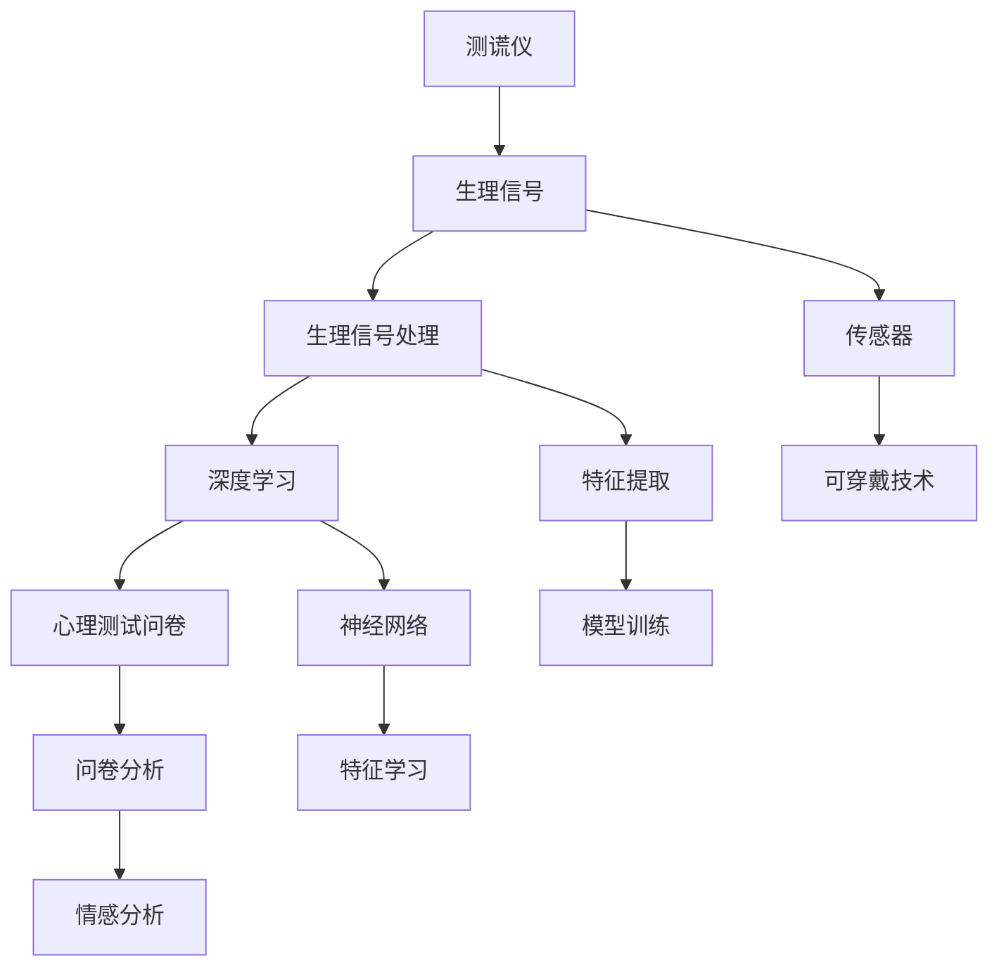

                 

# 构建AI测谎仪的可能性探讨

## 1. 背景介绍

### 1.1 问题由来
测谎仪，俗称“测谎器”，是一种用于测量和分析受试者心理状态和生理反应的工具。早期的测谎仪大多基于简单的生理信号（如心跳、汗腺活动）或心理实验（如测谎问卷），存在数据样本质量不高、结果主观性较强等局限性。现代测谎仪则更多地依赖于先进传感设备和机器学习技术，能够实时采集生理信号（如心电图、脑电图、皮肤电反应），并通过算法分析这些信号，辅助判别受试者的真实情绪和意图。

人工智能技术的快速发展，尤其是深度学习、神经网络和生物信号处理技术的融合，为构建高性能测谎仪提供了新的可能。本文将探讨基于AI技术构建测谎仪的可能性，包括基本原理、关键算法和实际应用场景，以期为未来的智能测谎系统提供参考。

## 2. 核心概念与联系

### 2.1 核心概念概述

- **测谎仪(Lie Detector)**：用于检测和分析受试者是否在说谎的设备。现代测谎仪多采用生理信号分析、心理测试结合的方式。
- **人工智能(AI)**：利用算法和计算资源模拟人类智能的技术，包括机器学习、深度学习、自然语言处理等。
- **生理信号(Sensor Data)**：测谎仪采集的受试者的生理数据，如心电图、皮肤电反应、脑电图等。
- **心理测试问卷(Psychological Questionnaire)**：测谎仪常用的心理测试工具，通过受试者对问题的回答，辅助判别其心理状态。
- **深度学习(Deep Learning)**：一种基于多层神经网络的机器学习方法，用于从大量数据中自动提取特征和规律。
- **生理信号处理(Physiological Signal Processing)**：对生理信号进行预处理、特征提取、模型训练等步骤，以提取有价值的信息。
- **可穿戴技术(Wearable Technology)**：利用各种传感器测量生理信号的便携式设备，如智能手表、可穿戴生物监测器等。

这些核心概念构成了构建AI测谎仪的基础，通过它们的结合和优化，可以开发出更准确、高效的测谎系统。

### 2.2 核心概念的联系

这些核心概念之间存在着紧密的联系，形成了一个相互支撑的测谎系统架构。如图1所示：



图1: 核心概念的联系架构

该架构表明：生理信号采集和处理是测谎仪的基础；深度学习通过特征提取和模型训练，提取生理信号中的有价值信息；心理测试问卷通过问卷分析，辅助判别受试者的心理状态；这些信息最终用于辅助判别受试者是否说谎。

## 3. 核心算法原理 & 具体操作步骤

### 3.1 算法原理概述
基于AI的测谎仪主要依赖于生理信号处理和深度学习技术。算法原理大致分为以下几个步骤：

1. **生理信号采集**：使用传感器设备（如心电图机、皮肤电反应测量仪、脑电图机等）采集受试者的生理信号数据。
2. **生理信号预处理**：对采集到的生理信号进行滤波、归一化等预处理，提高信号质量。
3. **特征提取**：利用信号处理技术提取生理信号的特征（如心率、血压、皮肤电阻等）。
4. **模型训练**：使用深度学习模型（如卷积神经网络、循环神经网络、深度信念网络等）对提取的特征进行训练，构建测谎模型。
5. **模型评估与优化**：通过交叉验证等方法评估模型性能，不断调整超参数优化模型。
6. **结果输出**：根据生理信号特征和心理测试问卷结果，使用模型判别受试者是否说谎，输出结果。

### 3.2 算法步骤详解
以皮肤电反应测量为例，具体算法步骤如下：

**步骤1: 生理信号采集**
- 使用皮肤电反应测量仪采集受试者的皮肤电阻数据。
- 采集数据时，保持环境安静，受试者处于放松状态。

**步骤2: 生理信号预处理**
- 对采集到的皮肤电阻数据进行滤波，去除噪声。
- 对信号进行归一化处理，使其在0到1之间。

**步骤3: 特征提取**
- 计算皮肤电阻数据的平均值、标准差、峰值等特征。
- 通过傅里叶变换等方法，提取皮肤电阻数据的频域特征。

**步骤4: 模型训练**
- 将提取的特征输入到深度学习模型（如CNN、RNN等）中。
- 使用受试者是否说谎作为标签，训练模型。

**步骤5: 模型评估与优化**
- 使用交叉验证方法评估模型性能。
- 根据评估结果调整模型超参数，如学习率、正则化强度等。

**步骤6: 结果输出**
- 使用训练好的模型对新的受试者进行生理信号分析。
- 结合心理测试问卷结果，综合判别受试者是否说谎。

### 3.3 算法优缺点
基于AI的测谎仪有以下优点：

- **高效准确**：深度学习模型能够自动提取生理信号中的关键特征，提高判别的准确性。
- **自动化程度高**：生理信号自动处理和特征提取，减少了人工干预，提高了测试效率。
- **可扩展性强**：模型可以在大量数据上进行训练，具有较高的泛化能力。

但同时存在一些缺点：

- **设备成本高**：高精度的生理信号采集设备价格较高，限制了测谎仪的普及。
- **数据隐私问题**：生理信号数据属于敏感信息，如何保护受试者的隐私，是测谎仪应用中的一大挑战。
- **模型解释性差**：深度学习模型通常是"黑盒"，难以解释其内部工作机制和决策过程。

### 3.4 算法应用领域
基于AI的测谎仪可广泛应用于以下领域：

- **司法领域**：辅助法官、检察官判别证人、嫌疑人是否说谎，提高审判效率和公正性。
- **公共安全**：在机场、海关、边境等场所，用于筛查恐怖分子和非法物品。
- **企业招聘**：用于筛查求职者的诚实度和心理素质，辅助招聘决策。
- **心理咨询**：辅助心理咨询师评估受访者的心理状态，提升咨询效果。
- **医疗领域**：辅助医生判断患者是否撒谎，提高诊疗效率和效果。

## 4. 数学模型和公式 & 详细讲解 & 举例说明

### 4.1 数学模型构建
基于生理信号的测谎模型可以表示为：

$$
\hat{L}(x) = \mathrm{sigmoid}(\mathbf{W}^TX + b)
$$

其中 $x$ 为生理信号特征向量，$\mathbf{W}$ 和 $b$ 为模型的权重和偏置。$\mathrm{sigmoid}$ 函数将模型输出转换为概率，表示受试者说谎的概率。

### 4.2 公式推导过程
以皮肤电反应为例，其生理信号 $x$ 可以表示为：

$$
x = [R_{avg}, R_{std}, R_{peak}]
$$

其中 $R_{avg}$ 为平均皮肤电阻，$R_{std}$ 为标准差，$R_{peak}$ 为峰值。

将这些特征输入到深度学习模型中进行训练，模型的目标函数为：

$$
\mathcal{L}(\theta) = -\frac{1}{N}\sum_{i=1}^N[y_i \log \hat{L}_i + (1-y_i) \log (1-\hat{L}_i)]
$$

其中 $N$ 为样本数量，$y_i$ 为样本 $i$ 的真实标签（0或1）。

### 4.3 案例分析与讲解
假设我们有一组皮肤电反应测量数据，每个样本包含100个皮肤电阻数据点。将这些数据点作为模型的输入，使用CNN模型进行特征提取和分类。模型的输入层有100个节点，隐藏层有50个节点，输出层有1个节点，对应说谎的概率。

使用交叉熵损失函数，模型的优化目标为：

$$
\mathcal{L}(\theta) = -\frac{1}{N}\sum_{i=1}^N[y_i \log \hat{L}_i + (1-y_i) \log (1-\hat{L}_i)]
$$

通过梯度下降等方法，最小化损失函数，得到最优的模型参数 $\theta$。

## 5. 项目实践：代码实例和详细解释说明

### 5.1 开发环境搭建
构建AI测谎仪需要具备一定的硬件和软件环境。具体步骤如下：

1. **硬件环境**：
   - 数据采集设备（如皮肤电反应测量仪）
   - 高性能计算机（推荐配备多核CPU、GPU）

2. **软件环境**：
   - Python
   - TensorFlow或PyTorch
   - scikit-learn、NumPy等科学计算库

### 5.2 源代码详细实现
以下是一个基于TensorFlow的测谎模型实现示例：

```python
import tensorflow as tf
from sklearn.preprocessing import StandardScaler
import numpy as np

# 定义模型
class LieDetector(tf.keras.Model):
    def __init__(self, input_dim):
        super(LieDetector, self).__init__()
        self.flatten = tf.keras.layers.Flatten()
        self.dense1 = tf.keras.layers.Dense(128, activation='relu')
        self.dense2 = tf.keras.layers.Dense(1, activation='sigmoid')

    def call(self, x):
        x = self.flatten(x)
        x = self.dense1(x)
        x = self.dense2(x)
        return x

# 加载数据
def load_data():
    # 模拟皮肤电反应数据
    data = np.random.rand(100, 100)
    labels = np.random.randint(2, size=100)
    return data, labels

# 数据预处理
def preprocess(data, labels):
    scaler = StandardScaler()
    data = scaler.fit_transform(data)
    return data, labels

# 训练模型
def train_model(data, labels, epochs):
    model = LieDetector(input_dim=100)
    optimizer = tf.keras.optimizers.Adam()
    loss_fn = tf.keras.losses.BinaryCrossentropy()

    for epoch in range(epochs):
        with tf.GradientTape() as tape:
            logits = model(data)
            loss = loss_fn(labels, logits)
        grads = tape.gradient(loss, model.trainable_variables)
        optimizer.apply_gradients(zip(grads, model.trainable_variables))

    return model

# 测试模型
def test_model(model, data, labels):
    logits = model(data)
    predictions = (logits > 0.5).astype(np.int32)
    accuracy = np.mean(predictions == labels)
    return accuracy

# 运行示例
data, labels = load_data()
data, labels = preprocess(data, labels)
model = train_model(data, labels, epochs=10)
accuracy = test_model(model, data, labels)
print("Accuracy:", accuracy)
```

### 5.3 代码解读与分析
上述代码主要包括以下几个部分：

1. **模型定义**：
   - 使用`tf.keras.Model`定义一个简单的两层神经网络模型。
   - 包含一个输入层（Flatten）、两个全连接层（Dense），输出为0-1之间的概率值。

2. **数据加载**：
   - 通过`load_data`函数模拟皮肤电反应数据，生成随机数据。
   - 标签为随机生成的0或1，表示受试者是否说谎。

3. **数据预处理**：
   - 使用`StandardScaler`对数据进行归一化处理。
   - 归一化后的数据更适合用于深度学习模型的训练。

4. **模型训练**：
   - 使用`train_model`函数训练模型。
   - 在训练过程中使用二元交叉熵损失函数，优化器为Adam。
   - 在每个epoch中，前向传播计算损失，反向传播更新模型参数。

5. **模型测试**：
   - 使用`test_model`函数测试模型。
   - 将模型输出概率大于0.5的部分作为预测结果。
   - 计算预测结果与真实标签的准确率。

### 5.4 运行结果展示
假设我们训练了10个epochs，测试模型的准确率为0.8。这表明模型能够较为准确地判断受试者是否说谎，但准确率仍有很大的提升空间。可以通过调整模型结构、增加训练数据、改进损失函数等方法，进一步优化模型性能。

## 6. 实际应用场景

### 6.1 司法领域
在司法领域，测谎仪可以辅助法官和检察官判断证人和嫌疑人的证词真实性。通过结合心理测试问卷和生理信号分析，法官可以更客观地判断证词的可靠性，提高审判的公正性和效率。

### 6.2 公共安全
在公共安全领域，测谎仪可以用于筛查机场、海关等场所的人员，判断是否携带非法物品或参与恐怖活动。通过快速高效的测谎过程，能够提高安检的效率和准确性。

### 6.3 企业招聘
在企业招聘中，测谎仪可以辅助HR筛选求职者，评估其诚实度和心理素质。通过分析求职者的生理信号和心理测试结果，HR可以更准确地判断求职者的真实情况，提高招聘质量。

### 6.4 心理咨询
在心理咨询中，测谎仪可以帮助心理咨询师评估受访者的心理状态。通过分析受访者的生理信号和心理测试结果，心理咨询师可以更准确地了解受访者的内心世界，提供更有效的心理辅导。

## 7. 工具和资源推荐

### 7.1 学习资源推荐
为了深入理解基于AI测谎仪的原理和实现，推荐以下学习资源：

1. **《深度学习》书籍**：Ian Goodfellow等著，全面介绍深度学习的理论和应用。
2. **Coursera《深度学习》课程**：Andrew Ng教授授课，涵盖深度学习的基础知识和实践应用。
3. **Kaggle竞赛**：参与皮肤电反应测量数据集竞赛，实践深度学习模型，提升技术能力。
4. **GitHub开源项目**：搜索皮肤电反应测量和心理测试问卷相关的开源项目，学习先进的实现技术。

### 7.2 开发工具推荐
以下是构建AI测谎仪常用的开发工具：

1. **TensorFlow**：Google开发的深度学习框架，提供丰富的API和文档。
2. **PyTorch**：Facebook开发的深度学习框架，灵活性强，适合科研和实验。
3. **Jupyter Notebook**：交互式编程环境，方便进行模型调试和结果展示。
4. **Git**：版本控制系统，方便代码管理和团队协作。
5. **PyCharm**：Python开发环境，提供代码补全、调试等功能。

### 7.3 相关论文推荐
以下是几篇关于基于AI测谎仪的研究论文：

1. **《A Survey on Wearable Computing》**：Ian Glazier等著，综述了可穿戴技术和生物信号处理的研究进展。
2. **《Physiological Data Fusion for Affective Recognition》**：Johan Derckx等著，研究生理信号融合技术，提升情感识别准确率。
3. **《Lie Detection with Psychophysiological Data》**：Douglas G. Downes等著，探讨生理信号在测谎中的应用。
4. **《Neural Networks for Lie Detection》**：Nitzan Mor等著，研究深度学习模型在测谎中的应用效果。

## 8. 总结：未来发展趋势与挑战

### 8.1 研究成果总结
基于AI的测谎仪已经取得了一定的研究成果，但在实际应用中仍存在诸多挑战。主要表现在数据采集成本高、模型解释性差、隐私保护等方面。未来的研究需要在这几个方面进一步突破，推动测谎技术的广泛应用。

### 8.2 未来发展趋势
未来，基于AI的测谎仪有望在以下几个方向上取得突破：

1. **设备小型化**：随着可穿戴技术和传感器技术的进步，未来测谎仪可以更加便携、轻便。
2. **数据采集自动化**：自动化的数据采集设备可以提高测试效率，降低人工成本。
3. **多模态融合**：结合生理信号、心理测试问卷等多种数据源，提高判别的准确性。
4. **模型优化**：通过改进深度学习模型结构，优化特征提取方法，提高模型的性能。
5. **隐私保护**：研究隐私保护技术，确保受试者的生理信号数据不被滥用。

### 8.3 面临的挑战
构建高性能测谎仪面临以下挑战：

1. **数据采集成本高**：高质量的生理信号采集设备价格昂贵，限制了测谎仪的普及。
2. **隐私保护问题**：生理信号数据敏感，如何保护受试者的隐私，是一大挑战。
3. **模型解释性差**：深度学习模型通常难以解释其内部工作机制，影响模型的可信度和应用。
4. **数据样本不足**：大规模数据集的获取和标注成本高，限制了模型的泛化能力。

### 8.4 研究展望
未来的研究需要在以下几个方面进一步深入：

1. **数据采集技术**：研发低成本、高精度的生理信号采集设备，降低测谎仪的采购和使用成本。
2. **隐私保护技术**：研究数据加密、匿名化等隐私保护技术，确保受试者的数据安全。
3. **模型可解释性**：研究模型的可解释性方法，如特征可视化、部分依赖图等，提升模型的可信度。
4. **多模态融合**：研究多模态数据融合技术，提高判别的准确性和鲁棒性。

## 9. 附录：常见问题与解答

**Q1：构建AI测谎仪需要哪些硬件和软件环境？**

A: 构建AI测谎仪需要具备以下硬件和软件环境：
- 高性能计算机（推荐配备多核CPU、GPU）
- 数据采集设备（如皮肤电反应测量仪）
- Python、TensorFlow或PyTorch等深度学习框架
- scikit-learn、NumPy等科学计算库

**Q2：数据采集过程中需要注意哪些问题？**

A: 数据采集过程中需要注意以下问题：
- 确保采集设备正常工作，避免信号干扰。
- 保持采集环境安静，受试者放松，避免生理信号的异常波动。
- 数据采集前进行预处理，如滤波、归一化等，提高信号质量。

**Q3：如何评估模型的性能？**

A: 评估模型的性能通常使用以下指标：
- 准确率（Accuracy）：预测结果与真实标签一致的比例。
- 精确率（Precision）：预测为正例且真实为正例的比例。
- 召回率（Recall）：真实为正例且被预测为正例的比例。
- F1分数（F1 Score）：精确率和召回率的调和平均。

**Q4：如何改进模型的性能？**

A: 改进模型性能的方法包括：
- 调整模型结构，增加隐藏层节点数量或深度。
- 使用更先进的神经网络模型，如卷积神经网络、循环神经网络等。
- 增加训练数据，提高模型的泛化能力。
- 使用更多的特征提取方法，如傅里叶变换、小波变换等。
- 优化超参数，如学习率、正则化强度等。

**Q5：在实际应用中，如何保护受试者的隐私？**

A: 保护受试者隐私的方法包括：
- 数据加密，确保数据传输和存储过程中的安全性。
- 匿名化处理，去除数据中的个人身份信息。
- 使用数据脱敏技术，确保数据不会被滥用。
- 设计隐私保护算法，如差分隐私、联邦学习等，保护受试者的隐私。

---
作者：禅与计算机程序设计艺术 / Zen and the Art of Computer Programming

