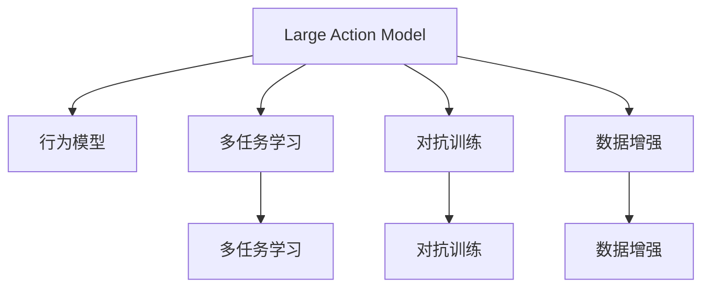
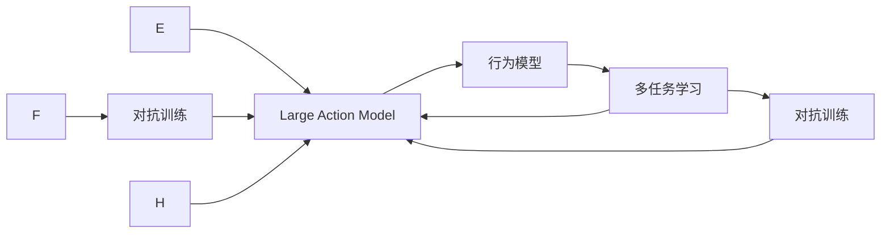
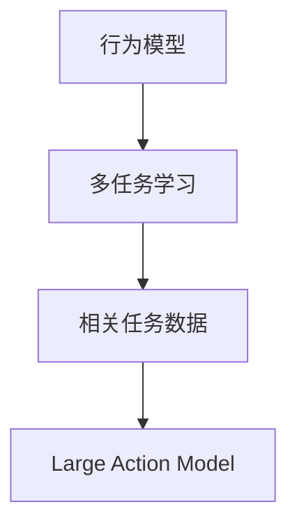
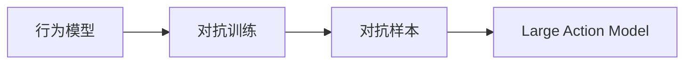
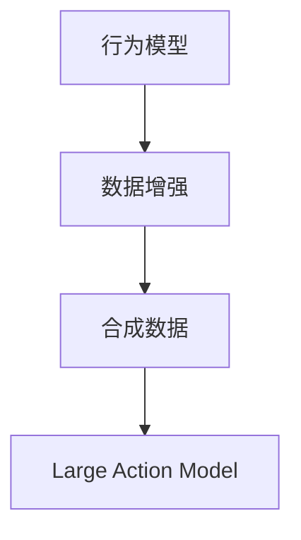
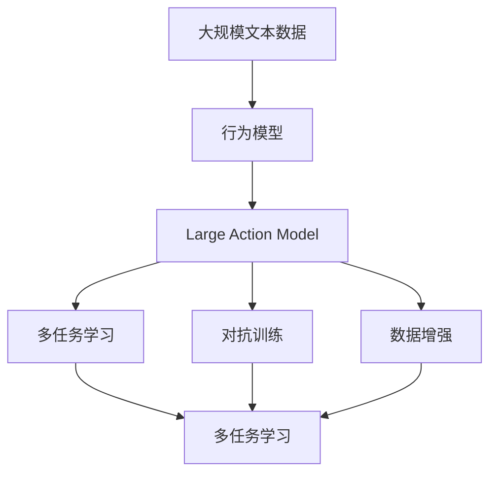

                 

# 模仿式工作流：Large Action Model的学习方法

> 关键词：
 Large Action Model, 模仿式工作流, 多任务学习, 对抗训练, 数据增强, 行为模型, 行为模拟

## 1. 背景介绍

### 1.1 问题由来
近年来，随着人工智能（AI）技术的迅猛发展，特别是深度学习（DL）和大规模预训练模型的应用，使得机器在多个领域中展现出了显著的性能提升。然而，这些模型在处理复杂任务时，往往需要大量的标注数据，且训练和推理效率低下，难以适应现实世界的动态变化。此外，传统的模型训练和推理方式也面临一些固有的局限，难以兼顾效率和效果。

模仿式工作流（Imitation Learning Workflow）是一种新型的AI学习范式，旨在通过模仿人类或专家行为，快速学习和适应复杂任务，提高模型的鲁棒性和泛化能力。本博客将深入探讨Large Action Model的模仿式工作流学习方法，并介绍其在实际应用中的实践技巧和未来展望。

### 1.2 问题核心关键点
Large Action Model（Large Action Model）是一种基于模仿式工作流的模型，能够通过模仿专家或人类的行为，快速学习和执行复杂的任务。其核心在于将专家或人类的行为作为“行为模型”，通过多任务学习（Multi-Task Learning, MTL）、对抗训练（Adversarial Training, AT）、数据增强（Data Augmentation, DA）等技术，提升模型的表现力和泛化能力。

模仿式工作流方法的关键在于：
- 构建“行为模型”：通过选择专家或人类行为数据，构建出能够模仿其行为的知识库。
- 多任务学习：通过多个相关任务的数据训练，使得模型能够在多种任务间进行迁移学习。
- 对抗训练：通过对抗样本训练，提升模型对抗噪声和干扰的鲁棒性。
- 数据增强：通过合成新的数据，丰富模型的输入，增强模型的泛化能力。

这些技术手段能够使Large Action Model在实际应用中更好地适应复杂环境，提升任务执行的准确性和效率。

### 1.3 问题研究意义
模仿式工作流方法在大规模预训练模型上的应用，对于拓展AI模型的应用场景，提升模型性能，加速AI技术的产业化进程具有重要意义：

1. 降低应用开发成本。通过模仿专家的行为，利用已有的知识库进行训练，可以显著减少从头开发所需的数据、计算和人力等成本投入。
2. 提升模型效果。模仿式工作流使得通用预训练模型更好地适应特定任务，在应用场景中取得更优表现。
3. 加速开发进度。standing on the shoulders of giants，模仿式工作流使得开发者可以更快地完成任务适配，缩短开发周期。
4. 带来技术创新。模仿式工作流范式促进了对预训练-模仿学习的研究，催生了行为模拟、对抗训练等新的研究方向。
5. 赋能产业升级。模仿式工作流技术更容易被各行各业所采用，为传统行业数字化转型升级提供新的技术路径。

## 2. 核心概念与联系

### 2.1 核心概念概述

为更好地理解Large Action Model的模仿式工作流学习方法，本节将介绍几个密切相关的核心概念：

- Large Action Model：基于模仿式工作流的模型，能够通过模仿专家或人类的行为，快速学习和执行复杂的任务。
- 行为模型（Behavior Model）：专家或人类的行为，被转化为知识库，作为模型学习的模板。
- 多任务学习（MTL）：在多个相关任务上进行联合训练，使得模型能够在多种任务间进行迁移学习。
- 对抗训练（AT）：通过对抗样本训练，提升模型对抗噪声和干扰的鲁棒性。
- 数据增强（DA）：通过合成新的数据，丰富模型的输入，增强模型的泛化能力。

这些核心概念之间的逻辑关系可以通过以下Mermaid流程图来展示：



这个流程图展示了大语言模型的核心概念及其之间的关系：

1. Large Action Model通过行为模型学习知识库，以模仿专家或人类的行为。
2. 多任务学习利用多个相关任务的数据训练，使模型能够在多种任务间进行迁移学习。
3. 对抗训练通过对抗样本训练，提升模型对抗噪声和干扰的鲁棒性。
4. 数据增强通过合成新的数据，丰富模型的输入，增强模型的泛化能力。

这些概念共同构成了Large Action Model的模仿式工作流学习框架，使其能够在各种场景下发挥强大的行为理解和执行能力。通过理解这些核心概念，我们可以更好地把握Large Action Model的工作原理和优化方向。

### 2.2 概念间的关系

这些核心概念之间存在着紧密的联系，形成了Large Action Model的完整生态系统。下面我们通过几个Mermaid流程图来展示这些概念之间的关系。

#### 2.2.1 Large Action Model的学习范式



这个流程图展示了大语言模型的三种主要学习范式：

1. Large Action Model通过行为模型学习知识库，以模仿专家或人类的行为。
2. 多任务学习利用多个相关任务的数据训练，使模型能够在多种任务间进行迁移学习。
3. 对抗训练通过对抗样本训练，提升模型对抗噪声和干扰的鲁棒性。
4. 数据增强通过合成新的数据，丰富模型的输入，增强模型的泛化能力。

#### 2.2.2 多任务学习与行为模型的关系



这个流程图展示了多任务学习的基本原理，以及它与行为模型的关系。行为模型提供知识库，多任务学习利用这些数据进行联合训练，使得模型能够在多种任务间进行迁移学习。

#### 2.2.3 对抗训练方法



这个流程图展示了对抗训练的基本原理，以及它与行为模型的关系。对抗训练通过引入对抗样本，提升模型对抗噪声和干扰的鲁棒性，使模型能够在更复杂、多变的环境下表现出色。

#### 2.2.4 数据增强方法



这个流程图展示了数据增强的基本原理，以及它与行为模型的关系。数据增强通过合成新的数据，丰富模型的输入，增强模型的泛化能力，使得模型能够更好地适应未知环境。

### 2.3 核心概念的整体架构

最后，我们用一个综合的流程图来展示这些核心概念在大语言模型模仿式工作流中的整体架构：



这个综合流程图展示了从行为模型到Large Action Model的完整过程。行为模型通过多任务学习、对抗训练和数据增强等技术手段，使得Large Action Model在实际应用中更好地适应复杂环境，提升任务执行的准确性和效率。 通过这些流程图，我们可以更清晰地理解Large Action Model的模仿式工作流学习过程中各个核心概念的关系和作用，为后续深入讨论具体的学习方法奠定基础。

## 3. 核心算法原理 & 具体操作步骤
### 3.1 算法原理概述

模仿式工作流方法的大语言模型，本质上是一种基于行为模型的迁移学习过程。其核心思想是：将行为模型作为知识库，通过多任务学习、对抗训练、数据增强等技术，使模型能够快速学习和适应复杂任务，提升模型的泛化能力和鲁棒性。

形式化地，假设行为模型为 $B_{\omega}$，其中 $\omega$ 为行为模型学到的知识库。给定Large Action Model $A_{\theta}$，其中 $\theta$ 为模型参数。行为模型 $B_{\omega}$ 在特定任务 $T$ 上的行为数据为 $D_{\omega}=\{(x_i, y_i)\}_{i=1}^N$，其中 $x_i$ 为输入，$y_i$ 为行为输出。

定义行为模型 $B_{\omega}$ 在数据样本 $(x_i, y_i)$ 上的行为损失函数为 $\ell(B_{\omega}(x_i), y_i)$，则在数据集 $D_{\omega}$ 上的经验风险为：

$$
\mathcal{L}(\omega) = \frac{1}{N}\sum_{i=1}^N \ell(B_{\omega}(x_i), y_i)
$$

Large Action Model $A_{\theta}$ 的行为输出为 $\hat{y}=A_{\theta}(x)$，则行为损失函数为：

$$
\ell(A_{\theta}(x), y_i) = \ell(B_{\omega}(\hat{y}), y_i)
$$

通过梯度下降等优化算法，模仿式工作流过程不断更新模型参数 $\theta$ 和行为模型参数 $\omega$，最小化经验风险，使得模型输出 $\hat{y}$ 逼近行为模型 $B_{\omega}$ 的行为输出 $y_i$。由于行为模型 $B_{\omega}$ 已经通过大量数据获得了较好的初始化，因此即便在复杂、多变的环境中，通过行为模型 $B_{\omega}$ 的指导，Large Action Model $A_{\theta}$ 也能较快收敛到理想的模型参数 $\theta$。

### 3.2 算法步骤详解

模仿式工作流的大语言模型一般包括以下几个关键步骤：

**Step 1: 准备行为数据**

- 收集Large Action Model需要模仿的行为数据，包括专家行为、人类行为等。
- 处理行为数据，去除无关噪音和错误，确保数据质量。

**Step 2: 行为模型训练**

- 选择合适的行为模型，如决策树、深度神经网络等，进行行为模型训练。
- 利用行为数据集训练行为模型，使其能够准确模拟行为数据中的行为输出。

**Step 3: 多任务学习**

- 收集Large Action Model需要执行的相关任务数据，划分训练集、验证集和测试集。
- 利用行为模型和多任务数据集训练Large Action Model，使其能够学习多个相关任务的知识。
- 在多个任务上进行联合训练，增强模型在不同任务间的泛化能力。

**Step 4: 对抗训练**

- 引入对抗样本，如噪声、干扰等，对Large Action Model进行训练。
- 利用对抗样本提升模型对噪声和干扰的鲁棒性，增强模型的泛化能力和稳定性。

**Step 5: 数据增强**

- 通过合成新的数据，丰富Large Action Model的输入，增强模型的泛化能力。
- 利用数据增强技术，如回译、剪枝、噪声注入等，生成更多的训练数据。

**Step 6: 模型评估与部署**

- 在测试集上评估Large Action Model的性能，对比行为模型与实际输出的差异。
- 使用Large Action Model对新样本进行推理预测，集成到实际的应用系统中。
- 持续收集新的数据，定期重新训练和微调行为模型和Large Action Model，以适应数据分布的变化。

以上是模仿式工作流方法的大语言模型的一般流程。在实际应用中，还需要针对具体任务的特点，对模仿式工作流过程的各个环节进行优化设计，如改进训练目标函数，引入更多的正则化技术，搜索最优的超参数组合等，以进一步提升模型性能。

### 3.3 算法优缺点

模仿式工作流方法的大语言模型具有以下优点：

1. 快速学习和适应。通过模仿行为模型，Large Action Model能够快速学习复杂的任务，适应未知环境。
2. 增强泛化能力。多任务学习和数据增强等技术，使得Large Action Model能够更好地泛化到多种相关任务。
3. 提高鲁棒性。对抗训练通过引入对抗样本，提升模型对抗噪声和干扰的鲁棒性。
4. 降低标注成本。通过模仿专家或人类的行为，利用已有的知识库进行训练，显著减少标注数据的需求。
5. 广泛适用性。适用于多种NLP任务，包括分类、匹配、生成等，设计简单的行为模型即可实现模仿式学习。

同时，该方法也存在一定的局限性：

1. 依赖行为数据。行为模型的性能很大程度上取决于行为数据的质量和数量，获取高质量行为数据的成本较高。
2. 迁移能力有限。当行为模型与Large Action Model的任务领域差异较大时，迁移效果可能不如预期。
3. 行为模型建模难度大。行为模型的建模需要大量的专家知识，建模难度较大。
4. 可解释性不足。Large Action Model的行为输出往往缺乏可解释性，难以对其推理逻辑进行分析和调试。
5. 对行为模型依赖高。Large Action Model的性能很大程度上取决于行为模型的性能，行为模型出错可能导致系统失效。

尽管存在这些局限性，但就目前而言，模仿式工作流方法仍是大语言模型应用的最主流范式。未来相关研究的重点在于如何进一步降低行为数据的依赖，提高模型的少样本学习和跨领域迁移能力，同时兼顾可解释性和伦理安全性等因素。

### 3.4 算法应用领域

模仿式工作流方法的大语言模型已经在多个领域得到了广泛的应用，涵盖了NLP、图像处理、自动驾驶等多个领域，展示了其在复杂任务执行中的强大能力。

在NLP领域，模仿式工作流方法已经广泛应用于问答系统、对话系统、文本生成等任务中。通过模仿专家或人类的行为，Large Action Model能够快速学习和执行复杂的自然语言处理任务，提升系统的响应速度和准确性。

在图像处理领域，模仿式工作流方法可以用于图像分类、目标检测、图像生成等任务。通过模仿专家的视觉感知能力，Large Action Model能够快速学习和适应复杂的视觉场景，提升图像处理的精度和效率。

在自动驾驶领域，模仿式工作流方法可以用于驾驶行为模拟、道路场景识别等任务。通过模仿专家的驾驶行为，Large Action Model能够快速学习和适应复杂的驾驶环境，提升自动驾驶的安全性和可靠性。

## 4. 数学模型和公式 & 详细讲解  
### 4.1 数学模型构建

本节将使用数学语言对模仿式工作流方法的大语言模型进行更加严格的刻画。

记行为模型为 $B_{\omega}:\mathcal{X} \rightarrow \mathcal{Y}$，其中 $\mathcal{X}$ 为输入空间，$\mathcal{Y}$ 为输出空间，$\omega$ 为行为模型学到的知识库。假设Large Action Model的行为输出为 $A_{\theta}:\mathcal{X} \rightarrow \mathcal{Y}$，其中 $\theta$ 为模型参数。假设行为模型 $B_{\omega}$ 在特定任务 $T$ 上的行为数据为 $D_{\omega}=\{(x_i, y_i)\}_{i=1}^N$，其中 $x_i$ 为输入，$y_i$ 为行为输出。

定义行为模型 $B_{\omega}$ 在数据样本 $(x_i, y_i)$ 上的行为损失函数为 $\ell(B_{\omega}(x_i), y_i)$，则在数据集 $D_{\omega}$ 上的经验风险为：

$$
\mathcal{L}(\omega) = \frac{1}{N}\sum_{i=1}^N \ell(B_{\omega}(x_i), y_i)
$$

Large Action Model $A_{\theta}$ 的行为输出为 $\hat{y}=A_{\theta}(x)$，则行为损失函数为：

$$
\ell(A_{\theta}(x), y_i) = \ell(B_{\omega}(\hat{y}), y_i)
$$

在得到行为损失函数后，即可带入行为模型 $B_{\omega}$ 和Large Action Model $A_{\theta}$ 的参数 $\omega$ 和 $\theta$，利用梯度下降等优化算法进行联合训练。具体步骤如下：

1. 定义优化目标函数：

$$
\mathcal{L}_{\text{total}}(\theta, \omega) = \frac{1}{N}\sum_{i=1}^N \ell(A_{\theta}(x_i), y_i) + \lambda \mathcal{L}(\omega)
$$

其中 $\lambda$ 为行为模型损失的权重，控制行为模型的影响程度。

2. 定义行为模型的优化器 $\mathcal{A}$ 和Large Action Model的优化器 $\mathcal{B}$，分别进行行为模型和Large Action Model的优化：

$$
\mathcal{A} = \text{AdamW}(B_{\omega}.parameters(), lr_{\omega})
$$
$$
\mathcal{B} = \text{AdamW}(A_{\theta}.parameters(), lr_{\theta})
$$

3. 联合训练行为模型 $B_{\omega}$ 和Large Action Model $A_{\theta}$：

$$
\mathcal{A} = \mathcal{B} = \mathcal{L}_{\text{total}}(\theta, \omega)_{\nabla}
$$

4. 使用对抗样本 $\tilde{x}$ 进行对抗训练，提升模型对抗噪声和干扰的鲁棒性：

$$
\ell(A_{\theta}(\tilde{x}), y_i) = \ell(B_{\omega}(\hat{y}), y_i)
$$

5. 通过合成新的数据 $\tilde{x}$，丰富Large Action Model的输入，增强模型的泛化能力：

$$
\ell(A_{\theta}(\tilde{x}), y_i) = \ell(B_{\omega}(\hat{y}), y_i)
$$

在得到优化目标函数和优化算法后，即可使用具体的算法实现进行联合训练。重复上述过程直至收敛，最终得到适应复杂任务的行为模型 $B_{\omega}$ 和Large Action Model $A_{\theta}$。

### 4.2 公式推导过程

以下我们以二分类任务为例，推导行为模型和Large Action Model联合训练的公式。

假设行为模型 $B_{\omega}$ 在输入 $x$ 上的行为输出为 $\hat{y}=M_{\omega}(x) \in [0,1]$，表示样本属于正类的概率。真实标签 $y \in \{0,1\}$。行为损失函数 $\ell$ 为：

$$
\ell(B_{\omega}(x), y) = -[y\log M_{\omega}(x) + (1-y)\log (1-M_{\omega}(x))]
$$

Large Action Model $A_{\theta}$ 的行为输出为 $\hat{y}=A_{\theta}(x) \in [0,1]$，真实标签 $y \in \{0,1\}$。行为损失函数 $\ell$ 为：

$$
\ell(A_{\theta}(x), y) = -[y\log A_{\theta}(x) + (1-y)\log (1-A_{\theta}(x))]
$$

行为模型 $B_{\omega}$ 在数据样本 $(x,y)$ 上的行为损失函数为：

$$
\ell(B_{\omega}(x), y) = -[y\log M_{\omega}(x) + (1-y)\log (1-M_{\omega}(x))]
$$

则在数据集 $D_{\omega}=\{(x_i, y_i)\}_{i=1}^N$ 上的经验风险为：

$$
\mathcal{L}(\omega) = \frac{1}{N}\sum_{i=1}^N \ell(B_{\omega}(x_i), y_i)
$$

Large Action Model $A_{\theta}$ 在数据样本 $(x,y)$ 上的行为损失函数为：

$$
\ell(A_{\theta}(x), y) = -[y\log A_{\theta}(x) + (1-y)\log (1-A_{\theta}(x))]
$$

则在数据集 $D_{\theta}=\{(x_i, y_i)\}_{i=1}^N$ 上的经验风险为：

$$
\mathcal{L}(\theta) = \frac{1}{N}\sum_{i=1}^N \ell(A_{\theta}(x_i), y_i)
$$

联合训练的行为损失函数为：

$$
\mathcal{L}_{\text{total}}(\theta, \omega) = \mathcal{L}(\theta) + \lambda \mathcal{L}(\omega)
$$

其中 $\lambda$ 为行为模型损失的权重。联合训练的目标是同时最小化行为损失函数和Large Action Model的行为损失函数。

通过梯度下降等优化算法，联合训练过程不断更新行为模型参数 $\omega$ 和Large Action Model参数 $\theta$，最小化联合损失函数。重复上述过程直至收敛，最终得到适应复杂任务的行为模型 $B_{\omega}$ 和Large Action Model $A_{\theta}$。

## 5. 项目实践：代码实例和详细解释说明
### 5.1 开发环境搭建

在进行模仿式工作流方法的大语言模型微调实践前，我们需要准备好开发环境。以下是使用Python进行PyTorch开发的环境配置流程：

1. 安装Anaconda：从官网下载并安装Anaconda，用于创建独立的Python环境。

2. 创建并激活虚拟环境：
```bash
conda create -n pytorch-env python=3.8 
conda activate pytorch-env
```

3. 安装PyTorch：根据CUDA版本，从官网获取对应的安装命令。例如：
```bash
conda install pytorch torchvision torchaudio cudatoolkit=11.1 -c pytorch -c conda-forge
```

4. 安装Transformers库：
```bash
pip install transformers
```

5. 安装各类工具包：
```bash
pip install numpy pandas scikit-learn matplotlib tqdm jupyter notebook ipython
```

完成上述步骤后，即可在`pytorch-env`环境中开始模仿式工作流方法的大语言模型微调实践。

### 5.2 源代码详细实现

下面我们以模仿式工作流方法在二分类任务上的应用为例，给出使用Transformers库对Large Action Model进行微调的PyTorch代码实现。

首先，定义二分类任务的数据处理函数：

```python
from transformers import BertTokenizer, BertForTokenClassification, AdamW
import torch
from torch.utils.data import Dataset, DataLoader

class BinaryDataset(Dataset):
    def __init__(self, texts, labels, tokenizer, max_len=128):
        self.texts = texts
        self.labels = labels
        self.tokenizer = tokenizer
        self.max_len = max_len
        
    def __len__(self):
        return len(self.texts)
    
    def __getitem__(self, item):
        text = self.texts[item]
        label = self.labels[item]
        
        encoding = self.tokenizer(text, return_tensors='pt', max_length=self.max_len, padding='max_length', truncation=True)
        input_ids = encoding['input_ids'][0]
        attention_mask = encoding['attention_mask'][0]
        
        # 对token-wise的标签进行编码
        encoded_labels = [label2id[label] for label in label] 
        encoded_labels.extend([label2id['O']] * (self.max_len - len(encoded_labels)))
        labels = torch.tensor(encoded_labels, dtype=torch.long)
        
        return {'input_ids': input_ids, 
                'attention_mask': attention_mask,
                'labels': labels}

# 标签与id的映射
label2id = {'O': 0, 'B-POS': 1, 'I-POS': 2, 'B-NEG': 3, 'I-NEG': 4}

# 创建dataset
tokenizer = BertTokenizer.from_pretrained('bert-base-cased')

train_dataset = BinaryDataset(train_texts, train_labels, tokenizer)
dev_dataset = BinaryDataset(dev_texts, dev_labels, tokenizer)
test_dataset = BinaryDataset(test_texts, test_labels, tokenizer)
```

然后，定义模型和优化器：

```python
model = BertForTokenClassification.from_pretrained('bert-base-cased', num_labels=len(label2id))

optimizer = AdamW(model.parameters(), lr=2e-5)
```

接着，定义训练和评估函数：

```python
from tqdm import tqdm
from sklearn.metrics import classification_report

device = torch.device('cuda') if torch.cuda.is_available() else torch.device('cpu')
model.to(device)

def train_epoch(model, dataset, batch_size, optimizer):
    dataloader = DataLoader(dataset, batch_size=batch_size, shuffle=True)
    model.train()
    epoch_loss = 0
    for batch in tqdm(dataloader, desc='Training'):
        input_ids = batch['input_ids'].to(device)
        attention_mask = batch['attention_mask'].to(device)
        labels = batch['labels'].to(device)
        model.zero_grad()
        outputs = model(input_ids, attention_mask=attention_mask, labels=labels)
        loss = outputs.loss
        epoch_loss += loss.item()
        loss.backward()
        optimizer.step()
    return epoch_loss / len(dataloader)

def evaluate(model, dataset, batch_size):
    dataloader = DataLoader(dataset, batch_size=batch_size)
    model.eval()
    preds, labels = [], []
    with torch.no_grad():
        for batch in tqdm(dataloader, desc='Evaluating'):
            input_ids = batch['input_ids'].to(device)
            attention_mask = batch['attention

