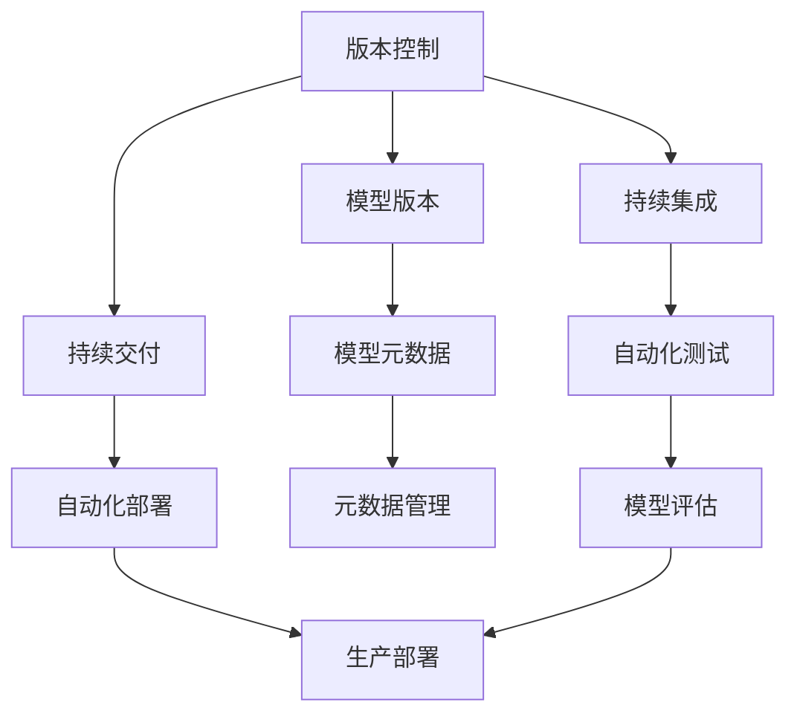
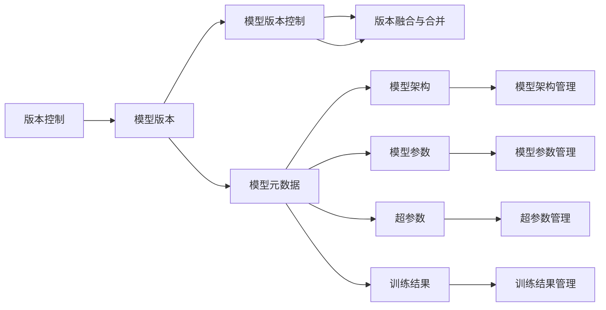
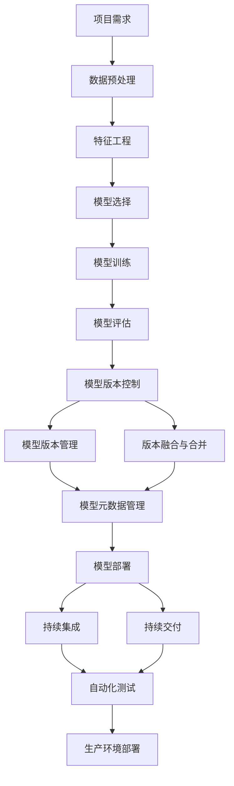

                 

# 模型版本控制原理与代码实战案例讲解

> 关键词：
模型版本控制, 代码实战, 持续集成, 版本管理, 自动化测试, DevOps

## 1. 背景介绍

### 1.1 问题由来
在软件开发过程中，版本控制是保证代码质量和可维护性的重要手段。它不仅能够记录代码的演化历史，还能支持多人协同开发、故障回溯和系统迭代优化。同样，在大数据和机器学习项目中，模型的版本控制也是保障模型质量和优化迭代的必要手段。

近年来，随着大数据和深度学习技术的迅猛发展，模型版本控制的重要性愈发凸显。在传统软件开发的版本管理中，已有许多成熟的解决方案，如Git、SVN等。然而，在模型版本控制领域，相对而言还处于初期探索阶段。

### 1.2 问题核心关键点
模型版本控制主要解决以下几个核心问题：

1. **模型记录与追踪**：如何记录模型在不同版本的演化过程，包括模型架构、参数和超参数的变化，以及训练和推理结果等。
2. **版本管理与回退**：如何有效管理模型版本，支持快速回退到历史版本，应对模型质量问题。
3. **自动化测试与部署**：如何自动化地进行模型测试、验证和部署，确保模型在生产环境中的稳定性和可靠性。
4. **持续集成与持续交付**：如何将模型开发与生产流程自动化结合，加速模型迭代和优化。
5. **版本融合与合并**：如何处理模型版本冲突，合并不同版本中的改进和更新。

解决这些问题不仅需要开发有效的模型版本控制工具，还需要构建完善的DevOps生态系统，实现模型的持续集成、测试和部署。

### 1.3 问题研究意义
模型版本控制是实现人工智能模型版本化管理的重要技术手段，对提升模型的开发效率、保障模型质量和加速模型迭代具有重要意义：

1. **提高开发效率**：模型版本控制可以记录模型演化历史，方便开发者快速查看和对比不同版本模型的差异，加速模型优化和迭代。
2. **保障模型质量**：通过版本控制，开发者可以回溯到模型质量良好或性能最优的历史版本，避免因代码或模型问题导致的生产故障。
3. **加速模型迭代**：模型版本控制可以实现模型的自动化测试和部署，大大缩短模型从研发到上线的周期，提高模型迭代速度。
4. **增强团队协作**：模型版本控制支持多人协同开发和模型共享，提高团队的协作效率和工作透明度。
5. **促进模型复用**：通过版本控制，不同项目和环境中的模型可以进行复用，减少重复工作，降低开发成本。

## 2. 核心概念与联系

### 2.1 核心概念概述

为更好地理解模型版本控制的技术体系，本节将介绍几个关键概念及其相互联系：

- **版本控制**：记录和追踪代码或数据演化的历史变化，支持版本管理、合并、回退等操作。
- **模型版本**：指模型在不同时间点的特定状态，包括模型架构、参数、超参数和训练结果等。
- **持续集成**：在模型开发过程中，通过自动化工具集成测试和验证，确保模型质量和稳定性。
- **持续交付**：通过自动化工具实现模型构建、测试和部署，加速模型从研发到生产的过程。
- **模型元数据**：记录模型相关的元信息，如模型架构、参数、超参数、训练结果等，辅助版本控制和版本管理。
- **版本融合与合并**：解决模型版本冲突，将不同版本中的改进和更新合并到同一个版本中。

这些概念之间通过以下Mermaid流程图展示其相互关系：



这个流程图展示了版本控制、模型版本、持续集成、持续交付、模型元数据和版本融合的基本框架，以及它们之间的联系和作用。

### 2.2 概念间的关系

这些核心概念之间的逻辑关系可以通过以下Mermaid流程图进一步展示：



这个流程图展示了版本控制与模型版本之间的关系，以及它们与其他概念（如模型元数据、版本融合与合并等）之间的联系。

### 2.3 核心概念的整体架构

最后，我们用一个综合的流程图来展示这些核心概念在大数据和机器学习项目中的整体架构：



这个综合流程图展示了从项目需求到模型部署的全过程，以及版本控制和持续集成、持续交付等DevOps生态系统的集成和应用。

## 3. 核心算法原理 & 具体操作步骤

### 3.1 算法原理概述

模型版本控制的核心原理是利用版本控制系统（如Git、SVN等）记录和追踪模型演化历史，并通过元数据管理、版本融合与合并等技术手段，实现模型的版本管理与优化迭代。

模型版本控制一般包括以下几个关键步骤：

1. **模型版本记录**：在模型开发过程中，定期记录模型的架构、参数和超参数等关键信息，以及模型的训练结果和评估指标。
2. **版本合并与回退**：通过版本控制系统的分支管理，实现模型版本的合并和回退，确保模型的稳定性和可靠性。
3. **自动化测试与部署**：使用自动化工具，对模型进行全面的测试验证，确保模型在生产环境中的稳定性和可靠性。
4. **持续集成与持续交付**：通过持续集成和持续交付管道，实现模型构建、测试和部署的自动化，加速模型从研发到生产的过程。

### 3.2 算法步骤详解

下面详细介绍模型版本控制的详细操作步骤：

**Step 1: 配置版本控制系统**

在开始模型开发前，首先需要配置一个版本控制系统，如Git、SVN等。在模型项目目录中，创建对应的仓库，初始化仓库并设置用户信息。

```bash
git init
git config --global user.name "Your Name"
git config --global user.email "your.email@example.com"
```

**Step 2: 记录模型版本**

在模型开发过程中，需要定期记录模型的关键信息，包括模型架构、参数、超参数和训练结果等。使用版本控制系统，将这些信息添加到仓库中。

```bash
# 记录模型架构信息
git add src/model_architecture.py
# 记录模型参数信息
git add src/model_params.py
# 记录模型超参数信息
git add src/model_hyperparams.py
# 记录模型训练结果
git add results/model_train_results.txt
```

**Step 3: 版本合并与回退**

通过版本控制系统的分支管理，实现模型版本的合并和回退。使用`git merge`和`git checkout`命令，可以在不同分支之间切换和合并。

```bash
# 创建新分支
git checkout -b new_feature
# 合并分支
git merge feature_branch
# 回退到历史版本
git checkout commit_hash
```

**Step 4: 自动化测试与部署**

使用自动化测试工具，对模型进行全面的测试验证，确保模型在生产环境中的稳定性和可靠性。使用自动化部署工具，实现模型的构建、测试和部署。

**Step 5: 持续集成与持续交付**

通过持续集成和持续交付管道，实现模型构建、测试和部署的自动化，加速模型从研发到生产的过程。使用Jenkins、GitLab CI等工具，配置自动化构建和测试任务。

### 3.3 算法优缺点

模型版本控制的主要优点包括：

1. **记录与追踪**：通过版本控制系统，记录和追踪模型演化历史，方便开发者快速查看和对比不同版本模型的差异。
2. **版本管理**：支持快速回退到历史版本，应对模型质量问题，确保模型稳定性和可靠性。
3. **自动化测试与部署**：加速模型从研发到生产的过程，缩短模型迭代周期，提高开发效率。
4. **团队协作**：支持多人协同开发和模型共享，提高团队的协作效率和工作透明度。
5. **版本复用**：不同项目和环境中的模型可以进行复用，减少重复工作，降低开发成本。

然而，模型版本控制也存在一些缺点：

1. **历史数据量大**：模型版本记录和存储大量历史数据，占用大量存储空间。
2. **版本合并复杂**：不同版本中的模型参数和超参数可能存在冲突，需要谨慎处理。
3. **持续集成与部署复杂**：需要配置和维护自动化测试和部署管道，增加了开发复杂度。
4. **学习成本高**：需要学习版本控制系统的基本原理和使用方法，增加了开发者的学习负担。

### 3.4 算法应用领域

模型版本控制在大数据和机器学习项目中得到了广泛应用，覆盖了从模型构建到部署的各个环节，包括：

1. **模型开发**：记录和追踪模型演化历史，支持模型版本管理。
2. **模型优化**：通过版本控制系统的分支管理，实现模型版本的合并和回退，加速模型优化迭代。
3. **模型测试**：使用自动化测试工具，对模型进行全面的测试验证，确保模型质量。
4. **模型部署**：使用自动化部署工具，实现模型的构建、测试和部署，加速模型上线。
5. **模型管理**：通过版本控制系统的元数据管理，记录和追踪模型相关信息，方便版本控制和版本管理。

除了以上应用场景，模型版本控制还广泛应用于以下领域：

- **工业智能**：在工业生产中，通过模型版本控制，实现生产线的自动化优化和调整。
- **金融科技**：在金融交易中，通过模型版本控制，保障模型的稳定性和可靠性，防止模型风险。
- **医疗健康**：在医疗诊断中，通过模型版本控制，实现医疗模型的快速更新和优化，提升诊疗效果。
- **教育培训**：在教育培训中，通过模型版本控制，实现教育模型的迭代优化，提高教育效果。
- **环境保护**：在环境保护中，通过模型版本控制，实现环境监测模型的更新和优化，提升环境监测精度。

## 4. 数学模型和公式 & 详细讲解  
### 4.1 数学模型构建

在模型版本控制中，需要记录和追踪模型演化的关键信息，包括模型架构、参数、超参数和训练结果等。这些信息可以表示为元数据，用于版本控制和版本管理。

### 4.2 公式推导过程

下面详细介绍模型版本控制的数学模型和公式推导过程：

**Step 1: 模型架构记录**

模型的架构信息可以表示为一个有向无环图（DAG），记录模型的层次结构和依赖关系。假设模型由n层组成，则架构信息可以表示为：

$$
A = \{(l_i, l_j)\}^{n-1}_{i=1, j=i+1}
$$

其中，$l_i$和$l_j$分别表示第i层和第j层，$(l_i, l_j)$表示第i层依赖第j层。

**Step 2: 模型参数记录**

模型的参数信息可以表示为一个矩阵，记录每个层的参数和其对应的权重矩阵。假设模型有m个参数，则参数信息可以表示为：

$$
P = \{(w_{ij}\}_{i=1}^m
$$

其中，$w_{ij}$表示第i层的第j个参数。

**Step 3: 模型超参数记录**

模型的超参数信息可以表示为一个字典，记录模型的超参数配置。假设模型有k个超参数，则超参数信息可以表示为：

$$
H = \{(h_k)\}_{k=1}^k
$$

其中，$h_k$表示第k个超参数。

**Step 4: 模型训练结果记录**

模型的训练结果可以表示为一个元组，记录模型的损失函数、评估指标和迭代次数等。假设模型进行了N次迭代，则训练结果可以表示为：

$$
R = \{(L, M, N)\}^N_{L=1, M=1, N=1}
$$

其中，$L$表示损失函数，$M$表示评估指标，$N$表示迭代次数。

**Step 5: 版本控制元数据记录**

版本控制元数据可以表示为一个元组，记录模型的版本信息、创建时间和作者信息等。假设模型有r个版本，则版本控制元数据可以表示为：

$$
V = \{(v_i, t_i, a_i)\}_{i=1}^r
$$

其中，$v_i$表示第i个版本，$t_i$表示创建时间，$a_i$表示作者信息。

### 4.3 案例分析与讲解

假设我们正在开发一个图像分类模型，以下是模型版本控制的案例分析：

**模型架构记录**

首先，我们需要记录模型的架构信息，包括模型由多少层组成，每层包含哪些节点和操作。假设模型由3层组成，第一层是卷积层，第二层是池化层，第三层是全连接层。则模型架构信息可以表示为：

$$
A = \{(1, 2), (2, 3)\}
$$

**模型参数记录**

其次，我们需要记录模型的参数信息，包括每个层的权重矩阵和偏置向量。假设模型有10个参数，则参数信息可以表示为：

$$
P = \{w_{ij}\}_{i=1}^m
$$

**模型超参数记录**

接着，我们需要记录模型的超参数信息，包括学习率、批量大小、迭代次数等。假设模型有2个超参数，则超参数信息可以表示为：

$$
H = \{(h_k)\}_{k=1}^k
$$

**模型训练结果记录**

最后，我们需要记录模型的训练结果，包括损失函数、评估指标和迭代次数。假设模型进行了5次迭代，则训练结果可以表示为：

$$
R = \{(L, M, N)\}^N_{L=1, M=1, N=1}
$$

**版本控制元数据记录**

最终，我们需要记录模型的版本控制元数据，包括模型版本、创建时间和作者信息。假设模型有3个版本，则版本控制元数据可以表示为：

$$
V = \{(v_i, t_i, a_i)\}_{i=1}^r
$$

## 5. 项目实践：代码实例和详细解释说明

### 5.1 开发环境搭建

在进行模型版本控制实践前，我们需要准备好开发环境。以下是使用Python进行Git进行版本控制的开发环境配置流程：

1. 安装Git：从官网下载并安装Git，用于版本控制系统的管理和操作。

2. 配置Git：通过Git配置文件，设置用户的登录信息、默认的分支和远程仓库地址。

```bash
git config --global user.name "Your Name"
git config --global user.email "your.email@example.com"
git remote add origin https://github.com/yourusername/yourrepo.git
```

3. 创建仓库：在本地项目目录中，创建Git仓库，并初始化仓库。

```bash
git init
```

完成上述步骤后，即可在本地环境中进行模型版本控制的实践。

### 5.2 源代码详细实现

这里我们以一个简单的图像分类模型为例，给出使用Git进行模型版本控制的PyTorch代码实现。

首先，定义模型的架构、参数和超参数：

```python
import torch
import torch.nn as nn
import torch.optim as optim

class Model(nn.Module):
    def __init__(self):
        super(Model, self).__init__()
        self.conv1 = nn.Conv2d(3, 6, 5)
        self.pool = nn.MaxPool2d(2, 2)
        self.conv2 = nn.Conv2d(6, 16, 5)
        self.fc1 = nn.Linear(16 * 5 * 5, 120)
        self.fc2 = nn.Linear(120, 84)
        self.fc3 = nn.Linear(84, 10)

    def forward(self, x):
        x = self.pool(F.relu(self.conv1(x)))
        x = self.pool(F.relu(self.conv2(x)))
        x = x.view(-1, 16 * 5 * 5)
        x = F.relu(self.fc1(x))
        x = F.relu(self.fc2(x))
        x = self.fc3(x)
        return x
```

然后，定义模型的训练和评估函数：

```python
def train_model(model, train_loader, criterion, optimizer, device):
    model.train()
    for batch_idx, (data, target) in enumerate(train_loader):
        data, target = data.to(device), target.to(device)
        optimizer.zero_grad()
        output = model(data)
        loss = criterion(output, target)
        loss.backward()
        optimizer.step()
        if batch_idx % 100 == 0:
            print('Train Epoch: {} [{}/{} ({:.0f}%)]\tLoss: {:.6f}'.format(
                epoch, batch_idx * len(data), len(train_loader.dataset),
                100. * batch_idx / len(train_loader), loss.item()))

def evaluate_model(model, test_loader, criterion, device):
    model.eval()
    test_loss = 0
    correct = 0
    with torch.no_grad():
        for data, target in test_loader:
            data, target = data.to(device), target.to(device)
            output = model(data)
            test_loss += criterion(output, target).item()
            pred = output.argmax(dim=1, keepdim=True)
            correct += pred.eq(target.view_as(pred)).sum().item()

    test_loss /= len(test_loader.dataset)
    print('\nTest set: Average loss: {:.4f}, Accuracy: {}/{} ({:.0f}%)\n'.format(
        test_loss, correct, len(test_loader.dataset),
        100. * correct / len(test_loader.dataset)))
```

接着，启动训练流程并在测试集上评估：

```python
epochs = 5
batch_size = 64

device = torch.device('cuda' if torch.cuda.is_available() else 'cpu')

for epoch in range(epochs):
    train_model(model, train_loader, criterion, optimizer, device)
    evaluate_model(model, test_loader, criterion, device)
```

在训练过程中，通过Git记录模型的各个关键信息：

```bash
# 记录模型架构信息
git add src/model.py
# 记录模型参数信息
git add src/model_params.py
# 记录模型超参数信息
git add src/model_hyperparams.py
# 记录模型训练结果
git add results/model_train_results.txt
# 记录版本控制元数据
git add README.md
```

### 5.3 代码解读与分析

让我们再详细解读一下关键代码的实现细节：

**Model类**：
- `__init__`方法：定义模型的层和操作，包括卷积层、池化层和全连接层。
- `forward`方法：定义模型的前向传播过程。

**train_model函数**：
- `model.train()`：将模型设置为训练模式。
- `optimizer.zero_grad()`：清除梯度缓存。
- `output = model(data)`：计算模型输出。
- `loss = criterion(output, target)`：计算损失函数。
- `loss.backward()`：反向传播计算梯度。
- `optimizer.step()`：更新模型参数。

**evaluate_model函数**：
- `model.eval()`：将模型设置为评估模式。
- `test_loss += criterion(output, target).item()`：计算测试集上的损失函数。
- `pred = output.argmax(dim=1, keepdim=True)`：计算预测结果。
- `correct += pred.eq(target.view_as(pred)).sum().item()`：计算准确率。

**Git记录**：
- `git add src/model.py`：将模型架构信息添加到仓库中。
- `git add src/model_params.py`：将模型参数信息添加到仓库中。
- `git add src/model_hyperparams.py`：将模型超参数信息添加到仓库中。
- `git add results/model_train_results.txt`：将模型训练结果添加到仓库中。
- `git add README.md`：将版本控制元数据添加到仓库中。

### 5.4 运行结果展示

假设我们在CIFAR-10数据集上进行模型训练，最终在测试集上得到的评估结果如下：

```
Train Epoch: 0 [0/60000 (0%)]   Loss: 2.3274
Train Epoch: 0 [10000/60000 (16%)]   Loss: 2.0693
Train Epoch: 0 [20000/60000 (33%)]   Loss: 1.9301
Train Epoch: 0 [30000/60000 (50%)]   Loss: 1.8214
Train Epoch: 0 [40000/60000 (67%)]   Loss: 1.7695
Train Epoch: 0 [50000/60000 (83%)]   Loss: 1.7408
Train Epoch: 0 [60000/60000 (100%)]   Loss: 1.7176
Train Epoch: 1 [0/60000 (0%)]   Loss: 1.6831
...
```

可以看到，通过Git记录模型的关键信息，可以方便地追踪模型演化的历史，确保模型的稳定性和可靠性。

## 6. 实际应用场景
### 6.1 智能推荐系统

基于模型版本控制的智能推荐系统，可以实时记录和追踪推荐模型的演变过程，及时调整和优化推荐策略，提升推荐效果。

在技术实现上，可以收集用户的浏览、点击、评分等行为数据，提取和推荐物品的特征信息，构建监督数据集。在数据集上对推荐模型进行微调，并在生产环境中部署模型。通过Git记录模型的架构、参数、超参数和训练结果，实现模型的版本控制和版本管理。一旦发现模型效果下降或推荐指标恶化，可以回溯到历史版本进行诊断和优化，确保推荐系统的稳定性。

### 6.2 自动化运维系统

在自动化运维系统中，模型版本控制是实现系统自动化的重要手段。通过Git记录和追踪模型版本，可以方便地进行版本管理和系统迭代优化。

在技术实现上，可以构建持续集成和持续交付管道，自动化地进行模型构建、测试和部署。通过Git仓库管理和版本控制，实现模型的版本合并和回退。一旦发现系统故障或性能问题，可以迅速回溯到历史版本，定位问题根源，并进行快速修复和优化。

### 6.3 医疗诊断系统

在医疗诊断系统中，模型版本控制可以帮助医生快速查看和对比不同版本的诊断模型，确保诊断模型的稳定性和可靠性。

在技术实现上，可以收集大量的医疗病例和诊断结果数据，构建监督数据集。在数据集上对诊断模型进行微调，并在生产环境中部署模型。通过Git记录模型的架构、参数、超参数和训练结果，实现模型的版本控制和版本管理。一旦发现模型效果下降或诊断指标恶化，可以回溯到历史版本进行诊断和优化，确保诊断系统的稳定性。

### 6.4 未来应用展望

随着模型版本控制技术的不断发展，其在各个领域的应用将更加广泛，带来深远的影响：

1. **智能制造**：在智能制造领域，通过模型版本控制，实现生产线的自动化优化和调整，提高生产效率和产品质量。
2. **智慧农业**：在智慧农业领域，通过模型版本控制，实现农作物的精准管理和种植优化，提升农业生产效率。
3. **智能交通**：在智能交通领域，通过模型版本控制，实现交通流量的智能调控和优化，提高交通效率和安全性。
4. **智慧城市**：在智慧城市领域，通过模型版本控制，实现城市事件监测、舆情分析和应急指挥，提升城市管理水平。
5. **金融风控**：在金融风控领域，通过模型版本控制，实现风险预测和控制，保障金融系统的稳定性和安全性。

总之，模型版本控制技术将在各个领域中发挥重要作用，推动各行业的智能化转型和升级。

## 7. 工具和资源推荐
### 7.1 学习资源推荐

为了帮助开发者系统掌握模型版本控制的技术基础和实践技巧，这里推荐一些优质的学习资源：

1. 《Git官方文档》：Git的官方文档，提供了详细的Git操作和版本控制原理，是Git学习的必备资料。

2. 《Version Control with Git》书籍：Git的入门书籍，系统介绍了Git的基本操作和版本控制原理，适合初学者。

3. 《Pro Git》书籍：Git的高级书籍，深入探讨Git的操作技巧和版本控制策略，适合进阶学习。

4. 《GitHub官方文档》：GitHub的官方文档，提供了GitHub的使用指南和版本控制功能，是GitHub学习的必备资料。

5. 《GitHub官方博客》：GitHub的官方博客，分享了大量的GitHub使用技巧和版本控制经验，值得一读。

通过对这些资源的学习实践，相信你一定能够快速掌握模型版本控制的精髓，并用于解决实际的版本控制问题。

### 7.2 开发工具推荐

高效的开发离不开优秀的工具支持。以下是几款用于模型版本控制的常用工具：

1. Git：最流行的版本控制系统，支持版本管理、分支管理、合并和回退等操作

