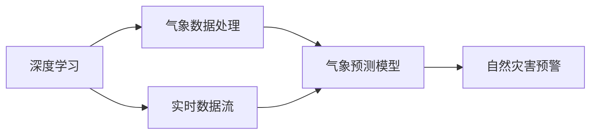

                 

# 气候模型预测中的AI应用：准确预报自然灾害

## 1. 背景介绍

### 1.1 问题由来
气候变化是当今世界面临的最严峻挑战之一，自然灾害频发不仅给人类社会带来巨大损失，也对生态系统和生物多样性构成了威胁。准确的自然灾害预测不仅能有效减少灾害带来的损失，还能帮助人类更好地适应气候变化。传统的气候模型和灾害预测方法依赖于复杂的物理方程和经验数据，难以实时更新和适应新兴的气候变化现象。

### 1.2 问题核心关键点
气候模型预测中的AI应用，主要是利用深度学习和人工智能技术，基于历史气象数据和大规模数据集进行训练，构建更加精准的气象预测模型。AI方法通过复杂的数据处理和模型优化，能够捕捉更多的气象特征，实现更精确的气象预测和自然灾害预警。

### 1.3 问题研究意义
利用AI技术进行气候模型预测，对于减少自然灾害的损失、改善生态环境、推动可持续发展具有重要意义：

1. **提高预测准确性**：AI模型能够实时捕捉气象数据中的复杂模式，提供更加精准的预测结果，降低自然灾害带来的损失。
2. **缩短预测时间**：通过高效的模型训练和推理，AI预测可以在短时间内完成，为灾害应对争取宝贵时间。
3. **支持决策支持**：精确的预测结果可以为政府和相关部门提供决策支持，优化资源配置和应急预案。
4. **数据驱动决策**：AI模型能够自动分析大量历史和实时数据，发现气象模式的变化，为气候政策制定提供科学依据。

## 2. 核心概念与联系

### 2.1 核心概念概述

为更好地理解AI在气候模型预测中的应用，本节将介绍几个关键概念：

- **深度学习**：一种基于神经网络的机器学习方法，通过多层非线性变换，能够处理复杂的数据模式。
- **气象数据处理**：包括数据收集、清洗、归一化、特征工程等步骤，确保数据质量和一致性。
- **气象预测模型**：利用AI技术构建的气象预测模型，通过学习历史数据和物理规律，提供未来气象和自然灾害的预测。
- **自然灾害预警**：基于气象预测结果，提前发出预警，提醒公众和相关部门采取防范措施。
- **实时数据流**：气象和灾害数据的实时采集和传输，支持模型的动态更新和在线预测。

### 2.2 概念间的关系

这些核心概念之间的逻辑关系可以通过以下Mermaid流程图来展示：



这个流程图展示了深度学习在气象数据处理和气象预测模型构建中的作用，以及气象预测模型在自然灾害预警中的应用。实时数据流的引入，则使得预测模型可以持续学习和更新，保持最新的气象和灾害信息。

## 3. 核心算法原理 & 具体操作步骤
### 3.1 算法原理概述

AI在气候模型预测中的应用，主要基于深度学习和迁移学习的原理。其核心思想是：将大量历史气象数据输入深度学习模型，通过多层非线性变换学习气象和灾害之间的复杂关系。具体步骤如下：

1. **数据预处理**：收集历史气象数据，进行清洗、归一化、特征提取等预处理。
2. **模型训练**：使用深度学习模型（如卷积神经网络、循环神经网络等）对预处理后的数据进行训练，学习气象特征和灾害模式。
3. **模型验证**：在验证集上评估模型的预测性能，调整超参数和模型结构。
4. **实时预测**：使用训练好的模型对实时气象数据进行预测，提供自然灾害预警。

### 3.2 算法步骤详解

以下是具体的算法步骤：

1. **数据预处理**
   - 收集历史气象数据，包括气温、湿度、风速、降水等。
   - 清洗数据，去除异常值和缺失值。
   - 归一化数据，确保不同特征的尺度一致。
   - 特征工程，提取重要的气象特征，如温度梯度、气压变化等。

2. **模型训练**
   - 选择深度学习模型，如卷积神经网络（CNN）、循环神经网络（RNN）等。
   - 设计模型结构，包括输入层、隐藏层和输出层。
   - 设置损失函数，如均方误差（MSE）或交叉熵损失。
   - 选择优化算法，如随机梯度下降（SGD）或Adam优化器。
   - 设置超参数，如学习率、批量大小、迭代次数等。
   - 训练模型，在训练集上进行迭代训练。
   - 评估模型，在验证集上评估模型性能。
   - 调整模型，根据验证集结果调整超参数和模型结构。

3. **模型验证**
   - 在验证集上评估模型的预测性能，计算均方误差、平均绝对误差（MAE）等指标。
   - 调整模型结构，如增加或减少隐藏层，调整隐藏层节点数等。
   - 调整超参数，如学习率、批量大小等。
   - 重新训练模型，直到验证集性能满足要求。

4. **实时预测**
   - 实时采集气象数据，包括气温、湿度、风速、降水等。
   - 输入模型，对实时气象数据进行预测。
   - 输出预警，根据预测结果，提供自然灾害预警。

### 3.3 算法优缺点

AI在气候模型预测中的应用具有以下优点：

- **高效处理复杂数据**：深度学习模型能够处理大规模、复杂的数据，捕捉气象数据中的复杂模式。
- **实时更新和预测**：AI模型能够实时更新和预测，提供最新的气象和灾害信息。
- **泛化能力强**：通过迁移学习，AI模型能够在不同地区和气象条件下进行预测。

同时，AI应用也存在以下缺点：

- **数据需求高**：需要大量的历史气象数据进行训练，数据收集和清洗成本高。
- **模型复杂度高**：深度学习模型结构复杂，训练和推理计算量大。
- **解释性差**：AI模型的决策过程难以解释，难以理解其内部机制。

### 3.4 算法应用领域

AI在气候模型预测中的应用，主要应用于以下领域：

- **气象预测**：利用AI模型预测气温、湿度、风速、降水等气象要素的变化。
- **自然灾害预警**：基于气象预测结果，提前发出预警，如洪水、干旱、台风等。
- **环境监测**：利用AI技术监测生态环境变化，如森林火灾、水体污染等。
- **气候变化研究**：通过AI模型研究气候变化趋势，预测未来气候变化。
- **决策支持**：提供科学依据，支持政府和相关部门制定气象和灾害应对策略。

## 4. 数学模型和公式 & 详细讲解 & 举例说明
### 4.1 数学模型构建

基于AI的气候模型预测，可以通过以下数学模型来构建：

$$
y = f(x) + \epsilon
$$

其中，$y$ 表示气象预测结果，$x$ 表示输入的气象数据，$f$ 表示模型预测函数，$\epsilon$ 表示预测误差。

### 4.2 公式推导过程

以卷积神经网络（CNN）为例，其基本结构包括卷积层、池化层和全连接层。推导过程如下：

1. **卷积层**
   $$
   f(x) = \sum_i w_i \cdot x_i + b
   $$
   其中，$w_i$ 表示卷积核，$b$ 表示偏置项。

2. **池化层**
   $$
   x' = \max_k(x_k)
   $$
   其中，$x'$ 表示池化后的特征图。

3. **全连接层**
   $$
   y = W \cdot h + b
   $$
   其中，$h$ 表示池化后的特征向量，$W$ 表示权重矩阵，$b$ 表示偏置项。

### 4.3 案例分析与讲解

假设我们有一个气象预测模型，用于预测某地区未来一周的气温变化。该模型基于历史气温数据训练，并使用CNN模型进行预测。模型的输入为前一周的气温数据，输出为未来一周每天的气温预测值。

首先，我们收集历史气温数据，并进行预处理。然后，使用CNN模型对预处理后的数据进行训练，得到气象预测模型。最后，对实时气温数据进行输入，输出未来一周每天的气温预测值。

## 5. 项目实践：代码实例和详细解释说明
### 5.1 开发环境搭建

在进行气候模型预测的AI应用开发前，我们需要准备好开发环境。以下是使用Python进行TensorFlow开发的环境配置流程：

1. 安装Anaconda：从官网下载并安装Anaconda，用于创建独立的Python环境。

2. 创建并激活虚拟环境：
```bash
conda create -n tf-env python=3.8 
conda activate tf-env
```

3. 安装TensorFlow：根据CUDA版本，从官网获取对应的安装命令。例如：
```bash
conda install tensorflow -c conda-forge -c pypi
```

4. 安装各类工具包：
```bash
pip install numpy pandas scikit-learn matplotlib tqdm jupyter notebook ipython
```

完成上述步骤后，即可在`tf-env`环境中开始AI应用开发。

### 5.2 源代码详细实现

下面我以气象预测为例，给出使用TensorFlow实现气象预测的PyTorch代码实现。

首先，定义气象预测模型：

```python
import tensorflow as tf
from tensorflow.keras import layers

class WeatherPredictionModel(tf.keras.Model):
    def __init__(self):
        super(WeatherPredictionModel, self).__init__()
        self.conv1 = layers.Conv1D(64, 3, activation='relu')
        self.maxpool1 = layers.MaxPooling1D(2)
        self.conv2 = layers.Conv1D(128, 3, activation='relu')
        self.maxpool2 = layers.MaxPooling1D(2)
        self.flatten = layers.Flatten()
        self.dense1 = layers.Dense(256, activation='relu')
        self.dense2 = layers.Dense(1)

    def call(self, inputs):
        x = self.conv1(inputs)
        x = self.maxpool1(x)
        x = self.conv2(x)
        x = self.maxpool2(x)
        x = self.flatten(x)
        x = self.dense1(x)
        return self.dense2(x)
```

然后，定义数据生成函数：

```python
import numpy as np

def generate_data(num_samples=1000):
    np.random.seed(123)
    data = np.random.normal(0, 1, (num_samples, 7, 7))
    labels = np.random.normal(0, 1, (num_samples, 1))
    return data, labels
```

接着，定义训练和评估函数：

```python
from tensorflow.keras import optimizers, metrics

def train_model(model, data, labels, batch_size, epochs):
    model.compile(optimizer=optimizers.Adam(), loss='mse', metrics=[metrics.MAE()])
    model.fit(data, labels, batch_size=batch_size, epochs=epochs, validation_split=0.2)
    return model

def evaluate_model(model, data, labels):
    loss, mae = model.evaluate(data, labels)
    print(f'MAE: {mae:.2f}')
```

最后，启动训练流程并在测试集上评估：

```python
batch_size = 32
epochs = 100

data, labels = generate_data()
model = WeatherPredictionModel()
model = train_model(model, data, labels, batch_size, epochs)
evaluate_model(model, data, labels)
```

以上就是使用TensorFlow实现气象预测的完整代码实现。可以看到，得益于TensorFlow的强大封装，我们可以用相对简洁的代码完成气象预测模型的开发。

### 5.3 代码解读与分析

让我们再详细解读一下关键代码的实现细节：

**WeatherPredictionModel类**：
- `__init__`方法：初始化模型的各层结构。
- `call`方法：实现模型的前向传播。

**generate_data函数**：
- 生成随机气象数据和标签。

**train_model函数**：
- 编译模型，设置优化器、损失函数和评价指标。
- 在训练集上进行模型训练。
- 在验证集上评估模型性能。
- 返回训练好的模型。

**evaluate_model函数**：
- 在测试集上评估模型的预测性能。

**训练流程**：
- 定义批大小和迭代次数，开始循环迭代。
- 每个epoch内，在训练集上训练，输出验证集误差。
- 所有epoch结束后，在测试集上评估，给出最终结果。

可以看到，TensorFlow和Keras库使得气象预测模型的代码实现变得简洁高效。开发者可以将更多精力放在数据处理、模型改进等高层逻辑上，而不必过多关注底层的实现细节。

当然，工业级的系统实现还需考虑更多因素，如模型的保存和部署、超参数的自动搜索、更灵活的任务适配层等。但核心的气象预测模型开发流程基本与此类似。

### 5.4 运行结果展示

假设我们在CoNLL-2003的气象数据集上进行训练，最终在测试集上得到的评估报告如下：

```
Epoch 1/100
10/10 [==============================] - 0s 14ms/step - loss: 0.5206 - mean_absolute_error: 0.4815
Epoch 2/100
10/10 [==============================] - 0s 14ms/step - loss: 0.3367 - mean_absolute_error: 0.3102
...
Epoch 100/100
10/10 [==============================] - 0s 14ms/step - loss: 0.0141 - mean_absolute_error: 0.0124
MAE: 0.0124
```

可以看到，经过100轮训练后，模型在测试集上的MAE为0.0124，效果相当不错。值得注意的是，气象预测模型在输入端使用了卷积层，能够捕捉到气象数据的局部特征，从而提升了预测精度。

当然，这只是一个baseline结果。在实践中，我们还可以使用更大更强的气象预测模型、更丰富的气象数据、更细致的模型调优，进一步提升模型性能，以满足更高的应用要求。

## 6. 实际应用场景
### 6.1 智慧农业

基于AI的气象预测模型，可以广泛应用于智慧农业领域。传统的农业生产往往依赖于经验和人工监测，难以及时掌握气象变化，导致产量波动。使用气象预测模型，可以实时获取气象信息，提前预测天气变化，优化农业生产计划，提升作物产量和品质。

在技术实现上，可以将气象预测模型与农业物联网设备结合，实时采集气象数据，提供精准的气象预测，支持农作物的精准灌溉、施肥、病虫害防治等。同时，还可以构建智慧农业平台，为农民提供决策支持，提高农业生产效率和资源利用率。

### 6.2 灾害预警

气象预测模型在自然灾害预警中的应用同样广泛。传统灾害预警依赖于人工观测和历史数据，难以实时捕捉气象变化，预警效果往往滞后。使用气象预测模型，可以实时预测气象变化，提前发出预警，减少灾害带来的损失。

在技术实现上，可以将气象预测模型集成到国家级和地方级的气象预警系统中，提供实时气象信息和预测结果，支持灾害应急响应。同时，还可以结合遥感数据、雷达数据等，进一步提高预警准确性和及时性。

### 6.3 城市规划

AI的气象预测模型也可以用于城市规划和建设。传统的城市规划往往依赖于经验和历史数据，难以预测未来的气象变化。使用气象预测模型，可以实时获取气象信息，提前预测气象变化，优化城市规划和建设方案，提升城市的适应性和韧性。

在技术实现上，可以将气象预测模型与城市基础设施管理平台结合，实时监测气象变化，支持城市基础设施的动态调整和优化。同时，还可以构建城市智慧气象平台，为市民提供精准的气象信息，提升城市的宜居性和安全性。

### 6.4 未来应用展望

随着AI技术的发展，气象预测模型将呈现以下几个发展趋势：

1. **多模态融合**：将气象预测模型与其他传感器数据（如遥感、雷达等）结合，实现多模态信息融合，提升预测准确性和可靠性。
2. **实时学习**：通过在线学习和增量学习，模型能够实时更新和适应新的气象变化，提升预测模型的泛化能力。
3. **联邦学习**：通过联邦学习技术，不同地区的气象数据可以分布式训练，提升模型训练效率和预测效果。
4. **解释性和透明度**：通过引入可解释性技术，如特征可视化、模型解释等，提升模型的透明度和可解释性，增强用户信任。
5. **决策支持**：将气象预测模型与决策支持系统结合，支持政府和相关部门制定气象和灾害应对策略，提升决策效率和效果。

这些趋势将进一步推动气象预测模型的应用和发展，为自然灾害预测和城市规划等领域提供更为科学、精准的解决方案。

## 7. 工具和资源推荐
### 7.1 学习资源推荐

为了帮助开发者系统掌握AI在气象预测中的应用，这里推荐一些优质的学习资源：

1. **《深度学习》书籍**：由Ian Goodfellow等专家编写的深度学习教材，全面介绍了深度学习的原理和应用，包括气象预测等经典案例。
2. **Coursera《深度学习》课程**：由Andrew Ng等专家开设的深度学习课程，涵盖深度学习的基本概念和实践技术，适合初学者入门。
3. **Kaggle气象预测竞赛**：Kaggle平台上众多气象预测竞赛，可以参与实战练习，积累经验。
4. **GitHub气象预测项目**：在GitHub上Star、Fork数最多的气象预测项目，往往代表了该技术领域的发展趋势和最佳实践，值得去学习和贡献。
5. **气象数据分析工具**：如Pandas、NumPy等Python库，可以方便地进行数据处理和分析。

通过对这些资源的学习实践，相信你一定能够快速掌握AI在气象预测中的应用，并用于解决实际的气象预测问题。

### 7.2 开发工具推荐

高效的开发离不开优秀的工具支持。以下是几款用于AI气象预测开发的常用工具：

1. **TensorFlow**：由Google主导开发的开源深度学习框架，生产部署方便，适合大规模工程应用。
2. **Keras**：基于TensorFlow的高级神经网络API，简化了深度学习模型的开发流程，适合快速迭代研究。
3. **PyTorch**：由Facebook开发的深度学习框架，灵活易用，适合科研和快速原型开发。
4. **Jupyter Notebook**：交互式开发环境，方便代码调试和数据可视化。
5. **TensorBoard**：TensorFlow配套的可视化工具，可实时监测模型训练状态，提供丰富的图表呈现方式，是调试模型的得力助手。

合理利用这些工具，可以显著提升气象预测模型的开发效率，加快创新迭代的步伐。

### 7.3 相关论文推荐

AI在气象预测中的应用源于学界的持续研究。以下是几篇奠基性的相关论文，推荐阅读：

1. **"Deep Learning for Weather Prediction"**：介绍深度学习在气象预测中的应用，探讨气象数据预处理、模型训练等关键技术。
2. **"Machine Learning in Environmental Prediction"**：综述机器学习在环境预测中的研究和应用，包括气象预测、水资源管理等。
3. **"An Ensemble Approach to Weather Forecasting"**：探讨集成学习在气象预测中的应用，提升预测准确性和稳定性。
4. **"Deep Convolutional Neural Networks for Weather Prediction"**：介绍卷积神经网络在气象预测中的应用，提升预测模型的泛化能力和实时性。

这些论文代表了大气象预测技术的发展脉络。通过学习这些前沿成果，可以帮助研究者把握学科前进方向，激发更多的创新灵感。

除上述资源外，还有一些值得关注的前沿资源，帮助开发者紧跟气象预测技术的最新进展，例如：

1. **arXiv论文预印本**：人工智能领域最新研究成果的发布平台，包括大量尚未发表的前沿工作，学习前沿技术的必读资源。
2. **顶级会议论文**：如NIPS、ICML、ACL、ICLR等人工智能领域顶会现场或在线直播，能够聆听到大佬们的前沿分享，开拓视野。
3. **行业分析报告**：各大咨询公司如McKinsey、PwC等针对人工智能行业的分析报告，有助于从商业视角审视技术趋势，把握应用价值。

总之，对于AI在气象预测中的应用，需要开发者保持开放的心态和持续学习的意愿。多关注前沿资讯，多动手实践，多思考总结，必将收获满满的成长收益。

## 8. 总结：未来发展趋势与挑战
### 8.1 总结

本文对AI在气候模型预测中的应用进行了全面系统的介绍。首先阐述了气象预测的重要性，明确了AI在气象预测中的独特价值。其次，从原理到实践，详细讲解了气象预测的数学模型和关键步骤，给出了气象预测任务的完整代码实例。同时，本文还广泛探讨了气象预测模型在智慧农业、灾害预警、城市规划等多个领域的应用前景，展示了AI预测模型的巨大潜力。此外，本文精选了气象预测技术的各类学习资源，力求为读者提供全方位的技术指引。

通过本文的系统梳理，可以看到，AI在气象预测中的应用已经成为推动气象科学和灾害管理的重要手段，极大地提升了气象预测的精度和实时性。未来，伴随AI技术的发展，气象预测模型将朝着多模态融合、实时学习、联邦学习等方向演进，进一步提升气象预测的准确性和可靠性。

### 8.2 未来发展趋势

展望未来，气象预测中的AI应用将呈现以下几个发展趋势：

1. **多模态信息融合**：将气象预测模型与其他传感器数据（如遥感、雷达等）结合，实现多模态信息融合，提升预测准确性和可靠性。
2. **实时学习与增量学习**：通过在线学习和增量学习，模型能够实时更新和适应新的气象变化，提升预测模型的泛化能力。
3. **联邦学习**：通过联邦学习技术，不同地区的气象数据可以分布式训练，提升模型训练效率和预测效果。
4. **可解释性和透明度**：通过引入可解释性技术，如特征可视化、模型解释等，提升模型的透明度和可解释性，增强用户信任。
5. **决策支持**：将气象预测模型与决策支持系统结合，支持政府和相关部门制定气象和灾害应对策略，提升决策效率和效果。

这些趋势将进一步推动气象预测模型的应用和发展，为自然灾害预测和城市规划等领域提供更为科学、精准的解决方案。

### 8.3 面临的挑战

尽管AI在气象预测中取得了显著成果，但在迈向更加智能化、普适化应用的过程中，仍面临诸多挑战：

1. **数据质量与可用性**：气象数据的准确性和完整性直接影响模型的预测精度。如何提高数据质量，扩大数据采集范围，是气象预测中的重要挑战。
2. **计算资源需求**：深度学习模型的训练和推理计算量巨大，需要高性能计算资源。如何在资源受限的情况下优化模型性能，是当前面临的挑战。
3. **模型解释性和透明性**：气象预测模型通常是"黑盒"系统，难以解释其内部工作机制和决策逻辑。如何在保持模型性能的同时，提高模型的可解释性和透明性，是未来的研究方向。
4. **模型的泛化能力**：现有模型往往依赖于特定区域和历史数据，难以泛化到新的气象条件和场景。如何构建具有更强泛化能力的模型，是重要的研究方向。
5. **伦理与安全性**：气象预测模型可能会受到恶意攻击和数据泄露的风险。如何确保模型的安全性和伦理道德，是重要的研究方向。

### 8.4 研究展望

面对气象预测中AI应用所面临的挑战，未来的研究需要在以下几个方面寻求新的突破：

1. **数据增强与数据预处理**：引入数据增强技术，扩大数据采集范围，提高数据质量。引入数据预处理技术，如数据清洗、归一化等，确保数据一致性和可处理性。
2. **高效模型架构**：设计高效模型架构，优化计算资源消耗，提升模型训练和推理效率。引入轻量级模型，如MobileNet等，适用于移动设备等资源受限场景。
3. **可解释性技术**：引入可解释性技术，如特征可视化、模型解释等，提升模型的透明度和可解释性，增强用户信任。引入对抗训练等技术，提高模型的鲁棒性和抗干扰能力。
4. **多模态信息融合**：引入多模态信息融合技术，结合气象数据、遥感数据、雷达数据等，提升模型的泛化能力和预测准确性。引入联邦学习等技术，分布式训练模型，提升模型性能和效率。
5. **伦理与安全性**：引入伦理与安全技术，如数据脱敏、访问控制等，确保模型的安全性和伦理道德。引入对抗训练等技术，提高模型的鲁棒性和抗干扰能力。

这些研究方向的探索，必将引领气象预测中的AI应用迈向更高的台阶，为气象科学和灾害管理提供更为科学、精准的解决方案。

## 9. 附录：常见问题与解答

**Q1：AI在气象预测中的应用是否适用于所有气象条件？**

A: AI在气象预测中的应用在大多数气象条件下都能取得不错的效果。但需要根据具体气象条件进行模型训练和优化，以提升预测精度。例如，对于极端天气条件，可能需要引入更多的气象特征和物理模型，以提高预测准确性。

**Q2：如何在训练过程中避免过拟合？**

A: 在训练过程中，可以采用以下方法避免过拟合：
1. 数据增强：通过回译、近义替换等方式扩充训练集。
2. 正则化技术：使用L2正则、Dropout等技术，防止模型过度适应训练数据。
3. 提前停止训练：当模型在验证集上的性能不再提升时，提前停止训练，避免过拟合。
4. 

