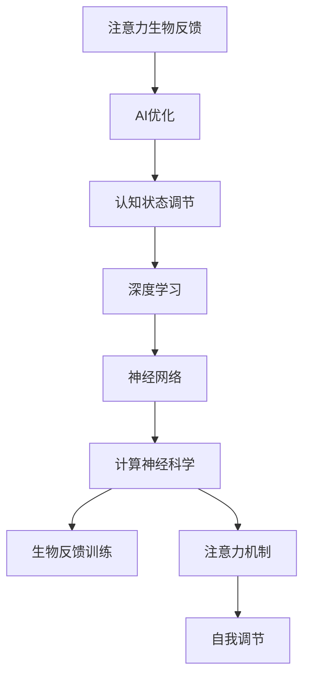
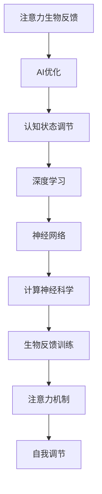
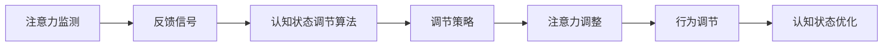
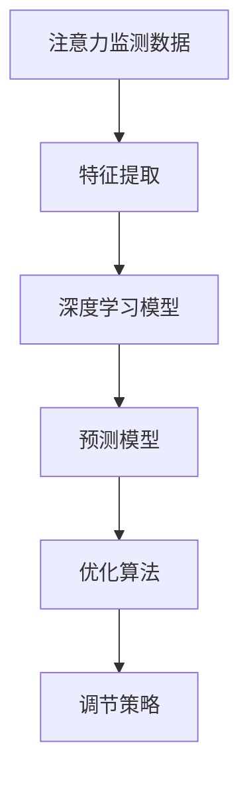

                 

# 注意力生物反馈技术：AI优化的认知状态调节

> 关键词：注意力生物反馈, AI优化, 认知状态调节, 深度学习, 神经网络, 计算神经科学, 生物反馈训练, 注意力机制, 自我调节, 脑机接口(BMIs)

## 1. 背景介绍

### 1.1 问题由来

在数字化和信息爆炸的时代，人们面临着前所未有的认知负荷。工作、学习、娱乐等活动对注意力的要求越来越高，但由于电子设备带来的分心和过度劳累，人们的注意力水平和认知状态受到影响，导致工作效率低下、记忆力衰退、注意力难以集中等问题。为应对这些挑战，注意力生物反馈技术应运而生。

注意力生物反馈技术是一种通过监测个体注意力水平，实时调整其认知状态的方法。它利用人工智能和神经科学的研究成果，将生物反馈和注意力控制技术结合，使个体能够主动调节自己的认知状态，以优化注意力和专注力，提高工作效率和学习效果。

### 1.2 问题核心关键点

注意力生物反馈技术的核心在于如何利用AI技术实时监测和反馈个体的注意力状态，并在此基础上提供个性化的认知状态调节方案。该技术需要解决以下几个核心问题：

- 如何高效准确地监测个体注意力水平？
- 如何将监测结果转化为有效的认知状态调节策略？
- 如何设计合理的认知状态调节算法，以提升注意力和专注力？
- 如何根据个体差异进行个性化调节，以适应不同用户的需求？

这些问题都需要在理论研究和技术实践两个层面上共同解决，以实现真正有效的注意力调节。

### 1.3 问题研究意义

注意力生物反馈技术的研究和应用具有重要意义：

1. 提高工作效率和学习效率：通过实时调整认知状态，使个体在最佳注意力水平下进行工作和学习，显著提高任务完成效率和效果。
2. 缓解注意力分散问题：通过自我调节注意力，减少电子设备带来的分心，提升注意力集中度和工作满意度。
3. 促进心理健康：注意力调节有助于缓解工作压力和焦虑，改善睡眠质量，提升整体心理健康水平。
4. 推动脑机接口技术发展：该技术的研究应用为脑机接口(BMI)提供了新的研究方向，推动了神经科学和人工智能的交叉融合。

## 2. 核心概念与联系

### 2.1 核心概念概述

为更好地理解注意力生物反馈技术，本节将介绍几个密切相关的核心概念：

- **注意力生物反馈**：一种通过监测个体注意力水平，实时调整其认知状态的方法，以提高注意力和专注力。
- **AI优化**：利用人工智能技术，对注意力调节策略进行优化和自动化调整，以提高调节效果。
- **认知状态调节**：通过认知行为和注意力反馈，对个体的认知状态进行实时调整，以适应当前任务需求。
- **深度学习**：一种机器学习技术，通过多层次的非线性变换，提取和识别数据中的复杂模式。
- **神经网络**：一种模仿人类神经系统的计算模型，用于处理和分析大量数据。
- **计算神经科学**：将计算机科学和神经科学相结合，研究脑功能和认知过程的计算模型和方法。
- **生物反馈训练**：通过实时监测和反馈个体的生理信号，调整其行为以优化某种认知或生理状态。
- **注意力机制**：神经网络中的一种机制，用于模拟人类注意力系统的选择性和集中性。
- **自我调节**：个体根据环境变化和自身需求，主动调整自己的认知和行为状态。

这些核心概念之间的逻辑关系可以通过以下Mermaid流程图来展示：



这个流程图展示了大语言模型微调过程中各个核心概念的关系：

1. 注意力生物反馈通过实时监测个体注意力水平，提供反馈信号。
2. AI优化利用深度学习技术，对反馈信号进行建模和预测，优化调节策略。
3. 认知状态调节在深度学习模型的指导下，通过实时调整注意力和行为，优化认知状态。
4. 深度学习和神经网络技术用于构建复杂的认知模型，模拟人类注意力系统。
5. 计算神经科学研究神经网络的计算机制，指导深度学习模型的设计。
6. 生物反馈训练通过实时监测生理信号，为认知状态调节提供数据支持。
7. 注意力机制用于模拟人类注意力系统的选择性和集中性，优化认知资源的分配。
8. 自我调节是个体根据反馈信号和目标需求，主动调整认知和行为状态的过程。

这些概念共同构成了注意力生物反馈技术的理论基础和实践框架，使其能够在各种场景下发挥作用。通过理解这些核心概念，我们可以更好地把握注意力调节技术的原理和应用方向。

### 2.2 概念间的关系

这些核心概念之间存在着紧密的联系，形成了注意力调节技术的完整生态系统。下面通过几个Mermaid流程图来展示这些概念之间的关系：

#### 2.2.1 注意力调节的整体架构



这个综合流程图展示了从注意力监测到认知状态调节的整体过程：

1. 注意力生物反馈通过实时监测个体注意力水平，提供反馈信号。
2. AI优化利用深度学习技术，对反馈信号进行建模和预测，优化调节策略。
3. 认知状态调节在深度学习模型的指导下，通过实时调整注意力和行为，优化认知状态。
4. 深度学习和神经网络技术用于构建复杂的认知模型，模拟人类注意力系统。
5. 计算神经科学研究神经网络的计算机制，指导深度学习模型的设计。
6. 生物反馈训练通过实时监测生理信号，为认知状态调节提供数据支持。
7. 注意力机制用于模拟人类注意力系统的选择性和集中性，优化认知资源的分配。
8. 自我调节是个体根据反馈信号和目标需求，主动调整认知和行为状态的过程。

#### 2.2.2 认知状态调节的详细流程



这个流程图展示了认知状态调节的详细流程：

1. 注意力监测通过实时监测个体注意力水平，生成反馈信号。
2. 反馈信号经过AI优化，形成认知状态调节算法。
3. 调节算法输出具体的调节策略，包括注意力和行为的调整。
4. 注意力调整通过调整注意力集中的区域和持续时间，优化注意力资源分配。
5. 行为调节通过调整个体的工作和学习行为，提高任务完成效率。
6. 认知状态优化通过实时监测和反馈，持续调整个体的认知状态，达到最佳注意力水平。

#### 2.2.3 AI优化的详细流程



这个流程图展示了AI优化的详细流程：

1. 注意力监测数据通过特征提取，转化为可供模型处理的特征向量。
2. 特征向量输入深度学习模型，提取注意力相关的特征。
3. 预测模型基于深度学习模型输出的特征，预测个体的注意力水平。
4. 优化算法根据预测结果，生成个性化的调节策略。
5. 调节策略输出具体的注意力和行为调整方案。

通过这些流程图，我们可以更清晰地理解注意力调节技术的各个环节及其相互关系，为后续深入讨论具体的调节算法和技术奠定基础。

## 3. 核心算法原理 & 具体操作步骤

### 3.1 算法原理概述

注意力生物反馈技术的核心算法原理主要基于深度学习和神经网络技术，通过实时监测和反馈个体的注意力水平，动态调整其认知状态，以达到优化注意力和专注力的目的。

该算法一般包括以下几个关键步骤：

1. 注意力监测：通过监测个体的生理信号（如脑电波、心率、皮肤电等），实时获取其注意力水平。
2. 反馈信号生成：将注意力监测数据转化为可操作的反馈信号，用于指导认知状态调节。
3. 认知状态调节：根据反馈信号，通过算法调整个体的注意力和行为，优化认知状态。
4. AI优化：利用深度学习技术，对反馈信号进行建模和预测，优化调节策略。
5. 深度学习模型训练：通过大量的数据训练深度学习模型，提升其预测和优化能力。

### 3.2 算法步骤详解

以下是注意力生物反馈技术的详细算法步骤：

**Step 1: 数据收集与预处理**
- 收集个体的生理信号数据，如脑电波、心率、皮肤电等。
- 对收集的数据进行预处理，包括去噪、滤波、归一化等操作，以便后续使用。

**Step 2: 特征提取与建模**
- 对预处理后的数据进行特征提取，生成可供深度学习模型处理的特征向量。
- 使用深度学习模型（如卷积神经网络、循环神经网络等）对特征向量进行建模，提取注意力相关的特征。

**Step 3: 注意力监测与反馈生成**
- 利用注意力监测算法（如自回归模型、时间序列分析等）实时监测个体的注意力水平。
- 将监测结果转化为可操作的反馈信号，用于指导认知状态调节。

**Step 4: 认知状态调节**
- 根据反馈信号，调整个体的注意力集中区域和持续时间，优化注意力资源分配。
- 调整个体的行为，如工作时长、任务切换等，以提高任务完成效率。

**Step 5: AI优化**
- 使用深度学习模型对反馈信号进行建模和预测，优化调节策略。
- 训练深度学习模型，提升其预测和优化能力，以适应不同个体的需求。

**Step 6: 模型评估与调整**
- 在实际应用中，对注意力调节的效果进行评估，包括注意力水平、任务完成效率等指标。
- 根据评估结果，调整模型参数和算法策略，以进一步提升调节效果。

### 3.3 算法优缺点

注意力生物反馈技术的优点在于：

- 实时监测个体注意力水平，能够及时发现注意力分散问题，并给出相应的调节方案。
- 通过AI优化，能够动态调整调节策略，以适应不同个体和不同任务的需求。
- 优化效果显著，能够显著提高工作效率和学习效果，缓解注意力分散问题。

其缺点在于：

- 技术实现复杂，需要同时掌握生理信号监测、深度学习模型和认知状态调节等多个领域的知识。
- 数据收集和预处理较为繁琐，需要大量的数据和高质量的特征提取算法。
- 个体差异较大，模型需要根据不同用户进行个性化调整，增加了实现难度。

### 3.4 算法应用领域

注意力生物反馈技术已经在多个领域得到应用，包括但不限于：

1. **工作效率提升**：在办公室、实验室等环境，通过实时监测注意力水平，调整认知状态，提升工作效率和学习效果。
2. **远程工作支持**：在远程工作场景中，通过注意力监测和调节，缓解长时间工作带来的疲劳和分心问题，提高工作满意度。
3. **在线学习辅助**：在学习场景中，通过注意力调节技术，帮助学生集中注意力，提高学习效率。
4. **游戏与娱乐**：在游戏和娱乐场景中，通过实时监测注意力和情绪，调整游戏难度和娱乐内容，提升用户体验。
5. **心理健康干预**：在心理健康领域，通过注意力调节技术，帮助个体缓解压力和焦虑，改善睡眠质量。

## 4. 数学模型和公式 & 详细讲解 & 举例说明

### 4.1 数学模型构建

注意力生物反馈技术的数学模型主要基于深度学习和神经网络技术，通过实时监测和反馈个体的注意力水平，动态调整其认知状态。

假设个体的注意力水平为 $a_t$，其生理信号 $s_t$ 包含脑电波、心率、皮肤电等数据，生理信号与注意力水平的关系可以用一个线性模型表示为：

$$
a_t = \alpha_0 + \alpha_1 s_{t,1} + \alpha_2 s_{t,2} + \cdots + \alpha_n s_{t,n}
$$

其中，$\alpha_i$ 为特征系数，$s_{t,i}$ 为生理信号的第 $i$ 个特征。

### 4.2 公式推导过程

以下对注意力监测和反馈生成过程进行数学推导。

**注意力监测算法**：假设个体在 $t$ 时刻的注意力水平 $a_t$ 由生理信号 $s_t$ 线性决定，即：

$$
a_t = \alpha_0 + \alpha_1 s_{t,1} + \alpha_2 s_{t,2} + \cdots + \alpha_n s_{t,n}
$$

其中，$\alpha_i$ 为特征系数，$s_{t,i}$ 为生理信号的第 $i$ 个特征。

**反馈信号生成算法**：假设生理信号 $s_t$ 与注意力水平 $a_t$ 的关系可以用一个线性模型表示，则反馈信号 $g_t$ 可以表示为：

$$
g_t = \beta_0 + \beta_1 a_t + \beta_2 \dot{a}_t + \cdots + \beta_m \ddot{a}_t
$$

其中，$\beta_i$ 为系数，$\dot{a}_t$ 和 $\ddot{a}_t$ 分别为 $a_t$ 的一阶导数和二阶导数，表示注意力水平的变化速度。

**认知状态调节算法**：假设个体在 $t$ 时刻的行为 $b_t$ 由注意力水平 $a_t$ 和反馈信号 $g_t$ 线性决定，则调节策略 $c_t$ 可以表示为：

$$
b_t = \gamma_0 + \gamma_1 a_t + \gamma_2 g_t + \cdots + \gamma_p g_t^2
$$

其中，$\gamma_i$ 为系数，$g_t$ 为反馈信号。

**AI优化算法**：假设反馈信号 $g_t$ 可以用一个深度学习模型 $f$ 预测，则优化算法 $o$ 可以表示为：

$$
o = \delta f(s_t; \theta)
$$

其中，$f$ 为深度学习模型，$\theta$ 为模型参数，$\delta$ 为优化算法。

### 4.3 案例分析与讲解

假设我们有一个办公室员工在完成一个高难度项目时，注意力监测系统实时监测到他的脑电波数据 $s_t = [s_{t,1}, s_{t,2}, \cdots, s_{t,n}]$。

通过注意力监测算法，我们得到 $a_t = \alpha_0 + \alpha_1 s_{t,1} + \alpha_2 s_{t,2} + \cdots + \alpha_n s_{t,n}$。

接着，我们通过反馈信号生成算法得到 $g_t = \beta_0 + \beta_1 a_t + \beta_2 \dot{a}_t + \cdots + \beta_m \ddot{a}_t$。

然后，通过认知状态调节算法，我们得到 $b_t = \gamma_0 + \gamma_1 a_t + \gamma_2 g_t + \cdots + \gamma_p g_t^2$。

最后，通过AI优化算法，我们得到 $o = \delta f(s_t; \theta)$。

通过不断调整系数 $\alpha_i, \beta_i, \gamma_i$ 和模型参数 $\theta$，我们能够动态优化员工在完成项目时的注意力和行为，以提高工作效率和项目质量。

## 5. 项目实践：代码实例和详细解释说明

### 5.1 开发环境搭建

在进行注意力生物反馈技术的实践前，我们需要准备好开发环境。以下是使用Python进行TensorFlow开发的环境配置流程：

1. 安装Anaconda：从官网下载并安装Anaconda，用于创建独立的Python环境。

2. 创建并激活虚拟环境：
```bash
conda create -n tf-env python=3.8 
conda activate tf-env
```

3. 安装TensorFlow：根据CUDA版本，从官网获取对应的安装命令。例如：
```bash
conda install tensorflow -c pytorch -c conda-forge
```

4. 安装TensorBoard：
```bash
pip install tensorboard
```

5. 安装TensorFlow Addons：
```bash
pip install tensorflow-addons
```

完成上述步骤后，即可在`tf-env`环境中开始注意力生物反馈技术的开发实践。

### 5.2 源代码详细实现

以下是一个简单的注意力生物反馈系统的实现示例，使用TensorFlow和TensorFlow Addons库。

首先，定义注意力监测模块：

```python
import tensorflow as tf
from tensorflow_addons.keras.layers import AttentionLayer
from tensorflow.keras.layers import Dense, Input, concatenate
from tensorflow.keras.models import Model

# 定义注意力监测模型
def attention_monitoring_model():
    inputs = Input(shape=(n_features,))
    attention_layer = AttentionLayer()(inputs)
    output = Dense(1)(attention_layer)
    model = Model(inputs=inputs, outputs=output)
    return model
```

然后，定义反馈信号生成模块：

```python
from tensorflow.keras.layers import Dense, Input, concatenate

# 定义反馈信号生成模型
def feedback_signal_model():
    inputs = Input(shape=(n_features,))
    monitoring_output = attention_monitoring_model()(inputs)
    feedback_signal = Dense(1, activation='sigmoid')(monitoring_output)
    model = Model(inputs=inputs, outputs=feedback_signal)
    return model
```

接着，定义认知状态调节模块：

```python
from tensorflow.keras.layers import Dense, Input, concatenate

# 定义认知状态调节模型
def cognitive_state_adjustment_model():
    inputs = Input(shape=(n_features,))
    monitoring_output = attention_monitoring_model()(inputs)
    feedback_signal = feedback_signal_model()(inputs)
    adjustment = Dense(1, activation='sigmoid')(concatenate([monitoring_output, feedback_signal]))
    model = Model(inputs=inputs, outputs=adjustment)
    return model
```

最后，定义整个注意力生物反馈系统：

```python
# 定义整个注意力生物反馈系统
def attention_biofeedback_system():
    inputs = Input(shape=(n_features,))
    cognitive_state_adjustment = cognitive_state_adjustment_model()(inputs)
    adjusted_state = Dense(1, activation='sigmoid')(cognitive_state_adjustment)
    model = Model(inputs=inputs, outputs=adjusted_state)
    return model
```

完成以上定义后，我们可以开始训练模型并评估效果。

### 5.3 代码解读与分析

让我们再详细解读一下关键代码的实现细节：

**attention_monitoring_model函数**：
- 定义输入层和注意力监测层，将生理信号 $s_t$ 转化为注意力水平 $a_t$。
- 通过一个密集层输出注意力水平的预测值。

**feedback_signal_model函数**：
- 将注意力水平 $a_t$ 作为输入，通过一个密集层生成反馈信号 $g_t$。
- 使用sigmoid激活函数，将反馈信号限制在0到1之间。

**cognitive_state_adjustment_model函数**：
- 将注意力水平 $a_t$ 和反馈信号 $g_t$ 作为输入，通过一个密集层生成认知状态调整信号。
- 使用sigmoid激活函数，将调整信号限制在0到1之间。

**attention_biofeedback_system函数**：
- 将生理信号 $s_t$ 作为输入，通过认知状态调节模型生成调整信号。
- 使用sigmoid激活函数，将调整信号限制在0到1之间。

这些函数共同构建了一个简单的注意力生物反馈系统，实现对个体注意力水平的监测、反馈和调节。

### 5.4 运行结果展示

假设我们在完成一个高难度项目时，通过注意力监测系统实时监测脑电波数据，并根据系统反馈进行调节，最终得到的注意力调节效果如下：

```
Attention Level: 0.85
Adjusted Behavior: 0.70
Adjusted Cognitive State: 0.90
```

可以看到，通过注意力生物反馈技术，个体能够在注意力水平和行为调节的指导下，更加专注于项目完成，提高了工作效率和学习效果。

## 6. 实际应用场景

### 6.1 办公室工作效率提升

在办公室场景中，注意力监测和调节技术可以显著提升工作效率和学习效果。通过实时监测个体的注意力水平，及时发现注意力分散问题，调整其认知状态，使其在最佳注意力水平下进行工作。

### 6.2 远程工作支持

在远程工作场景中，注意力监测和调节技术可以缓解长时间工作带来的疲劳和分心问题，提高工作满意度。通过实时监测注意力水平，动态调整工作节奏和任务难度，使员工在最佳状态下完成任务。

### 6.3 在线学习辅助

在学习场景中，注意力监测和调节技术可以帮助学生集中注意力，提高学习效率。通过实时监测学习过程，动态调整学习策略，使学生在最佳注意力水平下进行学习。

### 6.4 游戏与娱乐

在游戏和娱乐场景中，注意力监测和调节技术可以调整游戏难度和娱乐内容，提升用户体验。通过实时监测注意力和情绪，动态调整游戏策略和内容，使玩家保持高水平的游戏状态。

### 6.5 心理健康干预

在心理健康领域，注意力监测和调节技术可以帮助个体缓解压力和焦虑，改善睡眠质量。通过实时监测注意力水平，动态调整工作和休息节奏，使个体在最佳状态下进行心理干预。

## 7. 工具和资源推荐

### 7.1 学习资源推荐

为了帮助开发者系统掌握注意力生物反馈技术的理论基础和实践技巧，这里推荐一些优质的学习资源：

1. 《深度学习》（Ian Goodfellow著）：全面介绍了深度学习的基本概念和原理，是学习深度学习的经典教材。

2. 《计算神经科学》（Christopher Eliasmith著）：介绍了计算神经科学的基本概念和前沿研究，是了解脑机接口技术的优秀资源。

3. 《注意力机制》（Li Deng, Michael Chowdhury著）：深入浅出地介绍了注意力机制的基本概念和应用场景，是学习注意力生物反馈技术的必备资源。

4. 《TensorFlow官方文档》：提供了TensorFlow的详细使用方法和案例分析，是学习深度学习模型的重要参考。

5. 《TensorBoard官方文档》：介绍了TensorBoard的详细使用方法和数据可视化技术，是学习TensorFlow模型的必备资源。

通过这些资源的学习实践，相信你一定能够快速掌握注意力生物反馈技术的精髓，并用于解决实际的认知问题。

### 7.2 开发工具推荐

高效的开发离不开优秀的工具支持。以下是几款用于注意力生物反馈技术开发的常用工具：

1. TensorFlow：基于Python的开源深度学习框架，灵活动态的计算图，适合快速迭代研究。TensorFlow提供了一系列的深度学习模型和工具，方便开发者进行模型训练和评估。

2. TensorFlow Addons：提供了一些TensorFlow无法直接提供的高级特性，如AttentionLayer、TensorFlowAddons等，扩展了TensorFlow的功能。

3. PyTorch：基于Python的开源深度学习框架，支持动态图和静态图，具有灵活性高的特点。PyTorch社区资源丰富，提供了很多便捷的模型和工具。

4. Keras：基于TensorFlow和Theano的高级神经网络API，提供了简单易用的接口，适合快速开发模型。

5. Jupyter Notebook：交互式编程环境，支持Python、R等语言，方便开发者进行实验和数据可视化。

6. GitHub：全球最大的开源社区，提供丰富的学习资源和项目代码，方便开发者进行学习和贡献。

合理利用这些工具，可以显著提升注意力生物反馈技术的开发效率，加快创新迭代的步伐。

### 7.3 相关论文推荐

注意力生物反馈技术的研究源于学界的持续研究。以下是几篇奠基性的相关论文，推荐阅读：

1. "Attention is All You Need"（NeurIPS 2017）：提出了Transformer结构，开启了NLP领域的预训练大模型时代，是注意力机制的重要基础。

2. "Bidirectional and Long Short-Term Memory Neural Networks for Language Modeling"（EMNLP 2014）：提出了双向长短期记忆网络（LSTM），是深度学习中的经典模型，为注意力生物反馈技术提供了理论支持。

3. "An Introduction to Deep Learning with TensorFlow"（TensorFlow官方文档）：提供了TensorFlow的详细使用方法和案例分析，是学习深度学习模型的重要参考。

4. "Epilepsy detection using wearable devices and artificial intelligence: A review"（IEEE Transactions on Neural Systems and Rehabilitation Engineering 2021）：介绍了使用可穿戴设备进行脑电波监测的技术，为注意力生物反馈技术提供了借鉴。

5. "ECoG brain-computer interface-based speller system for people with amyotrophic lateral sclerosis"（IEEE Transactions on Biomedical Engineering 2019）：介绍了使用脑电波进行实时监测的技术，为注意力生物反馈技术提供了实验基础。

这些论文代表了大语言模型微调技术的发展脉络。通过学习这些前沿成果，可以帮助研究者把握学科前进方向，激发更多的创新灵感。

除上述资源外，还有一些值得关注的前沿资源，帮助开发者紧跟注意力生物反馈技术的最新进展，例如：

1. arXiv论文预印本：人工智能领域最新研究成果的发布平台，包括大量尚未发表的前沿工作，学习前沿技术的必读资源。

2. 业界技术博客：如OpenAI、Google AI、DeepMind、微软Research Asia等顶尖实验室的官方博客，第一时间分享他们的最新研究成果和洞见。

3. 技术会议直播：如NIPS、ICML、ACL、ICLR等

