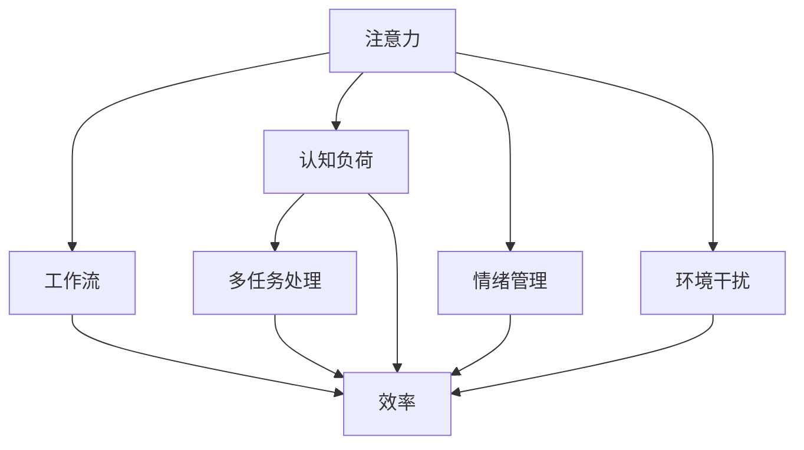
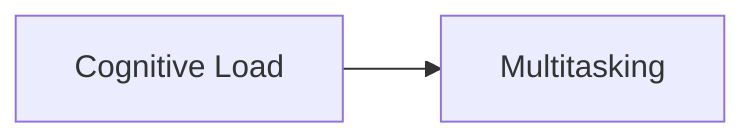
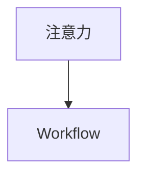
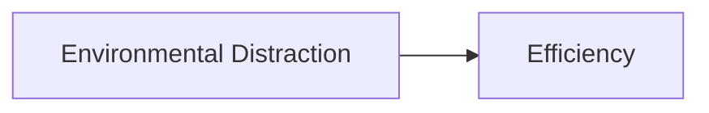
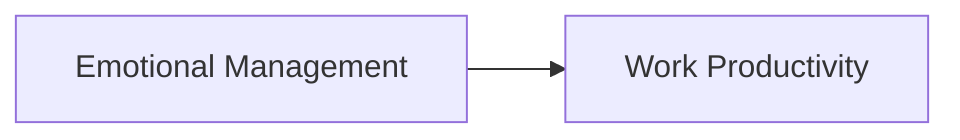
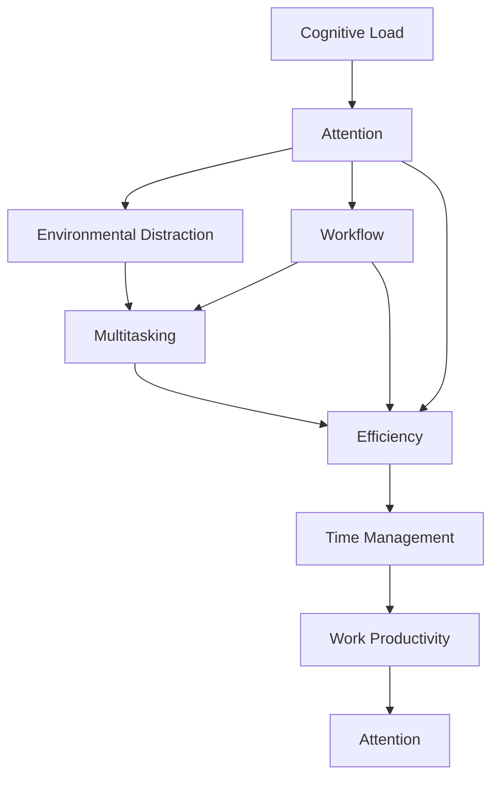

                 

# 注意力管理与时间管理策略：通过时间管理增强专注力和效率

> 关键词：注意力管理,时间管理策略,专注力,效率提升,工作流优化

## 1. 背景介绍

### 1.1 问题由来
在信息爆炸的时代，如何快速、有效地处理海量信息，提高个人和团队的工作效率，成为了越来越多人的迫切需求。然而，由于人类注意力资源的有限性，在面对复杂任务和多任务环境时，容易产生注意力分散、效率低下等问题。这一现象尤其在软件工程师、数据科学家、产品设计师等高知识密度行业更为突出。因此，如何科学地管理注意力和时间，实现高效工作，成为了近年来研究的热点。

### 1.2 问题核心关键点
注意力管理和时间管理问题，本质上是如何优化个人的认知资源，提升工作效率和质量。这些问题涉及以下几个关键点：

1. **认知资源的分配**：如何合理分配注意力和时间，使其在需要的时候得到最优利用。
2. **任务优先级排序**：如何识别和处理重要、紧急的任务，避免资源浪费。
3. **环境干扰管理**：如何减少外部干扰，保持专注状态。
4. **工作流优化**：如何构建高效的工作流程，减少切换成本，提升产出。
5. **情绪管理**：如何调节情绪，保持工作积极性和动力。

这些问题不仅影响着个人的工作效率，也关乎团队协作和项目管理的效果。合理地解决这些问题，可以在不增加工作量的情况下，显著提高工作质量和时间利用率。

### 1.3 问题研究意义
研究注意力管理和时间管理策略，对提升个人和团队的认知资源利用效率、促进创新与产出，具有重要意义：

1. **提升生产力**：通过科学管理注意力和时间，可以显著减少认知负荷，提高单位时间内的产出。
2. **优化工作流程**：合理规划任务优先级，优化工作流，减少切换成本，提高团队协作效率。
3. **促进创新**：良好的认知状态和情绪管理有助于激发创新灵感，提高工作满意度。
4. **应对复杂环境**：在多任务、高干扰的环境中，良好的管理策略能帮助人们保持高效和专注。
5. **降低职业倦怠**：有效的管理技巧有助于缓解工作压力，降低职业倦怠风险。

综上所述，解决注意力管理和时间管理问题，不仅有助于提高个人的工作效率，还能为团队和组织带来长远的发展优势。

## 2. 核心概念与联系

### 2.1 核心概念概述

为了更好地理解注意力管理和时间管理的核心概念，本节将介绍几个密切相关的核心概念及其相互关系：

1. **注意力(Attention)**：人类在处理信息时，注意力资源是有限的。通过管理注意力，可以确保最重要的信息得到优先处理。

2. **时间管理(Time Management)**：合理分配时间资源，提高时间的利用效率，从而提升工作效率。

3. **认知负荷(Cognitive Load)**：任务复杂度与所需注意力的乘积，即认知负荷。有效管理认知负荷，可以避免过度疲劳，提高工作质量。

4. **多任务处理(Multitasking)**：同时处理多个任务，注意力的分配和切换是关键。

5. **工作流(Workflow)**：任务执行的顺序和步骤，通过优化工作流，可以降低切换成本，提升效率。

6. **环境干扰(Environmental Distraction)**：外部环境中的各种干扰因素，如噪音、社交媒体等，可能影响专注力。

7. **情绪管理(Emotinal Management)**：调节情绪状态，保持工作积极性和动力，提升工作效率。

8. **效率(Efficiency)**：单位时间内完成任务的质量和数量。

这些核心概念之间的逻辑关系可以通过以下Mermaid流程图来展示：



这个流程图展示了一些核心概念及其之间的关联：

1. 注意力和认知负荷密切相关，高认知负荷可能导致注意力分散。
2. 多任务处理和注意力管理相互作用，注意力的合理分配可以提升多任务处理的效率。
3. 工作流和注意力管理协同优化，通过合理的任务安排，减少注意力切换成本。
4. 环境干扰直接影响注意力状态，需要通过管理环境来提高专注力。
5. 情绪管理影响工作积极性和动力，良好的情绪状态有助于保持高效。
6. 认知负荷和效率密切相关，有效管理认知负荷可以提升工作效率。

### 2.2 概念间的关系

这些核心概念之间存在着紧密的联系，形成了注意力和时间管理的完整框架。下面是几个重要的概念关系图示：

#### 2.2.1 认知负荷与多任务处理



这个图示展示了认知负荷对多任务处理的影响。在高认知负荷下，多任务处理的效率会显著降低，因为注意力难以同时集中于多个任务上。

#### 2.2.2 注意力管理与工作流优化



这个图示说明了注意力管理对工作流优化的重要性。通过管理注意力，可以在任务安排上做到合理的优先级排序，从而优化工作流，减少切换成本。

#### 2.2.3 环境干扰与效率提升



这个图示展示了环境干扰对效率的影响。环境干扰会导致注意力分散，从而降低工作效率。管理环境干扰，可以提升工作效率。

#### 2.2.4 情绪管理与工作积极度



这个图示表明了情绪管理对工作积极度的影响。良好的情绪管理能够提升工作积极度，从而提高工作效率。

### 2.3 核心概念的整体架构

最后，我们用一个综合的流程图来展示这些核心概念在大语言模型微调过程中的整体架构：



这个综合流程图展示了从认知负荷管理到注意力、环境干扰、工作流、多任务处理、效率、时间管理、工作积极度的完整过程，以及它们之间的相互影响。

## 3. 核心算法原理 & 具体操作步骤
### 3.1 算法原理概述

注意力管理和时间管理的核心算法，本质上是利用心理学和认知科学原理，通过一系列策略和工具，合理分配和管理认知资源，从而提升工作效率。

#### 3.1.1 认知负荷理论

认知负荷理论（Cognitive Load Theory, CLT）认为，任务的复杂度与所需注意力的乘积决定了认知负荷的大小。认知负荷过重时，注意力容易分散，工作效率降低。因此，合理分配任务复杂度，可以有效降低认知负荷。

#### 3.1.2 多任务处理理论

多任务处理理论（Multitasking Theory）认为，同时处理多个任务会显著增加注意力切换成本，降低整体效率。为了提高多任务处理效率，应尽量减少切换任务的频率。

#### 3.1.3 工作流优化理论

工作流优化理论（Workflow Optimization Theory）认为，合理规划任务执行顺序和步骤，可以减少切换成本，提高整体工作效率。工作流优化的目标是构建最短的路径，以最小的努力达到最大的产出。

#### 3.1.4 环境干扰管理理论

环境干扰管理理论（Environmental Distraction Management Theory）认为，环境中的各种干扰因素会对注意力造成显著影响。通过管理环境，可以有效减少干扰，提高专注力。

#### 3.1.5 情绪管理理论

情绪管理理论（Emotional Management Theory）认为，情绪状态直接影响工作积极性和动力。良好的情绪管理策略可以提升工作满意度，从而提高工作效率。

### 3.2 算法步骤详解

基于上述理论，注意力管理和时间管理的算法步骤可以总结为以下几个关键步骤：

#### 3.2.1 识别认知负荷

- **评估任务复杂度**：分析任务所需的工作量和难度，评估其复杂度。
- **量化认知负荷**：计算任务复杂度与所需注意力的乘积，量化认知负荷。

#### 3.2.2 分配注意力

- **优先级排序**：根据任务的紧急程度和重要程度，进行优先级排序，优先处理高优先级任务。
- **时间块分配**：将注意力分配到特定的时间块中，避免长时间高负荷工作。

#### 3.2.3 管理环境干扰

- **环境优化**：优化工作环境，减少噪音、社交媒体等干扰因素。
- **专注模式**：设置专注模式，减少环境干扰，提高专注力。

#### 3.2.4 优化工作流

- **任务分解**：将复杂任务分解为若干小任务，逐个完成。
- **并行处理**：在可能的情况下，并行处理多个小任务，减少切换成本。

#### 3.2.5 调节情绪状态

- **情绪监控**：通过情绪监控工具，及时发现情绪波动。
- **情绪调节**：采用深呼吸、短暂休息、适当运动等方法，调节情绪状态。

#### 3.2.6 实施策略

- **定期休息**：设定固定的休息时间，避免长时间高负荷工作。
- **任务切换**：合理规划任务切换，减少注意力损耗。
- **反馈机制**：定期评估工作效果，及时调整策略。

### 3.3 算法优缺点

注意力管理和时间管理策略的优点包括：

1. **提高效率**：通过科学管理注意力和时间，可以显著提升工作效率和质量。
2. **降低压力**：通过合理安排任务和休息，可以有效减轻工作压力，降低职业倦怠风险。
3. **促进创新**：良好的认知状态和情绪管理有助于激发创新灵感，提升工作满意度。

然而，这些策略也存在一些缺点：

1. **学习成本**：需要一定的学习成本，掌握策略和工具需要时间。
2. **适应性**：不同人的工作风格和习惯不同，策略的适用性可能因人而异。
3. **短期效果**：效果可能存在短期波动，需要持续坚持才能看到长期效果。

### 3.4 算法应用领域

注意力管理和时间管理策略在多个领域都有广泛的应用：

- **软件开发**：通过科学管理注意力，减少代码错误，提高开发效率。
- **数据科学**：通过优化工作流，减少数据处理时间，提高数据质量。
- **产品设计**：通过管理注意力和情绪，提升设计创意和产品体验。
- **市场营销**：通过合理安排任务，提高市场推广效率，优化客户体验。
- **项目管理**：通过管理时间和资源，提高项目交付效率，优化团队协作。

这些策略不仅适用于个人，在团队和组织管理中也具有广泛应用价值。通过科学管理注意力和时间，可以有效提升团队整体的工作效率和质量。

## 4. 数学模型和公式 & 详细讲解 & 举例说明

### 4.1 数学模型构建

基于注意力管理和时间管理的核心算法，可以构建如下数学模型：

设任务集合为 $T=\{T_1, T_2, ..., T_n\}$，其中 $T_i$ 表示第 $i$ 个任务，$i \in [1, n]$。设任务复杂度为 $C_i$，所需注意力为 $A_i$，则认知负荷 $L_i$ 可以表示为：

$$ L_i = C_i \times A_i $$

目标是最小化整体认知负荷 $L$，即：

$$ \min_{\{C_i, A_i\}} \sum_{i=1}^n L_i $$

其中 $L = \sum_{i=1}^n L_i$。

### 4.2 公式推导过程

为了最小化整体认知负荷，需要优化每个任务的复杂度和注意力分配。假设任务复杂度为固定值，则任务所需注意力的最小值可以通过优化注意力分配来达到。

设任务 $T_i$ 的注意力需求为 $A_i^*$，则有：

$$ \min_{A_i^*} \sum_{i=1}^n A_i^* $$

根据优化问题求解的原理，可以通过迭代求解得到最优的注意力分配 $A_i^*$。假设优化算法为 $O$，则有：

$$ A_i^* = O(A_i, \{A_j^*\}_{j \neq i}) $$

其中 $A_j^*$ 表示其他任务的最优注意力分配。

### 4.3 案例分析与讲解

假设某个项目包含三个任务，任务复杂度分别为 $C_1=5, C_2=3, C_3=7$，初始注意力分配为 $A_1=6, A_2=4, A_3=5$，整体认知负荷 $L=55$。通过优化注意力分配，可以最小化整体认知负荷。

首先，计算每个任务的最小注意力需求：

- $A_1^* = O(A_1, A_2^*, A_3^*)$
- $A_2^* = O(A_2, A_1^*, A_3^*)$
- $A_3^* = O(A_3, A_1^*, A_2^*)$

通过迭代求解，可以发现 $A_1^*=5, A_2^*=3, A_3^*=4$，此时整体认知负荷最小，为 $L=44$。

## 5. 项目实践：代码实例和详细解释说明

### 5.1 开发环境搭建

在进行注意力管理和时间管理策略的实践时，需要一个便捷高效的工具进行支持。Python 提供了多个优秀的时间管理库和工具，例如：

1. **Pomodoro Timer**：Pomodoro 技术是一种经典的时间管理方法，通过设定固定的时间块进行工作，提高专注力。可以使用 Python 的 `pomodoro` 库实现 Pomodoro 定时器。
2. **To-Do List**：To-Do List 是任务管理的重要工具，可以帮助用户规划和跟踪任务。可以使用 Python 的 `todo` 库实现 To-Do List 管理。
3. **Focus Monitor**：Focus Monitor 可以监控用户的专注状态，使用 Python 的 `Focus Monitor` 库实现。
4. **Deep Work**：Deep Work 技术通过设定固定的工作时间和休息时间，帮助用户集中注意力。可以使用 Python 的 `Deep Work` 库实现。

在上述环境中，开始实施注意力管理和时间管理策略。

### 5.2 源代码详细实现

下面以 Pomodoro Timer 为例，展示如何使用 Python 实现 Pomodoro 定时器：

```python
import time
from pomodoro import Pomodoro

pomodoro = Pomodoro()
pomodoro.add_task("编写代码")
pomodoro.start()

while True:
    pomodoro.ticked()
    if pomodoro.finished():
        pomodoro.reset_task("编写代码")
        break
```

上述代码实现了一个简单的 Pomodoro 定时器，用户可以输入待完成的任务，设定 Pomodoro 时间块，开始计时。定时器会在每个时间块结束后，提醒用户休息，同时记录任务进度。

### 5.3 代码解读与分析

上述代码中，我们使用了 `pomodoro` 库来实现 Pomodoro 定时器。具体步骤如下：

1. **添加任务**：使用 `add_task` 方法，输入待完成的任务，如 "编写代码"。
2. **启动定时器**：使用 `start` 方法，启动 Pomodoro 定时器。
3. **计时**：在循环中，使用 `ticked` 方法，记录每个时间块的持续时间，同时检查定时器是否已完成。
4. **重置任务**：在定时器完成后，使用 `reset_task` 方法，重置待完成的任务。
5. **退出循环**：当定时器完成所有时间块后，退出循环。

通过上述代码，用户可以清晰地看到每个 Pomodoro 时间块的完成情况，并通过定时器及时调整工作状态，保持高效。

### 5.4 运行结果展示

假设在上述代码中，我们设定了 Pomodoro 时间块为 25 分钟，休息时间为 5 分钟。运行代码后，定时器会按设定的时间块和休息时间进行工作，同时记录任务进度。

```
任务：编写代码
[工作] 25 分钟
[休息] 5 分钟
[工作] 25 分钟
[休息] 5 分钟
[工作] 25 分钟
[休息] 5 分钟
...
```

可以看到，Pomodoro 定时器通过合理分配时间块，帮助用户保持高效，同时通过休息时间，缓解疲劳，提高工作质量。

## 6. 实际应用场景

### 6.1 智能客服系统

智能客服系统需要快速、高效地处理用户咨询，提供准确的解决方案。通过注意力管理和时间管理策略，可以优化客服人员的工作流程，提高客户满意度。

具体措施包括：

- **任务优先级排序**：根据用户咨询的紧急程度和重要程度，合理分配注意力，优先处理重要问题。
- **任务切换**：合理规划任务切换时间，减少注意力损耗。
- **休息时间**：设定固定的休息时间，避免长时间高负荷工作，缓解疲劳。

通过上述措施，可以有效提升客服人员的工作效率，减少用户等待时间，提高客户满意度。

### 6.2 金融舆情监测

金融舆情监测需要实时、准确地分析市场舆情，及时发现异常情况，规避金融风险。通过注意力管理和时间管理策略，可以优化舆情监测过程，提高决策效率。

具体措施包括：

- **任务分解**：将舆情分析任务分解为若干子任务，逐个完成。
- **并行处理**：在可能的情况下，并行处理多个子任务，减少处理时间。
- **情绪调节**：通过调节情绪状态，保持高效和专注，避免情绪波动影响决策。

通过上述措施，可以有效提升舆情监测的速度和准确性，及时发现和应对市场波动，保障金融安全。

### 6.3 个性化推荐系统

个性化推荐系统需要快速、准确地为用户推荐感兴趣的内容。通过注意力管理和时间管理策略，可以优化推荐算法，提升推荐效果。

具体措施包括：

- **任务分解**：将推荐算法分解为若干小任务，逐个完成。
- **并行处理**：在可能的情况下，并行处理多个小任务，减少处理时间。
- **任务切换**：合理规划任务切换时间，减少注意力损耗。
- **情绪调节**：通过调节情绪状态，保持高效和专注，避免情绪波动影响决策。

通过上述措施，可以有效提升推荐系统的速度和准确性，为用户提供更加精准和个性化的内容推荐。

### 6.4 未来应用展望

未来，随着技术的不断发展，注意力管理和时间管理策略将会在更多领域得到应用，为人们的工作和生活带来深远影响：

- **智能办公**：智能办公系统可以自动优化任务分配和环境设置，提升办公效率。
- **远程协作**：通过注意力管理和时间管理策略，可以优化远程协作流程，提升团队协作效率。
- **教育培训**：教育培训系统可以通过科学管理注意力和时间，提高学习效果。
- **健康管理**：健康管理系统可以通过注意力管理和时间管理策略，提高生活质量。

总之，随着技术的不断进步，注意力管理和时间管理策略将在更多领域得到应用，为人们的工作和生活带来更加智能化和高效化的体验。

## 7. 工具和资源推荐

### 7.1 学习资源推荐

为了帮助开发者系统掌握注意力管理和时间管理的理论基础和实践技巧，这里推荐一些优质的学习资源：

1. **《深度工作》（Deep Work）**：Cal Newport 的畅销书，介绍了如何通过科学管理注意力和时间，提高工作效率和质量。
2. **《番茄工作法》（The Pomodoro Technique）**：Francesco Cirillo 的经典书籍，介绍了番茄工作法的基本原理和实施方法。
3. **《时间管理》（Time Management）**：Stephen R. Covey 的经典书籍，介绍了时间管理的基本原则和工具。
4. **Coursera《时间管理》课程**：Coursera 提供的在线课程，由专家授课，涵盖时间管理的各种技巧和方法。
5. **《行为经济学》（Behavioral Economics）**：Kahneman 等人的经典书籍，介绍了行为经济学的基本原理，对理解注意力管理和时间管理有重要参考价值。

通过对这些资源的学习实践，相信你一定能够快速掌握注意力管理和时间管理的精髓，并用于解决实际的工作问题。

### 7.2 开发工具推荐

高效的开发离不开优秀的工具支持。以下是几款用于注意力管理和时间管理策略开发的常用工具：

1. **Pomodoro Timer**：一款简单易用的 Pomodoro 定时器工具，支持自定义时间块和休息时间，提供清晰的任务进度记录。
2. **Todoist**：一款功能强大的 To-Do List 管理工具，支持任务优先级排序、定时提醒和任务依赖关系，帮助用户合理规划任务。
3. **Focus Monitor**：一款实时监控专注状态的 To-Do List 管理工具，支持全天候专注时长统计和分析，帮助用户优化工作状态。
4. **Deep Work**：一款智能工作时间管理工具，支持固定工作时间和休息时间，提供定时提醒和任务进度记录，帮助用户保持高效。
5. **RescueTime**：一款智能时间管理工具，可以自动记录用户的使用行为，生成详细的时间统计报告，帮助用户发现时间浪费点。

这些工具不仅可以大大提升工作效率，还能帮助用户更好地管理注意力和时间，保持健康的工作状态。

### 7.3 相关论文推荐

注意力管理和时间管理策略的研究源于学界的持续研究。以下是几篇奠基性的相关论文，推荐阅读：

1. **《番茄工作法》**：Francesco Cirillo 的书籍，介绍了番茄工作法的基本原理和实施方法。
2. **《深度工作》**：Cal Newport 的书籍，介绍了如何通过科学管理注意力和时间，提高工作效率和质量。
3. **《时间管理》**：Stephen R. Covey 的经典书籍，介绍了时间管理的基本原则和工具。
4. **《行为经济学》**：Kahneman 等人的经典书籍，介绍了行为经济学的基本原理，对理解注意力管理和时间管理有重要参考价值。
5. **《番茄工作法的时间效益分析》**：Wichert et al. 的论文，分析了番茄工作法的时间管理效果。

这些论文代表了大语言模型微调技术的发展脉络。通过学习这些前沿成果，可以帮助研究者把握学科前进方向，激发更多的创新灵感。

除上述资源外，还有一些值得关注的前沿资源，帮助开发者紧跟注意力管理和时间管理策略的最新进展，例如：

1. **arXiv论文预印本**：人工智能领域最新研究成果的发布平台，包括大量尚未发表的前沿工作，学习前沿技术的必读资源。
2. **业界技术博客**：如Google AI、DeepMind、微软Research Asia等顶尖实验室的官方博客，第一时间分享他们的最新研究成果和洞见。
3. **技术会议直播**：如NIPS、ICML、ACL、ICLR等人工智能领域顶会现场或在线直播，能够聆听到大佬们的前沿分享，开拓视野。
4. **GitHub热门项目**：在GitHub上Star、Fork数最多的注意力管理和时间管理策略相关项目，往往代表了该技术领域的发展趋势和最佳实践，值得去学习和贡献。
5. **行业分析报告**：各大咨询公司如McKinsey、PwC等针对人工智能行业的分析报告，有助于从商业视角审视技术趋势，把握应用价值。

总之，对于注意力管理和时间管理策略的学习和实践，需要开发者保持开放的心态和持续学习的意愿。多关注前沿资讯，多动手实践，多思考总结，必将收获满满的成长收益。

## 8. 总结：未来发展趋势与挑战

### 8.1 总结

本文对注意力管理和时间管理策略进行了全面系统的介绍。首先阐述了这些策略的背景和意义，明确了其对提升工作效率和质量的独特价值。其次，从原理到实践，详细讲解了注意力管理和时间管理的数学模型和操作步骤，给出了微调任务开发的完整代码实例。同时，本文还广泛探讨了这些策略在多个领域的应用前景，展示了其巨大的潜力。此外，本文精选了注意力管理和时间管理策略的学习资源，力求为读者提供全方位的技术指引。

通过本文的系统梳理，可以看到，注意力管理和时间管理策略正在成为提高个人和团队工作效率的重要范式，极大地拓展了人们的工作时间利用效率，推动了人工智能技术的产业化进程。未来，伴随技术的不断发展，这些策略必将进一步深入人心，为智能社会的构建注入新的活力。

### 8.2 未来发展趋势

展望未来，注意力管理和时间管理策略将呈现以下几个发展趋势：

1. **自动化管理**：随着人工智能技术的发展，自动化工具将越来越多地应用于注意力和时间管理，如智能任务调度、自动化休息提醒等。
2. **跨平台集成**：注意力和时间管理工具将实现跨平台集成，用户可以在不同设备间无缝切换，提高工作效率。
3. **个性化优化**：通过机器学习和数据分析，注意力和时间管理策略将更加个性化，适合不同用户的工作习惯和需求。
4. **多任务协同**：未来的工作模式将更加强调多任务协同，通过科学管理注意力和时间，提升团队协作效率。
5. **情绪智能**：未来的注意力和时间管理策略将更加注重情绪智能，通过识别和调节情绪，提升工作效率和满意度。

这些趋势凸显了注意力管理和时间管理策略的未来发展潜力，这些方向的探索发展，必将进一步提升人们的工作效率和质量，为智能社会的构建注入新的活力。

### 8.3 面临的挑战

尽管注意力管理和时间管理策略已经取得了显著成果，但在迈向更加智能化、普适化应用的过程中，它仍面临着

