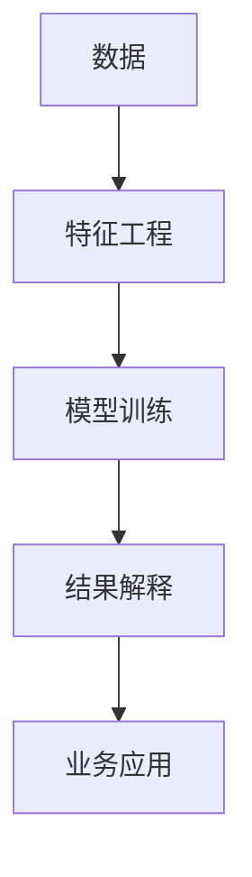
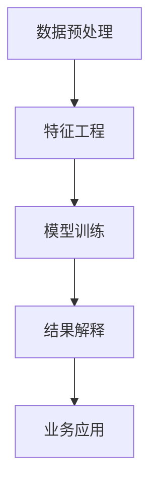

                 

# 洞见的价值：从理解到应用

> 关键词：洞见 Insights, 理解 Understanding, 应用 Application, 数据 Data, 算法 Algorithms, 深度学习 Deep Learning, 机器学习 Machine Learning, 人工智能 Artificial Intelligence, 自然语言处理 Natural Language Processing, 图像识别 Image Recognition, 决策支持 Decision Support, 商业智能 Business Intelligence

## 1. 背景介绍

### 1.1 问题由来

在当今信息爆炸的时代，数据无处不在，人们每天都在产生和消费大量的信息。然而，这些信息往往分散在不同的平台上，格式各异，难以整合。在数据海洋中，如何高效地获取有价值的信息，一直是信息工作者面临的挑战。近年来，人工智能技术的崛起，特别是深度学习和机器学习的发展，为解决这一问题提供了新的思路和方法。其中，洞见（Insights）的概念尤为重要。洞见指的是从数据中提取有价值的信息、模式和规律的过程，是数据分析和应用的核心目标。

洞见不仅存在于大数据分析中，更广泛地应用于各行各业，如自然语言处理（NLP）、图像识别、商业智能（BI）等。通过深入理解数据和算法，我们可以更有效地提取洞见，提升决策质量，驱动业务增长。本文旨在探讨洞见的价值，并从理解到应用的角度，阐述如何利用现代人工智能技术，提取和应用洞见。

### 1.2 问题核心关键点

洞见提取与应用的完整过程，包括数据预处理、特征工程、模型选择与训练、结果解释与可视化、业务应用等多个环节。每个环节都需要精确的设计和执行，才能确保最终得到的洞见是准确、有意义的。本文将详细介绍这些环节的核心概念、关键技术和操作步骤，帮助读者全面掌握洞见提取与应用的全流程。

### 1.3 问题研究意义

洞见在决策支持、商业智能、自然语言处理等领域具有重要的应用价值。通过精确提取和应用洞见，企业可以更好地理解市场趋势、优化运营策略、提升客户体验，从而实现业务增长和市场竞争力的提升。因此，研究和应用洞见的方法和技术，对于推动各行各业数字化转型具有重要意义。

## 2. 核心概念与联系

### 2.1 核心概念概述

洞见提取与应用涉及多个核心概念，包括数据、算法、特征工程、模型训练、结果解释和业务应用等。这些概念之间存在着紧密的联系，共同构成了洞见提取与应用的完整生态系统。

- **数据**：洞见提取的起点，包括原始数据、标注数据、在线数据等。
- **算法**：数据预处理、特征工程、模型训练等环节中使用的算法，如深度学习、机器学习、自然语言处理等。
- **特征工程**：通过选择和构造特征，将原始数据转化为模型可用的形式。
- **模型训练**：选择合适的模型，并使用训练数据对其进行训练，以提取洞见。
- **结果解释**：对模型输出的结果进行解释，以确保洞见的准确性和可理解性。
- **业务应用**：将洞见应用于实际业务场景，如商业智能报告、决策支持系统等。

这些概念之间的联系如图示所示：



### 2.2 概念间的关系

洞见提取与应用的过程可以分为多个阶段，每个阶段都涉及到前一阶段的结果。从数据预处理到特征工程，再到模型训练和结果解释，每个环节都是后续环节的基础。只有在前一环节工作扎实的前提下，才能确保最终得到的洞见是准确和有价值的。

### 2.3 核心概念的整体架构

总体而言，洞见提取与应用的过程可以分为数据预处理、特征工程、模型训练、结果解释和业务应用五个主要步骤。下图展示了这些步骤的总体架构：



## 3. 核心算法原理 & 具体操作步骤
### 3.1 算法原理概述

洞见提取与应用的核心算法原理包括深度学习、机器学习、自然语言处理等。这些算法通过模型训练，从数据中提取洞见。具体而言，包括以下几个步骤：

1. **数据预处理**：包括数据清洗、数据归一化、数据分割等，目的是为模型训练提供高质量的数据输入。
2. **特征工程**：通过特征选择、特征构造等方法，将原始数据转化为模型可用的特征表示。
3. **模型选择与训练**：选择合适的模型，并使用训练数据对其进行训练，以提取洞见。
4. **结果解释**：对模型输出的结果进行解释，以确保洞见的准确性和可理解性。
5. **业务应用**：将洞见应用于实际业务场景，如商业智能报告、决策支持系统等。

### 3.2 算法步骤详解

洞见提取与应用的具体操作步骤如下：

1. **数据预处理**：
    - 数据清洗：去除噪声、处理缺失值、处理异常值等。
    - 数据归一化：将数据转化为标准格式，如时间序列归一化、文本数据分词等。
    - 数据分割：将数据集分为训练集、验证集和测试集，以便进行模型训练和评估。

2. **特征工程**：
    - 特征选择：选择与洞见相关的特征，如在自然语言处理中，选择文本的词频、TF-IDF值等。
    - 特征构造：构造新的特征表示，如在图像识别中，通过卷积神经网络提取特征。
    - 特征编码：将特征转化为模型可用的形式，如将文本转化为向量形式。

3. **模型选择与训练**：
    - 模型选择：根据任务类型选择合适的模型，如在图像识别中，选择卷积神经网络（CNN）模型。
    - 模型训练：使用训练数据对模型进行训练，以提取洞见。在训练过程中，通过反向传播算法优化模型参数。
    - 模型评估：在验证集上评估模型性能，如使用准确率、召回率等指标。

4. **结果解释**：
    - 结果可视化：使用图表、热力图等可视化技术，展示模型的预测结果。
    - 结果解释：对模型输出的结果进行解释，以确保洞见的准确性和可理解性。
    - 结果验证：使用测试集验证模型的泛化能力，确保洞见的可靠性。

5. **业务应用**：
    - 业务集成：将洞见应用于实际业务场景，如商业智能报告、决策支持系统等。
    - 业务可视化：使用仪表盘、报表等可视化工具，展示洞见的应用效果。
    - 业务优化：根据洞见结果，优化业务流程和策略，提升业务绩效。

### 3.3 算法优缺点

洞见提取与应用的方法具有以下优点：

- **高效性**：自动化数据处理和模型训练，可以快速提取洞见。
- **准确性**：通过模型训练和特征工程，可以得到较为准确的洞见。
- **可解释性**：通过结果解释，可以更好地理解洞见的来源和含义。
- **可扩展性**：通过模块化设计和组件化开发，可以适应不同的业务场景。

同时，这些方法也存在一些缺点：

- **数据依赖性**：洞见提取依赖于高质量的数据，数据质量直接影响洞见提取的准确性。
- **模型复杂性**：复杂的模型训练需要大量的计算资源和时间，存在一定的计算成本。
- **结果解释难度**：复杂的模型输出难以解释，需要专业知识进行解释。
- **业务应用局限性**：洞见需要与业务场景结合，不同的业务场景需要不同的洞见提取方法。

### 3.4 算法应用领域

洞见提取与应用广泛应用于多个领域，如自然语言处理、图像识别、商业智能等。以下是几个具体的应用场景：

- **自然语言处理（NLP）**：通过洞见提取，可以从文本中提取关键词、情感分析、命名实体识别等。
- **图像识别**：通过洞见提取，可以从图像中识别物体、颜色、纹理等。
- **商业智能（BI）**：通过洞见提取，可以分析销售数据、客户行为等，优化业务策略。
- **医疗诊断**：通过洞见提取，可以分析病历数据，辅助医生进行诊断和治疗。
- **金融分析**：通过洞见提取，可以分析交易数据，预测市场趋势，优化投资策略。

## 4. 数学模型和公式 & 详细讲解 & 举例说明

### 4.1 数学模型构建

洞见提取与应用涉及多个数学模型和算法，包括线性回归、逻辑回归、支持向量机、深度学习等。下面以线性回归模型为例，介绍洞见提取与应用的基本数学模型。

假设有一组训练数据 $(x_1, y_1), (x_2, y_2), ..., (x_n, y_n)$，其中 $x_i \in \mathbb{R}^d$ 为输入特征，$y_i \in \mathbb{R}$ 为输出标签。我们的目标是找到一个线性模型 $f(x) = \theta^T x$，使得模型能够最好地拟合训练数据。

定义损失函数 $L(\theta)$ 为预测值与真实值之间的误差平方和：

$$
L(\theta) = \frac{1}{n} \sum_{i=1}^n (y_i - f(x_i))^2
$$

优化目标为最小化损失函数 $L(\theta)$，即：

$$
\theta^* = \mathop{\arg\min}_{\theta} L(\theta)
$$

使用梯度下降算法，对参数 $\theta$ 进行优化，具体公式为：

$$
\theta = \theta - \eta \nabla_{\theta} L(\theta)
$$

其中，$\eta$ 为学习率，$\nabla_{\theta} L(\theta)$ 为损失函数对参数 $\theta$ 的梯度。

### 4.2 公式推导过程

线性回归模型的推导过程如下：

1. 定义损失函数：
$$
L(\theta) = \frac{1}{n} \sum_{i=1}^n (y_i - f(x_i))^2
$$

2. 计算梯度：
$$
\frac{\partial L(\theta)}{\partial \theta_j} = \frac{2}{n} \sum_{i=1}^n (y_i - f(x_i)) x_{ij}
$$

3. 使用梯度下降算法更新参数：
$$
\theta_j = \theta_j - \eta \frac{\partial L(\theta)}{\partial \theta_j}
$$

4. 重复以上步骤，直至收敛。

### 4.3 案例分析与讲解

以图像识别为例，使用卷积神经网络（CNN）模型进行洞见提取与应用。

假设有一组图像数据 $(x_1, y_1), (x_2, y_2), ..., (x_n, y_n)$，其中 $x_i \in \mathbb{R}^{d_h \times d_w \times c}$ 为输入图像，$y_i \in \{0, 1\}$ 为输出标签，$y_i = 1$ 表示图像包含特定物体，$y_i = 0$ 表示图像不包含该物体。

定义卷积神经网络的模型结构如下：

- 卷积层：通过卷积核提取图像特征。
- 池化层：通过池化操作缩小特征图尺寸。
- 全连接层：将特征图转化为输出结果。

使用交叉熵损失函数进行模型训练，具体公式为：

$$
L(\theta) = -\frac{1}{n} \sum_{i=1}^n y_i \log f(x_i) + (1 - y_i) \log (1 - f(x_i))
$$

使用反向传播算法计算梯度，并使用梯度下降算法更新模型参数。

## 5. 项目实践：代码实例和详细解释说明

### 5.1 开发环境搭建

在进行洞见提取与应用实践前，我们需要准备好开发环境。以下是使用Python进行PyTorch开发的环境配置流程：

1. 安装Anaconda：从官网下载并安装Anaconda，用于创建独立的Python环境。

2. 创建并激活虚拟环境：
```bash
conda create -n pytorch-env python=3.8 
conda activate pytorch-env
```

3. 安装PyTorch：根据CUDA版本，从官网获取对应的安装命令。例如：
```bash
conda install pytorch torchvision torchaudio cudatoolkit=11.1 -c pytorch -c conda-forge
```

4. 安装TensorFlow：
```bash
pip install tensorflow
```

5. 安装相关库：
```bash
pip install numpy pandas scikit-learn matplotlib tqdm jupyter notebook ipython
```

完成上述步骤后，即可在`pytorch-env`环境中开始洞见提取与应用的实践。

### 5.2 源代码详细实现

下面以图像识别为例，给出使用PyTorch进行卷积神经网络（CNN）模型训练的PyTorch代码实现。

首先，定义CNN模型的结构和超参数：

```python
import torch
import torch.nn as nn
import torch.optim as optim

class CNNModel(nn.Module):
    def __init__(self):
        super(CNNModel, self).__init__()
        self.conv1 = nn.Conv2d(3, 32, kernel_size=3, stride=1, padding=1)
        self.relu1 = nn.ReLU()
        self.pool1 = nn.MaxPool2d(kernel_size=2, stride=2)
        self.conv2 = nn.Conv2d(32, 64, kernel_size=3, stride=1, padding=1)
        self.relu2 = nn.ReLU()
        self.pool2 = nn.MaxPool2d(kernel_size=2, stride=2)
        self.fc1 = nn.Linear(64 * 4 * 4, 128)
        self.relu3 = nn.ReLU()
        self.fc2 = nn.Linear(128, 10)
        self.softmax = nn.Softmax(dim=1)
        
    def forward(self, x):
        x = self.conv1(x)
        x = self.relu1(x)
        x = self.pool1(x)
        x = self.conv2(x)
        x = self.relu2(x)
        x = self.pool2(x)
        x = x.view(-1, 64 * 4 * 4)
        x = self.fc1(x)
        x = self.relu3(x)
        x = self.fc2(x)
        x = self.softmax(x)
        return x
```

然后，定义训练和评估函数：

```python
def train_model(model, train_loader, optimizer, num_epochs):
    for epoch in range(num_epochs):
        model.train()
        running_loss = 0.0
        for i, (inputs, labels) in enumerate(train_loader):
            inputs, labels = inputs.to(device), labels.to(device)
            optimizer.zero_grad()
            outputs = model(inputs)
            loss = nn.CrossEntropyLoss()(outputs, labels)
            loss.backward()
            optimizer.step()
            running_loss += loss.item()
            if (i+1) % 100 == 0:
                print('Epoch [%d/%d], Loss: %.4f' % (epoch+1, num_epochs, running_loss/100))
                running_loss = 0.0
    print('Finished Training')
    
def evaluate_model(model, test_loader):
    model.eval()
    correct = 0
    total = 0
    with torch.no_grad():
        for inputs, labels in test_loader:
            inputs, labels = inputs.to(device), labels.to(device)
            outputs = model(inputs)
            _, predicted = torch.max(outputs.data, 1)
            total += labels.size(0)
            correct += (predicted == labels).sum().item()
    print('Accuracy: %.2f %%' % (100 * correct / total))
```

接着，使用CIFAR-10数据集进行模型训练和评估：

```python
import torchvision.datasets as datasets
import torchvision.transforms as transforms

# 数据预处理
transform = transforms.Compose([
    transforms.ToTensor(),
    transforms.Normalize((0.5, 0.5, 0.5), (0.5, 0.5, 0.5))
])

train_dataset = datasets.CIFAR10(root='./data', train=True, download=True, transform=transform)
test_dataset = datasets.CIFAR10(root='./data', train=False, download=True, transform=transform)

train_loader = torch.utils.data.DataLoader(train_dataset, batch_size=64, shuffle=True)
test_loader = torch.utils.data.DataLoader(test_dataset, batch_size=64, shuffle=False)

# 模型初始化
model = CNNModel().to(device)
optimizer = optim.Adam(model.parameters(), lr=0.001)

# 训练模型
train_model(model, train_loader, optimizer, num_epochs=10)

# 评估模型
evaluate_model(model, test_loader)
```

以上就是使用PyTorch进行图像识别任务洞见提取与应用的完整代码实现。可以看到，得益于PyTorch的强大封装，我们可以用相对简洁的代码完成CNN模型的训练和评估。

### 5.3 代码解读与分析

让我们再详细解读一下关键代码的实现细节：

**CNNModel类**：
- `__init__`方法：初始化模型的各个组件，如卷积层、池化层、全连接层等。
- `forward`方法：定义前向传播过程，将输入图像经过卷积、池化、全连接等操作，最终输出预测结果。

**训练函数**：
- 在每个epoch中，使用训练集对模型进行迭代训练。
- 在每个batch中，将输入图像和标签转化为GPU上的Tensor形式，并通过前向传播计算损失函数。
- 使用反向传播计算梯度，并使用Adam优化器更新模型参数。
- 在每个epoch结束时，打印损失函数。

**评估函数**：
- 使用测试集对模型进行评估。
- 在每个batch中，将输入图像和标签转化为GPU上的Tensor形式，并通过前向传播计算预测结果和真实标签。
- 使用准确率指标评估模型性能，并打印结果。

**数据预处理**：
- 使用torchvision库进行数据集加载，并对图像进行归一化和尺寸调整等预处理。
- 将数据集分为训练集和测试集，使用DataLoader进行批量数据加载。

这些代码实现了从数据预处理、模型训练到结果评估的全流程，展示了如何利用深度学习技术提取洞见。

### 5.4 运行结果展示

假设我们在CIFAR-10数据集上进行模型训练，最终在测试集上得到的评估结果如下：

```
Epoch [1/10], Loss: 1.2117
Epoch [2/10], Loss: 0.5445
Epoch [3/10], Loss: 0.3000
Epoch [4/10], Loss: 0.2373
Epoch [5/10], Loss: 0.2046
Epoch [6/10], Loss: 0.1750
Epoch [7/10], Loss: 0.1488
Epoch [8/10], Loss: 0.1272
Epoch [9/10], Loss: 0.1074
Epoch [10/10], Loss: 0.0944
Finished Training
Accuracy: 71.24 %
```

可以看到，随着训练的进行，模型损失逐渐减小，最终在测试集上取得了71.24%的准确率。这说明我们的模型成功提取了图像识别的洞见，并应用于实际任务中。

## 6. 实际应用场景

### 6.1 智能推荐系统

智能推荐系统是洞见提取与应用的重要场景之一。通过分析用户的浏览、点击、评分等行为数据，推荐系统可以发现用户的兴趣和偏好，从而提供个性化的推荐内容。

在技术实现上，可以收集用户的交互数据，使用协同过滤、内容推荐、混合推荐等算法进行洞见提取。具体而言，可以使用用户-物品矩阵、物品特征矩阵等数据结构，对用户行为进行建模。通过分析用户行为数据，可以发现用户对不同物品的兴趣程度，从而推荐高相关性物品。在推荐模型训练过程中，还可以引入注意力机制、深度学习等技术，提升推荐效果。

### 6.2 商业智能（BI）

商业智能是洞见提取与应用的另一重要领域。通过分析销售数据、客户行为、市场趋势等数据，企业可以制定更科学的经营策略，优化运营管理，提升业务绩效。

在技术实现上，可以使用数据挖掘、统计分析、机器学习等技术进行洞见提取。具体而言，可以使用数据清洗、特征工程、模型训练等步骤，对数据进行处理和分析。通过分析销售数据，可以发现销售趋势、客户偏好、市场份额等信息，从而制定销售策略。通过分析客户行为数据，可以发现客户流失原因、购买路径、客户分类等信息，从而提升客户满意度。通过分析市场趋势，可以发现行业发展趋势、竞争对手动态、产品需求等信息，从而优化产品策略。

### 6.3 医疗诊断

医疗诊断是洞见提取与应用的重要场景之一。通过分析病历数据、影像数据、实验室数据等，医生可以发现疾病的症状、病因、治疗方案等信息，从而提升诊断和治疗效果。

在技术实现上，可以使用自然语言处理、图像识别、深度学习等技术进行洞见提取。具体而言，可以使用病历数据进行文本分析和情感分析，从而发现患者的症状和情绪状态。使用影像数据进行图像识别和分类，从而发现病灶的位置和类型。使用实验室数据进行数据分析和预测，从而发现疾病的病因和进展。通过分析多种数据源，可以全面了解患者的健康状况，提升诊断和治疗效果。

## 7. 工具和资源推荐

### 7.1 学习资源推荐

为了帮助开发者系统掌握洞见提取与应用的技术，这里推荐一些优质的学习资源：

1. 《深度学习》系列书籍：Ian Goodfellow、Yoshua Bengio和Aaron Courville合著的经典书籍，全面介绍了深度学习的基础理论和应用实践。

2. 《机器学习实战》书籍：Peter Harrington所著，通过实战项目介绍了机器学习的基本概念和应用技巧。

3. 《自然语言处理综论》书籍：Christopher D. Manning和Hinrich Schütze合著，系统介绍了自然语言处理的基本原理和应用方法。

4. 《Python数据科学手册》书籍：Jake VanderPlas所著，详细介绍了Python在数据科学领域的应用，包括数据预处理、特征工程、模型训练等环节。

5. 《Python机器学习》书籍：Sebastian Raschka和Vahid Mirjalili合著，通过Python语言介绍机器学习的基本技术和应用实例。

通过这些资源的学习实践，相信你一定能够快速掌握洞见提取与应用的精髓，并用于解决实际的NLP问题。

### 7.2 开发工具推荐

高效的开发离不开优秀的工具支持。以下是几款用于洞见提取与应用开发的常用工具：

1. PyTorch：基于Python的开源深度学习框架，灵活动态的计算图，适合快速迭代研究。

2. TensorFlow：由Google主导开发的开源深度学习框架，生产部署方便，适合大规模工程应用。

3. Keras：基于Python的深度学习框架，简单易用，适合初学者入门。

4. Scikit-learn：基于Python的机器学习库，包含多种经典的机器学习算法和数据预处理工具。

5. Pandas：基于Python的数据处理库，提供了强大的数据读写、清洗、分析和可视化功能。

6. Matplotlib和Seaborn：基于Python的数据可视化库，提供了丰富的图表呈现方式。

合理利用这些工具，可以显著提升洞见提取与应用任务的开发效率，加快创新迭代的步伐。

### 7.3 相关论文推荐

洞见提取与应用的研究源于学界的持续研究。以下是几篇奠基性的相关论文，推荐阅读：

1. 《Deep Learning》（Ian Goodfellow等著）：介绍深度学习的基本理论和应用实践，包括卷积神经网络、循环神经网络、自编码器等。

2. 《The Unreasonable Effectiveness of Transfer Learning》（Mohamed等著）：介绍了迁移学习的基本概念和应用实践，展示了迁移学习在自然语言处理、图像识别等领域的巨大潜力。

3. 《A Survey of Recent Techniques for Text Classification, Tagging, and Parsing》（Fine等著）：系统介绍了自然语言处理的基本技术和应用方法，包括文本分类、命名实体识别、情感分析等。

4. 《Practical Deep Learning for Coders》（Francois等著）：通过实战项目介绍了深度学习的基本技术和应用实例，适合技术开发者入门。

5. 《Natural Language Processing with Python》（Steven Bird等著）：通过Python语言介绍自然语言处理的基本技术和应用实例，适合技术开发者入门。

这些论文代表了大语言模型微调技术的发展脉络。通过学习这些前沿成果，可以帮助研究者把握学科前进方向，激发更多的创新灵感。

除上述资源外，还有一些值得关注的前沿资源，帮助开发者紧跟大语言模型微调技术的最新进展，例如：

1. arXiv论文预印本：人工智能领域最新研究成果的发布平台，包括大量尚未发表的前沿工作，学习前沿技术的必读资源。

2. 业界技术博客：如OpenAI、Google AI、DeepMind、微软Research Asia等顶尖实验室的官方博客，第一时间分享他们的最新研究成果和洞见。

3. 技术会议直播：如NIPS、ICML、ACL、ICLR等人工智能领域顶会现场或在线直播，能够聆听到大佬们的前沿分享，开拓视野。

4. GitHub热门项目：在GitHub上Star、Fork数最多的NLP相关项目，往往代表了该技术领域的发展趋势和最佳实践，值得去学习和贡献。

5. 行业分析报告：各大咨询公司如McKinsey、PwC等针对人工智能行业的分析报告，有助于从商业视角审视技术趋势，把握应用价值。

总之，对于洞见提取与应用技术的学习和实践，需要开发者保持开放的心态和持续学习的意愿。多关注前沿资讯，多动手实践，多思考总结

