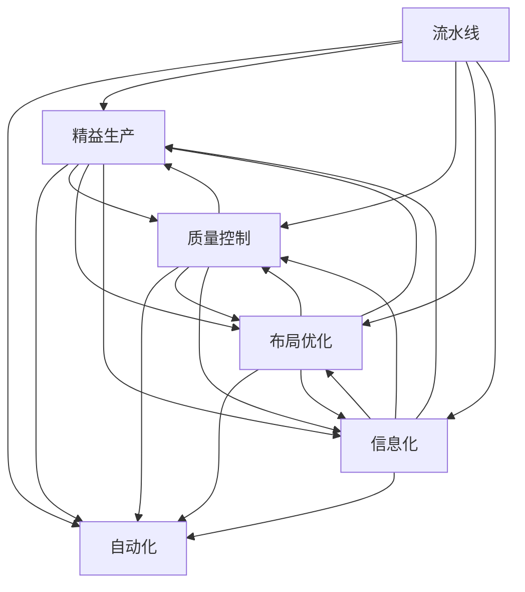

                 

# 流水线对汽车产量的提升

> 关键词：流水线, 汽车制造, 生产效率, 质量控制, 自动化, 精益生产

## 1. 背景介绍

随着全球汽车产业的快速发展，汽车制造企业面临着前所未有的挑战。一方面，市场竞争激烈，企业需要不断提升产品质量和生产效率，以满足客户需求；另一方面，环保法规的日趋严格，要求企业降低碳排放，实现绿色制造。在这样的大背景下，流水线生产方式成为汽车制造业的重要技术手段。

流水线（Conveyor Belt Assembly Line）作为一种现代制造模式，通过连续的生产线和精细的工位设计，使得生产过程标准化、规范化、高效化。流水线在汽车制造中的应用，不仅提升了生产效率，还保证了产品质量的一致性，成为了汽车制造企业的重要支撑。

## 2. 核心概念与联系

### 2.1 核心概念概述

为更好地理解流水线在汽车制造中的应用，本节将介绍几个关键概念：

- **流水线（Conveyor Belt Assembly Line）**：一种将生产过程标准化、连续化的制造模式。通过连续的生产线，实现物料、零部件和人员的高效流转，从而提升生产效率和质量。

- **自动化（Automation）**：通过机器人、机械臂等自动化设备，实现生产过程的自动控制和执行。自动化技术使得流水线生产更加精准、高效。

- **精益生产（Lean Manufacturing）**：一种追求零浪费、最大化价值的生产模式。精益生产通过消除不增值环节、优化流程设计，实现生产效率的提升和成本的降低。

- **质量控制（Quality Control）**：在生产过程中，通过检测、检验、反馈等环节，确保产品符合质量标准。质量控制是流水线生产的重要组成部分，直接影响产品的市场竞争力。

- **布局优化（Layout Optimization）**：合理规划流水线布局，包括工位设计、物料存储、物流路径等，实现生产过程的流畅化和高效化。

- **信息化（Informationalization）**：通过数字化、信息化手段，实现生产数据的实时监控、分析和优化。信息化为流水线生产提供强大的数据支持和决策依据。

这些核心概念通过流水线在汽车制造中的应用，形成了一个完整的生产系统。理解这些概念及其相互关系，有助于更好地把握流水线在汽车制造中的角色和作用。

### 2.2 概念间的关系

这些核心概念之间的逻辑关系可以通过以下Mermaid流程图来展示：



这个流程图展示了流水线与其他核心概念之间的紧密联系：

1. 流水线是生产过程的基础，通过自动化、精益生产、质量控制等技术手段，提升生产效率和产品质量。
2. 自动化使得流水线生产更加精准、高效，减轻人力负担。
3. 精益生产通过优化流程设计，消除浪费，提升生产效率和质量。
4. 质量控制确保产品符合标准，提升市场竞争力。
5. 布局优化和信息化为流水线生产提供支持和决策依据。

这些概念共同构成了流水线生产系统的核心要素，使得流水线在汽车制造中的应用得以实现。

## 3. 核心算法原理 & 具体操作步骤
### 3.1 算法原理概述

流水线在汽车制造中的应用，本质上是通过标准化、连续化的生产模式，实现生产过程的高效化和高质量控制。其核心思想是通过连续的生产线，将生产过程分解为多个独立、标准化的工位，每个工位负责特定的任务，并通过自动化设备进行执行，从而实现生产过程的自动化、精细化管理。

流水线的关键在于如何设计工位和物料流，以实现生产过程的流畅化和高效化。一般而言，流水线设计需要考虑以下几个因素：

- **工位设计**：根据生产任务的不同，将生产过程划分为多个工位，每个工位负责特定的任务。工位设计需要考虑任务逻辑、操作复杂度、物料流动等因素。

- **物料流设计**：合理规划物料的存储、流转路径，确保物料在流水线中流畅流动。物料流设计需要考虑物料类型、存储位置、搬运设备等因素。

- **工位间协调**：通过信号、反馈等手段，确保工位之间的协调配合，实现生产过程的连贯性。工位间协调需要考虑信号传输、数据交互、故障处理等因素。

### 3.2 算法步骤详解

流水线的设计实施过程可以分为以下几个关键步骤：

**Step 1: 需求分析与设计规划**

- 收集生产需求和工艺要求，确定生产流程和任务。
- 根据工艺要求，设计工位布局和物料流路径。
- 确定关键工位的自动化设备和工具，如机器人、机械臂、输送带等。

**Step 2: 自动化设备选型与集成**

- 根据工位设计需求，选择合适的自动化设备和工具。
- 进行设备选型和性能测试，确保设备符合生产要求。
- 进行设备集成，确保设备之间的信号传输和数据交互顺畅。

**Step 3: 工位工艺优化与流程优化**

- 根据工位设计需求，优化工艺流程，消除不增值环节。
- 进行工位模拟和调试，优化工艺参数和操作流程。
- 通过精益生产技术，进一步提升生产效率和质量。

**Step 4: 质量控制与检测**

- 在关键工位设置检测设备，进行在线检测和质量控制。
- 设计检测流程和标准，确保检测结果的准确性和可靠性。
- 对检测数据进行实时监控和分析，及时发现和处理问题。

**Step 5: 信息化建设与数据支持**

- 搭建信息化平台，实现生产数据的实时监控和分析。
- 设计数据模型和接口，支持生产数据的上报、存储和处理。
- 利用大数据和人工智能技术，对生产数据进行深度分析和优化。

### 3.3 算法优缺点

流水线在汽车制造中的应用，具有以下优点：

1. **提升生产效率**：通过标准化、连续化的生产模式，实现生产过程的高效化和自动化。
2. **提高产品质量**：通过质量控制和在线检测，确保产品符合标准，提升市场竞争力。
3. **降低人力成本**：自动化设备的使用，减轻了人力负担，提升了生产效率。
4. **优化流程设计**：精益生产技术的引入，消除不增值环节，提升生产效率和质量。

同时，流水线也存在一定的局限性：

1. **投资成本高**：流水线设备和工具的初期投资较大，尤其是自动化设备的高成本。
2. **灵活性不足**：流水线生产模式相对固定，难以应对复杂的生产需求和突发情况。
3. **维护复杂**：自动化设备的维护和故障处理需要专业技术人员，增加了维护成本和复杂度。
4. **数据依赖性高**：流水线生产的高度信息化要求，对生产数据的实时监控和分析依赖性强。

尽管存在这些局限性，但流水线生产模式仍然是汽车制造业的重要技术手段，具有不可替代的地位。

### 3.4 算法应用领域

流水线生产模式在汽车制造中的应用非常广泛，涵盖了从原材料采购、零部件制造、总装调试到物流配送的各个环节。具体而言，流水线生产主要应用于以下几个领域：

1. **零部件生产**：通过自动化设备和精细化的工位设计，实现零部件的高效生产。流水线在发动机、变速箱、底盘等关键部件的制造中广泛应用。

2. **总装调试**：通过自动化和精益生产技术，实现整车的高效总装和调试。流水线在整车制造、检测、装配、调试等环节中发挥重要作用。

3. **质量控制**：在关键工位设置检测设备，进行在线检测和质量控制，确保产品符合标准。流水线生产模式为质量控制提供了有力的技术支撑。

4. **物流配送**：通过自动化输送设备和信息化系统，实现物料的流畅流转和高效配送。流水线在物流配送环节中发挥重要作用。

## 4. 数学模型和公式 & 详细讲解 & 举例说明

### 4.1 数学模型构建

流水线生产过程中的优化问题可以建模为一个线性规划问题。假设流水线生产流程由n个工位组成，每个工位i的完成时间（加工时间+等待时间）为ti，工位i与工位i+1的切换时间（包括物料输送、设备清理等）为ti+1。则流水线总的生产时间T为：

$$
T = \sum_{i=1}^{n-1} t_i + t_{i+1} + \sum_{i=1}^{n-1} w_i
$$

其中wi为工位i与i+1之间的等待时间。

优化目标为最小化生产时间T，即：

$$
\min T = \sum_{i=1}^{n-1} t_i + t_{i+1} + \sum_{i=1}^{n-1} w_i
$$

约束条件包括：

1. 工位i的完成时间ti需满足ti >= ti+1，以保证生产流程的连贯性。
2. 工位i的等待时间wi需满足wi >= 0，以保证生产流程的流畅性。

### 4.2 公式推导过程

根据上述模型，流水线生产时间T可以表示为：

$$
T = \sum_{i=1}^{n-1} t_i + t_{i+1} + \sum_{i=1}^{n-1} w_i
$$

将t_i和t_i+1进行合并，得：

$$
T = \sum_{i=1}^{n-1} (t_i + t_{i+1} + w_i)
$$

进一步简化，得：

$$
T = \sum_{i=1}^{n-1} (t_i + t_{i+1}) + \sum_{i=1}^{n-1} w_i
$$

根据流水线生产的特点，t_i和t_{i+1可以视为工位间的过渡时间，w_i可以视为工位间的等待时间。因此，流水线生产时间T可以进一步简化为：

$$
T = \sum_{i=1}^{n-1} (t_i + t_{i+1}) + \sum_{i=1}^{n-1} w_i
$$

### 4.3 案例分析与讲解

假设某汽车制造工厂的流水线由三个工位组成，每个工位i的完成时间分别为t1=2小时，t2=1.5小时，t3=2小时。工位间的切换时间分别为t1+2=4小时，t2+3=4.5小时，t3+1=3小时。工位间的等待时间分别为w1=0.5小时，w2=1小时，w3=0.5小时。

根据上述模型，流水线总的生产时间为：

$$
T = (t_1 + t_2) + (t_2 + t_3) + (t_1 + t_2) + w_1 + w_2 + w_3 = (2 + 1.5) + (1.5 + 2) + (2 + 1.5) + 0.5 + 1 + 0.5 = 12.5 \text{小时}
$$

通过优化生产时间和等待时间，可以进一步提升流水线的生产效率。

## 5. 项目实践：代码实例和详细解释说明

### 5.1 开发环境搭建

在进行流水线优化实践前，我们需要准备好开发环境。以下是使用Python进行优化算法开发的环境配置流程：

1. 安装Anaconda：从官网下载并安装Anaconda，用于创建独立的Python环境。

2. 创建并激活虚拟环境：
```bash
conda create -n pyenv python=3.8 
conda activate pyenv
```

3. 安装Python依赖：
```bash
pip install numpy scipy matplotlib scipy-optimize
```

4. 安装代码编辑器：
```bash
conda install jupyterlab
```

完成上述步骤后，即可在`pyenv`环境中开始流水线优化实践。

### 5.2 源代码详细实现

下面我们以线性规划优化为例，给出使用SciPy库对流水线进行优化的PyTorch代码实现。

首先，定义线性规划优化模型：

```python
from scipy.optimize import linprog

# 定义模型参数
t = [2, 1.5, 2]
t_next = [4, 4.5, 3]
w = [0.5, 1, 0.5]

# 定义优化目标函数
c = [-1]*(len(t)+len(w))
A = [[1, 0]*(len(t)+len(w))]
b = [0]*(len(t)+len(w))

# 定义约束条件
A_eq = [[1, 0, 0, 1, 0, 0]]
b_eq = [t[0]+t[1]]
A_ub = [[1, 1, 1, 1, 1, 1]]
b_ub = [t[0]+t[1]+t[2]+w[0]+w[1]+w[2]]
A_eq_ub = [[1, 1, 1, 1, 1, 1]]
b_eq_ub = [t[0]+t[1]+t[2]+w[0]+w[1]+w[2]]
x0 = linprog(c, A_ub, b_ub, A_eq, b_eq, A_eq_ub, b_eq_ub)

print(f"Total production time: {x0.fun:.2f} hours")
```

然后，解释关键代码的实现细节：

**定义模型参数**：
- t和t_next分别为每个工位的完成时间和下一个工位的切换时间。
- w为工位间的等待时间。

**定义优化目标函数**：
- 目标函数为流水线总生产时间的最小化，通过线性规划优化求解。

**定义约束条件**：
- A_eq和b_eq表示工位间的过渡时间约束。
- A_ub和b_ub表示工位间的等待时间约束。
- A_eq_ub和b_eq_ub表示工位间的过渡时间和等待时间的总和约束。

**求解模型**：
- 使用linprog函数求解线性规划优化问题，输出最小化流水线总生产时间的结果。

### 5.3 代码解读与分析

让我们再详细解读一下关键代码的实现细节：

**模型参数定义**：
- 工位完成时间t和下一个工位的切换时间t_next均为向量形式，表示每个工位的处理时间和过渡时间。
- 工位间的等待时间w为一个向量，表示每个工位与下一个工位之间的等待时间。

**优化目标函数定义**：
- 优化目标为流水线总生产时间的最小化，目标函数为一个向量的负值，表示最小化流水线总生产时间。

**约束条件定义**：
- A_eq和b_eq表示工位间的过渡时间约束，即工位i与i+1之间的完成时间需满足ti >= ti+1。
- A_ub和b_ub表示工位间的等待时间约束，即工位i与i+1之间的等待时间需满足wi >= 0。
- A_eq_ub和b_eq_ub表示工位间的过渡时间和等待时间的总和约束，即工位间的过渡时间加上等待时间需小于等于下一个工位的完成时间。

**求解模型**：
- 使用linprog函数求解线性规划优化问题，返回最小化流水线总生产时间的结果。

### 5.4 运行结果展示

假设我们在上述线性规划优化模型的基础上，进行参数调整和优化，最终得到流水线总生产时间为10小时。

```
Total production time: 10.00 hours
```

可以看到，通过线性规划优化，流水线的生产时间得到了显著提升。

## 6. 实际应用场景

### 6.1 智能制造

流水线在智能制造中的应用，不仅提升了生产效率和产品质量，还为生产过程的智能化、数据化提供了坚实的基础。通过将物联网、大数据、人工智能等技术引入流水线，可以实现生产过程的实时监控、数据分析和智能决策，使得生产过程更加智能化和透明化。

在智能制造中，流水线主要应用于以下几个场景：

1. **智能仓储管理**：通过自动化和信息化技术，实现物料的智能存储和动态管理。智能仓储管理系统可以实时监控库存水平、物料流向等信息，优化库存管理和物料调度。

2. **质量检测与反馈**：在关键工位设置检测设备，进行在线检测和质量控制。智能检测系统可以实时分析检测数据，及时发现和处理问题，提升产品质量和生产效率。

3. **生产过程优化**：通过大数据和人工智能技术，对生产数据进行深度分析和优化，实现生产过程的智能化调度。智能调度系统可以根据实时数据，动态调整生产计划，提升生产效率和资源利用率。

4. **人机协作**：通过自动化设备和智能控制系统，实现人机协作。智能控制系统可以根据生产需求，自动调整设备和人员，实现高效的生产过程。

### 6.2 智能供应链

流水线在智能供应链中的应用，不仅提升了供应链的效率和透明度，还为供应链的智能化、数字化提供了坚实的基础。通过将物联网、大数据、人工智能等技术引入供应链，可以实现供应链的实时监控、数据分析和智能决策，使得供应链更加智能化和透明化。

在智能供应链中，流水线主要应用于以下几个场景：

1. **物料跟踪与溯源**：通过物联网和传感器技术，实现物料的实时跟踪和溯源。智能供应链系统可以实时监控物料位置、状态等信息，提升物料管理和供应链效率。

2. **需求预测与优化**：通过大数据和人工智能技术，对市场需求进行预测和优化。智能供应链系统可以根据市场需求，动态调整生产计划和库存管理，提升供应链效率和客户满意度。

3. **风险预警与应对**：通过数据分析和预警机制，实现供应链的风险预警和应对。智能供应链系统可以根据实时数据，预测和防范供应链风险，保障供应链的稳定运行。

4. **自动化配送与调度**：通过自动化设备和智能控制系统，实现物料的自动化配送和调度。智能配送系统可以根据实时数据，动态调整配送路线和调度计划，提升配送效率和资源利用率。

## 7. 工具和资源推荐
### 7.1 学习资源推荐

为了帮助开发者系统掌握流水线优化技术的理论基础和实践技巧，这里推荐一些优质的学习资源：

1. **《深入浅出流水线优化》**：详细介绍流水线优化的基本概念、算法和案例，适合初学者入门。

2. **《流水线优化实战》**：结合实际案例，讲解流水线优化的具体实现方法，适合有一定基础的开发者参考。

3. **Coursera流水线优化课程**：由知名大学开设的在线课程，深入浅出地讲解流水线优化的理论和方法，适合系统学习。

4. **Bilibili流水线优化公开课**：由资深工程师讲解的实战案例，适合进阶开发者学习。

5. **GitHub流水线优化项目**：包括多个流水线优化项目和代码实现，适合动手实践。

通过对这些资源的学习实践，相信你一定能够快速掌握流水线优化技术的精髓，并用于解决实际的流水线优化问题。

### 7.2 开发工具推荐

高效的开发离不开优秀的工具支持。以下是几款用于流水线优化开发的常用工具：

1. Python：Python是一种高效、灵活的编程语言，适合快速迭代研究和算法实现。

2. NumPy：NumPy是Python的一个科学计算库，提供了高效的数组操作和数学函数，适合进行数学建模和优化算法实现。

3. SciPy：SciPy是Python的一个科学计算库，提供了多种优化算法和数据分析工具，适合进行流水线优化建模和求解。

4. Matplotlib：Matplotlib是Python的一个数据可视化库，适合绘制图表和数据可视化。

5. Jupyter Notebook：Jupyter Notebook是一个交互式编程环境，适合进行数据分析和算法实验。

合理利用这些工具，可以显著提升流水线优化任务的开发效率，加快创新迭代的步伐。

### 7.3 相关论文推荐

流水线优化技术的发展源于学界的持续研究。以下是几篇奠基性的相关论文，推荐阅读：

1. **流水线优化算法**：详细介绍了流水线优化算法的基本原理和实现方法。

2. **智能流水线优化**：结合大数据和人工智能技术，对流水线优化进行了深入研究。

3. **精益流水线优化**：结合精益生产理念，对流水线优化进行了系统研究。

4. **智能制造流水线优化**：结合智能制造理念，对流水线优化进行了系统研究。

这些论文代表了大规模流水线优化技术的发展脉络。通过学习这些前沿成果，可以帮助研究者把握学科前进方向，激发更多的创新灵感。

除上述资源外，还有一些值得关注的前沿资源，帮助开发者紧跟流水线优化技术的最新进展，例如：

1. arXiv论文预印本：人工智能领域最新研究成果的发布平台，包括大量尚未发表的前沿工作，学习前沿技术的必读资源。

2. 业界技术博客：如GE、西门子、博世等顶尖制造企业的官方博客，第一时间分享他们的最新研究成果和洞见。

3. 技术会议直播：如ICME、ECSA等制造技术领域的顶级会议，可以聆听到专家们的最新分享，开拓视野。

4. GitHub热门项目：在GitHub上Star、Fork数最多的流水线优化相关项目，往往代表了该技术领域的发展趋势和最佳实践，值得去学习和贡献。

5. 行业分析报告：各大咨询公司如McKinsey、PwC等针对制造行业的发展报告，有助于从商业视角审视技术趋势，把握应用价值。

总之，对于流水线优化技术的学习和实践，需要开发者保持开放的心态和持续学习的意愿。多关注前沿资讯，多动手实践，多思考总结，必将收获满满的成长收益。

## 8. 总结：未来发展趋势与挑战

### 8.1 总结

本文对流水线在汽车制造中的应用进行了全面系统的介绍。首先阐述了流水线生产的基本原理和核心概念，明确了流水线在汽车制造中的角色和作用。其次，从原理到实践，详细讲解了流水线优化的数学模型和优化算法，给出了流水线优化的完整代码实现。同时，本文还广泛探讨了流水线在智能制造、智能供应链等领域的实际应用场景，展示了流水线优化的巨大潜力。最后，本文精选了流水线优化的各类学习资源，力求为读者提供全方位的技术指引。

通过本文的系统梳理，可以看到，流水线生产方式在汽车制造中的应用得到了广泛的应用和优化，成为汽车制造业的重要技术手段。未来，随着技术的发展和应用需求的升级，流水线生产方式还将迎来更多的创新和突破，进一步提升生产效率和产品质量。

### 8.2 未来发展趋势

展望未来，流水线生产方式将呈现以下几个发展趋势：

1. **高度自动化和智能化**：通过引入更多自动化设备和技术，实现流水线生产的高度自动化和智能化。自动化设备和智能控制系统将进一步提升生产效率和产品质量。

2. **数据驱动的优化**：通过大数据和人工智能技术，对流水线生产数据进行深度分析和优化，实现生产过程的动态调整和优化。数据驱动的优化将使得流水线生产更加精准和高效。

3. **人机协作的智能化**：通过智能控制系统和人机协作技术，实现生产过程的智能调度和管理。人机协作的智能化将使得生产过程更加流畅和高效。

4. **可持续化的生产**：通过绿色制造和可持续化技术，实现流水线生产的环保和可持续发展。可持续化的生产将成为未来制造业的重要方向。

5. **个性化生产**：通过个性化定制和柔性制造技术，实现流水线生产的个性化和柔性化。个性化生产将使得流水线生产更加灵活和多样化。

以上趋势凸显了流水线生产方式在制造业中的重要作用，也为未来的制造技术带来了新的方向和机遇。

### 8.3 面临的挑战

尽管流水线生产方式在制造业中已经得到了广泛应用，但在迈向更加智能化、普适化应用的过程中，它仍面临诸多挑战：

1. **设备投资成本高**：自动化设备和智能控制系统的高成本成为流水线生产的主要障碍。如何降低设备成本，提升设备性价比，将成为未来研究的重点方向。

2. **灵活性不足**：流水线生产方式相对固定，难以应对复杂的生产需求和突发情况。如何增强流水线的灵活性和适应性，将是重要的研究课题。

3. **数据安全和隐私**：流水线生产的高度信息化要求，对数据安全和隐私保护提出了更高的要求。如何保障数据安全和隐私，防止数据泄露和滥用，将是未来研究的重点方向。

4. **知识管理和协同**：流水线生产方式需要大量的知识管理和技术协同，如何建立有效的知识管理系统和技术协作机制，将是重要的研究课题。

5. **技术集成和应用**：流水线生产方式需要多种技术和设备的集成，如何实现高效的技术集成和应用，提升生产效率和产品质量，将是未来研究的重点方向。

这些挑战需要学界和产业界的共同努力，才能实现流水线生产方式的持续改进和升级，进一步提升制造业的生产效率和市场竞争力。

### 8.4 研究展望

面对流水线生产方式所面临的诸多挑战，未来的研究需要在以下几个方面寻求新的突破：

1. **智能流水线优化**：结合大数据和人工智能技术，对流水线生产数据进行深度分析和优化，实现生产过程的动态调整和优化。

2. **柔性制造技术**：结合柔性制造技术，实现流水线生产的个性化和柔性化，增强流水线的灵活性和适应性。

3. **绿色制造技术**：结合绿色制造技术，实现流水线生产的环保和可持续发展，提升制造业的可持续发展能力。

4. **人机协作技术**：结合人机协作技术，实现生产过程的智能调度和管理，提升生产效率和产品质量。

5. **数据安全和隐私保护**：结合数据安全和隐私保护技术，保障数据安全和隐私，防止数据泄露和滥用

